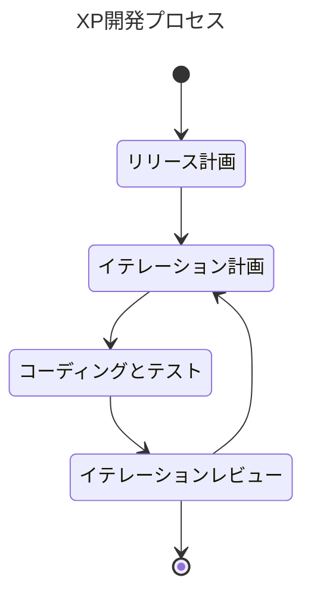

# 1. 開発プロセス

採用する開発プロセスを決定する。

日付: 2024-11-13

## ステータス

2024-11-13 提案されました

## コンテキスト

アジャイル開発の中で、[SCRUM](https://ja.wikipedia.org/wiki/%E3%82%B9%E3%82%AF%E3%83%A9%E3%83%A0_(%E3%82%BD%E3%83%95%E3%83%88%E3%82%A6%E3%82%A7%E3%82%A2%E9%96%8B%E7%99%BA))と[XP](https://ja.wikipedia.org/wiki/%E3%82%A8%E3%82%AF%E3%82%B9%E3%83%88%E3%83%AA%E3%83%BC%E3%83%A0%E3%83%BB%E3%83%97%E3%83%AD%E3%82%B0%E3%83%A9%E3%83%9F%E3%83%B3%E3%82%B0)が有名である。SCRUMは経験プロセスを管理することを重視し、XPはプラクティスを重視する。どちらもアジャイル開発の価値観を共有している。
今回は、どちらか一方を採用するか、または両方を組み合わせるかを決定する。

## 決定

XPを採用する、理由は以下の通り。

- 今回の開発はチームでなく個人で行うため、XPのプラクティスを実践することで、開発プロセスを改善することができる。
- SCRUMに比べて開発プロセスがシンプルであるため、適応コストが低い。

開発プロセスは以下の通り。

## 影響

ポジティブ:
  - 開発者はXPのプラクティスを実践することで、開発プロセスを改善することができる。
   
ネガティブ:
  - 従来の開発プロセスとの違いによる適応コストが発生する可能性がある。

## コプライアンス

各テーマは個別に検討する。

- 計画ゲーム
- 顧客テスト
- 小規模リリース
- シンプルな設計
- ペアプログラミング
- テスト駆動開発
- リファクタリング
- 集団所有権
- 継続的インテグレーション
- 持続可能なペース
- メタファー
- コーディング規約

## 備考

- 著者: k2works
- バージョン: 0.1
- 変更ログ:
  - 0.1: 初回提案バージョン
