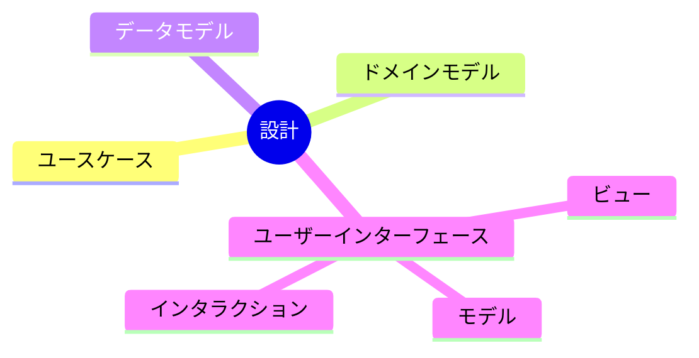
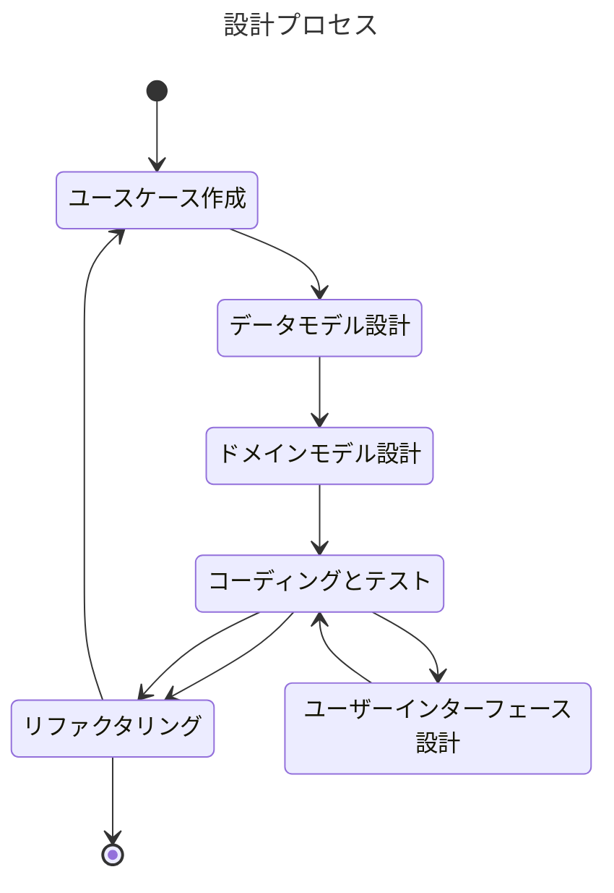

# 2. シンプルな設計

設計アプローチに関して決定する

日付: 2024-11-14

## ステータス

2024-11-14 提案されました

## コンテキスト

アプリケーションを構成する設計要素に以下のものが含まれる。

- ユースケース
- ドメインモデル
- データモデル
- ユーザーインターフェース

## 決定

以下の設計プロセスを採用する。

## 影響

ポジティブ
- 設計プロセスが明確になる

ネガティブ
- 開発者により設計に関する考えが異なるため、設計プロセスが適用されない可能性がある

## コプライアンス

開発支援ツールを使用して設計プロセスを実行する

## 備考

- 著者: k2works
- バージョン: 0.1
- 変更ログ:
    - 0.1: 初回提案バージョン
