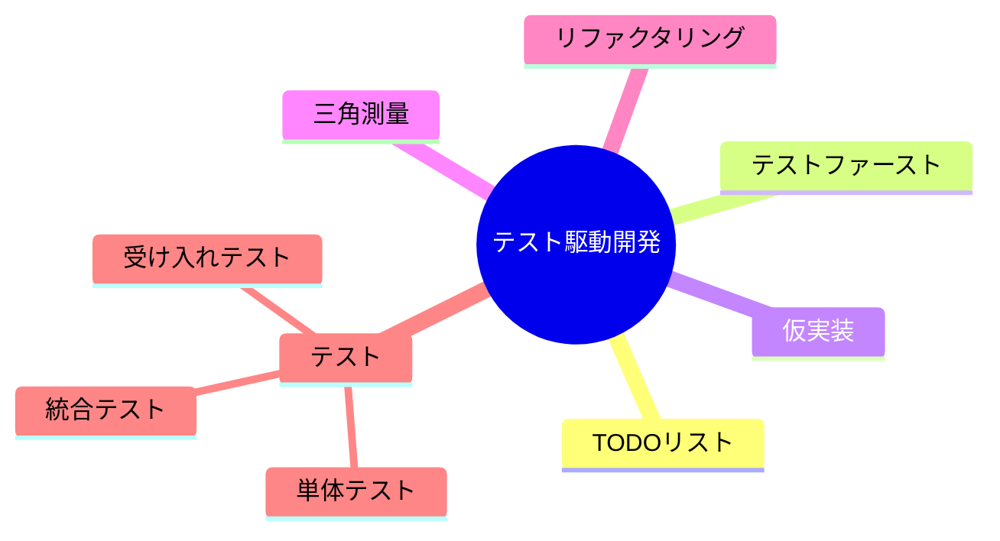
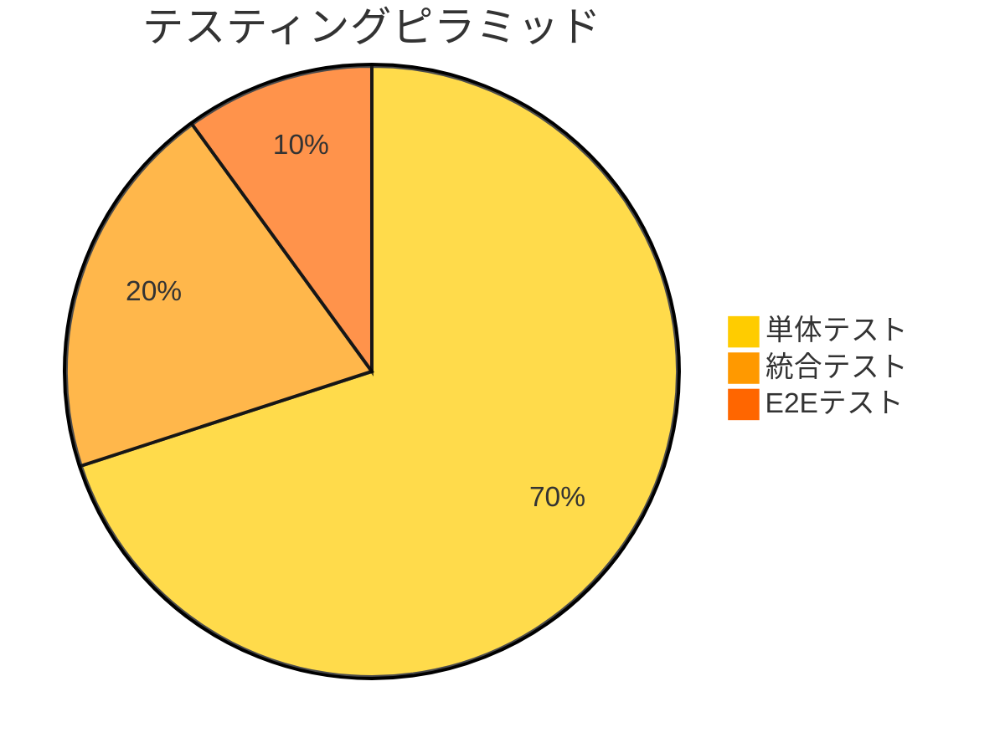
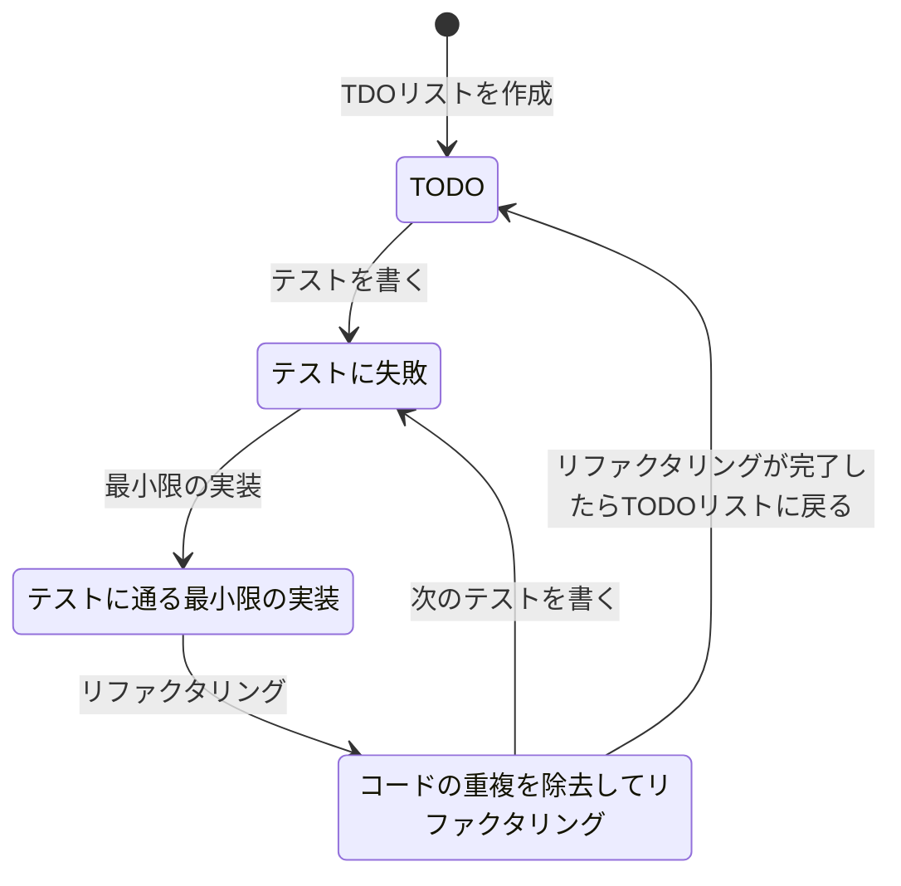

# 3. テスト駆動開発

テスト駆動開発の進め方についての決定

日付: 2024-11-14

## ステータス

2024-11-14 提案されました

## コンテキスト

ここで対象となるテストは単体テストである。

## 決定

コーディングとテストにおいていは[テスト駆動開発](https://ja.wikipedia.org/wiki/%E3%83%86%E3%82%B9%E3%83%88%E9%A7%86%E5%8B%95%E9%96%8B%E7%99%BA)の採用する。
理由は、設計のスピードアップと高品質なコードが期待できるから。

## 影響

ポジティブ
- コードの品質が向上する
- 設計のスピードアップが期待できる

ネガティブ
- 従来の開発プロセスとの違いによる適応コストが発生する可能性がある

## コプライアンス

CI/CDと組み合わせて実施する。

## 備考

- 著者: k2works
- バージョン: 0.1
- 変更ログ:
    - 0.1: 初回提案バージョン
