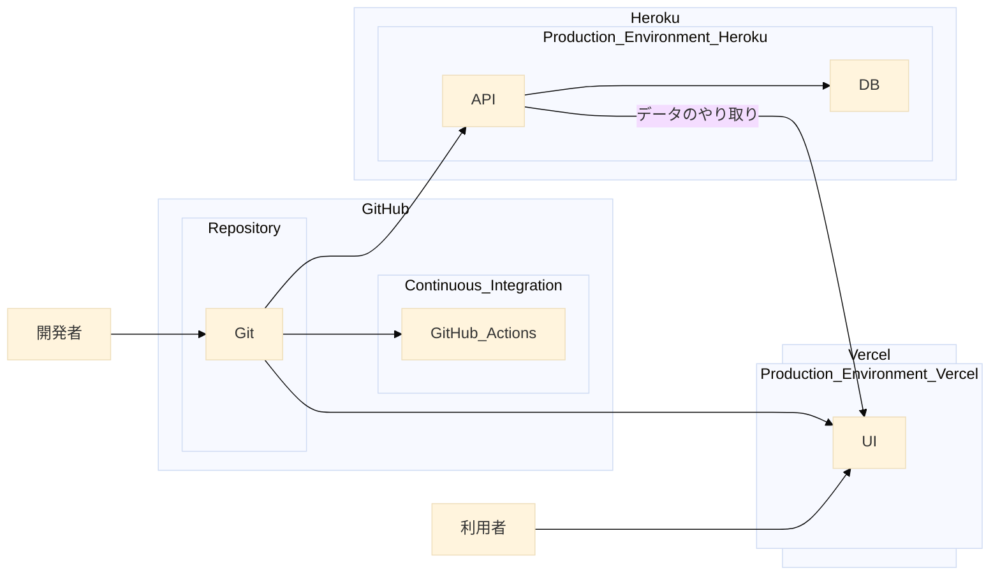

# 5. 継続的インテグレーション

継続的インテグレーションを導入する。

日付: 2024-11-14

## ステータス

2024-11-14 提案されました

## コンテキスト

## 決定

継続的インテグレーションを導入する。理由は以下の通り。

- プロジェクトの品質を保つことができる
- プロジェクトのリスクを軽減できる
- プロジェクトの信頼性を向上できる

## 影響

ポジティブ:
- プロジェクトの品質を保つことができる

ネガティブ:
- 構築の時間がかかる

## コプライアンス

GitHub Actionsを使用する。

## 備考

- 著者: k2works
- バージョン: 0.1
- 変更ログ:
    - 0.1: 初回提案バージョン
