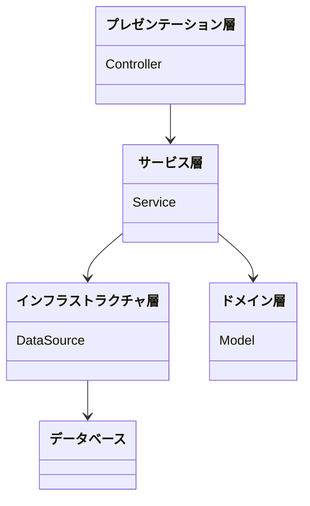

# 6. アプリケーションアーキーテクチャ

アプリケーションアーキテクチャについての決定を記述します。

日付: 2024-11-14

## ステータス

2024-11-14 提案されました

## コンテキスト

## 決定

アーキテクチャスタイルは、レイヤードアーキテクチャを採用。
ドメイン層のアーキテクチャパターンはドメインモデルパターンを採用。

理由は、ドメインモデルパターンは、ビジネスロジックをドメインモデルに集約することで、ビジネスロジックの再利用性を高めることができるため。

## 影響

ポジティブ:
- 複雑なビジネスロジックをドメインモデルに集約することで、ビジネスロジックの再利用性を高めることができる

ネガティブ:
- ドメインモデルパターンを理解するための学習コストがかかる

## コプライアンス

[ArchUnit](https://www.archunit.org/)を使用して、アーキテクチャのコンプライアンスを確認する。

## 備考

- 著者: k2works
- バージョン: 0.1
- 変更ログ:
    - 0.1: 初回提案バージョン
