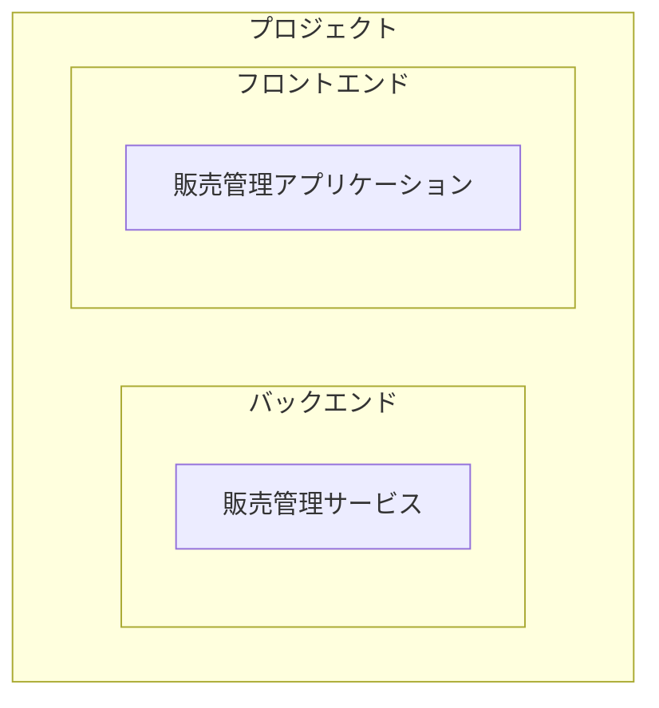
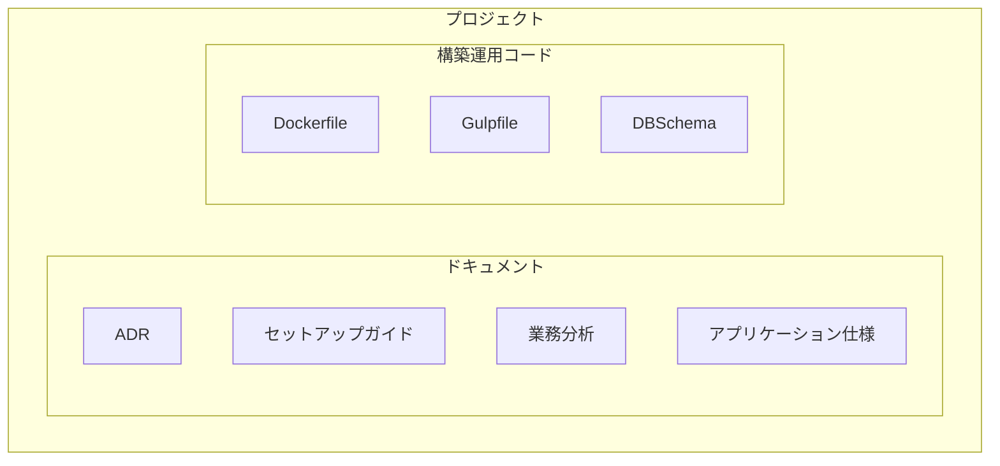

# 7. プロジェクト構成

プロジェクトの構成についての決定

日付: 2024-11-25

## ステータス

2024-11-25 提案されました

## コンテキスト

単一のレポジトリで複数のアプリケーションを開発している。

また、ドキュメントや構築・運用コードも同じレポジトリで管理している。

## 決定

以下のディレクトリ構成を採用する。

- ルート
  - app
    - backend
    - frontend
  - db
  - docs
  - ops

- appディレクトリには、バックエンドとフロントエンドのアプリケーションが配置される。
- dbディレクトリには、データベースのスキーマが配置される。
- docsディレクトリには、ドキュメントが配置される。
- opsディレクトリには、構築・運用コードが配置される。

## 影響

ポジティブ:
- 将来マイクロサービスアーキテクチャ採用において、アプリケーションを分割することができる

ネガティブ:
- プロジェクトの構成が複雑になる

## コプライアンス

gulpのdevタスクで一連のビルドを実行する。

## 備考

- 著者: k2works
- バージョン: 0.1
- 変更ログ:
    - 0.1: 初回提案バージョン
