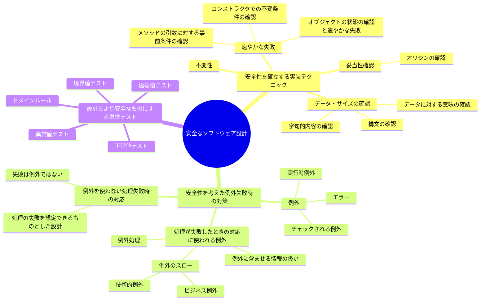

# 10. 安全なソフトウェア設計

安全なソフトウェア開発を行うために、以下の方針を採用する。

日付: 2025-02-13

## ステータス

2025-02-13 提案されました

## コンテキスト

## 決定

- 不変性を実現するために、エンティティ、値オブジェクトにはlombokの`@Value`アノテーションを使用する。
- 事前条件、不変条件、妥当性確認にはApache Commons Langの`Validate`クラスを使用する。
- すべてのpublicメソッドに対して事前条件を確認するようにする。少なくとも、引数の値がnullでないことを確認する。
- エンティティ、値オブジェクトのコンストラクタでの不変条件条件の確認は、コンストラクタ内で行い、契約に従っていないデータが送られてきた場合は、速やかに失敗するようにする。
- 妥当性確認は単体テストで行い、正常値テスト、境界値テスト、異常値テスト、極端値テストを実施する。
- 例外処理はビジネス例外と技術的例外に分け、ビジネス例外は`BusinessException`、技術的例外は`TechnicalException`を使用する。
- 事前条件、不変条件、妥当性確認に失敗した場合は、`IllegalArgumentException` をスローする。

## 影響

ポジティブ:
- **安全性向上**: 不変性の確保と事前条件の確認により、システムが予測不能な状態に陥る可能性が低下します。
- **コードの信頼性強化**: 明確な妥当性確認と速やかな失敗により、エラーの検知と解決が迅速に行われます。
- **メンテナンス性向上**: 一貫した設計原則（例: `@Value`アノテーションや`Validate`クラスの使用）により、コードが読みやすくなり、将来的なアップデートが容易になります。
- **テスト精度向上**: 単体テストで多角的な検証（正常値、境界値、異常値、極端値）が行われることで、バグが早期に発見されます。
- **例外情報の明確化**: 例外に含める情報を明示的にすることにより、デバッグが効率的になります。
- **責任の分離**: ビジネス例外と技術的例外を分ける設計が整備されることで、問題の原因の分類と修正が素早く行えます。

ネガティブ:
- **開発コストの増加**: 新たに導入される設計・開発ルールに対応するために、開発者へのトレーニング時間や学習コストが発生します。
- **コード量の増加**: 不変性確認や妥当性確認のためのコードが増えるため、開発の手間が増加します。
- **パフォーマンスへの影響**: 実行時における妥当性確認や事前条件確認の処理が増えるため、システム全体のパフォーマンスに影響を及ぼす可能性があります。
- **複雑性の増加**: 設計の安全性を高めるための例外管理やルール定義が複雑になるため、新規開発者にとって参入障壁が高くなる可能性があります。

## コプライアンス

CIでの自動化により、コードの品質を保つ。

## 備考

- 著者: k2works
- バージョン: 0.1
- 変更ログ:
    - 0.1: 初回提案バージョン
