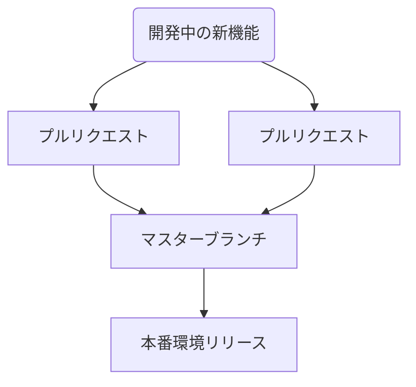
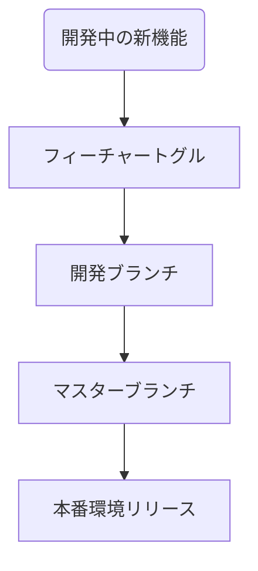

# 12. フィーチャートグル

アプリケーションのフィーチャーを有効化/無効化するための機能を提供する。

日付: 2025-03-15

## ステータス

2025-03-15 提案されました

## コンテキスト

現在のアプリケーションは、リリース単位でプルリクエストをマージすることで新しい機能を追加しています。

## 決定

フィーチャートグルを導入し、新しい機能を有効化/無効化するための機能を提供する。

## 影響

### ポジティブ
1. **柔軟な機能管理**
    - フィーチャートグルを使用することで、リリース後に特定の機能をオン/オフに切り替えられるため、問題が発生した際には迅速に無効化が可能。
    - 大規模な変更を段階的に展開することができ、リスクを分散させる。

2. **テスト戦略の改善**
    - 開発中の機能を本番環境で特定のユーザーにのみ提供することが可能になり、早期のフィードバックを得られる。

3. **リリースプロセスの効率化**
    - PR（プルリクエスト）をマスターブランチにマージしつつ、機能有効化のタイミングを調整可能。

4. **デプロイとリリースの分離**
    - コードのデプロイと機能の提供を分離することで、デプロイ時の影響を軽減しやすい。

5. **ビジネスのアジリティ向上**
    - 新しい機能の市場投入までの時間を短縮できる。ビジネス要件に応じてオンデマンドで機能を展開可能。

---

### ネガティブ
1. **コードベースの複雑化**
    - フィーチャートグルにより、コード内に分岐や条件式が増え、メンテナンスの負担が増加。

2. **技術的負債のリスク**
    - 長期間無効化された機能がコードベースに残った場合、技術的負債として作用し、後のトラブルにつながる可能性がある。

3. **監視と管理のコスト増**
    - フィーチャートグル状態の監視や管理に追加のリソースやコストが必要。

4. **テストの複雑化**
    - 機能の組み合わせごとにテストが必要になり、テストケースの増加を招く。

5. **スケーリングに伴う課題**
    - 多数のフィーチャートグルを導入した場合、状態管理や整合性の維持が難しくなる。

## コプライアンス

- **監査可能なログ**：フィーチャートグルの状態変更について、いつ、誰が操作したかを記録。
- **運用ルールの制定**：トグル利用期間や削除のタイミング、運用基準を明確に定める。
- **管理ツールの導入**：LaunchDarkly、Togglzなどのフィーチャートグル管理ツールを利用。

## 備考

- 著者: k2works
- バージョン: 0.1
- 変更ログ:
    - 0.1: 初回提案バージョン
