# 第1章: プロジェクト概要

## 1.1 販売管理システムとは

### 販売管理システムの業務概要

販売管理システム（Sales Management System）とは、企業の販売活動を効率的に管理するための情報システムです。商品の受注から出荷、売上計上、請求、入金管理に至るまでの一連の販売プロセスを一元的に管理し、業務効率化と経営判断の迅速化を支援します。

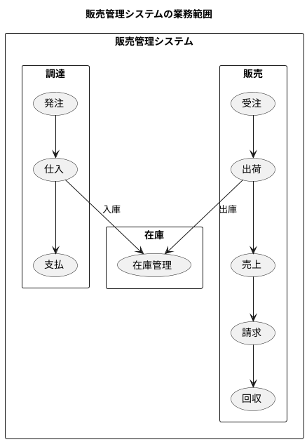

### 販売・調達・在庫の3つの柱

本システムは、企業活動の根幹をなす3つの主要業務領域をカバーしています。

#### 販売管理

販売管理は、顧客からの受注を起点として、出荷・売上・請求・回収までの一連の流れを管理する領域です。

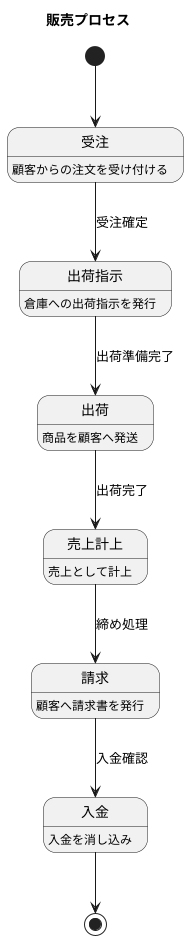

- **受注管理**: 顧客からの注文情報を登録・管理し、納期や数量の調整を行います
- **出荷管理**: 受注に基づいて出荷指示を作成し、倉庫からの出荷を管理します
- **売上管理**: 出荷完了後の売上計上と売上データの管理を行います
- **請求管理**: 締め日に基づいて請求書を作成し、顧客への請求を管理します
- **回収管理**: 入金情報を登録し、売掛金の消込処理を行います

#### 調達管理

調達管理は、仕入先への発注から仕入・支払までの一連の流れを管理する領域です。

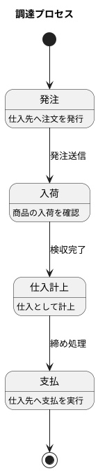

- **発注管理**: 仕入先への発注情報を作成・管理し、発注ステータスを追跡します
- **仕入管理**: 入荷確認と仕入計上を管理します
- **支払管理**: 締め日に基づいて支払予定を作成し、支払処理を管理します

#### 在庫管理

在庫管理は、商品の入出庫を追跡し、適切な在庫水準を維持するための領域です。

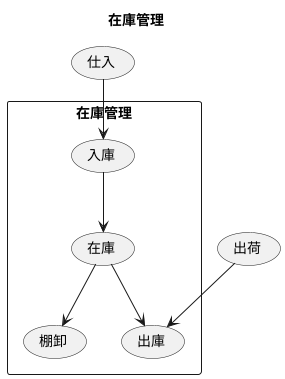

- **倉庫管理**: 商品を保管する倉庫の情報を管理します
- **棚番管理**: 倉庫内のロケーション（棚番）を管理します
- **在庫数量管理**: 商品ごとの在庫数量をリアルタイムで把握します

### ビジネス要件の整理

本システムが満たすべきビジネス要件を以下に整理します。

#### 機能要件

| カテゴリ | 要件 |
|---------|------|
| マスタ管理 | 部門、社員、商品、取引先の情報を管理できる |
| 販売管理 | 受注から回収までの販売プロセスを一元管理できる |
| 調達管理 | 発注から支払までの調達プロセスを一元管理できる |
| 在庫管理 | 在庫の入出庫と現在庫を正確に把握できる |
| ユーザー管理 | ロールベースのアクセス制御ができる |
| 監査 | 操作履歴を記録・参照できる |

#### 非機能要件

| カテゴリ | 要件 |
|---------|------|
| 可用性 | 業務時間中は安定して稼働する |
| 性能 | 一覧表示は3秒以内に応答する |
| セキュリティ | 認証・認可により不正アクセスを防止する |
| 保守性 | 機能追加・変更が容易な構造とする |

---

## 1.2 システム全体像

### ユースケース概要図

本システムの主要なユースケースを以下に示します。

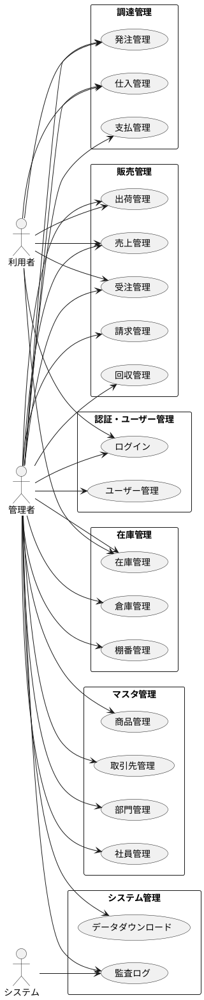

### 主要機能モジュール

#### 認証・ユーザー管理

システムへのアクセスを制御する認証機能と、ユーザー情報を管理する機能を提供します。

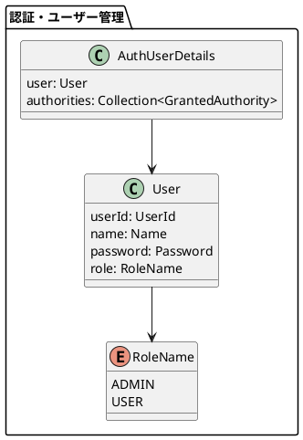

- **ログイン/ログアウト**: JWT トークンによる認証
- **ユーザー CRUD**: ユーザーの登録・編集・削除
- **ロール管理**: 管理者・一般ユーザーのロール割当

#### マスタ管理

システムで使用する基本情報（マスタデータ）を管理します。

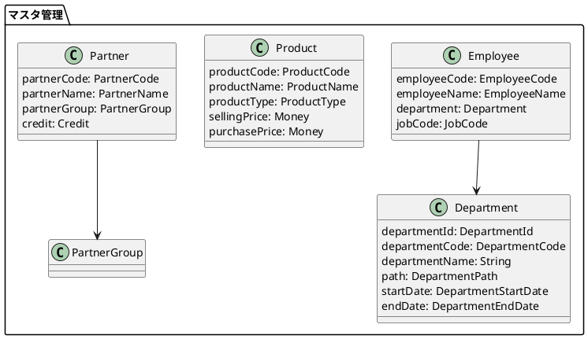

- **部門管理**: 階層構造を持つ部門マスタの管理
- **社員管理**: 社員情報と部門割当の管理
- **商品管理**: 商品情報と顧客別販売単価の管理
- **取引先管理**: 顧客・仕入先を統合したパーティモデルによる管理

#### 販売（受注 → 出荷 → 売上 → 請求 → 回収）

販売プロセス全体を一元管理します。

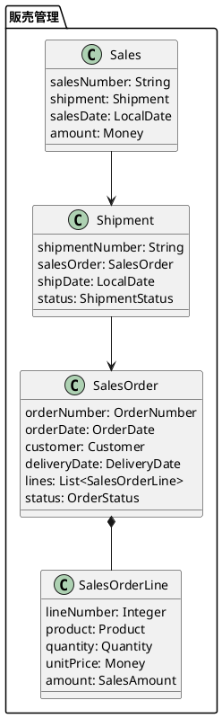

- **受注管理**: 受注登録、受注明細管理、受注ルールチェック
- **出荷管理**: 出荷指示、出荷実績登録
- **売上管理**: 売上計上、売上検索
- **請求管理**: 請求書作成、締め処理
- **回収管理**: 入金登録、消込処理

#### 調達（発注 → 仕入 → 支払）

調達プロセス全体を一元管理します。

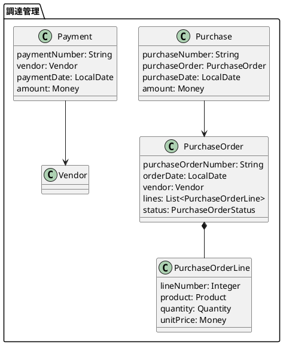

- **発注管理**: 発注登録、発注明細管理、発注ステータス管理
- **仕入管理**: 仕入確認、仕入計上
- **支払管理**: 支払予定作成、支払実績登録

#### 在庫管理

在庫の入出庫と現在庫を管理します。

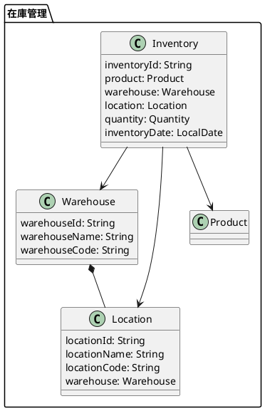

- **倉庫管理**: 倉庫マスタの登録・管理
- **棚番管理**: ロケーション（棚番）の登録・管理
- **在庫管理**: 在庫数量の登録・参照、在庫ルール管理

---

## 1.3 開発手法

### エクストリームプログラミング（XP）の採用

本プロジェクトでは、アジャイル開発手法の一つであるエクストリームプログラミング（XP）を採用しています。

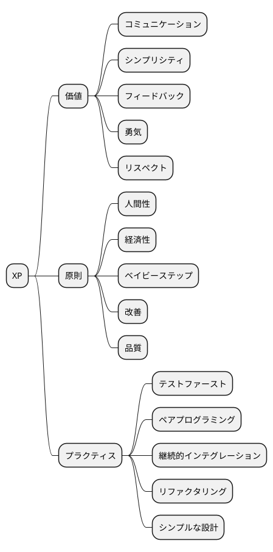

#### XP の価値

| 価値 | 本プロジェクトでの実践 |
|------|----------------------|
| コミュニケーション | コードとテストによる意図の明示化 |
| シンプリシティ | 必要最小限の実装から始める |
| フィードバック | TDD による即座の検証 |
| 勇気 | 大胆なリファクタリング |
| リスペクト | コード品質への継続的な配慮 |

### テスト駆動開発（TDD）

本プロジェクトでは、テスト駆動開発（Test-Driven Development）を実践しています。

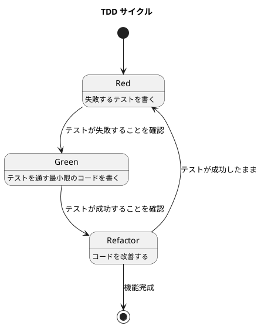

#### TDD の3つのステップ

1. **Red（レッド）**: まず失敗するテストを書く
2. **Green（グリーン）**: テストを通す最小限のコードを実装する
3. **Refactor（リファクタ）**: テストを維持しながらコードを改善する

#### TDD の効果

- **設計の改善**: テストしやすいコードは疎結合で凝集度が高い
- **ドキュメント**: テストがコードの仕様書となる
- **リグレッション防止**: 変更による退行を即座に検出
- **開発リズム**: 小さなサイクルで着実に前進

### 継続的インテグレーション

変更を頻繁に統合し、自動テストで品質を担保します。

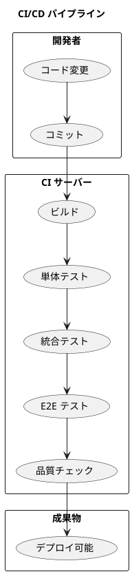

- **10分ビルド**: ビルドと全テストを10分以内に完了
- **自動テスト**: 単体・統合・E2E テストの自動実行
- **品質チェック**: SonarQube によるコード品質分析

### イテレーティブな開発サイクル

週次・四半期のサイクルで計画と振り返りを繰り返します。

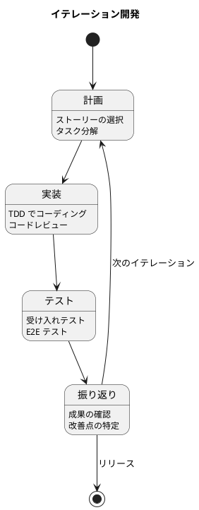

---

## 1.4 本書の構成

### 各章で扱う機能とテーマ

本書は8部23章で構成され、販売管理システムの開発過程を段階的に解説します。

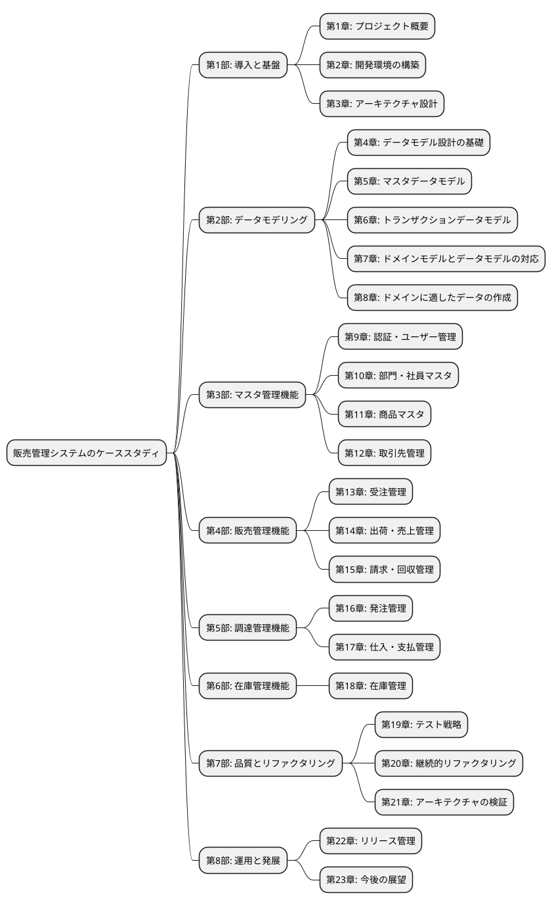

#### 第1部: 導入と基盤（第1〜3章）

システムの概要と開発環境、アーキテクチャの基盤を解説します。

#### 第2部: データモデリング（第4〜8章）

広域データモデリングを先行して実施し、システム全体のデータ構造を設計します。これにより、後続の機能開発時にデータモデルの妥当性が保証されます。

#### 第3部〜第6部: 機能開発（第9〜18章）

各機能を TDD で実装していく過程を、実際のコードとともに解説します。

#### 第7部: 品質とリファクタリング（第19〜21章）

テスト戦略、継続的なリファクタリング、アーキテクチャの検証について解説します。

#### 第8部: 運用と発展（第22〜23章）

リリース管理と今後の展望について解説します。

### コードリポジトリの活用方法

本書のコードは GitHub で公開されています。

#### リポジトリ構成

```
case-study-sales/
├── app/
│   ├── backend/
│   │   └── api/          # Spring Boot バックエンド
│   └── frontend/
│       └── sms/          # React フロントエンド
├── docs/
│   ├── article/          # 本書原稿
│   ├── assets/           # 図表、仕様書
│   ├── reference/        # リファレンスガイド
│   └── wiki/             # 開発 Wiki
└── scripts/              # ビルド・開発スクリプト
```

#### 章ごとのブランチ/タグ

各章の完成時点のコードは、対応するバージョンタグで参照できます。

| 章 | バージョン | 内容 |
|----|-----------|------|
| 第9章完了 | v0.1.0 | 認証・ユーザー管理 |
| 第10章完了 | v0.2.0 | 部門・社員マスタ |
| 第11章完了 | v0.3.0 | 商品マスタ |
| 第12章完了 | v0.4.0 | 取引先管理 |
| 第13章完了 | v0.6.0 | 受注管理 |
| 第16章完了 | v0.7.0 | 発注管理 |
| 第14章完了 | v0.8.0 | 出荷・売上管理 |
| 第18章完了 | v0.10.0 | 在庫管理 |
| 第17章完了 | v0.11.0 | 仕入・支払管理 |

#### 実行方法

```bash
# リポジトリのクローン
git clone https://github.com/your-repo/case-study-sales.git
cd case-study-sales

# 特定バージョンへの切り替え
git checkout v0.1.0

# バックエンドの起動
cd app/backend/api
./gradlew bootRun

# フロントエンドの起動（別ターミナル）
cd app/frontend/sms
npm install
npm run dev
```

---

## まとめ

本章では、販売管理システムの概要と本書の構成について説明しました。

- 販売管理システムは**販売・調達・在庫**の3つの業務領域をカバーする
- **エクストリームプログラミング（XP）**と**テスト駆動開発（TDD）**を開発手法として採用
- 本書は**広域データモデリング**を先行し、**TDD による実装**を通じてプロジェクトを再現可能な構成

次章では、開発環境の構築について解説します。
