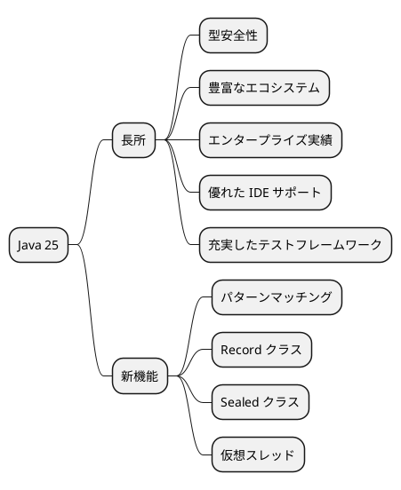
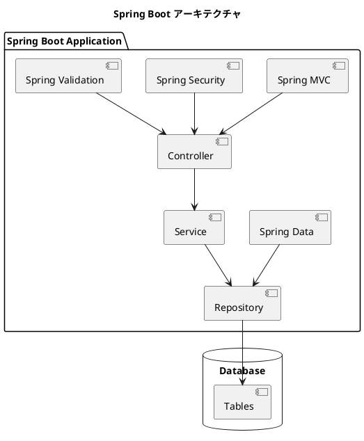
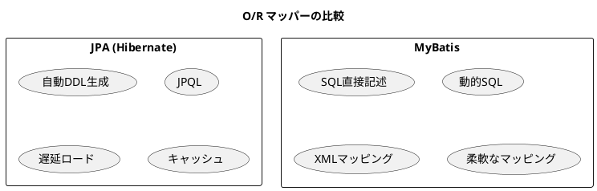
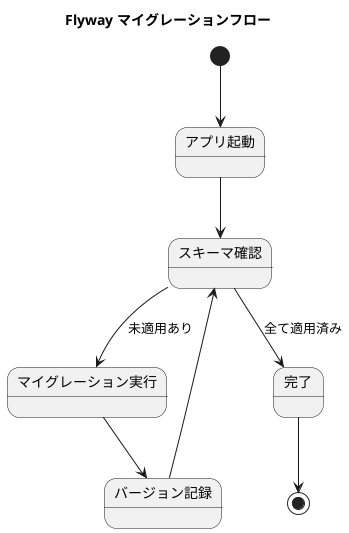
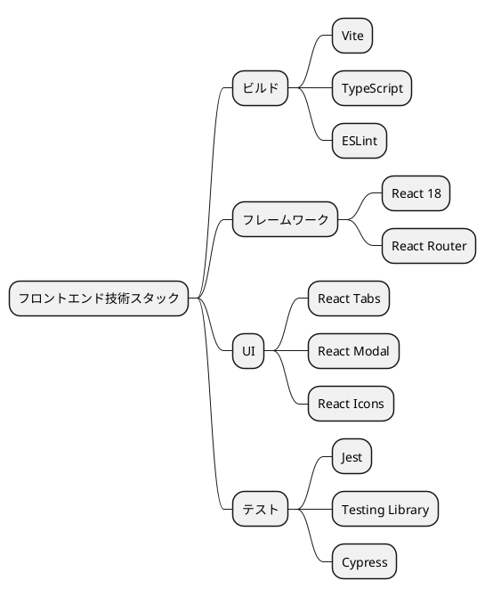
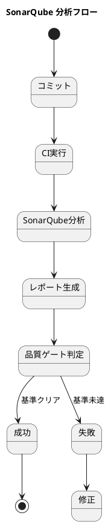
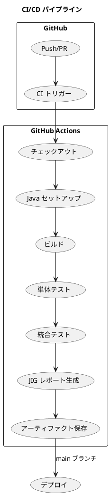
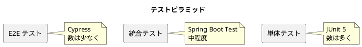
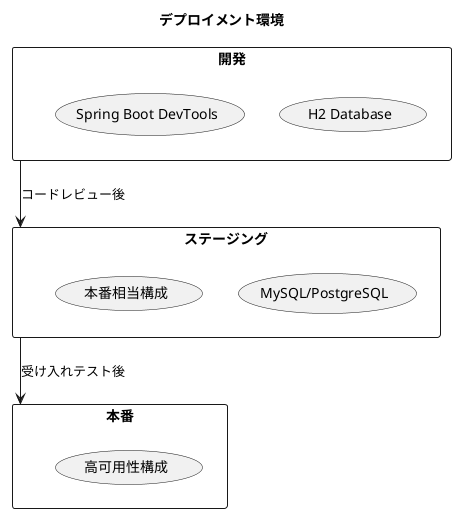

# 第2章: 開発環境の構築

## 2.1 技術スタックの選定

### Java 25 を選んだ理由

本プロジェクトでは、バックエンド言語として Java 25 を採用しています。Java を選んだ主な理由は以下の通りです。



| 観点 | Java の利点 |
|------|-------------|
| 型安全性 | コンパイル時のエラー検出で堅牢なコードを実現 |
| エコシステム | Spring Boot、MyBatis など成熟したフレームワーク群 |
| 保守性 | 静的型付けにより、大規模コードベースでもリファクタリングが安全 |
| テスト | JUnit 5、Mockito など充実したテストツール |
| ドキュメント生成 | JIG、JIG-ERD によるアーキテクチャ図の自動生成 |

### Spring Boot の利点

Spring Boot は Java の Web アプリケーション開発において最も広く使われているフレームワークです。



#### Spring Boot の主な特徴

| 特徴 | 説明 |
|------|------|
| 自動設定 | 設定より規約（Convention over Configuration）で開発効率向上 |
| 組み込みサーバー | Tomcat が組み込まれ、単独で実行可能な JAR を生成 |
| スターター | 依存関係をスターターで一括管理 |
| Actuator | ヘルスチェック、メトリクスなど運用機能を標準提供 |
| DevTools | ホットリロードによる開発効率向上 |

### MyBatis vs JPA の選択

O/R マッパーとして MyBatis を採用しました。



#### MyBatis を選んだ理由

| 観点 | MyBatis の利点 |
|------|----------------|
| SQL 制御 | 複雑な SQL を直接記述でき、パフォーマンスチューニングが容易 |
| 学習コスト | SQL の知識がそのまま活用でき、学習曲線が緩やか |
| デバッグ | 実行される SQL が明確で、問題の特定が容易 |
| 柔軟性 | 動的 SQL により、条件に応じた柔軟なクエリが記述可能 |
| 既存 DB 対応 | 既存データベースへの適用が容易 |

```java
// MyBatis Mapper の例
public interface ProductMapper {
    @Select("SELECT * FROM products WHERE product_code = #{productCode}")
    Product findByProductCode(String productCode);

    @Insert("INSERT INTO products (product_code, product_name, price) " +
            "VALUES (#{productCode}, #{productName}, #{price})")
    void insert(Product product);
}
```

---

## 2.2 バックエンド環境

### Gradle プロジェクトのセットアップ

本プロジェクトでは Gradle をビルドツールとして使用しています。

#### build.gradle の構成

```groovy
plugins {
    id 'java'
    id 'org.springframework.boot' version '3.5.0-SNAPSHOT'
    id 'io.spring.dependency-management' version '1.1.6'
    id 'org.dddjava.jig-gradle-plugin' version '2025.10.1'
    id 'org.flywaydb.flyway' version '11.15.0'
    id 'com.thinkimi.gradle.MybatisGenerator' version '2.4'
    id 'jacoco'
    id 'org.sonarqube' version '7.0.1.6134'
}

group = 'com.example'
version = '0.0.1-SNAPSHOT'

java {
    toolchain {
        languageVersion = JavaLanguageVersion.of(25)
    }
}
```

#### 主要な依存関係

```groovy
dependencies {
    // Spring Boot スターター
    implementation 'org.springframework.boot:spring-boot-starter-web'
    implementation 'org.springframework.boot:spring-boot-starter-validation'
    implementation 'org.springframework.boot:spring-boot-starter-security'
    implementation 'org.springframework.boot:spring-boot-starter-data-jpa'

    // MyBatis
    implementation 'org.mybatis.spring.boot:mybatis-spring-boot-starter:3.0.3'

    // データベース
    runtimeOnly 'com.h2database:h2'
    runtimeOnly 'com.mysql:mysql-connector-j'
    runtimeOnly 'org.postgresql:postgresql'

    // Flyway
    implementation 'org.flywaydb:flyway-core:11.15.0'

    // JWT
    implementation 'io.jsonwebtoken:jjwt-api:0.12.3'
    runtimeOnly 'io.jsonwebtoken:jjwt-impl:0.12.5'

    // テスト
    testImplementation 'org.springframework.boot:spring-boot-starter-test'
    testImplementation 'io.cucumber:cucumber-java:7.18.0'
    testImplementation 'io.cucumber:cucumber-spring:7.18.1'
}
```

### Spring Boot アプリケーションの初期化

#### アプリケーションクラス

```java
@SpringBootApplication
public class SmsApplication {
    public static void main(String[] args) {
        SpringApplication.run(SmsApplication.class, args);
    }
}
```

#### 設定ファイル（application.yml）

```yaml
spring:
  datasource:
    url: jdbc:h2:mem:testdb
    driver-class-name: org.h2.Driver
    username: sa
    password:
  h2:
    console:
      enabled: true
      path: /h2-console
  flyway:
    enabled: true
    locations: classpath:db/migration/h2

mybatis:
  mapper-locations: classpath:mapper/**/*.xml
  configuration:
    map-underscore-to-camel-case: true

server:
  port: 8080
```

### MyBatis Generator の設定

MyBatis Generator を使用してデータベースからマッパーを自動生成します。

```xml
<!-- generatorConfig.xml -->
<?xml version="1.0" encoding="UTF-8"?>
<!DOCTYPE generatorConfiguration PUBLIC
        "-//mybatis.org//DTD MyBatis Generator Configuration 1.0//EN"
        "http://mybatis.org/dtd/mybatis-generator-config_1_0.dtd">
<generatorConfiguration>
    <context id="default" targetRuntime="MyBatis3">
        <jdbcConnection driverClass="org.h2.Driver"
                        connectionURL="jdbc:h2:mem:testdb"
                        userId="sa"
                        password="">
        </jdbcConnection>

        <javaModelGenerator targetPackage="com.example.sms.infrastructure.datasource.autogen.model"
                            targetProject="src/main/java"/>

        <sqlMapGenerator targetPackage="mapper.autogen"
                         targetProject="src/main/resources"/>

        <javaClientGenerator type="XMLMAPPER"
                             targetPackage="com.example.sms.infrastructure.datasource.autogen.mapper"
                             targetProject="src/main/java"/>

        <table tableName="%" />
    </context>
</generatorConfiguration>
```

### Flyway によるマイグレーション管理

データベーススキーマのバージョン管理に Flyway を使用しています。

#### マイグレーションファイルの命名規則

```
V{version}__{description}.sql

例:
V1__create_users_table.sql
V2__create_departments_table.sql
V3__create_employees_table.sql
```

#### マイグレーションファイルの例

```sql
-- V1__create_users_table.sql
CREATE TABLE usr (
    user_id VARCHAR(255) PRIMARY KEY,
    first_name VARCHAR(100) NOT NULL,
    last_name VARCHAR(100) NOT NULL,
    password VARCHAR(255) NOT NULL,
    role_name VARCHAR(50) NOT NULL
);

-- V2__create_departments_table.sql
CREATE TABLE department (
    department_id VARCHAR(255) PRIMARY KEY,
    department_code VARCHAR(10) NOT NULL UNIQUE,
    department_name VARCHAR(100) NOT NULL,
    start_date DATE,
    end_date DATE,
    path VARCHAR(500)
);
```



---

## 2.3 フロントエンド環境

### Vite + React + TypeScript

フロントエンドは Vite をビルドツールとして、React + TypeScript で構築しています。



#### package.json の構成

```json
{
  "name": "app",
  "type": "module",
  "scripts": {
    "dev": "vite",
    "build": "tsc -b && vite build",
    "test": "jest",
    "lint": "eslint .",
    "cypress:open": "cypress open",
    "cypress:run": "cypress run"
  },
  "dependencies": {
    "react": "^18.3.1",
    "react-dom": "^18.3.1",
    "react-router-dom": "^6.26.2",
    "react-modal": "^3.16.1",
    "react-tabs": "^6.0.2"
  },
  "devDependencies": {
    "@vitejs/plugin-react": "^4.3.1",
    "typescript": "^5.5.3",
    "vite": "^5.4.1",
    "jest": "^29.7.0",
    "cypress": "^14.5.1"
  }
}
```

### 開発サーバーの設定

#### vite.config.ts

```typescript
import { defineConfig } from 'vite';
import react from '@vitejs/plugin-react';

export default defineConfig({
  plugins: [react()],
  server: {
    port: 3000,
    proxy: {
      '/api': {
        target: 'http://localhost:8080',
        changeOrigin: true,
      },
    },
  },
});
```

### API クライアントの構成

バックエンド API との通信を担う API クライアントを実装しています。

```typescript
// api/client.ts
const API_BASE_URL = '/api';

export const apiClient = {
  async get<T>(path: string): Promise<T> {
    const response = await fetch(`${API_BASE_URL}${path}`, {
      headers: {
        'Authorization': `Bearer ${getToken()}`,
      },
    });
    if (!response.ok) throw new Error('API Error');
    return response.json();
  },

  async post<T>(path: string, data: unknown): Promise<T> {
    const response = await fetch(`${API_BASE_URL}${path}`, {
      method: 'POST',
      headers: {
        'Content-Type': 'application/json',
        'Authorization': `Bearer ${getToken()}`,
      },
      body: JSON.stringify(data),
    });
    if (!response.ok) throw new Error('API Error');
    return response.json();
  },
};
```

---

## 2.4 開発ツール

### JIG によるアーキテクチャドキュメント生成

JIG（Java Instant-documentation Generator）は、Java ソースコードからアーキテクチャドキュメントを自動生成するツールです。

```plantuml
@startuml
title JIG が生成するドキュメント

rectangle "JIG" {
  (ソースコード解析) --> (ドキュメント生成)
}

rectangle "生成物" {
  (application.html) : サービスメソッド一覧
  (architecture.svg) : アーキテクチャ図
  (business-rule.xlsx) : ビジネスルール一覧
  (composite-usecase.svg) : ユースケース複合図
  (domain.html) : ドメインモデル一覧
}

(ドキュメント生成) --> (application.html)
(ドキュメント生成) --> (architecture.svg)
(ドキュメント生成) --> (business-rule.xlsx)
(ドキュメント生成) --> (composite-usecase.svg)
(ドキュメント生成) --> (domain.html)

@enduml
```

#### JIG の実行

```bash
./gradlew jigReports
```

#### 生成されるドキュメント

| ファイル | 内容 |
|---------|------|
| application.html | サービス層のメソッド一覧 |
| architecture.svg | レイヤー間の依存関係図 |
| business-rule.xlsx | ビジネスルール（値オブジェクト、列挙型）一覧 |
| composite-usecase.svg | ユースケース複合図 |
| domain.html | ドメインモデル一覧 |
| term.html | 用語集 |

### JIG-ERD による ER 図自動生成

JIG-ERD は、MyBatis マッパーから ER 図を自動生成するツールです。

```java
// テストコードで ER 図を生成
@Test
void generateErDiagram() {
    var output = Path.of("build/jig-erd");
    var packageName = "com.example.sms.infrastructure.datasource";

    JigErd.run(output, packageName);
}
```

#### 生成される ER 図

| ファイル | 内容 |
|---------|------|
| library-er-overview.svg | 概要 ER 図（テーブル名のみ） |
| library-er-summary.svg | サマリー ER 図（主要カラム） |
| library-er-detail.svg | 詳細 ER 図（全カラム） |

### SonarQube によるコード品質管理

SonarQube を使用してコード品質を継続的に分析しています。



#### 分析項目

| 項目 | 説明 |
|------|------|
| バグ | 潜在的なバグの検出 |
| 脆弱性 | セキュリティ上の問題 |
| コードスメル | 保守性を低下させるコード |
| カバレッジ | テストカバレッジ |
| 重複 | コードの重複率 |

### ArchUnit によるアーキテクチャテスト

ArchUnit を使用してアーキテクチャルールをテストとして検証しています。

```java
@AnalyzeClasses(packages = "com.example.sms")
public class ArchitectureTest {

    @ArchTest
    static final ArchRule layer_dependencies = layeredArchitecture()
        .consideringAllDependencies()
        .layer("Presentation").definedBy("..presentation..")
        .layer("Service").definedBy("..service..")
        .layer("Domain").definedBy("..domain..")
        .layer("Infrastructure").definedBy("..infrastructure..")
        .whereLayer("Presentation").mayOnlyBeAccessedByLayers()
        .whereLayer("Service").mayOnlyBeAccessedByLayers("Presentation")
        .whereLayer("Domain").mayOnlyBeAccessedByLayers("Service", "Infrastructure")
        .whereLayer("Infrastructure").mayNotBeAccessedByAnyLayer();

    @ArchTest
    static final ArchRule controllers_should_be_in_presentation_layer =
        classes()
            .that().haveSimpleNameEndingWith("Controller")
            .should().resideInAPackage("..presentation..");
}
```

---

## 2.5 CI/CD パイプライン

### GitHub Actions の構成

本プロジェクトでは GitHub Actions を使用して CI/CD を実現しています。

```yaml
# .github/workflows/ci.yml
name: CI

on:
  push:
    branches: [ main, develop ]
  pull_request:
    branches: [ main ]

jobs:
  build:
    runs-on: ubuntu-latest

    steps:
    - uses: actions/checkout@v4

    - name: Set up JDK 25
      uses: actions/setup-java@v4
      with:
        java-version: '25'
        distribution: 'temurin'

    - name: Setup Gradle
      uses: gradle/gradle-build-action@v3

    - name: Build with Gradle
      run: ./gradlew build
      working-directory: app/backend/sms

    - name: Run tests
      run: ./gradlew test
      working-directory: app/backend/sms

    - name: Generate JIG reports
      run: ./gradlew jigReports
      working-directory: app/backend/sms

    - name: Upload JIG reports
      uses: actions/upload-artifact@v4
      with:
        name: jig-reports
        path: app/backend/sms/build/jig
```



### テスト自動化

#### テストの階層



| テスト種別 | ツール | 対象 |
|-----------|--------|------|
| 単体テスト | JUnit 5, Mockito | ドメインモデル、サービス |
| 統合テスト | Spring Boot Test | コントローラ、リポジトリ |
| 受け入れテスト | Cucumber | ユースケースシナリオ |
| E2E テスト | Cypress | 画面操作シナリオ |

### デプロイメント戦略

#### 環境構成



---

## まとめ

本章では、開発環境の構築について解説しました。

- **バックエンド**: Java 25 + Spring Boot + MyBatis + Gradle
- **フロントエンド**: React + TypeScript + Vite
- **データベース**: H2（開発）/ MySQL / PostgreSQL（本番）+ Flyway
- **品質管理**: JIG、JIG-ERD、SonarQube、ArchUnit
- **CI/CD**: GitHub Actions による自動化

次章では、本システムのアーキテクチャ設計について詳しく解説します。
