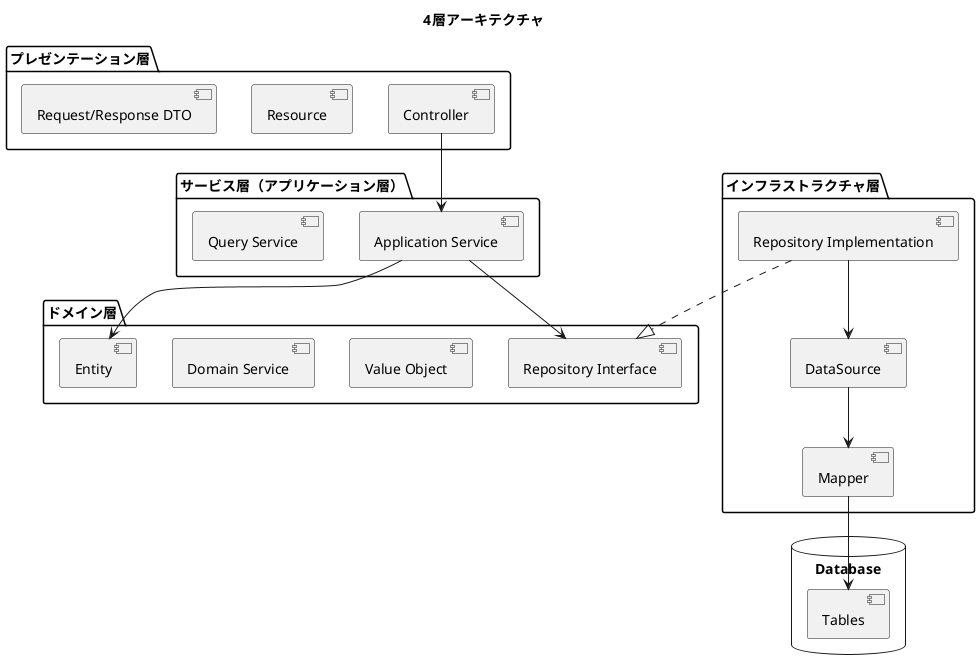
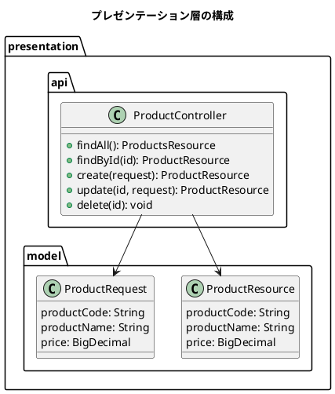
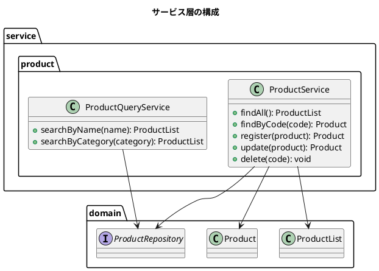
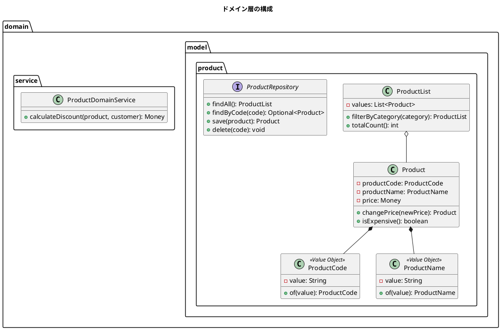
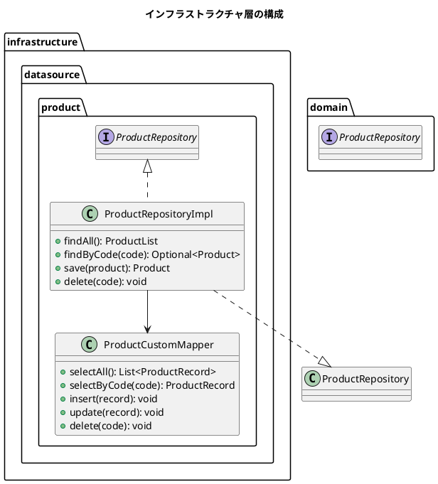
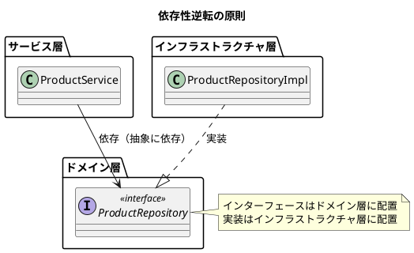
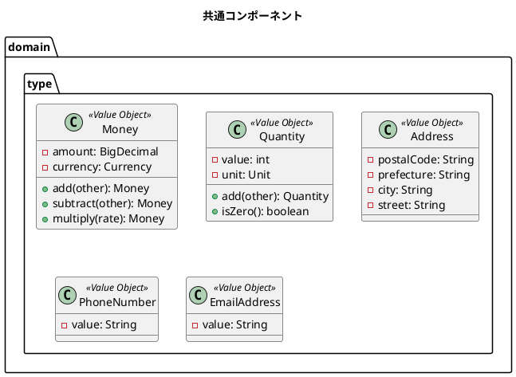
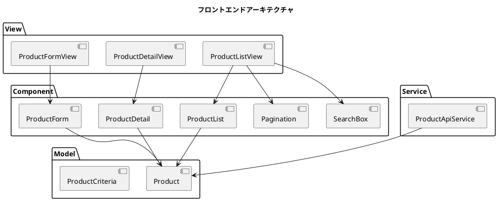

# 第3章: アーキテクチャ設計

## 3.1 レイヤードアーキテクチャ

### 4層アーキテクチャの採用

本システムでは、4層アーキテクチャを採用しています。各層は明確な責務を持ち、依存関係の方向を制御することで、保守性と拡張性を確保しています。



### プレゼンテーション層

プレゼンテーション層は、外部からのリクエストを受け付け、適切なレスポンスを返す責務を持ちます。



#### 責務

| 役割 | 責務 |
|------|------|
| Controller | HTTP リクエストの受付、レスポンスの返却 |
| Resource | API レスポンスの表現 |
| Request | API リクエストの表現とバリデーション |

#### 実装例

```java
@RestController
@RequestMapping("/api/products")
public class ProductController {
    private final ProductService productService;

    public ProductController(ProductService productService) {
        this.productService = productService;
    }

    @GetMapping
    public ProductsResource findAll() {
        ProductList products = productService.findAll();
        return ProductsResource.from(products);
    }

    @GetMapping("/{productCode}")
    public ProductResource findById(@PathVariable String productCode) {
        Product product = productService.findByCode(productCode);
        return ProductResource.from(product);
    }

    @PostMapping
    @ResponseStatus(HttpStatus.CREATED)
    public ProductResource create(@Valid @RequestBody ProductRequest request) {
        Product product = productService.register(request.toEntity());
        return ProductResource.from(product);
    }
}
```

### サービス層（アプリケーション層）

サービス層は、ユースケースを実現するための調整役として機能します。ドメインオブジェクトを操作し、トランザクション境界を管理します。



#### 責務

| 役割 | 責務 |
|------|------|
| Application Service | ユースケースの実現、トランザクション管理 |
| Query Service | 参照系の複雑なクエリ処理 |

#### 実装例

```java
@Service
@Transactional
public class ProductService {
    private final ProductRepository productRepository;

    public ProductService(ProductRepository productRepository) {
        this.productRepository = productRepository;
    }

    public ProductList findAll() {
        return productRepository.findAll();
    }

    public Product findByCode(String productCode) {
        return productRepository.findByCode(ProductCode.of(productCode))
            .orElseThrow(() -> new ProductNotFoundException(productCode));
    }

    public Product register(Product product) {
        productRepository.findByCode(product.productCode())
            .ifPresent(existing -> {
                throw new ProductAlreadyExistsException(product.productCode());
            });
        return productRepository.save(product);
    }
}
```

### ドメイン層

ドメイン層は、ビジネスロジックを表現する中核の層です。他の層から独立しており、フレームワークに依存しません。



#### 責務

| 役割 | 責務 |
|------|------|
| Entity | ビジネス概念の表現、ライフサイクルを持つオブジェクト |
| Value Object | 不変のビジネス概念、同値性で比較 |
| Domain Service | エンティティに属さないビジネスロジック |
| Repository Interface | 永続化の抽象（実装はインフラ層） |

#### 実装例

```java
// エンティティ
public class Product {
    private final ProductCode productCode;
    private final ProductName productName;
    private Money price;

    public Product(ProductCode productCode, ProductName productName, Money price) {
        this.productCode = productCode;
        this.productName = productName;
        this.price = price;
    }

    public Product changePrice(Money newPrice) {
        return new Product(this.productCode, this.productName, newPrice);
    }

    public boolean isExpensive() {
        return this.price.isGreaterThan(Money.of(10000));
    }
}

// 値オブジェクト
public record ProductCode(String value) {
    public ProductCode {
        if (value == null || value.isBlank()) {
            throw new IllegalArgumentException("商品コードは必須です");
        }
        if (!value.matches("[A-Z0-9]{8}")) {
            throw new IllegalArgumentException("商品コードは8桁の英数字です");
        }
    }

    public static ProductCode of(String value) {
        return new ProductCode(value);
    }
}
```

### インフラストラクチャ層

インフラストラクチャ層は、外部システム（データベース、外部 API など）との通信を担当します。



#### 責務

| 役割 | 責務 |
|------|------|
| Repository Implementation | リポジトリインターフェースの実装 |
| DataSource | データアクセスロジック |
| Mapper | SQL マッピング（MyBatis） |

#### 実装例

```java
@Repository
public class ProductRepositoryImpl implements ProductRepository {
    private final ProductCustomMapper mapper;

    public ProductRepositoryImpl(ProductCustomMapper mapper) {
        this.mapper = mapper;
    }

    @Override
    public ProductList findAll() {
        List<ProductRecord> records = mapper.selectAll();
        List<Product> products = records.stream()
            .map(this::toEntity)
            .toList();
        return new ProductList(products);
    }

    @Override
    public Optional<Product> findByCode(ProductCode code) {
        ProductRecord record = mapper.selectByCode(code.value());
        return Optional.ofNullable(record).map(this::toEntity);
    }

    private Product toEntity(ProductRecord record) {
        return new Product(
            ProductCode.of(record.getProductCode()),
            ProductName.of(record.getProductName()),
            Money.of(record.getPrice())
        );
    }
}
```

---

## 3.2 依存関係の方向

### 依存性逆転の原則

依存性逆転の原則（Dependency Inversion Principle）に従い、上位モジュールは下位モジュールに依存せず、両者とも抽象に依存します。



#### なぜ依存性を逆転させるのか

| 観点 | 効果 |
|------|------|
| テスタビリティ | モック/スタブに差し替えてテスト可能 |
| 柔軟性 | データベース変更時もドメイン層は影響なし |
| 保守性 | ビジネスロジックが技術的詳細から分離 |

### リポジトリパターン

リポジトリパターンにより、ドメイン層からデータアクセスの詳細を隠蔽します。

```plantuml
@startuml
title リポジトリパターン

package "ドメイン層" {
  class Product
  interface ProductRepository {
    + findAll(): ProductList
    + findByCode(code): Optional<Product>
    + save(product): Product
    + delete(code): void
  }
}

package "インフラストラクチャ層" {
  class ProductRepositoryImpl {
    - mapper: ProductMapper
  }
  class ProductMapper
}

database "Database" {
  [products]
}

ProductRepositoryImpl ..|> ProductRepository
ProductRepositoryImpl --> ProductMapper
ProductMapper --> [products]

note bottom of ProductRepository
  ドメイン層はリポジトリインターフェースのみを知る
  データベースの存在を意識しない
end note

@enduml
```

### ArchUnit によるルール強制

ArchUnit を使用して、アーキテクチャルールをテストとして検証します。

```java
@AnalyzeClasses(packages = "com.example.sms")
@DisplayName("アーキテクチャルール")
public class ArchitectureRuleTest {

    @Test
    @DisplayName("プレゼンテーション層はサービス層とドメイン層にアクセスできる")
    public void presentationLayerShouldOnlyAccessServiceLayerAndDomainLayer() {
        JavaClasses importedClasses = new ClassFileImporter()
            .importPackages("com.example.sms");

        ArchRuleDefinition.noClasses()
            .that()
            .resideInAPackage("..presentation..")
            .should()
            .accessClassesThat()
            .resideInAPackage("..infrastructure..")
            .allowEmptyShould(true)
            .check(importedClasses);
    }

    @Test
    @DisplayName("ドメイン層は他の層にアクセスできない")
    public void domainLayerShouldNotAccessOtherLayers() {
        JavaClasses importedClasses = new ClassFileImporter()
            .importPackages("com.example.sms");

        ArchRuleDefinition.noClasses()
            .that()
            .resideInAPackage("..domain..")
            .should()
            .accessClassesThat()
            .resideInAPackage("..presentation..")
            .allowEmptyShould(true)
            .check(importedClasses);

        ArchRuleDefinition.noClasses()
            .that()
            .resideInAPackage("..domain..")
            .should()
            .accessClassesThat()
            .resideInAPackage("..service..")
            .allowEmptyShould(true)
            .check(importedClasses);

        ArchRuleDefinition.noClasses()
            .that()
            .resideInAPackage("..domain..")
            .should()
            .accessClassesThat()
            .resideInAPackage("..infrastructure..")
            .allowEmptyShould(true)
            .check(importedClasses);
    }
}
```

#### ルール一覧

| ルール | 説明 |
|--------|------|
| プレゼンテーション → インフラ禁止 | Controller から直接 Repository 実装にアクセス不可 |
| ドメイン → プレゼンテーション禁止 | Entity から Controller にアクセス不可 |
| ドメイン → サービス禁止 | Entity から Service にアクセス不可 |
| ドメイン → インフラ禁止 | Entity から DataSource にアクセス不可 |

---

## 3.3 パッケージ構造

### 機能別パッケージ構成

本システムでは、機能別（ドメイン別）にパッケージを構成しています。

```plantuml
@startuml
title パッケージ構造

package "com.example.sms" {
  package "domain" {
    package "model" {
      package "system" {
        [user]
        [audit]
        [download]
      }
      package "master" {
        [department]
        [employee]
        [product]
        [partner]
      }
      package "sales" {
        [order]
        [shipment]
        [sales]
      }
      package "purchase" {
        [purchase_order]
        [purchase]
        [payment]
      }
      package "stock" {
        [inventory]
        [warehouse]
        [location]
      }
    }
  }

  package "service" {
    [system]
    [master]
    [sales]
    [purchase]
    [stock]
  }

  package "presentation" {
    [api]
    [model]
  }

  package "infrastructure" {
    [datasource]
  }
}

@enduml
```

#### パッケージ構成の詳細

```
com.example.sms/
├── domain/
│   └── model/
│       ├── system/           # システム系
│       │   ├── user/         # ユーザー
│       │   ├── audit/        # 監査
│       │   └── download/     # ダウンロード
│       ├── master/           # マスタ系
│       │   ├── department/   # 部門
│       │   ├── employee/     # 社員
│       │   ├── product/      # 商品
│       │   └── partner/      # 取引先
│       ├── sales/            # 販売系
│       │   ├── order/        # 受注
│       │   ├── shipment/     # 出荷
│       │   └── sales/        # 売上
│       ├── purchase/         # 調達系
│       │   ├── purchase_order/  # 発注
│       │   ├── purchase/     # 仕入
│       │   └── payment/      # 支払
│       └── stock/            # 在庫系
│           ├── inventory/    # 在庫
│           ├── warehouse/    # 倉庫
│           └── location/     # 棚番
├── service/
│   ├── system/
│   ├── master/
│   ├── sales/
│   ├── purchase/
│   └── stock/
├── presentation/
│   ├── api/
│   └── model/
└── infrastructure/
    └── datasource/
```

### 共通コンポーネントの配置

複数のドメインで使用される共通コンポーネントは、専用のパッケージに配置します。



### テストコードの構成

テストコードは、本番コードと同じパッケージ構成を維持します。

```
src/
├── main/java/com/example/sms/
│   ├── domain/
│   ├── service/
│   ├── presentation/
│   └── infrastructure/
└── test/java/com/example/sms/
    ├── domain/           # ドメイン層の単体テスト
    ├── service/          # サービス層の統合テスト
    ├── presentation/     # コントローラの統合テスト
    └── infrastructure/   # リポジトリの統合テスト
```

---

## 3.4 フロントエンドアーキテクチャ

### Component / Model / View 構成

フロントエンドは、Component / Model / View の3層構成を採用しています。



#### 各層の責務

| 層 | 責務 |
|----|------|
| View | 画面全体のレイアウト、複数 Component の配置 |
| Component | 再利用可能な UI パーツ |
| Model | データ構造の定義、バリデーション |
| Service | API との通信 |

### API サービス層

バックエンド API との通信を担う API サービス層を実装しています。

```typescript
// services/productApiService.ts
import { apiClient } from '../api/client';
import { Product, ProductList } from '../models/product';

export const productApiService = {
  async findAll(): Promise<ProductList> {
    const response = await apiClient.get<ProductsResponse>('/products');
    return ProductList.fromResponse(response);
  },

  async findByCode(productCode: string): Promise<Product> {
    const response = await apiClient.get<ProductResponse>(
      `/products/${productCode}`
    );
    return Product.fromResponse(response);
  },

  async create(product: Product): Promise<Product> {
    const response = await apiClient.post<ProductResponse>(
      '/products',
      product.toRequest()
    );
    return Product.fromResponse(response);
  },

  async update(product: Product): Promise<Product> {
    const response = await apiClient.put<ProductResponse>(
      `/products/${product.productCode}`,
      product.toRequest()
    );
    return Product.fromResponse(response);
  },

  async delete(productCode: string): Promise<void> {
    await apiClient.delete(`/products/${productCode}`);
  },
};
```

### 状態管理の方針

本システムでは、React の標準機能（useState、useContext）を中心に状態管理を行っています。

```plantuml
@startuml
title 状態管理の構成

package "状態管理" {
  [ローカル状態] : useState
  [グローバル状態] : useContext
  [サーバー状態] : API 呼び出し
}

note right of [ローカル状態]
  フォーム入力値
  モーダルの開閉状態
  一覧の選択状態
end note

note right of [グローバル状態]
  認証情報
  ユーザー設定
end note

note right of [サーバー状態]
  マスタデータ
  トランザクションデータ
end note

@enduml
```

#### 状態の種類と管理方法

| 状態の種類 | 管理方法 | 例 |
|-----------|----------|-----|
| ローカル状態 | useState | フォーム入力、モーダル開閉 |
| グローバル状態 | useContext | 認証情報、テーマ設定 |
| サーバー状態 | API 呼び出し | 商品一覧、受注データ |

```typescript
// コンテキストの例：認証状態
interface AuthContextType {
  user: User | null;
  login: (username: string, password: string) => Promise<void>;
  logout: () => void;
}

const AuthContext = createContext<AuthContextType | null>(null);

export const AuthProvider: React.FC<{ children: React.ReactNode }> = ({
  children,
}) => {
  const [user, setUser] = useState<User | null>(null);

  const login = async (username: string, password: string) => {
    const response = await authService.login(username, password);
    setUser(response.user);
    localStorage.setItem('token', response.token);
  };

  const logout = () => {
    setUser(null);
    localStorage.removeItem('token');
  };

  return (
    <AuthContext.Provider value={{ user, login, logout }}>
      {children}
    </AuthContext.Provider>
  );
};
```

---

## まとめ

本章では、販売管理システムのアーキテクチャ設計について解説しました。

- **4層アーキテクチャ**: プレゼンテーション、サービス、ドメイン、インフラストラクチャ
- **依存性逆転の原則**: 上位層は抽象（インターフェース）に依存
- **リポジトリパターン**: データアクセスの詳細を隠蔽
- **ArchUnit**: アーキテクチャルールをテストで強制
- **機能別パッケージ**: ドメインごとにパッケージを分割
- **フロントエンド**: Component / Model / View 構成

次章からは、第2部「データモデリング」に入り、システム全体のデータ構造を設計していきます。
