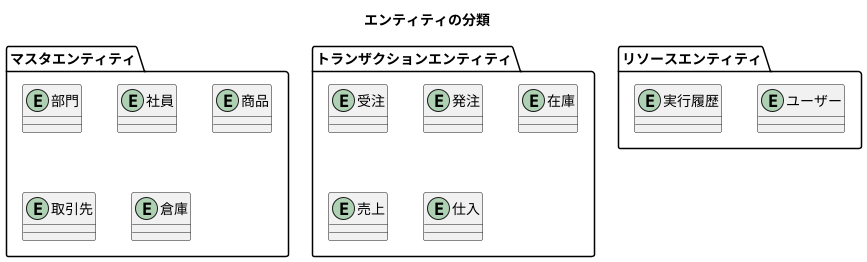
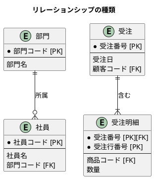
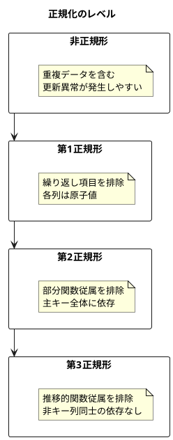
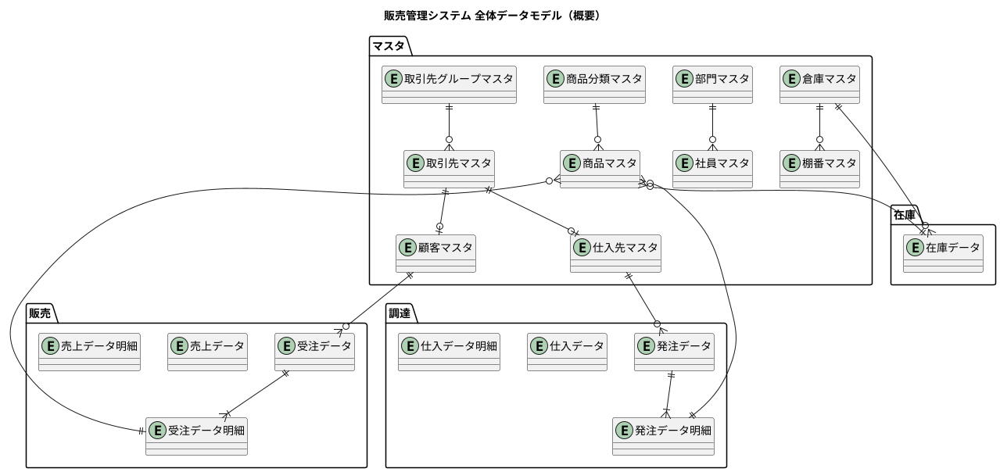
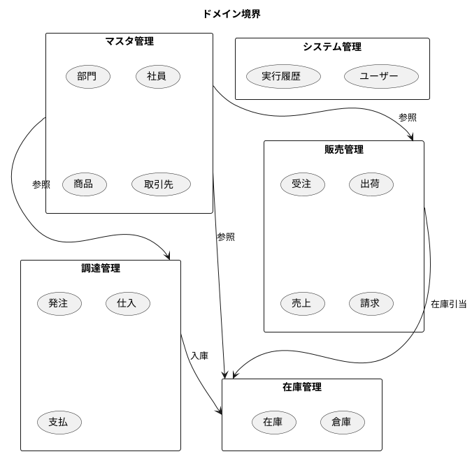
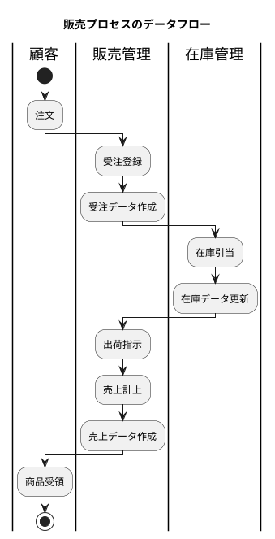
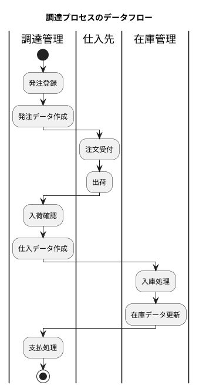
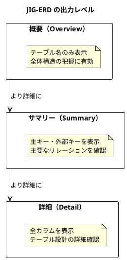
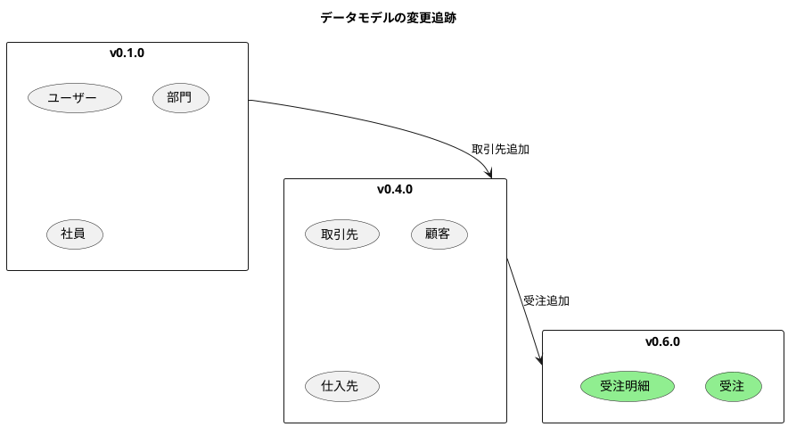

# 第4章: データモデル設計の基礎

## 4.1 ER モデリングの原則

### エンティティの識別

エンティティとは、システムで管理すべき「もの」や「こと」を表す概念です。販売管理システムでは、以下のようなエンティティを識別します。



#### エンティティの種類

| 種類 | 説明 | 例 |
|------|------|-----|
| マスタエンティティ | 比較的変更が少ない基本情報 | 部門、社員、商品、取引先 |
| トランザクションエンティティ | 業務活動の記録 | 受注、発注、在庫、売上 |
| リソースエンティティ | システム運用に必要な情報 | ユーザー、実行履歴 |

#### エンティティ識別のポイント

1. **独立して存在できるか**: 他のエンティティに依存せず、単独で意味を持つか
2. **一意に識別できるか**: 主キーによって各インスタンスを区別できるか
3. **複数のインスタンスを持つか**: 一覧として管理する必要があるか

### リレーションシップの設計

エンティティ間の関係を定義します。



#### カーディナリティ（多重度）

| 記法 | 意味 | 例 |
|------|------|-----|
| `1:1` | 1対1 | ユーザー - 認証情報 |
| `1:N` | 1対多 | 部門 - 社員 |
| `N:M` | 多対多 | 商品 - 取引先（顧客別単価） |

#### 依存関係の種類

| 種類 | 説明 | 例 |
|------|------|-----|
| 識別依存 | 親の主キーが子の主キーの一部 | 受注 - 受注明細 |
| 非識別依存 | 親の主キーが子の外部キー | 部門 - 社員 |

### 正規化と非正規化のトレードオフ

データの冗長性を排除しつつ、パフォーマンスを考慮した設計が必要です。



#### 本システムでの判断

| 観点 | 正規化 | 非正規化 |
|------|--------|----------|
| データ整合性 | 高い | 低い |
| 更新性能 | 高い | 低い |
| 参照性能 | 低い（結合が必要） | 高い |
| ストレージ | 少ない | 多い |

本システムでは、基本的に第3正規形を採用しつつ、以下の場合に非正規化を検討します。

- **商品名の複製**: 受注明細に商品名を保持（履歴保持のため）
- **金額合計の保持**: 受注ヘッダに金額合計を保持（集計性能のため）

---

## 4.2 販売管理システムの全体データモデル

### 主要エンティティの洗い出し

本システムの主要エンティティを以下に示します。



### ドメイン境界の設定

システムを以下のドメイン境界で分割しています。



### データフローの可視化

販売・調達プロセスにおけるデータの流れを示します。





---

## 4.3 JIG-ERD によるモデル可視化

### ER 図の自動生成

JIG-ERD は MyBatis マッパーから ER 図を自動生成するツールです。

```java
// テストコードで ER 図を生成
@Test
void generateErDiagram() {
    var output = Path.of("build/jig-erd");
    var packageName = "com.example.sms.infrastructure.datasource";

    JigErd.run(output, packageName);
}
```

#### 生成コマンド

```bash
./gradlew test --tests "*JigErdTest*"
```

### 概要・サマリー・詳細の使い分け

JIG-ERD は3つのレベルの ER 図を生成します。



#### 各レベルの用途

| レベル | ファイル名 | 用途 |
|--------|-----------|------|
| 概要 | library-er-overview.svg | 全体構造の把握、新規メンバーへの説明 |
| サマリー | library-er-summary.svg | リレーションの確認、設計レビュー |
| 詳細 | library-er-detail.svg | 実装時の参照、テーブル定義の確認 |

### 設計レビューへの活用

JIG-ERD で生成した ER 図は、以下の場面で活用します。

#### リリースごとのアーカイブ

```
docs/assets/release/
├── v0_1_0/
│   └── jig-erd/
│       ├── library-er-overview.svg
│       ├── library-er-summary.svg
│       └── library-er-detail.svg
├── v0_2_0/
│   └── jig-erd/
│       └── ...
└── v0_11_0/
    └── jig-erd/
        └── ...
```

#### 変更の追跡

バージョン間の ER 図を比較することで、データモデルの変更を視覚的に追跡できます。



---

## 主要テーブル一覧

本システムの主要テーブルを以下に示します。

### マスタ系テーブル

| テーブル名 | 説明 | 主キー |
|-----------|------|--------|
| 部門マスタ | 組織の部門情報 | 部門コード, 開始日 |
| 社員マスタ | 社員の基本情報 | 社員コード |
| 商品マスタ | 商品の基本情報 | 商品コード |
| 商品分類マスタ | 商品の分類階層 | 商品分類コード |
| 取引先マスタ | 取引先の基本情報 | 取引先コード |
| 取引先グループマスタ | 取引先のグループ | 取引先グループコード |
| 顧客マスタ | 顧客固有の情報 | 顧客コード, 顧客枝番 |
| 仕入先マスタ | 仕入先固有の情報 | 仕入先コード, 仕入先枝番 |
| 倉庫マスタ | 倉庫の基本情報 | 倉庫コード |
| 棚番マスタ | 倉庫内のロケーション | 倉庫コード, 棚番コード, 商品コード |

### トランザクション系テーブル

| テーブル名 | 説明 | 主キー |
|-----------|------|--------|
| 受注データ | 受注ヘッダ | 受注番号 |
| 受注データ明細 | 受注明細行 | 受注番号, 受注行番号 |
| 発注データ | 発注ヘッダ | 発注番号 |
| 発注データ明細 | 発注明細行 | 発注番号, 発注行番号 |
| 在庫データ | 在庫残高 | 倉庫コード, 商品コード, ロット番号, 在庫区分, 良品区分 |

---

## まとめ

本章では、データモデル設計の基礎について解説しました。

- **エンティティの識別**: マスタ、トランザクション、リソースの3種類に分類
- **リレーションシップ**: カーディナリティと依存関係の設計
- **正規化**: 第3正規形を基本とし、必要に応じて非正規化
- **全体モデル**: マスタ、販売、調達、在庫のドメイン境界
- **JIG-ERD**: 概要・サマリー・詳細の3レベルで可視化

次章では、マスタデータモデルの詳細について解説します。
