# 第5章: マスタデータモデル

## 5.1 組織マスタ

### 部門の階層構造設計

組織を表現するデータモデルでは、部門の階層構造を適切に設計することが重要です。本システムでは、経路列挙モデル（Path Enumeration）を採用しています。

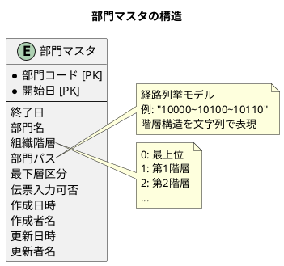

#### テーブル定義

```sql
create table if not exists 部門マスタ
(
    部門コード   varchar(6)                        not null,
    開始日       timestamp(6) default CURRENT_DATE not null,
    終了日       timestamp(6) default '2100-12-31 00:00:00',
    部門名       varchar(40),
    組織階層     integer      default 0            not null,
    部門パス     varchar(100)                      not null,
    最下層区分   integer      default 0            not null,
    伝票入力可否 integer      default 1            not null,
    作成日時     timestamp(6) default CURRENT_DATE not null,
    作成者名     varchar(12),
    更新日時     timestamp(6) default CURRENT_DATE not null,
    更新者名     varchar(12),
    constraint pk_department
        primary key (部門コード, 開始日)
);
```

#### 階層構造の表現方法

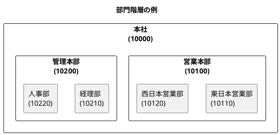

| 部門コード | 部門名 | 組織階層 | 部門パス |
|------------|--------|----------|----------|
| 10000 | 本社 | 0 | 10000 |
| 10100 | 営業本部 | 1 | 10000~10100 |
| 10110 | 東日本営業部 | 2 | 10000~10100~10110 |
| 10120 | 西日本営業部 | 2 | 10000~10100~10120 |
| 10200 | 管理本部 | 1 | 10000~10200 |
| 10210 | 経理部 | 2 | 10000~10200~10210 |
| 10220 | 人事部 | 2 | 10000~10200~10220 |

#### 経路列挙モデルの特徴

| 観点 | メリット | デメリット |
|------|----------|------------|
| 検索性能 | 前方一致検索で子孫を高速取得 | - |
| 階層取得 | パスから直接階層を判定可能 | - |
| 移動操作 | - | 部門移動時にパス更新が必要 |
| 整合性 | - | パスの整合性を別途管理 |

### 社員と部門の関連

社員マスタは部門マスタと関連を持ち、所属部門を表現します。

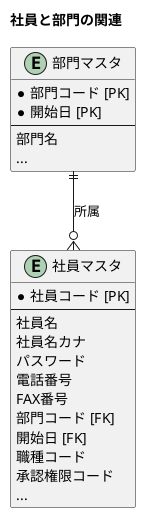

#### テーブル定義

```sql
create table if not exists 社員マスタ
(
    社員コード     varchar(10)                       not null
        constraint pk_employee primary key,
    社員名         varchar(20),
    社員名カナ     varchar(40),
    パスワード     varchar(8),
    電話番号       varchar(13),
    "FAX番号"      varchar(13),
    部門コード     varchar(6)                        not null,
    開始日         timestamp(6) default CURRENT_DATE not null,
    職種コード     varchar(2)                        not null,
    承認権限コード varchar(2)                        not null,
    作成日時       timestamp(6) default CURRENT_DATE not null,
    作成者名       varchar(12),
    更新日時       timestamp(6) default CURRENT_DATE not null,
    更新者名       varchar(12)
);
```

### 再帰的なデータ構造の表現

部門の階層構造を表現する方法には、主に以下の4つがあります。

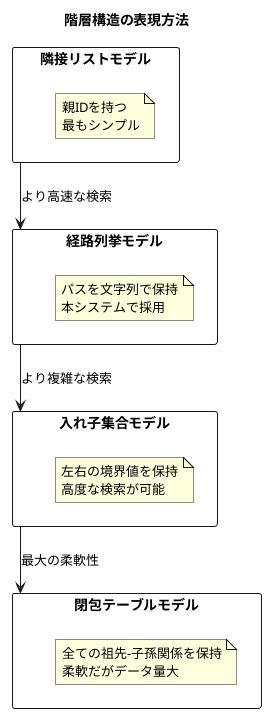

#### 各モデルの比較

| モデル | 子孫取得 | 祖先取得 | 移動操作 | 実装複雑度 |
|--------|----------|----------|----------|------------|
| 隣接リスト | 再帰クエリ | 再帰クエリ | 簡単 | 低 |
| 経路列挙 | LIKE検索 | パス解析 | 中程度 | 中 |
| 入れ子集合 | 範囲検索 | 範囲検索 | 複雑 | 高 |
| 閉包テーブル | 単純結合 | 単純結合 | 中程度 | 中 |

本システムでは、検索性能と実装の複雑さのバランスから経路列挙モデルを採用しています。

---

## 5.2 商品マスタ

### 商品分類と商品の関連

商品は商品分類に属し、分類自体も階層構造を持ちます。

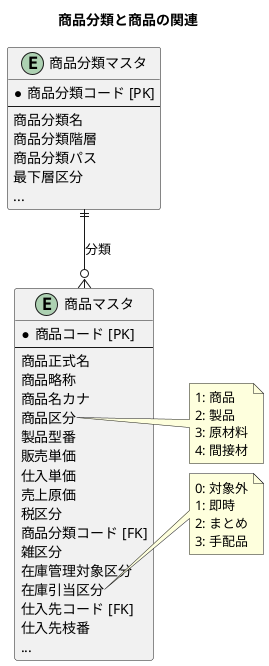

#### 商品分類マスタのテーブル定義

```sql
create table if not exists 商品分類マスタ
(
    商品分類コード varchar(8)                        not null
        constraint pk_product_category primary key,
    商品分類名     varchar(30),
    商品分類階層   integer      default 0            not null,
    商品分類パス   varchar(100),
    最下層区分     integer      default 0,
    作成日時       timestamp(6) default CURRENT_DATE not null,
    作成者名       varchar(12),
    更新日時       timestamp(6) default CURRENT_DATE not null,
    更新者名       varchar(12)
);
```

#### 商品マスタのテーブル定義

```sql
create table if not exists 商品マスタ
(
    商品コード       varchar(16)                       not null
        constraint pk_products primary key,
    商品正式名       varchar(40)                       not null,
    商品略称         varchar(10)                       not null,
    商品名カナ       varchar(20)                       not null,
    商品区分         varchar(1),
    製品型番         varchar(40),
    販売単価         integer      default 0            not null,
    仕入単価         integer      default 0,
    売上原価         integer      default 0            not null,
    税区分           integer      default 1            not null,
    商品分類コード   varchar(8),
    雑区分           integer,
    在庫管理対象区分 integer      default 1,
    在庫引当区分     integer,
    仕入先コード     varchar(8)                        not null,
    仕入先枝番       integer,
    作成日時         timestamp(6) default CURRENT_DATE not null,
    作成者名         varchar(12),
    更新日時         timestamp(6) default CURRENT_DATE not null,
    更新者名         varchar(12)
);
```

### 顧客別販売単価テーブル

特定の顧客に対して個別の販売単価を設定するためのテーブルです。

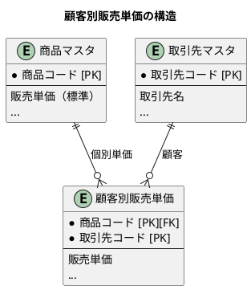

#### テーブル定義

```sql
create table if not exists 顧客別販売単価
(
    商品コード   varchar(16)                       not null
        references 商品マスタ
        on update cascade on delete restrict,
    取引先コード varchar(8)                        not null,
    販売単価     integer      default 0            not null,
    作成日時     timestamp(6) default CURRENT_DATE not null,
    作成者名     varchar(12),
    更新日時     timestamp(6) default CURRENT_DATE not null,
    更新者名     varchar(12),
    constraint pk_pricebycustomer
        primary key (商品コード, 取引先コード)
);
```

#### 価格決定ロジック

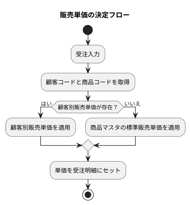

### 価格履歴の管理

本システムでは、価格の履歴管理について以下の方針を採用しています。

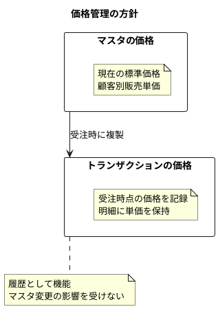

| 方式 | 説明 | 本システムの採用 |
|------|------|------------------|
| 現在価格のみ | マスタは最新の価格のみ保持 | 採用 |
| 履歴テーブル | 価格変更を別テーブルで管理 | 不採用 |
| 有効期間管理 | 開始日・終了日で有効期間を管理 | 不採用 |

本システムでは、受注明細に受注時点の単価を保持することで、事実上の価格履歴を実現しています。

### 代替商品と部品表

商品間の関連として、代替商品と部品表（BOM）を管理します。

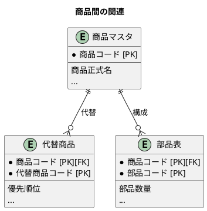

#### 代替商品テーブル

```sql
create table if not exists 代替商品
(
    商品コード     varchar(16)                       not null
        references 商品マスタ
        on update cascade on delete restrict,
    代替商品コード varchar(16)                       not null,
    優先順位       integer      default 1,
    作成日時       timestamp(6) default CURRENT_DATE not null,
    作成者名       varchar(12),
    更新日時       timestamp(6) default CURRENT_DATE not null,
    更新者名       varchar(12),
    constraint pk_alternate_products
        primary key (商品コード, 代替商品コード)
);
```

#### 部品表テーブル

```sql
create table if not exists 部品表
(
    商品コード varchar(16)                       not null
        references 商品マスタ
        on update cascade on delete restrict,
    部品コード varchar(16)                       not null,
    部品数量   integer      default 1            not null,
    作成日時   timestamp(6) default CURRENT_DATE not null,
    作成者名   varchar(12),
    更新日時   timestamp(6) default CURRENT_DATE not null,
    更新者名   varchar(12),
    constraint pk_bom
        primary key (商品コード, 部品コード)
);
```

---

## 5.3 取引先マスタ（パーティモデル）

### 顧客と仕入先の統合設計

本システムでは、パーティモデルを採用して取引先を統合管理しています。

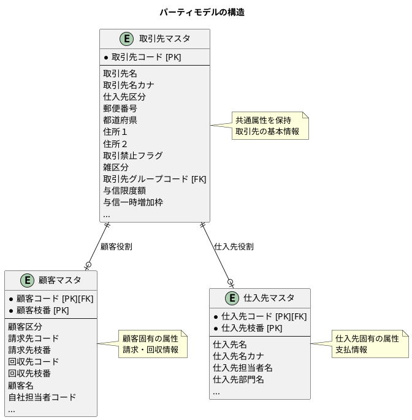

#### パーティモデルのメリット

| 観点 | メリット |
|------|----------|
| データ整合性 | 取引先の基本情報が一元管理される |
| 拡張性 | 新しい役割（例：協力会社）の追加が容易 |
| 柔軟性 | 同一企業が顧客と仕入先の両方になれる |
| 重複排除 | 住所等の共通情報の重複を防止 |

#### 取引先マスタのテーブル定義

```sql
create table if not exists 取引先マスタ
(
    取引先コード         varchar(8)                        not null
        constraint pk_companys_mst primary key,
    取引先名             varchar(40)                       not null,
    取引先名カナ         varchar(40),
    仕入先区分           integer      default 0,
    郵便番号             char(8),
    都道府県             varchar(4),
    住所１                varchar(40),
    住所２                varchar(40),
    取引禁止フラグ       integer      default 0,
    雑区分               integer      default 0,
    取引先グループコード varchar(4)                        not null,
    与信限度額           integer      default 0,
    与信一時増加枠       integer      default 0,
    作成日時             timestamp(6) default CURRENT_DATE not null,
    作成者名             varchar(12),
    更新日時             timestamp(6) default CURRENT_DATE not null,
    更新者名             varchar(12),
    version              integer      default 0
);
```

### 取引先グループと分類

取引先を様々な観点でグルーピングするための構造です。

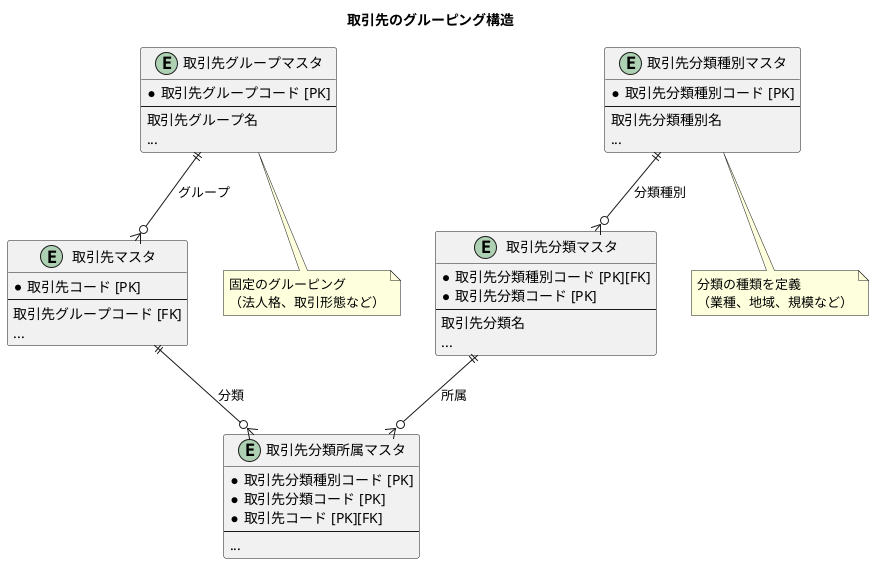

#### 分類の使い分け

| 分類方式 | 用途 | 例 |
|----------|------|-----|
| 取引先グループ | 固定的な1対1の分類 | 法人格（株式会社、有限会社） |
| 取引先分類 | 多対多の柔軟な分類 | 業種、地域、取引形態 |

### ロール（役割）による拡張性

取引先は複数の役割を持つことができます。

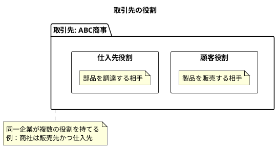

#### 顧客マスタのテーブル定義

```sql
create table if not exists 顧客マスタ
(
    顧客コード         varchar(8)                        not null
        references 取引先マスタ
        on update cascade on delete restrict,
    顧客枝番           integer                           not null,
    顧客区分           integer      default 0,
    請求先コード       varchar(8)                        not null,
    請求先枝番         integer,
    回収先コード       varchar(8)                        not null,
    回収先枝番         integer,
    顧客名             varchar(40)                       not null,
    顧客名カナ         varchar(40),
    自社担当者コード   varchar(10)                       not null,
    顧客担当者名       varchar(20),
    顧客部門名         varchar(40),
    顧客郵便番号       char(8),
    顧客都道府県       varchar(4),
    顧客住所１          varchar(40),
    顧客住所２          varchar(40),
    顧客電話番号       varchar(13),
    "顧客ＦＡＸ番号"      varchar(13),
    顧客メールアドレス varchar(100),
    顧客請求区分       integer      default 0,
    顧客締日１          integer                           not null,
    顧客支払月１        integer      default 1,
    顧客支払日１        integer,
    顧客支払方法１      integer      default 1,
    顧客締日２          integer                           not null,
    顧客支払月２        integer      default 1,
    顧客支払日２        integer,
    顧客支払方法２      integer      default 1,
    作成日時           timestamp(6) default CURRENT_DATE not null,
    作成者名           varchar(12),
    更新日時           timestamp(6) default CURRENT_DATE not null,
    更新者名           varchar(12),
    constraint pk_customer
        primary key (顧客コード, 顧客枝番)
);
```

#### 仕入先マスタのテーブル定義

```sql
create table if not exists 仕入先マスタ
(
    仕入先コード         varchar(8)                        not null
        references 取引先マスタ
        on update cascade on delete restrict,
    仕入先枝番           integer                           not null,
    仕入先名             varchar(40)                       not null,
    仕入先名カナ         varchar(40),
    仕入先担当者名       varchar(20),
    仕入先部門名         varchar(40),
    仕入先郵便番号       char(8),
    仕入先都道府県       varchar(4),
    仕入先住所１          varchar(40),
    仕入先住所２          varchar(40),
    仕入先電話番号       varchar(13),
    "仕入先ＦＡＸ番号"      varchar(13),
    仕入先メールアドレス varchar(100),
    仕入先締日           integer                           not null,
    仕入先支払月         integer      default 1,
    仕入先支払日         integer,
    仕入先支払方法       integer      default 1,
    作成日時             timestamp(6) default CURRENT_DATE not null,
    作成者名             varchar(12),
    更新日時             timestamp(6) default CURRENT_DATE not null,
    更新者名             varchar(12),
    constraint pk_supplier
        primary key (仕入先コード, 仕入先枝番)
);
```

### 出荷先の管理

顧客には複数の出荷先を設定できます。

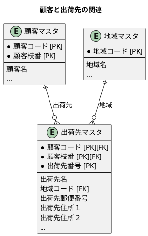

---

## 5.4 在庫関連マスタ

### 倉庫と棚番（ロケーション）

在庫を管理するための物理的な場所を表現します。

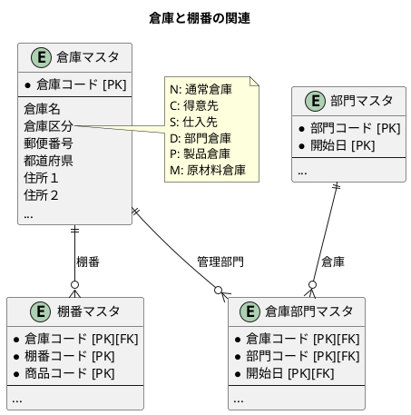

#### 倉庫マスタのテーブル定義

```sql
create table if not exists 倉庫マスタ
(
    倉庫コード varchar(3)                        not null
        constraint pk_wh_mst primary key,
    倉庫名     varchar(20),
    倉庫区分   varchar(1)   default 'N',
    郵便番号   char(8),
    都道府県   varchar(4),
    住所１      varchar(40),
    住所２      varchar(40),
    作成日時   timestamp(6) default CURRENT_DATE not null,
    作成者名   varchar(12),
    更新日時   timestamp(6) default CURRENT_DATE not null,
    更新者名   varchar(12)
);
```

#### 棚番マスタのテーブル定義

```sql
create table if not exists 棚番マスタ
(
    倉庫コード varchar(3)                        not null
        references 倉庫マスタ
        on update cascade on delete restrict,
    棚番コード varchar(4)                        not null,
    商品コード varchar(16)                       not null,
    作成日時   timestamp(6) default CURRENT_DATE not null,
    作成者名   varchar(12),
    更新日時   timestamp(6) default CURRENT_DATE not null,
    更新者名   varchar(12),
    constraint pk_location_mst
        primary key (倉庫コード, 棚番コード, 商品コード)
);
```

### 商品と在庫の関連

在庫データは倉庫、商品、ロット、区分の組み合わせで一意に識別されます。

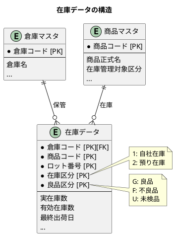

#### 在庫データのテーブル定義

```sql
create table if not exists 在庫データ
(
    倉庫コード varchar(3)                        not null
        references 倉庫マスタ
        on update cascade on delete restrict,
    商品コード varchar(16)                       not null,
    ロット番号 varchar(20)                       not null,
    在庫区分   varchar(1)   default '1'          not null,
    良品区分   varchar(1)   default 'G'          not null,
    実在庫数   integer      default 1            not null,
    有効在庫数 integer      default 1            not null,
    最終出荷日 timestamp(6),
    作成日時   timestamp(6) default CURRENT_DATE not null,
    作成者名   varchar(12),
    更新日時   timestamp(6) default CURRENT_DATE not null,
    更新者名   varchar(12),
    version    integer      default 1            not null,
    constraint pk_stock
        primary key (倉庫コード, 商品コード, ロット番号, 在庫区分, 良品区分)
);
```

#### 在庫数の種類

| 種類 | 説明 | 計算方法 |
|------|------|----------|
| 実在庫数 | 実際に倉庫にある数量 | 入庫 - 出庫 |
| 有効在庫数 | 出荷可能な数量 | 実在庫数 - 引当数 |
| 引当数 | 受注に引き当てられた数量 | 受注明細の引当数合計 |

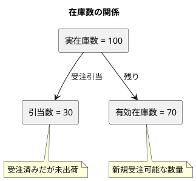

---

## まとめ

本章では、マスタデータモデルの詳細について解説しました。

- **組織マスタ**: 経路列挙モデルによる部門階層構造、社員との関連
- **商品マスタ**: 商品分類との階層関連、顧客別単価、代替商品・部品表
- **取引先マスタ**: パーティモデルによる顧客・仕入先の統合設計
- **在庫関連マスタ**: 倉庫・棚番によるロケーション管理、複合キーによる在庫識別

次章では、トランザクションデータモデルについて解説します。
