# 第6章: トランザクションデータモデル

## 6.1 販売トランザクション

### 受注ヘッダと受注明細

販売業務の中心となる受注データは、ヘッダ・明細パターンで設計されています。

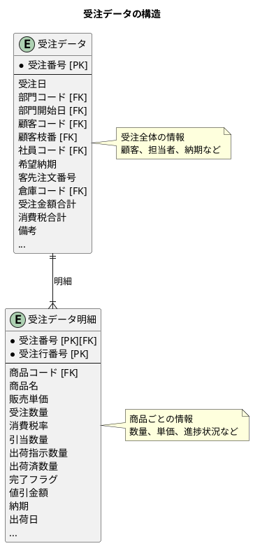

#### 受注データのテーブル定義

```sql
create table if not exists 受注データ
(
    受注番号     varchar(10)                       not null
        constraint pk_orders primary key,
    受注日       timestamp(6) default CURRENT_DATE not null,
    部門コード   varchar(6)                        not null,
    部門開始日   timestamp(6) default CURRENT_DATE not null,
    顧客コード   varchar(8)                        not null,
    顧客枝番     integer,
    社員コード   varchar(10)                       not null,
    希望納期     timestamp(6),
    客先注文番号 varchar(20),
    倉庫コード   varchar(3)                        not null,
    受注金額合計 integer      default 0            not null,
    消費税合計   integer      default 0            not null,
    備考         varchar(1000),
    作成日時     timestamp(6) default CURRENT_DATE not null,
    作成者名     varchar(12),
    更新日時     timestamp(6) default CURRENT_DATE not null,
    更新者名     varchar(12),
    version      integer      default 0
);
```

#### 受注データ明細のテーブル定義

```sql
create table if not exists 受注データ明細
(
    受注番号     varchar(10)                       not null
        references 受注データ
        on update cascade on delete restrict,
    受注行番号   integer                           not null,
    商品コード   varchar(16)                       not null,
    商品名       varchar(10)                       not null,
    販売単価     integer      default 0            not null,
    受注数量     integer      default 1            not null,
    消費税率     integer      default 0,
    引当数量     integer      default 0,
    出荷指示数量 integer      default 0,
    出荷済数量   integer      default 0,
    完了フラグ   integer      default 0            not null,
    値引金額     integer      default 0            not null,
    納期         timestamp(6),
    出荷日       timestamp(6),
    作成日時     timestamp(6) default CURRENT_DATE not null,
    作成者名     varchar(12),
    更新日時     timestamp(6) default CURRENT_DATE not null,
    更新者名     varchar(12),
    primary key (受注番号, 受注行番号)
);
```

#### ヘッダ・明細パターンの特徴

| 観点 | ヘッダ（受注データ） | 明細（受注データ明細） |
|------|----------------------|------------------------|
| 識別 | 受注番号で一意 | 受注番号 + 行番号で一意 |
| 内容 | 取引全体の情報 | 商品ごとの詳細 |
| カーディナリティ | 1 | N（複数行） |
| 関連マスタ | 顧客、部門、社員 | 商品 |

### 出荷・売上データ

本システムでは、受注明細の進捗状況を複数の数量項目で管理しています。

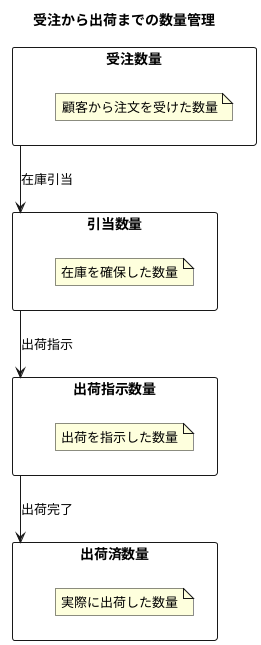

#### 数量項目の関係

| 項目 | 説明 | 更新タイミング |
|------|------|----------------|
| 受注数量 | 注文を受けた数量 | 受注登録時 |
| 引当数量 | 在庫を確保した数量 | 在庫引当処理時 |
| 出荷指示数量 | 出荷を指示した数量 | 出荷指示時 |
| 出荷済数量 | 出荷完了した数量 | 出荷完了時 |

#### 完了フラグの判定

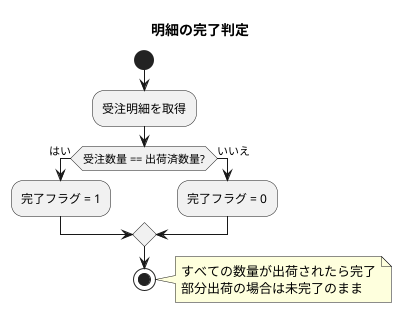

### 請求・入金データ

売上から請求へ、請求から入金へとデータが連携します。

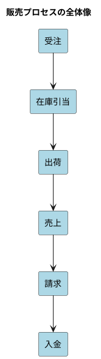

#### 請求データの構造

請求データは売上明細を集約し、顧客への請求書を構成します。

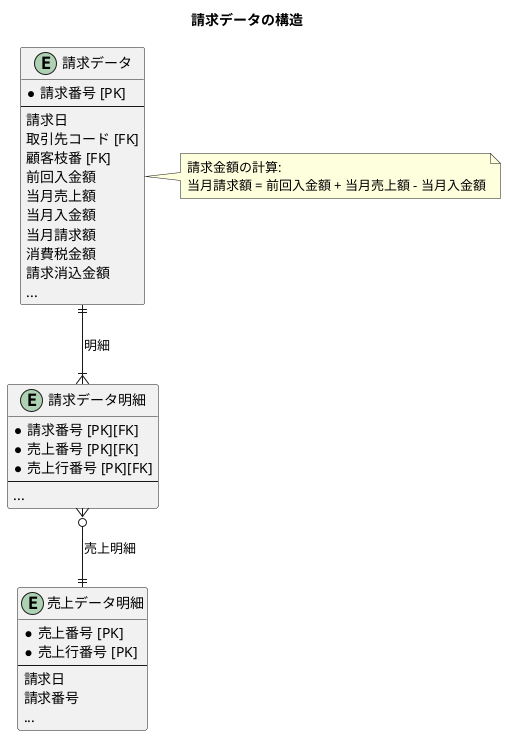

#### 請求データのテーブル定義

```sql
create table if not exists 請求データ
(
    請求番号     varchar(10)                       not null
        constraint pk_invoice primary key,
    請求日       timestamp(6),
    取引先コード varchar(8)                        not null,
    顧客枝番     integer      default 0,
    前回入金額   integer      default 0,
    当月売上額   integer      default 0,
    当月入金額   integer      default 0,
    当月請求額   integer      default 0,
    消費税金額   integer      default 0            not null,
    請求消込金額 integer      default 0,
    作成日時     timestamp(6) default CURRENT_DATE not null,
    作成者名     varchar(12),
    更新日時     timestamp(6) default CURRENT_DATE not null,
    更新者名     varchar(12)
);
```

#### 請求データ明細のテーブル定義

```sql
create table if not exists 請求データ明細
(
    請求番号   varchar(10)                       not null
        references 請求データ
            on update cascade on delete restrict,
    売上番号   varchar(10)                       not null,
    売上行番号 integer                           not null,
    作成日時   timestamp(6) default CURRENT_DATE not null,
    作成者名   varchar(12),
    更新日時   timestamp(6) default CURRENT_DATE not null,
    更新者名   varchar(12),
    constraint pk_invoice_details
        primary key (請求番号, 売上番号, 売上行番号),
    foreign key (売上番号, 売上行番号) references 売上データ明細
        on update cascade on delete restrict
);
```

#### 入金データの構造

入金データは顧客からの支払いを記録し、請求との消込処理を行います。

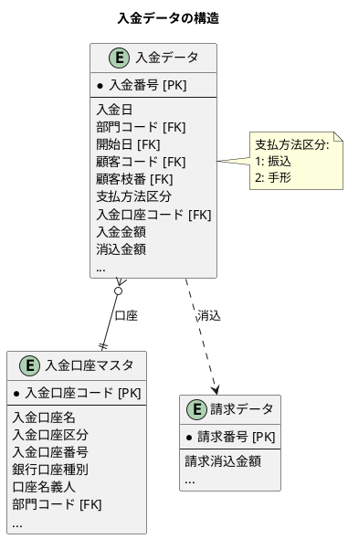

#### 入金データのテーブル定義

```sql
create table if not exists 入金データ
(
    入金番号           varchar(10)                       not null
        constraint pk_credit primary key,
    入金日             timestamp(6),
    部門コード         varchar(6)                        not null,
    開始日             timestamp(6) default CURRENT_DATE not null,
    顧客コード         varchar(8)                        not null,
    顧客枝番           integer      default 0,
    支払方法区分       integer      default 1,
    入金口座コード     varchar(8),
    入金金額           integer      default 0,
    消込金額           integer      default 0,
    作成日時           timestamp(6) default CURRENT_DATE not null,
    作成者名           varchar(12),
    更新日時           timestamp(6) default CURRENT_DATE not null,
    更新者名           varchar(12),
    プログラム更新日時 timestamp(6) default CURRENT_DATE,
    更新プログラム名   varchar(50)
);
```

#### 入金口座マスタのテーブル定義

```sql
create table if not exists 入金口座マスタ
(
    入金口座コード       varchar(8)                        not null
        constraint pk_bank_acut_mst primary key,
    入金口座名           varchar(30),
    適用開始日           timestamp(6) default CURRENT_DATE not null,
    適用終了日           timestamp(6) default '2100-12-31 00:00:00',
    適用開始後入金口座名 varchar(30),
    入金口座区分         varchar(1),
    入金口座番号         varchar(12),
    銀行口座種別         varchar(1),
    口座名義人           varchar(20),
    部門コード           varchar(6)                        not null,
    部門開始日           timestamp(6) default CURRENT_DATE not null,
    全銀協銀行コード     varchar(4),
    全銀協支店コード     varchar(3),
    作成日時             timestamp(6) default CURRENT_DATE not null,
    作成者名             varchar(12),
    更新日時             timestamp(6) default CURRENT_DATE not null,
    更新者名             varchar(12)
);
```

#### 請求・入金の消込処理

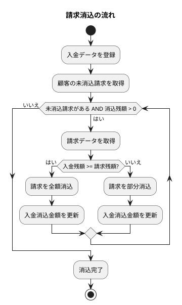

---

## 6.2 調達トランザクション

### 発注ヘッダと発注明細

調達業務の発注データも、ヘッダ・明細パターンで設計されています。

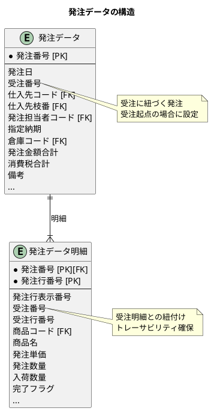

#### 発注データのテーブル定義

```sql
create table if not exists 発注データ
(
    発注番号         varchar(10)                       not null
        constraint pk_purchase_orders primary key,
    発注日           timestamp(6),
    受注番号         varchar(10)                       not null,
    仕入先コード     varchar(8)                        not null,
    仕入先枝番       integer      default 0,
    発注担当者コード varchar(10)                       not null,
    指定納期         timestamp(6),
    倉庫コード       varchar(3)                        not null,
    発注金額合計     integer      default 0,
    消費税合計       integer      default 0            not null,
    備考             varchar(1000),
    作成日時         timestamp(6) default CURRENT_DATE not null,
    作成者名         varchar(12),
    更新日時         timestamp(6) default CURRENT_DATE not null,
    更新者名         varchar(12),
    version          integer      default 1            not null
);
```

#### 発注データ明細のテーブル定義

```sql
create table if not exists 発注データ明細
(
    発注番号       varchar(10)                       not null
        references 発注データ
        on update cascade on delete restrict,
    発注行番号     integer                           not null,
    発注行表示番号 integer                           not null,
    受注番号       varchar(10)                       not null,
    受注行番号     integer                           not null,
    商品コード     varchar(16)                       not null,
    商品名         varchar(10)                       not null,
    発注単価       integer      default 0,
    発注数量       integer      default 1            not null,
    入荷数量       integer      default 1            not null,
    完了フラグ     integer      default 0            not null,
    作成日時       timestamp(6) default CURRENT_DATE not null,
    作成者名       varchar(12),
    更新日時       timestamp(6) default CURRENT_DATE not null,
    更新者名       varchar(12),
    version        integer      default 1            not null,
    constraint pk_purchase_order_details
        primary key (発注行番号, 発注番号)
);
```

### 仕入・支払データ

発注から入荷、仕入、支払へとデータが連携します。

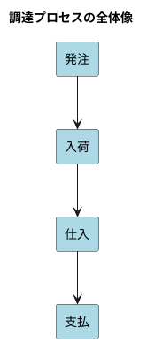

#### 仕入データの構造

仕入データは発注に基づく入荷検収の結果を記録します。

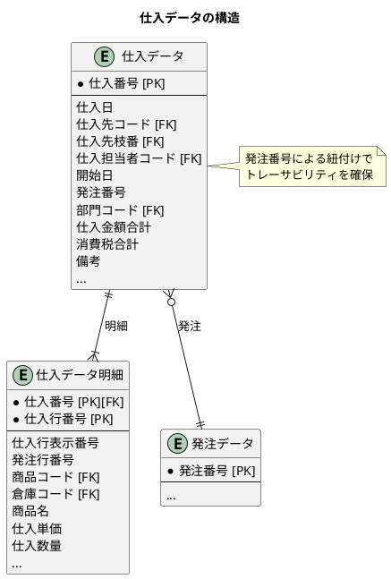

#### 仕入データのテーブル定義

```sql
create table if not exists 仕入データ
(
    仕入番号         varchar(10)                       not null
        constraint pk_pu primary key,
    仕入日           timestamp(6) default CURRENT_DATE,
    仕入先コード     varchar(8)                        not null,
    仕入先枝番       integer      default 0,
    仕入担当者コード varchar(10)                       not null,
    開始日           timestamp(6) default CURRENT_DATE not null,
    発注番号         varchar(10),
    部門コード       varchar(6)                        not null,
    仕入金額合計     integer      default 0,
    消費税合計       integer      default 0            not null,
    備考             varchar(1000),
    作成日時         timestamp(6) default CURRENT_DATE not null,
    作成者名         varchar(12),
    更新日時         timestamp(6) default CURRENT_DATE not null,
    updater          varchar(12),
    version          integer      default 1            not null
);
```

#### 仕入データ明細のテーブル定義

```sql
create table if not exists 仕入データ明細
(
    仕入番号       varchar(10)                       not null
        references 仕入データ
            on update cascade on delete restrict,
    仕入行番号     integer                           not null,
    仕入行表示番号 integer                           not null,
    発注行番号     integer                           not null,
    商品コード     varchar(16)                       not null,
    倉庫コード     varchar(3)                        not null,
    商品名         varchar(10)                       not null,
    仕入単価       integer      default 0,
    仕入数量       integer      default 1            not null,
    作成日時       timestamp(6) default CURRENT_DATE not null,
    作成者名       varchar(12),
    更新日時       timestamp(6) default CURRENT_DATE not null,
    更新者名       varchar(12),
    version        integer      default 1            not null,
    constraint pk_pu_details
        primary key (仕入行番号, 仕入番号)
);
```

#### 支払データの構造

支払データは仕入先への支払いを管理します。

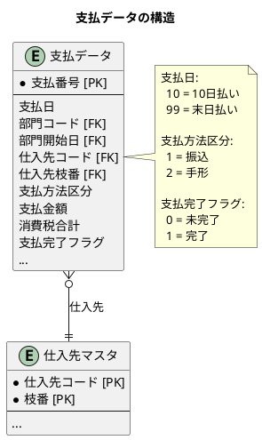

#### 支払データのテーブル定義

```sql
create table if not exists 支払データ
(
    支払番号       varchar(10)                       not null
        constraint pk_pay primary key,
    支払日         integer      default 0,
    部門コード     varchar(6)                        not null,
    部門開始日     timestamp(6) default CURRENT_DATE not null,
    仕入先コード   varchar(8)                        not null,
    仕入先枝番     integer      default 0,
    支払方法区分   integer      default 1,
    支払金額       integer      default 0,
    消費税合計     integer      default 0            not null,
    支払完了フラグ integer      default 0            not null,
    作成日時       timestamp(6) default CURRENT_DATE not null,
    作成者名       varchar(12),
    更新日時       timestamp(6) default CURRENT_DATE not null,
    更新者名       varchar(12)
);
```

### 発注から支払までのデータフロー

受注と発注の連携を含めた全体のデータフローを示します。

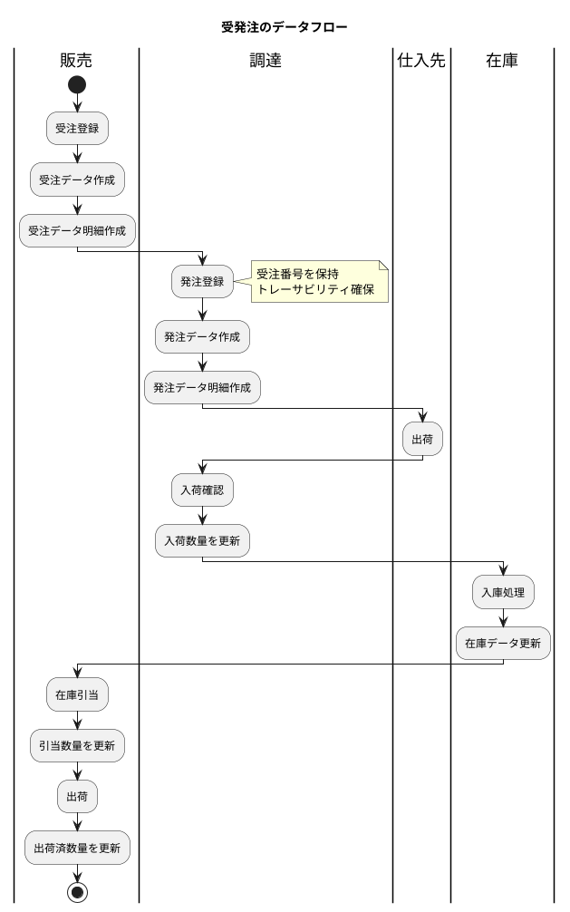

### 受注と発注の紐付け

受注から発注への紐付けにより、トレーサビリティを確保しています。

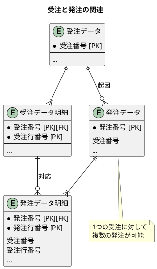

---

## 6.3 在庫トランザクション

### 在庫データの構造

在庫データは、倉庫・商品・ロット・在庫区分・良品区分の5つの項目で複合主キーを構成します。

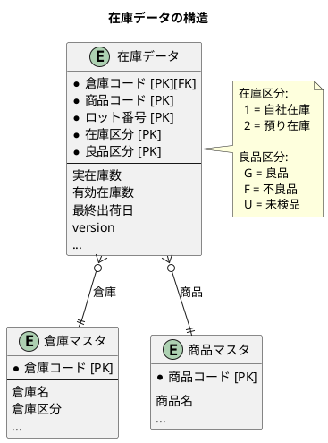

#### 在庫データのテーブル定義

```sql
create table if not exists 在庫データ
(
    倉庫コード varchar(3)                                  not null
        references 倉庫マスタ
            on update cascade on delete restrict,
    商品コード varchar(16)                                 not null,
    ロット番号 varchar(20)                                 not null,
    在庫区分   varchar(1)   default '1'                    not null,
    良品区分   varchar(1)   default 'G'                    not null,
    実在庫数   integer      default 1                      not null,
    有効在庫数 integer      default 1                      not null,
    最終出荷日 timestamp(6),
    作成日時   timestamp(6) default CURRENT_DATE           not null,
    作成者名   varchar(12),
    更新日時   timestamp(6) default CURRENT_DATE           not null,
    更新者名   varchar(12),
    version    integer      default 1                      not null,
    constraint pk_stock
        primary key (倉庫コード, 商品コード, ロット番号, 在庫区分, 良品区分)
);
```

#### 実在庫数と有効在庫数

| 項目 | 説明 |
|------|------|
| 実在庫数 | 物理的に存在する在庫の数量 |
| 有効在庫数 | 引当可能な在庫の数量（実在庫数 - 引当済数量） |

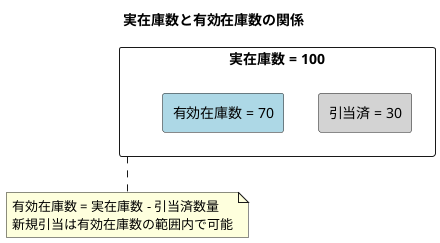

### 在庫移動の記録

在庫の増減は、受注・発注に連動して記録されます。

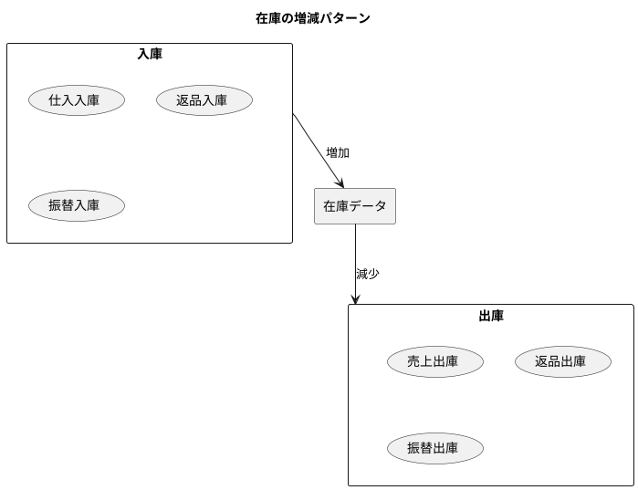

#### 在庫データの更新タイミング

| イベント | 実在庫数 | 有効在庫数 | 備考 |
|----------|----------|------------|------|
| 仕入入庫 | +n | +n | 入荷検収完了時 |
| 在庫引当 | - | -n | 受注確定時 |
| 出荷 | -n | - | 出荷完了時 |
| 引当解除 | - | +n | 受注取消時 |

### 在庫残高の計算方法

在庫残高は、トランザクションの積み重ねではなく、現在値として管理しています。

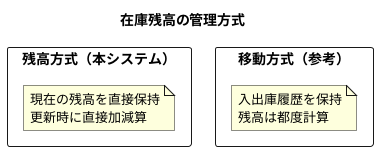

#### 残高方式のメリット・デメリット

| 観点 | メリット | デメリット |
|------|----------|------------|
| 参照性能 | 残高を直接取得可能 | - |
| 履歴管理 | - | 履歴は別途管理が必要 |
| 整合性 | - | 排他制御が重要 |
| 実装 | シンプル | 移動履歴との乖離リスク |

### 楽観的ロックによる排他制御

在庫データの更新には、version 列による楽観的ロックを使用しています。

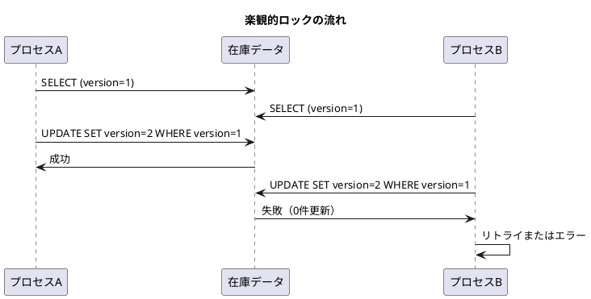

```sql
-- 楽観的ロックの更新例
UPDATE 在庫データ
SET 実在庫数 = 実在庫数 - 10,
    有効在庫数 = 有効在庫数 - 10,
    version = version + 1
WHERE 倉庫コード = '001'
  AND 商品コード = 'P001'
  AND ロット番号 = 'LOT001'
  AND 在庫区分 = '1'
  AND 良品区分 = 'G'
  AND version = 1;
```

---

## 6.4 ステータス管理

### 状態遷移の設計

受注・発注の状態は、数量項目の値から判定します。

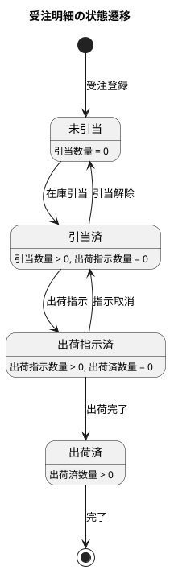

#### 状態の判定ロジック

本システムでは、専用のステータス列を持たず、数量項目から状態を導出します。

```java
// 状態判定の例（擬似コード）
public OrderLineStatus getStatus(OrderLine line) {
    if (line.getShippedQuantity() >= line.getOrderQuantity()) {
        return OrderLineStatus.COMPLETED;
    }
    if (line.getShipInstructionQuantity() > 0) {
        return OrderLineStatus.SHIP_INSTRUCTED;
    }
    if (line.getAllocatedQuantity() > 0) {
        return OrderLineStatus.ALLOCATED;
    }
    return OrderLineStatus.NOT_ALLOCATED;
}
```

#### 状態管理のアプローチ比較

| アプローチ | 説明 | 本システムの採用 |
|------------|------|------------------|
| ステータス列 | 状態を専用列で管理 | 部分採用（完了フラグ） |
| 数量導出 | 数量から状態を計算 | 採用 |
| イベントソーシング | イベント履歴から状態を再構築 | 不採用 |

### 履歴テーブルの活用

トランザクションデータの変更履歴は、監査証跡として重要です。

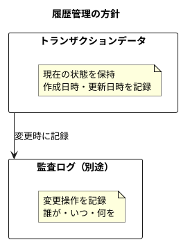

#### 監査項目

| 項目 | 説明 |
|------|------|
| 作成日時 | レコード作成日時 |
| 作成者名 | レコード作成者 |
| 更新日時 | 最終更新日時 |
| 更新者名 | 最終更新者 |
| version | 楽観的ロック用バージョン |

---

## トランザクション間の関連

販売・調達・在庫のトランザクションは相互に関連しています。

```plantuml
@startuml
title トランザクション間の関連

entity "受注データ" as order {
  * 受注番号 [PK]
  --
  顧客コード
  倉庫コード
  ...
}

entity "受注データ明細" as order_line {
  * 受注番号 [PK][FK]
  * 受注行番号 [PK]
  --
  商品コード
  引当数量
  ...
}

entity "発注データ" as po {
  * 発注番号 [PK]
  --
  受注番号
  仕入先コード
  倉庫コード
  ...
}

entity "発注データ明細" as po_line {
  * 発注番号 [PK][FK]
  * 発注行番号 [PK]
  --
  受注番号
  受注行番号
  商品コード
  ...
}

entity "在庫データ" as stock {
  * 倉庫コード [PK]
  * 商品コード [PK]
  * ロット番号 [PK]
  * 在庫区分 [PK]
  * 良品区分 [PK]
  --
  実在庫数
  有効在庫数
  ...
}

order ||--|{ order_line
po ||--|{ po_line
order ||--o{ po : "起因"
order_line ||--o{ po_line : "対応"
order_line }o--|| stock : "引当"
po_line }o--|| stock : "入庫先"

@enduml
```

---

## まとめ

本章では、トランザクションデータモデルの詳細について解説しました。

- **販売トランザクション**: ヘッダ・明細パターンによる受注管理、数量による進捗管理
- **調達トランザクション**: 受注との紐付けによるトレーサビリティ確保
- **在庫トランザクション**: 残高方式による在庫管理、楽観的ロックによる排他制御
- **ステータス管理**: 数量からの状態導出、監査項目の標準化

次章では、ドメインモデルとデータモデルの対応について解説します。
