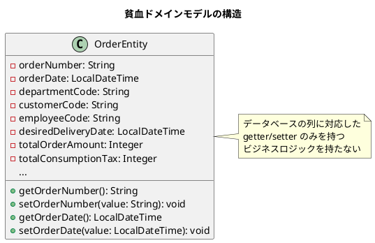
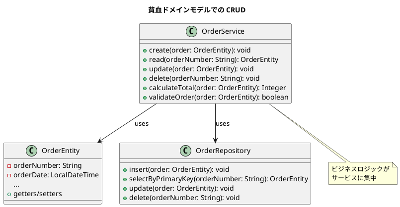
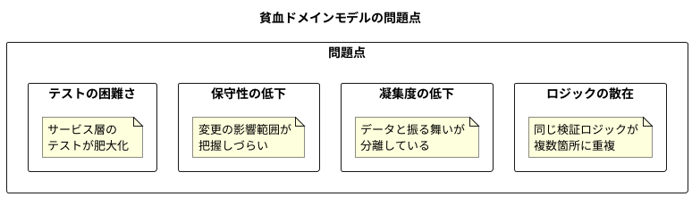
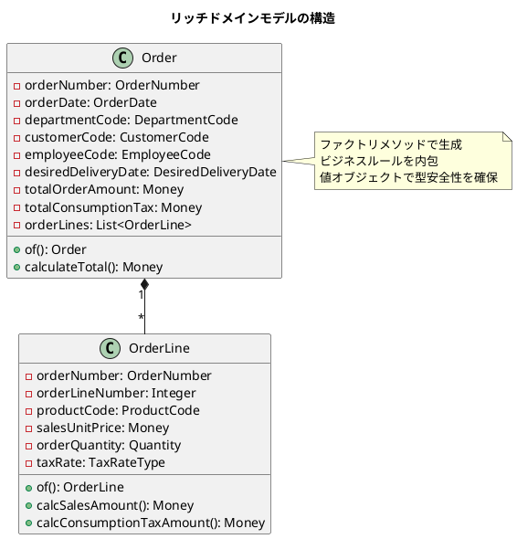
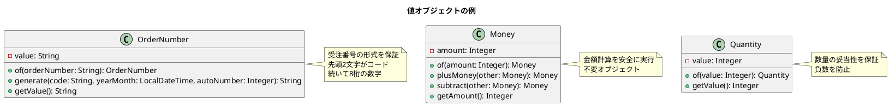
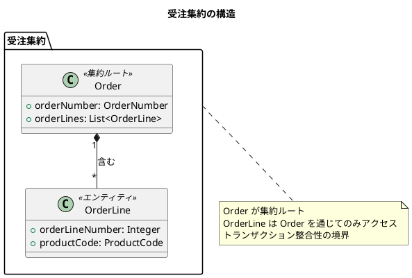
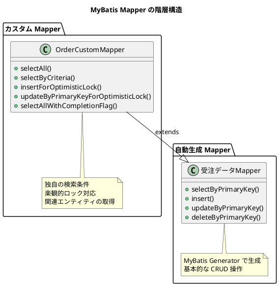
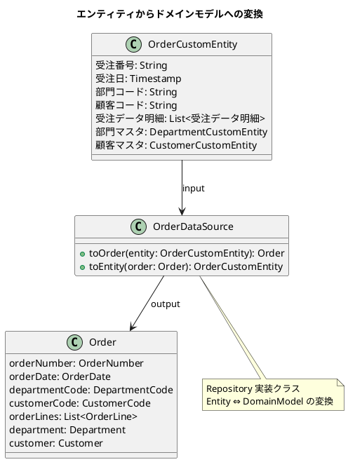

# 第7章: ドメインモデルとデータモデルの対応

## 7.1 貧血ドメインモデル

### データ中心の初期設計

多くのシステムでは、開発初期にデータベーステーブルの構造をそのままオブジェクトにマッピングした「貧血ドメインモデル」から始まります。



#### 貧血ドメインモデルの特徴

| 観点 | 説明 |
|------|------|
| 構造 | テーブル構造と1対1でマッピング |
| メソッド | getter/setter のみ |
| ビジネスロジック | 外部のサービスクラスに配置 |
| 検証 | 外部で実施 |

### CRUD 操作の実装

貧血ドメインモデルでは、CRUD 操作はサービス層で実装されます。



### 問題点と限界

貧血ドメインモデルには、以下のような問題があります。



#### 具体的な問題例

```java
// サービス層にビジネスロジックが散在
public class OrderService {

    public void createOrder(OrderEntity order) {
        // 検証ロジックがサービスに
        if (order.getOrderDate().isAfter(order.getDesiredDeliveryDate())) {
            throw new IllegalArgumentException("受注日は納品希望日より前に設定してください");
        }

        // 計算ロジックもサービスに
        int total = 0;
        for (OrderLineEntity line : order.getOrderLines()) {
            total += line.getSalesUnitPrice() * line.getOrderQuantity();
        }
        order.setTotalOrderAmount(total);

        repository.insert(order);
    }
}
```

---

## 7.2 リッチドメインモデルへの進化

### ビジネスロジックのエンティティ移動

本システムでは、ビジネスロジックをドメインモデルに移動させています。



#### 実際のコード例

本システムの Order クラスでは、ファクトリメソッドでバリデーションと計算を行っています。

```java
@Value
@AllArgsConstructor
@NoArgsConstructor(force = true)
@Builder(toBuilder = true)
public class Order {
    OrderNumber orderNumber;
    OrderDate orderDate;
    DepartmentCode departmentCode;
    LocalDateTime departmentStartDate;
    CustomerCode customerCode;
    EmployeeCode employeeCode;
    DesiredDeliveryDate desiredDeliveryDate;
    String customerOrderNumber;
    String warehouseCode;
    Money totalOrderAmount;
    Money totalConsumptionTax;
    String remarks;
    List<OrderLine> orderLines;
    Department department;
    Customer customer;
    Employee employee;

    public static Order of(String orderNumber, LocalDateTime orderDate,
            String departmentCode, LocalDateTime departmentStartDate,
            String customerCode, Integer customerBranchNumber,
            String employeeCode, LocalDateTime desiredDeliveryDate,
            String customerOrderNumber, String warehouseCode,
            Integer totalOrderAmount, Integer totalConsumptionTax,
            String remarks, List<OrderLine> orderLines) {

        // ビジネスルール: 受注日は納品希望日より前
        isTrue(!orderDate.isAfter(desiredDeliveryDate),
               "受注日は納品希望日より前に設定してください");

        // 明細から合計を計算
        Money calcTotalOrderAmount = orderLines.stream()
                .map(OrderLine::calcSalesAmount)
                .reduce(Money.of(0), Money::plusMoney);

        Money calcTotalConsumptionTax = orderLines.stream()
                .map(OrderLine::calcConsumptionTaxAmount)
                .reduce(Money.of(0), Money::plusMoney);

        return new Order(/* 省略 */);
    }
}
```

### 値オブジェクトの導入

プリミティブ型を値オブジェクトでラップすることで、型安全性と検証を強化しています。



#### 値オブジェクトの実装例

```java
@Value
@NoArgsConstructor(force = true)
public class OrderNumber {
    String value;

    public OrderNumber(String orderNumber) {
        notNull(orderNumber, "受注番号は必須です");
        isTrue(orderNumber.startsWith(DocumentTypeCode.受注.getCode()),
               "注文番号は先頭が" + DocumentTypeCode.受注.getCode() + "で始まる必要があります");
        matchesPattern(orderNumber, "^[A-Za-z]{2}[0-9]{8}$",
                       "注文番号は先頭2文字がコード、続いて8桁の数字である必要があります");
        this.value = orderNumber;
    }

    public static OrderNumber of(String orderNumber) {
        return new OrderNumber(orderNumber);
    }

    public static String generate(String code, LocalDateTime yearMonth, Integer autoNumber) {
        isTrue(code.equals(DocumentTypeCode.受注.getCode()),
               "受注番号は先頭が" + DocumentTypeCode.受注.getCode() + "で始まる必要があります");
        return code + yearMonth.format(DateTimeFormatter.ofPattern("yyMM"))
               + String.format("%04d", autoNumber);
    }
}
```

### 集約の設計

関連するエンティティをまとめて集約として扱います。



#### 集約設計の原則

| 原則 | 説明 | 本システムでの適用 |
|------|------|-------------------|
| 集約ルート経由 | 内部エンティティは集約ルート経由でアクセス | Order を通じて OrderLine を操作 |
| トランザクション境界 | 1つのトランザクションで1つの集約を更新 | 受注と明細を同時に保存 |
| 参照の整合性 | 集約内では強い整合性、集約間では結果整合性 | 受注-明細は強整合性 |

---

## 7.3 MyBatis によるマッピング

### Mapper XML の構成

本システムでは、MyBatis の Mapper XML を以下のように構成しています。



#### Mapper XML の構成例

```xml
<?xml version="1.0" encoding="UTF-8"?>
<!DOCTYPE mapper PUBLIC "-//mybatis.org//DTD Mapper 3.0//EN"
    "http://mybatis.org/dtd/mybatis-3-mapper.dtd">
<mapper namespace="com.example.sms.infrastructure.datasource.sales.order.OrderCustomMapper">

  <!-- 自動生成の ResultMap を拡張 -->
  <resultMap
          id="BaseResultMap"
          type="com.example.sms.infrastructure.datasource.sales.order.OrderCustomEntity"
          extends="com.example.sms.infrastructure.datasource.autogen.mapper.受注データMapper.BaseResultMap">

      <!-- 部門マスタとの関連 -->
      <association property="部門マスタ"
                   javaType="com.example.sms.infrastructure.datasource.master.department.DepartmentCustomEntity"
                   column="{部門コード=部門コード, 開始日=部門開始日}"
                   select="com.example.sms.infrastructure.datasource.master.department.DepartmentCustomMapper.selectByPrimaryKey"
                   fetchType="eager"/>

      <!-- 顧客マスタとの関連 -->
      <association property="顧客マスタ"
                  javaType="com.example.sms.infrastructure.datasource.master.partner.customer.CustomerCustomEntity"
                  column="{顧客コード=顧客コード, 顧客枝番=顧客枝番}"
                  select="com.example.sms.infrastructure.datasource.master.partner.customer.CustomerCustomMapper.selectByPrimaryKey"
                  fetchType="eager"/>

      <!-- 受注明細との関連 -->
      <collection property="受注データ明細"
                  javaType="ArrayList"
                  column="受注番号"
                  select="com.example.sms.infrastructure.datasource.sales.order.order_line.OrderLineCustomMapper.selectBySalesOrderNumber"
                  fetchType="eager"/>
  </resultMap>

  <select id="selectByPrimaryKey" parameterType="java.lang.String" resultMap="BaseResultMap">
      select
      <include refid="com.example.sms.infrastructure.datasource.autogen.mapper.受注データMapper.Base_Column_List"/>
      from public.受注データ
      where 受注番号 = #{受注番号,jdbcType=VARCHAR}
  </select>

</mapper>
```

### 動的 SQL の活用

MyBatis の動的 SQL を使って、柔軟な検索条件を実装しています。

```xml
<select id="selectByCriteria" resultMap="BaseResultMap">
    select
    <include refid="com.example.sms.infrastructure.datasource.autogen.mapper.受注データMapper.Base_Column_List"/>
    from public.受注データ
    <where>
        <if test="orderNumber != null">
            受注番号 = #{orderNumber,jdbcType=VARCHAR}
        </if>
        <if test="orderDate != null">
            and 受注日 = #{orderDate,jdbcType=TIMESTAMP}
        </if>
        <if test="departmentCode != null">
            and 部門コード = #{departmentCode,jdbcType=VARCHAR}
        </if>
        <if test="customerCode != null">
            and 顧客コード = #{customerCode,jdbcType=VARCHAR}
        </if>
        <if test="employeeCode != null">
            and 社員コード = #{employeeCode,jdbcType=VARCHAR}
        </if>
    </where>
</select>
```

#### 動的 SQL の要素

| 要素 | 説明 | 用途 |
|------|------|------|
| `<if>` | 条件分岐 | 検索条件の有無で SQL を変更 |
| `<where>` | WHERE 句の自動生成 | 先頭の AND/OR を自動除去 |
| `<choose>` | switch 文相当 | 排他的条件の選択 |
| `<foreach>` | ループ | IN 句の生成 |
| `<include>` | 共通 SQL の取り込み | カラムリストの再利用 |

### ドメインモデルへの変換

インフラストラクチャ層のエンティティからドメインモデルへの変換は、Repository で行います。



#### 変換のポイント

```java
// Entity から Domain Model への変換例
public Order toOrder(OrderCustomEntity entity) {
    List<OrderLine> orderLines = entity.get受注データ明細().stream()
            .map(this::toOrderLine)
            .collect(Collectors.toList());

    Department department = departmentConverter.toDepartment(entity.get部門マスタ());
    Customer customer = customerConverter.toCustomer(entity.get顧客マスタ());
    Employee employee = employeeConverter.toEmployee(entity.get社員マスタ());

    Order order = Order.of(
            entity.get受注番号(),
            entity.get受注日().toLocalDateTime(),
            entity.get部門コード(),
            entity.get部門開始日().toLocalDateTime(),
            entity.get顧客コード(),
            entity.get顧客枝番(),
            entity.get社員コード(),
            entity.get希望納期().toLocalDateTime(),
            entity.get客先注文番号(),
            entity.get倉庫コード(),
            entity.get受注金額合計(),
            entity.get消費税合計(),
            entity.get備考(),
            orderLines
    );

    return Order.of(order, department, customer, employee);
}
```

---

## ドメインモデルとデータモデルの対応表

主要なエンティティについて、データモデルとドメインモデルの対応を示します。

### 受注データ

| データベース列 | 型 | ドメインモデル属性 | 値オブジェクト |
|----------------|-----|-------------------|----------------|
| 受注番号 | VARCHAR(10) | orderNumber | OrderNumber |
| 受注日 | TIMESTAMP | orderDate | OrderDate |
| 部門コード | VARCHAR(6) | departmentCode | DepartmentCode |
| 部門開始日 | TIMESTAMP | departmentStartDate | LocalDateTime |
| 顧客コード | VARCHAR(8) | customerCode | CustomerCode |
| 顧客枝番 | INTEGER | customerCode.branchNumber | Integer |
| 社員コード | VARCHAR(10) | employeeCode | EmployeeCode |
| 希望納期 | TIMESTAMP | desiredDeliveryDate | DesiredDeliveryDate |
| 受注金額合計 | INTEGER | totalOrderAmount | Money |
| 消費税合計 | INTEGER | totalConsumptionTax | Money |

### 受注データ明細

| データベース列 | 型 | ドメインモデル属性 | 値オブジェクト |
|----------------|-----|-------------------|----------------|
| 受注番号 | VARCHAR(10) | orderNumber | OrderNumber |
| 受注行番号 | INTEGER | orderLineNumber | Integer |
| 商品コード | VARCHAR(16) | productCode | ProductCode |
| 商品名 | VARCHAR(10) | productName | String |
| 販売単価 | INTEGER | salesUnitPrice | Money |
| 受注数量 | INTEGER | orderQuantity | Quantity |
| 消費税率 | INTEGER | taxRate | TaxRateType |
| 引当数量 | INTEGER | allocationQuantity | Quantity |
| 出荷指示数量 | INTEGER | shipmentInstructionQuantity | Quantity |
| 出荷済数量 | INTEGER | shippedQuantity | Quantity |
| 完了フラグ | INTEGER | completionFlag | CompletionFlag |
| 値引金額 | INTEGER | discountAmount | Money |
| 納期 | TIMESTAMP | deliveryDate | DeliveryDate |
| 出荷日 | TIMESTAMP | shippingDate | ShippingDate |

---

## まとめ

本章では、ドメインモデルとデータモデルの対応について解説しました。

- **貧血ドメインモデル**: データ中心の初期設計、ロジック散在の問題
- **リッチドメインモデル**: ビジネスロジックの内包、値オブジェクトによる型安全性
- **MyBatis マッピング**: Mapper XML の構成、動的 SQL、ドメインモデルへの変換

次章では、ドメインに適したデータの作成方法について解説します。
