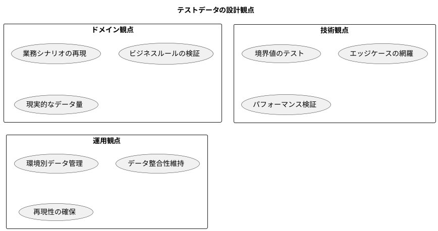
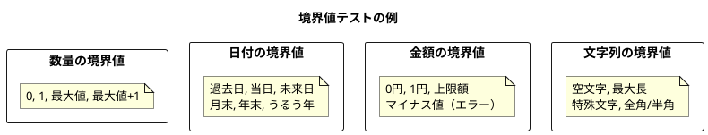
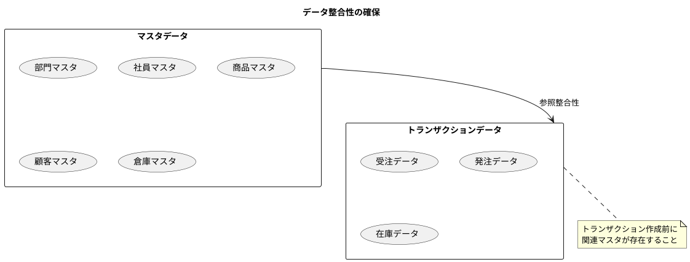
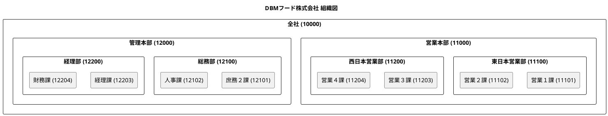
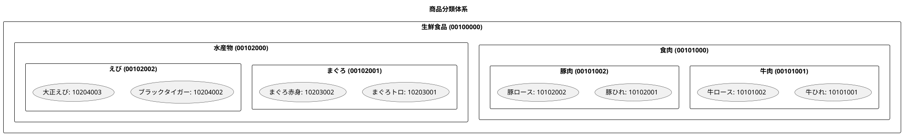
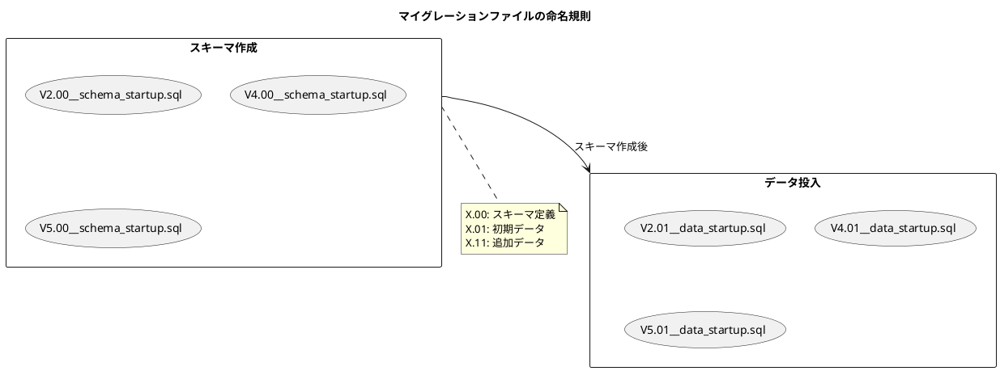
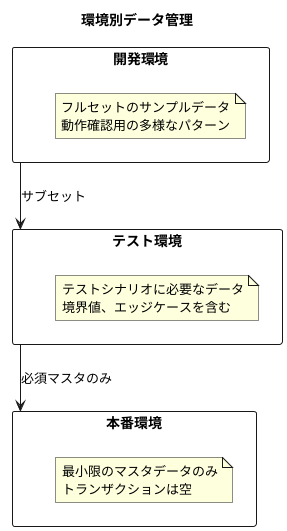
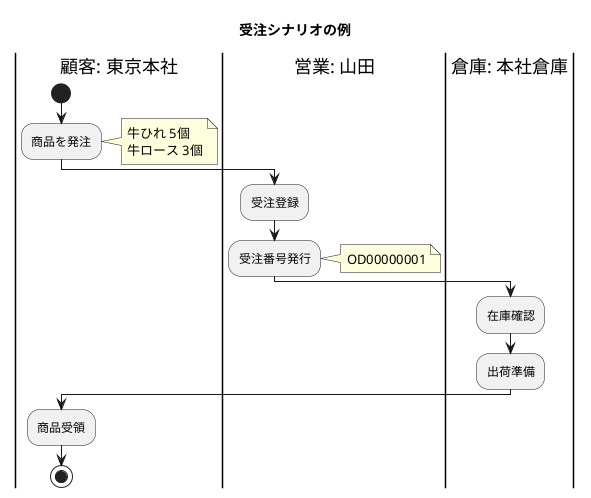
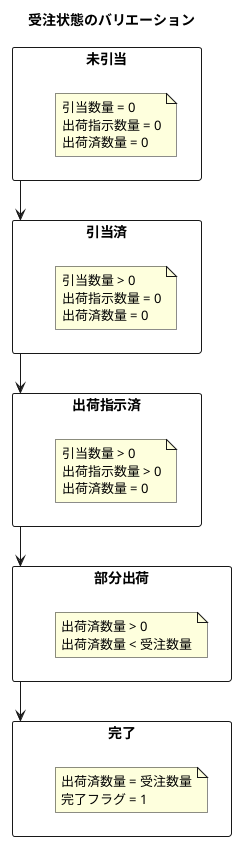

# 第8章: ドメインに適したデータの作成

## 8.1 テストデータの設計原則

### ドメインを反映したテストデータ

テストデータは、実際の業務を反映した現実的なデータであるべきです。単なるダミーデータではなく、ドメインの特性を反映したデータを設計します。



#### テストデータ設計の原則

| 原則 | 説明 | 例 |
|------|------|-----|
| 現実性 | 実際の業務で発生しうるデータ | 実在する商品名、現実的な価格帯 |
| 網羅性 | 様々なパターンをカバー | 通常ケース、境界値、異常系 |
| 整合性 | データ間の関連が正しい | 受注明細の商品が商品マスタに存在 |
| 独立性 | テスト間でデータが干渉しない | テストごとに独立したデータセット |

### 境界値とエッジケースの考慮

テストデータには、境界値やエッジケースを含めることが重要です。



### データ間の整合性確保

マスタとトランザクションの間で整合性を保つことが重要です。



---

## 8.2 事例企業概要

本書では、架空の食品卸売会社「DBM フード株式会社」をモデル企業として使用します。

### 業種・事業概要

| 項目 | 内容 |
|------|------|
| 会社名 | DBM フード株式会社 |
| 業種 | 食品卸売業 |
| 主要事業 | 生鮮食品（食肉・水産物）の仕入・販売 |
| 従業員数 | 約40名 |
| 年商 | 約10億円 |

### 組織構造



### 取引先情報

| 取引先コード | 取引先名 | 種別 | 概要 |
|-------------|----------|------|------|
| 001 | DBMフード株式会社 | 顧客 | 東京本社・関西支社の2拠点 |
| 002 | 株式会社B | 仕入先 | 主要仕入先（食肉） |
| 003 | 株式会社C | 仕入先 | 主要仕入先（水産物） |

### 商品ラインナップ



#### 商品区分

| 区分 | 説明 | 例 |
|------|------|-----|
| 1: 商品 | 仕入れて販売する商品 | 牛ひれ、豚ロース |
| 2: 製品 | 自社で加工した製品 | いちご蒸缶 |
| 3: 原材料 | 製品の原材料 | 生ウニ、大アワビ |
| 4: 間接材 | 梱包材など | 缶 |

### 初期在庫状況

倉庫とロケーションの構成：

| 倉庫コード | 倉庫名 | 倉庫区分 |
|-----------|--------|----------|
| W01 | 本社倉庫 | N（通常倉庫） |
| W02 | 関西倉庫 | N（通常倉庫） |

---

## 8.3 マスタデータの作成

### 初期データセットの設計

Flyway マイグレーションを使用して、スキーマ作成後に初期データを投入します。



### Flyway マイグレーションによるデータ投入

#### 部門・社員データの例

```sql
-- V2.01__data_startup.sql
-- 部門マスタ
INSERT INTO public."部門マスタ" (
    "部門コード", "開始日", "終了日", "部門名",
    "組織階層", "部門パス", "最下層区分", "伝票入力可否",
    "作成日時", "作成者名", "更新日時", "更新者名"
)
VALUES
    ('10000', '2021-01-01', '9999-12-31', '全社',
     0, '10000~', 0, 1,
     '2021-01-01', 'admin', '2021-01-01', 'admin'),
    ('11000', '2021-01-01', '9999-12-31', '営業本部',
     1, '10000~11000~', 0, 1,
     '2021-01-01', 'admin', '2021-01-01', 'admin'),
    ('11100', '2021-01-01', '9999-12-31', '東日本営業部',
     2, '10000~11000~11100~', 0, 1,
     '2021-01-01', 'admin', '2021-01-01', 'admin'),
    ('11101', '2021-01-01', '9999-12-31', '営業１課',
     3, '10000~11000~11100~11101~', 1, 1,
     '2021-01-01', 'admin', '2021-01-01', 'admin');

-- 社員マスタ
INSERT INTO public."社員マスタ" (
    "社員コード", "社員名", "社員名カナ", "パスワード",
    "電話番号", "FAX番号", "部門コード", "開始日",
    "職種コード", "承認権限コード",
    "作成日時", "作成者名", "更新日時", "更新者名"
)
VALUES
    ('EMP001', '山田 太郎', 'ヤマダ タロウ', 'password',
     '090-1234-5678', '03-1234-5678', '11101', '2021-01-01',
     '', '',
     '2023-04-20', 'admin', '2023-04-20', 'admin'),
    ('EMP002', '佐藤 花子', 'サトウ ハナコ', 'password',
     '090-2345-6789', '03-2345-6789', '11101', '2021-01-01',
     '', '',
     '2023-04-20', 'admin', '2023-04-20', 'admin');
```

#### 商品データの例

```sql
-- 商品分類マスタ
INSERT INTO public."商品分類マスタ" (
    "商品分類コード", "商品分類名", "商品分類階層",
    "商品分類パス", "最下層区分",
    "作成日時", "作成者名", "更新日時", "更新者名"
)
VALUES
    ('00100000', '生鮮食品', 2, '00100000', 0,
     '2022-04-20', 'admin', '2022-04-20', 'admin'),
    ('00101000', '食肉', 1, '00100000~00101000', 0,
     '2022-04-20', 'admin', '2022-04-20', 'admin'),
    ('00101001', '牛肉', 0, '00100000~00101000~00101001', 1,
     '2022-04-20', 'admin', '2022-04-20', 'admin');

-- 商品マスタ
INSERT INTO public."商品マスタ" (
    "商品コード", "商品正式名", "商品略称", "商品名カナ",
    "商品区分", "製品型番", "販売単価", "仕入単価", "売上原価",
    "税区分", "商品分類コード", "雑区分",
    "在庫管理対象区分", "在庫引当区分",
    "仕入先コード", "仕入先枝番",
    "作成日時", "作成者名", "更新日時", "更新者名"
)
VALUES
    ('10101001', '牛ひれ', '牛ひれ', '牛ひれ',
     '1', '1234567890', 1000, 900, 500,
     1, '00101001', 1,
     1, 1,
     '001', 0,
     '2022-04-20', 'admin', '2022-04-20', 'admin');
```

### 環境別データの管理

開発・テスト・本番で異なるデータセットを管理します。



#### ディレクトリ構成

```
src/main/resources/db/migration/
├── h2/                      # 開発・テスト用（H2 Database）
│   ├── V2.00__schema_startup.sql
│   ├── V2.01__data_startup.sql
│   └── ...
└── postgresql/              # 本番用（PostgreSQL）
    ├── V1.00__schema_startup.sql
    └── ...
```

---

## 8.4 トランザクションデータの生成

### 業務シナリオに基づくデータ作成

トランザクションデータは、実際の業務シナリオを想定して作成します。



#### 受注データの例

```sql
-- V5.01__data_startup.sql
-- 受注データ
INSERT INTO 受注データ (
    受注番号, 受注日, 部門コード, 部門開始日,
    顧客コード, 顧客枝番, 社員コード,
    希望納期, 客先注文番号, 倉庫コード,
    受注金額合計, 消費税合計, 備考,
    作成日時, 作成者名, 更新日時, 更新者名
)
VALUES
    ('OD00000001', CURRENT_DATE, '10000', '2021-01-01',
     '001', 1, 'EMP001',
     DATEADD(DAY, 7, CURRENT_DATE), 'CUST-ORD-001', 'W01',
     15000, 1500, '初回注文',
     CURRENT_DATE, 'システム', CURRENT_DATE, 'システム');

-- 受注データ明細
INSERT INTO 受注データ明細 (
    受注番号, 受注行番号, 商品コード, 商品名,
    販売単価, 受注数量, 消費税率,
    引当数量, 出荷指示数量, 出荷済数量,
    完了フラグ, 値引金額, 納期,
    作成日時, 作成者名, 更新日時, 更新者名
)
VALUES
    ('OD00000001', 1, '10101001', '牛ひれ',
     1000, 5, 10,
     0, 0, 0,
     0, 0, DATEADD(DAY, 7, CURRENT_DATE),
     CURRENT_DATE, 'システム', CURRENT_DATE, 'システム'),
    ('OD00000001', 2, '10101002', '牛ロース',
     1000, 3, 10,
     0, 0, 0,
     0, 0, DATEADD(DAY, 7, CURRENT_DATE),
     CURRENT_DATE, 'システム', CURRENT_DATE, 'システム');
```

### 状態遷移を考慮したデータセット

受注の様々な状態をテストするためのデータセットを用意します。



### 時系列データの整合性

日付データは相互に整合性を保つ必要があります。

| チェック項目 | ルール |
|-------------|--------|
| 受注日 ≤ 希望納期 | 受注日は希望納期以前 |
| 受注日 ≤ 納期 | 受注日は明細の納期以前 |
| 受注日 ≤ 出荷日 | 受注日は出荷日以前 |
| 部門開始日 ≤ 受注日 | 部門が有効な期間内 |

---

## 8.5 テストフィクスチャ

### JUnit でのテストデータ準備

テスト用のデータは、SQL ファイルとして外部化します。

```
src/test/resources/sql/
├── test-partner-data.sql
├── test-product-data.sql
└── test-warehouse-data.sql
```

#### テスト用 SQL ファイルの例

```sql
-- test-partner-data.sql
-- テスト用の取引先データ
INSERT INTO 取引先マスタ (
    取引先コード, 取引先名, 取引先名カナ,
    仕入先区分, 取引先グループコード,
    作成日時, 作成者名, 更新日時, 更新者名
)
VALUES
    ('TEST001', 'テスト顧客A', 'テストコキャクエー',
     0, '0001',
     CURRENT_TIMESTAMP, 'test', CURRENT_TIMESTAMP, 'test');
```

### テストクラスでのデータ投入

Spring の `@Sql` アノテーションを使用してテストデータを投入します。

```java
@SpringBootTest
@Sql(scripts = {
    "/sql/test-partner-data.sql",
    "/sql/test-product-data.sql"
}, executionPhase = Sql.ExecutionPhase.BEFORE_TEST_METHOD)
@Sql(scripts = "/sql/cleanup.sql",
     executionPhase = Sql.ExecutionPhase.AFTER_TEST_METHOD)
class OrderServiceTest {

    @Autowired
    private OrderService orderService;

    @Test
    void 正常な受注を登録できる() {
        // Given: テストデータがSQLで投入済み
        Order order = createTestOrder();

        // When
        Order saved = orderService.create(order);

        // Then
        assertThat(saved.getOrderNumber()).isNotNull();
    }
}
```

### TestContainers の活用

本番と同じデータベースでテストするために TestContainers を使用します。

```java
@Testcontainers
@SpringBootTest
class OrderRepositoryTest {

    @Container
    static PostgreSQLContainer<?> postgres = new PostgreSQLContainer<>("postgres:15")
            .withDatabaseName("testdb")
            .withUsername("test")
            .withPassword("test");

    @DynamicPropertySource
    static void configureProperties(DynamicPropertyRegistry registry) {
        registry.add("spring.datasource.url", postgres::getJdbcUrl);
        registry.add("spring.datasource.username", postgres::getUsername);
        registry.add("spring.datasource.password", postgres::getPassword);
    }

    @Autowired
    private OrderRepository orderRepository;

    @Test
    void 受注を永続化できる() {
        // テストコード
    }
}
```

---

## まとめ

本章では、ドメインに適したデータの作成方法について解説しました。

- **テストデータの設計原則**: ドメイン反映、境界値考慮、整合性確保
- **事例企業概要**: DBMフード株式会社の組織・商品・取引先構成
- **マスタデータの作成**: Flyway によるデータ投入、環境別管理
- **トランザクションデータの生成**: 業務シナリオ、状態遷移、時系列整合性
- **テストフィクスチャ**: JUnit でのデータ準備、TestContainers 活用

本章で第2部「データモデリング」は完了です。次部では、実際のドメインモデルの実装について解説します。
