# 第9章: 認証・ユーザー管理

## 9.1 要件定義

### 認証ユースケース

システムへのアクセスを制御するため、認証機能を実装します。

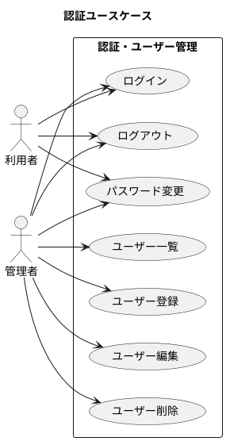

### ユーザーロールと権限

本システムでは、2種類のロールを定義しています。

| ロール | 説明 | 権限 |
|--------|------|------|
| ADMIN | 管理者 | 全機能にアクセス可能 |
| USER | 一般ユーザー | マスタ参照、トランザクション操作 |

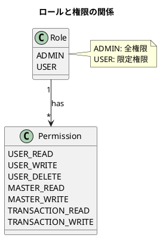

---

## 9.2 ドメインモデル設計

### ユーザーエンティティ

ユーザーは、認証と権限管理の中心となるエンティティです。

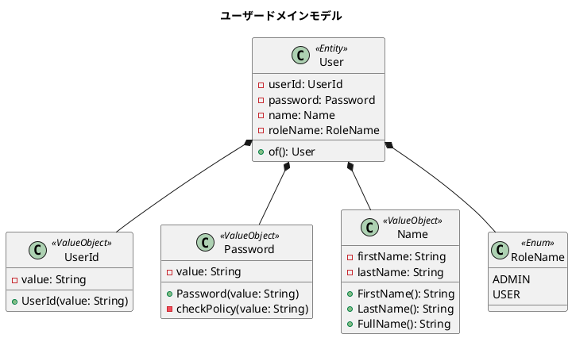

### ユーザーエンティティの実装

```java
@Value
@Getter
@AllArgsConstructor
@NoArgsConstructor(force = true)
public class User {
    UserId userId;
    Password password;
    Name name;
    RoleName roleName;

    public static User of(String userId, String password,
                          String firstName, String lastName,
                          RoleName roleName) {
        try {
            notNull(userId, "ユーザーIDが未入力です");
            notNull(firstName, "名前（姓）が未入力です");
            notNull(lastName, "名前（名）が未入力です");
            notNull(roleName, "ロール名が未入力です");

            return new User(
                new UserId(userId),
                new Password(password),
                new Name(firstName, lastName),
                roleName
            );
        } catch (IllegalArgumentException | NullPointerException e) {
            throw new UserException(e.getMessage());
        }
    }
}
```

### パスワードの値オブジェクト

パスワードは、セキュリティポリシーを満たす必要があります。

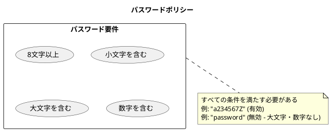

#### パスワードの実装

```java
@Value
@NoArgsConstructor(force = true)
public class Password {
    String value;

    public Password(String value) {
        if (value == null || value.isEmpty()) {
            this.value = "";
        } else {
            checkPolicy(value);
            this.value = value;
        }
    }

    private void checkPolicy(String value) {
        try {
            notBlank(value, "パスワードは必須です");
            isTrue(value.length() >= 8,
                   "パスワードは8文字以上である必要があります");

            boolean hasDigit = value.chars().anyMatch(Character::isDigit);
            boolean hasLower = value.chars().anyMatch(Character::isLowerCase);
            boolean hasUpper = value.chars().anyMatch(Character::isUpperCase);

            isTrue(hasDigit && hasLower && hasUpper,
                   "パスワードは小文字、大文字、数字を含む必要があります");
        } catch (RuntimeException e) {
            throw new PasswordException(e.getMessage());
        }
    }
}
```

### ユーザーIDの値オブジェクト

ユーザーIDには、形式ルールがあります。

```java
@Value
@NoArgsConstructor(force = true)
public class UserId {
    String value;

    public UserId(String userId) {
        notNull(userId, "ユーザーIDは必須です");
        matchesPattern(userId, "^U[0-9]{6}$",
            "ユーザーIDはUで始まる6桁の数字である必要があります");
        this.value = userId;
    }
}
```

| 項目 | ルール | 例 |
|------|--------|-----|
| 先頭文字 | "U" で始まる | U123456 |
| 桁数 | 7桁（U + 6桁の数字） | U000001 |
| 形式 | 正規表現: `^U[0-9]{6}$` | U999999 |

---

## 9.3 TDD による実装

### テストファーストアプローチ

ユーザードメインモデルの実装は、テストファーストで進めます。

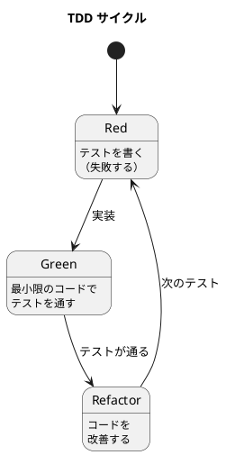

### ユーザー登録のテスト

```java
@DisplayName("ユーザー")
class UserTest {

    @Test
    @DisplayName("ユーザーを生成できる")
    void canCreateUser() {
        User user = User.of("U999999", "a234567Z",
                            "firstName", "lastName", RoleName.USER);

        assertEquals(new UserId("U999999"), user.getUserId());
        assertEquals(new Password("a234567Z"), user.getPassword());
        assertEquals("firstName", user.getName().FirstName());
        assertEquals("lastName", user.getName().LastName());
        assertEquals("firstName lastName", user.getName().FullName());
        assertEquals(RoleName.USER, user.getRoleName());
    }

    @Test
    @DisplayName("ユーザーIDが未入力の場合は生成できない")
    void cannotCreateUserWhenUserIdIsMissing() {
        assertThrows(UserException.class,
            () -> User.of(null, "password", "テスト", "太郎", RoleName.USER));
    }

    @Test
    @DisplayName("ユーザーIDは先頭の一文字目がUで始まる6桁の数字である")
    void userIdMustStartWithUAndBeSixDigitNumber() {
        assertThrows(UserIdException.class,
            () -> User.of("1", "password", "テスト", "太郎", RoleName.USER));
        assertThrows(UserIdException.class,
            () -> User.of("X123456", "password", "テスト", "太郎", RoleName.USER));
        assertThrows(UserIdException.class,
            () -> User.of("U12345", "password", "テスト", "太郎", RoleName.USER));
    }
}
```

### パスワード検証のテスト

```java
@Test
@DisplayName("パスワードが未入力の場合は空の値を設定する")
void passwordIsEmptyWhenMissing() {
    User user = User.of("U999999", null, "テスト", "太郎", RoleName.USER);
    assertTrue(user.getPassword().Value().isEmpty());
}

@Test
@DisplayName("パスワードは少なくとも8文字以上であること")
void passwordMustBeAtLeastEightCharacters() {
    assertThrows(PasswordException.class,
        () -> User.of("U999999", "pass", "テスト", "太郎", RoleName.USER));
}

@Test
@DisplayName("パスワードは小文字大文字数字を含むこと")
void passwordMustContainUppercaseLowercaseAndDigits() {
    // 数字のみ
    assertThrows(PasswordException.class,
        () -> User.of("U999999", "12345678", "テスト", "太郎", RoleName.USER));
    // 小文字と数字のみ
    assertThrows(PasswordException.class,
        () -> User.of("U999999", "a2345678", "テスト", "太郎", RoleName.USER));
    // 大文字と数字のみ
    assertThrows(PasswordException.class,
        () -> User.of("U999999", "A2345678", "テスト", "太郎", RoleName.USER));
}
```

### 認証処理のテスト

認証処理は、サービス層でテストします。

```java
@SpringBootTest
class AuthServiceTest {

    @Autowired
    private AuthService authService;

    @Test
    @DisplayName("正しい認証情報でログインできる")
    void canLoginWithValidCredentials() {
        // Given
        String userId = "U999999";
        String password = "a234567Z";

        // When
        AuthResult result = authService.authenticate(userId, password);

        // Then
        assertTrue(result.isSuccess());
        assertNotNull(result.getToken());
    }

    @Test
    @DisplayName("不正なパスワードではログインできない")
    void cannotLoginWithInvalidPassword() {
        // Given
        String userId = "U999999";
        String password = "wrongPassword1";

        // When
        AuthResult result = authService.authenticate(userId, password);

        // Then
        assertFalse(result.isSuccess());
    }
}
```

---

## 9.4 Spring Security 統合

### 認証フィルタの設定

Spring Security を使用して認証を実装します。

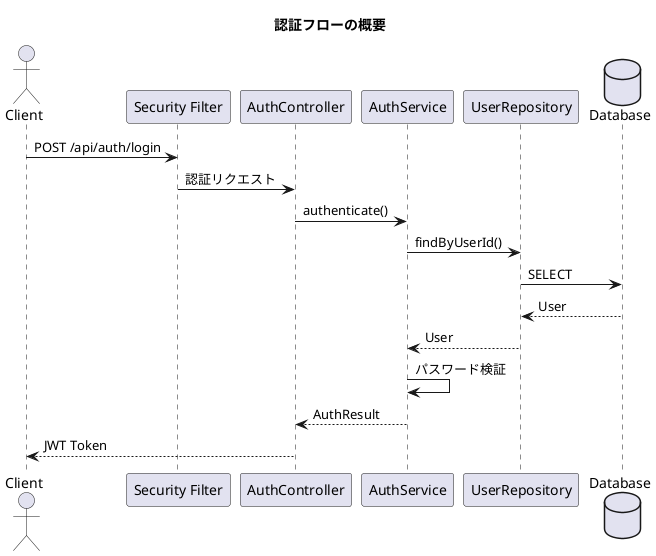

### SecurityConfig の実装

```java
@Configuration
@EnableWebSecurity
public class SecurityConfig {

    @Bean
    public SecurityFilterChain filterChain(HttpSecurity http) throws Exception {
        http
            .csrf(csrf -> csrf.disable())
            .sessionManagement(session ->
                session.sessionCreationPolicy(SessionCreationPolicy.STATELESS))
            .authorizeHttpRequests(auth -> auth
                .requestMatchers("/api/auth/**").permitAll()
                .requestMatchers("/api/admin/**").hasRole("ADMIN")
                .anyRequest().authenticated()
            )
            .addFilterBefore(jwtAuthFilter,
                UsernamePasswordAuthenticationFilter.class);

        return http.build();
    }

    @Bean
    public PasswordEncoder passwordEncoder() {
        return new BCryptPasswordEncoder();
    }
}
```

### JWT トークン管理

認証成功時に JWT トークンを発行します。

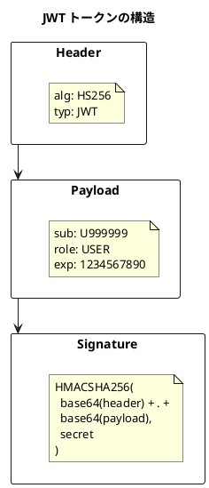

#### JwtTokenProvider の実装

```java
@Component
public class JwtTokenProvider {

    @Value("${jwt.secret}")
    private String secretKey;

    @Value("${jwt.expiration}")
    private long validityInMilliseconds;

    public String createToken(String userId, RoleName role) {
        Claims claims = Jwts.claims().setSubject(userId);
        claims.put("role", role.name());

        Date now = new Date();
        Date validity = new Date(now.getTime() + validityInMilliseconds);

        return Jwts.builder()
                .setClaims(claims)
                .setIssuedAt(now)
                .setExpiration(validity)
                .signWith(SignatureAlgorithm.HS256, secretKey)
                .compact();
    }

    public boolean validateToken(String token) {
        try {
            Jwts.parser().setSigningKey(secretKey).parseClaimsJws(token);
            return true;
        } catch (JwtException | IllegalArgumentException e) {
            return false;
        }
    }

    public String getUserId(String token) {
        return Jwts.parser()
                .setSigningKey(secretKey)
                .parseClaimsJws(token)
                .getBody()
                .getSubject();
    }
}
```

### セッション管理

本システムでは、ステートレスな JWT 認証を採用しています。

| 項目 | 設定 |
|------|------|
| セッション管理 | STATELESS |
| トークン有効期限 | 24時間 |
| リフレッシュトークン | 未実装（将来対応） |
| トークン保存場所 | クライアント側（LocalStorage） |

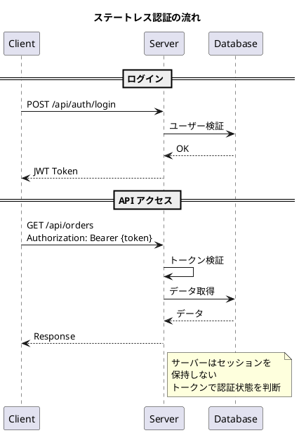

---

## 9.5 React コンポーネントの実装

### ログイン画面

フロントエンドでは、React を使用してログイン画面を実装します。

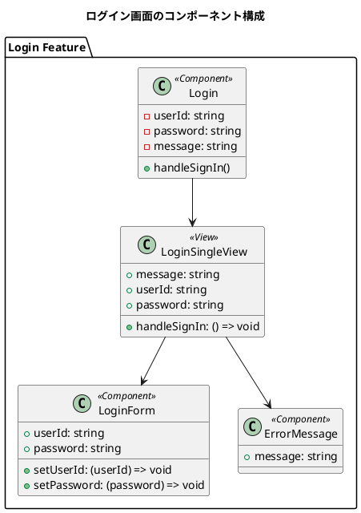

#### ログインビューの実装

```typescript
interface LoginFormProps {
    userId: string;
    setUserId: (userId: string) => void;
    password: string;
    setPassword: (password: string) => void;
}

const LoginForm = ({userId, setUserId, password, setPassword}: LoginFormProps) => (
    <div className="single-view-content-item-form">
        <div className="single-view-content-item-form-item">
            <label className="single-view-content-item-form-item-label">ユーザー名</label>
            <input
                className="single-view-content-item-form-item-input"
                type="text"
                value={userId}
                onChange={(e) => setUserId(e.target.value)}
                id="userId"
            />
        </div>
        <div className="single-view-content-item-form-item">
            <label className="single-view-content-item-form-item-label">パスワード</label>
            <input
                className="single-view-content-item-form-item-input"
                type="password"
                value={password}
                onChange={(e) => setPassword(e.target.value)}
                id="password"
            />
        </div>
    </div>
);
```

### 認証状態の管理

React Context を使用して、認証状態をアプリケーション全体で管理します。

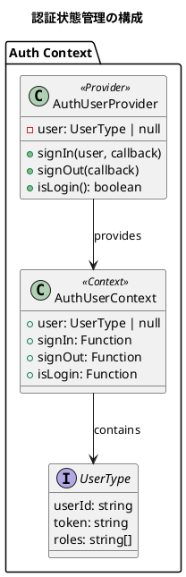

#### AuthUserProvider の実装

```typescript
export type AuthUserContextType = {
    user: UserType | null;
    signIn: (user: UserType, callback: () => void) => void;
    signOut: (callback: () => void) => void;
    isLogin: () => boolean;
}

export const AuthUserProvider: React.FC<Props> = (props: Props) => {
    const [user, setUser] = React.useState<UserType | null>(null);

    const signIn = (user: UserType, callback: () => void) => {
        setUser(user);
        window.localStorage.setItem("user", JSON.stringify(user));
        callback();
    }

    const signOut = (callback: () => void) => {
        setUser(null);
        window.localStorage.removeItem("user");
        callback();
    }

    const isLogin = () => {
        const user = window.localStorage.getItem("user");
        if (user) {
            setUser(JSON.parse(user));
            return true;
        }
        return false;
    }

    const value: AuthUserContextType = {user, signIn, signOut, isLogin};
    return (
        <AuthUserContext.Provider value={value}>
            {props.children}
        </AuthUserContext.Provider>
    );
}
```

### 保護されたルーティング

認証が必要なページへのアクセスを制御します。

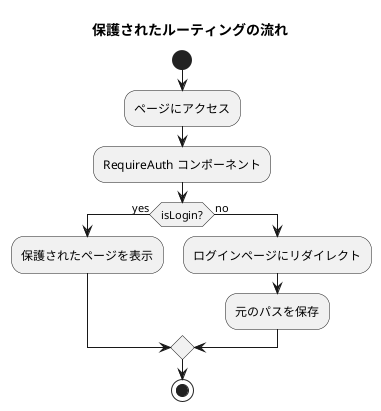

#### ログインコンポーネントの実装

```typescript
export const Login: React.FC = () => {
    const [userId, setUserId] = useState("");
    const [password, setPassword] = useState("");
    const [message, setMessage] = useState("");
    const navigate = useNavigate();
    const location: CustomLocation = useLocation() as CustomLocation;
    const fromPathName: string = location.state?.from?.pathname || "/";
    const authUser: AuthUserContextType = useAuthUserContext();

    useEffect(() => {
        if (authUser.isLogin()) {
            navigate("/", {replace: true});
        }
    }, [authUser, navigate]);

    const handleSignIn = async () => {
        const authService = AuthService();
        try {
            const result = await authService.signIn(userId, password);
            if (result.message) {
                setMessage(result.message);
                return;
            }
            const user: UserType = {
                userId: result.userId,
                token: result.accessToken,
                roles: result.roles,
            };
            authUser.signIn(user, () => {
                navigate(fromPathName, {replace: true});
            });
        } catch (e: any) {
            setMessage(e.message);
        }
    };

    return (
        <LoginSingleView
            message={message}
            handleSignIn={handleSignIn}
            userId={userId}
            setUserId={setUserId}
            password={password}
            setPassword={setPassword}
        />
    );
}
```

### ログアウト処理

```typescript
export const Logout: React.FC = () => {
    const authUser: AuthUserContextType = useAuthUserContext();
    const navigate = useNavigate();

    const handleSignOut = () => {
        authUser.signOut(() => {
            navigate("/login");
        });
    };

    React.useEffect(() => {
        handleSignOut();
    }, []);

    return null;
};
```

---

## ドメインモデルの例外設計

ドメイン層では、専用の例外クラスを定義します。

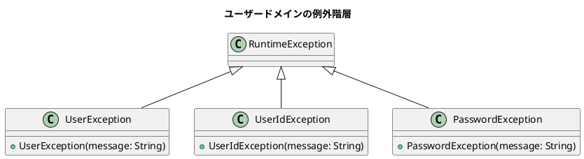

### 例外の使い分け

| 例外クラス | 用途 | 例 |
|-----------|------|-----|
| UserException | ユーザー全般のエラー | 必須項目未入力 |
| UserIdException | ユーザーID形式エラー | 形式不正 |
| PasswordException | パスワードポリシー違反 | 文字数不足 |

---

## まとめ

本章では、認証・ユーザー管理機能について解説しました。

- **要件定義**: 認証ユースケース、ロールと権限の設計
- **ドメインモデル設計**: User エンティティ、Password/UserId 値オブジェクト
- **TDD による実装**: テストファーストでのバリデーション実装
- **Spring Security 統合**: JWT 認証、ステートレスセッション管理

次章では、部門・社員マスタの実装について解説します。
