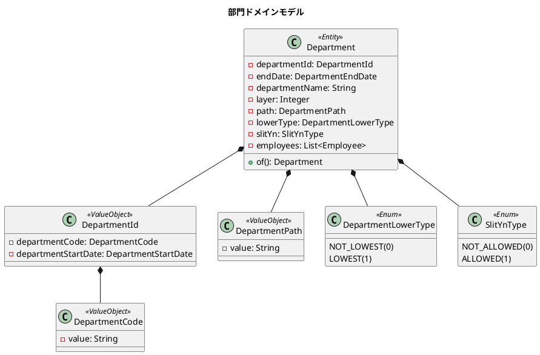
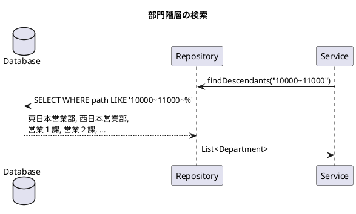
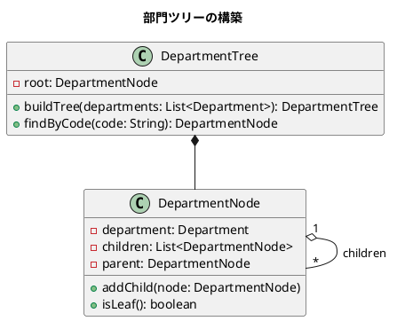
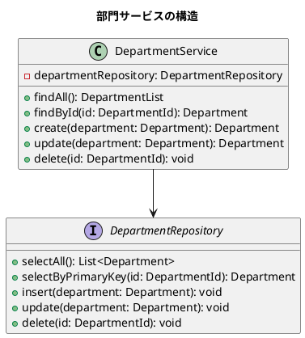
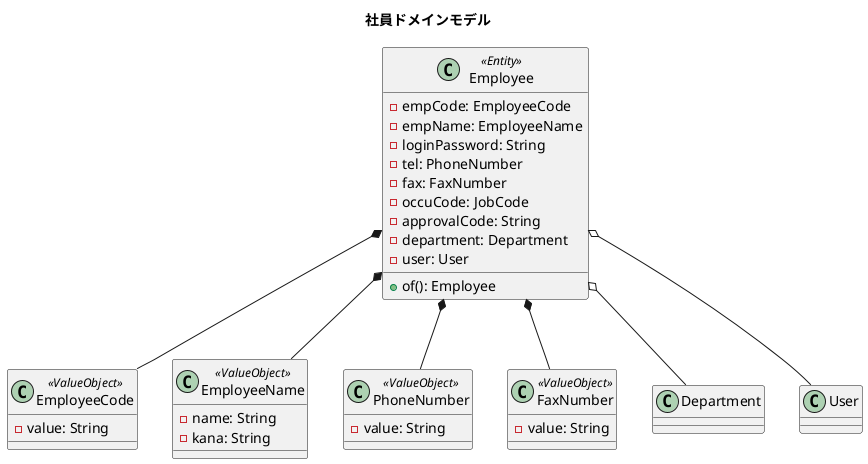
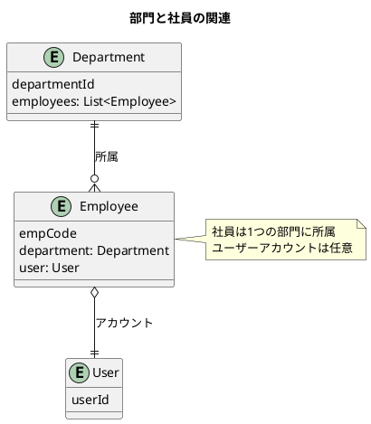
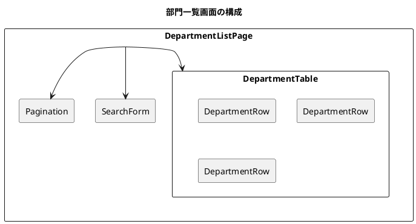

# 第10章: 部門・社員マスタ

## 10.1 階層構造を持つデータの実装

### 部門ドメインモデル

部門は階層構造を持つエンティティです。経路列挙モデルを使用して階層を表現します。



### 部門エンティティの実装

```java
@Value
@NoArgsConstructor(force = true)
public class Department {
    public static final String TERMINAL_CODE = "99999";

    DepartmentId departmentId;      // 部門ID
    DepartmentEndDate endDate;       // 終了日
    String departmentName;           // 部門名
    Integer layer;                   // 組織階層
    DepartmentPath path;             // 部門パス
    DepartmentLowerType lowerType;   // 最下層区分
    SlitYnType slitYn;              // 伝票入力可否
    List<Employee> employees;        // 社員

    public Department(DepartmentId departmentId,
                      DepartmentEndDate departmentEndDate,
                      String departmentName,
                      int layer,
                      DepartmentPath departmentPath,
                      DepartmentLowerType lowerType,
                      SlitYnType slitYnType,
                      List<Employee> employees) {
        // バリデーション
        notNull(departmentId, "部門コードは必須です");
        notNull(departmentEndDate.getValue(), "終了日は必須です");
        isTrue(departmentId.getDepartmentStartDate().getValue()
                   .isBefore(departmentEndDate.getValue()),
               "終了日は開始日より後である必要があります");
        notNull(departmentPath.getValue(), "部門パスは必須です");

        this.departmentId = departmentId;
        this.endDate = departmentEndDate;
        this.departmentName = departmentName;
        this.layer = layer;
        this.path = departmentPath;
        this.lowerType = lowerType;
        this.slitYn = slitYnType;
        this.employees = employees;
    }

    public static Department of(DepartmentId departmentId,
                                LocalDateTime endDate,
                                String departmentName,
                                int layer,
                                String path,
                                int layerType,
                                int slitYn) {
        notNull(departmentId, "部門コードは必須です");

        return new Department(
            departmentId,
            DepartmentEndDate.of(endDate),
            departmentName,
            layer,
            DepartmentPath.of(path),
            DepartmentLowerType.of(layerType),
            SlitYnType.of(slitYn),
            List.of()
        );
    }
}
```

### 部門パスの値オブジェクト

部門パスは、階層構造を文字列で表現します。

```java
@Value
@NoArgsConstructor(force = true)
public class DepartmentPath {
    String value;

    public DepartmentPath(String path) {
        notNull(path, "部門パスは必須です");
        matchesPattern(path, "([0-9]{5}~)+",
            "部門パスは5桁の数字と~で構成され、少なくとも1つの~が必要です");
        this.value = path;
    }

    public static DepartmentPath of(String path) {
        return new DepartmentPath(path);
    }
}
```

#### パス形式の例

| 部門 | パス | 説明 |
|------|------|------|
| 全社 | `10000~` | ルート部門 |
| 営業本部 | `10000~11000~` | 第1階層 |
| 東日本営業部 | `10000~11000~11100~` | 第2階層 |
| 営業１課 | `10000~11000~11100~11101~` | 第3階層（最下層） |

### 再帰的なデータ取得

部門の子孫を取得するには、パスの前方一致検索を使用します。



```java
// リポジトリでの実装例
public interface DepartmentRepository {
    // 子孫部門を取得
    List<Department> findDescendants(DepartmentPath path);

    // 直接の子部門を取得
    List<Department> findChildren(DepartmentCode parentCode);
}
```

### ツリー構造の構築

取得した部門リストからツリー構造を構築します。



---

## 10.2 CRUD 操作の実装

### サービス層の設計

部門マスタの CRUD 操作をサービス層で実装します。



### バリデーション処理

部門のバリデーションは、ドメインモデルのコンストラクタで行います。

```java
@DisplayName("部門")
class DepartmentTest {

    @Test
    @DisplayName("部門を作成できる")
    void shouldCreateDepartment() {
        DepartmentId departmentId = DepartmentId.of("10000", LocalDateTime.now());
        LocalDateTime endDate = LocalDateTime.now().plusDays(1);

        Department department = Department.of(
            departmentId, endDate, "Test Department",
            5, "10000~", 1, 0
        );

        assertNotNull(department);
        assertEquals(departmentId, department.getDepartmentId());
    }

    @Test
    @DisplayName("部門IDは必須")
    void shouldThrowExceptionWhenDepartmentIdIsNull() {
        assertThrows(RuntimeException.class, () ->
            Department.of(null, LocalDateTime.now(),
                         "Test Department", 5, "10000~", 1, 0));
    }

    @Test
    @DisplayName("終了日は開始日より後である必要がある")
    void shouldThrowExceptionWhenEndDateIsBeforeStartDate() {
        DepartmentId departmentId = DepartmentId.of("10000", LocalDateTime.now());
        LocalDateTime endDate = LocalDateTime.now().minusDays(1);

        assertThrows(RuntimeException.class, () ->
            Department.of(departmentId, endDate,
                         "Test Department", 5, "10000~", 1, 0));
    }
}
```

### 部門コードの検証

```java
@Nested
@DisplayName("部門ID")
class DepartmentIdTest {
    @Test
    @DisplayName("部門IDは部門コードと開始日が必須")
    void shouldThrowExceptionWhenDepartmentIdDoesNotHaveStartDate() {
        assertThrows(RuntimeException.class, () ->
            DepartmentId.of("10000", null));
        assertThrows(RuntimeException.class, () ->
            DepartmentId.of(null, LocalDateTime.now()));
    }

    @Test
    @DisplayName("部門コードは5桁の数字である必要がある")
    void shouldThrowExceptionWhenDepartmentCodeIsNotFiveDigits() {
        assertThrows(RuntimeException.class, () ->
            DepartmentId.of("1000", LocalDateTime.now()));   // 4桁
        assertThrows(RuntimeException.class, () ->
            DepartmentId.of("100000", LocalDateTime.now())); // 6桁
        assertThrows(RuntimeException.class, () ->
            DepartmentId.of("1000a", LocalDateTime.now()));  // 英字含む
    }
}
```

### 部門パスの検証

```java
@Nested
@DisplayName("部門パス")
class DepartmentPathTest {
    @Test
    @DisplayName("部門パスは5桁の数字と~で構成されている必要がある")
    void shouldThrowExceptionWhenPathIsInvalid() {
        DepartmentId departmentId = DepartmentId.of("10000", LocalDateTime.now());
        LocalDateTime endDate = LocalDateTime.now().plusDays(1);

        // 有効なパス
        assertDoesNotThrow(() ->
            Department.of(departmentId, endDate, "Test", 5, "10000~", 1, 0));
        assertDoesNotThrow(() ->
            Department.of(departmentId, endDate, "Test", 5, "10000~10000~", 1, 0));

        // 無効なパス
        assertThrows(RuntimeException.class, () ->
            Department.of(departmentId, endDate, "Test", 5, "10000", 1, 0));  // ~なし
        assertThrows(RuntimeException.class, () ->
            Department.of(departmentId, endDate, "Test", 5, "1000~", 1, 0));  // 4桁
    }
}
```

---

## 10.3 社員ドメインモデル

### 社員エンティティ

社員は部門に所属し、ユーザーアカウントと紐付きます。



### 社員エンティティの実装

```java
@Value
@Getter
@AllArgsConstructor
@NoArgsConstructor(force = true)
public class Employee {
    EmployeeCode empCode;       // 社員コード
    EmployeeName empName;       // 社員名
    String loginPassword;       // パスワード
    PhoneNumber tel;           // 電話番号
    FaxNumber fax;             // FAX番号
    JobCode occuCode;          // 職種コード
    String approvalCode;       // 承認権限コード
    Department department;     // 部門
    User user;                 // ユーザー

    public static Employee of(String empCode,
                              String name,
                              String kana,
                              String tel,
                              String fax,
                              String occuCode) {
        EmployeeCode employeeCode = EmployeeCode.of(empCode);
        EmployeeName employeeName = EmployeeName.of(name, kana);

        PhoneNumber phoneNumber = tel != null ? PhoneNumber.of(tel) : null;
        FaxNumber faxNumber = fax != null ? FaxNumber.of(fax) : null;
        JobCode jobCode = occuCode != null ? JobCode.of(occuCode) : null;

        return new Employee(
            employeeCode, employeeName, null,
            phoneNumber, faxNumber, jobCode,
            "", null, null
        );
    }

    public static Employee of(Employee employee,
                              Department department,
                              User user) {
        return new Employee(
            employee.getEmpCode(),
            employee.getEmpName(),
            employee.getLoginPassword(),
            employee.getTel(),
            employee.getFax(),
            employee.getOccuCode(),
            employee.getApprovalCode(),
            Objects.requireNonNullElseGet(department, Department::from),
            user
        );
    }
}
```

### 部門と社員の関連



---

## 10.4 React コンポーネントの実装

### 一覧画面（コレクション）

部門一覧を表示する React コンポーネントです。



```tsx
// DepartmentListPage.tsx
export const DepartmentListPage: React.FC = () => {
  const [departments, setDepartments] = useState<Department[]>([]);
  const [loading, setLoading] = useState(true);

  useEffect(() => {
    fetchDepartments();
  }, []);

  const fetchDepartments = async () => {
    try {
      const response = await departmentApi.getAll();
      setDepartments(response.data);
    } finally {
      setLoading(false);
    }
  };

  return (
    <div className="department-list">
      <h1>部門一覧</h1>
      <SearchForm onSearch={handleSearch} />
      {loading ? (
        <LoadingSpinner />
      ) : (
        <DepartmentTable
          departments={departments}
          onEdit={handleEdit}
          onDelete={handleDelete}
        />
      )}
      <Pagination
        total={departments.length}
        pageSize={20}
        onChange={handlePageChange}
      />
    </div>
  );
};
```

### 詳細画面（シングル）

部門の詳細・編集画面です。

```tsx
// DepartmentDetailPage.tsx
export const DepartmentDetailPage: React.FC = () => {
  const { departmentCode, startDate } = useParams();
  const [department, setDepartment] = useState<Department | null>(null);
  const [isEditing, setIsEditing] = useState(false);

  useEffect(() => {
    if (departmentCode && startDate) {
      fetchDepartment(departmentCode, startDate);
    }
  }, [departmentCode, startDate]);

  const fetchDepartment = async (code: string, date: string) => {
    const response = await departmentApi.getById(code, date);
    setDepartment(response.data);
  };

  const handleSave = async (data: DepartmentFormData) => {
    await departmentApi.update(data);
    setIsEditing(false);
    fetchDepartment(departmentCode!, startDate!);
  };

  return (
    <div className="department-detail">
      <h1>部門詳細</h1>
      {department && (
        isEditing ? (
          <DepartmentForm
            department={department}
            onSave={handleSave}
            onCancel={() => setIsEditing(false)}
          />
        ) : (
          <DepartmentView
            department={department}
            onEdit={() => setIsEditing(true)}
          />
        )
      )}
    </div>
  );
};
```

### フォーム処理

React Hook Form を使用したフォーム処理です。

```tsx
// DepartmentForm.tsx
interface DepartmentFormProps {
  department?: Department;
  onSave: (data: DepartmentFormData) => void;
  onCancel: () => void;
}

export const DepartmentForm: React.FC<DepartmentFormProps> = ({
  department,
  onSave,
  onCancel,
}) => {
  const {
    register,
    handleSubmit,
    formState: { errors },
  } = useForm<DepartmentFormData>({
    defaultValues: department,
  });

  return (
    <form onSubmit={handleSubmit(onSave)}>
      <div className="form-group">
        <label>部門コード</label>
        <input
          {...register('departmentCode', {
            required: '部門コードは必須です',
            pattern: {
              value: /^[0-9]{5}$/,
              message: '5桁の数字で入力してください',
            },
          })}
          disabled={!!department}
        />
        {errors.departmentCode && (
          <span className="error">{errors.departmentCode.message}</span>
        )}
      </div>

      <div className="form-group">
        <label>部門名</label>
        <input
          {...register('departmentName', {
            required: '部門名は必須です',
            maxLength: {
              value: 40,
              message: '40文字以内で入力してください',
            },
          })}
        />
        {errors.departmentName && (
          <span className="error">{errors.departmentName.message}</span>
        )}
      </div>

      <div className="form-group">
        <label>組織階層</label>
        <select {...register('layer')}>
          <option value={0}>最上位</option>
          <option value={1}>第1階層</option>
          <option value={2}>第2階層</option>
          <option value={3}>第3階層</option>
        </select>
      </div>

      <div className="form-actions">
        <button type="submit">保存</button>
        <button type="button" onClick={onCancel}>キャンセル</button>
      </div>
    </form>
  );
};
```

### 階層ツリー表示

部門の階層構造をツリー形式で表示します。

```tsx
// DepartmentTree.tsx
interface DepartmentTreeProps {
  departments: Department[];
  onSelect: (department: Department) => void;
}

export const DepartmentTree: React.FC<DepartmentTreeProps> = ({
  departments,
  onSelect,
}) => {
  const buildTree = (depts: Department[]): TreeNode[] => {
    const map = new Map<string, TreeNode>();

    // 各部門をノードに変換
    depts.forEach(dept => {
      map.set(dept.departmentId.departmentCode, {
        department: dept,
        children: [],
      });
    });

    // 親子関係を構築
    const roots: TreeNode[] = [];
    depts.forEach(dept => {
      const node = map.get(dept.departmentId.departmentCode)!;
      const parentCode = getParentCode(dept.path);

      if (parentCode && map.has(parentCode)) {
        map.get(parentCode)!.children.push(node);
      } else {
        roots.push(node);
      }
    });

    return roots;
  };

  const tree = buildTree(departments);

  return (
    <ul className="department-tree">
      {tree.map(node => (
        <TreeNode key={node.department.departmentId.departmentCode}
                  node={node}
                  onSelect={onSelect} />
      ))}
    </ul>
  );
};
```

---

## まとめ

本章では、部門・社員マスタの実装について解説しました。

- **階層構造の実装**: 経路列挙モデルによる部門階層、パスの検証
- **CRUD 操作**: サービス層の設計、ドメインモデルでのバリデーション
- **社員ドメインモデル**: 部門との関連、ユーザーとの紐付け
- **React コンポーネント**: 一覧画面、詳細画面、フォーム処理、ツリー表示

次章では、商品マスタの実装について解説します。
