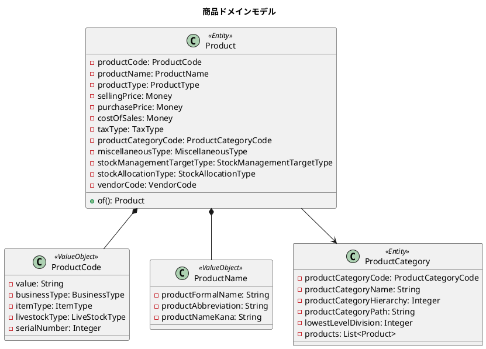
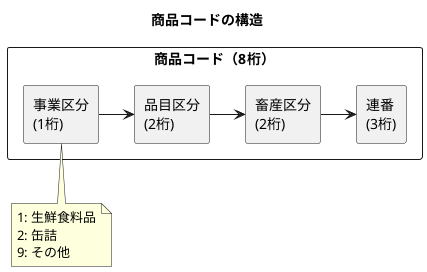
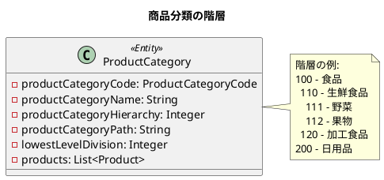
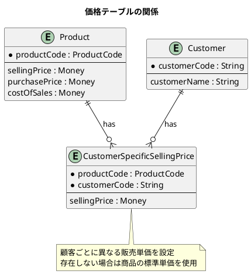
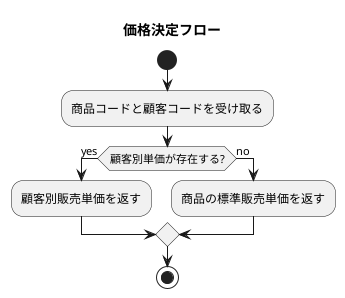
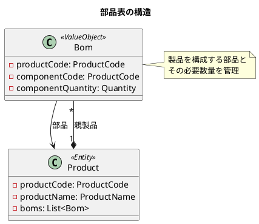
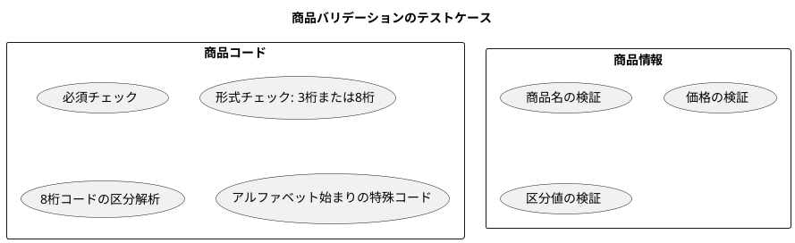

# 第11章: 商品マスタ

## 11.1 商品分類と商品

### 商品ドメインモデル概要

商品マスタは、販売管理システムの中核をなすマスタデータです。商品は分類によって階層的に管理され、価格情報や在庫管理に関する属性を持ちます。



### 商品コードの体系

商品コードは、ビジネスルールに基づいた構造化されたコードです。8桁の数字で構成され、各桁に意味を持たせています。



| 位置 | 桁数 | 名称 | 説明 |
|------|------|------|------|
| 1 | 1桁 | 事業区分 | 商品の事業分類 |
| 2-3 | 2桁 | 品目区分 | 商品の品目分類 |
| 4-5 | 2桁 | 畜産区分 | 畜産品の分類 |
| 6-8 | 3桁 | 連番 | 一意の識別番号 |

### 商品コードの実装

商品コードは、値オブジェクトとして実装します。コードから各区分を抽出するロジックを含みます。

```java
@Value
@NoArgsConstructor(force = true)
public class ProductCode {
    String value;
    BusinessType businessType; // 事業区分
    ItemType itemType; // 品目区分
    LiveStockType livestockType; // 畜産区分
    Integer serialNumber; // 連番

    public ProductCode(String productCode) {
        notNull(productCode, "商品コードは必須です");

        // アルファベットで始まる特殊コード
        if (productCode.matches("^[A-Z].*")) {
            this.value = productCode;
            this.businessType = BusinessType.その他;
            this.itemType = ItemType.その他;
            this.livestockType = LiveStockType.その他;
            this.serialNumber = 0;
            return;
        }

        // 3桁または8桁の数字
        matchesPattern(
                productCode,
                "^[0-9]{3}$|^[0-9]{8}$",
                "商品コードは3桁または8桁の数字である必要があります: %s",
                productCode
        );

        if (productCode.length() == 3) {
            this.value = productCode;
            this.businessType = BusinessType.その他;
            this.itemType = ItemType.その他;
            this.livestockType = LiveStockType.その他;
            this.serialNumber = 0;
            return;
        }

        // 8桁コードの解析
        this.businessType = BusinessType.fromCode(productCode.substring(0, 1));
        this.itemType = ItemType.fromCode(productCode.substring(1, 3));
        this.livestockType = LiveStockType.fromCode(productCode.substring(3, 5));
        this.serialNumber = Integer.parseInt(productCode.substring(5, 8));
        this.value = productCode;
    }
}
```

### 区分値の Enum 定義

商品に関連する区分値は、Enum として型安全に管理します。

```java
/**
 * 商品区分
 */
@Getter
public enum ProductType {
    商品("1"), 製品("2"), 部品("3"), 包材("4"), その他("9");

    private final String code;

    ProductType(String code) {
        this.code = code;
    }

    public static ProductType fromCode(String code) {
        for (ProductType productType : ProductType.values()) {
            if (productType.code.equals(code)) {
                return productType;
            }
        }
        throw new IllegalArgumentException("商品区分未登録:" + code);
    }
}
```

```java
/**
 * 税区分
 */
@Getter
public enum TaxType {
    外税(1), 内税(2), 非課税(3), その他(9);

    private final Integer code;

    TaxType(Integer code) {
        this.code = code;
    }

    public static TaxType fromCode(Integer code) {
        for (TaxType taxType : TaxType.values()) {
            if (taxType.code.equals(code)) {
                return taxType;
            }
        }
        throw new IllegalArgumentException("税区分未登録:" + code);
    }
}
```

### 商品分類の階層構造

商品分類は、部門と同様に階層構造を持ちます。パス列挙モデルを使用して、階層を表現します。



```java
@Value
@AllArgsConstructor
@NoArgsConstructor(force = true)
public class ProductCategory {
    ProductCategoryCode productCategoryCode; // 商品分類コード
    String productCategoryName; // 商品分類名
    Integer productCategoryHierarchy; // 商品分類階層
    String productCategoryPath; // 商品分類パス
    Integer lowestLevelDivision; // 最下層区分
    List<Product> products; // 商品

    public static ProductCategory of(
            String productCategoryCode,
            String productCategoryName,
            int productCategoryHierarchy,
            String productCategoryPath,
            int lowestLevelDivision) {
        return new ProductCategory(
            ProductCategoryCode.of(productCategoryCode),
            productCategoryName,
            productCategoryHierarchy,
            productCategoryPath,
            lowestLevelDivision,
            List.of()
        );
    }
}
```

---

## 11.2 顧客別販売単価

### 価格テーブルの設計

商品には標準の販売単価がありますが、顧客ごとに異なる価格を設定する必要があります。この要件を満たすために、顧客別販売単価テーブルを設計します。



### 顧客別販売単価の実装

```java
/**
 * 顧客別販売単価
 */
@Value
@AllArgsConstructor
@NoArgsConstructor(force = true)
public class CustomerSpecificSellingPrice {
    ProductCode productCode; // 商品コード
    String customerCode; // 顧客コード
    Money sellingPrice; // 販売単価

    public static CustomerSpecificSellingPrice of(
            String productCode,
            String customerCode,
            int sellingPrice) {
        return new CustomerSpecificSellingPrice(
            ProductCode.of(productCode),
            customerCode,
            Money.of(sellingPrice)
        );
    }
}
```

### 複数価格の管理ロジック

価格決定のロジックは、以下の優先順位で適用されます。



```java
@Service
public class PriceService {

    public Money getSellingPrice(Product product, String customerCode) {
        // 顧客別販売単価を検索
        Optional<CustomerSpecificSellingPrice> customerPrice =
            product.getCustomerSpecificSellingPrices().stream()
                .filter(p -> p.getCustomerCode().equals(customerCode))
                .findFirst();

        // 顧客別単価があればそれを、なければ標準単価を返す
        return customerPrice
            .map(CustomerSpecificSellingPrice::getSellingPrice)
            .orElse(product.getSellingPrice());
    }
}
```

### 部品表（BOM）の管理

製品を構成する部品の情報は、部品表（Bill of Materials）として管理します。



```java
/**
 * 部品表
 */
@Value
@AllArgsConstructor
@NoArgsConstructor(force = true)
public class Bom {
    ProductCode productCode; // 商品コード（親製品）
    ProductCode componentCode; // 部品コード
    Quantity componentQuantity; // 部品数量

    public static Bom of(
            String productCode,
            String componentCode,
            Integer componentQuantity) {
        return new Bom(
            ProductCode.of(productCode),
            ProductCode.of(componentCode),
            Quantity.of(componentQuantity)
        );
    }
}
```

### 代替商品の管理

在庫切れ時などに提案する代替商品を管理します。

```java
/**
 * 代替商品
 */
@Value
@AllArgsConstructor
@NoArgsConstructor(force = true)
public class SubstituteProduct {
    ProductCode productCode; // 商品コード
    ProductCode substituteProductCode; // 代替商品コード
    Integer priority; // 優先順位

    public static SubstituteProduct of(
            String productCode,
            String substituteProductCode,
            Integer priority) {
        return new SubstituteProduct(
            ProductCode.of(productCode),
            ProductCode.of(substituteProductCode),
            priority
        );
    }
}
```

---

## 11.3 バリデーション実装

### TDD によるバリデーションテスト

商品ドメインモデルのバリデーションは、TDD アプローチで実装します。



### 商品コードのテスト

```java
@DisplayName("商品")
class ProductTest {

    @Test
    @DisplayName("商品を作成できる")
    void shouldCreateProduct() {
        Product product = Product.of(
            "99999001",
            "Test Product",
            "TP",
            "テストプロダクト",
            ProductType.商品,
            100, 50, 60,
            TaxType.外税,
            "100",
            MiscellaneousType.適用,
            StockManagementTargetType.対象,
            StockAllocationType.引当済,
            "100", 1
        );

        assertNotNull(product);
        assertEquals("99999001", product.getProductCode().getValue());
        assertEquals("Test Product",
            product.getProductName().getProductFormalName());
        assertEquals(ProductType.商品, product.getProductType());
        assertEquals(Money.of(100), product.getSellingPrice());
    }

    @Nested
    @DisplayName("商品コード")
    class ProductCodeTest {

        @Test
        @DisplayName("商品コードは必須")
        void shouldThrowExceptionWhenProductCodeIsNull() {
            assertThrows(NullPointerException.class, () ->
                Product.of(null, "Test Product", "TP", "テストプロダクト",
                    ProductType.商品, 100, 50, 60, TaxType.外税, "100",
                    MiscellaneousType.適用外, StockManagementTargetType.対象,
                    StockAllocationType.引当済, "100", 1)
            );
        }

        @Test
        @DisplayName("商品コードは8桁または3桁の数字")
        void shouldThrowExceptionWhenProductCodeIsNot8DigitNumber() {
            assertThrows(IllegalArgumentException.class, () ->
                Product.of("1000", "Test Product", "TP", "テストプロダクト",
                    ProductType.商品, 100, 50, 60, TaxType.外税, "100",
                    MiscellaneousType.適用外, StockManagementTargetType.対象,
                    StockAllocationType.引当済, "100", 1)
            );
        }
    }
}
```

### 8桁商品コードの解析テスト

```java
@Nested
@DisplayName("商品コードが8桁の場合")
class ProductCodeTestCases01 {

    @Test
    @DisplayName("商品コードは8桁の数字は登録される")
    void shouldCreateProductCodeWhenProductCodeIs8DigitNumber() {
        Product product = Product.of("99999001", "Test Product", "TP",
            "テストプロダクト", ProductType.商品, 100, 50, 60, TaxType.外税,
            "100", MiscellaneousType.適用外, StockManagementTargetType.対象,
            StockAllocationType.引当済, "100", 1);

        assertEquals("99999001", product.getProductCode().getValue());
    }

    @Test
    @DisplayName("商品コードの事業区分は最初の1文字")
    void shouldExtractBusinessTypeFromProductCode() {
        Product product = Product.of("99999001", ...);
        assertEquals(BusinessType.その他,
            product.getProductCode().getBusinessType());
    }

    @Test
    @DisplayName("商品コードの品目区分は2文字目から3文字")
    void shouldExtractItemTypeFromProductCode() {
        Product product = Product.of("99999001", ...);
        assertEquals(ItemType.その他,
            product.getProductCode().getItemType());
    }

    @Test
    @DisplayName("商品コードの連番は6文字目から8文字")
    void shouldExtractSerialNumberFromProductCode() {
        Product product = Product.of("99999001", ...);
        assertEquals(1, product.getProductCode().getSerialNumber());
    }
}
```

### 3桁商品コードのテスト

```java
@Nested
@DisplayName("商品コードが3桁の場合")
class ProductCodeTestCase02 {

    @Test
    @DisplayName("商品コードは3桁の数字は登録される")
    void shouldCreateProductCodeWhenProductCodeIs3DigitNumber() {
        Product product = Product.of("999", "Test Product", "TP",
            "テストプロダクト", ProductType.商品, 100, 50, 60, TaxType.外税,
            "100", MiscellaneousType.適用外, StockManagementTargetType.対象,
            StockAllocationType.引当済, "100", 1);

        assertEquals("999", product.getProductCode().getValue());
    }

    @Test
    @DisplayName("商品コードの区分はすべてその他になる")
    void shouldSetAllTypesToOther() {
        Product product = Product.of("999", ...);

        assertEquals(BusinessType.その他,
            product.getProductCode().getBusinessType());
        assertEquals(ItemType.その他,
            product.getProductCode().getItemType());
        assertEquals(LiveStockType.その他,
            product.getProductCode().getLivestockType());
        assertEquals(0, product.getProductCode().getSerialNumber());
    }

    @ParameterizedTest
    @DisplayName("商品コードの先頭がアルファベットの場合は登録される")
    @ValueSource(chars = {'A', 'B', 'C', 'X', 'Y', 'Z'})
    void shouldCreateProductCodeWhenProductCodeStartsWithAlphabet(
            char initialChar) {
        String productCode = initialChar + "99";
        Product product = Product.of(productCode, ...);

        assertEquals(productCode, product.getProductCode().getValue());
    }
}
```

### Bean Validation の活用

Spring Boot では、Bean Validation を活用してリクエストのバリデーションを行います。

```java
@Data
public class ProductRequest {
    @NotBlank(message = "商品コードは必須です")
    @Pattern(regexp = "^[A-Z].*|^[0-9]{3}$|^[0-9]{8}$",
             message = "商品コードの形式が不正です")
    private String productCode;

    @NotBlank(message = "商品正式名は必須です")
    @Size(max = 100, message = "商品正式名は100文字以内です")
    private String productFormalName;

    @Size(max = 20, message = "商品略称は20文字以内です")
    private String productAbbreviation;

    @NotNull(message = "商品区分は必須です")
    private ProductType productType;

    @NotNull(message = "販売単価は必須です")
    @Min(value = 0, message = "販売単価は0以上です")
    private Integer sellingPrice;

    @Min(value = 0, message = "仕入単価は0以上です")
    private Integer purchasePrice;

    @NotNull(message = "税区分は必須です")
    private TaxType taxType;
}
```

### コントローラでのバリデーション適用

```java
@RestController
@RequestMapping("/api/products")
public class ProductController {

    @PostMapping
    public ResponseEntity<ProductResponse> create(
            @Valid @RequestBody ProductRequest request,
            BindingResult bindingResult) {

        if (bindingResult.hasErrors()) {
            throw new ValidationException(bindingResult);
        }

        Product product = productService.register(request);
        return ResponseEntity.ok(ProductResponse.from(product));
    }
}
```

---

## 商品エンティティの完全な実装

最後に、商品エンティティの完全な実装を示します。

```java
/**
 * 商品
 */
@Value
@AllArgsConstructor
@NoArgsConstructor(force = true)
public class Product {
    ProductCode productCode; // 商品コード
    ProductName productName; // 商品名
    ProductType productType; // 商品区分
    Money sellingPrice; // 販売単価
    Money purchasePrice; // 仕入単価
    Money costOfSales; // 売上原価
    TaxType taxType; // 税区分
    ProductCategoryCode productCategoryCode; // 商品分類コード
    MiscellaneousType miscellaneousType; // 雑区分
    StockManagementTargetType stockManagementTargetType; // 在庫管理対象区分
    StockAllocationType stockAllocationType; // 在庫引当区分
    VendorCode vendorCode; // 仕入先コード
    List<SubstituteProduct> substituteProduct; // 代替商品
    List<Bom> boms; // 部品表
    List<CustomerSpecificSellingPrice> customerSpecificSellingPrices; // 顧客別販売単価

    public static Product of(
            String productCode,
            String productFormalName,
            String productAbbreviation,
            String productNameKana,
            ProductType productType,
            Integer sellingPrice,
            Integer purchasePrice,
            Integer costOfSales,
            TaxType taxType,
            String productClassificationCode,
            MiscellaneousType miscellaneousType,
            StockManagementTargetType stockManagementTargetType,
            StockAllocationType stockAllocationType,
            String vendorCode,
            Integer vendorBranchNumber) {
        return new Product(
            ProductCode.of(productCode),
            ProductName.of(productFormalName, productAbbreviation, productNameKana),
            productType,
            Money.of(sellingPrice),
            Money.of(purchasePrice),
            Money.of(costOfSales),
            taxType,
            ProductCategoryCode.of(productClassificationCode),
            miscellaneousType,
            stockManagementTargetType,
            stockAllocationType,
            VendorCode.of(vendorCode, vendorBranchNumber),
            List.of(),
            List.of(),
            List.of()
        );
    }
}
```

---

## まとめ

本章では、商品マスタの実装について解説しました。

- **商品分類と商品**: 構造化された商品コード、階層的な商品分類
- **顧客別販売単価**: 柔軟な価格設定、部品表と代替商品の管理
- **バリデーション実装**: TDD によるドメインバリデーション、Bean Validation の活用

次章では、取引先管理の実装について解説します。
