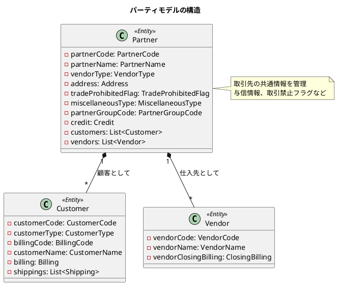
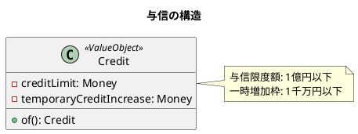
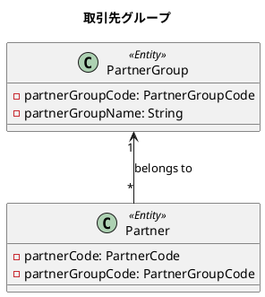
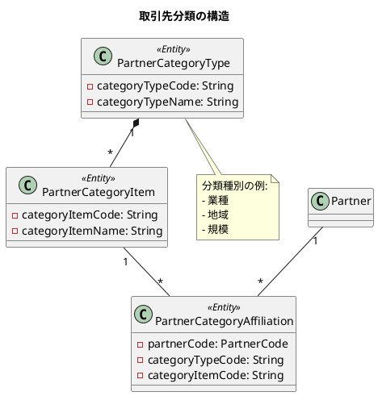
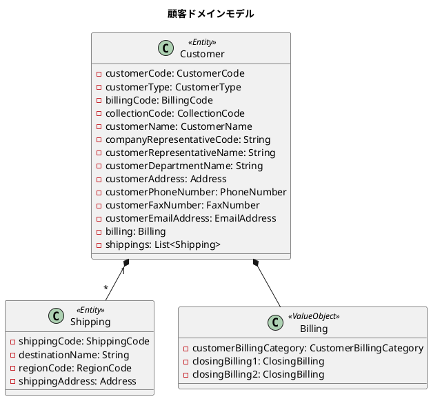
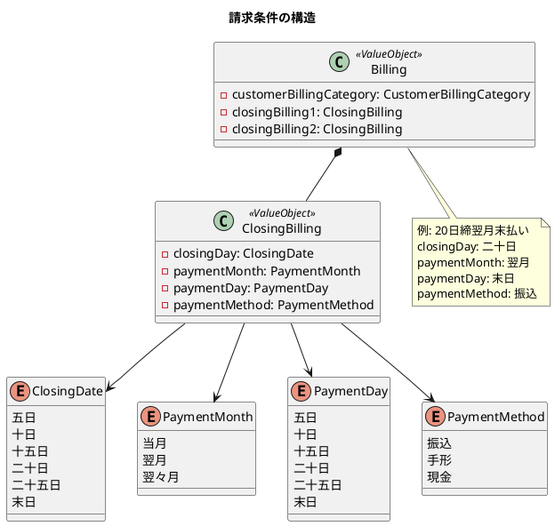

# 第12章: 取引先管理

## 12.1 パーティモデルの実装

### パーティモデルとは

パーティモデルは、顧客や仕入先など、異なる役割を持つ取引先を統一的に管理するためのデザインパターンです。共通の属性を持つ「取引先（Partner）」をベースに、それぞれの役割固有の情報を拡張します。



### 取引先エンティティの実装

取引先は、顧客と仕入先の両方の役割を持つことができます。

```java
/**
 * 取引先
 */
@Value
@AllArgsConstructor
@NoArgsConstructor(force = true)
public class Partner {
    PartnerCode partnerCode;          // 取引先コード
    PartnerName partnerName;          // 取引先名
    VendorType vendorType;            // 仕入先区分
    Address address;                  // 住所
    TradeProhibitedFlag tradeProhibitedFlag; // 取引禁止フラグ
    MiscellaneousType miscellaneousType;     // 雑区分
    PartnerGroupCode partnerGroupCode;       // 取引先グループコード
    Credit credit;                    // 与信
    List<Customer> customers;         // 顧客
    List<Vendor> vendors;             // 仕入先

    public static Partner of(
            String partnerCode,
            String partnerName,
            String partnerNameKana,
            Integer vendorType,
            String postalCode,
            String prefecture,
            String address1,
            String address2,
            Integer tradeProhibitedFlag,
            Integer miscellaneousType,
            String partnerGroupCode,
            Integer creditLimit,
            Integer temporaryCreditIncrease
    ) {
        return new Partner(
                PartnerCode.of(partnerCode),
                PartnerName.of(partnerName, partnerNameKana),
                VendorType.fromCode(vendorType),
                Address.of(postalCode, prefecture, address1, address2),
                TradeProhibitedFlag.fromCode(tradeProhibitedFlag),
                MiscellaneousType.fromCode(miscellaneousType),
                PartnerGroupCode.of(partnerGroupCode),
                Credit.of(creditLimit, temporaryCreditIncrease),
                List.of(),
                List.of()
        );
    }
}
```

### 取引先コードの実装

取引先コードは、3桁以内の数字またはアルファベット始まりの文字列です。

```java
/**
 * 取引先コード
 */
@Value
@NoArgsConstructor(force = true)
public class PartnerCode {
    String value;

    public PartnerCode(String partnerCode) {
        notNull(partnerCode, "取引先コードは必須です");

        isTrue(
                partnerCode.length() <= 3,
                "取引先コードは3桁以内である必要があります: %s",
                partnerCode
        );

        // アルファベット始まりの特殊コード
        if (partnerCode.matches("^[A-Z].*")) {
            this.value = partnerCode;
            return;
        }

        // 3桁の数字
        matchesPattern(
                partnerCode,
                "^\\d{3}$",
                "取引先コードは3桁の数字である必要があります: %s",
                partnerCode
        );

        this.value = partnerCode;
    }
}
```

### 与信管理の実装

取引先には与信情報を設定できます。与信限度額と一時増加枠にはビジネスルールによる上限があります。



```java
/**
 * 与信
 */
@Value
@NoArgsConstructor(force = true)
public class Credit {
    Money creditLimit; // 与信限度額
    Money temporaryCreditIncrease; // 与信一時増加枠

    public Credit(Integer creditLimit, Integer temporaryCreditIncrease) {
        Money creditLimitMoney = Money.of(creditLimit);
        Money temporaryCreditIncreaseMoney = Money.of(temporaryCreditIncrease);

        isTrue(
                creditLimitMoney.isLessThan(Money.of(100_000_000)),
                "与信限度額は1億円以下である必要があります"
        );
        isTrue(
                temporaryCreditIncreaseMoney.isLessThan(Money.of(10_000_000)),
                "与信一時増加枠は1千万円以下である必要があります"
        );

        this.creditLimit = creditLimitMoney;
        this.temporaryCreditIncrease = temporaryCreditIncreaseMoney;
    }
}
```

---

## 12.2 取引先グループと分類

### 取引先グループ

取引先をグループ化して管理するための機能です。



```java
/**
 * 取引先グループ
 */
@Value
@AllArgsConstructor
@NoArgsConstructor(force = true)
public class PartnerGroup {
    PartnerGroupCode partnerGroupCode; // 取引先グループコード
    String partnerGroupName; // 取引先グループ名

    public static PartnerGroup of(
            String partnerGroupCode,
            String partnerGroupName
    ) {
        return new PartnerGroup(
                PartnerGroupCode.of(partnerGroupCode),
                partnerGroupName
        );
    }
}
```

### 分類コードの実装

取引先は複数の分類軸で分類できます。



---

## 12.3 顧客マスタと仕入先マスタ

### 顧客エンティティ

顧客は取引先の一つの役割として、販売に関する固有の情報を持ちます。



### 顧客の実装

```java
/**
 * 顧客
 */
@Value
@AllArgsConstructor
@NoArgsConstructor(force = true)
@Builder(toBuilder = true)
public class Customer {
    CustomerCode customerCode; // 顧客コード
    CustomerType customerType; // 顧客区分
    BillingCode billingCode; // 請求先コード
    CollectionCode collectionCode; // 回収先コード
    CustomerName customerName; // 顧客名
    String companyRepresentativeCode; // 自社担当者コード
    String customerRepresentativeName; // 顧客担当者名
    String customerDepartmentName; // 顧客部門名
    Address customerAddress; // 顧客住所
    PhoneNumber customerPhoneNumber; // 顧客電話番号
    FaxNumber customerFaxNumber; // 顧客FAX番号
    EmailAddress customerEmailAddress; // 顧客メールアドレス
    Billing billing; // 請求
    List<Shipping> shippings; // 出荷先

    public static Customer of(
            String customerCode,
            Integer customerBranchNumber,
            Integer customerCategory,
            String billingCode,
            Integer billingBranchNumber,
            // ... その他のパラメータ
    ) {
        return new Customer(
                CustomerCode.of(customerCode, customerBranchNumber),
                CustomerType.fromCode(customerCategory),
                BillingCode.of(billingCode, billingBranchNumber),
                // ... その他の初期化
        );
    }
}
```

### 出荷先の管理

顧客は複数の出荷先を持つことができます。

```java
/**
 * 出荷先
 */
@Value
@AllArgsConstructor
@NoArgsConstructor(force = true)
public class Shipping {
    ShippingCode shippingCode; // 出荷先コード
    String destinationName; // 出荷先名
    RegionCode regionCode; // 地域コード
    Address shippingAddress; // 出荷先住所

    public static Shipping of(
            String customerCode,
            Integer destinationNumber,
            Integer customerBranchNumber,
            String destinationName,
            String regionCode,
            String destinationPostalCode,
            String destinationAddress1,
            String destinationAddress2
    ) {
        return new Shipping(
                ShippingCode.of(customerCode, destinationNumber, customerBranchNumber),
                destinationName,
                RegionCode.of(regionCode),
                Address.of(
                        destinationPostalCode,
                        destinationAddress1,
                        destinationAddress2
                )
        );
    }
}
```

### 請求条件の設計

顧客には請求条件を設定します。締日と支払条件を複数設定できます。



### 仕入先エンティティ

仕入先は、購買に関する固有の情報を持ちます。

```java
/**
 * 仕入先
 */
@Value
@AllArgsConstructor
@NoArgsConstructor(force = true)
public class Vendor {
    VendorCode vendorCode; // 仕入先コード
    VendorName vendorName; // 仕入先名
    String vendorContactName; // 仕入先担当者名
    String vendorDepartmentName; // 仕入先部門名
    Address vendorAddress; // 仕入先住所
    PhoneNumber vendorPhoneNumber; // 仕入先電話番号
    FaxNumber vendorFaxNumber; // 仕入先FAX番号
    EmailAddress vendorEmailAddress; // 仕入先メールアドレス
    ClosingBilling vendorClosingBilling; // 仕入先締請求

    public static Vendor of(
            String vendorCode,
            Integer vendorBranchCode,
            String vendorName,
            String vendorNameKana,
            String vendorContactName,
            String vendorDepartmentName,
            String vendorPostalCode,
            String vendorPrefecture,
            String vendorAddress1,
            String vendorAddress2,
            String vendorPhoneNumber,
            String vendorFaxNumber,
            String vendorEmailAddress,
            Integer vendorClosingDate,
            Integer vendorPaymentMonth,
            Integer vendorPaymentDate,
            Integer vendorPaymentMethod
    ) {
        return new Vendor(
                VendorCode.of(vendorCode, vendorBranchCode),
                VendorName.of(vendorName, vendorNameKana),
                vendorContactName,
                vendorDepartmentName,
                Address.of(vendorPostalCode, vendorPrefecture,
                          vendorAddress1, vendorAddress2),
                PhoneNumber.of(vendorPhoneNumber),
                FaxNumber.of(vendorFaxNumber),
                EmailAddress.of(vendorEmailAddress),
                ClosingBilling.of(vendorClosingDate, vendorPaymentMonth,
                                  vendorPaymentDate, vendorPaymentMethod)
        );
    }
}
```

---

## TDD によるテスト実装

### 取引先のテスト

```java
@DisplayName("取引先")
class PartnerTest {

    Partner getPartner() {
        return Partner.of(
                "001",
                "取引先名",
                "取引先名カナ",
                1,
                "1234567",
                "東京都",
                "住所１",
                "住所２",
                0,
                0,
                "0001",
                100000,
                100000
        );
    }

    @Test
    @DisplayName("取引先を作成できる")
    void shouldCreatePartner() {
        Partner partner = getPartner();

        assertAll(
                () -> assertEquals("001", partner.getPartnerCode().getValue()),
                () -> assertEquals("取引先名", partner.getPartnerName().getName()),
                () -> assertEquals("取引先名カナ", partner.getPartnerName().getNameKana()),
                () -> assertEquals(VendorType.仕入先, partner.getVendorType()),
                () -> assertEquals("1234567", partner.getAddress().getPostalCode().getValue()),
                () -> assertEquals(TradeProhibitedFlag.OFF, partner.getTradeProhibitedFlag()),
                () -> assertEquals(100000, partner.getCredit().getCreditLimit().getAmount()),
                () -> assertEquals(0, partner.getCustomers().size()),
                () -> assertEquals(0, partner.getVendors().size())
        );
    }

    @Test
    @DisplayName("取引先コードは以下の条件を満たす")
    void shouldCreatePartnerCode() {
        assertDoesNotThrow(() -> PartnerCode.of("001"));
        assertThrows(IllegalArgumentException.class, () -> PartnerCode.of(null));
        assertThrows(IllegalArgumentException.class, () -> PartnerCode.of("0011"));
        assertThrows(IllegalArgumentException.class, () -> PartnerCode.of("001a"));
    }

    @Test
    @DisplayName("与信は以下の条件を満たす")
    void shouldCreateCredit() {
        assertDoesNotThrow(() -> Credit.of(100000, 100000));
        assertThrows(IllegalArgumentException.class,
            () -> Credit.of(100000001, 100000)); // 1億円超
        assertThrows(IllegalArgumentException.class,
            () -> Credit.of(100000, 10000001)); // 1千万円超
    }
}
```

### 顧客のテスト

```java
@Nested
@DisplayName("顧客")
class CustomerTest {

    @Test
    @DisplayName("顧客を作成できる")
    void shouldCreateCustomer() {
        Customer customer = Customer.of(
                "001", 1, 1,           // 顧客コード、枝番、区分
                "001", 1,             // 請求先コード、枝番
                "001", 1,             // 回収先コード、枝番
                "山田太郎", "ヤマダタロウ",
                "RE001", "花子", "営業部",
                "123-4567", "東京都", "新宿区1-1-1", "マンション101",
                "03-1234-5678", "03-1234-5679",
                "example@example.com",
                2, 10, 0, 10, 1,       // 締請求1
                20, 1, 99, 2          // 締請求2
        );

        assertAll(
                () -> assertEquals("001", customer.getCustomerCode().getCode().getValue()),
                () -> assertEquals(CustomerType.顧客, customer.getCustomerType()),
                () -> assertEquals("山田太郎", customer.getCustomerName().getValue().getName()),
                () -> assertEquals(CustomerBillingCategory.締請求,
                    customer.getBilling().getCustomerBillingCategory())
        );
    }

    @Test
    @DisplayName("20日締翌月末現金払い条件を設定できる")
    void shouldCreateClosingInvoice() {
        ClosingBilling closingBilling = ClosingBilling.of(20, 1, 99, 1);

        assertAll(
                () -> assertEquals(ClosingDate.二十日, closingBilling.getClosingDay()),
                () -> assertEquals(PaymentMonth.翌月, closingBilling.getPaymentMonth()),
                () -> assertEquals(PaymentDay.末日, closingBilling.getPaymentDay()),
                () -> assertEquals(PaymentMethod.振込, closingBilling.getPaymentMethod())
        );
    }
}
```

### 仕入先のテスト

```java
@Nested
@DisplayName("仕入先")
class VendorTest {

    @Test
    @DisplayName("仕入先を作成できる")
    void createVendor() {
        Vendor vendor = Vendor.of(
                "001", 1,
                "仕入先名A", "シリヒキサキメイエー",
                "担当者名A", "部門名A",
                "123-4567", "東京都", "新宿区1-1-1", "マンション101",
                "03-1234-5678", "03-1234-5679",
                "test@example.com",
                10, 1, 20, 2
        );

        assertAll(
                () -> assertEquals("001", vendor.getVendorCode().getCode().getValue()),
                () -> assertEquals(1, vendor.getVendorCode().getBranchNumber()),
                () -> assertEquals("仕入先名A", vendor.getVendorName().getValue().getName()),
                () -> assertEquals(ClosingDate.十日,
                    vendor.getVendorClosingBilling().getClosingDay()),
                () -> assertEquals(PaymentMethod.手形,
                    vendor.getVendorClosingBilling().getPaymentMethod())
        );
    }

    @Test
    @DisplayName("仕入先コードは以下の条件を満たす")
    void shouldCreateVendorCode() {
        assertDoesNotThrow(() -> VendorCode.of("001", 0));
        assertThrows(IllegalArgumentException.class, () -> VendorCode.of(null, 1));
        assertThrows(IllegalArgumentException.class, () -> VendorCode.of("001", -1));
        assertThrows(IllegalArgumentException.class, () -> VendorCode.of("001", 1000));
    }
}
```

---

## まとめ

本章では、取引先管理の実装について解説しました。

- **パーティモデルの実装**: 取引先を中心とした統一的なデータモデル
- **取引先グループと分類**: グループ管理、複数軸での分類
- **顧客マスタと仕入先マスタ**: 役割ごとの固有情報、請求・支払条件の管理

第3部「マスタ管理機能」では、認証・ユーザー管理から取引先管理まで、システムの基盤となるマスタデータの実装を解説しました。次の第4部では、これらのマスタを活用した販売管理機能の実装に進みます。
