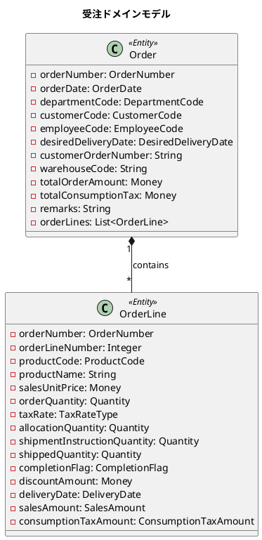
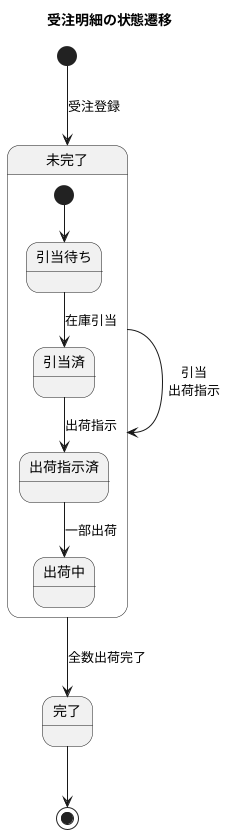
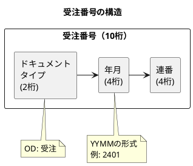
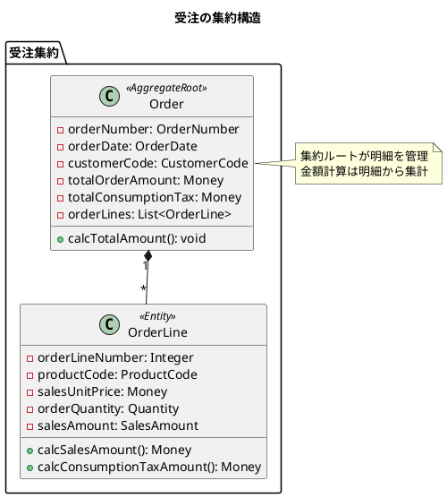
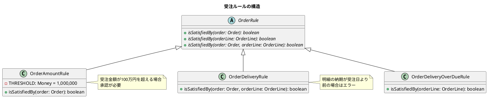
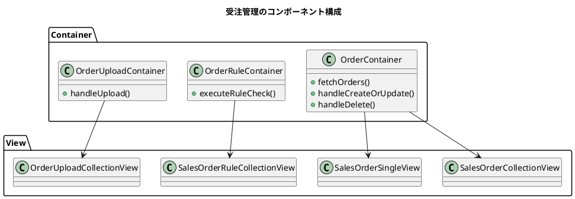
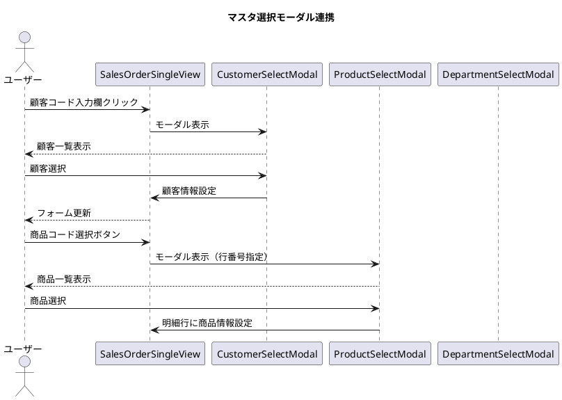

# 第13章: 受注管理

## 13.1 受注ワークフロー

### 受注ドメインモデルの概要

受注管理は販売管理システムの中核機能です。受注は顧客からの注文情報を管理し、出荷・売上へとつながる起点となります。



### 受注ステータスの設計

受注明細には完了フラグがあり、出荷処理の進捗を管理します。



```java
/**
 * 完了フラグ
 */
public enum CompletionFlag {
    未完了(0),
    完了(1);

    private final int value;

    CompletionFlag(int value) {
        this.value = value;
    }

    public static CompletionFlag of(int completionFlag) {
        return completionFlag == 1 ? 完了 : 未完了;
    }

    public boolean isCompleted() {
        return this == 完了;
    }
}
```

### 受注番号の採番ルール

受注番号は、ドキュメントタイプコードと年月、連番で構成されます。



```java
/**
 * 受注番号
 */
@Value
@NoArgsConstructor(force = true)
public class OrderNumber {
    String value;

    public OrderNumber(String orderNumber) {
        notNull(orderNumber, "受注番号は必須です");
        isTrue(orderNumber.startsWith(DocumentTypeCode.受注.getCode()),
               "注文番号は先頭が" + DocumentTypeCode.受注.getCode() +
               "で始まる必要があります");
        matchesPattern(orderNumber, "^[A-Za-z]{2}[0-9]{8}$",
                       "注文番号は先頭2文字がコード、続いて8桁の数字である必要があります");
        this.value = orderNumber;
    }

    public static String generate(String code, LocalDateTime yearMonth,
                                  Integer autoNumber) {
        isTrue(code.equals(DocumentTypeCode.受注.getCode()),
               "受注番号は先頭が" + DocumentTypeCode.受注.getCode() +
               "で始まる必要があります");
        return code + yearMonth.format(DateTimeFormatter.ofPattern("yyMM"))
               + String.format("%04d", autoNumber);
    }
}
```

---

## 13.2 受注ヘッダと明細

### 親子関係のモデリング

受注（ヘッダ）と受注明細は、1対多の親子関係を持ちます。受注には複数の明細が含まれ、合計金額は明細から自動計算されます。



### 受注エンティティの実装

```java
/**
 * 受注
 */
@Value
@AllArgsConstructor
@NoArgsConstructor(force = true)
@Builder(toBuilder = true)
public class Order {
    OrderNumber orderNumber; // 受注番号
    OrderDate orderDate; // 受注日
    DepartmentCode departmentCode; // 部門コード
    LocalDateTime departmentStartDate; // 部門開始日
    CustomerCode customerCode; // 顧客コード
    EmployeeCode employeeCode; // 社員コード
    DesiredDeliveryDate desiredDeliveryDate; // 希望納期
    String customerOrderNumber; // 客先注文番号
    String warehouseCode; // 倉庫コード
    Money totalOrderAmount; // 受注金額合計
    Money totalConsumptionTax; // 消費税合計
    String remarks; // 備考
    List<OrderLine> orderLines; // 受注明細
    Department department; // 部門
    Customer customer; // 顧客
    Employee employee; // 社員

    public static Order of(
            String orderNumber,
            LocalDateTime orderDate,
            String departmentCode,
            LocalDateTime departmentStartDate,
            String customerCode,
            Integer customerBranchNumber,
            String employeeCode,
            LocalDateTime desiredDeliveryDate,
            String customerOrderNumber,
            String warehouseCode,
            Integer totalOrderAmount,
            Integer totalConsumptionTax,
            String remarks,
            List<OrderLine> orderLines) {

        // 受注日は納品希望日より前である必要がある
        isTrue(!orderDate.isAfter(desiredDeliveryDate),
               "受注日は納品希望日より前に設定してください");

        // 合計金額を明細から計算
        Money calcTotalOrderAmount = orderLines.stream()
                .map(OrderLine::calcSalesAmount)
                .reduce(Money.of(0), Money::plusMoney);

        Money calcTotalConsumptionTax = orderLines.stream()
                .map(OrderLine::calcConsumptionTaxAmount)
                .reduce(Money.of(0), Money::plusMoney);

        return new Order(
            OrderNumber.of(orderNumber),
            OrderDate.of(orderDate),
            DepartmentCode.of(departmentCode),
            departmentStartDate,
            CustomerCode.of(customerCode, customerBranchNumber),
            EmployeeCode.of(employeeCode),
            DesiredDeliveryDate.of(desiredDeliveryDate),
            customerOrderNumber,
            warehouseCode,
            calcTotalOrderAmount,
            calcTotalConsumptionTax,
            remarks,
            orderLines,
            null, null, null
        );
    }
}
```

### 受注明細の実装

```java
/**
 * 受注明細
 */
@Value
@AllArgsConstructor
@NoArgsConstructor(force = true)
@Builder(toBuilder = true)
public class OrderLine {
    OrderNumber orderNumber; // 受注番号
    Integer orderLineNumber; // 受注行番号
    ProductCode productCode; // 商品コード
    String productName; // 商品名
    Money salesUnitPrice; // 販売単価
    Quantity orderQuantity; // 受注数量
    TaxRateType taxRate; // 消費税率
    Quantity allocationQuantity; // 引当数量
    Quantity shipmentInstructionQuantity; // 出荷指示数量
    Quantity shippedQuantity; // 出荷済数量
    CompletionFlag completionFlag; // 完了フラグ
    Money discountAmount; // 値引金額
    DeliveryDate deliveryDate; // 納期
    ShippingDate shippingDate; // 出荷日
    Product product; // 商品
    SalesAmount salesAmount; // 販売価格
    ConsumptionTaxAmount consumptionTaxAmount; // 消費税額

    public Money calcSalesAmount() {
        return Objects.requireNonNull(salesAmount).getValue();
    }

    public Money calcConsumptionTaxAmount() {
        return Objects.requireNonNull(consumptionTaxAmount).getValue();
    }

    public static OrderLine complete(OrderLine orderLine) {
        return new OrderLine(
            orderLine.getOrderNumber(),
            orderLine.getOrderLineNumber(),
            orderLine.getProductCode(),
            orderLine.getProductName(),
            orderLine.getSalesUnitPrice(),
            orderLine.getOrderQuantity(),
            orderLine.getTaxRate(),
            orderLine.getAllocationQuantity(),
            orderLine.getShipmentInstructionQuantity(),
            orderLine.getShippedQuantity(),
            CompletionFlag.完了, // ステータスを完了に変更
            orderLine.getDiscountAmount(),
            orderLine.getDeliveryDate(),
            orderLine.getShippingDate(),
            orderLine.getProduct(),
            orderLine.getSalesAmount(),
            orderLine.getConsumptionTaxAmount()
        );
    }
}
```

### 売上金額の計算

売上金額と消費税額は、専用のクラスで計算します。

```java
/**
 * 売上金額計算
 */
@Value
public class SalesCalculation {
    SalesAmount salesAmount;
    ConsumptionTaxAmount consumptionTaxAmount;

    public static SalesCalculation of(
            Money salesUnitPrice,
            Quantity salesQuantity,
            Product product,
            TaxRateType taxRateType) {

        SalesAmount calcSalesAmount = SalesAmount.of(salesUnitPrice, salesQuantity);
        ConsumptionTaxAmount calcConsumptionTaxAmount =
            ConsumptionTaxAmount.of(calcSalesAmount, taxRateType, product);

        // 内税の場合は、売上金額から消費税を差し引く
        if (calcConsumptionTaxAmount.getTaxType().equals(TaxType.内税)) {
            Money salesAmount = calcSalesAmount.getValue()
                .subtract(calcConsumptionTaxAmount.getValue());
            Money salesAmountPerUnit = salesAmount
                .divide(calcSalesAmount.getOrderQuantity());
            calcSalesAmount = new SalesAmount(
                salesAmountPerUnit, calcSalesAmount.getOrderQuantity());
        }

        return new SalesCalculation(calcSalesAmount, calcConsumptionTaxAmount);
    }
}
```

### 消費税率の定義

```java
/**
 * 消費税率種別
 */
@Getter
public enum TaxRateType {
    標準税率(10, "通常の消費税率"),
    軽減税率(8, "軽減税率（食品など）"),
    非課税(0, "非課税（消費税がかからない）");

    private final Integer rate;
    private final String description;

    TaxRateType(Integer rate, String description) {
        this.rate = rate;
        this.description = description;
    }

    public static TaxRateType of(Integer rate) {
        for (TaxRateType taxRateType : TaxRateType.values()) {
            if (taxRateType.getRate().equals(rate)) {
                return taxRateType;
            }
        }
        throw new IllegalArgumentException("不正な消費税率です");
    }
}
```

---

## 13.3 受注ルール

### ビジネスルールの設計

受注にはさまざまなビジネスルールが適用されます。ルールは Strategy パターンで実装し、柔軟に追加・変更できます。



### ルールの基底クラス

```java
/**
 * 受注ルール
 */
public abstract class OrderRule {
    public abstract boolean isSatisfiedBy(Order order);
    public abstract boolean isSatisfiedBy(OrderLine orderLine);
    public abstract boolean isSatisfiedBy(Order order, OrderLine orderLine);
}
```

### 受注金額ルール

```java
/**
 * 受注金額ルール
 * 100万円を超える受注は特別承認が必要
 */
public class OrderAmountRule extends OrderRule {
    private static final Money THRESHOLD = Money.of(1000000);

    @Override
    public boolean isSatisfiedBy(Order order) {
        return order.getTotalOrderAmount().isGreaterThan(THRESHOLD);
    }

    @Override
    public boolean isSatisfiedBy(OrderLine orderLine) {
        return false;
    }

    @Override
    public boolean isSatisfiedBy(Order order, OrderLine orderLine) {
        return false;
    }
}
```

### 納期ルール

```java
/**
 * 受注納期ルール
 * 明細の納期は受注日より後である必要がある
 */
public class OrderDeliveryRule extends OrderRule {
    @Override
    public boolean isSatisfiedBy(Order order) {
        return false;
    }

    @Override
    public boolean isSatisfiedBy(OrderLine orderLine) {
        return false;
    }

    @Override
    public boolean isSatisfiedBy(Order order, OrderLine orderLine) {
        return orderLine.getDeliveryDate().getValue()
            .isBefore(order.getOrderDate().getValue());
    }
}
```

### ルールチェックリスト

```java
/**
 * 受注ルールチェックリスト
 */
public class OrderRuleCheckList {
    List<Map<String, String>> value;

    public OrderRuleCheckList(List<Map<String, String>> value) {
        this.value = Collections.unmodifiableList(value);
    }

    public int size() {
        return value.size();
    }

    public OrderRuleCheckList add(Map<String, String> error) {
        List<Map<String, String>> newValue = new ArrayList<>(value);
        newValue.add(error);
        return new OrderRuleCheckList(newValue);
    }

    public List<Map<String, String>> asList() {
        return value;
    }

    public boolean isEmpty() {
        return value.isEmpty();
    }
}
```

---

## 13.4 TDD によるテスト

### 受注のテスト

```java
@DisplayName("受注")
class OrderTest {

    @Test
    @DisplayName("受注を作成できる")
    void shouldCreateSalesOrder() {
        OrderLine orderLine = OrderLine.of(
            "OD12345678", 1, "P12345", "テスト商品",
            1000, 2, 10, 2, 2, 2, 0, 200,
            LocalDateTime.now(), null
        );

        Order order = Order.of(
            "OD12345678",
            LocalDateTime.now(),
            "12345",
            LocalDateTime.now(),
            "001", 1,
            "EMP001",
            LocalDateTime.now(),
            "CUSTORDER123",
            "WH001",
            2000, 200,
            "これは備考です",
            List.of(orderLine)
        );

        assertAll(
            () -> assertEquals("OD12345678", order.getOrderNumber().getValue()),
            () -> assertEquals("12345", order.getDepartmentCode().getValue()),
            () -> assertEquals("001", order.getCustomerCode().getCode().getValue()),
            () -> assertEquals(2000, order.getTotalOrderAmount().getAmount()),
            () -> assertEquals(1, order.getOrderLines().size())
        );
    }

    @Test
    @DisplayName("受注日より前に納品希望日を設定できない")
    void shouldNotCreateSalesOrder() {
        assertThrows(IllegalArgumentException.class, () ->
            Order.of(
                "OD12345678",
                LocalDateTime.now(),
                "12345",
                LocalDateTime.now(),
                "001", 1,
                "EMP001",
                LocalDateTime.now().minusDays(1), // 過去の日付
                "CUSTORDER123",
                "WH001",
                0, 0,
                "備考",
                List.of()
            )
        );
    }
}
```

### 金額計算のテスト

```java
@Nested
@DisplayName("受注金額合計")
class TotalOrderAmountTest {

    @Test
    @DisplayName("単一受注明細の金額合計を計算できる")
    void shouldCalculateTotalOrderAmountWithSingleLine() {
        OrderLine orderLine = OrderLine.of(
            "OD12345678", 1, "P12345", "テスト商品",
            1000, 2, 10, 2, 2, 2, 0, 200,
            LocalDateTime.now(), null
        );

        Order order = Order.of(
            "OD12345678", LocalDateTime.now(), "12345",
            LocalDateTime.now(), "001", 1, "EMP001",
            LocalDateTime.now(), "CUSTORDER123", "WH001",
            0, 0, "備考", List.of(orderLine)
        );

        assertEquals(2000, order.getTotalOrderAmount().getAmount());
    }

    @Test
    @DisplayName("複数受注明細の金額合計を計算できる")
    void shouldCalculateTotalOrderAmountWithMultipleLines() {
        OrderLine line1 = OrderLine.of(
            "OD12345678", 1, "P12345", "商品1",
            1000, 2, 10, 0, 0, 0, 0, 0,
            LocalDateTime.now(), null
        );

        OrderLine line2 = OrderLine.of(
            "OD12345678", 2, "P12346", "商品2",
            2000, 3, 10, 0, 0, 0, 0, 0,
            LocalDateTime.now(), null
        );

        Order order = Order.of(
            "OD12345678", LocalDateTime.now(), "12345",
            LocalDateTime.now(), "001", 1, "EMP001",
            LocalDateTime.now(), "CUSTORDER123", "WH001",
            0, 0, "備考", List.of(line1, line2)
        );

        // 1000*2 + 2000*3 = 8000
        assertEquals(8000, order.getTotalOrderAmount().getAmount());
    }
}
```

### 消費税計算のテスト

```java
@Nested
@DisplayName("消費税合計")
class TotalConsumptionTaxTest {

    @Test
    @DisplayName("標準税率の消費税合計を計算できる")
    void shouldCalculateTotalConsumptionTaxWithStandardRate() {
        OrderLine orderLine = OrderLine.of(
            "OD12345678", 1, "P12345", "テスト商品",
            1000, 2, TaxRateType.標準税率.getRate(), // 10%
            0, 0, 0, 0, 0,
            LocalDateTime.now(), null
        );

        Order order = Order.of(
            "OD12345678", LocalDateTime.now(), "12345",
            LocalDateTime.now(), "001", 1, "EMP001",
            LocalDateTime.now(), "CUSTORDER123", "WH001",
            0, 0, "備考", List.of(orderLine)
        );

        // 2000 * 10% = 200
        assertEquals(200, order.getTotalConsumptionTax().getAmount());
    }

    @Test
    @DisplayName("複数税率の消費税合計を計算できる")
    void shouldCalculateTotalConsumptionTaxWithMixedRates() {
        OrderLine line1 = OrderLine.of(
            "OD12345678", 1, "P12345", "一般商品",
            1000, 2, TaxRateType.標準税率.getRate(), // 10%
            0, 0, 0, 0, 0,
            LocalDateTime.now(), null
        );

        OrderLine line2 = OrderLine.of(
            "OD12345678", 2, "P12346", "食品",
            100, 10, TaxRateType.軽減税率.getRate(), // 8%
            0, 0, 0, 0, 0,
            LocalDateTime.now(), null
        );

        Order order = Order.of(
            "OD12345678", LocalDateTime.now(), "12345",
            LocalDateTime.now(), "001", 1, "EMP001",
            LocalDateTime.now(), "CUSTORDER123", "WH001",
            0, 0, "備考", List.of(line1, line2)
        );

        // 2000*10% + 1000*8% = 200 + 80 = 280
        assertEquals(280, order.getTotalConsumptionTax().getAmount());
    }
}
```

### 明細完了のテスト

```java
@Test
@DisplayName("受注明細を完了にできる")
void shouldCompleteSalesOrderLine() {
    OrderLine line = OrderLine.of(
        "OD12345678", 1, "P12345", "テスト商品",
        1500, 3, 8, 1, 0, 0, 0, 100,
        LocalDateTime.now(), null
    );

    OrderLine completedLine = OrderLine.complete(line);

    assertEquals(CompletionFlag.完了, completedLine.getCompletionFlag());
}
```

---

## 13.5 React コンポーネントの実装

### 受注画面のコンポーネント構成

受注管理画面は、一覧・詳細・ルールチェック・一括登録の各機能で構成されています。



### 受注一覧画面の実装

受注一覧画面では、受注番号、受注日、顧客コード、受注金額合計を表示します。

```typescript
interface SalesOrderItemProps {
    salesOrder: SalesOrderType;
    onEdit: (salesOrder: SalesOrderType) => void;
    onDelete: (orderNumber: string) => void;
    onCheck: (salesOrder: SalesOrderType) => void;
}

const SalesOrderItem: React.FC<SalesOrderItemProps> = ({
    salesOrder,
    onEdit,
    onDelete,
    onCheck
}) => (
    <li className="collection-object-item" key={salesOrder.orderNumber}>
        <div className="collection-object-item-content">
            <input
                type="checkbox"
                checked={salesOrder.checked}
                onChange={() => onCheck(salesOrder)}
            />
        </div>
        <div className="collection-object-item-content">
            <div className="collection-object-item-content-details">受注番号</div>
            <div className="collection-object-item-content-name">{salesOrder.orderNumber}</div>
        </div>
        <div className="collection-object-item-content">
            <div className="collection-object-item-content-details">受注日</div>
            <div className="collection-object-item-content-name">
                {salesOrder.orderDate.split("T")[0]}
            </div>
        </div>
        <div className="collection-object-item-content">
            <div className="collection-object-item-content-details">顧客コード</div>
            <div className="collection-object-item-content-name">{salesOrder.customerCode}</div>
        </div>
        <div className="collection-object-item-content">
            <div className="collection-object-item-content-details">受注金額合計</div>
            <div className="collection-object-item-content-name">{salesOrder.totalOrderAmount}</div>
        </div>
        <div className="collection-object-item-actions">
            <button onClick={() => onEdit(salesOrder)}>編集</button>
        </div>
        <div className="collection-object-item-actions">
            <button onClick={() => onDelete(salesOrder.orderNumber)}>削除</button>
        </div>
    </li>
);
```

### 受注明細の動的追加・削除

受注詳細画面では、明細行を動的に追加・削除できます。金額計算も自動的に行われます。

```typescript
// 明細行の金額計算
const calculateLineAmount = (line: SalesOrderLineType): number => {
    return line.orderQuantity * line.salesUnitPrice - (line.discountAmount || 0);
};

// 明細行の消費税計算
const calculateLineTax = (line: SalesOrderLineType): number => {
    const amount = calculateLineAmount(line);
    const taxRate = getTaxRate(line);
    return line.taxRate === TaxRateEnumType.非課税 ? 0 : Math.floor(amount * taxRate);
};

// 合計金額の計算
const calculateTotalAmount = (lines: SalesOrderLineType[]): number => {
    return lines.reduce((sum, line) => sum + calculateLineAmount(line), 0);
};

// 合計消費税の計算
const calculateTotalTax = (lines: SalesOrderLineType[]): number => {
    return lines.reduce((sum, line) => sum + calculateLineTax(line), 0);
};
```

### 明細の追加・更新・削除処理

```typescript
const Form = ({ newSalesOrder, setNewSalesOrder, ... }) => {
    // 明細行の更新
    const handleUpdateLine = (index: number, line: SalesOrderLineType) => {
        const newLines = [...newSalesOrder.salesOrderLines];
        newLines[index] = { ...line, orderNumber: newSalesOrder.orderNumber };

        const totalAmount = calculateTotalAmount(newLines);
        const totalTax = calculateTotalTax(newLines);

        setNewSalesOrder({
            ...newSalesOrder,
            salesOrderLines: newLines,
            totalOrderAmount: totalAmount,
            totalConsumptionTax: totalTax
        });
    };

    // 明細行の削除
    const handleDeleteLine = (index: number) => {
        const newLines = newSalesOrder.salesOrderLines
            .filter((_, i) => i !== index)
            .map((line, i) => ({ ...line, orderLineNumber: i + 1 }));

        setNewSalesOrder({
            ...newSalesOrder,
            salesOrderLines: newLines,
            totalOrderAmount: calculateTotalAmount(newLines),
            totalConsumptionTax: calculateTotalTax(newLines)
        });
    };

    // 明細行の追加
    const handleAddLine = () => {
        const newLine: SalesOrderLineType = {
            orderNumber: newSalesOrder.orderNumber,
            orderLineNumber: newSalesOrder.salesOrderLines.length + 1,
            productCode: '',
            productName: '',
            salesUnitPrice: 0,
            orderQuantity: 0,
            taxRate: TaxRateEnumType.標準税率,
            allocationQuantity: 0,
            shipmentInstructionQuantity: 0,
            shippedQuantity: 0,
            completionFlag: CompletionFlagEnumType.未完了,
            discountAmount: 0,
            deliveryDate: new Date().toISOString().slice(0, 16)
        };
        setNewSalesOrder({
            ...newSalesOrder,
            salesOrderLines: [...newSalesOrder.salesOrderLines, newLine]
        });
    };
    // ...
};
```

### 受注明細テーブルの実装

明細はテーブル形式で表示し、インライン編集が可能です。

```typescript
<div className="single-view-content-item-form-lines order-detail">
    <h3>
        受注明細
        <button className="add-line-button" onClick={handleAddLine}>
            <span>＋</span> 明細追加
        </button>
    </h3>
    <div className="table-container">
        <table className="order-lines-table">
            <thead>
                <tr>
                    <th>商品コード</th>
                    <th>商品名</th>
                    <th>販売単価</th>
                    <th>受注数量</th>
                    <th>消費税率</th>
                    <th>完了フラグ</th>
                    <th>値引金額</th>
                    <th>納期</th>
                    <th>操作</th>
                </tr>
            </thead>
            <tbody>
                {newSalesOrder.salesOrderLines.map((line, index) => (
                    <tr key={index}>
                        <td>
                            <input
                                type="text"
                                value={line.productCode}
                                onChange={(e) => handleUpdateLine(index, {
                                    ...line,
                                    productCode: e.target.value
                                })}
                            />
                            <button onClick={() => handleProductSelectEvent(index)}>
                                選択
                            </button>
                        </td>
                        {/* ... 他のカラム */}
                        <td>
                            <button onClick={() => handleDeleteLine(index)}>
                                削除
                            </button>
                        </td>
                    </tr>
                ))}
            </tbody>
            <tfoot>
                <tr>
                    <td className="total-label">小計</td>
                    <td className="total-amount">
                        {newSalesOrder.totalOrderAmount.toLocaleString()}
                    </td>
                </tr>
                <tr>
                    <td className="total-label">消費税</td>
                    <td className="total-amount">
                        {newSalesOrder.totalConsumptionTax.toLocaleString()}
                    </td>
                </tr>
                <tr>
                    <td className="total-label">合計金額</td>
                    <td className="total-amount">
                        {(newSalesOrder.totalOrderAmount +
                          newSalesOrder.totalConsumptionTax).toLocaleString()}
                    </td>
                </tr>
            </tfoot>
        </table>
    </div>
</div>
```

### ステータス遷移 UI（完了フラグ）

受注明細の完了フラグは、セレクトボックスで切り替えます。

```typescript
// 完了フラグの列挙型
export enum CompletionFlagEnumType {
    完了 = "完了",
    未完了 = "未完了"
}

// 消費税率の列挙型
export enum TaxRateEnumType {
    標準税率 = "標準税率",
    軽減税率 = "軽減税率",
    非課税 = "非課税"
}

// 完了フラグのセレクトボックス
<td className="table-cell">
    <select
        value={line.completionFlag}
        onChange={(e) => handleUpdateLine(index, {
            ...line,
            completionFlag: e.target.value as CompletionFlagEnumType
        })}
    >
        <option value={CompletionFlagEnumType.完了}>完了</option>
        <option value={CompletionFlagEnumType.未完了}>未完了</option>
    </select>
</td>
```

### 受注ルールチェック画面

受注ルールチェック画面では、ビジネスルールの検証結果を表示します。

```typescript
interface SalesOrderRuleCollectionViewProps {
    ruleHeaderItems: {
        handleExecuteRuleCheck: () => void;
    };
    ruleResults: RuleCheckResultType[];
    handleDeleteRuleResult: (index: number) => void;
}

export const SalesOrderRuleCollectionView: React.FC<Props> = ({
    ruleHeaderItems: { handleExecuteRuleCheck },
    ruleResults,
    handleDeleteRuleResult,
}) => (
    <div className="collection-view-object-container">
        <div className="collection-view-header">
            <h1 className="single-view-title">受注ルールチェック</h1>
        </div>
        <div className="collection-view-content">
            <div className="button-container">
                <button onClick={handleExecuteRuleCheck}>実行</button>
            </div>
            <ul className="collection-object-list">
                {ruleResults.map((result, index) => (
                    <div key={index} className="upload-result-item">
                        <div className="upload-result-message">
                            <Message message={result.message} />
                            {result.details && result.details.length > 0 && (
                                <div className="upload-result-details">
                                    {result.details.map((detail, detailIndex) => (
                                        <div key={detailIndex}>
                                            {Object.entries(detail).map(([key, value]) => (
                                                <div key={key}>
                                                    <span>{key}:</span>
                                                    <span>{value}</span>
                                                </div>
                                            ))}
                                        </div>
                                    ))}
                                </div>
                            )}
                        </div>
                        <button onClick={() => handleDeleteRuleResult(index)}>x</button>
                    </div>
                ))}
            </ul>
        </div>
    </div>
);
```

### マスタ選択モーダル連携

受注詳細画面から、部門・社員・顧客・商品を選択するモーダルを呼び出します。



### 型定義

```typescript
// 受注の型定義
export interface SalesOrderType {
    orderNumber: string;
    orderDate: string;
    departmentCode: string;
    departmentStartDate: string;
    customerCode: string;
    customerBranchNumber: number;
    employeeCode: string;
    desiredDeliveryDate: string;
    customerOrderNumber: string;
    warehouseCode: string;
    totalOrderAmount: number;
    totalConsumptionTax: number;
    remarks: string;
    salesOrderLines: SalesOrderLineType[];
    checked?: boolean;
}

// 受注明細の型定義
export interface SalesOrderLineType {
    orderNumber: string;
    orderLineNumber: number;
    productCode: string;
    productName: string;
    salesUnitPrice: number;
    orderQuantity: number;
    taxRate: TaxRateEnumType;
    allocationQuantity: number;
    shipmentInstructionQuantity: number;
    shippedQuantity: number;
    completionFlag: CompletionFlagEnumType;
    discountAmount: number;
    deliveryDate: string;
    shippingDate?: string;
}

// ルールチェック結果の型定義
export interface RuleCheckResultType {
    message: string;
    details?: Record<string, string>[];
}
```

---

## まとめ

本章では、受注管理の実装について解説しました。

- **受注ワークフロー**: 受注ステータス、受注番号の採番ルール
- **受注ヘッダと明細**: 親子関係のモデリング、金額の自動計算
- **受注ルール**: Strategy パターンによるビジネスルールの実装
- **TDD によるテスト**: 金額計算、消費税計算のテストケース
- **React コンポーネント**: 明細の動的追加・削除、金額の自動計算、ステータス遷移 UI

次章では、出荷・売上管理の実装について解説します。
