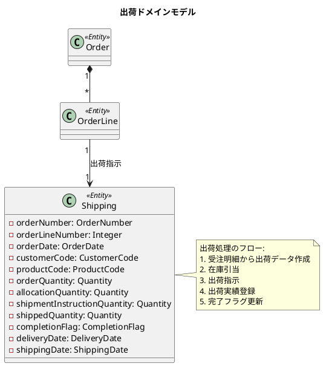
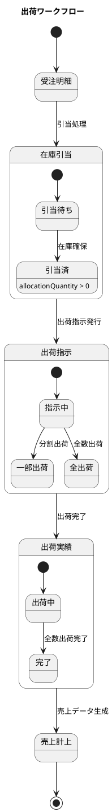
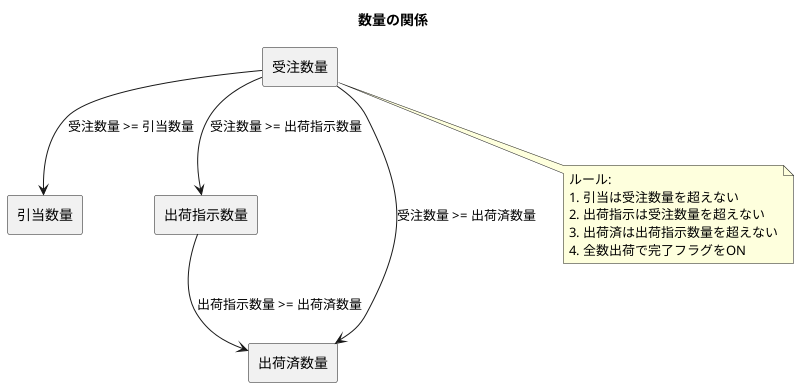
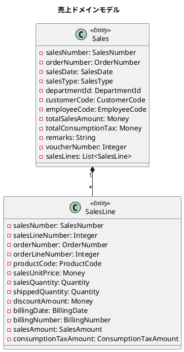
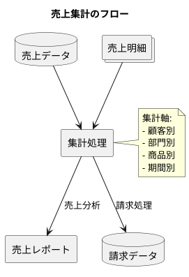
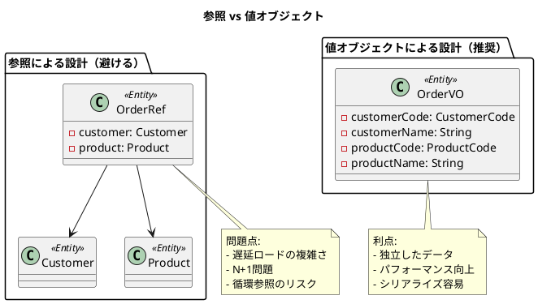

# 第14章: 出荷・売上管理

## 14.1 出荷指示と出荷実績

### 出荷ドメインモデルの概要

出荷は、受注に基づいて商品を顧客に届けるプロセスを管理します。受注明細ごとに出荷指示を発行し、出荷実績を記録します。



### 出荷ワークフロー



### 出荷エンティティの実装

出荷は受注明細の情報を引き継ぎ、出荷固有の情報を追加します。

```java
/**
 * 出荷
 */
@Value
@AllArgsConstructor
@NoArgsConstructor(force = true)
@Builder(toBuilder = true)
public class Shipping {
    OrderNumber orderNumber; // 受注番号
    OrderDate orderDate; // 受注日
    DepartmentCode departmentCode; // 部門コード
    LocalDateTime departmentStartDate; // 部門開始日
    CustomerCode customerCode; // 顧客コード
    EmployeeCode employeeCode; // 社員コード
    DesiredDeliveryDate desiredDeliveryDate; // 希望納期
    String customerOrderNumber; // 客先注文番号
    String warehouseCode; // 倉庫コード
    Money totalOrderAmount; // 受注金額合計
    Money totalConsumptionTax; // 消費税合計
    String remarks; // 備考
    Integer orderLineNumber; // 受注行番号
    ProductCode productCode; // 商品コード
    String productName; // 商品名
    Money salesUnitPrice; // 販売単価
    Quantity orderQuantity; // 受注数量
    TaxRateType taxRate; // 消費税率
    Quantity allocationQuantity; // 引当数量
    Quantity shipmentInstructionQuantity; // 出荷指示数量
    Quantity shippedQuantity; // 出荷済数量
    CompletionFlag completionFlag; // 完了フラグ
    Money discountAmount; // 値引金額
    DeliveryDate deliveryDate; // 納期
    ShippingDate shippingDate; // 出荷日
    Product product; // 商品
    SalesAmount salesAmount; // 販売価格
    ConsumptionTaxAmount consumptionTaxAmount; // 消費税額
    Department department; // 部門
    Customer customer; // 顧客
    Employee employee; // 社員

    public static Shipping of(/* パラメータ省略 */) {
        // 数量のバリデーション
        isTrue(orderQuantity.getAmount() >= shipmentInstructionQuantity.getAmount(),
               "受注数量より出荷指示数量が多いです。");
        isTrue(orderQuantity.getAmount() >= shippedQuantity.getAmount(),
               "受注数量より出荷済数量が多いです。");
        isTrue(shipmentInstructionQuantity.getAmount() >= shippedQuantity.getAmount(),
               "受注指示数量より出荷済数量が多いです。");

        // 完了フラグの自動判定
        CompletionFlag status = orderQuantity.getAmount() == shippedQuantity.getAmount()
            ? CompletionFlag.完了
            : CompletionFlag.未完了;

        return new Shipping(/* パラメータ省略 */);
    }
}
```

### 数量のバリデーション

出荷では、数量に関する厳密なビジネスルールが適用されます。



---

## 14.2 売上計上

### 売上ドメインモデル

売上は出荷完了後に計上されます。受注情報を引き継ぎ、請求に必要な情報を管理します。



### 売上エンティティの実装

```java
/**
 * 売上
 */
@Value
@AllArgsConstructor
@NoArgsConstructor(force = true)
@Builder(toBuilder = true)
public class Sales {
    SalesNumber salesNumber; // 売上番号
    OrderNumber orderNumber; // 受注番号
    SalesDate salesDate; // 売上日
    SalesType salesType; // 売上区分
    DepartmentId departmentId; // 部門ID
    PartnerCode partnerCode; // 取引先コード
    CustomerCode customerCode; // 顧客コード
    EmployeeCode employeeCode; // 社員コード
    Money totalSalesAmount; // 売上金額合計
    Money totalConsumptionTax; // 消費税合計
    String remarks; // 備考
    Integer voucherNumber; // 赤黒伝票番号
    String originalVoucherNumber; // 元伝票番号
    List<SalesLine> salesLines; // 売上明細
    Customer customer;
    Employee employee;

    public static Sales of(
            String salesNumber,
            String orderNumber,
            LocalDateTime salesDate,
            Integer salesType,
            String departmentCode,
            LocalDateTime departmentStartDate,
            String customerCode,
            Integer customerBranchNumber,
            String employeeCode,
            Integer voucherNumber,
            String originalVoucherNumber,
            String remarks,
            List<SalesLine> salesLines) {

        // 売上明細から合計金額を計算
        List<SalesLine> safeSalesLines = salesLines != null ? salesLines : List.of();

        Money calcTotalSalesAmount = safeSalesLines.stream()
                .map(SalesLine::calcSalesAmount)
                .reduce(Money.of(0), Money::plusMoney);

        Money calcTotalConsumptionTax = safeSalesLines.stream()
                .map(SalesLine::calcConsumptionTaxAmount)
                .reduce(Money.of(0), Money::plusMoney);

        return new Sales(
            SalesNumber.of(salesNumber),
            OrderNumber.of(orderNumber),
            SalesDate.of(salesDate),
            SalesType.fromCode(salesType),
            DepartmentId.of(departmentCode, departmentStartDate),
            PartnerCode.of(customerCode),
            CustomerCode.of(customerCode, customerBranchNumber),
            EmployeeCode.of(employeeCode),
            calcTotalSalesAmount,
            calcTotalConsumptionTax,
            remarks,
            voucherNumber,
            originalVoucherNumber,
            safeSalesLines,
            null, null
        );
    }
}
```

### 売上明細の実装

```java
/**
 * 売上明細
 */
@Value
@AllArgsConstructor
@NoArgsConstructor(force = true)
@Builder(toBuilder = true)
public class SalesLine {
    SalesNumber salesNumber; // 売上番号
    Integer salesLineNumber; // 売上行番号
    OrderNumber orderNumber; // 受注番号
    Integer orderLineNumber; // 受注行番号
    ProductCode productCode; // 商品コード
    String productName; // 商品名
    Money salesUnitPrice; // 販売単価
    Quantity salesQuantity; // 売上数量
    Quantity shippedQuantity; // 出荷数量
    Money discountAmount; // 値引金額
    BillingDate billingDate; // 請求日
    BillingNumber billingNumber; // 請求番号
    BillingDelayType billingDelayType; // 請求遅延区分
    AutoJournalDate autoJournalDate; // 自動仕訳日
    SalesAmount salesAmount; // 明細金額
    ConsumptionTaxAmount consumptionTaxAmount; // 消費税額
    Product product; // 商品マスタ情報
    TaxRateType taxRate; // 消費税率

    public Money calcSalesAmount() {
        return Objects.requireNonNull(salesAmount).getValue();
    }

    public Money calcConsumptionTaxAmount() {
        return Objects.requireNonNull(consumptionTaxAmount).getValue();
    }
}
```

### 売上集計

売上データは、請求処理や売上分析のために集計されます。



---

## 14.3 ドメインモデルの改善

### 参照から値オブジェクトへ

出荷・売上エンティティでは、関連エンティティへの参照ではなく、必要な情報を値オブジェクトとして保持しています。これにより、以下の利点があります。



### 不変性の導入

ドメインモデルは不変（イミュータブル）として設計されています。

```java
@Value // Lombokの@Valueは不変クラスを生成
@AllArgsConstructor
@NoArgsConstructor(force = true)
public class Shipping {
    // すべてのフィールドはfinal（暗黙的）
    OrderNumber orderNumber;
    Quantity shippedQuantity;
    CompletionFlag completionFlag;
    // ...

    // 状態を変更する場合は新しいインスタンスを生成
    public static Shipping of(/* パラメータ */) {
        // バリデーション後、新しいインスタンスを返す
        return new Shipping(/* パラメータ */);
    }
}
```

### Builder パターンの活用

複雑なオブジェクトの生成には、Lombok の Builder パターンを活用しています。

```java
// Builderパターンによるオブジェクト生成
Shipping shipping = Shipping.builder()
    .orderNumber(OrderNumber.of("OD12345678"))
    .orderDate(OrderDate.of(LocalDateTime.now()))
    .customerCode(CustomerCode.of("001", 1))
    .productCode(ProductCode.of("P12345"))
    .orderQuantity(Quantity.of(10))
    .shippedQuantity(Quantity.of(5))
    .build();

// toBuilderによる部分的な変更
Shipping updatedShipping = shipping.toBuilder()
    .shippedQuantity(Quantity.of(10)) // 出荷済数量のみ更新
    .build();
```

---

## TDD によるテスト

### 出荷のテスト

```java
@DisplayName("出荷")
class ShippingTest {

    @Test
    @DisplayName("出荷を作成できる")
    void shouldCreateShipping() {
        Shipping shipping = Shipping.of(
            OrderNumber.of("OD12345678"),
            OrderDate.of(LocalDateTime.now()),
            DepartmentCode.of("12345"),
            LocalDateTime.now(),
            CustomerCode.of("001", 1),
            EmployeeCode.of("EMP001"),
            DesiredDeliveryDate.of(LocalDateTime.now().plusDays(1)),
            "CUSTORDER123",
            "WH001",
            Money.of(2000),
            Money.of(200),
            "備考",
            1,
            ProductCode.of("P12345"),
            "テスト商品",
            Money.of(1000),
            Quantity.of(2),
            TaxRateType.標準税率,
            Quantity.of(2),
            Quantity.of(2),
            Quantity.of(2),
            Money.of(200),
            DeliveryDate.of(LocalDateTime.now().plusDays(1)),
            ShippingDate.of(LocalDateTime.now()),
            null, null, null, null, null, null
        );

        assertAll(
            () -> assertEquals("OD12345678", shipping.getOrderNumber().getValue()),
            () -> assertEquals("P12345", shipping.getProductCode().getValue()),
            () -> assertEquals(2, shipping.getOrderQuantity().getAmount()),
            () -> assertEquals(CompletionFlag.完了, shipping.getCompletionFlag())
        );
    }

    @Test
    @DisplayName("受注数量と出荷済み数量が同じ場合は完了にする")
    void shouldSetCompletionFlagWhenAllShipped() {
        Shipping shipping = createShippingWith(
            Quantity.of(2), // 受注数量
            Quantity.of(2), // 出荷指示数量
            Quantity.of(2)  // 出荷済数量
        );

        assertEquals(CompletionFlag.完了, shipping.getCompletionFlag());
    }

    @Test
    @DisplayName("受注数量と出荷済み数量が異なる場合は未完了")
    void shouldNotSetCompletionFlagWhenPartiallyShipped() {
        Shipping shipping = createShippingWith(
            Quantity.of(2), // 受注数量
            Quantity.of(2), // 出荷指示数量
            Quantity.of(1)  // 出荷済数量（部分出荷）
        );

        assertEquals(CompletionFlag.未完了, shipping.getCompletionFlag());
    }
}
```

### 数量バリデーションのテスト

```java
@Nested
@DisplayName("数量")
class QuantityTest {

    @Test
    @DisplayName("受注数量より出荷指示数量が多い場合はエラー")
    void shouldThrowWhenInstructionExceedsOrder() {
        assertThrows(IllegalArgumentException.class, () ->
            createShippingWith(
                Quantity.of(2), // 受注数量
                Quantity.of(3), // 出荷指示数量 > 受注数量
                Quantity.of(0)
            )
        );
    }

    @Test
    @DisplayName("受注数量より出荷済数量が多い場合はエラー")
    void shouldThrowWhenShippedExceedsOrder() {
        assertThrows(IllegalArgumentException.class, () ->
            createShippingWith(
                Quantity.of(2), // 受注数量
                Quantity.of(2), // 出荷指示数量
                Quantity.of(3)  // 出荷済数量 > 受注数量
            )
        );
    }

    @Test
    @DisplayName("出荷指示数量より出荷済数量が多い場合はエラー")
    void shouldThrowWhenShippedExceedsInstruction() {
        assertThrows(IllegalArgumentException.class, () ->
            createShippingWith(
                Quantity.of(3), // 受注数量
                Quantity.of(1), // 出荷指示数量
                Quantity.of(2)  // 出荷済数量 > 出荷指示数量
            )
        );
    }
}
```

---

## まとめ

本章では、出荷・売上管理の実装について解説しました。

- **出荷指示と出荷実績**: 受注からの出荷データ生成、数量管理、完了フラグ
- **売上計上**: 出荷からの売上データ生成、金額計算、請求との連携
- **ドメインモデルの改善**: 値オブジェクトの活用、不変性、Builder パターン

次章では、請求・回収管理の実装について解説します。
