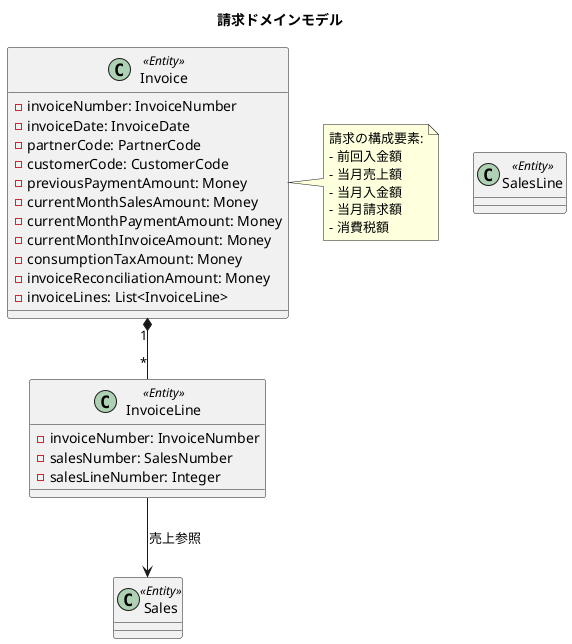
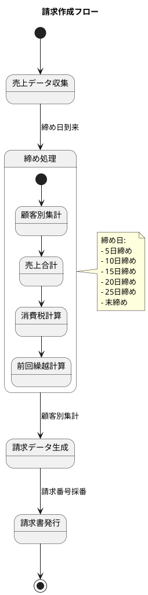
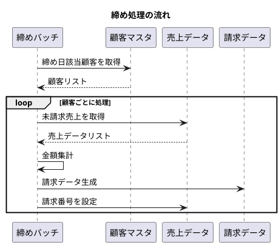
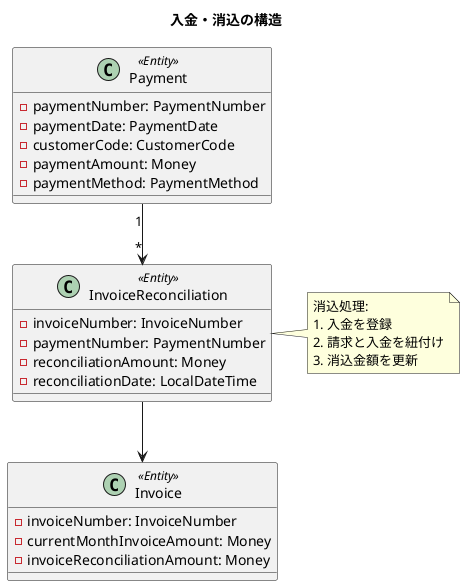
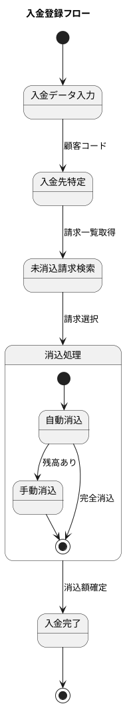
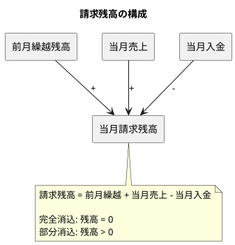
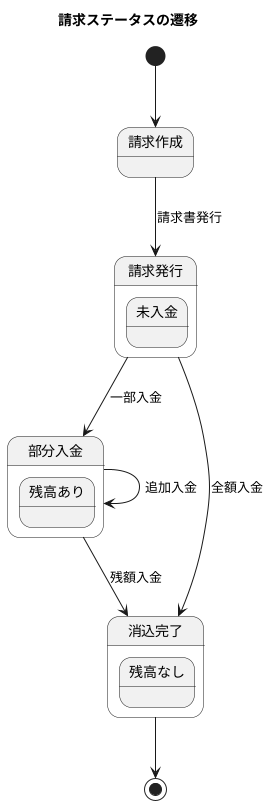

# 第15章: 請求・回収管理

## 15.1 請求データの生成

### 請求ドメインモデルの概要

請求は、売上データを集計して顧客に対する請求書を発行するプロセスを管理します。締め処理によって売上を集約し、請求データを生成します。



### 売上からの請求作成

請求は締め日に売上データを集計して生成されます。



### 請求エンティティの実装

```java
/**
 * 請求
 */
@Value
@RequiredArgsConstructor
@Builder(toBuilder = true)
public class Invoice {
    final InvoiceNumber invoiceNumber; // 請求番号
    final InvoiceDate invoiceDate; // 請求日
    final PartnerCode partnerCode; // 取引先コード
    final CustomerCode customerCode; // 顧客コード
    final Money previousPaymentAmount; // 前回入金額
    final Money currentMonthSalesAmount; // 当月売上額
    final Money currentMonthPaymentAmount; // 当月入金額
    final Money currentMonthInvoiceAmount; // 当月請求額
    final Money consumptionTaxAmount; // 消費税金額
    final Money invoiceReconciliationAmount; // 請求消込金額
    final List<InvoiceLine> invoiceLines; // 請求明細

    public static Invoice of(
            String invoiceNumber,
            LocalDateTime invoiceDate,
            String partnerCode,
            Integer customerBranchNumber,
            Integer previousPaymentAmount,
            Integer currentMonthSalesAmount,
            Integer currentMonthPaymentAmount,
            Integer currentMonthInvoiceAmount,
            Integer consumptionTaxAmount,
            Integer invoiceReconciliationAmount,
            List<InvoiceLine> invoiceLines) {
        return new Invoice(
            new InvoiceNumber(invoiceNumber),
            InvoiceDate.of(invoiceDate),
            PartnerCode.of(partnerCode),
            CustomerCode.of(partnerCode, customerBranchNumber),
            Money.of(previousPaymentAmount),
            Money.of(currentMonthSalesAmount),
            Money.of(currentMonthPaymentAmount),
            Money.of(currentMonthInvoiceAmount),
            Money.of(consumptionTaxAmount),
            Money.of(invoiceReconciliationAmount),
            invoiceLines != null ? invoiceLines : new ArrayList<>()
        );
    }

    /**
     * 請求明細を追加
     */
    public Invoice addInvoiceLine(InvoiceLine invoiceLine) {
        List<InvoiceLine> newInvoiceLines = new ArrayList<>(this.invoiceLines);
        newInvoiceLines.add(invoiceLine);
        return new Invoice(
            this.invoiceNumber,
            this.invoiceDate,
            this.partnerCode,
            this.customerCode,
            this.previousPaymentAmount,
            this.currentMonthSalesAmount,
            this.currentMonthPaymentAmount,
            this.currentMonthInvoiceAmount,
            this.consumptionTaxAmount,
            this.invoiceReconciliationAmount,
            newInvoiceLines
        );
    }
}
```

### 請求明細の実装

請求明細は、売上データへの参照を保持します。

```java
/**
 * 請求明細
 */
@Value
@RequiredArgsConstructor
@Builder(toBuilder = true)
public class InvoiceLine {
    final InvoiceNumber invoiceNumber; // 請求番号
    final SalesNumber salesNumber; // 売上番号
    final Integer salesLineNumber; // 売上行番号

    public static InvoiceLine of(
            String invoiceNumber,
            String salesNumber,
            Integer salesLineNumber) {
        return new InvoiceLine(
            InvoiceNumber.of(invoiceNumber),
            SalesNumber.of(salesNumber),
            salesLineNumber
        );
    }
}
```

### 請求番号の採番

請求番号は、受注番号と同様に自動採番されます。

```java
/**
 * 請求番号
 */
@Value
@RequiredArgsConstructor
public class InvoiceNumber {
    String value;

    public static InvoiceNumber of(String value) {
        if (value == null || value.isEmpty()) {
            throw new IllegalArgumentException("請求番号は必須です");
        }
        return new InvoiceNumber(value);
    }

    public static String generate(String code, LocalDateTime yearMonth,
                                  Integer autoNumber) {
        isTrue(code.equals(DocumentTypeCode.請求.getCode()),
               "請求番号は先頭が" + DocumentTypeCode.請求.getCode() +
               "で始まる必要があります");
        return code +
               yearMonth.format(DateTimeFormatter.ofPattern("yyMM")) +
               String.format("%04d", autoNumber);
    }
}
```

### 締め処理の設計

締め処理は、顧客の請求条件に基づいて実行されます。



---

## 15.2 入金管理

### 入金ドメインモデル

入金は、顧客からの支払いを記録し、請求との消込を行います。



### 入金登録の流れ



### 請求残高の計算



### 消込処理の実装

```java
/**
 * 消込処理サービス
 */
@Service
@RequiredArgsConstructor
public class ReconciliationService {
    private final InvoiceRepository invoiceRepository;
    private final PaymentRepository paymentRepository;

    /**
     * 自動消込処理
     * FIFO（先入先出）方式で古い請求から消込
     */
    public List<InvoiceReconciliation> autoReconcile(
            CustomerCode customerCode,
            Money paymentAmount) {

        // 未消込請求を請求日順に取得
        List<Invoice> unpaidInvoices = invoiceRepository
            .findUnpaidByCustomer(customerCode)
            .stream()
            .sorted(Comparator.comparing(
                i -> i.getInvoiceDate().getValue()))
            .collect(Collectors.toList());

        List<InvoiceReconciliation> reconciliations = new ArrayList<>();
        Money remainingAmount = paymentAmount;

        for (Invoice invoice : unpaidInvoices) {
            if (remainingAmount.isZero()) {
                break;
            }

            Money invoiceBalance = invoice.getCurrentMonthInvoiceAmount()
                .subtract(invoice.getInvoiceReconciliationAmount());

            Money reconcileAmount = remainingAmount.isGreaterThan(invoiceBalance)
                ? invoiceBalance
                : remainingAmount;

            reconciliations.add(new InvoiceReconciliation(
                invoice.getInvoiceNumber(),
                reconcileAmount,
                LocalDateTime.now()
            ));

            remainingAmount = remainingAmount.subtract(reconcileAmount);
        }

        return reconciliations;
    }
}
```

---

## 請求・入金の状態管理

### 請求ステータス



### 入金方法の定義

```java
/**
 * 入金方法
 */
public enum PaymentMethodType {
    銀行振込(1, "銀行口座への振込"),
    現金(2, "現金による支払い"),
    手形(3, "手形による支払い"),
    小切手(4, "小切手による支払い"),
    相殺(5, "債権債務の相殺"),
    その他(9, "その他の方法");

    private final int code;
    private final String description;

    PaymentMethodType(int code, String description) {
        this.code = code;
        this.description = description;
    }

    public static PaymentMethodType fromCode(int code) {
        for (PaymentMethodType type : values()) {
            if (type.code == code) {
                return type;
            }
        }
        throw new IllegalArgumentException("不正な入金方法: " + code);
    }
}
```

---

## TDD によるテスト

### 請求作成のテスト

```java
@DisplayName("請求")
class InvoiceTest {

    @Test
    @DisplayName("請求を作成できる")
    void shouldCreateInvoice() {
        Invoice invoice = Invoice.of(
            "IV24010001",
            LocalDateTime.of(2024, 1, 31, 0, 0),
            "001",
            1,
            10000,  // 前回入金額
            50000,  // 当月売上額
            0,      // 当月入金額
            60000,  // 当月請求額
            5000,   // 消費税額
            0,      // 請求消込金額
            List.of()
        );

        assertAll(
            () -> assertEquals("IV24010001", invoice.getInvoiceNumber().getValue()),
            () -> assertEquals("001", invoice.getPartnerCode().getValue()),
            () -> assertEquals(10000, invoice.getPreviousPaymentAmount().getAmount()),
            () -> assertEquals(50000, invoice.getCurrentMonthSalesAmount().getAmount()),
            () -> assertEquals(60000, invoice.getCurrentMonthInvoiceAmount().getAmount())
        );
    }

    @Test
    @DisplayName("請求明細を追加できる")
    void shouldAddInvoiceLine() {
        Invoice invoice = Invoice.of(
            "IV24010001",
            LocalDateTime.now(),
            "001", 1,
            0, 10000, 0, 10000, 1000, 0,
            List.of()
        );

        InvoiceLine line = InvoiceLine.of("IV24010001", "SL24010001", 1);
        Invoice updatedInvoice = invoice.addInvoiceLine(line);

        assertEquals(1, updatedInvoice.getInvoiceLines().size());
        assertEquals("SL24010001",
            updatedInvoice.getInvoiceLines().get(0).getSalesNumber().getValue());
    }
}
```

### 請求番号のテスト

```java
@Nested
@DisplayName("請求番号")
class InvoiceNumberTest {

    @Test
    @DisplayName("請求番号を生成できる")
    void shouldGenerateInvoiceNumber() {
        LocalDateTime yearMonth = LocalDateTime.of(2024, 1, 1, 0, 0);
        String invoiceNumber = InvoiceNumber.generate("IV", yearMonth, 1);

        assertEquals("IV24010001", invoiceNumber);
    }

    @Test
    @DisplayName("請求番号は必須")
    void shouldThrowExceptionWhenInvoiceNumberIsEmpty() {
        assertThrows(IllegalArgumentException.class,
            () -> InvoiceNumber.of(null));
        assertThrows(IllegalArgumentException.class,
            () -> InvoiceNumber.of(""));
    }
}
```

### 消込処理のテスト

```java
@Nested
@DisplayName("消込処理")
class ReconciliationTest {

    @Test
    @DisplayName("請求額と入金額が一致する場合は完全消込")
    void shouldFullyReconcileWhenAmountsMatch() {
        Invoice invoice = createInvoiceWithAmount(10000);
        Money paymentAmount = Money.of(10000);

        // 消込後の残高は0
        Money balance = invoice.getCurrentMonthInvoiceAmount()
            .subtract(paymentAmount);

        assertEquals(0, balance.getAmount());
    }

    @Test
    @DisplayName("入金額が請求額より少ない場合は部分消込")
    void shouldPartiallyReconcileWhenPaymentIsLess() {
        Invoice invoice = createInvoiceWithAmount(10000);
        Money paymentAmount = Money.of(5000);

        Money balance = invoice.getCurrentMonthInvoiceAmount()
            .subtract(paymentAmount);

        assertEquals(5000, balance.getAmount());
    }

    @Test
    @DisplayName("複数請求への自動消込（FIFO方式）")
    void shouldAutoReconcileMultipleInvoices() {
        // 請求1: 10,000円（古い）
        // 請求2: 20,000円（新しい）
        // 入金: 25,000円
        // 期待結果: 請求1は完全消込、請求2は15,000円消込

        List<Invoice> invoices = List.of(
            createInvoiceWithAmountAndDate(10000,
                LocalDateTime.of(2024, 1, 10, 0, 0)),
            createInvoiceWithAmountAndDate(20000,
                LocalDateTime.of(2024, 1, 20, 0, 0))
        );

        Money paymentAmount = Money.of(25000);
        Money remaining = paymentAmount;

        for (Invoice invoice : invoices) {
            Money reconcileAmount = remaining.isGreaterThan(
                invoice.getCurrentMonthInvoiceAmount())
                ? invoice.getCurrentMonthInvoiceAmount()
                : remaining;
            remaining = remaining.subtract(reconcileAmount);
        }

        assertEquals(5000, remaining.getAmount()); // 残り5,000円未消込
    }
}
```

---

## まとめ

本章では、請求・回収管理の実装について解説しました。

- **請求データの生成**: 売上からの請求作成、締め処理、請求番号の採番
- **入金管理**: 入金登録、FIFO方式による自動消込、残高管理

第4部「販売管理機能」では、受注から請求・回収までの一連の販売プロセスを実装しました。次の第5部では、調達管理機能として発注・仕入・支払の実装に進みます。
