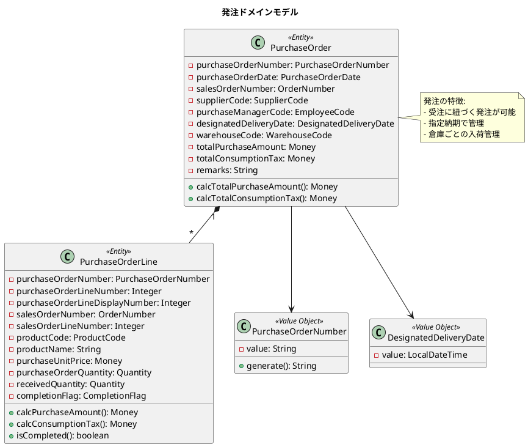
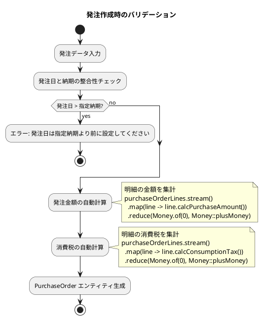
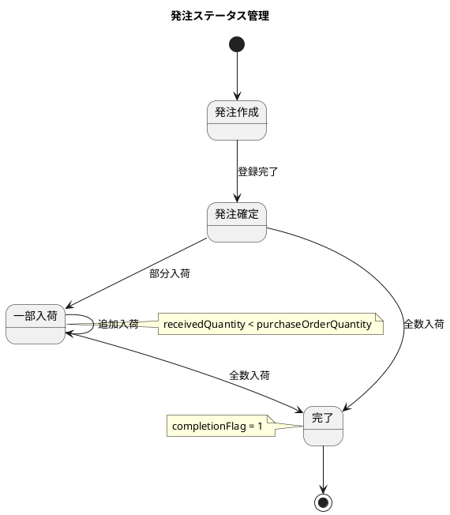
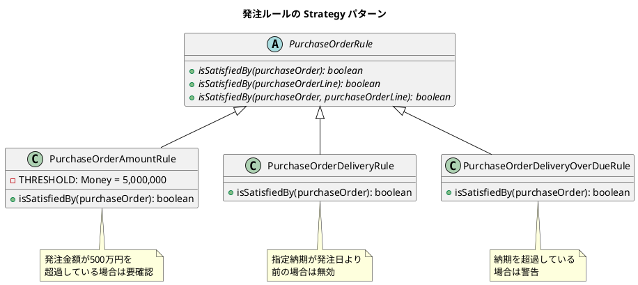
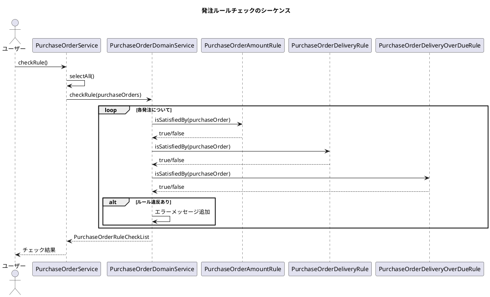
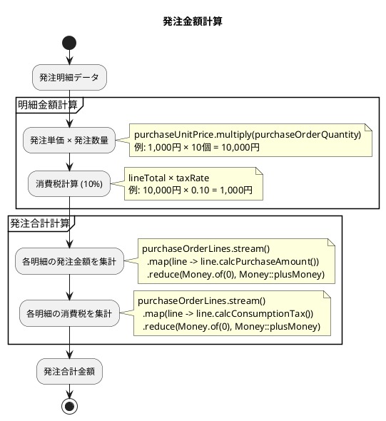
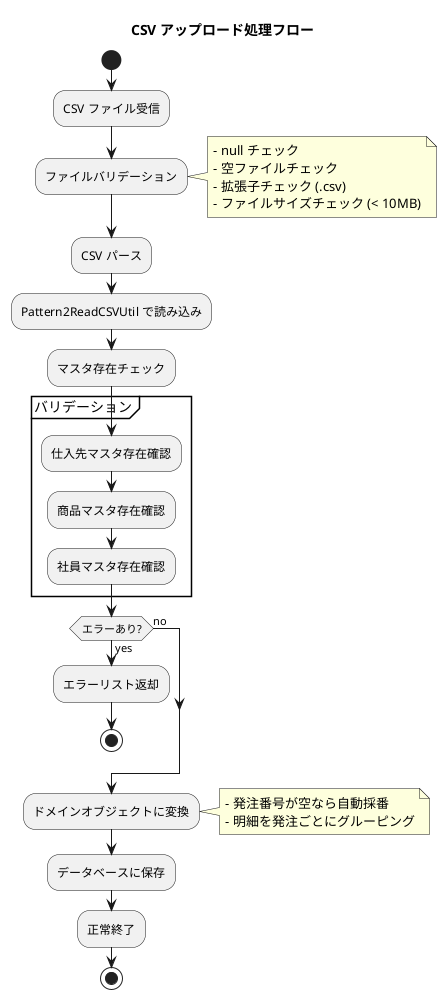
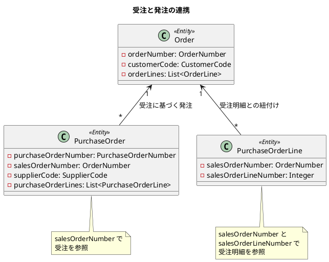
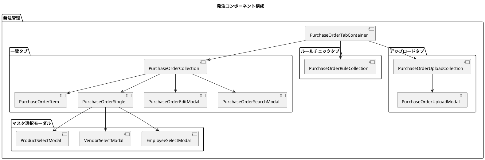
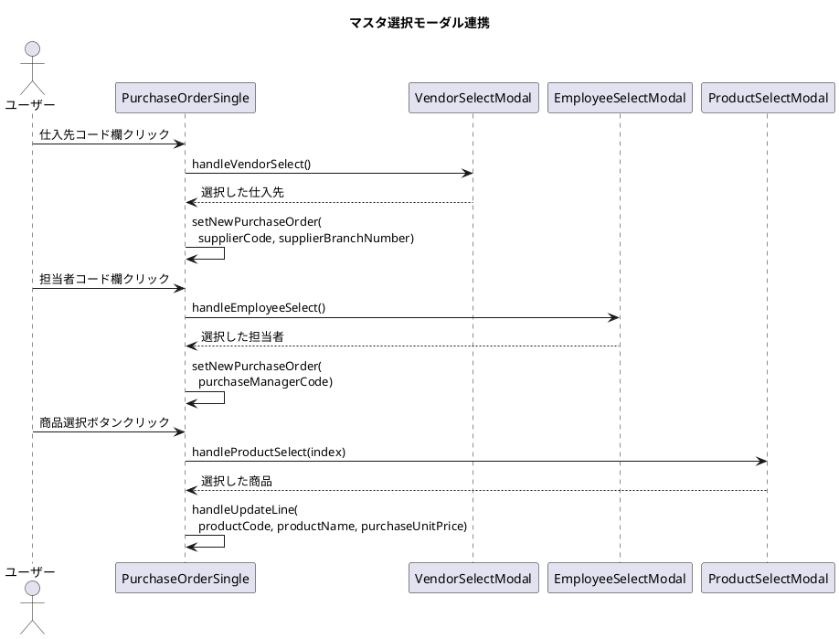

# 第16章: 発注管理

## 16.1 発注ワークフロー

### 発注ドメインモデルの概要

発注管理は、仕入先への商品発注を管理するシステムです。受注に基づく発注や、在庫補充のための発注を処理し、仕入先との取引を一元管理します。



### 発注エンティティの実装

発注エンティティは、仕入先への発注情報を管理し、金額の自動計算機能を持ちます。

```java
@Value
@AllArgsConstructor
@NoArgsConstructor(force = true)
@Builder(toBuilder = true)
public class PurchaseOrder {
    PurchaseOrderNumber purchaseOrderNumber; // 発注番号
    PurchaseOrderDate purchaseOrderDate; // 発注日
    OrderNumber salesOrderNumber; // 受注番号
    SupplierCode supplierCode; // 仕入先コード
    EmployeeCode purchaseManagerCode; // 発注担当者コード
    DesignatedDeliveryDate designatedDeliveryDate; // 指定納期
    WarehouseCode warehouseCode; // 倉庫コード
    Money totalPurchaseAmount; // 発注金額合計
    Money totalConsumptionTax; // 消費税合計
    String remarks; // 備考
    List<PurchaseOrderLine> purchaseOrderLines; // 発注明細
    Supplier supplier; // 仕入先
    Employee purchaseManager; // 発注担当者

    public static PurchaseOrder of(
            String purchaseOrderNumber,
            LocalDateTime purchaseOrderDate,
            String salesOrderNumber,
            String supplierCode,
            Integer supplierBranchNumber,
            String purchaseManagerCode,
            LocalDateTime designatedDeliveryDate,
            String warehouseCode,
            Integer totalPurchaseAmount,
            Integer totalConsumptionTax,
            String remarks,
            List<PurchaseOrderLine> purchaseOrderLines) {

        // バリデーション: 発注日は指定納期より前であること
        isTrue(!purchaseOrderDate.isAfter(designatedDeliveryDate),
               "発注日は指定納期より前に設定してください");

        // 金額を明細から自動計算
        Money calcTotalPurchaseAmount = purchaseOrderLines.stream()
                .map(PurchaseOrderLine::calcPurchaseAmount)
                .reduce(Money.of(0), Money::plusMoney);

        Money calcTotalConsumptionTax = purchaseOrderLines.stream()
                .map(PurchaseOrderLine::calcConsumptionTax)
                .reduce(Money.of(0), Money::plusMoney);

        return PurchaseOrder.builder()
                .purchaseOrderNumber(PurchaseOrderNumber.of(purchaseOrderNumber))
                .purchaseOrderDate(PurchaseOrderDate.of(purchaseOrderDate))
                .salesOrderNumber(OrderNumber.of(salesOrderNumber))
                .supplierCode(SupplierCode.of(supplierCode, supplierBranchNumber))
                .purchaseManagerCode(EmployeeCode.of(purchaseManagerCode))
                .designatedDeliveryDate(DesignatedDeliveryDate.of(designatedDeliveryDate))
                .warehouseCode(WarehouseCode.of(warehouseCode))
                .totalPurchaseAmount(calcTotalPurchaseAmount)
                .totalConsumptionTax(calcTotalConsumptionTax)
                .remarks(remarks)
                .purchaseOrderLines(purchaseOrderLines)
                .build();
    }
}
```

### ファクトリメソッドでのバリデーション

発注エンティティのファクトリメソッドでは、ドメインルールに従ったバリデーションを実行します。



### 発注番号の採番

発注番号は、伝票種別コード、年月、連番を組み合わせて生成されます。

```java
@Value(staticConstructor = "of")
public class PurchaseOrderNumber {
    String value;

    private PurchaseOrderNumber(String value) {
        notBlank(value, "発注番号が入力されていません");
        this.value = value;
    }

    /**
     * 発注番号生成
     * 形式: PO + YYMM + 連番4桁 (例: PO25010001)
     */
    public static String generate(String code, LocalDateTime yearMonth, Integer autoNumber) {
        isTrue(code.equals(DocumentTypeCode.発注.getCode()),
               "発注番号は先頭が" + DocumentTypeCode.発注.getCode() + "で始まる必要があります");
        return code + yearMonth.format(DateTimeFormatter.ofPattern("yyMM"))
               + String.format("%04d", autoNumber);
    }
}
```

### 発注ステータス管理

発注の状態は、発注明細の完了フラグで管理します。すべての明細が完了すると発注全体が完了となります。



## 16.2 ドメインイベントパターン

### Strategy パターンによるルール実装

発注ルールは、Strategy パターンを使って実装されています。これにより、新しいルールの追加が容易になります。

```java
/**
 * 発注ルール（抽象基底クラス）
 */
public abstract class PurchaseOrderRule {
    public abstract boolean isSatisfiedBy(PurchaseOrder purchaseOrder);
    public abstract boolean isSatisfiedBy(PurchaseOrderLine purchaseOrderLine);
    public abstract boolean isSatisfiedBy(PurchaseOrder purchaseOrder, PurchaseOrderLine purchaseOrderLine);
}
```



### 発注金額ルールの実装

発注金額が一定額を超える場合に確認が必要となるルールを実装します。

```java
/**
 * 発注金額ルール
 * 発注金額が500万円を超過している場合は要確認とする
 */
public class PurchaseOrderAmountRule extends PurchaseOrderRule {
    private static final Money THRESHOLD = Money.of(5000000);

    @Override
    public boolean isSatisfiedBy(PurchaseOrder purchaseOrder) {
        return purchaseOrder.getTotalPurchaseAmount().isGreaterThan(THRESHOLD);
    }

    @Override
    public boolean isSatisfiedBy(PurchaseOrderLine purchaseOrderLine) {
        return false;
    }

    @Override
    public boolean isSatisfiedBy(PurchaseOrder purchaseOrder, PurchaseOrderLine purchaseOrderLine) {
        return false;
    }
}
```

### 納期ルールの実装

納期に関するルールを実装します。

```java
/**
 * 発注納期ルール
 * 指定納期が発注日より前の場合は無効とする
 */
public class PurchaseOrderDeliveryRule extends PurchaseOrderRule {

    @Override
    public boolean isSatisfiedBy(PurchaseOrder purchaseOrder) {
        return purchaseOrder.getDesignatedDeliveryDate().getValue()
                .isBefore(purchaseOrder.getPurchaseOrderDate().getValue());
    }

    @Override
    public boolean isSatisfiedBy(PurchaseOrderLine purchaseOrderLine) {
        return false;
    }

    @Override
    public boolean isSatisfiedBy(PurchaseOrder purchaseOrder, PurchaseOrderLine purchaseOrderLine) {
        return false;
    }
}
```

### ドメインサービスでのルールチェック

ドメインサービスは、複数のルールを適用してチェック結果を返します。

```java
@Service
public class PurchaseOrderDomainService {

    /**
     * 発注ルールチェック
     */
    public PurchaseOrderRuleCheckList checkRule(PurchaseOrderList purchaseOrders) {
        List<Map<String, String>> checkList = new ArrayList<>();

        List<PurchaseOrder> orderList = purchaseOrders.asList();
        PurchaseOrderRule purchaseOrderAmountRule = new PurchaseOrderAmountRule();
        PurchaseOrderRule purchaseOrderDeliveryRule = new PurchaseOrderDeliveryRule();
        PurchaseOrderRule purchaseOrderDeliveryOverDueRule = new PurchaseOrderDeliveryOverDueRule();

        BiConsumer<String, String> addCheck = (purchaseOrderNumber, message) -> {
            Map<String, String> errorMap = new HashMap<>();
            errorMap.put(purchaseOrderNumber, message);
            checkList.add(errorMap);
        };

        orderList.forEach(purchaseOrder -> {
            // 発注金額ルールチェック
            if (purchaseOrderAmountRule.isSatisfiedBy(purchaseOrder)) {
                addCheck.accept(purchaseOrder.getPurchaseOrderNumber().getValue(),
                               "発注金額が500万円を超えています。");
            }

            // 発注納期ルールチェック
            if (purchaseOrderDeliveryRule.isSatisfiedBy(purchaseOrder)) {
                addCheck.accept(purchaseOrder.getPurchaseOrderNumber().getValue(),
                               "指定納期が発注日より前です。");
            }

            // 発注納期超過ルールチェック
            if (purchaseOrderDeliveryOverDueRule.isSatisfiedBy(purchaseOrder)) {
                addCheck.accept(purchaseOrder.getPurchaseOrderNumber().getValue(),
                               "納期を超過しています。");
            }
        });

        return new PurchaseOrderRuleCheckList(checkList);
    }
}
```



### ルールチェック結果の管理

ルールチェック結果は、専用のリストクラスで管理します。

```java
@Value
public class PurchaseOrderRuleCheckList {
    List<Map<String, String>> checkList;

    /**
     * エラーが存在するかチェック
     */
    public boolean hasErrors() {
        return checkList != null && !checkList.isEmpty();
    }

    /**
     * エラー件数を取得
     */
    public int getErrorCount() {
        return checkList != null ? checkList.size() : 0;
    }
}
```

## 16.3 発注明細の管理

### 発注明細エンティティ

発注明細は、発注する商品の詳細情報を管理します。

```java
@Value
@AllArgsConstructor
@NoArgsConstructor(force = true)
@Builder(toBuilder = true)
public class PurchaseOrderLine {
    PurchaseOrderNumber purchaseOrderNumber; // 発注番号
    Integer purchaseOrderLineNumber; // 発注行番号
    Integer purchaseOrderLineDisplayNumber; // 発注行表示番号
    OrderNumber salesOrderNumber; // 受注番号
    Integer salesOrderLineNumber; // 受注行番号
    ProductCode productCode; // 商品コード
    String productName; // 商品名
    Money purchaseUnitPrice; // 発注単価
    Quantity purchaseOrderQuantity; // 発注数量
    Quantity receivedQuantity; // 入荷数量
    CompletionFlag completionFlag; // 完了フラグ
    LocalDateTime createdDateTime; // 作成日時
    String createdBy; // 作成者名
    LocalDateTime updatedDateTime; // 更新日時
    String updatedBy; // 更新者名
    Integer version; // バージョン
    Product product; // 商品

    public static PurchaseOrderLine of(
            String purchaseOrderNumber,
            Integer purchaseOrderLineNumber,
            Integer purchaseOrderLineDisplayNumber,
            String salesOrderNumber,
            Integer salesOrderLineNumber,
            String productCode,
            String productName,
            Integer purchaseUnitPrice,
            Integer purchaseOrderQuantity,
            Integer receivedQuantity,
            Integer completionFlag) {

        return PurchaseOrderLine.builder()
                .purchaseOrderNumber(PurchaseOrderNumber.of(purchaseOrderNumber))
                .purchaseOrderLineNumber(purchaseOrderLineNumber)
                .purchaseOrderLineDisplayNumber(purchaseOrderLineDisplayNumber)
                .salesOrderNumber(OrderNumber.of(salesOrderNumber))
                .salesOrderLineNumber(salesOrderLineNumber)
                .productCode(ProductCode.of(productCode))
                .productName(productName)
                .purchaseUnitPrice(Money.of(purchaseUnitPrice))
                .purchaseOrderQuantity(Quantity.of(purchaseOrderQuantity))
                .receivedQuantity(Quantity.of(receivedQuantity))
                .completionFlag(CompletionFlag.of(completionFlag))
                .build();
    }

    /**
     * 発注金額計算（消費税抜き）
     */
    public Money calcPurchaseAmount() {
        return purchaseUnitPrice.multiply(purchaseOrderQuantity);
    }

    /**
     * 消費税計算
     */
    public Money calcConsumptionTax() {
        double taxRate = 0.10;
        int lineTotal = purchaseUnitPrice.getAmount() * purchaseOrderQuantity.getAmount();
        return Money.of((int) (lineTotal * taxRate));
    }

    /**
     * 完了しているかどうか
     */
    public boolean isCompleted() {
        return completionFlag.isCompleted();
    }
}
```

### 金額計算ロジック

発注明細の金額計算は、単価と数量から自動的に行われます。



### 発注サービスの実装

発注サービスは、発注の CRUD 操作と関連するビジネスロジックを提供します。

```java
@Service
@Transactional
@Slf4j
public class PurchaseOrderService {
    private final PurchaseOrderRepository purchaseOrderRepository;
    private final AutoNumberService autoNumberService;
    private final PurchaseOrderDomainService purchaseOrderDomainService;
    private final PartnerRepository partnerRepository;
    private final ProductRepository productRepository;
    private final EmployeeRepository employeeRepository;

    /**
     * 発注新規登録
     */
    public void register(PurchaseOrder purchaseOrder) {
        notNull(purchaseOrder, "発注データは必須です。");

        if (purchaseOrder.getPurchaseOrderNumber() == null ||
            purchaseOrder.getPurchaseOrderNumber().getValue().isEmpty()) {
            String purchaseOrderNumber = generatePurchaseOrderNumber(purchaseOrder);

            // 金額を自動計算
            Money totalPurchaseAmount =
                purchaseOrderDomainService.calculateTotalPurchaseAmount(purchaseOrder);
            Money totalConsumptionTax =
                purchaseOrderDomainService.calculateTotalConsumptionTax(purchaseOrder);

            purchaseOrder = PurchaseOrder.of(
                    purchaseOrderNumber,
                    Objects.requireNonNull(purchaseOrder.getPurchaseOrderDate().getValue()),
                    purchaseOrder.getSalesOrderNumber().getValue(),
                    Objects.requireNonNull(purchaseOrder.getSupplierCode().getValue()),
                    purchaseOrder.getSupplierCode().getBranchNumber(),
                    Objects.requireNonNull(purchaseOrder.getPurchaseManagerCode().getValue()),
                    Objects.requireNonNull(purchaseOrder.getDesignatedDeliveryDate().getValue()),
                    purchaseOrder.getWarehouseCode().getValue(),
                    totalPurchaseAmount.getAmount(),
                    totalConsumptionTax.getAmount(),
                    purchaseOrder.getRemarks(),
                    Objects.requireNonNull(purchaseOrder.getPurchaseOrderLines())
            );
        }
        purchaseOrderRepository.save(purchaseOrder);
    }

    /**
     * 発注番号生成
     */
    private String generatePurchaseOrderNumber(PurchaseOrder purchaseOrder) {
        String code = DocumentTypeCode.発注.getCode();
        LocalDateTime purchaseOrderDate =
            Objects.requireNonNull(purchaseOrder.getPurchaseOrderDate().getValue());
        LocalDateTime yearMonth = YearMonth.of(
            purchaseOrderDate.getYear(),
            purchaseOrderDate.getMonth()
        ).atDay(1).atStartOfDay();

        Integer autoNumber = autoNumberService.getNextDocumentNumber(code, yearMonth);
        String purchaseOrderNumber = PurchaseOrderNumber.generate(code, yearMonth, autoNumber);

        autoNumberService.save(AutoNumber.of(code, yearMonth, autoNumber));
        autoNumberService.incrementDocumentNumber(code, yearMonth);

        return purchaseOrderNumber;
    }
}
```

### リポジトリインターフェース

発注リポジトリは、発注データの永続化と取得を担当します。

```java
public interface PurchaseOrderRepository {

    PurchaseOrderList selectAll();

    PurchaseOrder save(PurchaseOrder purchaseOrder);

    Optional<PurchaseOrder> findByPurchaseOrderNumber(String purchaseOrderNumber);

    PageInfo<PurchaseOrder> selectAllWithPageInfo();

    PageInfo<PurchaseOrder> searchWithPageInfo(PurchaseOrderCriteria criteria);

    void delete(String purchaseOrderNumber);

    PurchaseOrderList findByCompletionFlag(CompletionFlag completionFlag);

    void deleteAll();
}
```

### 発注サービスのテスト

発注サービスのテストでは、TDD アプローチに従い、各機能のテストを実装します。

```java
@ExtendWith(MockitoExtension.class)
@DisplayName("発注サービステスト")
class PurchaseOrderServiceTest {

    @Mock
    private PurchaseOrderRepository purchaseOrderRepository;

    @Mock
    private AutoNumberService autoNumberService;

    @Mock
    private PurchaseOrderDomainService purchaseOrderDomainService;

    private PurchaseOrderService purchaseOrderService;

    @BeforeEach
    void setUp() {
        purchaseOrderService = new PurchaseOrderService(
            purchaseOrderRepository,
            autoNumberService,
            purchaseOrderDomainService,
            partnerRepository,
            productRepository,
            employeeRepository
        );
    }

    @Nested
    @DisplayName("発注新規登録")
    class RegisterTest {

        @Test
        @DisplayName("発注番号なしで新規登録できる")
        void shouldRegisterNewPurchaseOrderWithoutNumber() {
            // Arrange
            PurchaseOrder purchaseOrder = createTestPurchaseOrderWithoutNumber();

            when(autoNumberService.getNextDocumentNumber(anyString(), any(LocalDateTime.class)))
                .thenReturn(1);
            when(purchaseOrderDomainService.calculateTotalPurchaseAmount(any()))
                .thenReturn(Money.of(10000));
            when(purchaseOrderDomainService.calculateTotalConsumptionTax(any()))
                .thenReturn(Money.of(1000));

            // Act
            purchaseOrderService.register(purchaseOrder);

            // Assert
            verify(autoNumberService).getNextDocumentNumber(eq("PO"), any(LocalDateTime.class));
            verify(autoNumberService).save(any());
            verify(autoNumberService).incrementDocumentNumber(eq("PO"), any(LocalDateTime.class));
            verify(purchaseOrderRepository).save(any(PurchaseOrder.class));
        }
    }

    @Nested
    @DisplayName("発注ルールチェック")
    class RuleCheckTest {

        @Test
        @DisplayName("発注金額が500万円を超える場合にエラーを返す")
        void shouldReturnErrorWhenPurchaseAmountExceeds5Million() {
            // Arrange
            LocalDateTime now = LocalDateTime.now();
            PurchaseOrder purchaseOrder = PurchaseOrder.builder()
                    .purchaseOrderNumber(PurchaseOrderNumber.of("PO202301010001"))
                    .purchaseOrderDate(PurchaseOrderDate.of(now))
                    .designatedDeliveryDate(DesignatedDeliveryDate.of(now.plusDays(30)))
                    .totalPurchaseAmount(Money.of(6000000)) // 600万円
                    .purchaseOrderLines(List.of())
                    .build();

            PurchaseOrderList purchaseOrders = PurchaseOrderList.of(List.of(purchaseOrder));

            PurchaseOrderRuleCheckList expectedCheckList = new PurchaseOrderRuleCheckList(List.of(
                Map.of("PO202301010001", "発注金額が500万円を超えています。")
            ));

            when(purchaseOrderRepository.selectAll()).thenReturn(purchaseOrders);
            when(purchaseOrderDomainService.checkRule(purchaseOrders))
                .thenReturn(expectedCheckList);

            // Act
            PurchaseOrderRuleCheckList result = purchaseOrderService.checkRule();

            // Assert
            assertTrue(result.hasErrors(), "金額超過のエラーが発生すること");
            assertTrue(result.getErrorCount() >= 1, "少なくとも1つのエラーがあること");
        }
    }
}
```

### CSVファイルアップロード

発注データは CSV ファイルからの一括登録が可能です。

```java
/**
 * CSVファイルアップロード
 */
public PurchaseOrderUploadErrorList uploadCsvFile(MultipartFile file) {
    notNull(file, "アップロードファイルは必須です。");
    isTrue(!file.isEmpty(), "アップロードファイルが空です。");
    String originalFilename = Optional.ofNullable(file.getOriginalFilename())
            .orElseThrow(() -> new IllegalArgumentException("アップロードファイル名は必須です。"));
    isTrue(originalFilename.endsWith(".csv"), "アップロードファイルがCSVではありません。");
    isTrue(file.getSize() < 10000000, "アップロードファイルが大きすぎます。");

    Pattern2ReadCSVUtil<PurchaseOrderUploadCSV> csvUtil = new Pattern2ReadCSVUtil<>();
    List<PurchaseOrderUploadCSV> dataList =
        csvUtil.readCSV(PurchaseOrderUploadCSV.class, file, "Windows-31J");
    isTrue(!dataList.isEmpty(), "CSVファイルの読み込みに失敗しました");

    // マスタデータの存在チェック
    PurchaseOrderUploadErrorList errorList = validateErrors(dataList);
    if (!errorList.isEmpty()) return errorList;

    // CSV データをドメインオブジェクトに変換して保存
    PurchaseOrderList purchaseOrderList = convert(dataList);
    purchaseOrderList.asList().forEach(purchaseOrderRepository::save);

    return errorList;
}
```



### 受注との連携

発注は受注に紐づけることができます。これにより、受注に基づく発注の追跡が可能になります。



## 16.4 React コンポーネントの実装

### 発注画面のコンポーネント構成

発注管理のフロントエンド実装は、React を使用してコンポーネントベースで構築されています。



### 発注一覧画面の実装

発注一覧画面は、発注データの検索、表示、一括操作機能を提供します。

```typescript
interface PurchaseOrderItemProps {
    purchaseOrder: PurchaseOrderType;
    onEdit: (purchaseOrder: PurchaseOrderType) => void;
    onDelete: (purchaseOrderNumber: string) => void;
    onCheck: (purchaseOrder: PurchaseOrderType) => void;
}

const PurchaseOrderItem: React.FC<PurchaseOrderItemProps> = ({
    purchaseOrder, onEdit, onDelete, onCheck
}) => (
    <li className="collection-object-item" key={purchaseOrder.purchaseOrderNumber}>
        <div className="collection-object-item-content">
            <input
                type="checkbox"
                checked={purchaseOrder.checked}
                onChange={() => onCheck(purchaseOrder)}
            />
        </div>
        <div className="collection-object-item-content">
            <div className="collection-object-item-content-details">発注番号</div>
            <div className="collection-object-item-content-name">
                {purchaseOrder.purchaseOrderNumber}
            </div>
        </div>
        <div className="collection-object-item-content">
            <div className="collection-object-item-content-details">発注日</div>
            <div className="collection-object-item-content-name">
                {purchaseOrder.purchaseOrderDate.split("T")[0]}
            </div>
        </div>
        <div className="collection-object-item-content">
            <div className="collection-object-item-content-details">仕入先コード</div>
            <div className="collection-object-item-content-name">
                {purchaseOrder.supplierCode}
            </div>
        </div>
        <div className="collection-object-item-content">
            <div className="collection-object-item-content-details">発注金額合計</div>
            <div className="collection-object-item-content-name">
                {purchaseOrder.totalPurchaseAmount.toLocaleString()}
            </div>
        </div>
        <div className="collection-object-item-actions">
            <button onClick={() => onEdit(purchaseOrder)}>編集</button>
        </div>
        <div className="collection-object-item-actions">
            <button onClick={() => onDelete(purchaseOrder.purchaseOrderNumber)}>削除</button>
        </div>
    </li>
);
```

### 発注明細の動的追加・削除

発注詳細フォームでは、明細行を動的に追加・削除できます。金額は自動計算されます。

```typescript
// 金額計算関数
const calculateLineAmount = (line: PurchaseOrderLineType): number => {
    return line.purchaseOrderQuantity * line.purchaseUnitPrice;
};

const calculateLineTax = (line: PurchaseOrderLineType): number => {
    const amount = calculateLineAmount(line);
    return Math.floor(amount * 0.1); // 消費税 10%
};

const calculateTotalAmount = (lines: PurchaseOrderLineType[]): number => {
    return lines.reduce((sum, line) => sum + calculateLineAmount(line), 0);
};

const calculateTotalTax = (lines: PurchaseOrderLineType[]): number => {
    return lines.reduce((sum, line) => sum + calculateLineTax(line), 0);
};

// 明細更新処理
const handleUpdateLine = (index: number, line: PurchaseOrderLineType) => {
    const newLines = [...newPurchaseOrder.purchaseOrderLines];
    newLines[index] = {
        ...line,
        purchaseOrderNumber: newPurchaseOrder.purchaseOrderNumber
    };

    // 合計金額の再計算
    const totalAmount = calculateTotalAmount(newLines);
    const totalTax = calculateTotalTax(newLines);

    setNewPurchaseOrder({
        ...newPurchaseOrder,
        purchaseOrderLines: newLines,
        totalPurchaseAmount: totalAmount,
        totalConsumptionTax: totalTax
    });
};

// 明細削除処理
const handleDeleteLine = (index: number) => {
    const newLines = newPurchaseOrder.purchaseOrderLines
        .filter((_, i) => i !== index)
        .map((line, i) => ({ ...line, purchaseOrderLineNumber: i + 1 }));

    const totalAmount = calculateTotalAmount(newLines);
    const totalTax = calculateTotalTax(newLines);

    setNewPurchaseOrder({
        ...newPurchaseOrder,
        purchaseOrderLines: newLines,
        totalPurchaseAmount: totalAmount,
        totalConsumptionTax: totalTax
    });
};

// 明細追加処理
const handleAddLine = () => {
    const newLine: PurchaseOrderLineType = {
        purchaseOrderNumber: newPurchaseOrder.purchaseOrderNumber,
        purchaseOrderLineNumber: newPurchaseOrder.purchaseOrderLines.length + 1,
        purchaseOrderLineDisplayNumber: newPurchaseOrder.purchaseOrderLines.length + 1,
        salesOrderNumber: '',
        salesOrderLineNumber: 0,
        productCode: '',
        productName: '',
        purchaseUnitPrice: 0,
        purchaseOrderQuantity: 0,
        receivedQuantity: 0,
        completionFlag: CompletionFlagEnumType.未完了
    };
    setNewPurchaseOrder({
        ...newPurchaseOrder,
        purchaseOrderLines: [...newPurchaseOrder.purchaseOrderLines, newLine]
    });
};
```

### 発注明細テーブルの実装

発注明細はテーブル形式で表示され、インライン編集が可能です。

```typescript
<div className="single-view-content-item-form-lines purchase-order-detail">
    <h3>
        発注明細
        <button className="add-line-button" onClick={handleAddLine}>
            <span>＋</span> 明細追加
        </button>
    </h3>
    <div className="table-container">
        <table className="purchase-order-lines-table">
            <thead>
                <tr>
                    <th>発注行番号</th>
                    <th>受注番号</th>
                    <th>商品コード</th>
                    <th>商品名</th>
                    <th>発注単価</th>
                    <th>発注数量</th>
                    <th>入荷数量</th>
                    <th>完了フラグ</th>
                    <th>操作</th>
                </tr>
            </thead>
            <tbody>
                {newPurchaseOrder.purchaseOrderLines.map((line, index) => (
                    <tr key={index}>
                        <td>
                            <input
                                type="number"
                                value={line.purchaseOrderLineNumber}
                                disabled={true}
                            />
                        </td>
                        <td>
                            <input
                                type="text"
                                value={line.salesOrderNumber}
                                onChange={(e) => handleUpdateLine(index, {
                                    ...line,
                                    salesOrderNumber: e.target.value
                                })}
                            />
                        </td>
                        <td>
                            <div style={{ display: 'flex', alignItems: 'center' }}>
                                <input
                                    type="text"
                                    value={line.productCode}
                                    onChange={(e) => handleUpdateLine(index, {
                                        ...line,
                                        productCode: e.target.value
                                    })}
                                />
                                <button onClick={() => handleProductSelectEvent(index)}>
                                    選択
                                </button>
                            </div>
                        </td>
                        <td>
                            <input
                                type="text"
                                value={line.productName}
                                onChange={(e) => handleUpdateLine(index, {
                                    ...line,
                                    productName: e.target.value
                                })}
                            />
                        </td>
                        <td>
                            <input
                                type="number"
                                value={line.purchaseUnitPrice}
                                onChange={(e) => handleUpdateLine(index, {
                                    ...line,
                                    purchaseUnitPrice: Number(e.target.value)
                                })}
                            />
                        </td>
                        <td>
                            <input
                                type="number"
                                value={line.purchaseOrderQuantity}
                                onChange={(e) => handleUpdateLine(index, {
                                    ...line,
                                    purchaseOrderQuantity: Number(e.target.value)
                                })}
                            />
                        </td>
                        <td>
                            <input
                                type="number"
                                value={line.receivedQuantity}
                                onChange={(e) => handleUpdateLine(index, {
                                    ...line,
                                    receivedQuantity: Number(e.target.value)
                                })}
                            />
                        </td>
                        <td>
                            <select
                                value={line.completionFlag}
                                onChange={(e) => handleUpdateLine(index, {
                                    ...line,
                                    completionFlag: e.target.value as CompletionFlagEnumType
                                })}
                            >
                                <option value={CompletionFlagEnumType.完了}>完了</option>
                                <option value={CompletionFlagEnumType.未完了}>未完了</option>
                            </select>
                        </td>
                        <td>
                            <button onClick={() => handleDeleteLine(index)}>
                                削除
                            </button>
                        </td>
                    </tr>
                ))}
            </tbody>
            <tfoot>
                <tr>
                    <td colSpan={4} className="total-label">小計</td>
                    <td className="total-amount">
                        {(newPurchaseOrder.totalPurchaseAmount || 0).toLocaleString()}
                    </td>
                </tr>
                <tr>
                    <td colSpan={4} className="total-label">消費税</td>
                    <td className="total-amount">
                        {(newPurchaseOrder.totalConsumptionTax || 0).toLocaleString()}
                    </td>
                </tr>
                <tr>
                    <td colSpan={4} className="total-label">合計金額</td>
                    <td className="total-amount">
                        {((newPurchaseOrder.totalPurchaseAmount || 0) +
                          (newPurchaseOrder.totalConsumptionTax || 0)).toLocaleString()}
                    </td>
                </tr>
            </tfoot>
        </table>
    </div>
</div>
```

### ルールチェック画面の実装

ルールチェック画面は、発注ルールの違反を検出して表示します。

```typescript
interface PurchaseOrderRuleCollectionViewProps {
    ruleHeaderItems: {
        handleExecuteRuleCheck: () => void;
    };
    ruleResults: RuleCheckResultType[];
    handleDeleteRuleResult: (index: number) => void;
}

export const PurchaseOrderRuleCollectionView: React.FC<PurchaseOrderRuleCollectionViewProps> = ({
    ruleHeaderItems: { handleExecuteRuleCheck },
    ruleResults,
    handleDeleteRuleResult,
}) => {
    return (
        <div className="collection-view-object-container">
            <div className="collection-view-container">
                <div className="collection-view-header">
                    <h1 className="single-view-title">発注ルールチェック</h1>
                </div>
                <div className="collection-view-content">
                    <div className="button-container">
                        <button onClick={handleExecuteRuleCheck}>実行</button>
                    </div>
                    <div className="collection-object-container">
                        <ul className="collection-object-list">
                            {ruleResults.map((result, index) => (
                                <div key={index} className="upload-result-item">
                                    <div className="upload-result-message">
                                        <Message error={null} message={result.message}/>
                                        {result.details && result.details.length > 0 && (
                                            <div className="upload-result-details">
                                                {result.details.map((detail, detailIndex) => (
                                                    <div key={detailIndex} className="upload-result-detail">
                                                        {Object.entries(detail).map(([key, value]) => (
                                                            <div key={key} className="detail-item">
                                                                <span className="detail-key">{key}:</span>
                                                                <span className="detail-value">{value}</span>
                                                            </div>
                                                        ))}
                                                    </div>
                                                ))}
                                            </div>
                                        )}
                                    </div>
                                    <button onClick={() => handleDeleteRuleResult(index)}>x</button>
                                </div>
                            ))}
                        </ul>
                    </div>
                </div>
            </div>
        </div>
    );
};
```

### マスタ選択モーダルの連携

発注画面では、仕入先、担当者、商品をモーダルから選択できます。



### 型定義

発注管理で使用する TypeScript の型定義を示します。

```typescript
export enum CompletionFlagEnumType {
    未完了 = "未完了",
    完了 = "完了"
}

export type PurchaseOrderLineType = {
    purchaseOrderNumber: string;
    purchaseOrderLineNumber: number;
    purchaseOrderLineDisplayNumber: number;
    salesOrderNumber?: string;
    salesOrderLineNumber?: number;
    productCode: string;
    productName?: string;
    purchaseUnitPrice: number;
    purchaseOrderQuantity: number;
    receivedQuantity: number;
    completionFlag: CompletionFlagEnumType;
    checked?: boolean;
};

export type PurchaseOrderType = {
    purchaseOrderNumber: string;
    purchaseOrderDate: string;
    salesOrderNumber?: string;
    supplierCode: string;
    supplierName?: string;
    supplierBranchNumber: number;
    purchaseManagerCode: string;
    purchaseManagerName?: string;
    designatedDeliveryDate: string;
    warehouseCode?: string;
    totalPurchaseAmount: number;
    totalConsumptionTax: number;
    remarks?: string;
    purchaseOrderLines: PurchaseOrderLineType[];
    checked?: boolean;
};

export type PurchaseOrderCriteriaType = {
    purchaseOrderNumber?: string;
    purchaseOrderDate?: string;
    salesOrderNumber?: string;
    supplierCode?: string;
    supplierName?: string;
    purchaseManagerCode?: string;
    designatedDeliveryDate?: string;
    warehouseCode?: string;
    completionFlag?: boolean;
};
```

## まとめ

この章では、発注管理の実装について解説しました。

**重要なポイント:**

1. **発注ドメインモデル**: 発注エンティティは、仕入先への発注情報を管理し、明細から金額を自動計算します。

2. **Strategy パターン**: 発注ルールは Strategy パターンで実装され、新しいルールの追加が容易です。金額超過ルール、納期ルールなど、複数のルールを適用できます。

3. **発注番号の自動採番**: 伝票種別コード + 年月 + 連番の形式で、一意な発注番号を生成します。

4. **受注との連携**: 発注は受注に紐づけることができ、受注に基づく発注の追跡が可能です。

5. **CSV アップロード**: 大量の発注データを一括登録でき、マスタデータの存在チェックを自動で行います。

次の章では、仕入・支払管理について解説します。発注に基づく仕入確認と、支払管理のワークフローを学びます。
