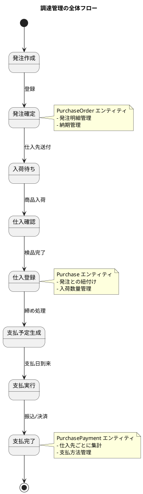
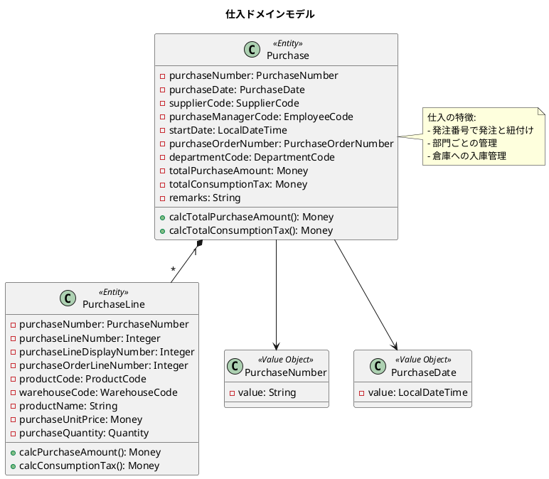
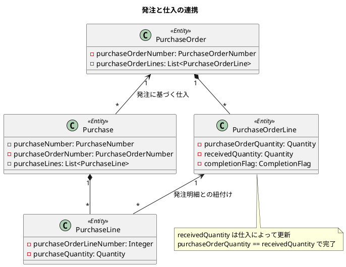
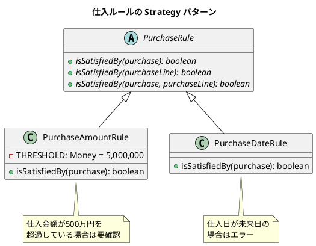
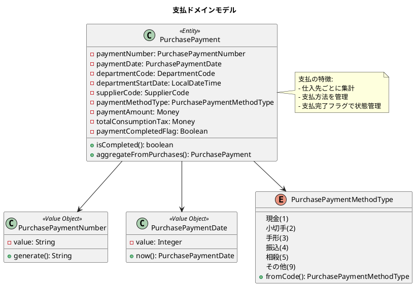
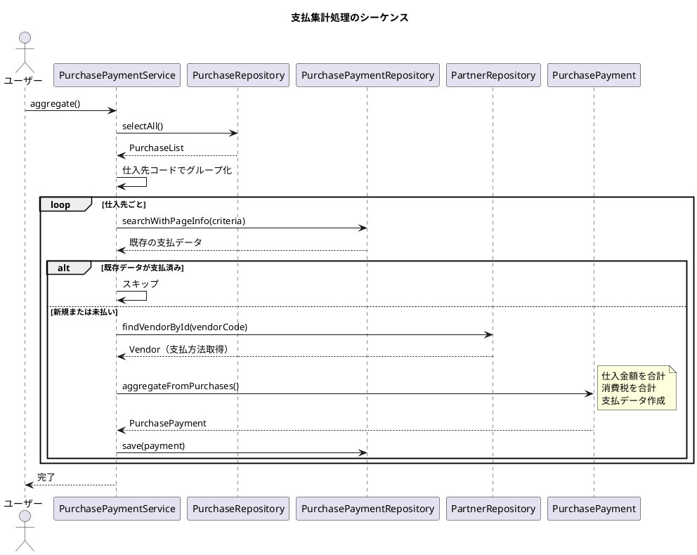
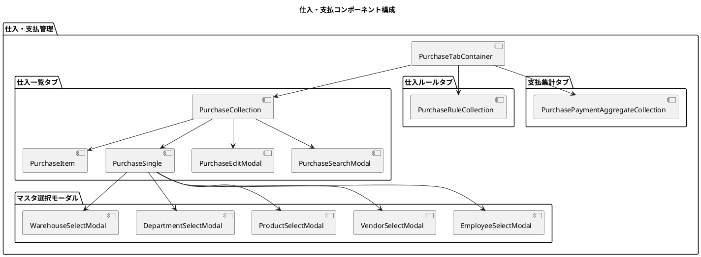
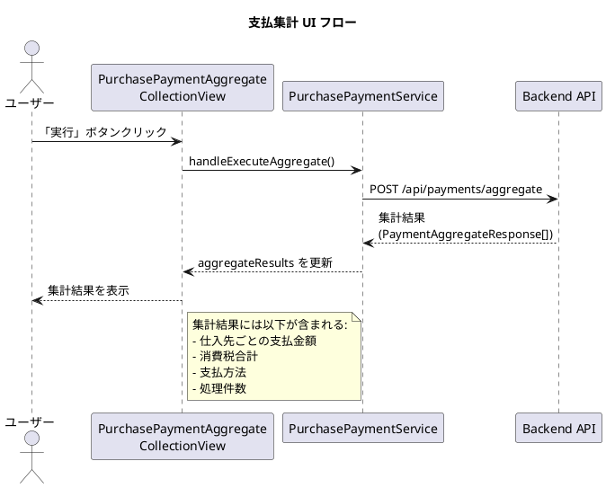
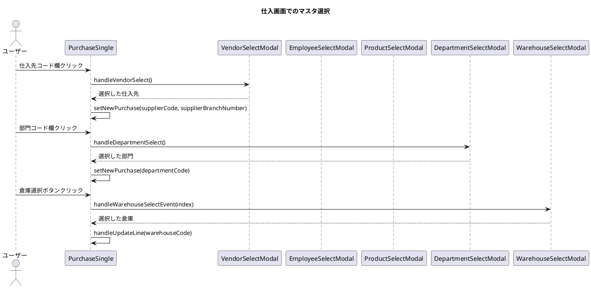

# 第17章: 仕入・支払管理

## 17.1 集中開発の実例

### 小さなステップの積み重ね

仕入・支払管理機能は、発注管理を基盤として構築されました。発注から仕入、そして支払への一連のワークフローを実現するために、小さなステップを積み重ねる TDD アプローチを採用しています。



### コミット履歴に見る開発プロセス

実際の開発では、以下のような小さなコミットを積み重ねています。

```
feat: 仕入エンティティの基本実装
feat: 仕入明細の金額計算ロジック追加
test: 仕入サービスの単体テスト作成
feat: 支払エンティティの実装
feat: 支払方法区分の列挙型追加
feat: 仕入から支払への集計機能
refactor: 金額計算ロジックの共通化
test: 支払集計処理のテスト追加
```

各コミットは単一の責任を持ち、テストがパスする状態を維持しています。

## 17.2 仕入管理

### 仕入ドメインモデルの概要

仕入は、発注に基づいて実際に商品を受け取る処理を管理します。発注との紐付けにより、発注から仕入までの追跡が可能です。



### 仕入エンティティの実装

仕入エンティティは、商品の入荷情報を管理し、金額を自動計算します。

```java
@Value
@AllArgsConstructor
@NoArgsConstructor(force = true)
@Builder(toBuilder = true)
public class Purchase {
    PurchaseNumber purchaseNumber; // 仕入番号
    PurchaseDate purchaseDate; // 仕入日
    SupplierCode supplierCode; // 仕入先コード
    EmployeeCode purchaseManagerCode; // 仕入担当者コード
    LocalDateTime startDate; // 開始日
    PurchaseOrderNumber purchaseOrderNumber; // 発注番号
    DepartmentCode departmentCode; // 部門コード
    Money totalPurchaseAmount; // 仕入金額合計
    Money totalConsumptionTax; // 消費税合計
    String remarks; // 備考
    List<PurchaseLine> purchaseLines; // 仕入明細
    Supplier supplier; // 仕入先
    Employee purchaseManager; // 仕入担当者

    public static Purchase of(
            String purchaseNumber,
            LocalDateTime purchaseDate,
            String supplierCode,
            Integer supplierBranchNumber,
            String purchaseManagerCode,
            LocalDateTime startDate,
            String purchaseOrderNumber,
            String departmentCode,
            Integer totalPurchaseAmount,
            Integer totalConsumptionTax,
            String remarks,
            List<PurchaseLine> purchaseLines) {

        // 金額を明細から自動計算
        Money calcTotalPurchaseAmount = purchaseLines.stream()
                .map(PurchaseLine::calcPurchaseAmount)
                .reduce(Money.of(0), Money::plusMoney);

        Money calcTotalConsumptionTax = purchaseLines.stream()
                .map(PurchaseLine::calcConsumptionTax)
                .reduce(Money.of(0), Money::plusMoney);

        return Purchase.builder()
                .purchaseNumber(PurchaseNumber.of(purchaseNumber))
                .purchaseDate(PurchaseDate.of(purchaseDate))
                .supplierCode(SupplierCode.of(supplierCode, supplierBranchNumber))
                .purchaseManagerCode(EmployeeCode.of(purchaseManagerCode))
                .startDate(startDate)
                .purchaseOrderNumber(purchaseOrderNumber != null
                        ? PurchaseOrderNumber.of(purchaseOrderNumber)
                        : null)
                .departmentCode(DepartmentCode.of(departmentCode))
                .totalPurchaseAmount(calcTotalPurchaseAmount)
                .totalConsumptionTax(calcTotalConsumptionTax)
                .remarks(remarks)
                .purchaseLines(purchaseLines)
                .build();
    }

    /**
     * 仕入金額合計計算
     */
    public Money calcTotalPurchaseAmount() {
        return purchaseLines.stream()
                .map(PurchaseLine::calcPurchaseAmount)
                .reduce(Money.of(0), Money::plusMoney);
    }

    /**
     * 消費税合計計算
     */
    public Money calcTotalConsumptionTax() {
        return purchaseLines.stream()
                .map(PurchaseLine::calcConsumptionTax)
                .reduce(Money.of(0), Money::plusMoney);
    }
}
```

### 仕入明細エンティティ

仕入明細は、入荷した商品の詳細情報を管理します。

```java
@Value
@AllArgsConstructor
@NoArgsConstructor(force = true)
@Builder(toBuilder = true)
public class PurchaseLine {
    PurchaseNumber purchaseNumber; // 仕入番号
    Integer purchaseLineNumber; // 仕入行番号
    Integer purchaseLineDisplayNumber; // 仕入行表示番号
    Integer purchaseOrderLineNumber; // 発注行番号
    ProductCode productCode; // 商品コード
    WarehouseCode warehouseCode; // 倉庫コード
    String productName; // 商品名
    Money purchaseUnitPrice; // 仕入単価
    Quantity purchaseQuantity; // 仕入数量
    LocalDateTime createdDateTime; // 作成日時
    String createdBy; // 作成者名
    LocalDateTime updatedDateTime; // 更新日時
    String updatedBy; // 更新者名
    Integer version; // バージョン
    Product product; // 商品

    public static PurchaseLine of(
            String purchaseNumber,
            Integer purchaseLineNumber,
            Integer purchaseLineDisplayNumber,
            Integer purchaseOrderLineNumber,
            String productCode,
            String warehouseCode,
            String productName,
            Integer purchaseUnitPrice,
            Integer purchaseQuantity) {

        return PurchaseLine.builder()
                .purchaseNumber(PurchaseNumber.of(purchaseNumber))
                .purchaseLineNumber(purchaseLineNumber)
                .purchaseLineDisplayNumber(purchaseLineDisplayNumber)
                .purchaseOrderLineNumber(purchaseOrderLineNumber)
                .productCode(ProductCode.of(productCode))
                .warehouseCode(WarehouseCode.of(warehouseCode))
                .productName(productName)
                .purchaseUnitPrice(Money.of(purchaseUnitPrice))
                .purchaseQuantity(Quantity.of(purchaseQuantity))
                .build();
    }

    /**
     * 仕入金額計算（消費税抜き）
     */
    public Money calcPurchaseAmount() {
        return purchaseUnitPrice.multiply(purchaseQuantity);
    }

    /**
     * 消費税計算
     */
    public Money calcConsumptionTax() {
        double taxRate = 0.10;
        int lineTotal = purchaseUnitPrice.getAmount() * purchaseQuantity.getAmount();
        return Money.of((int) (lineTotal * taxRate));
    }
}
```

### 仕入ステータス管理

仕入と発注の関係は、発注番号を通じて管理されます。



### 仕入サービスの実装

仕入サービスは、仕入の CRUD 操作とビジネスロジックを提供します。

```java
@Service
@Transactional
@Slf4j
public class PurchaseService {
    final PurchaseRepository purchaseRepository;
    final PurchaseDomainService purchaseDomainService;
    final AutoNumberService autoNumberService;

    /**
     * 仕入新規登録
     */
    public void register(Purchase purchase) {
        if (purchase.getPurchaseNumber() == null) {
            String purchaseNumber = generatePurchaseNumber(purchase);

            purchase = Purchase.of(
                    purchaseNumber,
                    Objects.requireNonNull(purchase.getPurchaseDate().getValue()),
                    Objects.requireNonNull(purchase.getSupplierCode().getCode()).getValue(),
                    purchase.getSupplierCode().getBranchNumber(),
                    Objects.requireNonNull(purchase.getPurchaseManagerCode()).getValue(),
                    Objects.requireNonNull(purchase.getStartDate()),
                    purchase.getPurchaseOrderNumber() != null
                            ? purchase.getPurchaseOrderNumber().getValue()
                            : null,
                    Objects.requireNonNull(purchase.getDepartmentCode()).getValue(),
                    Objects.requireNonNull(purchase.getTotalPurchaseAmount()).getAmount(),
                    Objects.requireNonNull(purchase.getTotalConsumptionTax()).getAmount(),
                    purchase.getRemarks(),
                    Objects.requireNonNull(purchase.getPurchaseLines())
            );
        }
        purchaseRepository.save(purchase);
    }

    /**
     * 仕入番号生成
     * 形式: SI + YYMM + 連番4桁 (例: SI25010001)
     */
    private String generatePurchaseNumber(Purchase purchase) {
        String code = DocumentTypeCode.仕入.getCode();
        LocalDateTime purchaseDate = Objects.requireNonNull(purchase.getPurchaseDate().getValue());
        LocalDateTime yearMonth = YearMonth.of(
                purchaseDate.getYear(),
                purchaseDate.getMonth()
        ).atDay(1).atStartOfDay();

        Integer autoNumber = autoNumberService.getNextDocumentNumber(code, yearMonth);
        String purchaseNumber = code
                + yearMonth.format(DateTimeFormatter.ofPattern("yyMM"))
                + String.format("%04d", autoNumber);

        autoNumberService.save(AutoNumber.of(code, yearMonth, autoNumber));
        autoNumberService.incrementDocumentNumber(code, yearMonth);

        return purchaseNumber;
    }
}
```

### 仕入ルールの実装

仕入にも発注と同様のルールチェック機構があります。

```java
/**
 * 仕入ルール（抽象基底クラス）
 */
public abstract class PurchaseRule {
    public abstract boolean isSatisfiedBy(Purchase purchase);
    public abstract boolean isSatisfiedBy(PurchaseLine purchaseLine);
    public abstract boolean isSatisfiedBy(Purchase purchase, PurchaseLine purchaseLine);
}

/**
 * 仕入金額ルール
 * 仕入金額が500万円を超過している場合は要確認とする
 */
public class PurchaseAmountRule extends PurchaseRule {
    private static final Money THRESHOLD = Money.of(5000000);

    @Override
    public boolean isSatisfiedBy(Purchase purchase) {
        return purchase.getTotalPurchaseAmount().isGreaterThan(THRESHOLD);
    }

    @Override
    public boolean isSatisfiedBy(PurchaseLine purchaseLine) {
        return false;
    }

    @Override
    public boolean isSatisfiedBy(Purchase purchase, PurchaseLine purchaseLine) {
        return false;
    }
}
```



### 仕入ドメインサービス

仕入ドメインサービスは、複数のルールを適用してチェック結果を返します。

```java
@Service
public class PurchaseDomainService {

    /**
     * 仕入金額合計計算
     */
    public Money calculateTotalPurchaseAmount(Purchase purchase) {
        if (purchase.getPurchaseLines() == null || purchase.getPurchaseLines().isEmpty()) {
            return Money.of(0);
        }
        return purchase.calcTotalPurchaseAmount();
    }

    /**
     * 仕入ルールチェック
     */
    public PurchaseRuleCheckList checkRule(PurchaseList purchases) {
        List<Map<String, String>> checkList = new ArrayList<>();

        List<Purchase> purchaseList = purchases.asList();
        PurchaseRule purchaseAmountRule = new PurchaseAmountRule();
        PurchaseRule purchaseDateRule = new PurchaseDateRule();

        BiConsumer<String, String> addCheck = (purchaseNumber, message) -> {
            Map<String, String> errorMap = new HashMap<>();
            errorMap.put(purchaseNumber, message);
            checkList.add(errorMap);
        };

        purchaseList.forEach(purchase -> {
            // 仕入金額ルールチェック
            if (purchaseAmountRule.isSatisfiedBy(purchase)) {
                addCheck.accept(purchase.getPurchaseNumber().getValue(),
                               "仕入金額が500万円を超えています。");
            }

            // 仕入日ルールチェック
            if (purchaseDateRule.isSatisfiedBy(purchase)) {
                addCheck.accept(purchase.getPurchaseNumber().getValue(),
                               "仕入日が未来日です。");
            }
        });

        return new PurchaseRuleCheckList(checkList);
    }
}
```

## 17.3 支払管理

### 支払ドメインモデルの概要

支払は、仕入先への代金支払を管理します。仕入データを集計して、仕入先ごとの支払データを生成します。



### 支払エンティティの実装

支払エンティティは、仕入先への支払情報を管理します。

```java
@Value
@AllArgsConstructor
@NoArgsConstructor(force = true)
@Builder(toBuilder = true)
public class PurchasePayment {
    PurchasePaymentNumber paymentNumber; // 支払番号
    PurchasePaymentDate paymentDate; // 支払日
    DepartmentCode departmentCode; // 部門コード
    LocalDateTime departmentStartDate; // 部門開始日
    SupplierCode supplierCode; // 仕入先コード
    PurchasePaymentMethodType paymentMethodType; // 支払方法区分
    Money paymentAmount; // 支払金額
    Money totalConsumptionTax; // 消費税合計
    Boolean paymentCompletedFlag; // 支払完了フラグ
    LocalDateTime createdDateTime; // 作成日時
    String createdBy; // 作成者名
    LocalDateTime updatedDateTime; // 更新日時
    String updatedBy; // 更新者名

    /**
     * 支払が完了しているかどうかを判定する
     */
    public boolean isCompleted() {
        return Boolean.TRUE.equals(paymentCompletedFlag);
    }

    /**
     * 仕入データから支払データを集計する
     */
    public static PurchasePayment aggregateFromPurchases(
            List<Purchase> purchases,
            PurchasePaymentNumber paymentNumber,
            PurchasePaymentDate paymentDate,
            PurchasePaymentMethodType paymentMethodType) {

        if (purchases == null || purchases.isEmpty()) {
            throw new IllegalArgumentException("仕入データが存在しません");
        }

        // 最初の仕入データから共通情報を取得
        Purchase firstPurchase = purchases.get(0);

        // 仕入金額と消費税を合計
        Money totalAmount = purchases.stream()
                .map(Purchase::getTotalPurchaseAmount)
                .reduce(Money.of(0), Money::plusMoney);

        Money totalTax = purchases.stream()
                .map(Purchase::getTotalConsumptionTax)
                .reduce(Money.of(0), Money::plusMoney);

        return PurchasePayment.builder()
                .paymentNumber(paymentNumber)
                .paymentDate(paymentDate)
                .departmentCode(firstPurchase.getDepartmentCode())
                .departmentStartDate(firstPurchase.getStartDate())
                .supplierCode(firstPurchase.getSupplierCode())
                .paymentMethodType(paymentMethodType)
                .paymentAmount(totalAmount)
                .totalConsumptionTax(totalTax)
                .paymentCompletedFlag(false)
                .build();
    }
}
```

### 支払方法区分

支払方法は列挙型で定義されています。

```java
@AllArgsConstructor
@Getter
public enum PurchasePaymentMethodType {
    現金(1, "現金"),
    小切手(2, "小切手"),
    手形(3, "手形"),
    振込(4, "振込"),
    相殺(5, "相殺"),
    その他(9, "その他");

    private final Integer code;
    private final String name;

    /**
     * コードから支払方法区分を取得する
     */
    public static PurchasePaymentMethodType fromCode(Integer code) {
        if (code == null) {
            return 振込; // デフォルトは振込
        }

        for (PurchasePaymentMethodType type : PurchasePaymentMethodType.values()) {
            if (type.getCode().equals(code)) {
                return type;
            }
        }

        return 振込;
    }
}
```

### 支払予定の生成

支払サービスは、仕入データを集計して支払予定を生成します。

```java
@Service
@Transactional
public class PurchasePaymentService {

    final PurchasePaymentRepository purchasePaymentRepository;
    final PurchaseRepository purchaseRepository;
    final PartnerRepository partnerRepository;

    /**
     * 仕入データから支払データを集計する
     * 仕入先ごとに当月の仕入金額を合計して支払データを作成する
     */
    public void aggregate() {
        PurchaseList purchaseList = purchaseRepository.selectAll();

        // 仕入先コードでグループ化
        Map<String, List<Purchase>> purchasesBySupplier = purchaseList.asList().stream()
                .collect(Collectors.groupingBy(purchase ->
                    purchase.getSupplierCode().getCode().getValue() + "-" +
                    purchase.getSupplierCode().getBranchNumber()
                ));

        // 仕入先ごとに支払データを作成
        final int[] counter = {1};
        purchasesBySupplier.forEach((supplierKey, purchases) -> {
            registerPurchasePaymentApplication(purchases, counter[0]++);
        });
    }

    /**
     * 仕入データリストから支払データを登録する
     */
    public void registerPurchasePaymentApplication(List<Purchase> purchases, int counter) {
        if (purchases.isEmpty()) {
            return;
        }

        Purchase firstPurchase = purchases.get(0);
        PurchasePaymentDate paymentDate = PurchasePaymentDate.now();

        // 既存の支払データを検索
        PurchasePaymentCriteria criteria = PurchasePaymentCriteria.builder()
                .supplierCode(firstPurchase.getSupplierCode().getCode().getValue())
                .supplierBranchNumber(firstPurchase.getSupplierCode().getBranchNumber())
                .paymentDate(paymentDate.getValue())
                .build();

        PageInfo<PurchasePayment> existingPayments =
                purchasePaymentRepository.searchWithPageInfo(criteria);

        // 支払済みのデータは更新しない
        if (!existingPayments.getList().isEmpty()) {
            PurchasePayment existingPayment = existingPayments.getList().get(0);
            if (existingPayment.isCompleted()) {
                return;
            }
        }

        // 支払番号を決定
        PurchasePaymentNumber paymentNumber;
        if (!existingPayments.getList().isEmpty()) {
            paymentNumber = existingPayments.getList().get(0).getPaymentNumber();
        } else {
            paymentNumber = PurchasePaymentNumber.generate(counter);
        }

        // 仕入先マスタから支払方法を取得
        VendorCode vendorCode = VendorCode.of(
                firstPurchase.getSupplierCode().getCode().getValue(),
                firstPurchase.getSupplierCode().getBranchNumber()
        );
        Optional<Vendor> vendorOpt = partnerRepository.findVendorById(vendorCode);
        PurchasePaymentMethodType paymentMethodType = vendorOpt
                .map(vendor -> PurchasePaymentMethodType.fromCode(
                        vendor.getVendorClosingBilling().getPaymentMethod().getValue()))
                .orElse(PurchasePaymentMethodType.fromCode(1));

        // 支払データを集計・登録
        PurchasePayment payment = PurchasePayment.aggregateFromPurchases(
                purchases,
                paymentNumber,
                paymentDate,
                paymentMethodType
        );

        purchasePaymentRepository.save(payment);
    }
}
```



### 支払実績の登録

支払が完了したら、支払完了フラグを更新します。

```plantuml
@startuml
title 支払ステータス管理

[*] --> 支払予定生成

支払予定生成 --> 支払待ち : aggregate()
支払待ち --> 支払処理中 : 支払日到来

支払処理中 --> 支払完了 : 振込/決済実行
支払完了 --> [*]

state 支払予定生成 {
  note "仕入データから集計"
}

state 支払待ち {
  note "paymentCompletedFlag = false"
}

state 支払完了 {
  note "paymentCompletedFlag = true"
}

@enduml
```

## 17.4 メソッド抽出リファクタリング

### 複雑度の低減

支払集計処理は複雑になりがちです。メソッド抽出によって可読性を向上させています。

**リファクタリング前:**

```java
public void aggregate() {
    PurchaseList purchaseList = purchaseRepository.selectAll();

    Map<String, List<Purchase>> purchasesBySupplier = purchaseList.asList().stream()
            .collect(Collectors.groupingBy(purchase ->
                purchase.getSupplierCode().getCode().getValue() + "-" +
                purchase.getSupplierCode().getBranchNumber()
            ));

    final int[] counter = {1};
    purchasesBySupplier.forEach((supplierKey, purchases) -> {
        if (purchases.isEmpty()) return;

        Purchase firstPurchase = purchases.get(0);
        PurchasePaymentDate paymentDate = PurchasePaymentDate.now();

        // ... 長い処理 ...
    });
}
```

**リファクタリング後:**

```java
public void aggregate() {
    PurchaseList purchaseList = purchaseRepository.selectAll();
    Map<String, List<Purchase>> purchasesBySupplier = groupBySupplier(purchaseList);

    final int[] counter = {1};
    purchasesBySupplier.forEach((supplierKey, purchases) -> {
        registerPurchasePaymentApplication(purchases, counter[0]++);
    });
}

private Map<String, List<Purchase>> groupBySupplier(PurchaseList purchaseList) {
    return purchaseList.asList().stream()
            .collect(Collectors.groupingBy(this::getSupplierKey));
}

private String getSupplierKey(Purchase purchase) {
    return purchase.getSupplierCode().getCode().getValue() + "-" +
           purchase.getSupplierCode().getBranchNumber();
}
```

### テストの維持

リファクタリング後もテストがパスすることを確認します。

```java
@Test
@DisplayName("仕入データから支払データを集計できる")
void shouldAggregatePaymentsFromPurchases() {
    // Arrange
    Purchase purchase1 = createTestPurchase("SI25010001", "SUPP001", 0, 10000, 1000);
    Purchase purchase2 = createTestPurchase("SI25010002", "SUPP001", 0, 20000, 2000);

    PurchaseList purchaseList = PurchaseList.of(List.of(purchase1, purchase2));
    when(purchaseRepository.selectAll()).thenReturn(purchaseList);
    when(purchasePaymentRepository.searchWithPageInfo(any())).thenReturn(new PageInfo<>(List.of()));

    // Act
    purchasePaymentService.aggregate();

    // Assert
    verify(purchasePaymentRepository).save(argThat(payment ->
        payment.getPaymentAmount().getAmount() == 30000 &&
        payment.getTotalConsumptionTax().getAmount() == 3000
    ));
}
```

## 17.5 React コンポーネントの実装

### 仕入・支払画面のコンポーネント構成

仕入・支払管理のフロントエンド実装は、React を使用してコンポーネントベースで構築されています。



### 仕入一覧画面の実装

仕入一覧画面は、仕入データの検索、表示、一括操作機能を提供します。

```typescript
interface PurchaseItemProps {
    purchase: PurchaseType;
    onEdit: (purchase: PurchaseType) => void;
    onDelete: (purchaseNumber: string) => void;
    onCheck: (purchase: PurchaseType) => void;
}

const PurchaseItem: React.FC<PurchaseItemProps> = ({
    purchase, onEdit, onDelete, onCheck
}) => (
    <li className="collection-object-item" key={purchase.purchaseNumber}>
        <div className="collection-object-item-content">
            <input
                type="checkbox"
                checked={purchase.checked}
                onChange={() => onCheck(purchase)}
            />
        </div>
        <div className="collection-object-item-content">
            <div className="collection-object-item-content-details">仕入番号</div>
            <div className="collection-object-item-content-name">
                {purchase.purchaseNumber}
            </div>
        </div>
        <div className="collection-object-item-content">
            <div className="collection-object-item-content-details">仕入日</div>
            <div className="collection-object-item-content-name">
                {purchase.purchaseDate.split("T")[0]}
            </div>
        </div>
        <div className="collection-object-item-content">
            <div className="collection-object-item-content-details">仕入先コード</div>
            <div className="collection-object-item-content-name">
                {purchase.supplierCode}
            </div>
        </div>
        <div className="collection-object-item-content">
            <div className="collection-object-item-content-details">仕入金額合計</div>
            <div className="collection-object-item-content-name">
                {purchase.totalPurchaseAmount.toLocaleString()}
            </div>
        </div>
        <div className="collection-object-item-actions">
            <button onClick={() => onEdit(purchase)}>編集</button>
        </div>
        <div className="collection-object-item-actions">
            <button onClick={() => onDelete(purchase.purchaseNumber)}>削除</button>
        </div>
    </li>
);
```

### 仕入明細の動的追加・削除

仕入詳細フォームでは、明細行を動的に追加・削除できます。金額は自動計算されます。

```typescript
// 金額計算関数
const calculateLineAmount = (line: PurchaseLineType): number => {
    return line.purchaseQuantity * line.purchaseUnitPrice;
};

const calculateLineTax = (line: PurchaseLineType): number => {
    const amount = calculateLineAmount(line);
    return Math.floor(amount * 0.1); // 消費税 10%
};

const calculateTotalAmount = (lines: PurchaseLineType[]): number => {
    return lines.reduce((sum, line) => sum + calculateLineAmount(line), 0);
};

const calculateTotalTax = (lines: PurchaseLineType[]): number => {
    return lines.reduce((sum, line) => sum + calculateLineTax(line), 0);
};

// 明細更新処理
const handleUpdateLine = (index: number, line: PurchaseLineType) => {
    const newLines = [...newPurchase.purchaseLines];
    newLines[index] = {
        ...line,
        purchaseNumber: newPurchase.purchaseNumber
    };

    // 合計金額の再計算
    const totalAmount = calculateTotalAmount(newLines);
    const totalTax = calculateTotalTax(newLines);

    setNewPurchase({
        ...newPurchase,
        purchaseLines: newLines,
        totalPurchaseAmount: totalAmount,
        totalConsumptionTax: totalTax
    });
};

// 明細追加処理
const handleAddLine = () => {
    const newLine: PurchaseLineType = {
        purchaseNumber: newPurchase.purchaseNumber,
        purchaseLineNumber: newPurchase.purchaseLines.length + 1,
        purchaseLineDisplayNumber: newPurchase.purchaseLines.length + 1,
        purchaseOrderLineNumber: 0,
        productCode: '',
        warehouseCode: '',
        productName: '',
        purchaseUnitPrice: 0,
        purchaseQuantity: 0
    };
    setNewPurchase({
        ...newPurchase,
        purchaseLines: [...newPurchase.purchaseLines, newLine]
    });
};
```

### 仕入明細テーブルの実装

仕入明細はテーブル形式で表示され、インライン編集が可能です。倉庫選択も含まれます。

```typescript
<div className="single-view-content-item-form-lines purchase-order-detail">
    <h3>
        仕入明細
        <button className="add-line-button" onClick={handleAddLine}>
            <span>＋</span> 明細追加
        </button>
    </h3>
    <div className="table-container">
        <table className="purchase-order-lines-table">
            <thead>
                <tr>
                    <th>仕入行番号</th>
                    <th>発注行番号</th>
                    <th>商品コード</th>
                    <th>商品名</th>
                    <th>倉庫コード</th>
                    <th>仕入単価</th>
                    <th>仕入数量</th>
                    <th>操作</th>
                </tr>
            </thead>
            <tbody>
                {newPurchase.purchaseLines.map((line, index) => (
                    <tr key={index}>
                        <td>
                            <input
                                type="number"
                                value={line.purchaseLineNumber}
                                disabled={true}
                            />
                        </td>
                        <td>
                            <input
                                type="number"
                                value={line.purchaseOrderLineNumber}
                                onChange={(e) => handleUpdateLine(index, {
                                    ...line,
                                    purchaseOrderLineNumber: Number(e.target.value)
                                })}
                            />
                        </td>
                        <td>
                            <div style={{ display: 'flex', alignItems: 'center' }}>
                                <input
                                    type="text"
                                    value={line.productCode}
                                    onChange={(e) => handleUpdateLine(index, {
                                        ...line,
                                        productCode: e.target.value
                                    })}
                                />
                                <button onClick={() => handleProductSelectEvent(index)}>
                                    選択
                                </button>
                            </div>
                        </td>
                        <td>
                            <input
                                type="text"
                                value={line.productName}
                                onChange={(e) => handleUpdateLine(index, {
                                    ...line,
                                    productName: e.target.value
                                })}
                            />
                        </td>
                        <td>
                            <div style={{ display: 'flex', alignItems: 'center' }}>
                                <input
                                    type="text"
                                    value={line.warehouseCode}
                                    onChange={(e) => handleUpdateLine(index, {
                                        ...line,
                                        warehouseCode: e.target.value
                                    })}
                                />
                                <button onClick={() => handleWarehouseSelectEvent(index)}>
                                    選択
                                </button>
                            </div>
                        </td>
                        <td>
                            <input
                                type="number"
                                value={line.purchaseUnitPrice}
                                onChange={(e) => handleUpdateLine(index, {
                                    ...line,
                                    purchaseUnitPrice: Number(e.target.value)
                                })}
                            />
                        </td>
                        <td>
                            <input
                                type="number"
                                value={line.purchaseQuantity}
                                onChange={(e) => handleUpdateLine(index, {
                                    ...line,
                                    purchaseQuantity: Number(e.target.value)
                                })}
                            />
                        </td>
                        <td>
                            <button onClick={() => handleDeleteLine(index)}>削除</button>
                        </td>
                    </tr>
                ))}
            </tbody>
            <tfoot>
                <tr>
                    <td colSpan={5} className="total-label">小計</td>
                    <td className="total-amount">
                        {(newPurchase.totalPurchaseAmount || 0).toLocaleString()}
                    </td>
                </tr>
                <tr>
                    <td colSpan={5} className="total-label">消費税</td>
                    <td className="total-amount">
                        {(newPurchase.totalConsumptionTax || 0).toLocaleString()}
                    </td>
                </tr>
                <tr>
                    <td colSpan={5} className="total-label">合計金額</td>
                    <td className="total-amount">
                        {((newPurchase.totalPurchaseAmount || 0) +
                          (newPurchase.totalConsumptionTax || 0)).toLocaleString()}
                    </td>
                </tr>
            </tfoot>
        </table>
    </div>
</div>
```

### 支払集計画面の実装

支払集計画面は、仕入データを集計して支払データを生成する機能を提供します。

```typescript
interface PurchasePaymentAggregateCollectionViewProps {
    aggregateHeaderItems: {
        handleExecuteAggregate: () => void;
    };
    aggregateResults: PaymentAggregateResponse[];
    handleDeleteAggregateResult: (index: number) => void;
}

export const PurchasePaymentAggregateCollectionView: React.FC<
    PurchasePaymentAggregateCollectionViewProps
> = ({
    aggregateHeaderItems: { handleExecuteAggregate },
    aggregateResults,
    handleDeleteAggregateResult,
}) => {
    return (
        <div className="collection-view-object-container">
            <div className="collection-view-container">
                <div className="collection-view-header">
                    <h1 className="single-view-title">支払集計</h1>
                </div>
                <div className="collection-view-content">
                    <div className="button-container">
                        <button onClick={handleExecuteAggregate}>実行</button>
                    </div>
                    <div className="collection-object-container">
                        <ul className="collection-object-list">
                            {aggregateResults.map((result, index) => (
                                <div key={index} className="upload-result-item">
                                    <div className="check-result-message">
                                        <Message error={null} message={result.message}/>
                                        {result.details && result.details.length > 0 && (
                                            <div className="upload-result-details">
                                                {result.details.map((detail, detailIndex) => (
                                                    <div key={detailIndex} className="upload-result-detail">
                                                        {Object.entries(detail).map(([key, value]) => (
                                                            <div key={key} className="detail-item">
                                                                <span className="detail-key">{key}:</span>
                                                                <span className="detail-value">
                                                                    {typeof value === 'object'
                                                                        ? JSON.stringify(value)
                                                                        : String(value)}
                                                                </span>
                                                            </div>
                                                        ))}
                                                    </div>
                                                ))}
                                            </div>
                                        )}
                                    </div>
                                    <button onClick={() => handleDeleteAggregateResult(index)}>
                                        x
                                    </button>
                                </div>
                            ))}
                        </ul>
                    </div>
                </div>
            </div>
        </div>
    );
};
```

### 支払集計処理のフロー



### 型定義

仕入・支払管理で使用する TypeScript の型定義を示します。

```typescript
export type PurchaseLineType = {
    purchaseNumber: string;
    purchaseLineNumber: number;
    purchaseLineDisplayNumber: number;
    purchaseOrderLineNumber: number;
    productCode: string;
    warehouseCode: string;
    productName?: string;
    purchaseUnitPrice: number;
    purchaseQuantity: number;
    checked?: boolean;
};

export type PurchaseType = {
    purchaseNumber: string;
    purchaseDate: string;
    supplierCode: string;
    supplierBranchNumber: number;
    purchaseManagerCode: string;
    startDate: string;
    purchaseOrderNumber?: string;
    departmentCode: string;
    totalPurchaseAmount: number;
    totalConsumptionTax: number;
    remarks?: string;
    purchaseLines: PurchaseLineType[];
    checked?: boolean;
};

export type PurchaseCriteriaType = {
    purchaseNumber?: string;
    purchaseDate?: string;
    purchaseOrderNumber?: string;
    supplierCode?: string;
    supplierBranchNumber?: number;
    purchaseManagerCode?: string;
    departmentCode?: string;
};

// 支払集計レスポンス型
export type PaymentAggregateResponse = {
    message: string;
    details?: Record<string, unknown>[];
};
```

### マスタ選択モーダルの連携

仕入画面では、発注画面と同様にマスタ選択モーダルを使用しますが、追加で部門と倉庫の選択も可能です。



## まとめ

この章では、仕入・支払管理の実装について解説しました。

**重要なポイント:**

1. **仕入と発注の連携**: 発注番号を通じて仕入と発注を紐付け、トレーサビリティを確保しています。

2. **支払の集計処理**: 仕入先ごとに仕入データを集計し、自動的に支払データを生成します。

3. **支払方法の管理**: 列挙型で支払方法を定義し、仕入先マスタの設定に基づいて支払方法を決定します。

4. **Strategy パターン**: 仕入ルールも Strategy パターンで実装され、金額ルールや日付ルールなどを柔軟に適用できます。

5. **リファクタリング**: 複雑な集計処理は、メソッド抽出によって可読性を向上させています。TDD のアプローチにより、リファクタリング後もテストがパスすることを保証しています。

次の章では、在庫管理について解説します。倉庫・棚番マスタの設計と、在庫データの実装を学びます。
