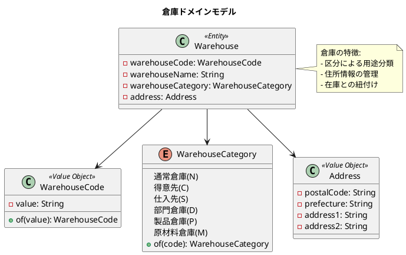
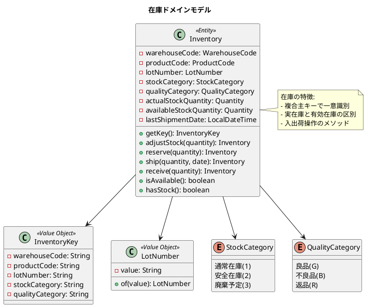
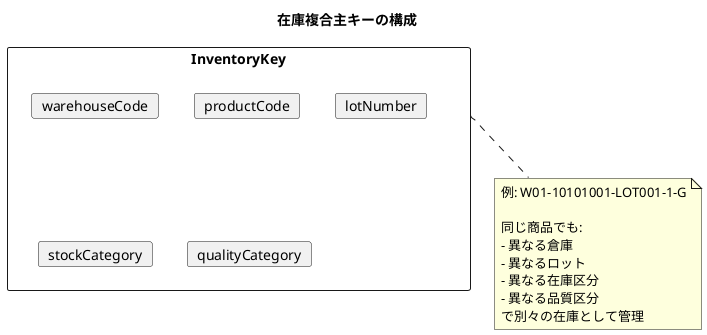
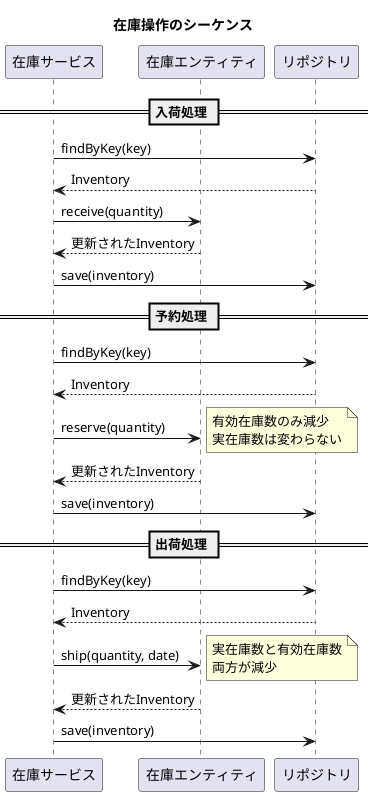
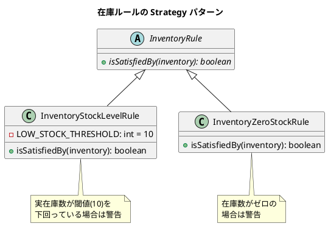
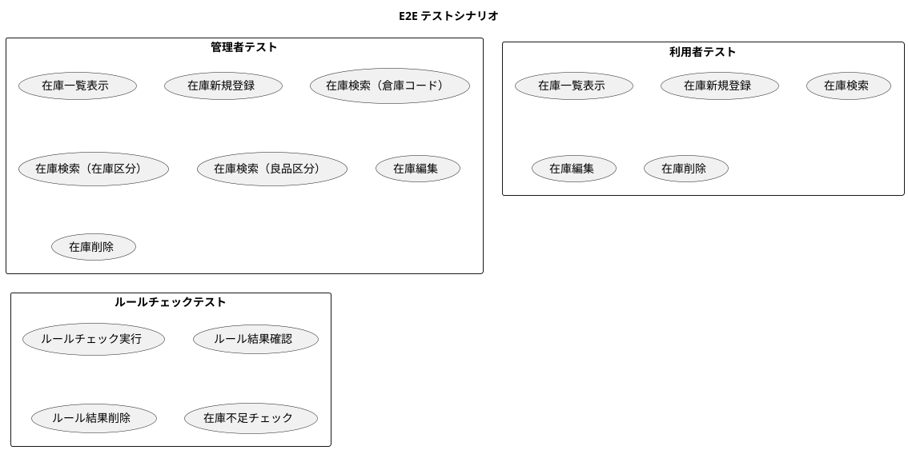
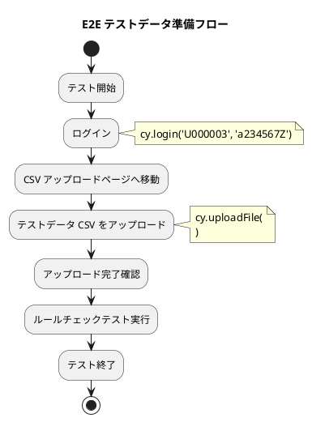

# 第18章: 在庫管理

## 18.1 倉庫・棚番マスタ

### 倉庫ドメインモデルの概要

倉庫は、商品を保管する物理的な場所を管理します。倉庫区分によって用途を分類し、住所情報も管理します。



### 倉庫コードの値オブジェクト

倉庫コードは、特定の形式を持つ値オブジェクトとして実装されています。

```java
@Value
public class WarehouseCode {
    String value;

    public static WarehouseCode of(String value) {
        if (value == null || value.isEmpty()) {
            throw new IllegalArgumentException("倉庫コードは必須です");
        }
        if (!isValidFormat(value)) {
            throw new IllegalArgumentException(
                "倉庫コードは先頭がW、残り2文字が数字の形式である必要があります（例: W01）");
        }
        return new WarehouseCode(value);
    }

    private static boolean isValidFormat(String value) {
        if (value.length() != 3) {
            return false;
        }
        if (value.charAt(0) != 'W') {
            return false;
        }
        return Character.isDigit(value.charAt(1)) && Character.isDigit(value.charAt(2));
    }
}
```

### 倉庫区分

倉庫の用途を分類する列挙型です。

```java
@Getter
public enum WarehouseCategory {
    通常倉庫("N", "通常倉庫"),
    得意先("C", "得意先"),
    仕入先("S", "仕入先"),
    部門倉庫("D", "部門倉庫"),
    製品倉庫("P", "製品倉庫"),
    原材料倉庫("M", "原材料倉庫");

    private final String code;
    private final String description;

    WarehouseCategory(String code, String description) {
        this.code = code;
        this.description = description;
    }

    public static WarehouseCategory of(String code) {
        if (code == null) {
            return null;
        }
        for (WarehouseCategory category : WarehouseCategory.values()) {
            if (category.getCode().equals(code)) {
                return category;
            }
        }
        throw new IllegalArgumentException("不正な倉庫区分です: " + code);
    }
}
```

```plantuml
@startuml
title 倉庫区分の用途

rectangle "通常倉庫 (N)" as N {
  note "一般的な商品保管場所"
}

rectangle "得意先 (C)" as C {
  note "得意先に預けている在庫"
}

rectangle "仕入先 (S)" as S {
  note "仕入先に預けている在庫"
}

rectangle "部門倉庫 (D)" as D {
  note "特定部門専用の倉庫"
}

rectangle "製品倉庫 (P)" as P {
  note "完成品の保管場所"
}

rectangle "原材料倉庫 (M)" as M {
  note "原材料の保管場所"
}

@enduml
```

### 倉庫エンティティの実装

```java
@Value
public class Warehouse {
    WarehouseCode warehouseCode;
    String warehouseName;
    WarehouseCategory warehouseCategory;
    Address address;

    public static Warehouse of(WarehouseCode warehouseCode, String warehouseName,
                                WarehouseCategory warehouseCategory, Address address) {
        return new Warehouse(warehouseCode, warehouseName, warehouseCategory, address);
    }

    public static Warehouse of(String warehouseCode, String warehouseName,
                                String warehouseCategory, String postalCode,
                                String prefecture, String address1, String address2) {
        Address warehouseAddress = null;
        if (postalCode != null && prefecture != null && address1 != null && address2 != null) {
            warehouseAddress = Address.of(postalCode, prefecture, address1, address2);
        }
        return new Warehouse(
                WarehouseCode.of(warehouseCode),
                warehouseName,
                WarehouseCategory.of(warehouseCategory),
                warehouseAddress);
    }
}
```

## 18.2 在庫データの実装

### 在庫ドメインモデルの概要

在庫は、倉庫・商品・ロット・区分の組み合わせで一意に識別されます。複合主キー（InventoryKey）によって管理されます。



### 在庫エンティティの実装

```java
@Value
@AllArgsConstructor
@NoArgsConstructor(force = true)
@Builder(toBuilder = true)
public class Inventory {
    WarehouseCode warehouseCode; // 倉庫コード
    ProductCode productCode; // 商品コード
    LotNumber lotNumber; // ロット番号
    StockCategory stockCategory; // 在庫区分
    QualityCategory qualityCategory; // 良品区分
    Quantity actualStockQuantity; // 実在庫数
    Quantity availableStockQuantity; // 有効在庫数
    LocalDateTime lastShipmentDate; // 最終出荷日
    String productName; // 商品名
    String warehouseName; // 倉庫名

    public static Inventory of(
            String warehouseCode,
            String productCode,
            String lotNumber,
            String stockCategory,
            String qualityCategory,
            Integer actualStockQuantity,
            Integer availableStockQuantity,
            LocalDateTime lastShipmentDate) {

        notNull(warehouseCode, "倉庫コードは必須です");
        notNull(productCode, "商品コードは必須です");
        notNull(lotNumber, "ロット番号は必須です");
        notNull(stockCategory, "在庫区分は必須です");
        notNull(qualityCategory, "良品区分は必須です");
        notNull(actualStockQuantity, "実在庫数は必須です");
        notNull(availableStockQuantity, "有効在庫数は必須です");

        isTrue(actualStockQuantity >= 0, "実在庫数は0以上である必要があります");
        isTrue(availableStockQuantity >= 0, "有効在庫数は0以上である必要があります");
        isTrue(availableStockQuantity <= actualStockQuantity,
               "有効在庫数は実在庫数以下である必要があります");

        return Inventory.builder()
                .warehouseCode(WarehouseCode.of(warehouseCode))
                .productCode(ProductCode.of(productCode))
                .lotNumber(LotNumber.of(lotNumber))
                .stockCategory(StockCategory.of(stockCategory))
                .qualityCategory(QualityCategory.of(qualityCategory))
                .actualStockQuantity(Quantity.of(actualStockQuantity))
                .availableStockQuantity(Quantity.of(availableStockQuantity))
                .lastShipmentDate(lastShipmentDate)
                .build();
    }
}
```

### 複合主キーの実装

在庫は5つの属性の組み合わせで一意に識別されます。

```java
@Value
@AllArgsConstructor
public class InventoryKey {
    String warehouseCode; // 倉庫コード
    String productCode; // 商品コード
    String lotNumber; // ロット番号
    String stockCategory; // 在庫区分
    String qualityCategory; // 良品区分

    public static InventoryKey of(
            String warehouseCode,
            String productCode,
            String lotNumber,
            String stockCategory,
            String qualityCategory) {

        notBlank(warehouseCode, "倉庫コードは必須です");
        notBlank(productCode, "商品コードは必須です");
        notBlank(lotNumber, "ロット番号は必須です");
        notBlank(stockCategory, "在庫区分は必須です");
        notBlank(qualityCategory, "良品区分は必須です");

        return new InventoryKey(
                warehouseCode,
                productCode,
                lotNumber,
                stockCategory,
                qualityCategory
        );
    }

    @Override
    public String toString() {
        return String.format("%s-%s-%s-%s-%s",
                warehouseCode,
                productCode,
                lotNumber,
                stockCategory,
                qualityCategory);
    }
}
```



### ロット番号の値オブジェクト

ロット番号は、製造ロットや入荷ロットを識別するための値オブジェクトです。

```java
@Value
public class LotNumber {
    String value;

    public static LotNumber of(String value) {
        if (value == null || value.isEmpty()) {
            throw new IllegalArgumentException("ロット番号は必須です");
        }
        if (value.length() > 20) {
            throw new IllegalArgumentException("ロット番号は20文字以下である必要があります");
        }
        // ロット番号の形式チェック（英数字とハイフンのみ許可）
        if (!value.matches("^[A-Za-z0-9\\-]+$")) {
            throw new IllegalArgumentException("ロット番号は英数字とハイフンのみ使用できます");
        }
        return new LotNumber(value);
    }

    @Override
    public String toString() {
        return value;
    }
}
```

### 在庫操作メソッド

在庫エンティティには、入出荷や予約などの操作メソッドが実装されています。

```java
/**
 * 在庫を調整
 */
public Inventory adjustStock(Integer adjustmentQuantity) {
    Quantity adjustment = Quantity.of(Math.abs(adjustmentQuantity));
    Quantity newActualStock = adjustmentQuantity >= 0
        ? actualStockQuantity.plus(adjustment)
        : actualStockQuantity.minus(adjustment);
    Quantity newAvailableStock = adjustmentQuantity >= 0
        ? availableStockQuantity.plus(adjustment)
        : availableStockQuantity.minus(adjustment);

    isTrue(newActualStock.getAmount() >= 0, "調整後の実在庫数が負になります");
    isTrue(newAvailableStock.getAmount() >= 0, "調整後の有効在庫数が負になります");

    return this.toBuilder()
            .actualStockQuantity(newActualStock)
            .availableStockQuantity(newAvailableStock)
            .build();
}

/**
 * 在庫を予約
 */
public Inventory reserve(Integer reserveQuantity) {
    isTrue(reserveQuantity > 0, "予約数量は正の数である必要があります");
    isTrue(availableStockQuantity.getAmount() >= reserveQuantity,
           "有効在庫数が不足しています");

    Quantity reserve = Quantity.of(reserveQuantity);
    return this.toBuilder()
            .availableStockQuantity(availableStockQuantity.minus(reserve))
            .build();
}

/**
 * 在庫を出荷
 */
public Inventory ship(Integer shipmentQuantity, LocalDateTime shipmentDate) {
    isTrue(shipmentQuantity > 0, "出荷数量は正の数である必要があります");
    isTrue(actualStockQuantity.getAmount() >= shipmentQuantity,
           "実在庫数が不足しています");

    Quantity shipment = Quantity.of(shipmentQuantity);
    Quantity newActualStock = actualStockQuantity.minus(shipment);
    Quantity newAvailableStock = Quantity.of(
        Math.min(availableStockQuantity.getAmount(), newActualStock.getAmount()));

    return this.toBuilder()
            .actualStockQuantity(newActualStock)
            .availableStockQuantity(newAvailableStock)
            .lastShipmentDate(shipmentDate)
            .build();
}

/**
 * 在庫を入荷
 */
public Inventory receive(Integer receiptQuantity) {
    isTrue(receiptQuantity > 0, "入荷数量は正の数である必要があります");

    Quantity receipt = Quantity.of(receiptQuantity);
    return this.toBuilder()
            .actualStockQuantity(actualStockQuantity.plus(receipt))
            .availableStockQuantity(availableStockQuantity.plus(receipt))
            .build();
}
```



### 在庫区分と良品区分

```java
/**
 * 在庫区分
 */
@Getter
public enum StockCategory {
    通常在庫("1", "通常の在庫"),
    安全在庫("2", "安全在庫（最低保持数量）"),
    廃棄予定("3", "廃棄予定在庫");

    private final String code;
    private final String description;

    StockCategory(String code, String description) {
        this.code = code;
        this.description = description;
    }

    public static StockCategory of(String code) {
        for (StockCategory stockCategory : StockCategory.values()) {
            if (stockCategory.getCode().equals(code)) {
                return stockCategory;
            }
        }
        throw new IllegalArgumentException("不正な在庫区分です: " + code);
    }
}

/**
 * 良品区分
 */
@Getter
public enum QualityCategory {
    良品("G", "良品（正常品質）"),
    不良品("B", "不良品（品質不良）"),
    返品("R", "返品（お客様返品）");

    private final String code;
    private final String description;

    QualityCategory(String code, String description) {
        this.code = code;
        this.description = description;
    }

    public static QualityCategory of(String code) {
        for (QualityCategory qualityCategory : QualityCategory.values()) {
            if (qualityCategory.getCode().equals(code)) {
                return qualityCategory;
            }
        }
        throw new IllegalArgumentException("不正な良品区分です: " + code);
    }
}
```

## 18.3 在庫ルール

### Strategy パターンによるルール実装

在庫ルールも他のドメインと同様に、Strategy パターンで実装されています。

```java
/**
 * 在庫ルール（抽象基底クラス）
 */
public abstract class InventoryRule {
    public abstract boolean isSatisfiedBy(Inventory inventory);
}
```



### 在庫レベルルール

在庫が閾値を下回った場合に警告を出すルールです。

```java
/**
 * 在庫レベルルール
 * 実在庫数が閾値を下回っている場合は要確認とする
 */
public class InventoryStockLevelRule extends InventoryRule {

    private static final int LOW_STOCK_THRESHOLD = 10;

    @Override
    public boolean isSatisfiedBy(Inventory inventory) {
        return inventory.getActualStockQuantity().getAmount() < LOW_STOCK_THRESHOLD;
    }
}
```

### 在庫ドメインサービス

複数のルールを適用してチェック結果を返します。

```java
@Service
public class InventoryDomainService {

    /**
     * 在庫ルールチェック
     */
    public InventoryRuleCheckList checkRule(InventoryList inventories) {
        List<Map<String, String>> checkList = new ArrayList<>();

        List<Inventory> inventoryList = inventories.asList();
        InventoryRule inventoryStockLevelRule = new InventoryStockLevelRule();
        InventoryRule inventoryZeroStockRule = new InventoryZeroStockRule();

        BiConsumer<String, String> addCheck = (inventoryKey, message) -> {
            Map<String, String> errorMap = new HashMap<>();
            errorMap.put(inventoryKey, message);
            checkList.add(errorMap);
        };

        inventoryList.forEach(inventory -> {
            String inventoryKey = inventory.getKey().getWarehouseCode() +
                                "-" + inventory.getKey().getProductCode() +
                                "-" + inventory.getKey().getLotNumber();

            // 在庫レベルルールチェック
            if (inventoryStockLevelRule.isSatisfiedBy(inventory)) {
                addCheck.accept(inventoryKey, "在庫数量が不足しています。");
            }

            // 在庫ゼロルールチェック
            if (inventoryZeroStockRule.isSatisfiedBy(inventory)) {
                addCheck.accept(inventoryKey, "在庫数量がゼロです。");
            }
        });

        return new InventoryRuleCheckList(checkList);
    }
}
```

### 在庫サービスの実装

在庫サービスは、CRUD 操作と入出荷処理を提供します。

```java
@Service
@Transactional
@Slf4j
public class InventoryService {

    private final InventoryRepository inventoryRepository;
    private final InventoryDomainService inventoryDomainService;

    /**
     * 在庫登録
     */
    public Inventory register(Inventory inventory) {
        notNull(inventory, "在庫情報は必須です");

        log.info("在庫登録開始: {}", inventory.getKey());

        // 既に同じキーの在庫が存在するかチェック
        Optional<Inventory> existing = inventoryRepository.findByKey(inventory.getKey());
        if (existing.isPresent()) {
            throw new IllegalArgumentException("既に存在する在庫キーです: " + inventory.getKey());
        }

        Inventory saved = inventoryRepository.save(inventory);
        log.info("在庫登録完了: {}", saved.getKey());

        return saved;
    }

    /**
     * 在庫出荷
     */
    public Inventory shipStock(InventoryKey key, Integer shipmentQuantity,
                                LocalDateTime shipmentDate) {
        notNull(key, "在庫キーは必須です");
        notNull(shipmentQuantity, "出荷数量は必須です");
        notNull(shipmentDate, "出荷日時は必須です");

        log.info("在庫出荷開始: key={}, 出荷数量={}, 出荷日時={}",
                key, shipmentQuantity, shipmentDate);

        Inventory inventory = inventoryRepository.findByKey(key)
                .orElseThrow(() -> new IllegalArgumentException("在庫が見つかりません: " + key));

        Inventory shipped = inventory.ship(shipmentQuantity, shipmentDate);
        Inventory saved = inventoryRepository.save(shipped);

        log.info("在庫出荷完了: key={}, 出荷前実在庫={}, 出荷後実在庫={}",
                key, inventory.getActualStockQuantity(), saved.getActualStockQuantity());

        return saved;
    }

    /**
     * 出荷完了イベントを処理して在庫を減らす
     */
    public Inventory processShipment(Shipped event) {
        notNull(event, "出荷イベントは必須です");

        log.info("出荷イベント処理開始: {}", event);

        ShippingAggregate shipping = event.getShipping();

        // InventoryKey を構築
        InventoryKey inventoryKey = InventoryKey.of(
                shipping.getWarehouseCode(),
                shipping.getProductCode().getValue(),
                "DEFAULT_LOT",
                "1",
                "1"
        );

        Integer shipmentQuantity = shipping.getShippedQuantity().getAmount();
        LocalDateTime shipmentDateTime = shipping.getShippingDate() != null ?
                shipping.getShippingDate().getValue() :
                LocalDateTime.now();

        Inventory result = shipStock(inventoryKey, shipmentQuantity, shipmentDateTime);

        log.info("出荷イベント処理完了: キー={}, 出荷数量={}", inventoryKey, shipmentQuantity);

        return result;
    }

    /**
     * 在庫ルールチェック
     */
    public InventoryRuleCheckList checkRule() {
        InventoryList inventories = inventoryRepository.selectAll();
        return inventoryDomainService.checkRule(inventories);
    }
}
```

## 18.4 E2E テスト

### Cypress によるテスト

在庫管理の E2E テストは、Cypress を使って実装されています。管理者と利用者の両方のシナリオをテストします。

```javascript
describe('在庫管理', () => {
    context('管理者', () => {
        beforeEach(() => {
            cy.login('U000003', 'a234567Z');
        })

        const inventoryPage = () => {
            cy.get('#side-nav-menu > :nth-child(1) > :nth-child(3) > :nth-child(3) ' +
                   '> .nav-sub-list > :nth-child(1) > #side-nav-inventory-nav').click();
        }

        context('在庫一覧', () => {
            it('在庫一覧の表示', () => {
                inventoryPage();
                cy.get('.collection-view-container').should('be.visible');
            });
        });

        context('在庫新規登録', () => {
            it('新規登録', () => {
                inventoryPage();

                // 在庫新規画面を開く
                cy.get('#new').click();

                // 倉庫情報を入力
                cy.get('#warehouseCode').click();
                cy.get(':nth-child(1) > .collection-object-item-actions ' +
                       '> #select-warehouse').click();

                // 商品情報を入力
                cy.get('#productCode').click();
                cy.get(':nth-child(1) > .collection-object-item-actions ' +
                       '> #select-product').click();

                // ロット番号を入力
                cy.get('#lotNumber').type('LOT001');

                // 在庫区分を選択
                cy.get('#stockCategory').select('通常在庫');

                // 良品区分を選択
                cy.get('#qualityCategory').select('良品');

                // 在庫数量を入力
                cy.get('#actualStockQuantity').type('100');
                cy.get('#availableStockQuantity').type('95');

                // 最終出荷日を入力
                cy.get('#lastShipmentDate').type('2024-01-15');

                // 在庫を保存
                cy.get('#save').click();

                // 作成完了メッセージの確認
                cy.get('#message').contains('在庫データを登録しました。');
            });
        });
    });
});
```

### テストシナリオの設計

E2E テストは、以下のシナリオを網羅しています。



### 在庫ルールチェックのテスト

```javascript
describe('在庫管理', () => {
    context('管理者', () => {
        beforeEach(() => {
            cy.login('U000003', 'a234567Z');

            // 事前にアップロードしてルールチェック対象データを作成
            cy.get('#side-nav-menu > :nth-child(1) > :nth-child(3) > :nth-child(3) ' +
                   '> .nav-sub-list > :nth-child(2) > #side-nav-inventory-nav').click();
            cy.get('#upload').should('be.visible');
            cy.get('#upload').click();
            cy.get('.modal').should('be.visible');
            cy.uploadFile('input[type="file"]', 'valid_inventory.csv', 'text/csv');
            cy.get('.modal button').contains('アップロード').click();
            cy.get('p').contains('在庫アップロードが完了しました');
        })

        const inventoryRulePage = () => {
            cy.get('#side-nav-menu > :nth-child(1) > :nth-child(3) > :nth-child(3) ' +
                   '> .nav-sub-list > :nth-child(3) > #side-nav-inventory-nav').click();
        }

        context('在庫ルール', () => {
            it('実行', () => {
                inventoryRulePage();
                cy.get('#execute').should('be.visible');
                cy.get('#execute').click();
                cy.get('p').contains('在庫ルールチェックを実行しました');
            });

            it('在庫不足のルールチェック', () => {
                // まず在庫不足データをアップロード
                cy.get('#side-nav-menu > :nth-child(1) > :nth-child(3) > :nth-child(3) ' +
                       '> .nav-sub-list > :nth-child(2) > #side-nav-inventory-nav').click();
                cy.get('#upload').click();
                cy.uploadFile('input[type="file"]', 'inventory_valid_for_check.csv', 'text/csv');
                cy.get('.modal button').contains('アップロード').click();

                // ルールページに移動
                inventoryRulePage();

                // ルールチェック実行
                cy.get('#execute').click();
                cy.get('p').contains('在庫ルールチェックを実行しました');

                // 在庫不足の警告が出ることを確認
                cy.get('p').should('contain', '確認項目があります');
            });
        });
    });
});
```

### テストデータの準備

E2E テストでは、CSV ファイルを使ってテストデータを準備します。



## まとめ

この章では、在庫管理の実装について解説しました。

**重要なポイント:**

1. **倉庫マスタ**: 倉庫コード（W01形式）と倉庫区分（通常倉庫、製品倉庫、原材料倉庫など）で倉庫を管理します。

2. **複合主キー**: 在庫は、倉庫コード・商品コード・ロット番号・在庫区分・良品区分の5つの属性で一意に識別されます。これにより、同じ商品でも異なるロットや品質区分で別々に管理できます。

3. **在庫操作メソッド**: 在庫エンティティには、入荷（receive）、出荷（ship）、予約（reserve）、調整（adjustStock）などの操作メソッドが実装されています。不変オブジェクトとして、操作のたびに新しいインスタンスを返します。

4. **在庫ルール**: Strategy パターンでルールを実装し、在庫レベル警告や在庫ゼロ警告などのチェックを行います。

5. **E2E テスト**: Cypress を使って、管理者と利用者の両方のシナリオをカバーするテストを実装しています。テストデータは CSV アップロードで準備します。

次の章では、テスト戦略について解説します。テストピラミッド、TestContainer の活用、受け入れテストの実装方法を学びます。
