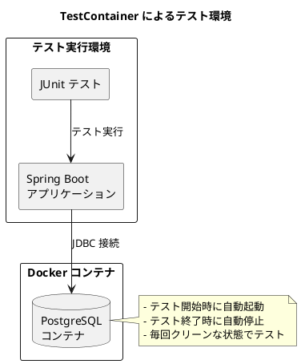
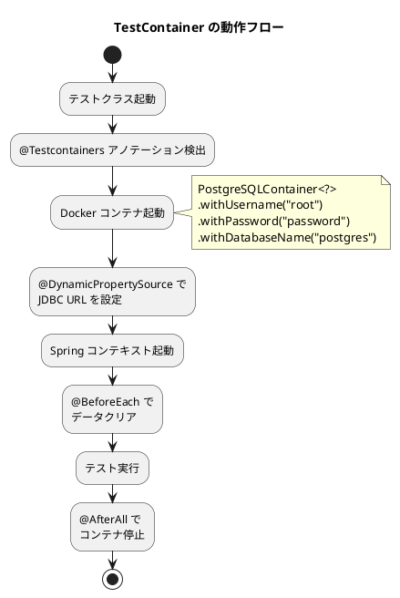
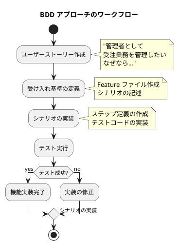

# 第19章: テスト戦略

## 19.1 テストピラミッド

### テストピラミッドの概要

テストピラミッドは、Mike Cohn が提唱したテスト戦略の概念です。下から上に向かって、単体テスト、統合テスト、E2E テストの3層で構成されます。

```plantuml
@startuml
title テストピラミッド

rectangle "E2E テスト" as e2e #LightCoral {
  note right
    Cypress による UI テスト
    ユーザーシナリオの検証
    実行時間: 長い
    数: 少ない
  end note
}

rectangle "統合テスト" as integration #LightGreen {
  note right
    API コントローラーテスト
    サービス層テスト
    リポジトリテスト
    実行時間: 中程度
    数: 中程度
  end note
}

rectangle "単体テスト" as unit #LightBlue {
  note right
    ドメインモデルテスト
    値オブジェクトテスト
    ビジネスロジックテスト
    実行時間: 短い
    数: 多い
  end note
}

e2e -[hidden]down- integration
integration -[hidden]down- unit

@enduml
```

### 単体テスト

単体テストは、個々のクラスやメソッドの動作を検証します。ドメインモデルや値オブジェクトのテストが中心です。

```java
@DisplayName("貨幣テスト")
public class MoneyTest {
    @Nested
    @DisplayName("正常値テスト")
    class Normal {

        @DisplayName("正しい金額が設定されること")
        @TestFactory
        Stream<DynamicTest> should_be_a_valid_money() {
            List<Object[]> validInputs = List.of(
                    new Object[]{10, CurrencyType.USD},
                    new Object[]{1000, CurrencyType.JPY},
                    new Object[]{50, CurrencyType.CHF}
            );
            return validInputs.stream()
                    .map(input -> dynamicTest(
                            "Accepted: " + input[0] + " " + input[1],
                            () -> assertDoesNotThrow(() -> new Money(
                                    (int) input[0],
                                    (CurrencyType) input[1]
                            ))
                    ));
        }

        @Test
        @DisplayName("円を生成できる")
        void testDefaultMultiplication() {
            Money five = Money.of(100);
            assertEquals(Money.of(200), five.times(2));
            assertEquals(Money.of(300), five.times(3));
        }

        @Test
        @DisplayName("等価性をテストする")
        void testEquality() {
            assertEquals(Money.of(100), Money.of(100));
            assertEquals(Money.dollar(5), Money.dollar(5));
            assertNotEquals(Money.dollar(5), Money.dollar(6));
            assertNotEquals(Money.franc(5), Money.dollar(5));
        }
    }
}
```

### テストの分類構造

テストは、正常値・境界値・異常値・極端値に分類して網羅的に検証します。

```java
@Nested
@DisplayName("境界値テスト")
class Boundary {

    @DisplayName("境界値が受け入れられること")
    @TestFactory
    Stream<DynamicTest> should_be_accepted() {
        List<Object[]> validInputs = List.of(
                new Object[]{0, CurrencyType.JPY},  // 最小値
                new Object[]{Integer.MAX_VALUE, CurrencyType.USD} // 最大値
        );
        return validInputs.stream()
                .map(input -> dynamicTest(
                        "Accepted: " + input[0] + " " + input[1],
                        () -> assertDoesNotThrow(() -> new Money(
                                (int) input[0],
                                (CurrencyType) input[1]
                        ))
                ));
    }

    @DisplayName("境界値外が拒否されること")
    @TestFactory
    Stream<DynamicTest> should_be_rejected() {
        List<Object[]> invalidInputs = List.of(
                new Object[]{-1, CurrencyType.JPY},  // 最小値を下回る値
                new Object[]{Integer.MIN_VALUE, CurrencyType.USD} // 極端に低い値
        );
        return invalidInputs.stream()
                .map(input -> dynamicTest(
                        "Rejected: " + input[0] + " " + input[1],
                        () -> assertThrows(IllegalArgumentException.class, () -> new Money(
                                (int) input[0],
                                (CurrencyType) input[1]
                        ))
                ));
    }
}
```

```plantuml
@startuml
title テストケースの分類

rectangle "単体テスト" {
  rectangle "正常値テスト" as normal #LightBlue {
    note right: 有効な入力に対する期待動作
  }
  rectangle "境界値テスト" as boundary #LightGreen {
    note right: 範囲の境界での動作
  }
  rectangle "異常値テスト" as abnormal #LightCoral {
    note right: 無効な入力に対するエラー処理
  }
  rectangle "極端値テスト" as extreme #LightYellow {
    note right: 極端に大きい/小さい値
  }
}

normal -[hidden]down- boundary
boundary -[hidden]down- abnormal
abnormal -[hidden]down- extreme

@enduml
```

### 統合テスト

統合テストは、複数のコンポーネントが連携して動作することを検証します。

```java
@Target(ElementType.TYPE)
@Retention(RetentionPolicy.RUNTIME)
@SpringBootTest
public @interface IntegrationTest {
}
```

### E2E テスト

E2E テストは、Cypress を使ってユーザーの操作シナリオを検証します。

```javascript
describe('在庫管理', () => {
    context('管理者', () => {
        beforeEach(() => {
            cy.login('U000003', 'a234567Z');
        })

        context('在庫新規登録', () => {
            it('新規登録', () => {
                // 在庫新規画面を開く
                cy.get('#new').click();

                // 倉庫情報を入力
                cy.get('#warehouseCode').click();
                cy.get(':nth-child(1) > .collection-object-item-actions ' +
                       '> #select-warehouse').click();

                // 商品情報を入力
                cy.get('#productCode').click();
                cy.get(':nth-child(1) > .collection-object-item-actions ' +
                       '> #select-product').click();

                // 在庫数量を入力
                cy.get('#actualStockQuantity').type('100');
                cy.get('#availableStockQuantity').type('95');

                // 在庫を保存
                cy.get('#save').click();

                // 作成完了メッセージの確認
                cy.get('#message').contains('在庫データを登録しました。');
            });
        });
    });
});
```

## 19.2 TestContainer の活用

### TestContainer とは

TestContainer は、Docker コンテナを使ってテスト用のデータベースなどを起動するライブラリです。実際のデータベースを使ったテストが可能になります。



### リポジトリテストの実装

```java
@SpringBootTest
@Testcontainers
@ActiveProfiles("container")
@DisplayName("受注レポジトリ")
class OrderRepositoryTest {
    @Container
    private static final PostgreSQLContainer<?> postgres =
            new PostgreSQLContainer<>(DockerImageName.parse("postgres:15"))
                    .withUsername("root")
                    .withPassword("password")
                    .withDatabaseName("postgres");

    @DynamicPropertySource
    static void setup(DynamicPropertyRegistry registry) {
        registry.add("spring.datasource.url", postgres::getJdbcUrl);
    }

    @Autowired
    private SalesOrderRepository repository;

    @BeforeEach
    void setUp() {
        repository.deleteAll();
    }

    @Nested
    @DisplayName("受注")
    class OrderTest {
        @Test
        @DisplayName("受注一覧を取得できる")
        void shouldRetrieveAllSalesOrders() {
            IntStream.range(0, 10).forEach(i -> {
                Order order = getSalesOrder(String.format("OD%08d", i));
                repository.save(order);
            });
            assertEquals(10, repository.selectAll().size());
        }

        @Test
        @DisplayName("受注を登録できる")
        void shouldRegisterSalesOrder() {
            Order order = getSalesOrder("OD00000001");
            repository.save(order);
            Order actual = repository.findById(order.getOrderNumber().getValue()).get();
            assertEquals(order, actual);
        }

        @Test
        @DisplayName("受注を更新できる")
        void shouldUpdateSalesOrder() {
            Order order = getSalesOrder("OD00000001");
            repository.save(order);
            order = repository.findById(order.getOrderNumber().getValue()).get();

            Order updatedOrder = Order.of(
                    order.getOrderNumber().getValue(),
                    order.getOrderDate().getValue().plusDays(1),
                    "20000",
                    order.getDepartmentStartDate().plusDays(1),
                    "002",
                    order.getCustomerCode().getBranchNumber(),
                    "EMP002",
                    order.getDesiredDeliveryDate().getValue().plusDays(3),
                    "002", "002",
                    100000, 8000,
                    "更新後備考",
                    order.getOrderLines());
            repository.save(updatedOrder);

            Order actual = repository.findById(order.getOrderNumber().getValue()).get();
            assertEquals(updatedOrder, actual);
        }

        @Test
        @DisplayName("受注を削除できる")
        void shouldDeleteSalesOrder() {
            Order order = getSalesOrder("OD00000001");
            repository.save(order);
            repository.delete(order);
            assertEquals(0, repository.selectAll().size());
        }
    }
}
```

### TestContainer の設定

TestContainer を使用するための設定は、アノテーションとプロパティソースで行います。



### テストデータファクトリ

テストデータの生成は、専用のファクトリクラスで行います。

```java
public class TestDataFactoryImpl {

    public static Order getSalesOrder(String orderNumber) {
        return Order.of(
                orderNumber,
                LocalDateTime.of(2021, 1, 1, 0, 0),
                "10000",
                LocalDateTime.of(2021, 1, 1, 0, 0),
                "001", 0,
                "EMP001",
                LocalDateTime.of(2021, 1, 10, 0, 0),
                "001", "001",
                10000, 1000,
                "テスト備考",
                List.of());
    }

    public static OrderLine getSalesOrderLine(String orderNumber, int lineNumber) {
        return OrderLine.of(
                orderNumber, lineNumber,
                "10101001", "テスト商品",
                1000, 10, 10, 0, 0, 0, 1, 100,
                LocalDateTime.of(2021, 1, 10, 0, 0), null);
    }
}
```

## 19.3 受け入れテスト

### Gherkin による仕様記述

受け入れテストは、Gherkin 記法を使ってビジネス要件を記述します。日本語で記述することで、非エンジニアも理解しやすくなります。

```gherkin
# language: ja
機能: 受注管理
  管理者として
  受注業務を管理したい
  なぜなら受注データの一元管理が必要だから

  背景:
    前提:UC001 ユーザーが登録されている
    前提:UC014 "管理者" である
    前提:UC014 "顧客データ" が登録されている
    前提:UC014 "商品データ" が登録されている
    前提:UC014 "受注データ" が登録されている

  シナリオ: 受注一覧を取得する
    もし:UC014 "受注一覧" を取得する
    ならば:UC014 "受注一覧" を取得できる

  シナリオ: 受注を新規登録する
    もし:UC014 受注番号 "OD00000009" 受注日 "2024-11-01T00:00:00+09:00"
         部門コード "10000" 顧客コード "009" 社員コード "EMP001"
         希望納期 "2024-11-10T00:00:00+09:00" で新規登録する
    ならば:UC014 "受注を登録しました" が表示される

  シナリオ: 登録済み受注を更新する
    もし:UC014 受注番号 "OD00000009" で新規登録する
    かつ:UC014 受注番号 "OD00000009" の情報を更新する
         (希望納期 "2024-11-15T00:00:00+09:00")
    ならば:UC014 "受注を更新しました" が表示される
```

```plantuml
@startuml
title Gherkin 記法の構造

rectangle "Feature ファイル" {
  rectangle "機能 (Feature)" as feature #LightBlue {
    note right
      機能の説明
      ユーザーストーリー形式
    end note
  }

  rectangle "背景 (Background)" as background #LightGreen {
    note right
      全シナリオ共通の前提条件
    end note
  }

  rectangle "シナリオ (Scenario)" as scenario #LightYellow {
    rectangle "前提 (Given)" as given
    rectangle "もし (When)" as when
    rectangle "ならば (Then)" as then
  }
}

feature -[hidden]down- background
background -[hidden]down- scenario
given -[hidden]down- when
when -[hidden]down- then

@enduml
```

### BDD アプローチ

BDD（Behavior-Driven Development）は、ビジネス要件からテストを導出する開発手法です。



### シナリオの具体例

```gherkin
シナリオ: 受注明細を追加登録する
  もし:UC014 受注番号 "OD00000009" をもとに以下の受注明細を登録する
    | 受注番号    | 枝番 | 商品コード | 商品名   | 数量 | 単価 |
    | OD00000009 | 1   | 10101001   | 鶏ささみ | 10   | 500  |
  ならば:UC014 "受注を登録しました" が表示される
  もし:UC014 受注番号 "OD00000009" で検索する
  ならば:UC014 明細データに商品コード "10101001" が含まれる

シナリオ: 登録済み受注明細を更新する
  もし:UC014 受注番号 "OD00000009" をもとに以下の受注明細を登録する
    | 受注番号    | 枝番 | 商品コード | 商品名   | 数量 | 単価 |
    | OD00000009 | 1   | 10101001   | 鶏ささみ | 10   | 500  |
  かつ:UC014 受注番号 "OD00000009" の受注明細を更新する (数量 "15")
  ならば:UC014 "受注を更新しました" が表示される
  もし:UC014 受注番号 "OD00000009" で検索する
  ならば:UC014 明細データに数量 "15" の商品コード "10101001" が含まれる

シナリオ: 顧客ごとの受注を検索する
  もし:UC014 顧客コード "001" で受注を検索する
  ならば:UC014 検索結果として受注一覧を取得できる
```

### テストの組織化

プロジェクトでは、テストを機能ごとにディレクトリ分けして管理しています。

```
src/test/
├── java/
│   └── com/example/sms/
│       ├── domain/
│       │   ├── model/          # ドメインモデルの単体テスト
│       │   └── type/           # 値オブジェクトの単体テスト
│       ├── service/            # サービス層のテスト
│       ├── presentation/       # プレゼンテーション層のテスト
│       ├── ArchitectureRuleTest.java  # アーキテクチャルール
│       └── IntegrationTest.java       # 統合テストアノテーション
└── resources/
    └── features/              # Gherkin Feature ファイル
        ├── master/            # マスタ管理
        ├── sales/             # 販売管理
        ├── procurement/       # 調達管理
        ├── inventory/         # 在庫管理
        └── system/            # システム管理
```

## まとめ

この章では、テスト戦略について解説しました。

**重要なポイント:**

1. **テストピラミッド**: 単体テスト（多）、統合テスト（中）、E2E テスト（少）の3層構造で、効率的にテストを実行します。

2. **単体テスト**: 正常値・境界値・異常値・極端値に分類して、網羅的にテストケースを作成します。`@TestFactory` と `DynamicTest` を使って、データ駆動テストを実現しています。

3. **TestContainer**: Docker コンテナを使って、実際のデータベースでリポジトリテストを実行します。毎回クリーンな状態でテストできるため、テストの信頼性が向上します。

4. **受け入れテスト**: Gherkin 記法で日本語のシナリオを記述し、BDD アプローチでビジネス要件を検証します。非エンジニアも理解しやすいドキュメントとして機能します。

次の章では、継続的リファクタリングについて解説します。貧血モデルからリッチモデルへの移行、値オブジェクトの導入などを学びます。
