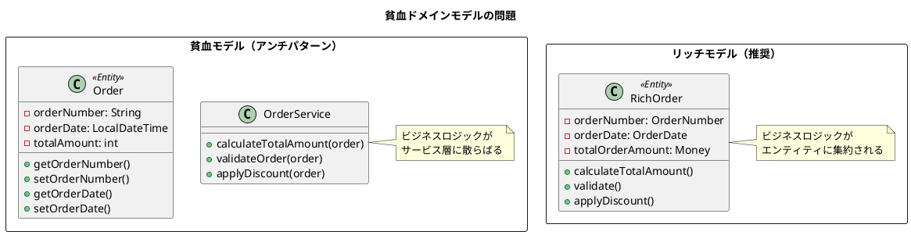
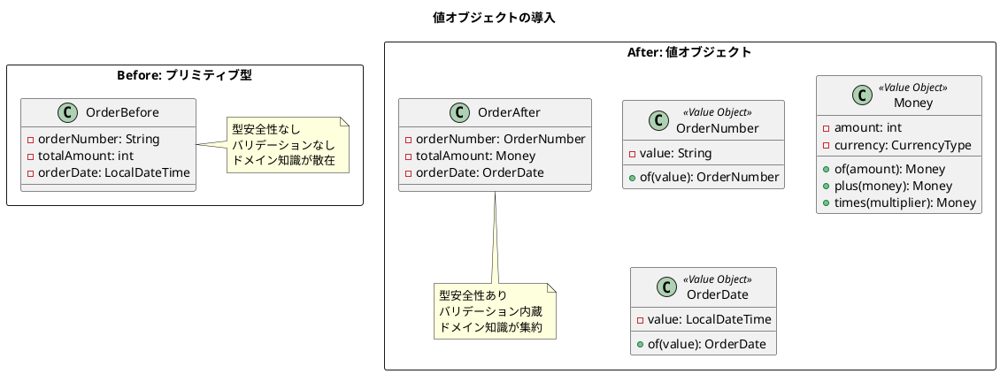
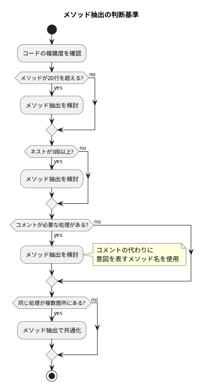
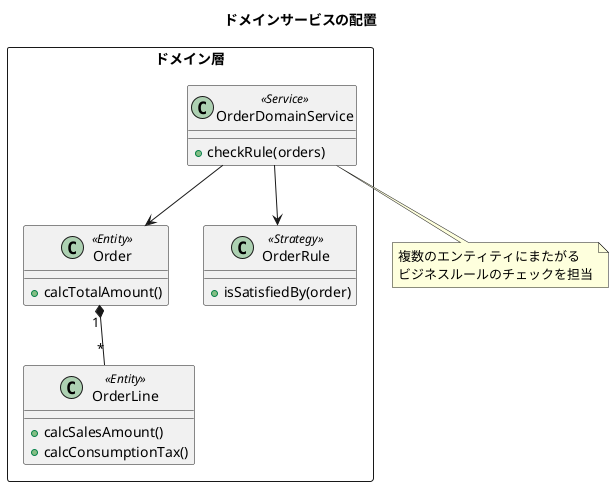
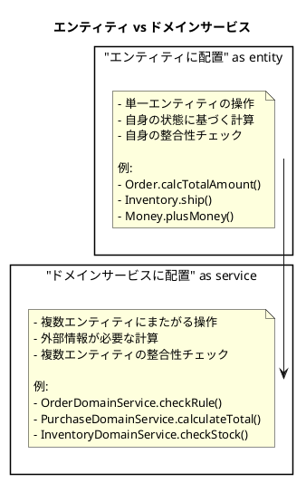
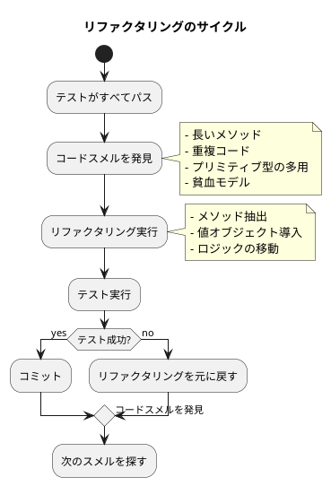

# 第20章: 継続的リファクタリング

## 20.1 貧血モデルからリッチモデルへ

### 問題の認識

貧血ドメインモデル（Anemic Domain Model）は、データの入れ物としてのみ機能し、ビジネスロジックがサービス層に散らばっている状態です。この状態では、ドメインの知識がコード全体に分散し、保守性が低下します。



### 段階的な移行

本プロジェクトでは、以下の段階でリッチモデルへ移行しています。

**Phase 1: 貧血モデルで CRUD 実装**
```java
// 初期実装：データの入れ物として機能
public class Order {
    String orderNumber;
    LocalDateTime orderDate;
    int totalOrderAmount;
    // getter/setter のみ
}
```

**Phase 2: 値オブジェクトの導入**
```java
// 値オブジェクトによる型安全性の向上
public class Order {
    OrderNumber orderNumber;
    OrderDate orderDate;
    Money totalOrderAmount;
}
```

**Phase 3: ビジネスロジックの移動**
```java
// ビジネスロジックをエンティティに移動
@Value
@Builder(toBuilder = true)
public class Order {
    OrderNumber orderNumber;
    OrderDate orderDate;
    Money totalOrderAmount;
    List<OrderLine> orderLines;

    public static Order of(...) {
        // バリデーションとビジネスルールの適用
        isTrue(!orderDate.isAfter(desiredDeliveryDate),
               "受注日は納品希望日より前に設定してください");

        // 金額の自動計算
        Money calcTotalOrderAmount = orderLines.stream()
                .map(OrderLine::calcSalesAmount)
                .reduce(Money.of(0), Money::plusMoney);

        return new Order(...);
    }
}
```

### ビジネスロジックの移動

ファクトリメソッドにビジネスロジックを集約することで、エンティティの整合性を保証します。

```java
public static Order of(String orderNumber, LocalDateTime orderDate,
        String departmentCode, LocalDateTime departmentStartDate,
        String customerCode, Integer customerBranchNumber,
        String employeeCode, LocalDateTime desiredDeliveryDate,
        String customerOrderNumber, String warehouseCode,
        Integer totalOrderAmount, Integer totalConsumptionTax,
        String remarks, List<OrderLine> orderLines) {

    // ビジネスルール: 受注日は納品希望日より前
    isTrue(!orderDate.isAfter(desiredDeliveryDate),
           "受注日は納品希望日より前に設定してください");

    // 金額の自動計算
    Money calcTotalOrderAmount = orderLines.stream()
            .map(OrderLine::calcSalesAmount)
            .reduce(Money.of(0), Money::plusMoney);

    Money calcTotalConsumptionTax = orderLines.stream()
            .map(OrderLine::calcConsumptionTaxAmount)
            .reduce(Money.of(0), Money::plusMoney);

    OrderNumber orderNumberValueObject =
            orderNumber == null ? null : OrderNumber.of(orderNumber);

    return new Order(orderNumberValueObject,
            OrderDate.of(orderDate),
            DepartmentCode.of(departmentCode),
            departmentStartDate,
            CustomerCode.of(customerCode, customerBranchNumber),
            EmployeeCode.of(employeeCode),
            DesiredDeliveryDate.of(desiredDeliveryDate),
            customerOrderNumber, warehouseCode,
            calcTotalOrderAmount, calcTotalConsumptionTax,
            remarks, orderLines, null, null, null);
}
```

## 20.2 値オブジェクトの導入

### 参照から値への変更

プリミティブ型を値オブジェクトに置き換えることで、型安全性とドメイン知識の表現が向上します。



### 不変性の利点

値オブジェクトは不変（immutable）として設計します。Lombok の `@Value` アノテーションを使用して、不変性を保証します。

```java
@Value
@NoArgsConstructor(force = true)
public class Money implements Expression {
    protected int amount;
    protected CurrencyType currency;

    public Money(int amount, CurrencyType currency) {
        isTrue(amount >= 0, "金額は0以上である必要があります。");
        notNull(currency, "通貨は必須です。");

        this.amount = amount;
        this.currency = currency;
    }

    // 新しいインスタンスを返す（不変性を維持）
    public Expression times(int multiplier) {
        return new Money(amount * multiplier, currency);
    }

    public Money plusMoney(Money other) {
        notNull(other, "加算対象の金額は必須です。");
        isTrue(this.currency.equals(other.currency),
               "異なる通貨の加算はできません。");

        return new Money(this.amount + other.amount, this.currency);
    }

    public Money subtract(Money value) {
        notNull(value, "減算対象の金額は必須です。");
        isTrue(this.currency.equals(value.currency),
               "異なる通貨の減算はできません。");

        return new Money(this.amount - value.amount, this.currency);
    }

    public static Money of(int amount) {
        return new Money(amount, CurrencyType.JPY);
    }
}
```

### 値オブジェクトの等価性

値オブジェクトは、内部の値が同じであれば等しいと見なされます。

```java
@Test
@DisplayName("等価性をテストする")
void testEquality() {
    assertEquals(Money.of(100), Money.of(100));
    assertEquals(Money.dollar(5), Money.dollar(5));
    assertNotEquals(Money.dollar(5), Money.dollar(6));
    assertNotEquals(Money.franc(5), Money.dollar(5));
    assertNotEquals(Money.of(100), Money.dollar(100));
}
```

## 20.3 メソッド抽出

### 複雑度の測定

メソッドが長くなったり、複雑度が高くなったりした場合は、メソッド抽出を検討します。



### 抽出のタイミング

**抽出前:**
```java
public void aggregate() {
    PurchaseList purchaseList = purchaseRepository.selectAll();

    Map<String, List<Purchase>> purchasesBySupplier = purchaseList.asList().stream()
            .collect(Collectors.groupingBy(purchase ->
                purchase.getSupplierCode().getCode().getValue() + "-" +
                purchase.getSupplierCode().getBranchNumber()
            ));

    final int[] counter = {1};
    purchasesBySupplier.forEach((supplierKey, purchases) -> {
        if (purchases.isEmpty()) return;

        Purchase firstPurchase = purchases.get(0);
        PurchasePaymentDate paymentDate = PurchasePaymentDate.now();

        // 長い処理が続く...
    });
}
```

**抽出後:**
```java
public void aggregate() {
    PurchaseList purchaseList = purchaseRepository.selectAll();
    Map<String, List<Purchase>> purchasesBySupplier = groupBySupplier(purchaseList);

    final int[] counter = {1};
    purchasesBySupplier.forEach((supplierKey, purchases) -> {
        registerPurchasePaymentApplication(purchases, counter[0]++);
    });
}

private Map<String, List<Purchase>> groupBySupplier(PurchaseList purchaseList) {
    return purchaseList.asList().stream()
            .collect(Collectors.groupingBy(this::getSupplierKey));
}

private String getSupplierKey(Purchase purchase) {
    return purchase.getSupplierCode().getCode().getValue() + "-" +
           purchase.getSupplierCode().getBranchNumber();
}
```

### メソッド抽出のガイドライン

1. **単一責任**: 各メソッドは1つのことだけを行う
2. **意図を表す名前**: コメントの代わりにメソッド名で説明
3. **適切な粒度**: 5〜15行程度が理想的
4. **テストの維持**: 抽出後もテストがパスすることを確認

## 20.4 ドメインサービス

### 適切な配置

ドメインサービスは、複数のエンティティにまたがるビジネスロジックを配置する場所です。



### サービスの責務

ドメインサービスは、以下のような責務を持ちます。

```java
@Service
public class OrderDomainService {

    /**
     * 受注ルールチェック
     * 複数の受注に対して、複数のルールを適用
     */
    public OrderRuleCheckList checkRule(OrderList salesOrders) {
        List<Map<String, String>> checkList = new ArrayList<>();

        List<Order> orderList = salesOrders.asList();

        // Strategy パターンでルールをインスタンス化
        OrderRule orderAmountRule = new OrderAmountRule();
        OrderRule orderDeliveryRule = new OrderDeliveryRule();
        OrderRule orderDeliveryOverDueRule = new OrderDeliveryOverDueRule();

        BiConsumer<String, String> addCheck = (orderNumber, message) -> {
            Map<String, String> errorMap = new HashMap<>();
            errorMap.put(orderNumber, message);
            checkList.add(errorMap);
        };

        orderList.forEach(salesOrder -> {
            // 金額ルールチェック
            if (orderAmountRule.isSatisfiedBy(salesOrder)) {
                addCheck.accept(salesOrder.getOrderNumber().getValue(),
                               "受注金額が100万円を超えています。");
            }

            // 明細ごとのルールチェック
            salesOrder.getOrderLines().forEach(salesOrderLine -> {
                if (orderDeliveryRule.isSatisfiedBy(salesOrder, salesOrderLine)) {
                    addCheck.accept(salesOrder.getOrderNumber().getValue(),
                                   "納期が受注日より前です。");
                }
                if (orderDeliveryOverDueRule.isSatisfiedBy(salesOrder, salesOrderLine)) {
                    addCheck.accept(salesOrder.getOrderNumber().getValue(),
                                   "納期を超過しています。");
                }
            });
        });

        return new OrderRuleCheckList(checkList);
    }
}
```

### エンティティとドメインサービスの使い分け



### リファクタリングのサイクル



## まとめ

この章では、継続的リファクタリングについて解説しました。

**重要なポイント:**

1. **貧血モデルからリッチモデルへ**: ビジネスロジックをサービス層からエンティティに移動し、ドメインの知識を集約します。段階的に移行することで、リスクを最小化できます。

2. **値オブジェクトの導入**: プリミティブ型を値オブジェクトに置き換えることで、型安全性とドメイン知識の表現が向上します。不変性により、副作用のないコードが実現できます。

3. **メソッド抽出**: 複雑なメソッドを小さなメソッドに分割し、可読性と保守性を向上させます。コメントの代わりに意図を表すメソッド名を使用します。

4. **ドメインサービス**: 複数のエンティティにまたがるビジネスロジックは、ドメインサービスに配置します。エンティティとドメインサービスの責務を明確に分けることが重要です。

次の章では、アーキテクチャの検証について解説します。ArchUnit によるルール強制、JIG によるドキュメント生成を学びます。
