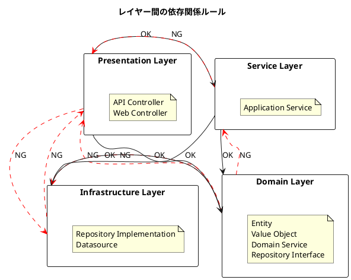
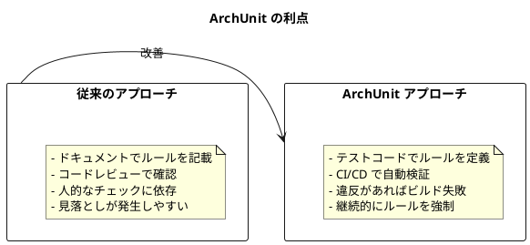
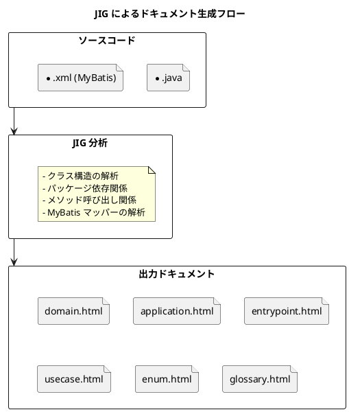
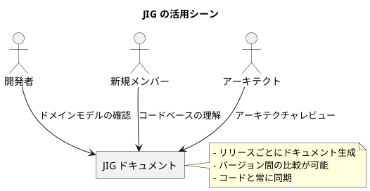
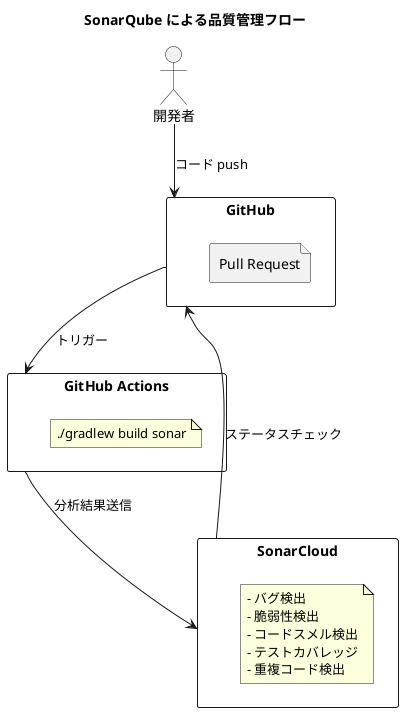
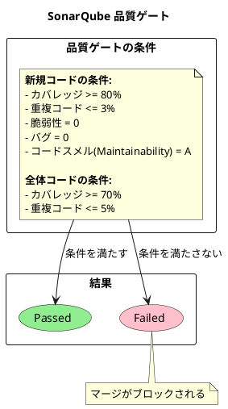
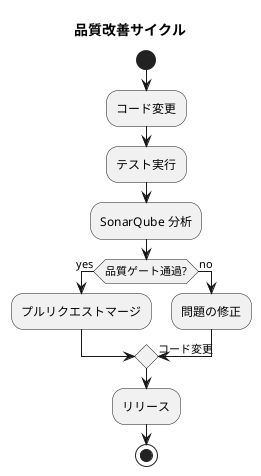
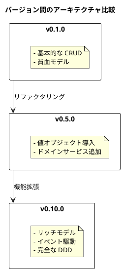
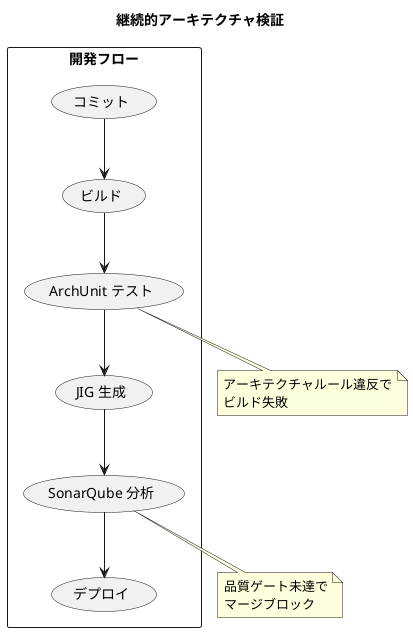

# 第21章: アーキテクチャの検証

## 21.1 ArchUnit によるルール強制

### アーキテクチャルールの自動検証

アーキテクチャは設計時点で定義されても、開発が進むにつれて逸脱が発生しがちです。ArchUnit は、Java のアーキテクチャルールをテストコードとして記述し、自動的に検証するライブラリです。

```plantuml
@startuml
title ArchUnit によるアーキテクチャ検証

rectangle "アーキテクチャルール" as rules {
  note as N1
    - レイヤー間の依存関係
    - 命名規則
    - パッケージ構造
  end note
}

rectangle "テストコード" as test {
  class ArchitectureRuleTest {
    + presentationLayerShouldOnlyAccessServiceLayerAndDomainLayer()
    + serviceLayerShouldOnlyAccessDomainAndInfrastructureLayers()
    + domainLayerShouldNotAccessOtherLayers()
    + infrastructureLayerShouldNotAccessNonDomainLayers()
  }
}

rectangle "ソースコード" as source {
  package presentation
  package service
  package domain
  package infrastructure
}

rules --> test : "ルールを\nテストで表現"
test --> source : "自動検証"

@enduml
```

### 依存関係の設定

ArchUnit を使用するには、build.gradle に依存関係を追加します。

```groovy
dependencies {
    testImplementation 'com.tngtech.archunit:archunit:1.4.1'
    testImplementation 'com.tngtech.archunit:archunit-junit5:1.4.1'
}
```

### レイヤードアーキテクチャのルール

本プロジェクトでは、以下のレイヤー間依存関係を ArchUnit でテストしています。



### テストの実装

```java
@AnalyzeClasses(packages = "com.example.sms")
@DisplayName("アーキテクチャルール")
public class ArchitectureRuleTest {

    @Test
    @DisplayName("プレゼンテーション層はサービス層とドメイン層にアクセスできる")
    public void presentationLayerShouldOnlyAccessServiceLayerAndDomainLayer() {
        JavaClasses importedClasses = new ClassFileImporter()
                .importPackages("com.example.sms");
        ArchRuleDefinition.noClasses()
                .that()
                .resideInAPackage("..presentation..")
                .should()
                .accessClassesThat()
                .resideInAPackage("..infrastructure..")
                .allowEmptyShould(true)
                .check(importedClasses);
    }

    @Test
    @DisplayName("サービス層はドメイン層とインフラストラクチャ層のみにアクセスできる")
    public void serviceLayerShouldOnlyAccessDomainAndInfrastructureLayers() {
        JavaClasses importedClasses = new ClassFileImporter()
                .importPackages("com.example.sms");
        ArchRuleDefinition.noClasses()
                .that()
                .resideInAPackage("..service..")
                .should()
                .accessClassesThat()
                .resideInAPackage("..presentation..")
                .allowEmptyShould(true)
                .check(importedClasses);
    }

    @Test
    @DisplayName("ドメイン層は他の層にアクセスできない")
    public void domainLayerShouldNotAccessOtherLayers() {
        JavaClasses importedClasses = new ClassFileImporter()
                .importPackages("com.example.sms");

        // プレゼンテーション層へのアクセス禁止
        ArchRuleDefinition.noClasses()
                .that()
                .resideInAPackage("..domain..")
                .should()
                .accessClassesThat()
                .resideInAPackage("..presentation..")
                .allowEmptyShould(true)
                .check(importedClasses);

        // サービス層へのアクセス禁止
        ArchRuleDefinition.noClasses()
                .that()
                .resideInAPackage("..domain..")
                .should()
                .accessClassesThat()
                .resideInAPackage("..service..")
                .allowEmptyShould(true)
                .check(importedClasses);

        // インフラストラクチャ層へのアクセス禁止
        ArchRuleDefinition.noClasses()
                .that()
                .resideInAPackage("..domain..")
                .should()
                .accessClassesThat()
                .resideInAPackage("..infrastructure..")
                .allowEmptyShould(true)
                .check(importedClasses);
    }

    @Test
    @DisplayName("インフラストラクチャ層はドメイン層とサービス層以外にアクセスできない")
    public void infrastructureLayerShouldNotAccessNonDomainLayers() {
        JavaClasses importedClasses = new ClassFileImporter()
                .importPackages("com.example.sms");
        ArchRuleDefinition.noClasses()
                .that()
                .resideInAPackage("..infrastructure..")
                .should()
                .accessClassesThat()
                .resideInAPackage("..presentation..")
                .allowEmptyShould(true)
                .check(importedClasses);
    }
}
```

### ArchUnit の利点



## 21.2 JIG によるドキュメント生成

### JIG とは

JIG（Java Instant-documentation Generator）は、Java のソースコードから自動的にドキュメントを生成するツールです。ドメイン駆動設計の観点からコードを分析し、ビジネスルールの可視化を支援します。



### Gradle への設定

JIG を Gradle プロジェクトに導入するには、以下のようにプラグインを追加します。

```groovy
plugins {
    id 'org.dddjava.jig-gradle-plugin' version '2025.10.1'
}
```

JIG の設定ファイル（jig.properties）で出力形式をカスタマイズできます。

```properties
jig.erd.output.directory=./build/jig-erd
jig.erd.output.prefix=library-er
jig.erd.output.format=svg
```

### 生成されるドキュメント

JIG は以下のドキュメントを生成します。

| ドキュメント | 説明 |
|------------|------|
| domain.html | ドメインモデルの一覧と関連図 |
| application.html | アプリケーションサービスの一覧 |
| entrypoint.html | API エントリーポイントの一覧 |
| usecase.html | ユースケースの一覧 |
| enum.html | 列挙型の一覧と値 |
| glossary.html | 用語集（クラス名と Javadoc） |
| package.html | パッケージ依存関係図 |
| repository.html | リポジトリの一覧 |
| sequence.html | シーケンス図 |
| insight.html | コード品質のインサイト |

### ドキュメントの構造

```plantuml
@startuml
title JIG ドキュメントの構造

package "index.html" {
  rectangle "ドメイン" {
    file "domain.html" : ビジネスルール
    file "enum.html" : 区分
    file "glossary.html" : 用語集
  }

  rectangle "アプリケーション" {
    file "application.html" : サービス
    file "usecase.html" : ユースケース
    file "repository.html" : リポジトリ
  }

  rectangle "エントリーポイント" {
    file "entrypoint.html" : API/画面
  }

  rectangle "構造" {
    file "package.html" : パッケージ関連
    file "sequence.html" : シーケンス
  }

  rectangle "インサイト" {
    file "insight.html" : 品質メトリクス
  }
}

@enduml
```

### JIG の活用シーン



## 21.3 SonarQube による品質メトリクス

### 継続的コード品質

SonarQube は、コードの品質を継続的に測定・監視するプラットフォームです。GitHub Actions と連携して、プルリクエストごとにコード品質をチェックします。



### GitHub Actions の設定

```yaml
name: SonarQube
on:
  push:
    branches:
      - main
  pull_request:
    types: [opened, synchronize, reopened]
jobs:
  build:
    name: Build and analyze
    runs-on: ubuntu-latest
    steps:
      - uses: actions/checkout@v4
        with:
          fetch-depth: 0  # 完全な履歴を取得

      - name: Set up JDK
        uses: actions/setup-java@v4
        with:
          java-version: '25'
          distribution: 'oracle'

      - name: Grant execute permission for Gradle wrapper
        run: chmod +x ./gradlew
        working-directory: app/backend/sms

      - name: Cache SonarQube packages
        uses: actions/cache@v4
        with:
          path: ~/.sonar/cache
          key: ${{ runner.os }}-sonar
          restore-keys: ${{ runner.os }}-sonar

      - name: Cache Gradle packages
        uses: actions/cache@v4
        with:
          path: ~/.gradle/caches
          key: ${{ runner.os }}-gradle-${{ hashFiles('**/*.gradle') }}
          restore-keys: ${{ runner.os }}-gradle

      - name: Build and analyze
        env:
          GITHUB_TOKEN: ${{ secrets.GITHUB_TOKEN }}
          SONAR_TOKEN: ${{ secrets.SONAR_TOKEN }}
        run: ./gradlew build sonar --info
        working-directory: app/backend/sms
```

### Gradle での SonarQube 設定

```groovy
plugins {
    id "org.sonarqube" version "7.0.1.6134"
    id 'jacoco'
}

sonar {
    properties {
        property "sonar.projectKey", "k2works_case-study-sales"
        property "sonar.organization", "k2works"
        property "sonar.host.url", "https://sonarcloud.io"
        property "sonar.exclusions", "**/autogen/**"
    }
}

test {
    finalizedBy jacocoTestReport
}

jacocoTestReport {
    reports {
        xml.required = true
        html.required = true
    }
}
```

### 品質ゲート

SonarQube の品質ゲートは、コードがリリース可能かどうかを判断する基準です。



### メトリクスの種類

| メトリクス | 説明 | 目標値 |
|-----------|------|--------|
| Bugs | 潜在的なバグ | 0 |
| Vulnerabilities | セキュリティ脆弱性 | 0 |
| Code Smells | 保守性の問題 | 最小限 |
| Coverage | テストカバレッジ | 80% 以上 |
| Duplications | コードの重複率 | 3% 以下 |
| Technical Debt | 技術的負債の推定時間 | 最小限 |

### 品質改善サイクル



## 21.4 アーキテクチャの進化

### バージョン間の比較

JIG ドキュメントをリリースごとに保存することで、アーキテクチャの進化を追跡できます。



### 継続的検証の仕組み



## まとめ

この章では、アーキテクチャの検証について解説しました。

**重要なポイント:**

1. **ArchUnit によるルール強制**: アーキテクチャルールをテストコードとして記述し、CI/CD パイプラインで自動的に検証します。レイヤー間の依存関係違反を早期に検出できます。

2. **JIG によるドキュメント生成**: ソースコードから自動的にドキュメントを生成し、ドメインモデルやアプリケーション構造を可視化します。コードと常に同期したドキュメントが得られます。

3. **SonarQube による品質メトリクス**: コードの品質を継続的に測定し、バグや脆弱性、コードスメルを検出します。品質ゲートにより、一定の品質基準を維持できます。

4. **継続的検証**: これらのツールを組み合わせることで、アーキテクチャの整合性と品質を継続的に保証します。リリースごとにドキュメントを保存することで、アーキテクチャの進化も追跡できます。

これで第7部「品質とリファクタリング」は完了です。次の部では、付録としてリファレンス情報を提供します。
