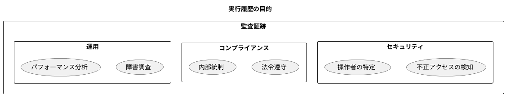
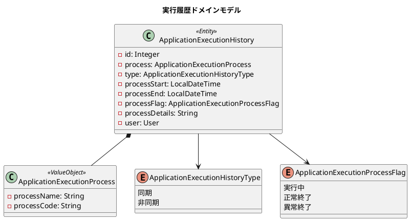
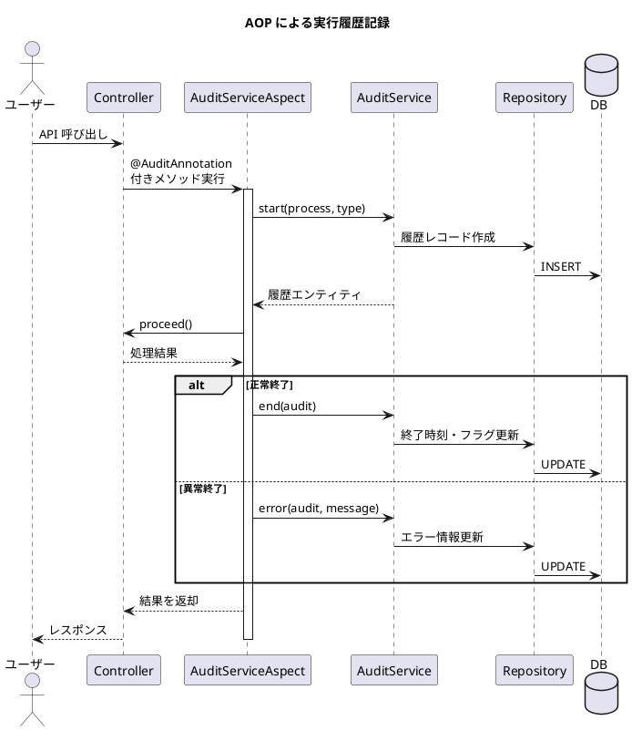
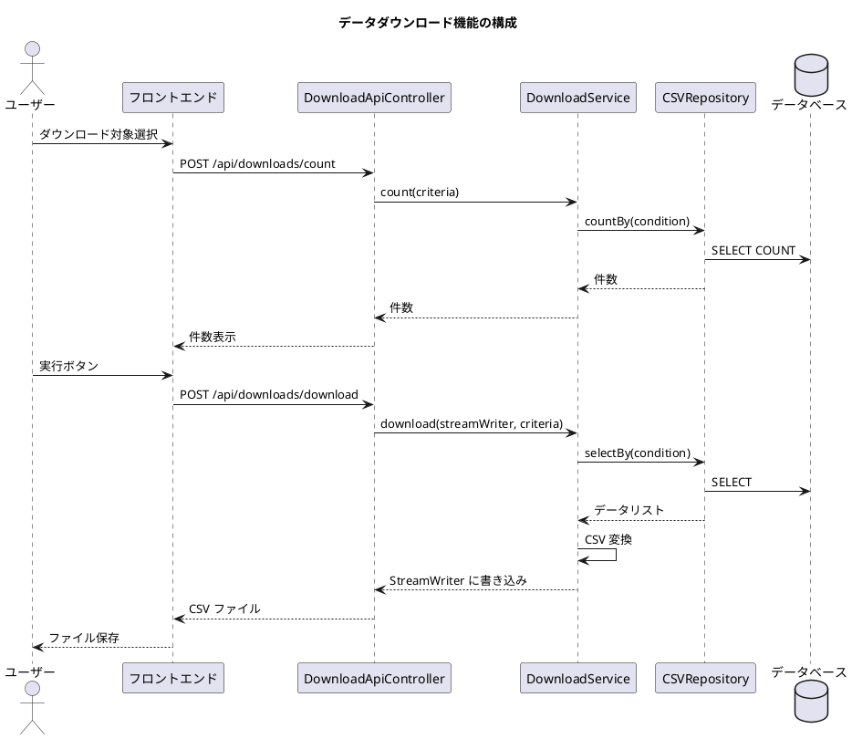
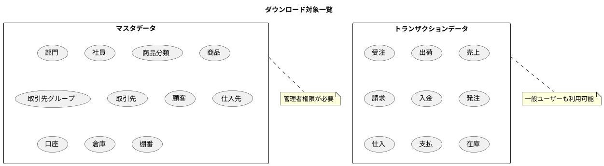
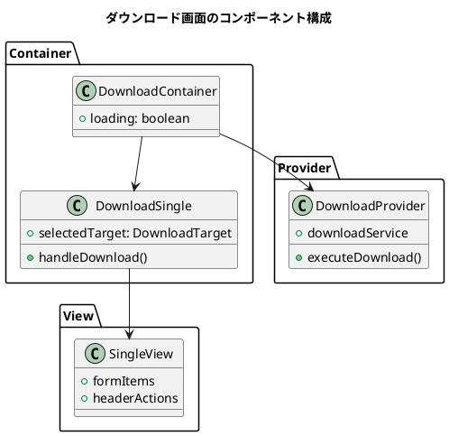
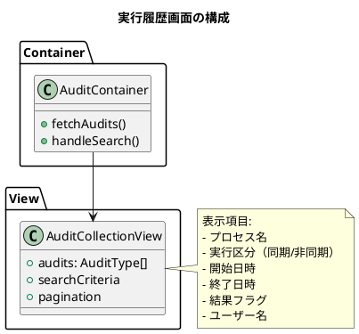

# 第22章: 非機能要件

## 22.1 実行履歴管理

### 実行履歴の必要性

エンタープライズシステムでは、「誰が」「いつ」「何を」実行したかを記録することが重要です。これは監査証跡（Audit Trail）として、セキュリティ、コンプライアンス、トラブルシューティングの観点から必須の機能です。



### 実行履歴ドメインモデル

実行履歴は以下の情報を記録します。



### 実行プロセス区分

システム内の各操作に対応するプロセス区分を定義します。

```java
/**
 * アプリケーション実行プロセス区分
 */
@Getter
public enum ApplicationExecutionProcessType {
    ユーザー登録("ユーザー登録", "0001"),
    ユーザー更新("ユーザー更新", "0002"),
    ユーザー削除("ユーザー削除", "0003"),
    部門登録("部門登録", "0004"),
    部門更新("部門更新", "0005"),
    部門削除("部門削除", "0006"),
    // ... マスタ操作
    受注登録("受注登録", "0034"),
    受注更新("受注更新", "0035"),
    受注削除("受注削除", "0036"),
    出荷登録("出荷登録", "0037"),
    // ... トランザクション操作
    在庫登録("在庫登録", "0056"),
    在庫更新("在庫更新", "0057"),
    在庫削除("在庫削除", "0058"),
    在庫調整("在庫調整", "0059"),
    // ... 在庫操作
    データダウンロード("データダウンロード", "9001"),
    その他("その他", "9999");

    private final String name;
    private final String code;

    ApplicationExecutionProcessType(String name, String code) {
        this.name = name;
        this.code = code;
    }
}
```

### AOP による自動記録

Spring AOP を使用して、アノテーションベースで実行履歴を自動記録します。



### 監査アノテーション

```java
@Target(ElementType.METHOD)
@Retention(RetentionPolicy.RUNTIME)
public @interface AuditAnnotation {
    ApplicationExecutionProcessType process();
    ApplicationExecutionHistoryType type();
}
```

### Aspect の実装

```java
@Slf4j
@Aspect
@Component
public class AuditServiceAspect {
    private final AuditService auditService;

    @Autowired
    public AuditServiceAspect(AuditService auditService) {
        this.auditService = auditService;
    }

    @Around("@annotation(auditAnnotation)")
    public Object handleAuditAspect(ProceedingJoinPoint joinPoint,
                                     AuditAnnotation auditAnnotation) throws Throwable {
        // プロセス情報取得
        ApplicationExecutionProcessType process =
            ApplicationExecutionProcessType.fromNameAndCode(
                auditAnnotation.process().getName(),
                auditAnnotation.process().getCode());
        ApplicationExecutionHistoryType type =
            ApplicationExecutionHistoryType.fromName(auditAnnotation.type().getName());

        // 実行開始記録
        ApplicationExecutionHistory audit = auditService.start(process, type);
        log.info("{}:{}を開始しました", audit.getProcessStart(), process.getName());

        try {
            // 対象メソッド実行
            Object result = joinPoint.proceed();

            // 正常終了記録
            audit = auditService.end(audit);
            log.info("{}:{}を終了しました", audit.getProcessEnd(), process.getName());
            return result;
        } catch (Throwable e) {
            // 異常終了記録
            auditService.error(audit, e.getMessage());
            log.error("{}:{}でエラーが発生しました", audit.getProcessEnd(), process.getName());
            throw e;
        }
    }
}
```

### コントローラでの使用例

```java
@Operation(summary = "受注を登録する")
@PostMapping
@AuditAnnotation(process = ApplicationExecutionProcessType.受注登録,
                 type = ApplicationExecutionHistoryType.同期)
public ResponseEntity<?> create(@RequestBody OrderResource resource) {
    try {
        Order order = convertToEntity(resource);
        salesOrderService.register(order);
        return ResponseEntity.ok(new MessageResponse(
            message.getMessage("success.order.registered")));
    } catch (BusinessException | IllegalArgumentException e) {
        return ResponseEntity.badRequest().body(new MessageResponse(e.getMessage()));
    }
}
```

### 実行履歴 API

```java
@RestController
@RequestMapping("/api/audits")
@Tag(name = "Audit", description = "監査")
public class AuditApiController {
    final AuditService auditService;

    @Operation(summary = "アプリケーション実行履歴一覧を取得する")
    @GetMapping
    public ResponseEntity<?> select(
            @RequestParam(value = "pageSize", defaultValue = "10") int pageSize,
            @RequestParam(value = "page", defaultValue = "1") int... page) {
        PageNation.startPage(page, pageSize);
        PageInfo<ApplicationExecutionHistory> result = auditService.selectAllWithPageInfo();
        return ResponseEntity.ok(result);
    }

    @PreAuthorize("hasRole('ADMIN')")
    @Operation(summary = "アプリケーション実行履歴を検索する")
    @PostMapping("/search")
    public ResponseEntity<?> search(
            @RequestBody AuditCriteriaResource resource,
            @RequestParam(value = "pageSize", defaultValue = "10") int pageSize,
            @RequestParam(value = "page", defaultValue = "1") int... page) {
        PageNation.startPage(page, pageSize);
        AuditCriteria criteria = convertToCriteria(resource);
        PageInfo<ApplicationExecutionHistory> result = auditService.searchWithPageInfo(criteria);
        return ResponseEntity.ok(result);
    }
}
```

---

## 22.2 データダウンロード機能

### ダウンロード機能の設計

業務システムでは、データを CSV 形式でダウンロードする機能が必須です。バックアップ、データ移行、外部システム連携、レポート作成など多様な用途に対応します。



### ダウンロード対象

システム内の主要なデータはすべてダウンロード可能です。



### ダウンロード条件の定義

```java
/**
 * ダウンロード対象
 */
public enum DownloadTarget {
    部門("department.csv"),
    社員("employee.csv"),
    商品分類("product_category.csv"),
    商品("product.csv"),
    取引先グループ("partner_group.csv"),
    取引先("partner.csv"),
    顧客("customer.csv"),
    仕入先("vendor.csv"),
    口座("payment_account.csv"),
    受注("order.csv"),
    出荷("shipping.csv"),
    売上("sales.csv"),
    請求("invoice.csv"),
    入金("payment.csv"),
    発注("purchase_order.csv"),
    仕入("purchase.csv"),
    支払("purchase_payment.csv"),
    在庫("inventory.csv"),
    倉庫("warehouse.csv"),
    棚番("location_number.csv");

    private final String fileName;

    DownloadTarget(String fileName) {
        this.fileName = fileName;
    }
}
```

### ダウンロードサービス

```java
@Service
public class DownloadService {
    // 各種 CSV リポジトリ
    private final DepartmentCSVRepository departmentCSVRepository;
    private final EmployeeCSVRepository employeeCSVRepository;
    private final ProductCSVRepository productCSVRepository;
    // ... 省略

    /**
     * ダウンロード件数取得
     */
    public int count(DownloadCriteria condition) {
        return switch (condition.getTarget()) {
            case 部門 -> {
                checkPermission("ROLE_ADMIN");
                yield departmentCSVRepository.countBy(condition);
            }
            case 社員 -> {
                checkPermission("ROLE_ADMIN");
                yield employeeCSVRepository.countBy(condition);
            }
            case 受注 -> orderCSVRepository.countBy(condition);
            case 在庫 -> inventoryCSVRepository.countBy(condition);
            // ... 他の対象
        };
    }

    /**
     * ダウンロード実行
     */
    public void download(OutputStreamWriter streamWriter,
                         DownloadCriteria condition) throws Exception {
        switch (condition.getTarget()) {
            case 部門 -> writeCsv(DepartmentDownloadCSV.class)
                .accept(streamWriter, convert(condition));
            case 社員 -> writeCsv(EmployeeDownloadCSV.class)
                .accept(streamWriter, convert(condition));
            case 受注 -> writeCsv(OrderDownloadCSV.class)
                .accept(streamWriter, convert(condition));
            case 在庫 -> writeCsv(InventoryDownloadCSV.class)
                .accept(streamWriter, convert(condition));
            // ... 他の対象
        }
    }
}
```

### ダウンロード API

```java
@Slf4j
@RestController
@RequestMapping("/api/downloads")
@Tag(name = "Download", description = "データダウンロード")
public class DownloadApiController {
    final DownloadService downloadService;

    @Operation(summary = "ダウンロード件数", description = "ダウンロード件数を取得する")
    @PostMapping("/count")
    public ResponseEntity<?> count(@RequestBody DownloadCriteriaResource resource) {
        try {
            DownloadCriteria condition = DownloadCriteriaResource.of(resource.getTarget());
            return ResponseEntity.ok(downloadService.count(condition));
        } catch (RuntimeException e) {
            return ResponseEntity.badRequest().body(new MessageResponse(e.getMessage()));
        }
    }

    @Operation(summary = "ダウンロード", description = "ダウンロードする")
    @PostMapping("/download")
    @AuditAnnotation(process = ApplicationExecutionProcessType.データダウンロード,
                     type = ApplicationExecutionHistoryType.同期)
    public void download(@RequestBody DownloadCriteriaResource resource,
                         HttpServletResponse response) {
        DownloadCriteria condition = DownloadCriteriaResource.of(resource.getTarget());
        response.setHeader(HttpHeaders.CONTENT_DISPOSITION,
            "attachment; filename=" + condition.getFileName());
        try (OutputStreamWriter streamWriter =
                new OutputStreamWriter(response.getOutputStream(), "Windows-31J")) {
            downloadService.download(streamWriter, condition);
        } catch (Exception e) {
            log.error("ダウンロードエラー", e);
        }
    }
}
```

### 権限によるアクセス制御

マスタデータのダウンロードは管理者権限が必要です。

```plantuml
@startuml
title ダウンロード権限マトリクス

|= 対象 |= 一般ユーザー |= 管理者 |
| 部門 | X | O |
| 社員 | X | O |
| 商品分類 | X | O |
| 商品 | X | O |
| 取引先 | X | O |
| 顧客 | X | O |
| 仕入先 | X | O |
| 口座 | X | O |
| 倉庫 | X | O |
| 棚番 | X | O |
| 受注 | O | O |
| 出荷 | O | O |
| 売上 | O | O |
| 請求 | O | O |
| 入金 | O | O |
| 発注 | O | O |
| 仕入 | O | O |
| 支払 | O | O |
| 在庫 | O | O |

@enduml
```

---

## 22.3 React コンポーネントの実装

### ダウンロード画面の構成



### ダウンロード対象の型定義

```typescript
export const DownloadTarget = {
    部門: "部門",
    社員: "社員",
    商品分類: "商品分類",
    商品: "商品",
    取引先グループ: "取引先グループ",
    取引先: "取引先",
    顧客: "顧客",
    仕入先: "仕入先",
    口座: "口座",
    受注: "受注",
    出荷: "出荷",
    売上: "売上",
    請求: "請求",
    入金: "入金",
    発注: "発注",
    仕入: "仕入",
    支払: "支払",
    在庫: "在庫",
    倉庫: "倉庫",
    棚番: "棚番",
} as const;

export type DownloadTarget = typeof DownloadTarget[keyof typeof DownloadTarget];
```

### ダウンロード画面の実装

```typescript
interface FormProps {
    selectedTarget: DownloadTarget | null;
    setSelectedTarget: React.Dispatch<React.SetStateAction<DownloadTarget | null>>;
}

const Form: React.FC<FormProps> = ({ selectedTarget, setSelectedTarget }) => {
    return (
        <div className="single-view-content-item-form">
            <label htmlFor="downloadTarget" className="form-label">
                ダウンロード対象
            </label>
            <select
                id="downloadTarget"
                value={selectedTarget ?? ""}
                onChange={(e) => setSelectedTarget(e.target.value as DownloadTarget)}
                className="dropdown"
            >
                <option value="" disabled>
                    対象を選択してください
                </option>
                <option value={DownloadTarget.部門}>部門</option>
                <option value={DownloadTarget.社員}>社員</option>
                <option value={DownloadTarget.商品分類}>商品分類</option>
                <option value={DownloadTarget.商品}>商品</option>
                <option value={DownloadTarget.取引先グループ}>取引先グループ</option>
                <option value={DownloadTarget.取引先}>取引先</option>
                <option value={DownloadTarget.顧客}>顧客</option>
                <option value={DownloadTarget.仕入先}>仕入先</option>
                <option value={DownloadTarget.口座}>口座</option>
                <option value={DownloadTarget.受注}>受注</option>
                <option value={DownloadTarget.出荷}>出荷</option>
                <option value={DownloadTarget.売上}>売上</option>
                <option value={DownloadTarget.請求}>請求</option>
                <option value={DownloadTarget.入金}>入金</option>
                <option value={DownloadTarget.発注}>発注</option>
                <option value={DownloadTarget.仕入}>仕入</option>
                <option value={DownloadTarget.支払}>支払</option>
                <option value={DownloadTarget.在庫}>在庫</option>
                <option value={DownloadTarget.倉庫}>倉庫</option>
                <option value={DownloadTarget.棚番}>棚番</option>
            </select>
        </div>
    );
};
```

### ダウンロード実行処理

```typescript
const handleDownload = async () => {
    if (!selectedTarget) {
        setError("ダウンロード対象を選択してください");
        return;
    }

    setLoading(true);
    try {
        // Blob としてダウンロード
        const response = await downloadService.download(selectedTarget);
        const blob = new Blob([response], { type: 'text/csv;charset=Windows-31J' });
        const url = window.URL.createObjectURL(blob);

        // ダウンロードリンク作成
        const link = document.createElement('a');
        link.href = url;
        link.download = `${selectedTarget}.csv`;
        document.body.appendChild(link);
        link.click();

        // クリーンアップ
        window.URL.revokeObjectURL(url);
        document.body.removeChild(link);

        setMessage("ダウンロードが完了しました");
    } catch (error) {
        setError("ダウンロードに失敗しました");
    } finally {
        setLoading(false);
    }
};
```

---

## 22.4 実行履歴画面の実装

### 実行履歴一覧画面



### 実行履歴の型定義

```typescript
export interface AuditType {
    id: number;
    process: {
        processName: string;
        processCode: string;
    };
    type: "同期" | "非同期";
    processStart: string;
    processEnd: string | null;
    processFlag: "実行中" | "正常終了" | "異常終了";
    processDetails: string | null;
    user: {
        userId: string;
        userName: string;
    };
}

export interface AuditCriteriaType {
    processType?: string;
    type?: string;
    processFlag?: string;
}
```

---

## まとめ

この章では、非機能要件として実行履歴管理とデータダウンロード機能について解説しました。

**重要なポイント:**

1. **実行履歴管理**: AOP を活用したアノテーションベースの自動記録により、コードへの侵襲を最小限に抑えながら監査証跡を実現しています。

2. **データダウンロード**: システム内の全データを CSV 形式でエクスポート可能にし、バックアップ、データ移行、外部連携に対応しています。

3. **権限管理**: マスタデータのダウンロードは管理者に限定し、トランザクションデータは一般ユーザーも利用可能とすることで、セキュリティと利便性のバランスを取っています。

4. **横断的関心事の分離**: Spring AOP により、ビジネスロジックと監査ロジックを分離し、保守性の高い実装を実現しています。

次の章では、リリース管理について解説します。バージョニング戦略、CI/CD パイプライン、ドキュメント管理について説明します。
