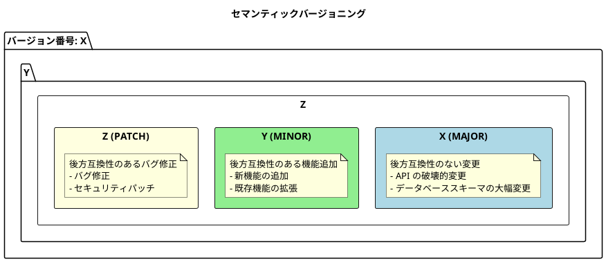
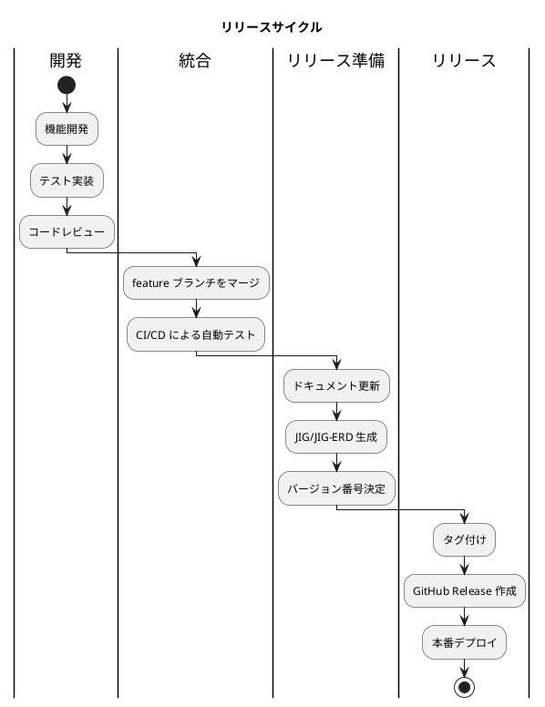
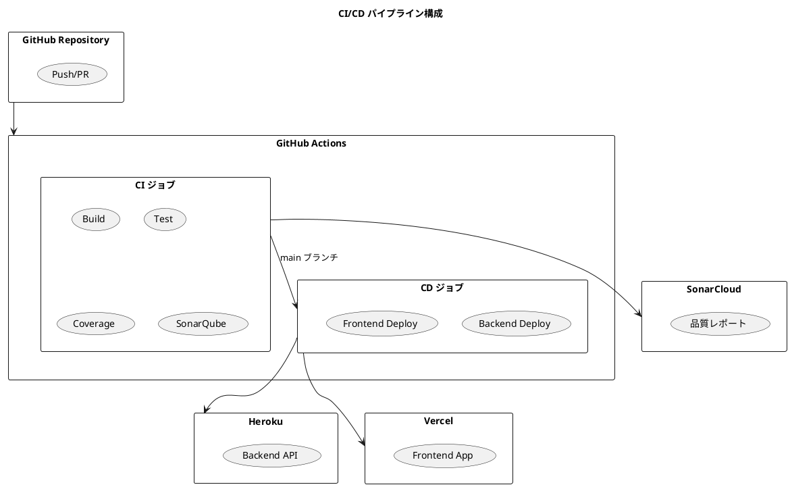
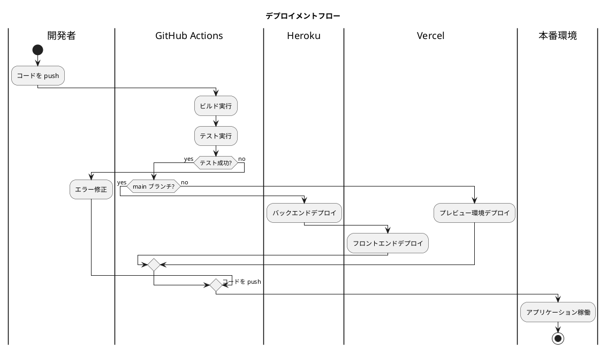
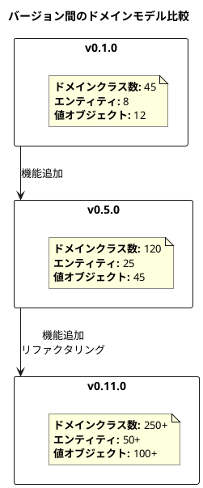
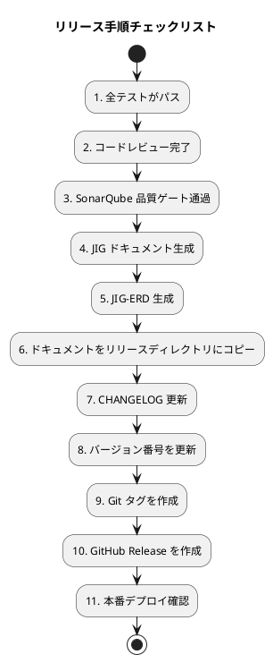

# 第23章: リリース管理

## 23.1 バージョニング戦略

### セマンティックバージョニング

本プロジェクトでは、セマンティックバージョニング（Semantic Versioning）を採用しています。バージョン番号は `MAJOR.MINOR.PATCH` の形式で表現されます。



### プロジェクトのバージョン履歴

本プロジェクトのリリースバージョンは以下のように進化してきました。

| バージョン | 主な内容 |
|-----------|---------|
| 0.1.0 | 環境構築、基本的な認証機能 |
| 0.2.0 | マスタ管理（部門、社員） |
| 0.3.0 | マスタ管理（商品） |
| 0.4.0 | 取引先管理 |
| 0.5.0 | 受注管理 |
| 0.6.0 | 発注管理 |
| 0.7.0 | 出荷・売上管理 |
| 0.8.0 | 在庫管理 |
| 0.9.0 | 仕入・支払管理 |
| 0.10.0 | 請求・回収管理 |
| 0.11.0 | ドキュメント整備 |
| 0.11.1 | バグ修正、依存関係更新 |

### リリースサイクル



## 23.2 CI/CD パイプライン

### GitHub Actions による自動化

本プロジェクトでは、GitHub Actions を使用して CI/CD パイプラインを構築しています。



### バックエンドの CI 設定

Gradle プロジェクトのビルドとテストを自動化します。

```yaml
name: Java CI with Gradle in api directory
on:
  push:
    branches: [ '*' ]
  pull_request:
    branches: [ main ]
permissions:
  contents: read
jobs:
  build:
    runs-on: ubuntu-latest
    steps:
      - uses: actions/checkout@v4
      - name: Set up JDK
        uses: actions/setup-java@v4
        with:
          java-version: '25'
          distribution: 'oracle'
      - name: Grant execute permission for Gradle wrapper
        run: chmod +x ./gradlew
        working-directory: app/backend/sms
      - name: Build with Gradle in api directory
        run: ./gradlew build -x test -x jigReports
        working-directory: app/backend/sms

  test:
    runs-on: ubuntu-latest
    steps:
      - uses: actions/checkout@v4
      - name: Set up JDK
        uses: actions/setup-java@v4
        with:
          java-version: '25'
          distribution: 'oracle'
      - name: Grant execute permission for Gradle wrapper
        run: chmod +x ./gradlew
        working-directory: app/backend/sms
      - name: Test with Gradle in api directory
        run: ./gradlew test
        working-directory: app/backend/sms

  coverage:
    runs-on: ubuntu-latest
    steps:
      - uses: actions/checkout@v4
      - name: Set up JDK
        uses: actions/setup-java@v4
        with:
          java-version: '25'
          distribution: 'oracle'
      - name: Grant execute permission for Gradle wrapper
        run: chmod +x ./gradlew
        working-directory: app/backend/sms
      - name: Gradle build
        run: ./gradlew clean build jacocoTestReport
        working-directory: app/backend/sms
      - uses: qltysh/qlty-action/coverage@v1
        with:
          token: ${{ secrets.QLTY_COVERAGE_TOKEN }}
          files: app/backend/sms/build/reports/jacoco/test/jacocoTestReport.xml
```

### バックエンドのデプロイ設定

Heroku へのデプロイを自動化します。

```yaml
name: Heroku Backend Production Deployment

on:
  push:
    branches:
      - main

jobs:
  deploy:
    runs-on: ubuntu-22.04
    environment: production
    steps:
      - uses: actions/checkout@v4
      - uses: akhileshns/heroku-deploy@v3.13.15
        with:
          heroku_api_key: ${{secrets.HEROKU_API_KEY}}
          heroku_app_name: ${{secrets.HEROKU_APP_NAME}}
          heroku_email: ${{secrets.HEROKU_EMAIL}}
          appdir: "app/backend/sms"
```

### フロントエンドのデプロイ設定

Vercel へのデプロイを自動化します。

```yaml
name: Vercel FrontEnd Production Deployment
env:
  VERCEL_ORG_ID: ${{ secrets.VERCEL_ORG_ID }}
  VERCEL_PROJECT_ID: ${{ secrets.VERCEL_FRONTEND_PROJECT_ID }}
on:
  push:
    branches:
      - main
jobs:
  deploy:
    runs-on: ubuntu-latest
    environment: production
    steps:
      - uses: actions/checkout@v4
      - name: Use Node.js 24
        uses: actions/setup-node@v4
        with:
          node-version: '24'
          cache: 'npm'
          cache-dependency-path: app/frontend/package-lock.json
      - name: Setup Environment Variables
        run: |
          echo VITE_APP_API_URL=${{ vars.PRD_APP_API_URL }} > .env
        working-directory: app/frontend
      - name: Install Vercel CLI
        run: npm install --global vercel@latest
      - name: Pull Vercel Environment Information
        run: vercel pull --yes --environment=production --token=${{ secrets.VERCEL_TOKEN }}
        working-directory: app/frontend
      - name: Build Project Artifacts
        run: vercel build --prod --token=${{ secrets.VERCEL_TOKEN }}
        working-directory: app/frontend
      - name: Deploy Project Artifacts to Vercel
        run: vercel deploy --prebuilt --prod --token=${{ secrets.VERCEL_TOKEN }}
        working-directory: app/frontend
```

### デプロイメントフロー



## 23.3 JIG/JIG-ERD アーカイブ

### リリース時のドキュメント保存

各リリースバージョンで生成された JIG および JIG-ERD ドキュメントを保存することで、アーキテクチャの変遷を追跡できます。

```plantuml
@startuml
title リリースごとのドキュメント構成

folder "docs/assets/release" {
  folder "v0_1_0" {
    folder "jig" {
      file "index.html"
      file "domain.html"
      file "application.html"
      file "usecase.html"
      file "*.svg"
    }
    folder "jig-erd" {
      file "library-er-overview.svg"
      file "library-er-summary.svg"
      file "library-er-detail.svg"
    }
  }

  folder "v0_2_0" {
    folder "jig"
    folder "jig-erd"
  }

  folder "..." as dots

  folder "v0_11_0" {
    folder "jig"
    folder "jig-erd"
  }
}

@enduml
```

### JIG ドキュメントの生成手順

リリース時に JIG ドキュメントを生成する手順です。

```bash
# 1. JIG レポートの生成
cd app/backend/sms
./gradlew jigReports

# 2. JIG-ERD の生成
./gradlew test --tests "*JigErdTest*"

# 3. 生成されたドキュメントをリリースディレクトリにコピー
mkdir -p ../../../docs/assets/release/v0_12_0/jig
mkdir -p ../../../docs/assets/release/v0_12_0/jig-erd
cp -r build/jig/* ../../../docs/assets/release/v0_12_0/jig/
cp -r build/jig-erd/* ../../../docs/assets/release/v0_12_0/jig-erd/
```

### バージョン間の比較

JIG ドキュメントを比較することで、アーキテクチャの進化を可視化できます。



### リリース手順チェックリスト

リリース時に確認すべき項目のチェックリストです。



### タグ付けとリリース作成

```bash
# バージョンタグの作成
git tag -a v0.12.0 -m "Release v0.12.0: 新機能の追加"

# タグのプッシュ
git push origin v0.12.0

# GitHub CLI でリリース作成
gh release create v0.12.0 \
  --title "Release v0.12.0" \
  --notes "## 変更内容

  ### 新機能
  - 機能A の追加
  - 機能B の追加

  ### バグ修正
  - 問題X の修正

  ### ドキュメント
  - JIG ドキュメント更新"
```

## まとめ

この章では、リリース管理について解説しました。

**重要なポイント:**

1. **セマンティックバージョニング**: MAJOR.MINOR.PATCH の形式でバージョンを管理し、変更の種類を明確に伝えます。

2. **CI/CD パイプライン**: GitHub Actions を使用して、ビルド、テスト、デプロイを自動化します。Heroku（バックエンド）と Vercel（フロントエンド）への継続的デプロイを実現しています。

3. **JIG/JIG-ERD アーカイブ**: 各リリースバージョンでドキュメントを保存し、アーキテクチャの変遷を追跡可能にします。これにより、システムの成長と進化を可視化できます。

次の章では、今後の展望について解説します。機能拡張、アーキテクチャの進化、AI/ML 統合の可能性を探ります。
