# 第24章: 今後の展望

## 24.1 機能拡張

### レポーティング強化

現在のシステムは基本的な CRUD 操作と一覧表示を提供していますが、ビジネスインテリジェンス（BI）機能の強化が今後の課題です。

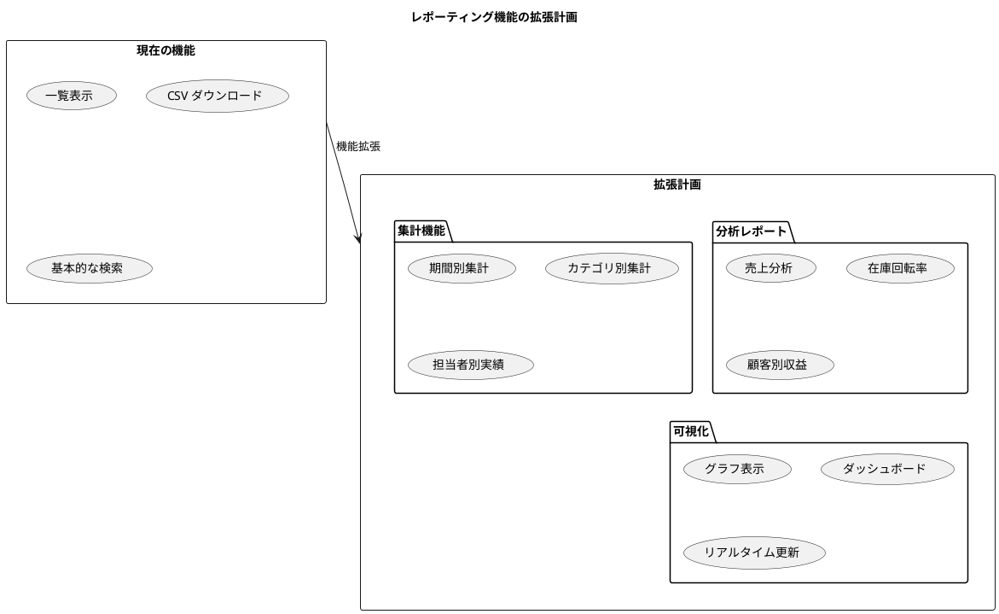

### ダッシュボード実装

経営層や管理者向けのダッシュボードを実装することで、システムの価値を大幅に向上させることができます。

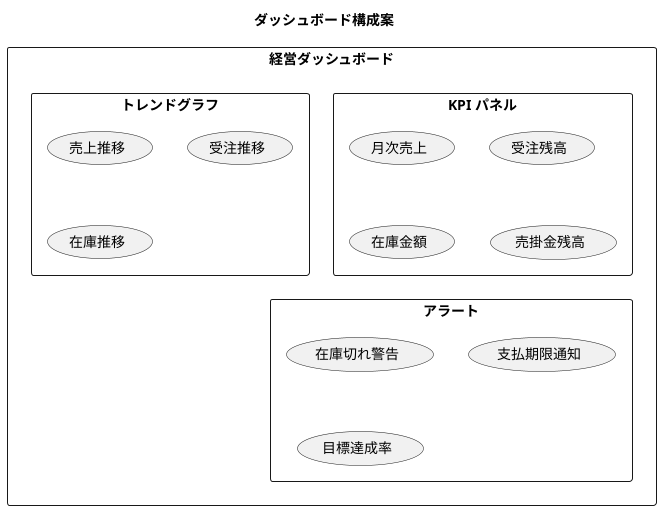

### モバイル対応

現在のシステムはレスポンシブデザインを採用していますが、より本格的なモバイル対応も検討課題です。

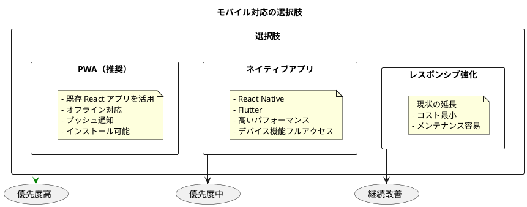

## 24.2 アーキテクチャ進化

### マイクロサービス化の検討

現在のモノリシックアーキテクチャから、段階的にマイクロサービスへ移行することを検討できます。

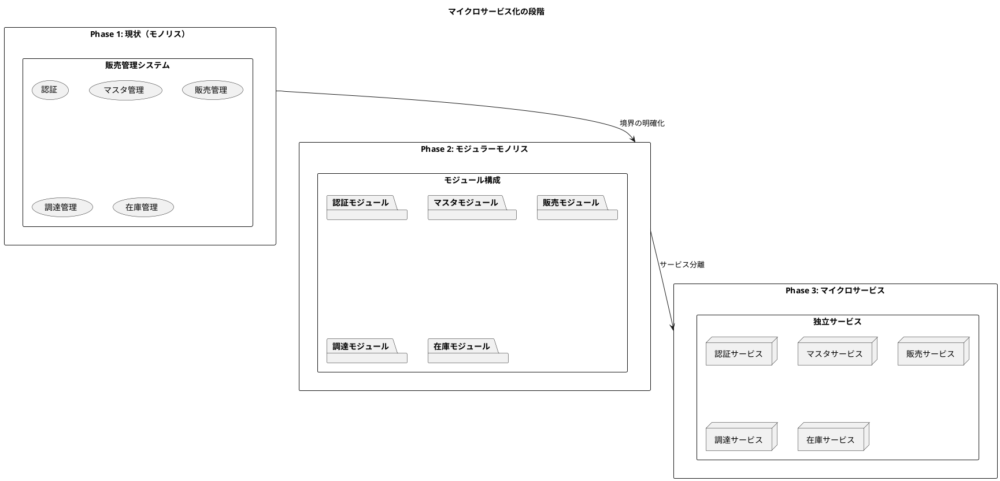

### イベントソーシング

イベントソーシングは、状態の変更をイベントとして記録するアーキテクチャパターンです。監査証跡や履歴追跡に優れています。

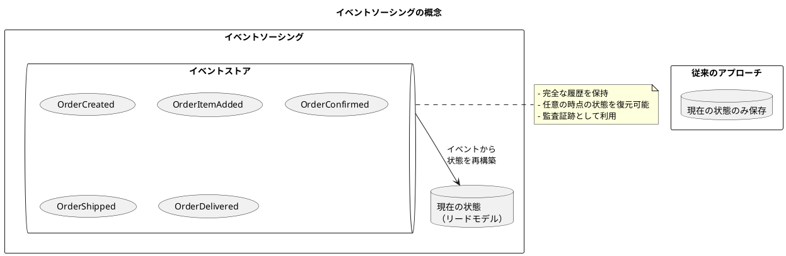

### CQRS パターン

CQRS（Command Query Responsibility Segregation）は、読み取りと書き込みを分離するパターンです。

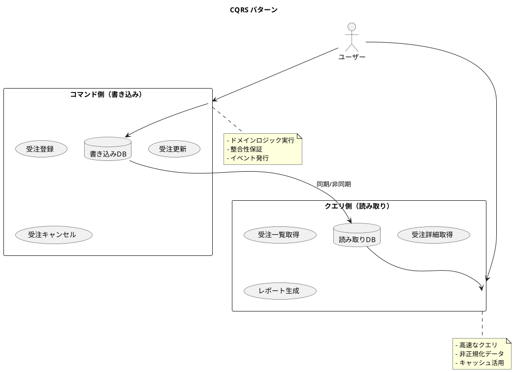

### 技術スタックの進化

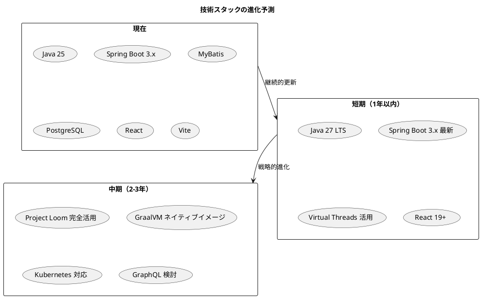

## 24.3 AI/ML 統合

### 需要予測機能

機械学習を活用した需要予測は、在庫最適化や販売計画に大きな価値をもたらします。

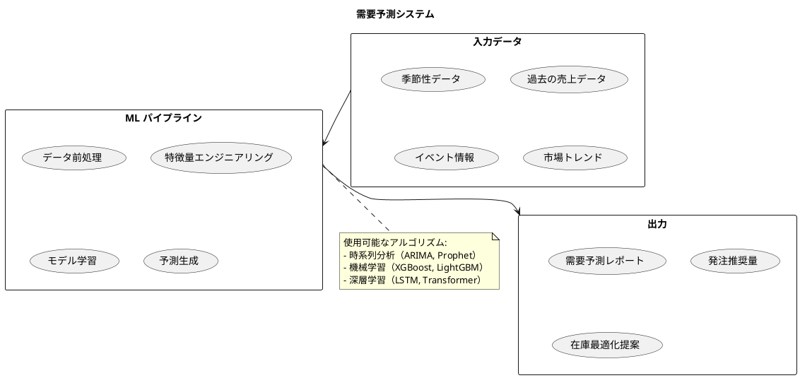

### 異常検知

取引データの異常検知は、不正検出や品質管理に活用できます。

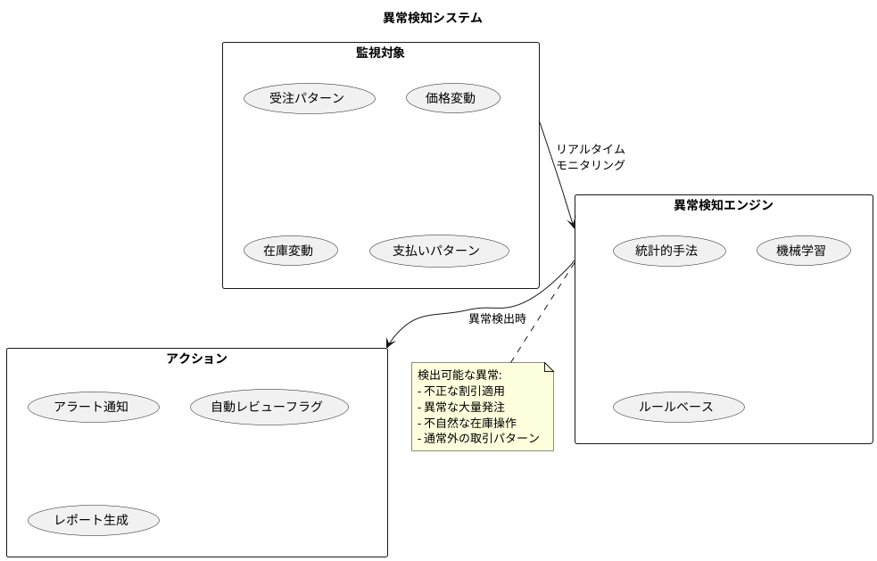

### AI 活用のロードマップ

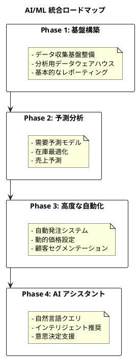

### LLM 統合の可能性

大規模言語モデル（LLM）を活用した機能拡張も将来的な検討課題です。

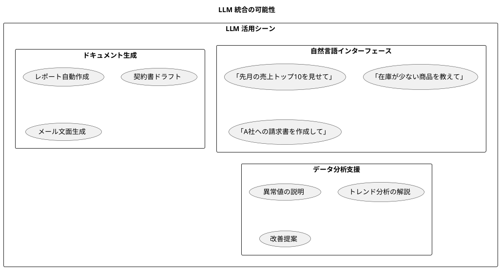

## 24.4 継続的改善

### 技術的負債の管理

システムの健全性を維持するため、技術的負債を継続的に管理します。

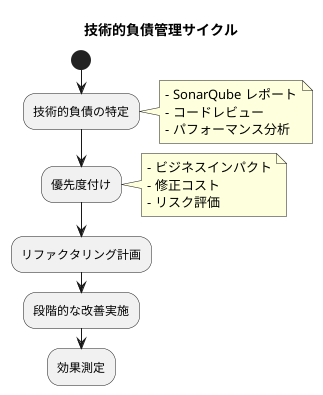

### 品質指標の継続監視

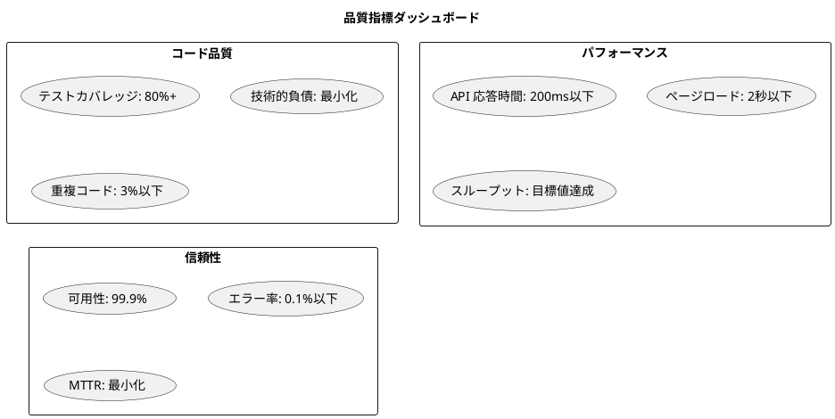

## まとめ

この章では、今後の展望について解説しました。

**重要なポイント:**

1. **機能拡張**: レポーティング強化、ダッシュボード実装、モバイル対応（PWA 推奨）により、システムの価値を向上させます。

2. **アーキテクチャ進化**: 必要に応じて、モジュラーモノリス、マイクロサービス、イベントソーシング、CQRS パターンへの段階的な移行を検討します。

3. **AI/ML 統合**: 需要予測、異常検知、LLM 活用により、ビジネスインテリジェンスを強化します。段階的なロードマップに従って実装を進めます。

4. **継続的改善**: 技術的負債の管理と品質指標の継続監視により、システムの健全性を維持します。

本書で解説したドメイン駆動設計、テスト駆動開発、継続的リファクタリングの原則に従い、システムを進化させていくことが重要です。技術は変化しますが、よいソフトウェアを作るための基本原則は変わりません。

---

これで本書の本文は終了です。付録では、技術スタック一覧、ユースケース一覧、データモデル、開発タイムライン、参考文献を提供します。
