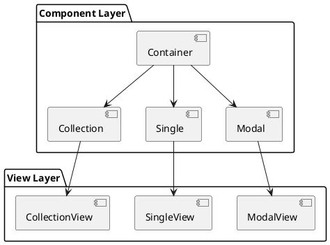
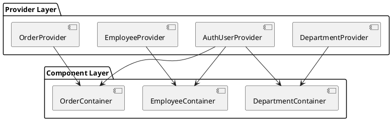
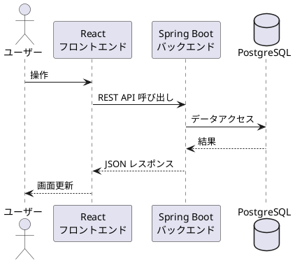

# 第1章: プロジェクト概要

本章では、販売管理システムのフロントエンド実装の全体像を解説します。React と TypeScript を用いたモダンなフロントエンド開発の基盤となるアーキテクチャ、ディレクトリ構成、技術スタックについて説明します。

## 1.1 フロントエンドアーキテクチャ概要

本システムのフロントエンドは、責務分離と保守性を重視した設計を採用しています。主要な設計パターンとして、Component / View パターン、Provider パターン、Service 層パターンを組み合わせています。

### Component / View パターン

本システムでは、コンポーネントを2つの層に分離しています。



**Container コンポーネント**（components/ ディレクトリ）
- ビジネスロジックと状態管理を担当
- Provider からデータを取得し、View に渡す
- イベントハンドラの定義

**View コンポーネント**（views/ ディレクトリ）
- 純粋な表示ロジックのみを担当
- Props を受け取り、UI をレンダリング
- 状態を持たない純粋コンポーネント

この分離により、テスタビリティの向上と UI 変更の影響範囲の局所化を実現しています。

### Provider パターン

React Context を活用した状態管理パターンを採用しています。



各 Provider は以下の責務を持ちます:
- API 呼び出しの実行
- データのキャッシュ
- ローディング状態の管理
- エラーハンドリング

### Service 層パターン

API との通信を抽象化した Service 層を設けています。

```typescript
// services/config.ts
const Config = () => {
    let config: { apiUrl: string, authHeader: string };
    const getApiUrl = () => Env.isProduction() ? Env.prdApiUrl : Env.devApiUrl;
    const user = window.localStorage.getItem("user");
    if (user) {
        config = {apiUrl: getApiUrl(), authHeader: "Bearer " + JSON.parse(user).token};
        return config;
    }
    config = {apiUrl: getApiUrl(), authHeader: ""};
    return config;
};
```

Service 層は以下の責務を持ちます:
- API エンドポイントへの HTTP リクエスト
- 認証ヘッダーの付与
- レスポンスの型変換

## 1.2 ディレクトリ構成

フロントエンドのソースコードは、機能別にディレクトリを構成しています。

```
src/
├── components/           # コンテナコンポーネント
│   ├── application/      # アプリケーション基盤
│   │   ├── ErrorBoundary.tsx
│   │   ├── Home.tsx
│   │   ├── Message.tsx
│   │   ├── Providers.tsx
│   │   ├── RouteAuthGuard.tsx
│   │   └── RouteConfig.tsx
│   ├── master/           # マスタ管理
│   │   ├── account/
│   │   ├── code/
│   │   ├── department/
│   │   ├── employee/
│   │   ├── inventory/
│   │   ├── partner/
│   │   └── product/
│   ├── sales/            # 販売管理
│   │   ├── invoice/
│   │   ├── order/
│   │   ├── payment/
│   │   ├── sales/
│   │   └── shipping/
│   ├── procurement/      # 調達管理
│   │   ├── order/
│   │   ├── payment/
│   │   └── purchase/
│   ├── inventory/        # 在庫管理
│   │   ├── list/
│   │   ├── rule/
│   │   └── upload/
│   └── system/           # システム機能
│       ├── audit/
│       ├── download/
│       └── user/
├── views/                # プレゼンテーションコンポーネント
│   └── (components と同構成)
├── providers/            # React Context プロバイダー
│   ├── master/
│   ├── sales/
│   ├── procurement/
│   ├── inventory/
│   └── system/
├── services/             # API クライアント
│   ├── master/
│   ├── sales/
│   ├── procurement/
│   ├── inventory/
│   └── system/
├── models/               # TypeScript 型定義
│   ├── master/
│   ├── sales/
│   ├── procurement/
│   ├── inventory/
│   └── system/
├── env.ts                # 環境変数管理
└── App.tsx               # エントリポイント
```

### 主要ディレクトリの役割

| ディレクトリ | 役割 | 例 |
|------------|------|-----|
| components/ | ビジネスロジックを含むコンテナコンポーネント | DepartmentContainer, OrderContainer |
| views/ | 表示専用のプレゼンテーションコンポーネント | DepartmentCollectionView, OrderSingleView |
| providers/ | React Context によるグローバル状態管理 | DepartmentProvider, OrderProvider |
| services/ | API クライアント | departmentService, orderService |
| models/ | TypeScript インターフェース定義 | Department, Order |

### コンポーネント命名規則

本システムでは、一貫した命名規則を採用しています。

| パターン | 命名 | 用途 |
|---------|------|------|
| Container | {Entity}Container | ルートコンテナ |
| Collection | {Entity}Collection | 一覧表示 |
| Single | {Entity}Single | 詳細表示 |
| EditModal | {Entity}EditModal | 編集ダイアログ |
| SearchModal | {Entity}SearchModal | 検索ダイアログ |
| SelectModal | {Entity}SelectModal | 選択ダイアログ |

## 1.3 技術スタック

本システムで採用している主要な技術スタックを紹介します。

### コア技術

| カテゴリ | 技術 | バージョン | 用途 |
|---------|------|-----------|------|
| 言語 | TypeScript | 5.5 | 型安全な開発 |
| UI ライブラリ | React | 18.3 | コンポーネントベース UI |
| ルーティング | React Router | 6.26 | SPA ルーティング |
| ビルドツール | Vite | 5.4 | 高速ビルド |

### UI コンポーネントライブラリ

| ライブラリ | 用途 |
|-----------|------|
| react-modal | モーダルダイアログ |
| react-tabs | タブコンポーネント |
| react-icons | アイコン |
| react-spinners | ローディングインジケータ |

### テスト

| ツール | 用途 |
|--------|------|
| Jest | 単体テスト |
| Testing Library | コンポーネントテスト |
| Cypress | E2E テスト |

### package.json

```json
{
  "name": "app",
  "private": true,
  "version": "0.0.0",
  "type": "module",
  "scripts": {
    "dev": "vite",
    "stg": "vite --mode staging",
    "test": "jest",
    "build": "tsc -b && vite build",
    "lint": "eslint .",
    "preview": "vite preview",
    "cypress:open": "cypress open",
    "cypress:run": "cypress run"
  },
  "dependencies": {
    "@types/react-modal": "^3.16.3",
    "react": "^18.3.1",
    "react-dom": "^18.3.1",
    "react-icons": "^5.3.0",
    "react-modal": "^3.16.1",
    "react-router-dom": "^6.26.2",
    "react-spinners": "^0.14.1",
    "react-tabs": "^6.0.2"
  },
  "devDependencies": {
    "@babel/preset-env": "^7.25.7",
    "@babel/preset-react": "^7.25.7",
    "@babel/preset-typescript": "^7.25.7",
    "@eslint/js": "^9.9.0",
    "@testing-library/jest-dom": "^6.5.0",
    "@testing-library/react": "^16.0.1",
    "@testing-library/user-event": "^14.5.2",
    "@types/jest": "^29.5.13",
    "@types/react": "^18.3.3",
    "@types/react-dom": "^18.3.0",
    "@vitejs/plugin-react": "^4.3.1",
    "allure-cypress": "^3.0.6",
    "cypress": "^14.5.1",
    "cypress-file-upload": "^5.0.8",
    "eslint": "^9.9.0",
    "eslint-plugin-react-hooks": "^5.1.0-rc.0",
    "eslint-plugin-react-refresh": "^0.4.9",
    "globals": "^15.9.0",
    "identity-obj-proxy": "^3.0.0",
    "jest": "^29.7.0",
    "jest-dom": "^4.0.0",
    "jest-environment-jsdom": "^29.7.0",
    "jest-transform-css": "^6.0.1",
    "ts-jest": "^29.2.5",
    "typescript": "^5.5.3",
    "typescript-eslint": "^8.0.1",
    "vite": "^5.4.1",
    "vite-plugin-env-compatible": "^2.0.1",
    "wait-on": "^8.0.1"
  }
}
```

## 1.4 本書の構成

本書は、販売管理システムのフロントエンド実装を以下の構成で解説します。

### 第1部: 導入と基盤（第1章〜第3章）

フロントエンドアーキテクチャの全体像、開発環境の構築方法、設計パターンについて解説します。

### 第2部: 共通コンポーネント（第4章〜第5章）

アプリケーション基盤となる共通コンポーネント、認証ガード、レイアウト、モーダルパターンについて解説します。

### 第3部: マスタ管理機能（第6章〜第10章）

認証・ユーザー管理、部門・社員マスタ、商品マスタ、取引先管理、コードマスタの実装を解説します。

### 第4部: 販売管理機能（第11章〜第13章）

受注管理、出荷・売上管理、請求・回収管理の実装を解説します。

### 第5部: 調達管理機能（第14章〜第15章）

発注管理、仕入・支払管理の実装を解説します。

### 第6部: 在庫管理機能（第16章〜第17章）

在庫管理、倉庫・棚番マスタの実装を解説します。

### 第7部: システム機能（第18章〜第19章）

ダウンロード機能、監査機能の実装を解説します。

### 第8部: テストと品質（第20章〜第21章）

Jest による単体テスト、Cypress による E2E テストの実装を解説します。

### バックエンド API との連携

本書のフロントエンド実装は、Spring Boot で構築されたバックエンド API と連携します。バックエンドの詳細については「販売管理システムのケーススタディ（Java版）」を参照してください。



## まとめ

本章では、販売管理システムのフロントエンド実装の全体像を解説しました。

- **Component / View パターン**: 責務分離による保守性向上
- **Provider パターン**: React Context による状態管理
- **Service 層パターン**: API 通信の抽象化
- **技術スタック**: React 18 + TypeScript + Vite

次章では、開発環境の構築について詳しく解説します。
