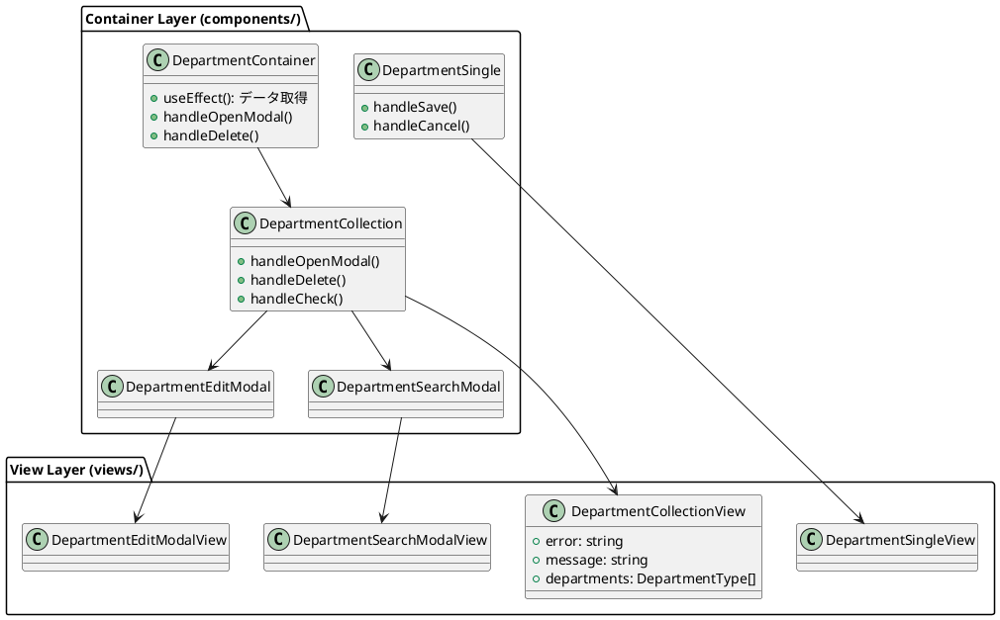
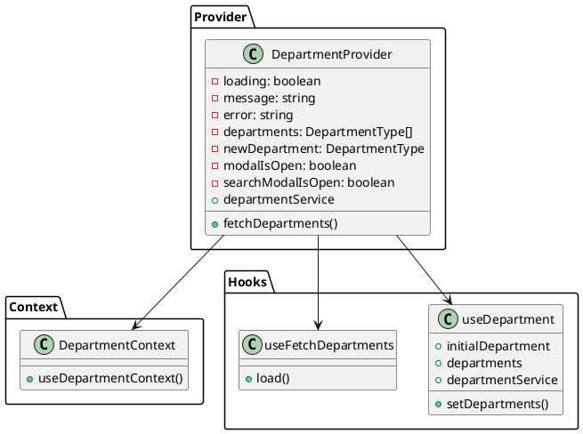
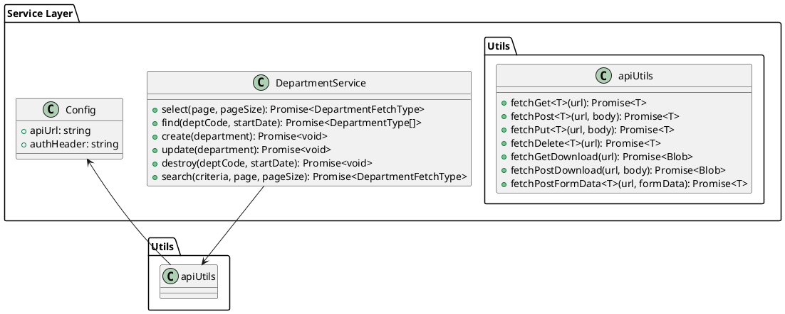
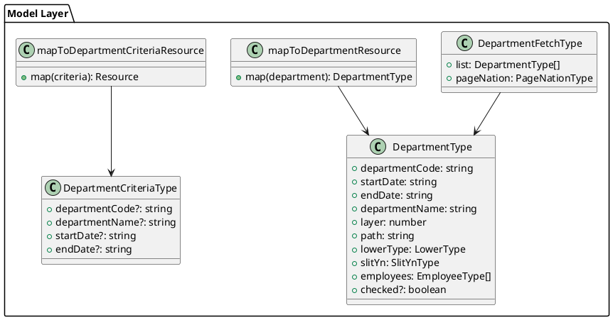
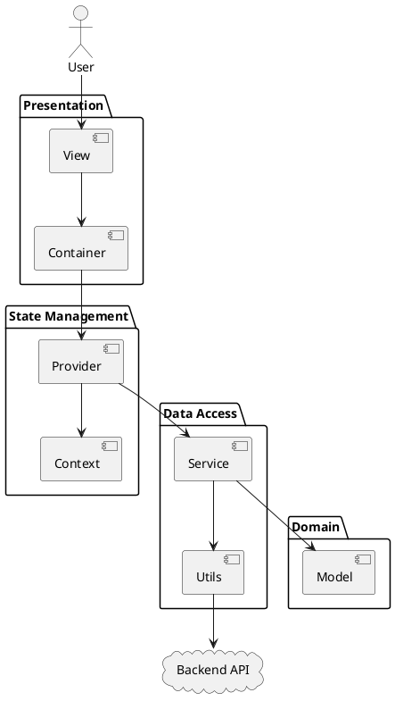

# 第3章: アーキテクチャ設計

本章では、販売管理システムのフロントエンドアーキテクチャを詳しく解説します。Component / View パターン、Provider パターン、Service 層パターン、Model 層パターンについて、実際のコードを交えて説明します。

## 3.1 Component / View パターン

本システムでは、コンポーネントを Container（ロジック担当）と View（表示担当）に分離しています。この分離により、テスタビリティと保守性が向上します。

### パターンの構造



### Container コンポーネントの実装

Container コンポーネントは、Provider からデータを取得し、イベントハンドラを定義します。

```typescript
// components/master/department/DepartmentContainer.tsx
import React, {useEffect} from "react";
import {showErrorMessage} from "../../application/utils.ts";
import {SiteLayout} from "../../../views/SiteLayout.tsx";
import LoadingIndicator from "../../../views/application/LoadingIndicatior.tsx";
import {DepartmentProvider, useDepartmentContext} from "../../../providers/master/Department.tsx";
import {EmployeeProvider, useEmployeeContext} from "../../../providers/master/Employee.tsx";
import {DepartmentCollection} from "./DepartmentCollection.tsx";

export const DepartmentContainer: React.FC = () => {
    const Content: React.FC = () => {
        const {
            loading,
            setError,
            fetchDepartments,
        } = useDepartmentContext();

        const {
            fetchEmployees,
        } = useEmployeeContext();

        useEffect(() => {
            (async () => {
                try {
                    await Promise.all([
                        fetchDepartments.load(),
                        fetchEmployees.load()
                    ]);
                } catch (error: any) {
                    showErrorMessage(`部門情報の取得に失敗しました: ${error?.message}`, setError);
                }
            })();
        }, []);

        return (
            <>
                {loading ? (
                    <LoadingIndicator/>
                ) : (
                    <DepartmentCollection/>
                )}
            </>
        );
    };

    return (
        <SiteLayout>
            <DepartmentProvider>
                <EmployeeProvider>
                    <Content/>
                </EmployeeProvider>
            </DepartmentProvider>
        </SiteLayout>
    );
};
```

**Container の責務**
- Provider のラップ
- 初期データの取得
- ローディング状態の管理
- エラーハンドリング

### Collection コンポーネントの実装

Collection コンポーネントは、一覧表示のロジックを担当します。

```typescript
// components/master/department/DepartmentCollection.tsx
import React from "react";
import {useDepartmentContext} from "../../../providers/master/Department.tsx";
import {DepartmentCollectionView} from "../../../views/master/department/DepartmentCollection.tsx";
import {DepartmentType} from "../../../models";
import {showErrorMessage} from "../../application/utils.ts";
import {DepartmentSearchModal} from "./DepartmentSearchModal.tsx";
import {DepartmentEditModal} from "./DepartmentEditModal.tsx";

export const DepartmentCollection: React.FC = () => {
    const {
        message,
        setMessage,
        error,
        setError,
        pageNation,
        criteria,
        setModalIsOpen,
        setIsEditing,
        setEditId,
        initialDepartment,
        departments,
        setDepartments,
        setNewDepartment,
        searchDepartmentCriteria,
        setSearchDepartmentCriteria,
        fetchDepartments,
        departmentService,
        setSearchModalIsOpen,
    } = useDepartmentContext();

    const handleOpenModal = (department?: DepartmentType) => {
        setMessage("");
        setError("");
        if (department) {
            setNewDepartment(department);
            setEditId(department.departmentCode);
            setIsEditing(true);
        } else {
            setNewDepartment(initialDepartment);
            setIsEditing(false);
        }
        setModalIsOpen(true);
    };

    const handleDeleteDepartment = async (departmentCode: string, startDate: string) => {
        try {
            if (!window.confirm(`部門コード:${departmentCode} を削除しますか？`)) return;
            await departmentService.destroy(departmentCode, startDate);
            await fetchDepartments.load();
            setMessage("部門を削除しました。");
        } catch (error: any) {
            showErrorMessage(`部門の削除に失敗しました: ${error?.message}`, setError);
        }
    };

    return (
        <>
            <DepartmentSearchModal/>
            <DepartmentEditModal/>
            <DepartmentCollectionView
                error={error}
                message={message}
                searchItems={{searchDepartmentCriteria, setSearchDepartmentCriteria, handleOpenSearchModal}}
                headerItems={{handleOpenModal, handleCheckToggleCollection, handleDeleteCheckedCollection}}
                collectionItems={{departments, handleOpenModal, handleDeleteDepartment, handleCheckDepartment}}
                pageNationItems={{pageNation, fetchDepartments: fetchDepartments.load, criteria}}
            />
        </>
    );
}
```

### View コンポーネントの実装

View コンポーネントは、純粋な表示ロジックのみを担当します。

```typescript
// views/master/department/DepartmentCollection.tsx
import React from "react";
import {DepartmentCriteriaType, DepartmentType} from "../../../models";
import {Message} from "../../../components/application/Message.tsx";
import {PageNation, PageNationType} from "../../application/PageNation.tsx";
import {Search} from "../../Common.tsx";

interface DepartmentItemProps {
    department: DepartmentType;
    onEdit: (department: DepartmentType) => void;
    onDelete: (departmentCode: string, startDate: string) => void;
    onCheck: (department: DepartmentType) => void;
}

const DepartmentItem: React.FC<DepartmentItemProps> = ({department, onEdit, onDelete, onCheck}) => (
    <li className="collection-object-item" key={department.departmentCode}>
        <div className="collection-object-item-content" data-id={department.departmentCode}>
            <input type="checkbox" className="collection-object-item-checkbox" checked={department.checked}
                   onChange={() => onCheck(department)}/>
        </div>
        <div className="collection-object-item-content" data-id={department.departmentCode}>
            <div className="collection-object-item-content-details">部門コード</div>
            <div className="collection-object-item-content-name">{department.departmentCode}</div>
        </div>
        <div className="collection-object-item-content" data-id={department.departmentCode}>
            <div className="collection-object-item-content-details">部門名</div>
            <div className="collection-object-item-content-name">{department.departmentName}</div>
        </div>
        <div className="collection-object-item-actions" data-id={department.departmentCode}>
            <button className="action-button" onClick={() => onEdit(department)} id="edit">編集</button>
        </div>
        <div className="collection-object-item-actions" data-id={department.departmentCode}>
            <button className="action-button" onClick={() => onDelete(department.departmentCode, department.startDate)} id="delete">削除</button>
        </div>
    </li>
);

interface DepartmentCollectionViewProps {
    error: string | null;
    message: string | null;
    searchItems: {
        searchDepartmentCriteria: DepartmentCriteriaType;
        setSearchDepartmentCriteria: (value: DepartmentCriteriaType) => void;
        handleOpenSearchModal: () => void;
    }
    headerItems: {
        handleOpenModal: (department?: DepartmentType) => void;
        handleCheckToggleCollection: () => void;
        handleDeleteCheckedCollection: () => void;
    }
    collectionItems: {
        departments: DepartmentType[];
        handleOpenModal: (department?: DepartmentType) => void;
        handleDeleteDepartment: (departmentCode: string, startDate: string) => void;
        handleCheckDepartment: (department: DepartmentType) => void;
    }
    pageNationItems: {
        pageNation: PageNationType | null;
        criteria: DepartmentCriteriaType | null;
        fetchDepartments: () => void;
    }
}

export const DepartmentCollectionView: React.FC<DepartmentCollectionViewProps> = ({
    error,
    message,
    searchItems: {searchDepartmentCriteria, setSearchDepartmentCriteria, handleOpenSearchModal},
    headerItems: {handleOpenModal, handleCheckToggleCollection, handleDeleteCheckedCollection},
    collectionItems: { departments, handleDeleteDepartment, handleCheckDepartment },
    pageNationItems: { pageNation, criteria, fetchDepartments }
}) => (
    <div className="collection-view-object-container">
        <Message error={error} message={message}/>
        <div className="collection-view-container">
            <div className="collection-view-header">
                <div className="single-view-header-item">
                    <h1 className="single-view-title">部門</h1>
                </div>
            </div>
            <div className="collection-view-content">
                <Search
                    searchCriteria={searchDepartmentCriteria}
                    setSearchCriteria={setSearchDepartmentCriteria}
                    handleSearchAudit={handleOpenSearchModal}
                />
                <div className="button-container">
                    <button className="action-button" onClick={() => handleOpenModal()} id="new">新規</button>
                    <button className="action-button" onClick={() => handleCheckToggleCollection()} id="checkAll">一括選択</button>
                    <button className="action-button" onClick={() => handleDeleteCheckedCollection()} id="deleteAll">一括削除</button>
                </div>
                <DepartmentList
                    departments={departments}
                    onEdit={handleOpenModal}
                    onDelete={handleDeleteDepartment}
                    onCheck={handleCheckDepartment}
                />
                <PageNation pageNation={pageNation} callBack={fetchDepartments} criteria={criteria}/>
            </div>
        </div>
    </div>
);
```

**View の特徴**
- Props のみを受け取る純粋コンポーネント
- 状態を持たない
- イベントハンドラは Props として受け取る
- テストが容易

## 3.2 Provider パターン

React Context を活用した状態管理パターンを採用しています。各機能領域ごとに Provider を作成し、コンポーネントツリー全体で状態を共有します。

### Provider の構造



### Provider の実装

```typescript
// providers/master/Department.tsx
import React, {createContext, useContext, ReactNode, Dispatch, SetStateAction, useState, useMemo} from "react";
import {PageNationType, usePageNation} from "../../views/application/PageNation.tsx";
import {DepartmentCriteriaType, DepartmentType} from "../../models";
import { useModal } from "../../components/application/hooks.ts";
import { useDepartment, useFetchDepartments } from "../../components/master/department/hooks";
import { showErrorMessage } from "../../components/application/utils.ts";
import { useMessage } from "../../components/application/Message.tsx";
import {DepartmentServiceType} from "../../services/master/department.ts";

type DepartmentContextType = {
    loading: boolean;
    setLoading: Dispatch<SetStateAction<boolean>>;
    message: string | null;
    setMessage: Dispatch<SetStateAction<string | null>>;
    error: string | null;
    setError: Dispatch<SetStateAction<string | null>>;
    pageNation: PageNationType | null;
    setPageNation: Dispatch<SetStateAction<PageNationType | null>>;
    criteria: DepartmentCriteriaType | null;
    setCriteria: Dispatch<SetStateAction<DepartmentCriteriaType | null>>;
    searchModalIsOpen: boolean;
    setSearchModalIsOpen: Dispatch<SetStateAction<boolean>>;
    modalIsOpen: boolean;
    setModalIsOpen: Dispatch<SetStateAction<boolean>>;
    isEditing: boolean;
    setIsEditing: Dispatch<SetStateAction<boolean>>;
    editId: string | null;
    setEditId: Dispatch<SetStateAction<string | null>>;
    initialDepartment: DepartmentType;
    departments: DepartmentType[];
    setDepartments: Dispatch<SetStateAction<DepartmentType[]>>;
    newDepartment: DepartmentType;
    setNewDepartment: Dispatch<SetStateAction<DepartmentType>>;
    searchDepartmentCriteria: DepartmentCriteriaType;
    setSearchDepartmentCriteria: Dispatch<SetStateAction<DepartmentCriteriaType>>;
    fetchDepartments: { load: (page?: number, criteria?: DepartmentCriteriaType) => Promise<void> };
    departmentService: DepartmentServiceType;
};

const DepartmentContext = createContext<DepartmentContextType | undefined>(undefined);

export const useDepartmentContext = () => {
    const context = useContext(DepartmentContext);
    if (!context) {
        throw new Error("useDepartmentContext must be used within a DepartmentProvider");
    }
    return context;
};

type Props = {
    children: ReactNode;
};

export const DepartmentProvider: React.FC<Props> = ({ children }) => {
    const [loading, setLoading] = useState<boolean>(false);
    const { message, setMessage, error, setError } = useMessage();
    const { pageNation, setPageNation, criteria, setCriteria } = usePageNation<DepartmentCriteriaType | null>();
    const { modalIsOpen: searchModalIsOpen, setModalIsOpen: setSearchModalIsOpen } = useModal();
    const { modalIsOpen, setModalIsOpen, isEditing, setIsEditing, editId, setEditId } = useModal();
    const {
        initialDepartment,
        departments,
        setDepartments,
        newDepartment,
        setNewDepartment,
        searchDepartmentCriteria,
        setSearchDepartmentCriteria,
        departmentService
    } = useDepartment();
    const fetchDepartments = useFetchDepartments(
        setLoading,
        setDepartments,
        setPageNation,
        setError,
        showErrorMessage,
        departmentService
    );

    const value = useMemo(() => ({
        loading,
        setLoading,
        message,
        setMessage,
        error,
        setError,
        pageNation,
        setPageNation,
        criteria,
        setCriteria,
        searchModalIsOpen,
        setSearchModalIsOpen,
        modalIsOpen,
        setModalIsOpen,
        isEditing,
        setIsEditing,
        editId,
        setEditId,
        initialDepartment,
        departments,
        setDepartments,
        newDepartment,
        setNewDepartment,
        searchDepartmentCriteria,
        setSearchDepartmentCriteria,
        fetchDepartments,
        departmentService
    }), [/* dependencies */]);

    return (
        <DepartmentContext.Provider value={value}>
            {children}
        </DepartmentContext.Provider>
    );
};
```

### カスタムフックの実装

Provider で使用するカスタムフックを定義します。

```typescript
// components/master/department/hooks/department.ts
import {useState} from "react";
import {
    DepartmentCriteriaType,
    DepartmentType,
    LowerType,
    SlitYnType
} from "../../../../models";
import {DepartmentService, DepartmentServiceType} from "../../../../services/master/department.ts";
import {PageNationType} from "../../../../views/application/PageNation.tsx";
import {useFetchEntities} from "../../../application/hooks.ts";

export const useDepartment = () => {
    const initialDepartment = {
        departmentCode: "",
        startDate: "",
        endDate: "",
        departmentName: "",
        layer: 0,
        path: "",
        lowerType: LowerType.NO,
        slitYn: SlitYnType.NO,
        employees: [],
        checked: false
    };

    const [departments, setDepartments] = useState<DepartmentType[]>([]);
    const [newDepartment, setNewDepartment] = useState<DepartmentType>(initialDepartment);
    const [searchDepartmentCriteria, setSearchDepartmentCriteria] = useState<DepartmentCriteriaType>({});
    const departmentService = DepartmentService();

    return {
        initialDepartment,
        departments,
        newDepartment,
        setNewDepartment,
        searchDepartmentCriteria,
        setSearchDepartmentCriteria,
        setDepartments,
        departmentService,
    }
}

export const useFetchDepartments = (
    setLoading: (loading: boolean) => void,
    setList: (list: DepartmentType[]) => void,
    setPageNation: (pageNation: PageNationType) => void,
    setError: (error: string) => void,
    showErrorMessage: (message: string, callback: (error: string) => void) => void,
    service: DepartmentServiceType
) => useFetchEntities<DepartmentType, DepartmentServiceType, DepartmentCriteriaType>(
    setLoading, setList, setPageNation, setError, showErrorMessage, service, "部門情報の取得に失敗しました:"
);
```

## 3.3 Service 層パターン

API との通信を抽象化した Service 層を設けています。各エンティティごとに Service を作成し、CRUD 操作を提供します。

### Service の構造



### Service の実装

```typescript
// services/master/department.ts
import Config from "../config.ts";
import Utils from "../utils.ts";
import {
    DepartmentCriteriaType,
    DepartmentFetchType,
    DepartmentType,
    mapToDepartmentCriteriaResource,
    mapToDepartmentResource
} from "../../models";
import {toISOStringWithTimezone} from "../../components/application/utils.ts";

export interface DepartmentServiceType {
    select: (page?: number, pageSize?: number) => Promise<DepartmentFetchType>;
    find: (deptCode: string, departmentStartDate: string) => Promise<DepartmentType[]>;
    create: (department: DepartmentType) => Promise<void>;
    update: (department: DepartmentType) => Promise<void>;
    destroy: (deptCode: string, departmentStartDate: string) => Promise<void>;
    search: (criteria:DepartmentCriteriaType, page?: number, pageSize?: number) => Promise<DepartmentFetchType>;
}

export const DepartmentService = () => {
    const config = Config();
    const apiUtils = Utils.apiUtils;
    const endPoint = `${config.apiUrl}/departments`;

    const select = async (page?: number, pageSize?: number): Promise<DepartmentFetchType> => {
        const url = Utils.buildUrlWithPaging(endPoint, page, pageSize);
        return await apiUtils.fetchGet<DepartmentFetchType>(url);
    };

    const find = async (deptCode: string, departmentStartDate: string): Promise<DepartmentType[]> => {
        const startDate = toISOStringWithTimezone(new Date(departmentStartDate));
        const url = `${endPoint}/${deptCode}/${startDate}`;
        return await apiUtils.fetchGet<DepartmentType[]>(url);
    };

    const create = async (department: DepartmentType): Promise<void> => {
        await apiUtils.fetchPost<void>(endPoint, mapToDepartmentResource(department));
    };

    const update = async (department: DepartmentType): Promise<void> => {
        const startDate = toISOStringWithTimezone(new Date(department.startDate));
        const url = `${endPoint}/${department.departmentCode}/${startDate}`;
        await apiUtils.fetchPut<void>(url, mapToDepartmentResource(department));
    };

    const search = async (criteria: DepartmentCriteriaType, page?: number, pageSize?: number): Promise<DepartmentFetchType> => {
        const url = Utils.buildUrlWithPaging(`${endPoint}/search`, page, pageSize);
        return await apiUtils.fetchPost<DepartmentFetchType>(url, mapToDepartmentCriteriaResource(criteria));
    };

    const destroy = async (deptCode: string, departmentStartDate: string): Promise<void> => {
        const startDate = toISOStringWithTimezone(new Date(departmentStartDate));
        const url = `${endPoint}/${deptCode}/${startDate}`;
        await apiUtils.fetchDelete<void>(url);
    };

    return {
        select,
        find,
        create,
        update,
        destroy,
        search
    };
}
```

### API ユーティリティの実装

共通の API 呼び出しロジックを Utils として実装します。

```typescript
// services/utils.ts
import Config from "./config.ts";

const Utils = (() => {
    const apiUtils = (() => {
        const fetchGet = async <T>(url: string): Promise<T> => {
            const config = Config();
            try {
                const res = await fetch(url, {
                    method: "GET",
                    headers: {
                        "Authorization": config.authHeader
                    }
                });
                if (!res.ok) {
                    return res.json().then(e => { throw e; });
                }
                return await res.json();
            } catch (err: any) {
                console.log(err);
                if (err.message && err.message.includes("Unexpected token '<'")) {
                    throw new Error("認証期限が切れました。再度ログインしてください。");
                }
                throw err;
            }
        };

        const fetchPost = async <T>(url: string, body: unknown): Promise<T> => {
            const config = Config();
            const res = await fetch(url, {
                method: "POST",
                headers: {
                    "Content-Type": "application/json",
                    "Authorization": config.authHeader
                },
                body: JSON.stringify(body)
            });
            if (!res.ok) {
                return res.json().then(e => { throw e; });
            }
            return await res.json();
        };

        const fetchPut = async <T>(url: string, body: unknown): Promise<T> => {
            const config = Config();
            const res = await fetch(url, {
                method: "PUT",
                headers: {
                    "Content-Type": "application/json",
                    "Authorization": config.authHeader
                },
                body: JSON.stringify(body)
            });
            if (!res.ok) {
                return res.json().then(e => { throw e; });
            }
            return await res.json();
        };

        const fetchDelete = async <T>(url: string): Promise<T> => {
            const config = Config();
            const res = await fetch(url, {
                method: "DELETE",
                headers: {
                    "Authorization": config.authHeader
                }
            });
            if (!res.ok) {
                return res.json().then(e => { throw e; });
            }
            return await res.json();
        };

        const fetchPostFormData = async <T>(url: string, formData: FormData): Promise<T> => {
            const config = Config();
            const res = await fetch(url, {
                method: "POST",
                headers: {
                    "Authorization": config.authHeader
                },
                body: formData
            });
            if (!res.ok) {
                const errorResponse = await res.json();
                throw new Error(errorResponse.message);
            }
            return await res.json();
        };

        return {
            fetchGet,
            fetchPost,
            fetchPut,
            fetchDelete,
            fetchPostFormData
        };
    })();

    const buildUrlWithPaging = (baseUrl: string, page?: number, pageSize?: number): string => {
        const params = new URLSearchParams();
        if (pageSize) params.append("pageSize", pageSize.toString());
        if (page) params.append("page", page.toString());
        return params.toString() ? `${baseUrl}?${params.toString()}` : baseUrl;
    };

    return {
        apiUtils,
        buildUrlWithPaging
    };
})();

export default Utils;
```

## 3.4 Model 層パターン

TypeScript の型定義を Model 層として集約しています。API レスポンスの型定義、リソースへのマッピング関数を提供します。

### Model の構造



### Model の実装

```typescript
// models/master/department.ts
import {EmployeeType} from "./employee.ts";
import {PageNationType} from "../../views/application/PageNation.tsx";
import {toISOStringWithTimezone} from "../../components/application/utils.ts";

export type DepartmentType = {
    departmentCode: string;
    startDate: string;
    endDate: string;
    departmentName: string;
    layer: number;
    path: string;
    lowerType: LowerType;
    slitYn: SlitYnType;
    employees: EmployeeType[];
    checked?: boolean;
}

export type DepartmentFetchType = {
    list: DepartmentType[];
} & PageNationType;

export type DepartmentCriteriaType = {
    departmentCode?: string;
    departmentName?: string;
    startDate?: string;
    endDate?: string;
}

export const LowerType = {
    YES: "LOWER",
    NO: "NOT_LOWER",
}
export type LowerType = typeof LowerType[keyof typeof LowerType];

export const SlitYnType = {
    YES: "SLIT",
    NO: "NOT_SLIT",
}
export type SlitYnType = typeof SlitYnType[keyof typeof SlitYnType];

export const mapToDepartmentResource = (department: DepartmentType): DepartmentType => {
    return {
        ...department,
        startDate: toISOStringWithTimezone(new Date(department.startDate)),
        endDate: toISOStringWithTimezone(new Date(department.endDate)),
        employees: department.employees.map(employee => ({
            ...employee,
            departmentStartDate: toISOStringWithTimezone(new Date(department.startDate)),
        }))
    };
};

export const mapToDepartmentCriteriaResource = (criteria: DepartmentCriteriaType) => {
    const isEmpty = (value: unknown) => value === "" || value === null || value === undefined;
    type Resource = {
        departmentCode?: string;
        departmentName?: string;
        startDate?: string;
        endDate?: string;
    };
    const resource: Resource = {
        ...(isEmpty(criteria.departmentCode) ? {} : { departmentCode: criteria.departmentCode }),
        ...(isEmpty(criteria.departmentName) ? {} : { departmentName: criteria.departmentName }),
        ...(isEmpty(criteria.startDate) ? {} : { startDate: toISOStringWithTimezone(new Date(criteria.startDate))}),
        ...(isEmpty(criteria.endDate) ? {} : { endDate: toISOStringWithTimezone(new Date(criteria.endDate))}),
    };

    return resource;
};
```

## 3.5 全体アーキテクチャ

各層の関係を図示すると、以下のようになります。



### データフロー

1. **ユーザー操作** → View コンポーネントがイベントを受け取る
2. **イベントハンドリング** → Container がビジネスロジックを実行
3. **状態更新** → Provider の状態を更新
4. **API 呼び出し** → Service が API を呼び出す
5. **データ変換** → Model がレスポンスを型変換
6. **再レンダリング** → Context の変更を検知して View が更新

## まとめ

本章では、フロントエンドアーキテクチャの4つの主要パターンを解説しました。

- **Component / View パターン**: ロジックと表示の責務分離
- **Provider パターン**: React Context による状態管理
- **Service 層パターン**: API 通信の抽象化
- **Model 層パターン**: TypeScript 型定義の集約

これらのパターンを組み合わせることで、テスタビリティが高く、保守しやすいフロントエンドアーキテクチャを実現しています。

次章からは、この基盤の上に構築される共通コンポーネントについて解説します。
