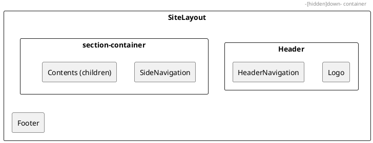

# 第4章: アプリケーション基盤

本章では、販売管理システムのフロントエンドにおけるアプリケーション基盤コンポーネントを解説します。エントリポイント、認証ガード、レイアウト、共通コンポーネントについて説明します。

## 4.1 アプリケーションエントリポイント

### App.tsx

アプリケーションのエントリポイントは `App.tsx` です。Provider でアプリケーション全体をラップし、ルーティング設定を読み込みます。

```typescript
// src/App.tsx
import React from 'react'
import './App.css'
import {Providers} from "./components/application/Providers.tsx";
import {RouteConfig} from "./components/application/RouteConfig.tsx";

export const App = () => {
    return (
        <>
            <Providers>
                <RouteConfig/>
            </Providers>
        </>
    );
}

export default App;
```

### Providers.tsx

`Providers.tsx` はグローバルな Context Provider を集約します。認証状態を管理する `AuthUserProvider` がルートに配置されます。

```typescript
// src/components/application/Providers.tsx
import React from "react";
import {AuthUserProvider} from "../../providers/system/AuthUser.tsx";

type Props = {
    children: React.ReactNode;
}

export const Providers: React.FC<Props> = (props) => {
    return (
        <AuthUserProvider>
            {props.children}
        </AuthUserProvider>
    );
}
```

### RouteConfig.tsx

`RouteConfig.tsx` では React Router を使用してルーティングを定義します。各ルートは `RouteAuthGuard` でラップされ、認証と権限チェックが行われます。

```typescript
// src/components/application/RouteConfig.tsx（一部抜粋）
import {Route, Routes} from "react-router-dom";
import React from "react";
import {RouteAuthGuard} from "./RouteAuthGuard";
import {Home} from "./Home.tsx";
import {RoleType} from "../../models";
import {Login, Logout} from "../system/Auth.tsx";
import {SiteLayout} from "../../views/SiteLayout.tsx";
import {DepartmentContainer} from "../master/department/DepartmentContainer.tsx";
// ... 他のインポート

export const RouteConfig: React.FC = () => {
    return (
        <Routes>
            <Route path="/" element={<RouteAuthGuard component={<Home/>} redirectPath="/login"/>}/>
            <Route path="/user" element={
                <RouteAuthGuard
                    component={<UserContainer/>}
                    redirectPath="/"
                    allowedRoles={[RoleType.ADMIN]}
                />
            }/>
            <Route path="/department" element={
                <RouteAuthGuard
                    component={<DepartmentContainer/>}
                    redirectPath="/"
                    allowedRoles={[RoleType.ADMIN]}
                />
            }/>
            <Route path="/order" element={
                <RouteAuthGuard
                    component={<OrderTabContainer/>}
                    redirectPath="/"
                    allowedRoles={[RoleType.ADMIN, RoleType.USER]}
                />
            }/>
            <Route path="/login" element={<Login/>}/>
            <Route path="/logout" element={<Logout/>}/>
            <Route path="*" element={<NotFound/>}/>
        </Routes>
    );
}
```

## 4.2 認証ガード

### AuthUserProvider

認証状態を管理する Provider です。ユーザー情報の保存、ログイン/ログアウト処理を提供します。

```typescript
// src/providers/system/AuthUser.tsx
import React from "react";
import {UserType} from "../../models";

export type AuthUserContextType = {
    user: UserType | null;
    signIn: (user: UserType, callback: () => void) => void;
    signOut: (callback: () => void) => void;
    isLogin: () => boolean;
}

const AuthUserContext = React.createContext<AuthUserContextType>({} as AuthUserContextType);

export const useAuthUserContext = (): AuthUserContextType => {
    return React.useContext<AuthUserContextType>(AuthUserContext);
}

type Props = {
    children: React.ReactNode;
}

export const AuthUserProvider: React.FC<Props> = (props: Props) => {
    const [user, setUser] = React.useState<UserType | null>(null);

    const signIn = (user: UserType, callback: () => void) => {
        setUser(user);
        window.localStorage.setItem("user", JSON.stringify(user));
        callback();
    }

    const signOut = (callback: () => void) => {
        setUser(null);
        window.localStorage.removeItem("user");
        callback();
    }

    const isLogin = () => {
        const user = window.localStorage.getItem("user");
        if (user) {
            setUser(JSON.parse(user));
            return true;
        }
        return false;
    }

    const value: AuthUserContextType = {user, signIn, signOut, isLogin};
    return (
        <AuthUserContext.Provider value={value}>
            {props.children}
        </AuthUserContext.Provider>
    );
}
```

**主要機能**

| 機能 | 説明 |
|------|------|
| signIn | ユーザー情報を状態と localStorage に保存 |
| signOut | ユーザー情報を状態と localStorage から削除 |
| isLogin | localStorage からログイン状態を復元 |

### RouteAuthGuard

ルートを保護する認証ガードコンポーネントです。未認証ユーザーや権限のないユーザーをリダイレクトします。

```typescript
// src/components/application/RouteAuthGuard.tsx
import React from "react";
import {Navigate, useLocation} from "react-router-dom";
import {useAuthUserContext} from "../../providers/system/AuthUser.tsx";
import {RoleType} from "../../models";

type Props = {
    component: React.ReactNode;
    redirectPath: string;
    allowedRoles?: RoleType[];
}

const isUserAllowed = (roles: RoleType[], allowedRoles?: RoleType[]): boolean => {
    return allowedRoles ? roles.some(role => allowedRoles.includes(role)) : true;
}

export const useAuthUser = (): RoleType => {
    const {user: authUser} = useAuthUserContext();
    if (!authUser) return RoleType.USER;
    return authUser.roles[0];
}

export const RouteAuthGuard: React.FC<Props> = ({component, redirectPath, allowedRoles}) => {
    const {user: authUser} = useAuthUserContext();
    const location = useLocation();

    // 未認証の場合はリダイレクト
    if (!authUser) {
        return <Navigate to={redirectPath} state={{from: location}} replace/>;
    }

    // 権限がない場合はリダイレクト
    if (!isUserAllowed(authUser.roles, allowedRoles)) {
        return <Navigate to={redirectPath} state={{from: location}} replace/>;
    }

    return <>{component}</>;
}
```

**Props の説明**

| Prop | 型 | 説明 |
|------|-----|------|
| component | React.ReactNode | 表示するコンポーネント |
| redirectPath | string | 認証失敗時のリダイレクト先 |
| allowedRoles | RoleType[] | アクセスを許可するロール（省略時は全ロール許可） |

### ログイン/ログアウト

認証フローを実装する Login / Logout コンポーネントです。

```typescript
// src/components/system/Auth.tsx
import React, {useEffect, useState} from "react";
import {useLocation, useNavigate} from "react-router-dom";
import {AuthUserContextType, useAuthUserContext} from "../../providers/system/AuthUser.tsx";
import AuthService from "../../services/system/auth.ts";
import {LoginSingleView} from "../../views/system/auth/Login.tsx";
import {CustomLocation, DataType, UserType} from "../../models";

export const Login: React.FC = () => {
    const [userId, setUserId] = useState("U000003");
    const [password, setPassword] = useState("a234567Z");
    const [message, setMessage] = useState("");
    const navigate = useNavigate();
    const location: CustomLocation = useLocation() as CustomLocation;
    const fromPathName: string = location.state?.from?.pathname || "/";
    const authUser: AuthUserContextType = useAuthUserContext();

    useEffect(() => {
        if (authUser.isLogin()) {
            navigate("/", {replace: true});
        }
    }, [authUser, navigate]);

    const handleSignIn = async () => {
        const authService = AuthService();
        try {
            const result = await authService.signIn(userId, password);
            if (result.message) {
                setMessage(result.message);
                return;
            }
            const data: DataType = result as DataType;
            const user: UserType = {
                userId: data.userId,
                token: data.accessToken,
                roles: data.roles,
            };
            authUser.signIn(user, () => {
                navigate(fromPathName, {replace: true});
            });
        } catch (e: any) {
            setMessage(e.message);
        }
    };

    return (
        <LoginSingleView
            message={message}
            handleSignIn={handleSignIn}
            userId={userId}
            setUserId={setUserId}
            password={password}
            setPassword={setPassword}
        />
    );
}

export const Logout: React.FC = () => {
    const authUser: AuthUserContextType = useAuthUserContext();
    const navigate = useNavigate();

    const handleSignOut = () => {
        authUser.signOut(() => {
            navigate("/login");
        });
    };

    React.useEffect(() => {
        handleSignOut();
    }, []);

    return null;
};
```

## 4.3 レイアウト

### SiteLayout

サイト全体のレイアウトを定義するコンポーネントです。ヘッダー、サイドナビゲーション、コンテンツエリア、フッターで構成されます。

```typescript
// src/views/SiteLayout.tsx
import React, {ReactNode} from 'react';
import './index.css'
import {Header} from "./application/Header.tsx";
import {HeaderNavigation, SideNavigation} from "./application/Navigation.tsx";
import {Footer} from "./application/Footer.tsx";

interface SiteLayoutProps {
    children: ReactNode;
}

export const SiteLayout: React.FC<SiteLayoutProps> = ({children}: SiteLayoutProps) => {
    return (
        <div className="root">
            <div className="root-container w-container">
                <Header menu={<HeaderNavigation/>}/>
                <div className="section-container">
                    <section className="sidebar" id="side-nav">
                        {<SideNavigation/>}
                    </section>

                    <section className="contents" id="contents">
                        {children}
                    </section>
                </div>
                <Footer/>
            </div>
        </div>
    );
}
```

**レイアウト構造**



### Header

ヘッダーコンポーネントは、ロゴとナビゲーションメニューを表示します。環境に応じてロゴの表示を切り替えます。

```typescript
// src/views/application/Header.tsx
import React, {ReactNode} from "react";
import Env from "../../env.ts";

interface HeaderProps {
    menu: ReactNode;
}

export const Header: React.FC<HeaderProps> = ({menu = null}) => {
    const logo = (() => {
        if (Env.isProduction()) {
            return <a className="logo" href="">SMS</a>
        } else {
            return <a className="logo-dev" href="">SMS {Env.currentEnv()}</a>
        }
    })();

    return (
        <header className="header" id="header">
            <div className="header-container w-container">
                <div className="site">
                    {logo}
                </div>
                <div id="nav">{menu}</div>
            </div>
        </header>
    );
}
```

### Footer

フッターコンポーネントは、サイト名とコピーライトを表示します。

```typescript
// src/views/application/Footer.tsx
import React from "react";

export const Footer: React.FC = () => {
    return (
        <footer className="footer" id="footer">
            <div className="footer-container w-container" id="footer">
                <div className="footer-site">
                    Sales Management System
                </div>
                <div className="footer-copy">
                    @2024 k2works
                </div>
            </div>
        </footer>
    )
}
```

### Navigation

ナビゲーションコンポーネントは、ユーザーロールに応じてメニュー項目を表示します。

```typescript
// src/views/application/Navigation.tsx（一部抜粋）
import React from 'react';
import {Link} from 'react-router-dom';
import {FaBars, FaTimes} from "react-icons/fa";
import {RoleType} from "../../models";
import {useAuthUser} from "../../components/application/RouteAuthGuard.tsx";
import Env from "../../env.ts";

interface NavItemProps {
    id: string;
    to: string;
    className: string;
    children: React.ReactNode;
}

const NavItem: React.FC<NavItemProps> = ({id, to, className, children}) => (
    <li className={className} id={id}>
        <Link to={to}>{children}</Link>
    </li>
);

interface SubNavItemProps {
    id: string;
    to: string;
    children: React.ReactNode;
}

const SubNavItem: React.FC<SubNavItemProps> = ({id, to, children}) => (
    <li className="nav-sub-item">
        <Link to={to} id={id}>{children}</Link>
    </li>
);

const NaveItems: React.FC = () => {
    const role = useAuthUser();
    return (
        <ul>
            <NavItem id="side-nav-home-nav" to="/" className="nav-item active">
                ホーム
            </NavItem>
            {role === RoleType.ADMIN ? (
                <>
                    <li className="nav-item">
                        システム
                        <ul className="nav-sub-list">
                            <SubNavItem id="side-nav-user-nav" to="/user">ユーザー</SubNavItem>
                            <SubNavItem id="side-nav-audit-nav" to="/audit">実行履歴</SubNavItem>
                            <SubNavItem id="side-nav-download-nav" to="/download">ダウンロード</SubNavItem>
                        </ul>
                    </li>
                    <li className="nav-item">
                        販売
                        <ul className="nav-sub-list">
                            <SubNavItem id="side-nav-order-nav" to="/order">受注</SubNavItem>
                            <SubNavItem id="side-nav-shipping-nav" to="/shipping">出荷</SubNavItem>
                            <SubNavItem id="side-nav-sales-nav" to="/sales">売上</SubNavItem>
                            <SubNavItem id="side-nav-invoice-nav" to="/invoice">請求</SubNavItem>
                            <SubNavItem id="side-nav-payment-nav" to="/payment">回収</SubNavItem>
                        </ul>
                        調達
                        <ul className="nav-sub-list">
                            <SubNavItem id="side-nav-purchase-order-nav" to="/purchase-order">発注</SubNavItem>
                            <SubNavItem id="side-nav-purchase-nav" to="/purchase">仕入</SubNavItem>
                            <SubNavItem id="side-nav-purchase-payment-nav" to="/purchase-payment">支払</SubNavItem>
                        </ul>
                        在庫
                        <ul className="nav-sub-list">
                            <SubNavItem id="side-nav-inventory-nav" to="/inventory">在庫</SubNavItem>
                        </ul>
                    </li>
                    <li className="nav-item">
                        マスタ
                        <ul className="nav-sub-list">
                            <SubNavItem id="side-nav-department-nav" to="/department">部門</SubNavItem>
                            <SubNavItem id="side-nav-employee-nav" to="/employee">社員</SubNavItem>
                            <SubNavItem id="side-nav-product-nav" to="/product">商品</SubNavItem>
                            <SubNavItem id="side-nav-partner-nav" to="/partner">取引先</SubNavItem>
                            <SubNavItem id="side-nav-account-nav" to="/account">口座</SubNavItem>
                            <SubNavItem id="side-nav-code-nav" to="/code">コード</SubNavItem>
                        </ul>
                    </li>
                </>
            ) : (
                // USER ロールの場合のメニュー表示
            )}
            <NavItem id="side-nav-logout-nav" to="/logout" className="nav-item">
                ログアウト
            </NavItem>
        </ul>
    )
};

export const SideNavigation: React.FC = () => {
    return (
        <div className="nav-container">
            <nav className="side-nav" id="side-nav-menu">
                <NaveItems/>
            </nav>
        </div>
    )
};
```

## 4.4 共通コンポーネント

### ErrorBoundary

React のエラーバウンダリを実装し、コンポーネントツリー内のエラーをキャッチして表示します。

```typescript
// src/components/application/ErrorBoundary.tsx
import React, {Component, ReactNode} from "react";
import {ErrorScreen} from "../../views/application/ErrorScreen.tsx";

interface ErrorBoundaryProps {
    children: ReactNode;
    fallback?: (props: { error: Error }) => ReactNode;
}

interface ErrorBoundaryState {
    error: Error | null;
}

export default class ErrorBoundary extends Component<ErrorBoundaryProps, ErrorBoundaryState> {
    state: ErrorBoundaryState = {error: null};

    static getDerivedStateFromError(error: Error): ErrorBoundaryState {
        return {error};
    }

    render() {
        const {error} = this.state;
        const {children, fallback} = this.props;

        if (error) {
            return fallback ? fallback({error}) : <ErrorScreen error={error}/>;
        }

        return children;
    }
}
```

### Message コンポーネント

成功メッセージとエラーメッセージを表示するコンポーネントです。

```typescript
// src/components/application/Message.tsx
import ErrorBoundary from "./ErrorBoundary.tsx";
import React from "react";
import {showErrorMessage} from "./utils";
import {ErrorScreen} from "../../views/application/ErrorScreen.tsx";
import {MessageScreen} from "../../views/application/MessageScreen.tsx";

interface MessageProps {
    message: string | null;
    error: string | null;
}

export const useMessage = () => {
    const [message, setMessage] = React.useState<string | null>(null);
    const [error, setError] = React.useState<string | null>(null);

    return {
        message,
        setMessage,
        error,
        setError,
        showErrorMessage
    }
}

export const Message: React.FC<MessageProps> = ({message, error}) => {
    if (message) {
        return <MessageScreen message={{content: message}}/>;
    } else if (error) {
        return (
            <ErrorBoundary>
                <ErrorScreen error={{message: error}}/>
            </ErrorBoundary>
        );
    }
    return null;
};
```

### LoadingIndicator

ローディング状態を表示するコンポーネントです。react-spinners を使用しています。

```typescript
// src/views/application/LoadingIndicatior.tsx
import React from "react";
import BeatLoader from "react-spinners/BeatLoader";

const LOADING_COLOR = "#36D7B7";

const LoadingIndicator: React.FC = () => (
    <div className="loading">
        <BeatLoader color={LOADING_COLOR}/>
    </div>
);

export default LoadingIndicator;
```

### PageNation

ページネーションを実装するコンポーネントです。

```typescript
// src/views/application/PageNation.tsx
import React, {useState} from "react";

export type PageNationType<T = unknown> = {
    endRow: number;
    hasNextPage: boolean;
    hasPreviousPage: boolean;
    isFirstPage: boolean;
    isLastPage: boolean;
    navigateFirstPage: number;
    navigateLastPage: number;
    navigatePages: number;
    navigatepageNums: number[];
    nextPage: number;
    pageNum: number;
    pageSize: number;
    pages: number;
    prePage: number;
    size: number;
    startRow: number;
    total: number;
    list: T[];
};

export const usePageNation = <T = never, U = unknown>() => {
    const [pageNation, setPageNation] = useState<PageNationType<U> | null>(null);
    const [criteria, setCriteria] = useState<T | null>(null);

    return {
        pageNation,
        setPageNation,
        criteria,
        setCriteria
    }
}

interface PageNationComponentProps<T = never, U = unknown> {
    pageNation: PageNationType<U> | null;
    callBack: (page: number, criteria?: T) => void;
    criteria?: T;
}

export const PageNation = <T = never, U = unknown>({
    pageNation,
    callBack,
    criteria
}: PageNationComponentProps<T, U>) => {
    const handlePageClick = (page: number) => (event: React.MouseEvent<HTMLAnchorElement>) => {
        event.preventDefault();
        callBack(page, criteria ?? undefined);
    };

    if (pageNation == null) return null;

    return (
        <div className="collection-object-container">
            <ol className="pagination">
                <li className="pagination__item" data-page={pageNation.prePage}>
                    <a className="pagination__link" href="#" onClick={handlePageClick(pageNation.prePage)}>
                        前へ
                    </a>
                </li>
                <li className="pagination__item" data-page={pageNation.navigateFirstPage}>
                    <span className="pagination__link" onClick={handlePageClick(pageNation.navigateFirstPage)}>
                        {pageNation.navigateFirstPage}
                    </span>
                </li>
                <li className="pagination__item" data-page={pageNation.pageNum}>
                    <span className="pagination__link pagination__link--active">
                        {pageNation.pageNum}
                    </span>
                </li>
                {pageNation.navigatePages > 1 && (
                    <>
                        <li className="pagination__item">
                            <span className="pagination__link pagination__link--extend">…</span>
                        </li>
                        <li className="pagination__item">
                            <a className="pagination__link" href="#"
                               onClick={handlePageClick(pageNation.navigatepageNums[pageNation.navigatepageNums.length - 1])}>
                                {pageNation.navigatepageNums[pageNation.navigatepageNums.length - 1]}
                            </a>
                        </li>
                    </>
                )}
                <li className="pagination__item" data-page={pageNation.nextPage}>
                    <a className="pagination__link" href="#" onClick={handlePageClick(pageNation.nextPage)}>
                        次へ
                    </a>
                </li>
            </ol>
        </div>
    );
};
```

### 共通フック

アプリケーション全体で使用する共通フックを定義しています。

```typescript
// src/components/application/hooks.ts
import {useState} from "react";
import Modal from "react-modal";
import {Tab, TabList, TabPanel, Tabs} from 'react-tabs';
import {PageNationType} from "../../views/application/PageNation.tsx";

// モーダル用フック
export const useModal = () => {
    Modal.setAppElement('#root');
    const [modalIsOpen, setModalIsOpen] = useState<boolean>(false);
    const [isEditing, setIsEditing] = useState<boolean>(false);
    const [editId, setEditId] = useState<string | null>(null);

    return {
        modalIsOpen,
        setModalIsOpen,
        isEditing,
        setIsEditing,
        editId,
        setEditId,
        Modal,
    }
}

// タブ用フック
export const useTab = () => {
    const [tabIndex, setTabIndex] = useState<number>(0);

    const handleTabSelect = (index: number) => {
        setTabIndex(index);
    };

    return {
        tabIndex,
        handleTabSelect,
        Tab,
        TabList,
        TabPanel,
        Tabs,
    }
}

// エンティティ取得用汎用フック
export const useFetchEntities = <
    EntityType,
    ServiceType extends {
        select: (page: number) => Promise<{ list: EntityType[], [key: string]: any }>;
        search?: (criteria: CriteriaType, page: number) => Promise<{ list: EntityType[], [key: string]: any }>;
    },
    CriteriaType = any
>(
    setLoading: (loading: boolean) => void,
    setList: (list: EntityType[]) => void,
    setPageNation: (pageNation: PageNationType) => void,
    setError: (error: string) => void,
    showErrorMessage: (message: string, callback: (error: string) => void) => void,
    service: ServiceType,
    errorMessage: string
) => {
    const load = async (page: number = 1, criteria?: CriteriaType): Promise<void> => {
        setLoading(true);
        try {
            const fetchedEntities = criteria
                ? await service.search?.(criteria, page)
                : await service.select(page);

            if (!fetchedEntities || !Array.isArray(fetchedEntities.list)) {
                throw new Error("取得されたデータの形式が正しくありません。");
            }

            const { list, ...pagination } = fetchedEntities;
            setList(list);
            setPageNation(pagination as PageNationType);
            setError("");
        } catch (error) {
            const message = error instanceof Error ? error.message : "不明なエラーが発生しました。";
            setError(message);
            showErrorMessage(`${errorMessage} ${message}`, () => {});
        } finally {
            setLoading(false);
        }
    };
    return { load };
};
```

## まとめ

本章では、アプリケーション基盤となる以下のコンポーネントを解説しました。

- **エントリポイント**: App.tsx, Providers.tsx, RouteConfig.tsx
- **認証ガード**: AuthUserProvider, RouteAuthGuard, Login/Logout
- **レイアウト**: SiteLayout, Header, Footer, Navigation
- **共通コンポーネント**: ErrorBoundary, Message, LoadingIndicator, PageNation
- **共通フック**: useModal, useTab, useFetchEntities

これらの基盤の上に、各機能領域のコンポーネントが構築されます。次章では、モーダルパターンについて詳しく解説します。
