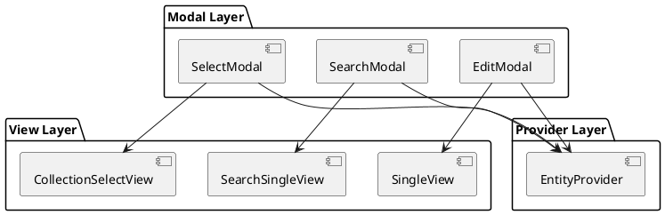
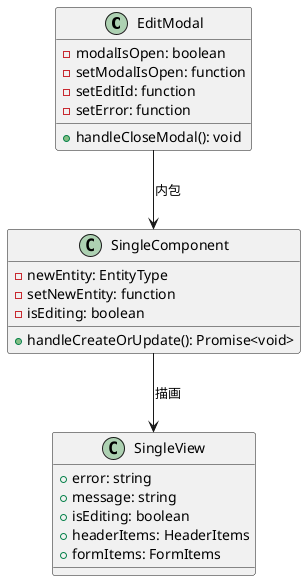
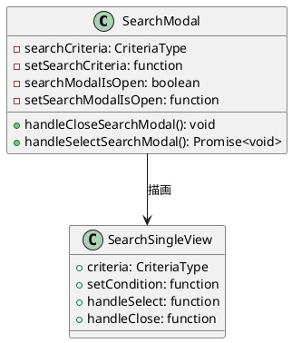
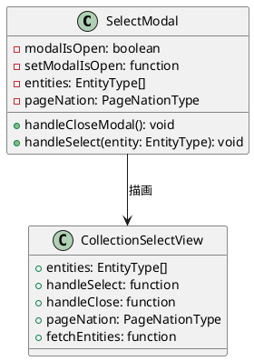
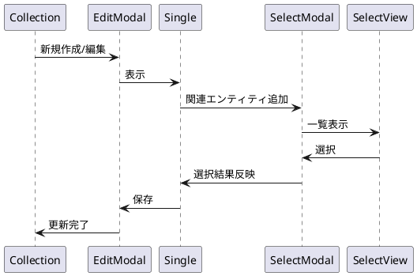

# 第5章: モーダルパターン

本章では、販売管理システムで採用しているモーダルダイアログのパターンについて解説します。react-modal を使用した編集モーダル、検索モーダル、選択モーダルの3つのパターンを詳しく説明します。

## 5.1 モーダルパターンの概要

### モーダルの種類

本システムでは、3種類のモーダルパターンを使用しています。

| パターン | 命名規則 | 用途 |
|---------|---------|------|
| EditModal | {Entity}EditModal | 新規作成・編集ダイアログ |
| SearchModal | {Entity}SearchModal | 検索条件入力ダイアログ |
| SelectModal | {Entity}SelectModal | 関連エンティティ選択ダイアログ |

### モーダルアーキテクチャ



### react-modal の設定

モーダルダイアログには react-modal ライブラリを使用しています。

**App.tsx でのアプリケーション要素の設定**

```typescript
import Modal from "react-modal";
import {Providers} from "./components/application/Providers.tsx";

// アプリケーションルート要素の設定
Modal.setAppElement('#root');

function App() {
  return (
      <>
          <Providers/>
      </>
  )
}
```

**モーダルの共通スタイル（App.css）**

```css
/* オーバーレイのスタイリング */
.modal-overlay {
  position: fixed;
  top: 0;
  left: 0;
  right: 0;
  bottom: 0;
  background-color: rgba(0, 0, 0, 0.75);
  display: flex;
  justify-content: center;
  align-items: center;
  z-index: 1000;
}

/* モーダルコンテンツのスタイリング */
.modal {
  background: white;
  padding: 20px;
  border-radius: 8px;
  width: 90%;
  max-width: 1200px;
  max-height: 90vh;
  overflow-y: auto;
  position: relative;
  outline: none;
  display: flex;
  flex-direction: column;
}
```

## 5.2 EditModal パターン

EditModal は、エンティティの新規作成・編集を行うためのモーダルです。

### 構造



### 実装例（DepartmentEditModal）

```typescript
import React from "react";
import Modal from "react-modal";
import {DepartmentSingle} from "./DepartmentSingle.tsx";
import {useDepartmentContext} from "../../../providers/master/Department.tsx";

export const DepartmentEditModal: React.FC = () => {
    const {
        modalIsOpen,
        setModalIsOpen,
        setEditId,
        setError
    } = useDepartmentContext();

    const handleCloseModal = () => {
        setError("");
        setModalIsOpen(false);
        setEditId(null);
    };

    return (
        <Modal
            isOpen={modalIsOpen}
            onRequestClose={handleCloseModal}
            contentLabel="部門情報を入力"
            className="modal"
            overlayClassName="modal-overlay"
            bodyOpenClassName="modal-open"
        >
            <DepartmentSingle/>
        </Modal>
    )
}
```

### Single コンポーネント（DepartmentSingle）

EditModal 内で表示される Single コンポーネントは、フォームのロジックと View を組み合わせます。

```typescript
import React from "react";
import {showErrorMessage} from "../../application/utils.ts";
import {DepartmentSingleView} from "../../../views/master/department/DepartmentSingle.tsx";
import {EmployeeCollectionAddListView} from "../../../views/master/employee/EmployeeCollection.tsx";
import {EmployeeType} from "../../../models";
import {useDepartmentContext} from "../../../providers/master/Department.tsx";
import {useEmployeeContext} from "../../../providers/master/Employee.tsx";
import {EmployeeSelectModal} from "./EmployeeSelectModal.tsx";

export const DepartmentSingle: React.FC = () => {
    const {
        error,
        setError,
        message,
        setMessage,
        isEditing,
        newDepartment,
        setNewDepartment,
        initialDepartment,
        fetchDepartments,
        departmentService,
        setModalIsOpen,
        editId,
        setEditId
    } = useDepartmentContext();

    const {
        setModalIsOpen:setEmployeeModalIsOpen,
        setIsEditing:setEmployeeIsEditing
    } = useEmployeeContext();

    const handleCloseModal = () => {
        setError("");
        setModalIsOpen(false);
        setEditId(null);
    };

    const handleCreateOrUpdateDepartment = async () => {
        // バリデーション
        const validateDepartment = (): boolean => {
            if (!newDepartment.departmentCode.trim() ||
                !newDepartment.departmentName.trim()) {
                setError("部門コード、部門名は必須項目です。");
                return false;
            }
            return true;
        };

        if (!validateDepartment()) {
            return;
        }

        try {
            if (isEditing && editId) {
                await departmentService.update(newDepartment);
            } else {
                await departmentService.create(newDepartment);
            }
            setNewDepartment(initialDepartment);
            await fetchDepartments.load();
            if (isEditing) {
                setMessage("部門を更新しました。");
            } else {
                setMessage("部門を作成しました。");
            }
            handleCloseModal();
        } catch (error: unknown) {
            showErrorMessage(error, setError, "部門の作成に失敗しました");
        }
    }

    return (
        <>
            <DepartmentSingleView
                error={error}
                message={message}
                isEditing={isEditing}
                headerItems={{handleCreateOrUpdateDepartment, handleCloseModal}}
                formItems={{newDepartment, setNewDepartment}}
            />

            <EmployeeSelectModal/>

            {isEditing && (
                <EmployeeCollectionAddListView
                    employees={newDepartment.employees.filter(
                        (e: EmployeeType) => !e.deleteFlag
                    )}
                    handleAdd={handleOpenEmployeeModal}
                    handleDelete={handleDeleteEmployee}
                />
            )}
        </>
    );
}
```

### SingleView（DepartmentSingleView）

View コンポーネントは、純粋な表示ロジックのみを担当します。

```typescript
import React from 'react';
import {Message} from "../../../components/application/Message.tsx";
import {DepartmentType, LowerType, SlitYnType} from "../../../models";
import {convertToDateInputFormat} from "../../../components/application/utils.ts";
import {FormInput, SingleViewHeaderActions, SingleViewHeaderItem} from "../../Common.tsx";

interface DepartmentSingleViewProps {
    error: string | null;
    message: string | null;
    isEditing: boolean;
    headerItems: {
        handleCreateOrUpdateDepartment: () => void;
        handleCloseModal: () => void;
    }
    formItems: {
        newDepartment: DepartmentType;
        setNewDepartment: React.Dispatch<React.SetStateAction<DepartmentType>>;
    }
}

export const DepartmentSingleView = ({
    error,
    message,
    isEditing,
    headerItems: {
        handleCreateOrUpdateDepartment,
        handleCloseModal,
    },
    formItems: {
        newDepartment,
        setNewDepartment
    }
}: DepartmentSingleViewProps) => (
    <div className="single-view-object-container">
        <Message error={error} message={message}/>
        <div className="single-view-header">
            <Header
                title="部門"
                subtitle={isEditing ? "編集" : "新規作成"}
                isEditing={isEditing}
                handleCreateOrUpdateDepartment={handleCreateOrUpdateDepartment}
                handleCloseModal={handleCloseModal}
            />
        </div>
        <div className="single-view-container">
            <div className="single-view-content">
                <div className="single-view-content-item">
                    <Form
                        isEditing={isEditing}
                        newDepartment={newDepartment}
                        setNewDepartment={setNewDepartment}
                    />
                </div>
            </div>
        </div>
    </div>
);
```

### 共通コンポーネント（Common.tsx）

フォーム要素の共通コンポーネントを定義しています。

```typescript
import React from "react";

// ヘッダータイトル
export const SingleViewHeaderItem: React.FC<{
    title: string,
    subtitle: string
}> = ({title, subtitle}) => (
    <div className="single-view-header-item">
        <h1 className="single-view-title">{title}</h1>
        <p className="single-view-subtitle">{subtitle}</p>
    </div>
);

// ヘッダーアクション
export const SingleViewHeaderActions: React.FC<{
    isEditing: boolean,
    handleCreateOrUpdateUser: () => void,
    handleCloseModal: () => void
}> = ({isEditing, handleCreateOrUpdateUser, handleCloseModal}) => (
    <div className="single-view-header-item">
        <div className="button-container">
            <button className="action-button" onClick={handleCreateOrUpdateUser} id="save">
                {isEditing ? "更新" : "作成"}
            </button>
            <button className="action-button" onClick={handleCloseModal} id="cancel">
                キャンセル
            </button>
        </div>
    </div>
);

// フォーム項目ラッパー
interface FormItemProps {
    label: string;
    children: React.ReactNode;
}

export const FormItem = ({label, children}: FormItemProps) => (
    <div className="single-view-content-item-form-item">
        <label className="single-view-content-item-form-item-label">{label}</label>
        {children}
    </div>
);

// テキスト入力
interface FormInputProps {
    label: string;
    id: string;
    type: string;
    className: string;
    placeholder?: string;
    value?: string | number | undefined;
    onChange: (e: React.ChangeEvent<HTMLInputElement>) => void;
    onClick?: () => void;
    disabled?: boolean;
    checked?: boolean;
}

export const FormInput: React.FC<FormInputProps> = ({
    label,
    id,
    type,
    className,
    placeholder,
    value,
    onChange,
    onClick,
    disabled,
    checked,
}) => {
    return (
        <FormItem label={label}>
            <input
                id={id}
                type={type}
                className={className}
                placeholder={placeholder}
                value={value}
                onChange={onChange}
                onClick={onClick}
                disabled={disabled}
                checked={checked}
            />
        </FormItem>
    );
};

// セレクトボックス
interface FormSelectProps<T> {
    id: string;
    label: string;
    className?: string;
    value?: T;
    options: { [key: string]: T };
    onChange: (value: T) => void;
    disabled?: boolean;
}

export const FormSelect = <T extends string>({
    id,
    label,
    className,
    value,
    options,
    onChange,
    disabled,
}: FormSelectProps<T>) => (
    <FormItem label={label}>
        <select
            id={id}
            className={className}
            value={value}
            onChange={(e) => onChange(e.target.value as T)}
            disabled={disabled}
        >
            <option value=""></option>
            {Object.entries(options).map(([key, val]) => (
                <option key={key} value={val}>
                    {val}
                </option>
            ))}
        </select>
    </FormItem>
);

// テキストエリア
interface FormTextareaProps {
    label: string;
    id: string;
    className?: string;
    placeholder?: string;
    value: string;
    onChange: (event: React.ChangeEvent<HTMLTextAreaElement>) => void;
    disabled?: boolean;
}

export const FormTextarea: React.FC<FormTextareaProps> = ({
    label,
    id,
    className,
    placeholder,
    value,
    onChange,
    disabled,
}) => {
    return (
        <FormItem label={label}>
            <textarea
                id={id}
                className={className}
                placeholder={placeholder}
                value={value}
                onChange={onChange}
                disabled={disabled}
            />
        </FormItem>
    );
};
```

## 5.3 SearchModal パターン

SearchModal は、一覧の検索条件を入力するためのモーダルです。

### 構造



### 実装例（DepartmentSearchModal）

```typescript
import React from "react";
import Modal from "react-modal";
import {DepartmentSearchSingleView} from "../../../views/master/department/DepartmentSearch.tsx";
import {showErrorMessage} from "../../application/utils.ts";
import {useDepartmentContext} from "../../../providers/master/Department.tsx";

export const DepartmentSearchModal: React.FC = () => {
    const {
        searchDepartmentCriteria,
        setSearchDepartmentCriteria,
        searchModalIsOpen,
        setSearchModalIsOpen,
        setDepartments,
        setCriteria,
        setPageNation,
        setLoading,
        setMessage,
        setError,
        departmentService
    } = useDepartmentContext();

    const handleCloseSearchModal = () => {
        setSearchModalIsOpen(false);
    }

    const handleSelectSearchModal = async () => {
        if (!searchDepartmentCriteria) {
            return;
        }
        setLoading(true);
        try {
            const result = await departmentService.search(searchDepartmentCriteria);
            setDepartments(result ? result.list : []);
            if (result.list.length === 0) {
                showErrorMessage(`検索結果は0件です`, setError);
            } else {
                setCriteria(searchDepartmentCriteria);
                setPageNation(result);
                setMessage("");
                setError("");
            }
        } catch (error: any) {
            showErrorMessage(
                `検索に失敗しました: ${error?.message}`,
                setError
            );
        } finally {
            setLoading(false);
        }
    }

    return (
        <Modal
            isOpen={searchModalIsOpen}
            onRequestClose={handleCloseSearchModal}
            contentLabel="検索情報を入力"
            className="modal"
            overlayClassName="modal-overlay"
            bodyOpenClassName="modal-open"
        >
            <DepartmentSearchSingleView
                criteria={searchDepartmentCriteria}
                setCondition={setSearchDepartmentCriteria}
                handleSelect={handleSelectSearchModal}
                handleClose={handleCloseSearchModal}
            />
        </Modal>
    )
}
```

### SearchSingleView（DepartmentSearchSingleView）

検索フォームの View コンポーネントです。

```typescript
import React, {MouseEventHandler} from "react";
import {FormInput, SingleViewHeaderItem} from "../../Common.tsx";
import {DepartmentCriteriaType} from "../../../models";

interface DepartmentSearchSingleViewProps {
    criteria: DepartmentCriteriaType,
    setCondition:(criteria: DepartmentCriteriaType) => void,
    handleSelect: (criteria: DepartmentCriteriaType) => Promise<void>,
    handleClose: () => void
}

export const DepartmentSearchSingleView: React.FC<DepartmentSearchSingleViewProps> = ({
    criteria,
    setCondition,
    handleSelect,
    handleClose,
}) => {
    const handleClick: MouseEventHandler<HTMLButtonElement> = async(e) => {
        e.preventDefault();
        await handleSelect(criteria);
        handleClose();
    }

    const handleCancel: MouseEventHandler<HTMLButtonElement> = (e) => {
        e.preventDefault();
        handleClose();
    }

    return (
        <div className="single-view-object-container">
            <div className="single-view-header">
                <div>
                    <SingleViewHeaderItem title={"部門"} subtitle={"検索"}/>
                </div>
            </div>
            <div className="single-view-container">
                <div className="single-view-content">
                    <div className="single-view-content-item">
                        <Form
                            criteria={criteria}
                            setCondition={setCondition}
                            handleClick={handleClick}
                            handleClose={handleCancel}
                        />
                    </div>
                </div>
            </div>
        </div>
    );
};

// 検索フォーム
interface FormProps {
    criteria: DepartmentCriteriaType,
    setCondition:(criteria: DepartmentCriteriaType) => void,
    handleClick: (e: React.MouseEvent<HTMLButtonElement>) => void,
    handleClose: (e: React.MouseEvent<HTMLButtonElement>) => void
}

const Form = ({criteria, setCondition, handleClick, handleClose}: FormProps) => {
    return (
        <div className="single-view-content-item-form">
            <FormInput
                id={"search-department-code"}
                type="text"
                className="single-view-content-item-form-item-input"
                label={"部門コード"}
                value={criteria.departmentCode}
                onChange={(e) => setCondition(
                    {...criteria, departmentCode: e.target.value}
                )}/>
            <FormInput
                id={"search-department-name"}
                type="text"
                className="single-view-content-item-form-item-input"
                label={"部門名"}
                value={criteria.departmentName}
                onChange={(e) => setCondition(
                    {...criteria, departmentName: e.target.value}
                )}/>
            <FormInput
                label="開始日"
                id="startDate"
                type="date"
                className="single-view-content-item-form-item-input"
                value={criteria.startDate}
                onChange={(e) => setCondition(
                    {...criteria, startDate: e.target.value}
                )}
            />
            <FormInput
                label="終了日"
                id="endDate"
                type="date"
                className="single-view-content-item-form-item-input"
                value={criteria.endDate}
                onChange={(e) => setCondition(
                    {...criteria, endDate: e.target.value}
                )}
            />

            <div className="button-container">
                <button className="action-button" id="search-all" onClick={handleClick}>
                    検索
                </button>
                <button className="action-button" onClick={handleClose} id="cancel">
                    キャンセル
                </button>
            </div>
        </div>
    )
};
```

### 検索条件の型定義

```typescript
// models/master/department.ts
export type DepartmentCriteriaType = {
    departmentCode?: string;
    departmentName?: string;
    startDate?: string;
    endDate?: string;
}
```

## 5.4 SelectModal パターン

SelectModal は、関連エンティティを選択するためのモーダルです。親エンティティの編集時に、子エンティティを追加する際に使用します。

### 構造



### 実装例（EmployeeSelectModal）

部門編集時に所属社員を追加するためのモーダルです。

```typescript
import React from "react";
import Modal from "react-modal";
import {EmployeeType} from "../../../models";
import {EmployeeCollectionSelectView} from "../../../views/master/employee/EmployeeSelect.tsx";
import {useDepartmentContext} from "../../../providers/master/Department.tsx";
import {useEmployeeContext} from "../../../providers/master/Employee.tsx";

export const EmployeeSelectModal: React.FC = () => {
    const {
        setError,
        newDepartment,
        setNewDepartment
    } = useDepartmentContext();

    const {
        modalIsOpen: employeeModalIsOpen,
        setModalIsOpen: setEmployeeModalIsOpen,
        setEditId: setEmployeeEditId,
        employees,
        fetchEmployees,
        pageNation: employeePageNation,
    } = useEmployeeContext();

    const handleCloseEmployeeModal = () => {
        setError("");
        setEmployeeModalIsOpen(false);
        setEmployeeEditId(null);
    };

    const handleEmployeeCollectionSelect = (employee: EmployeeType) => {
        // 既存の社員リストから同一社員を除外
        const newEmployees = newDepartment.employees.filter(
            (e: EmployeeType) => e.empCode !== employee.empCode
        );

        // 選択された社員を追加フラグ付きで追加
        if (employee.empCode) {
            newEmployees.push({
                ...employee,
                addFlag: true,
                deleteFlag: false
            });
        }

        setNewDepartment({
            ...newDepartment,
            employees: newEmployees
        });
    }

    return (
        <Modal
            isOpen={employeeModalIsOpen}
            onRequestClose={handleCloseEmployeeModal}
            contentLabel="社員情報を入力"
            className="modal"
            overlayClassName="modal-overlay"
            bodyOpenClassName="modal-open"
        >
            <EmployeeCollectionSelectView
                employees={employees}
                handleSelect={handleEmployeeCollectionSelect}
                handleClose={handleCloseEmployeeModal}
                pageNation={employeePageNation}
                fetchEmployees={fetchEmployees.load}
            />
        </Modal>
    )
}
```

### CollectionSelectView（EmployeeCollectionSelectView）

選択可能な一覧を表示する View コンポーネントです。

```typescript
import {EmployeeType} from "../../../models";
import React from "react";
import {PageNation, PageNationType} from "../../application/PageNation.tsx";
import {FaTimes} from "react-icons/fa";

interface EmployeeCollectionSelectProps {
    employees: EmployeeType[];
    handleSelect: (employee: EmployeeType) => void;
    handleClose: () => void;
    pageNation: PageNationType | null;
    fetchEmployees: () => void;
}

export const EmployeeCollectionSelectView: React.FC<EmployeeCollectionSelectProps> = ({
    employees,
    handleSelect,
    handleClose,
    pageNation,
    fetchEmployees
}) => {
    return (
        <div className="collection-view-object-container">
            <div className="collection-view-container">
                <button className="close-modal-button" onClick={handleClose}>
                    <FaTimes aria-hidden="true"/>
                </button>
                <div className="collection-view-header">
                    <div className="single-view-header-item">
                        <h2 className="single-view-title">社員</h2>
                    </div>
                </div>
                <div className="collection-view-content">
                    <div className="collection-object-container-modal">
                        <ul className="collection-object-list">
                            {employees.map(employee => (
                                <li className="collection-object-item" key={employee.empCode}>
                                    <div className="collection-object-item-content"
                                         data-id={employee.empCode}>
                                        <div className="collection-object-item-content-details">
                                            所属部門
                                        </div>
                                        <div className="collection-object-item-content-name">
                                            {employee.departmentCode}
                                        </div>
                                    </div>
                                    <div className="collection-object-item-content"
                                         data-id={employee.empCode}>
                                        <div className="collection-object-item-content-details">
                                            社員コード
                                        </div>
                                        <div className="collection-object-item-content-name">
                                            {employee.empCode}
                                        </div>
                                    </div>
                                    <div className="collection-object-item-content"
                                         data-id={employee.empCode}>
                                        <div className="collection-object-item-content-details">
                                            名前
                                        </div>
                                        <div className="collection-object-item-content-name">
                                            {employee.empFirstName + ' ' + employee.empLastName}
                                        </div>
                                    </div>
                                    <div className="collection-object-item-actions"
                                         data-id={employee.empCode}>
                                        <button
                                            className="action-button"
                                            onClick={() => handleSelect(employee)}
                                            id="select-employee"
                                        >
                                            選択
                                        </button>
                                    </div>
                                </li>
                            ))}
                        </ul>
                    </div>
                </div>
                <PageNation pageNation={pageNation} callBack={fetchEmployees}/>
            </div>
        </div>
    );
};
```

## 5.5 useModal フック

モーダルの状態管理を簡素化するためのカスタムフックです。

### 実装

```typescript
// components/application/hooks.ts
import {useState} from "react";

export const useModal = () => {
    const [modalIsOpen, setModalIsOpen] = useState(false);
    return {modalIsOpen, setModalIsOpen};
}
```

### 使用例

Provider でモーダル状態を管理する際に使用します。

```typescript
// providers/master/Department.tsx
import {useModal} from "../../components/application/hooks.ts";

export const DepartmentProvider: React.FC<{ children: ReactNode }> = ({children}) => {
    // 編集モーダル
    const {modalIsOpen, setModalIsOpen} = useModal();
    // 検索モーダル
    const {modalIsOpen: searchModalIsOpen, setModalIsOpen: setSearchModalIsOpen} = useModal();

    // ... 他の状態管理

    return (
        <DepartmentContext.Provider value={{
            modalIsOpen,
            setModalIsOpen,
            searchModalIsOpen,
            setSearchModalIsOpen,
            // ... 他の値
        }}>
            {children}
        </DepartmentContext.Provider>
    );
};
```

## 5.6 モーダル間の連携

複雑な編集画面では、複数のモーダルが連携することがあります。

### 親子モーダルの連携パターン



### 実装例（部門編集での社員選択）

```typescript
// DepartmentSingle.tsx
export const DepartmentSingle: React.FC = () => {
    const {
        newDepartment,
        setNewDepartment,
        // ...
    } = useDepartmentContext();

    const {
        setModalIsOpen: setEmployeeModalIsOpen,
        setIsEditing: setEmployeeIsEditing
    } = useEmployeeContext();

    // 社員選択モーダルを開く
    const handleOpenEmployeeModal = () => {
        setMessage("");
        setError("");
        setEmployeeIsEditing(true);
        setEmployeeModalIsOpen(true);
    };

    // 社員を削除（削除フラグを立てる）
    const handleDeleteEmployee = (employee: EmployeeType) => {
        const newEmployees = newDepartment.employees.filter(
            (e: EmployeeType) => e.empCode !== employee.empCode
        );
        if (employee.empCode) {
            newEmployees.push({
                ...employee,
                addFlag: false,
                deleteFlag: true
            });
        }
        setNewDepartment({
            ...newDepartment,
            employees: newEmployees
        });
    }

    return (
        <>
            <DepartmentSingleView
                // ...props
            />

            {/* 社員選択モーダル */}
            <EmployeeSelectModal/>

            {/* 編集時のみ社員一覧を表示 */}
            {isEditing && (
                <EmployeeCollectionAddListView
                    employees={newDepartment.employees.filter(
                        (e: EmployeeType) => !e.deleteFlag
                    )}
                    handleAdd={handleOpenEmployeeModal}
                    handleDelete={handleDeleteEmployee}
                />
            )}
        </>
    );
}
```

## 5.7 追加・削除フラグパターン

関連エンティティの追加・削除を管理するためのフラグパターンです。

### フラグの役割

| フラグ | 用途 |
|-------|------|
| addFlag | 新規追加されたエンティティ |
| deleteFlag | 削除予定のエンティティ |

### 型定義

```typescript
// models/master/employee.ts
export type EmployeeType = {
    empCode: string;
    empFirstName: string;
    empLastName: string;
    departmentCode: string;
    // フラグ
    addFlag?: boolean;
    deleteFlag?: boolean;
}
```

### フラグ管理のロジック

```typescript
// 選択時：addFlag を true に
const handleSelect = (employee: EmployeeType) => {
    const newEmployees = newDepartment.employees.filter(
        (e: EmployeeType) => e.empCode !== employee.empCode
    );
    if (employee.empCode) {
        newEmployees.push({
            ...employee,
            addFlag: true,
            deleteFlag: false
        });
    }
    setNewDepartment({
        ...newDepartment,
        employees: newEmployees
    });
}

// 削除時：deleteFlag を true に
const handleDelete = (employee: EmployeeType) => {
    const newEmployees = newDepartment.employees.filter(
        (e: EmployeeType) => e.empCode !== employee.empCode
    );
    if (employee.empCode) {
        newEmployees.push({
            ...employee,
            addFlag: false,
            deleteFlag: true
        });
    }
    setNewDepartment({
        ...newDepartment,
        employees: newEmployees
    });
}

// 表示時：deleteFlag が false のもののみ表示
const displayEmployees = newDepartment.employees.filter(
    (e: EmployeeType) => !e.deleteFlag
);
```

## 5.8 モーダルのアクセシビリティ

react-modal は、アクセシビリティ対応が組み込まれています。

### 主要な設定

| 属性 | 説明 |
|------|------|
| contentLabel | スクリーンリーダー向けのラベル |
| onRequestClose | ESC キーでの閉じる動作 |
| bodyOpenClassName | モーダル表示時の body クラス |

### 実装例

```typescript
<Modal
    isOpen={modalIsOpen}
    onRequestClose={handleCloseModal}    // ESC キーで閉じる
    contentLabel="部門情報を入力"         // スクリーンリーダー向けラベル
    className="modal"
    overlayClassName="modal-overlay"
    bodyOpenClassName="modal-open"       // スクロール制御用
>
    {/* モーダルコンテンツ */}
</Modal>
```

### body のスクロール制御

```css
/* App.css */
body.modal-open {
    overflow: hidden;
}
```

## まとめ

本章では、モーダルパターンについて解説しました。

- **EditModal**: エンティティの新規作成・編集
- **SearchModal**: 検索条件の入力
- **SelectModal**: 関連エンティティの選択
- **useModal フック**: モーダル状態の簡素化
- **追加・削除フラグ**: 関連エンティティの変更管理

次章では、認証・ユーザー管理の実装について詳しく解説します。
