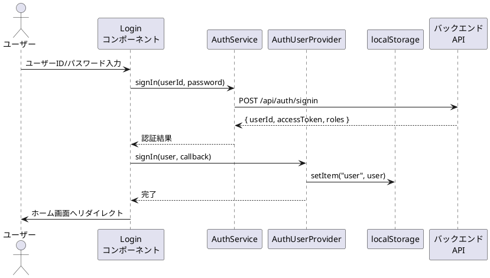
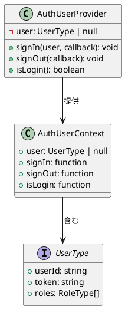
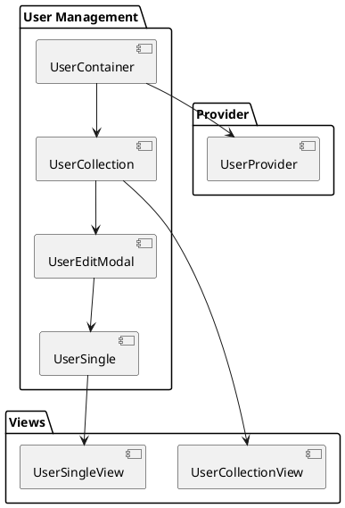

# 第6章: 認証・ユーザー管理

本章では、販売管理システムの認証機能とユーザー管理機能の実装について解説します。JWT トークンによる認証、ロールベースアクセス制御、ユーザー CRUD 操作を詳しく説明します。

## 6.1 認証フロー

### 認証アーキテクチャ

本システムでは、JWT（JSON Web Token）ベースの認証を採用しています。



### ログイン画面の実装

ログインコンポーネントは、ユーザー認証のエントリポイントです。

**Auth.tsx（Login コンポーネント）**

```typescript
import React, {useEffect, useState} from "react";
import {useLocation, useNavigate} from "react-router-dom";
import {AuthUserContextType, useAuthUserContext} from "../../providers/system/AuthUser.tsx";
import AuthService from "../../services/system/auth.ts";
import {LoginSingleView} from "../../views/system/auth/Login.tsx";
import {CustomLocation, DataType, UserType} from "../../models";

const DEFAULT_USER_ID = "U000003";
const DEFAULT_PASSWORD = "a234567Z";

export const Login: React.FC = () => {
    const [userId, setUserId] = useState(DEFAULT_USER_ID);
    const [password, setPassword] = useState(DEFAULT_PASSWORD);
    const [message, setMessage] = useState("");
    const navigate = useNavigate();
    const location: CustomLocation = useLocation() as CustomLocation;
    const fromPathName: string = location.state?.from?.pathname || "/";
    const authUser: AuthUserContextType = useAuthUserContext();

    // 既にログイン済みの場合はホームへリダイレクト
    useEffect(() => {
        if (authUser.isLogin()) {
            navigate("/", {replace: true});
        }
    }, [authUser, navigate]);

    const handleSignIn = async () => {
        const authService = AuthService();
        try {
            const result = await authService.signIn(userId, password);
            if (result.message) {
                setMessage(result.message);
                return;
            }
            const data: DataType = result as DataType;
            const user: UserType = {
                userId: data.userId,
                token: data.accessToken,
                roles: data.roles,
            };
            authUser.signIn(user, () => {
                navigate(fromPathName, {replace: true});
            });
        } catch (e: any) {
            setMessage(e.message);
        }
    };

    return (
        <LoginSingleView
            message={message}
            handleSignIn={handleSignIn}
            userId={userId}
            setUserId={setUserId}
            password={password}
            setPassword={setPassword}
        />
    );
}
```

### ログイン画面の View

**Login.tsx（LoginSingleView）**

```typescript
import React from 'react';

const ErrorMessage = ({message}: { message: string }) => (
    <div className="view-message-content">
        <div className="view-message-content-icon">
            <i className="fas fa-exclamation-circle"></i>
        </div>
        <div className="view-message-content-error-text">
            <p className="view-message-content-text-title">ログインに失敗しました</p>
            <p className="view-message-content-text-subtitle">{message}</p>
        </div>
    </div>
);

interface HeaderProps {
    title: string;
    subtitle: string;
    onSignIn: () => void;
}

const Header = ({title, subtitle, onSignIn}: HeaderProps) => (
    <div className="single-view-header">
        <div className="single-view-header-item">
            <h1 className="single-view-title logo">{title}</h1>
            <p className="single-view-subtitle">{subtitle}</p>
        </div>
        <div className="single-view-header-item">
            <button className="action-button" id="login" onClick={onSignIn}>
                ログイン
            </button>
        </div>
    </div>
);

interface LoginFormProps {
    userId: string;
    setUserId: (userId: string) => void;
    password: string;
    setPassword: (password: string) => void;
}

const LoginForm = ({userId, setUserId, password, setPassword}: LoginFormProps) => (
    <div className="single-view-content-item-form">
        <div className="single-view-content-item-form-item">
            <label className="single-view-content-item-form-item-label">ユーザー名</label>
            <input
                className="single-view-content-item-form-item-input"
                type="text"
                value={userId}
                onChange={(e) => setUserId(e.target.value)}
                id="userId"
            />
        </div>
        <div className="single-view-content-item-form-item">
            <label className="single-view-content-item-form-item-label">パスワード</label>
            <input
                className="single-view-content-item-form-item-input"
                type="password"
                value={password}
                onChange={(e) => setPassword(e.target.value)}
                id="password"
            />
        </div>
    </div>
);

interface LoginSingleViewProps {
    message: string;
    handleSignIn: () => void;
    userId: string;
    setUserId: (userId: string) => void;
    password: string;
    setPassword: (password: string) => void;
}

export const LoginSingleView = ({
    message,
    handleSignIn,
    userId,
    setUserId,
    password,
    setPassword
}: LoginSingleViewProps) => {
    return (
        <div className="root-container w-container">
            <div className="view-container" id="contents">
                <div className="single-view-object-container">
                    <div className="view-message-box-container" id="message">
                        {message && <ErrorMessage message={message}/>}
                    </div>
                    <div className="single-view-box-container">
                        <Header
                            title="SMS"
                            subtitle="Sales Management System"
                            onSignIn={handleSignIn}
                        />
                        <div className="single-view-content">
                            <div className="single-view-content-item">
                                <LoginForm
                                    userId={userId}
                                    setUserId={setUserId}
                                    password={password}
                                    setPassword={setPassword}
                                />
                            </div>
                        </div>
                    </div>
                </div>
            </div>
        </div>
    );
};
```

### ログアウト処理

ログアウトコンポーネントは、認証状態をクリアしてログイン画面へリダイレクトします。

```typescript
export const Logout: React.FC = () => {
    const authUser: AuthUserContextType = useAuthUserContext();
    const navigate = useNavigate();

    const handleSignOut = () => {
        authUser.signOut(() => {
            navigate("/login");
        });
    };

    React.useEffect(() => {
        handleSignOut();
    }, []);

    return null;
};
```

## 6.2 AuthUser Provider

### 認証コンテキストの設計

AuthUserProvider は、アプリケーション全体で認証状態を管理します。



### AuthUserProvider の実装

**AuthUser.tsx**

```typescript
import React from "react";
import {UserType} from "../../models";

export type AuthUserContextType = {
    user: UserType | null;
    signIn: (user: UserType, callback: () => void) => void;
    signOut: (callback: () => void) => void;
    isLogin: () => boolean;
}

const AuthUserContext = React.createContext<AuthUserContextType>(
    {} as AuthUserContextType
);

export const useAuthUserContext = (): AuthUserContextType => {
    return React.useContext<AuthUserContextType>(AuthUserContext);
}

type Props = {
    children: React.ReactNode;
}

export const AuthUserProvider: React.FC<Props> = (props: Props) => {
    const [user, setUser] = React.useState<UserType | null>(null);

    // サインイン処理
    const signIn = (user: UserType, callback: () => void) => {
        setUser(user);
        window.localStorage.setItem("user", JSON.stringify(user));
        callback();
    }

    // サインアウト処理
    const signOut = (callback: () => void) => {
        setUser(null);
        window.localStorage.removeItem("user");
        callback();
    }

    // ログイン状態の確認
    const isLogin = () => {
        const user = window.localStorage.getItem("user");
        if (user) {
            setUser(JSON.parse(user));
            return true;
        }
        return false;
    }

    const value: AuthUserContextType = {user, signIn, signOut, isLogin};
    return (
        <AuthUserContext.Provider value={value}>
            {props.children}
        </AuthUserContext.Provider>
    );
}
```

### トークン管理

JWT トークンは localStorage に保存され、API リクエスト時に自動的に付与されます。

**services/config.ts での認証ヘッダー設定**

```typescript
import Env from "../env.ts";

const Config = () => {
    let config: { apiUrl: string, authHeader: string };
    const getApiUrl = () => Env.isProduction() ? Env.prdApiUrl : Env.devApiUrl;
    const user = window.localStorage.getItem("user");
    if (user) {
        config = {
            apiUrl: getApiUrl(),
            authHeader: "Bearer " + JSON.parse(user).token
        };
        return config;
    }
    config = {apiUrl: getApiUrl(), authHeader: ""};
    return config;
};

export default Config;
```

### 自動ログイン

ページリロード時に localStorage から認証情報を復元します。

```typescript
const isLogin = () => {
    const user = window.localStorage.getItem("user");
    if (user) {
        setUser(JSON.parse(user));
        return true;
    }
    return false;
}
```

## 6.3 認証サービス

### AuthService の実装

**auth.ts**

```typescript
import Config from "../config.ts";
import {APIResponse} from "../../models";

const AuthService = () => {
    const config = Config();

    const signIn = async (userId: string, password: string): Promise<APIResponse> => {
        const url = `${config.apiUrl}/auth/signin`;
        try {
            const response = await fetch(url, {
                method: "POST",
                headers: {
                    "Content-Type": "application/json"
                },
                body: JSON.stringify({
                    userId,
                    password
                })
            });

            return await response.json();
        } catch (error) {
            throw new Error(`サービスから応答がありません ${error}`);
        }
    };

    return {
        signIn
    };
};

export default AuthService;
```

### API レスポンスの型定義

```typescript
// models/application.ts
export type APIResponse = {
    message?: string;
}

export type DataType = {
    userId: string;
    accessToken: string;
    roles: RoleType[];
}
```

## 6.4 ユーザー管理

### ユーザー管理の構成



### UserContainer

ユーザー管理のルートコンテナです。

```typescript
import React, {useEffect} from "react";
import LoadingIndicator from "../../../views/application/LoadingIndicatior.tsx";
import {SiteLayout} from "../../../views/SiteLayout.tsx";
import {UserProvider, useUserContext} from "../../../providers/system/User.tsx";
import {UserCollection} from "./UserCollection.tsx";

export const UserContainer: React.FC = () => {
    const Content: React.FC = () => {
        const {
            loading,
            fetchUsers,
        } = useUserContext();

        useEffect(() => {
            fetchUsers.load().then(() => {
            });
        }, []);

        return (
            <>
                {loading ? (
                    <LoadingIndicator/>
                ) : (
                    <UserCollection/>
                )}
            </>
        );
    }

    return (
        <SiteLayout>
            <UserProvider>
                <Content/>
            </UserProvider>
        </SiteLayout>
    );
};
```

### UserProvider

ユーザー管理の状態を管理する Provider です。

```typescript
import React, { createContext, useContext, ReactNode, useState, useMemo } from "react";
import {showErrorMessage} from "../../components/application/utils.ts";
import {PageNationType, usePageNation} from "../../views/application/PageNation.tsx";
import {UserAccountType} from "../../models";
import {UserServiceType} from "../../services/system/user.ts";
import {useMessage} from "../../components/application/Message.tsx";
import {useModal} from "../../components/application/hooks.ts";
import {useFetchUsers, useUser} from "../../components/system/user/hooks";

// Context の型定義
type UserContextType = {
    loading: boolean;
    setLoading: Dispatch<SetStateAction<boolean>>;
    message: string | null;
    setMessage: Dispatch<SetStateAction<string | null>>;
    error: string | null;
    setError: Dispatch<SetStateAction<string | null>>;
    showErrorMessage: typeof showErrorMessage;
    pageNation: PageNationType | null;
    setPageNation: Dispatch<SetStateAction<PageNationType | null>>;
    modalIsOpen: boolean;
    setModalIsOpen: Dispatch<SetStateAction<boolean>>;
    isEditing: boolean;
    setIsEditing: Dispatch<SetStateAction<boolean>>;
    editId: string | null;
    setEditId: Dispatch<SetStateAction<string | null>>;
    initialUser: UserAccountType;
    users: UserAccountType[];
    setUsers: Dispatch<SetStateAction<UserAccountType[]>>;
    newUser: UserAccountType;
    setNewUser: Dispatch<SetStateAction<UserAccountType>>;
    searchUserId: string;
    setSearchUserId: Dispatch<SetStateAction<string>>;
    fetchUsers: {
        load: () => Promise<void>;
    };
    userService: UserServiceType;
};

const UserContext = createContext<UserContextType | undefined>(undefined);

export const useUserContext = () => {
    const context = useContext(UserContext);
    if (!context) {
        throw new Error("useUserContext must be used within a UserProvider");
    }
    return context;
};

export const UserProvider: React.FC<Props> = ({ children }) => {
    const [loading, setLoading] = useState<boolean>(false);

    const { message, setMessage, error, setError, showErrorMessage } = useMessage();
    const { pageNation, setPageNation } = usePageNation();
    const { modalIsOpen, setModalIsOpen, isEditing, setIsEditing, editId, setEditId } = useModal();
    const {
        initialUser,
        users,
        setUsers,
        newUser,
        setNewUser,
        searchUserId,
        setSearchUserId,
        userService
    } = useUser();

    const fetchUsers = useFetchUsers(
        setLoading,
        setUsers,
        setPageNation,
        setError,
        showErrorMessage,
        userService
    );

    const value = useMemo(
        () => ({
            loading, setLoading,
            message, setMessage,
            error, setError, showErrorMessage,
            pageNation, setPageNation,
            modalIsOpen, setModalIsOpen,
            isEditing, setIsEditing,
            editId, setEditId,
            initialUser,
            users, setUsers,
            newUser, setNewUser,
            searchUserId, setSearchUserId,
            fetchUsers,
            userService
        }),
        [/* 依存配列 */]
    );

    return (
        <UserContext.Provider value={value}>
            {children}
        </UserContext.Provider>
    );
};
```

### ユーザー用カスタムフック

**hooks/user.ts**

```typescript
import {useState} from "react";
import {UserAccountType} from "../../../../models";
import {UserService, UserServiceType} from "../../../../services/system/user.ts";
import {PageNationType} from "../../../../views/application/PageNation.tsx";

export const useUser = () => {
    const initialUser = {
        userId: {value: ""},
        name: {firstName: "", lastName: ""},
        password: {value: ""},
        roleName: ""
    };

    const [users, setUsers] = useState<UserAccountType[]>([]);
    const [newUser, setNewUser] = useState<UserAccountType>(initialUser);
    const [searchUserId, setSearchUserId] = useState<string>("");
    const userService = UserService();

    return {
        initialUser,
        users,
        setUsers,
        newUser,
        setNewUser,
        searchUserId,
        setSearchUserId,
        userService
    }
}

export const useFetchUsers = (
    setLoading: (loading: boolean) => void,
    setList: (list: UserAccountType[]) => void,
    setPageNation: (pageNation: PageNationType) => void,
    setError: (error: string) => void,
    showErrorMessage: (message: string, callback: (error: string) => void) => void,
    service: UserServiceType
) => {
    const load = async (page: number = 1): Promise<void> => {
        const ERROR_MESSAGE = "ユーザー情報の取得に失敗しました:";
        setLoading(true);

        try {
            const fetchedUsers = await service.select(page);
            setList(fetchedUsers.list);
            setPageNation(fetchedUsers);
            setError("");
        } catch (error: unknown) {
            const errorMessage = error instanceof Error
                ? error.message
                : '不明なエラーが発生しました';
            showErrorMessage(`${ERROR_MESSAGE} ${errorMessage}`, setError);
        } finally {
            setLoading(false);
        }
    };

    return {
        load
    };
};
```

### UserCollection

ユーザー一覧を表示するコンポーネントです。

```typescript
import React from "react";
import {useUserContext} from "../../../providers/system/User.tsx";
import {UserAccountType} from "../../../models";
import {UserCollectionView} from "../../../views/system/user/UserCollection.tsx";
import {UserEditModal} from "./UserEditModal.tsx";

export const UserCollection: React.FC = () => {
    const {
        setLoading,
        message,
        setMessage,
        error,
        setError,
        showErrorMessage,
        pageNation,
        setModalIsOpen,
        setIsEditing,
        setEditId,
        initialUser,
        users,
        setUsers,
        setNewUser,
        searchUserId,
        setSearchUserId,
        fetchUsers,
        userService
    } = useUserContext();

    // モーダルを開く
    const handleOpenModal = (user?: UserAccountType) => {
        setMessage("");
        setError("");
        if (user) {
            user.password = {value: ""};
            setNewUser(user);
            setEditId(user.userId.value);
            setIsEditing(true);
        } else {
            setNewUser(initialUser);
            setIsEditing(false);
        }
        setModalIsOpen(true);
    };

    // ユーザー検索
    const handleSearchUser = async () => {
        if (!searchUserId.trim()) {
            return;
        }
        setLoading(true);
        try {
            const fetchedUser = await userService.find(searchUserId.trim());
            setUsers(fetchedUser ? [fetchedUser] : []);
            setMessage("");
            setError("");
        } catch (error: any) {
            showErrorMessage(
                `ユーザーの検索に失敗しました: ${error?.message}`,
                setError
            );
        } finally {
            setLoading(false);
        }
    };

    // ユーザー削除
    const handleDeleteUser = async (userId: string) => {
        try {
            if (!window.confirm(`ユーザーID:${userId} を削除しますか？`)) return;
            await userService.destroy(userId);
            await fetchUsers.load();
            setMessage("ユーザーを削除しました。");
        } catch (error: any) {
            showErrorMessage(
                `ユーザーの削除に失敗しました: ${error?.message}`,
                setError
            );
        }
    };

    return (
        <>
            <UserEditModal/>
            <UserCollectionView
                error={error}
                message={message}
                searchItems={{ searchUserId, setSearchUserId, handleSearchUser }}
                headerItems={{ handleOpenModal }}
                collectionItems={{ users, handleDeleteUser }}
                pageNationItems={{ pageNation, fetchUsers: fetchUsers.load }}
            />
        </>
    )
}
```

### UserSingle

ユーザーの新規作成・編集を行うコンポーネントです。

```typescript
import React from "react";
import {UserSingleView} from "../../../views/system/user/UserSingle.tsx";
import {useUserContext} from "../../../providers/system/User.tsx";

export const UserSingle: React.FC = () => {
    const {
        message,
        setMessage,
        error,
        setError,
        showErrorMessage,
        setModalIsOpen,
        isEditing,
        editId,
        setEditId,
        initialUser,
        newUser,
        setNewUser,
        fetchUsers,
        userService
    } = useUserContext();

    const handleCloseModal = () => {
        setError("");
        setModalIsOpen(false);
        setEditId(null);
    };

    const handleCreateOrUpdateUser = async () => {
        // バリデーション
        const validateUser = (): boolean => {
            if (!newUser.userId.value.trim() ||
                !newUser.name?.firstName?.trim() ||
                !newUser.name?.lastName?.trim() ||
                !newUser.roleName?.trim()) {
                setError("ユーザーID、姓、名、役割は必須項目です。");
                return false;
            }
            return true;
        };

        if (!validateUser()) {
            return;
        }
        try {
            if (isEditing && editId) {
                await userService.update(newUser);
            } else {
                await userService.create(newUser);
            }
            setNewUser(initialUser);
            await fetchUsers.load();
            if (isEditing) {
                setMessage("ユーザーを更新しました。");
            } else {
                setMessage("ユーザーを作成しました。");
            }
            handleCloseModal();
        } catch (error: any) {
            showErrorMessage(
                `ユーザーの作成に失敗しました: ${error?.message}`,
                setError
            );
        }
    };

    return (
        <UserSingleView
            error={error}
            message={message}
            isEditing={isEditing}
            handleCreateOrUpdateUser={handleCreateOrUpdateUser}
            handleCloseModal={handleCloseModal}
            newUser={newUser}
            setNewUser={setNewUser}
        />
    )
}
```

## 6.5 ユーザーサービス

### UserService の実装

**user.ts**

```typescript
import Config from "../config.ts";
import Utils from "../utils.ts";
import {mapToUserAccountResource, UserAccountType, UserFetchType} from "../../models";

export interface UserServiceType {
    select: (page?: number, pageSize?: number) => Promise<UserFetchType>;
    find: (userId: string) => Promise<UserAccountType>;
    create: (user: UserAccountType) => Promise<string>;
    update: (user: UserAccountType) => Promise<string>;
    destroy: (userId: string) => Promise<string>;
    search: (code: string, page: number, pageSize: number) => Promise<UserFetchType>;
}

export const UserService = () => {
    const config = Config();
    const apiUtils = Utils.apiUtils;
    const endPoint = `${config.apiUrl}/users`;

    // 一覧取得
    const select = async (page?: number, pageSize?: number): Promise<UserFetchType> => {
        const url = Utils.buildUrlWithPaging(endPoint, page, pageSize);
        return await apiUtils.fetchGet<UserFetchType>(url);
    };

    // 単一取得
    const find = async (userId: string): Promise<UserAccountType> => {
        const url = `${endPoint}/${userId}`;
        return await apiUtils.fetchGet<UserAccountType>(url);
    };

    // 新規作成
    const create = async (user: UserAccountType): Promise<string> => {
        return await apiUtils.fetchPost<string>(
            endPoint,
            mapToUserAccountResource(user)
        );
    };

    // 更新
    const update = async (user: UserAccountType): Promise<string> => {
        const url = `${endPoint}/${user.userId.value}`;
        return await apiUtils.fetchPut<string>(
            url,
            mapToUserAccountResource(user)
        );
    };

    // 検索
    const search = async (
        code: string,
        page = 1,
        pageSize = 10
    ): Promise<UserFetchType> => {
        const url = Utils.buildUrlWithPaging(
            `${endPoint}/search?code=${code}`,
            page,
            pageSize
        );
        return await apiUtils.fetchGet<UserFetchType>(url);
    };

    // 削除
    const destroy = async (userId: string): Promise<string> => {
        const url = `${endPoint}/${userId}`;
        return await apiUtils.fetchDelete<string>(url);
    };

    return {
        select,
        find,
        create,
        update,
        destroy,
        search
    };
}
```

## 6.6 ユーザーの型定義

### 型定義

**models/system/user.ts**

```typescript
import {PageNationType} from "../../views/application/PageNation.tsx";

// ログインユーザー型
export type UserType = {
    userId: string;
    token: string;
    roles: RoleType[];
}

// ロール型
export const RoleType = {
    ADMIN: 'ROLE_ADMIN',
    USER: 'ROLE_USER'
}
export type RoleType = typeof RoleType[keyof typeof RoleType];
export const AllRoles = Object.values(RoleType);

// ユーザーアカウント型
export type UserAccountType = {
    userId: { value: string };
    name: {
        firstName?: string;
        lastName?: string;
    }
    password?: {
        value: string
    };
    roleName?: string;
}

// ロール名の enum
export enum RoleNameEnumType {
    ROLE_ADMIN = 'ADMIN',
    ROLE_USER = 'USER'
}

// ユーザー一覧取得結果型
export type UserFetchType = {
    list: UserAccountType[];
} & PageNationType;

// API リソース型
export type UserAccountResourceType = {
    userId: string;
    password: string | undefined;
    firstName: string | undefined;
    lastName: string | undefined;
    roleName: string | undefined;
}

// 型変換関数
export const mapToUserAccountResource = (
    user: UserAccountType
): UserAccountResourceType => {
    return {
        userId: user.userId.value,
        password: user.password?.value,
        firstName: user.name.firstName,
        lastName: user.name.lastName,
        roleName: user.roleName
    };
}
```

## 6.7 ユーザー一覧 View

### UserCollectionView

```typescript
import React from "react";
import {PageNation, PageNationType} from "../../application/PageNation.tsx";
import {Message} from "../../../components/application/Message.tsx";
import {UserAccountType} from "../../../models";

// 検索バー
interface SearchBarProps {
    searchValue: string;
    onSearchChange: (e: React.ChangeEvent<HTMLInputElement>) => void;
    onSearchClick: () => void;
}

const SearchBar: React.FC<SearchBarProps> = ({
    searchValue,
    onSearchChange,
    onSearchClick
}) => {
    return (
        <div className="search-container">
            <input
                id="search-input"
                type="text"
                placeholder="ユーザーIDで検索"
                value={searchValue}
                onChange={onSearchChange}
            />
            <button className="action-button" id="search-all" onClick={onSearchClick}>
                検索
            </button>
        </div>
    );
};

// ユーザーリストアイテム
interface UserListItemProps {
    user: UserAccountType;
    handleOpenModal: (user?: UserAccountType) => void;
    handleDeleteUser: (userId: string) => void;
}

const UserListItem: React.FC<UserListItemProps> = ({
    user,
    handleOpenModal,
    handleDeleteUser
}) => {
    return (
        <li className="collection-object-item" key={user.userId.value}>
            <div className="collection-object-item-content" data-id={user.userId.value}>
                <div className="collection-object-item-content-details">ユーザーID</div>
                <div className="collection-object-item-content-name">{user.userId.value}</div>
            </div>
            <div className="collection-object-item-content" data-id={user.userId.value}>
                <div className="collection-object-item-content-details">姓</div>
                <div className="collection-object-item-content-name">{user.name.firstName}</div>
            </div>
            <div className="collection-object-item-content" data-id={user.userId.value}>
                <div className="collection-object-item-content-details">名</div>
                <div className="collection-object-item-content-name">{user.name.lastName}</div>
            </div>
            <div className="collection-object-item-content" data-id={user.userId.value}>
                <div className="collection-object-item-content-details">役割</div>
                <div className="collection-object-item-content-name">{user.roleName}</div>
            </div>
            <div className="collection-object-item-actions" data-id={user.userId.value}>
                <button
                    className="action-button"
                    onClick={() => handleOpenModal(user)}
                    id="edit"
                >
                    編集
                </button>
            </div>
            <div className="collection-object-item-actions" data-id={user.userId.value}>
                <button
                    className="action-button"
                    onClick={() => handleDeleteUser(user.userId.value)}
                    id="delete"
                >
                    削除
                </button>
            </div>
        </li>
    );
};

// メイン View
interface UserCollectionViewProps {
    error: string | null;
    message: string | null;
    searchItems: {
        searchUserId: string;
        setSearchUserId: (value: string) => void;
        handleSearchUser: () => void;
    }
    headerItems: {
        handleOpenModal: (user?: UserAccountType) => void;
    }
    collectionItems: {
        users: UserAccountType[];
        handleDeleteUser: (userId: string) => void;
    }
    pageNationItems: {
        pageNation: PageNationType | null;
        fetchUsers: (page: number) => void;
    }
}

export const UserCollectionView = ({
    error,
    message,
    searchItems: {searchUserId, setSearchUserId, handleSearchUser},
    headerItems: {handleOpenModal},
    collectionItems: {users, handleDeleteUser},
    pageNationItems: {pageNation, fetchUsers}
}: UserCollectionViewProps) => (
    <div className="collection-view-object-container">
        <Message error={error} message={message}/>
        <div className="collection-view-container">
            <div className="collection-view-header">
                <div className="single-view-header-item">
                    <h1 className="single-view-title">ユーザー</h1>
                </div>
            </div>
            <div className="collection-view-content">
                <SearchBar
                    searchValue={searchUserId}
                    onSearchChange={(e) => setSearchUserId(e.target.value)}
                    onSearchClick={handleSearchUser}
                />
                <div className="button-container">
                    <button
                        className="action-button"
                        onClick={() => handleOpenModal()}
                        id="new"
                    >
                        新規
                    </button>
                </div>
                <div className="collection-object-container">
                    <ul className="collection-object-list">
                        {users.map(user => (
                            <UserListItem
                                key={user.userId.value}
                                user={user}
                                handleOpenModal={handleOpenModal}
                                handleDeleteUser={handleDeleteUser}
                            />
                        ))}
                    </ul>
                </div>
                <PageNation pageNation={pageNation} callBack={fetchUsers}/>
            </div>
        </div>
    </div>
);
```

## 6.8 ロールベースアクセス制御

### ロールの種類

| ロール | 値 | 説明 |
|-------|-----|------|
| ADMIN | ROLE_ADMIN | 管理者（全機能アクセス可能） |
| USER | ROLE_USER | 一般ユーザー（制限付きアクセス） |

### RouteAuthGuard でのロールチェック

```typescript
// RouteAuthGuard.tsx
interface Props {
    component: React.ReactNode;
    redirect: string;
    roles?: RoleType[];
}

export const RouteAuthGuard: React.FC<Props> = ({component, redirect, roles}) => {
    const authUser = useAuthUserContext();
    const location = useLocation();

    // 未認証の場合
    if (!authUser.user) {
        return <Navigate to={redirect} state={{from: location}} replace/>;
    }

    // ロールチェック
    if (roles && roles.length > 0) {
        const hasRole = authUser.user.roles.some(role => roles.includes(role));
        if (!hasRole) {
            return <Navigate to="/" replace/>;
        }
    }

    return <>{component}</>;
};
```

### ルーティングでのロール指定

```typescript
// RouteConfig.tsx
<Route
    path="user"
    element={
        <RouteAuthGuard
            component={<UserContainer/>}
            redirect="/login"
            roles={[RoleType.ADMIN]}  // 管理者のみアクセス可能
        />
    }
/>
```

## まとめ

本章では、認証・ユーザー管理機能について解説しました。

- **認証フロー**: JWT トークンによる認証
- **AuthUserProvider**: 認証状態のグローバル管理
- **トークン管理**: localStorage による永続化
- **ユーザー管理**: CRUD 操作の実装
- **ロールベースアクセス制御**: ADMIN / USER ロール

次章では、部門・社員マスタの実装について詳しく解説します。
