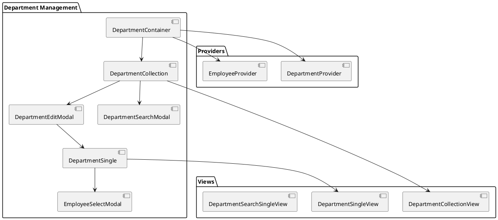
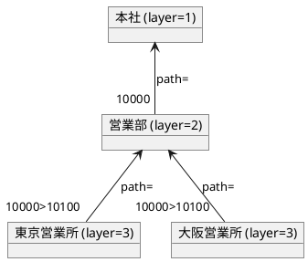
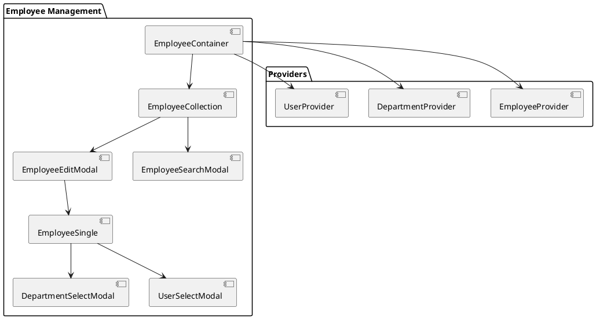
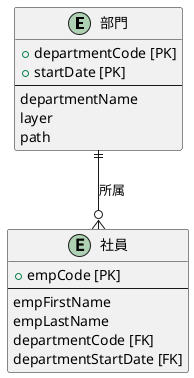
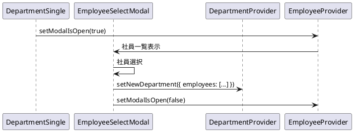

# 第7章: 部門・社員マスタ

本章では、部門マスタと社員マスタの実装について解説します。階層構造を持つ部門データの管理、部門と社員の関連、複数 Provider の連携パターンを説明します。

## 7.1 部門管理

### 部門管理の構成



### DepartmentContainer

部門管理のルートコンテナです。DepartmentProvider と EmployeeProvider を組み合わせて使用します。

```typescript
import React, {useEffect} from "react";
import {showErrorMessage} from "../../application/utils.ts";
import {SiteLayout} from "../../../views/SiteLayout.tsx";
import LoadingIndicator from "../../../views/application/LoadingIndicatior.tsx";
import {DepartmentProvider, useDepartmentContext} from "../../../providers/master/Department.tsx";
import {EmployeeProvider, useEmployeeContext} from "../../../providers/master/Employee.tsx";
import {DepartmentCollection} from "./DepartmentCollection.tsx";

export const DepartmentContainer: React.FC = () => {
    const Content: React.FC = () => {
        const {
            loading,
            setError,
            fetchDepartments,
        } = useDepartmentContext();

        const {
            fetchEmployees,
        } = useEmployeeContext();

        useEffect(() => {
            (async () => {
                try {
                    // 部門と社員を並行して取得
                    await Promise.all([
                        fetchDepartments.load(),
                        fetchEmployees.load()
                    ]);
                } catch (error: any) {
                    showErrorMessage(
                        `部門情報の取得に失敗しました: ${error?.message}`,
                        setError
                    );
                }
            })();
        }, []);

        return (
            <>
                {loading ? (
                    <LoadingIndicator/>
                ) : (
                    <DepartmentCollection/>
                )}
            </>
        );
    };

    return (
        <SiteLayout>
            <DepartmentProvider>
                <EmployeeProvider>
                    <Content/>
                </EmployeeProvider>
            </DepartmentProvider>
        </SiteLayout>
    );
};
```

### DepartmentProvider

部門データの状態管理を担当する Provider です。

```typescript
import React, {createContext, useContext, ReactNode, useState, useMemo} from "react";
import {PageNationType, usePageNation} from "../../views/application/PageNation.tsx";
import {DepartmentCriteriaType, DepartmentType} from "../../models";
import {useModal} from "../../components/application/hooks.ts";
import {useDepartment, useFetchDepartments} from "../../components/master/department/hooks";
import {showErrorMessage} from "../../components/application/utils.ts";
import {useMessage} from "../../components/application/Message.tsx";
import {DepartmentServiceType} from "../../services/master/department.ts";

type DepartmentContextType = {
    loading: boolean;
    setLoading: Dispatch<SetStateAction<boolean>>;
    message: string | null;
    setMessage: Dispatch<SetStateAction<string | null>>;
    error: string | null;
    setError: Dispatch<SetStateAction<string | null>>;
    pageNation: PageNationType | null;
    setPageNation: Dispatch<SetStateAction<PageNationType | null>>;
    criteria: DepartmentCriteriaType | null;
    setCriteria: Dispatch<SetStateAction<DepartmentCriteriaType | null>>;
    searchModalIsOpen: boolean;
    setSearchModalIsOpen: Dispatch<SetStateAction<boolean>>;
    modalIsOpen: boolean;
    setModalIsOpen: Dispatch<SetStateAction<boolean>>;
    isEditing: boolean;
    setIsEditing: Dispatch<SetStateAction<boolean>>;
    editId: string | null;
    setEditId: Dispatch<SetStateAction<string | null>>;
    initialDepartment: DepartmentType;
    departments: DepartmentType[];
    setDepartments: Dispatch<SetStateAction<DepartmentType[]>>;
    newDepartment: DepartmentType;
    setNewDepartment: Dispatch<SetStateAction<DepartmentType>>;
    searchDepartmentCriteria: DepartmentCriteriaType;
    setSearchDepartmentCriteria: Dispatch<SetStateAction<DepartmentCriteriaType>>;
    fetchDepartments: { load: (page?: number, criteria?: DepartmentCriteriaType) => Promise<void> };
    departmentService: DepartmentServiceType;
};

const DepartmentContext = createContext<DepartmentContextType | undefined>(undefined);

export const useDepartmentContext = () => {
    const context = useContext(DepartmentContext);
    if (!context) {
        throw new Error("useDepartmentContext must be used within a DepartmentProvider");
    }
    return context;
};

export const DepartmentProvider: React.FC<Props> = ({ children }) => {
    const [loading, setLoading] = useState<boolean>(false);
    const { message, setMessage, error, setError } = useMessage();
    const { pageNation, setPageNation, criteria, setCriteria } = usePageNation<DepartmentCriteriaType | null>();
    const { modalIsOpen: searchModalIsOpen, setModalIsOpen: setSearchModalIsOpen } = useModal();
    const { modalIsOpen, setModalIsOpen, isEditing, setIsEditing, editId, setEditId } = useModal();

    const {
        initialDepartment,
        departments,
        setDepartments,
        newDepartment,
        setNewDepartment,
        searchDepartmentCriteria,
        setSearchDepartmentCriteria,
        departmentService
    } = useDepartment();

    const fetchDepartments = useFetchDepartments(
        setLoading,
        setDepartments,
        setPageNation,
        setError,
        showErrorMessage,
        departmentService
    );

    const value = useMemo(() => ({
        loading, setLoading,
        message, setMessage,
        error, setError,
        pageNation, setPageNation,
        criteria, setCriteria,
        searchModalIsOpen, setSearchModalIsOpen,
        modalIsOpen, setModalIsOpen,
        isEditing, setIsEditing,
        editId, setEditId,
        initialDepartment,
        departments, setDepartments,
        newDepartment, setNewDepartment,
        searchDepartmentCriteria, setSearchDepartmentCriteria,
        fetchDepartments,
        departmentService
    }), [/* 依存配列 */]);

    return (
        <DepartmentContext.Provider value={value}>
            {children}
        </DepartmentContext.Provider>
    );
};
```

### 部門用カスタムフック

**hooks/department.ts**

```typescript
import {useState} from "react";
import {
    DepartmentCriteriaType,
    DepartmentType,
    LowerType,
    SlitYnType
} from "../../../../models";
import {DepartmentService, DepartmentServiceType} from "../../../../services/master/department.ts";
import {PageNationType} from "../../../../views/application/PageNation.tsx";
import {useFetchEntities} from "../../../application/hooks.ts";

export const useDepartment = () => {
    const initialDepartment = {
        departmentCode: "",
        startDate: "",
        endDate: "",
        departmentName: "",
        layer: 0,
        path: "",
        lowerType: LowerType.NO,
        slitYn: SlitYnType.NO,
        employees: [],
        checked: false
    };

    const [departments, setDepartments] = useState<DepartmentType[]>([]);
    const [newDepartment, setNewDepartment] = useState<DepartmentType>(initialDepartment);
    const [searchDepartmentCriteria, setSearchDepartmentCriteria] = useState<DepartmentCriteriaType>({});
    const departmentService = DepartmentService();

    return {
        initialDepartment,
        departments,
        newDepartment,
        setNewDepartment,
        searchDepartmentCriteria,
        setSearchDepartmentCriteria,
        setDepartments,
        departmentService,
    }
}

export const useFetchDepartments = (
    setLoading: (loading: boolean) => void,
    setList: (list: DepartmentType[]) => void,
    setPageNation: (pageNation: PageNationType) => void,
    setError: (error: string) => void,
    showErrorMessage: (message: string, callback: (error: string) => void) => void,
    service: DepartmentServiceType
) => useFetchEntities<DepartmentType, DepartmentServiceType, DepartmentCriteriaType>(
    setLoading,
    setList,
    setPageNation,
    setError,
    showErrorMessage,
    service,
    "部門情報の取得に失敗しました:"
);
```

### DepartmentCollection

部門一覧を表示するコンポーネントです。

```typescript
import React from "react";
import {useDepartmentContext} from "../../../providers/master/Department.tsx";
import {DepartmentCollectionView} from "../../../views/master/department/DepartmentCollection.tsx";
import {DepartmentType} from "../../../models";
import {showErrorMessage} from "../../application/utils.ts";
import {DepartmentSearchModal} from "./DepartmentSearchModal.tsx";
import {DepartmentEditModal} from "./DepartmentEditModal.tsx";

export const DepartmentCollection: React.FC = () => {
    const {
        message,
        setMessage,
        error,
        setError,
        pageNation,
        criteria,
        setModalIsOpen,
        setIsEditing,
        setEditId,
        initialDepartment,
        departments,
        setDepartments,
        setNewDepartment,
        searchDepartmentCriteria,
        setSearchDepartmentCriteria,
        fetchDepartments,
        departmentService,
        setSearchModalIsOpen,
    } = useDepartmentContext();

    // 編集モーダルを開く
    const handleOpenModal = (department?: DepartmentType) => {
        setMessage("");
        setError("");
        if (department) {
            setNewDepartment(department);
            setEditId(department.departmentCode);
            setIsEditing(true);
        } else {
            setNewDepartment(initialDepartment);
            setIsEditing(false);
        }
        setModalIsOpen(true);
    };

    // 検索モーダルを開く
    const handleOpenSearchModal = () => {
        setSearchModalIsOpen(true);
    }

    // 部門削除
    const handleDeleteDepartment = async (departmentCode: string, startDate: string) => {
        try {
            if (!window.confirm(`部門コード:${departmentCode} を削除しますか？`)) return;
            await departmentService.destroy(departmentCode, startDate);
            await fetchDepartments.load();
            setMessage("部門を削除しました。");
        } catch (error: any) {
            showErrorMessage(
                `部門の削除に失敗しました: ${error?.message}`,
                setError
            );
        }
    };

    // チェックボックス操作
    const handleCheckDepartment = (department: DepartmentType) => {
        const newDepartments = departments.map((d: DepartmentType) => {
            if (d.departmentCode === department.departmentCode) {
                return { ...d, checked: !d.checked };
            }
            return d;
        });
        setDepartments(newDepartments);
    }

    // 一括選択
    const handleCheckAllDepartment = () => {
        const newDepartments = departments.map((d: DepartmentType) => {
            return {
                ...d,
                checked: !departments.every((d: DepartmentType) => d.checked)
            };
        });
        setDepartments(newDepartments);
    }

    // 一括削除
    const handleDeleteCheckedCollection = async () => {
        const checkedDepartments = departments.filter((d: DepartmentType) => d.checked);
        if (!checkedDepartments.length) {
            setError("削除する部門を選択してください。");
            return;
        }

        try {
            if (!window.confirm("選択した部門を削除しますか？")) return;
            await Promise.all(
                checkedDepartments.map((d: DepartmentType) =>
                    departmentService.destroy(d.departmentCode, d.startDate)
                )
            );
            await fetchDepartments.load();
            setMessage("選択した部門を削除しました。");
        } catch (error: any) {
            showErrorMessage(
                `選択した部門の削除に失敗しました: ${error?.message}`,
                setError
            );
        }
    }

    return (
        <>
            <DepartmentSearchModal/>
            <DepartmentEditModal/>
            <DepartmentCollectionView
                error={error}
                message={message}
                searchItems={{
                    searchDepartmentCriteria,
                    setSearchDepartmentCriteria,
                    handleOpenSearchModal
                }}
                headerItems={{
                    handleOpenModal,
                    handleCheckToggleCollection: handleCheckAllDepartment,
                    handleDeleteCheckedCollection
                }}
                collectionItems={{
                    departments,
                    handleOpenModal,
                    handleDeleteDepartment,
                    handleCheckDepartment
                }}
                pageNationItems={{
                    pageNation,
                    fetchDepartments: fetchDepartments.load,
                    criteria
                }}
            />
        </>
    );
}
```

### 部門の型定義

**models/master/department.ts**

```typescript
import {EmployeeType} from "./employee.ts";
import {PageNationType} from "../../views/application/PageNation.tsx";
import {toISOStringWithTimezone} from "../../components/application/utils.ts";

// 部門型
export type DepartmentType = {
    departmentCode: string;
    startDate: string;
    endDate: string;
    departmentName: string;
    layer: number;           // 組織階層
    path: string;            // 部門パス
    lowerType: LowerType;    // 最下層区分
    slitYn: SlitYnType;      // 伝票入力可否
    employees: EmployeeType[];
    checked?: boolean;
}

// 部門一覧取得結果型
export type DepartmentFetchType = {
    list: DepartmentType[];
} & PageNationType;

// 検索条件型
export type DepartmentCriteriaType = {
    departmentCode?: string;
    departmentName?: string;
    startDate?: string;
    endDate?: string;
}

// 最下層区分
export const LowerType = {
    YES: "LOWER",
    NO: "NOT_LOWER",
}
export type LowerType = typeof LowerType[keyof typeof LowerType];

// 伝票入力可否
export const SlitYnType = {
    YES: "SLIT",
    NO: "NOT_SLIT",
}
export type SlitYnType = typeof SlitYnType[keyof typeof SlitYnType];

// API リソースへの変換
export const mapToDepartmentResource = (department: DepartmentType): DepartmentType => {
    return {
        ...department,
        startDate: toISOStringWithTimezone(new Date(department.startDate)),
        endDate: toISOStringWithTimezone(new Date(department.endDate)),
        employees: department.employees.map(employee => ({
            ...employee,
            departmentStartDate: toISOStringWithTimezone(new Date(department.startDate)),
        }))
    };
};

// 検索条件の変換
export const mapToDepartmentCriteriaResource = (criteria: DepartmentCriteriaType) => {
    const isEmpty = (value: unknown) => value === "" || value === null || value === undefined;
    return {
        ...(isEmpty(criteria.departmentCode) ? {} : { departmentCode: criteria.departmentCode }),
        ...(isEmpty(criteria.departmentName) ? {} : { departmentName: criteria.departmentName }),
        ...(isEmpty(criteria.startDate) ? {} : { startDate: toISOStringWithTimezone(new Date(criteria.startDate))}),
        ...(isEmpty(criteria.endDate) ? {} : { endDate: toISOStringWithTimezone(new Date(criteria.endDate))}),
    };
};
```

### 階層構造の表現

部門データは階層構造を持ち、以下のプロパティで表現されます。

| プロパティ | 説明 | 例 |
|-----------|------|-----|
| layer | 組織階層レベル | 1, 2, 3... |
| path | 階層パス | "10000>10100>10110" |
| lowerType | 最下層かどうか | LOWER / NOT_LOWER |



## 7.2 社員管理

### 社員管理の構成



### EmployeeContainer

社員管理のルートコンテナです。複数の Provider を組み合わせます。

```typescript
import React, {useEffect} from 'react';
import {showErrorMessage} from "../../application/utils.ts";
import {SiteLayout} from "../../../views/SiteLayout.tsx";
import LoadingIndicator from "../../../views/application/LoadingIndicatior.tsx";
import {EmployeeProvider, useEmployeeContext} from "../../../providers/master/Employee.tsx";
import {DepartmentProvider, useDepartmentContext} from "../../../providers/master/Department.tsx";
import {UserProvider, useUserContext} from "../../../providers/system/User.tsx";
import {EmployeeCollection} from "./EmployeeCollection.tsx";

export const EmployeeContainer: React.FC = () => {
    const Content: React.FC = () => {
        const {
            loading,
            setError,
            fetchEmployees,
        } = useEmployeeContext();

        const {
            fetchDepartments,
        } = useDepartmentContext();

        const {
            fetchUsers,
        } = useUserContext();

        useEffect(() => {
            (async () => {
                try {
                    // 社員、部門、ユーザーを並行して取得
                    await Promise.all([
                        fetchEmployees.load(),
                        fetchDepartments.load(),
                        fetchUsers.load()
                    ]);
                } catch (error: any) {
                    showErrorMessage(
                        `社員情報の取得に失敗しました: ${error?.message}`,
                        setError
                    );
                }
            })();
        }, []);

        return (
            <>
                {loading ? (
                    <LoadingIndicator/>
                ) : (
                    <EmployeeCollection/>
                )}
            </>
        );
    };

    return (
        <SiteLayout>
            <EmployeeProvider>
                <DepartmentProvider>
                    <UserProvider>
                        <Content/>
                    </UserProvider>
                </DepartmentProvider>
            </EmployeeProvider>
        </SiteLayout>
    );
};
```

### EmployeeProvider

社員データの状態管理を担当する Provider です。

```typescript
import React, { createContext, useContext, ReactNode, useState, useMemo } from "react";
import { PageNationType, usePageNation } from "../../views/application/PageNation.tsx";
import { EmployeeCriteriaType, EmployeeType } from "../../models";
import { useModal } from "../../components/application/hooks.ts";
import { useEmployee, useFetchEmployees } from "../../components/master/employee/hooks";
import { showErrorMessage } from "../../components/application/utils.ts";
import { useMessage } from "../../components/application/Message.tsx";
import { EmployeeServiceType } from "../../services/master/employee.ts";

type EmployeeContextType = {
    loading: boolean;
    setLoading: Dispatch<SetStateAction<boolean>>;
    message: string | null;
    setMessage: Dispatch<SetStateAction<string | null>>;
    error: string | null;
    setError: Dispatch<SetStateAction<string | null>>;
    pageNation: PageNationType | null;
    setPageNation: Dispatch<SetStateAction<PageNationType | null>>;
    criteria: EmployeeCriteriaType | null;
    setCriteria: Dispatch<SetStateAction<EmployeeCriteriaType | null>>;
    searchModalIsOpen: boolean;
    setSearchModalIsOpen: Dispatch<SetStateAction<boolean>>;
    modalIsOpen: boolean;
    setModalIsOpen: Dispatch<SetStateAction<boolean>>;
    isEditing: boolean;
    setIsEditing: Dispatch<SetStateAction<boolean>>;
    editId: string | null;
    setEditId: Dispatch<SetStateAction<string | null>>;
    initialEmployee: EmployeeType;
    employees: EmployeeType[];
    setEmployees: Dispatch<SetStateAction<EmployeeType[]>>;
    newEmployee: EmployeeType;
    setNewEmployee: Dispatch<SetStateAction<EmployeeType>>;
    searchEmployeeCriteria: EmployeeCriteriaType;
    setSearchEmployeeCriteria: Dispatch<SetStateAction<EmployeeCriteriaType>>;
    fetchEmployees: { load: (page?: number, criteria?: EmployeeCriteriaType) => Promise<void> };
    employeeService: EmployeeServiceType;
};

const EmployeeContext = createContext<EmployeeContextType | undefined>(undefined);

export const useEmployeeContext = () => {
    const context = useContext(EmployeeContext);
    if (!context) {
        throw new Error("useEmployeeContext must be used within an EmployeeProvider");
    }
    return context;
};

export const EmployeeProvider: React.FC<Props> = ({ children }) => {
    const [loading, setLoading] = useState<boolean>(false);
    const { message, setMessage, error, setError } = useMessage();
    const { pageNation, setPageNation, criteria, setCriteria } = usePageNation<EmployeeCriteriaType | null>();
    const { modalIsOpen: searchModalIsOpen, setModalIsOpen: setSearchModalIsOpen } = useModal();
    const { modalIsOpen, setModalIsOpen, isEditing, setIsEditing, editId, setEditId } = useModal();

    const {
        initialEmployee,
        employees,
        setEmployees,
        newEmployee,
        setNewEmployee,
        searchEmployeeCriteria,
        setSearchEmployeeCriteria,
        employeeService
    } = useEmployee();

    const fetchEmployees = useFetchEmployees(
        setLoading,
        setEmployees,
        setPageNation,
        setError,
        showErrorMessage,
        employeeService
    );

    const value = useMemo(() => ({
        loading, setLoading,
        message, setMessage,
        error, setError,
        pageNation, setPageNation,
        criteria, setCriteria,
        searchModalIsOpen, setSearchModalIsOpen,
        modalIsOpen, setModalIsOpen,
        isEditing, setIsEditing,
        editId, setEditId,
        initialEmployee,
        employees, setEmployees,
        newEmployee, setNewEmployee,
        searchEmployeeCriteria, setSearchEmployeeCriteria,
        fetchEmployees,
        employeeService
    }), [/* 依存配列 */]);

    return (
        <EmployeeContext.Provider value={value}>
            {children}
        </EmployeeContext.Provider>
    );
};
```

### 社員の型定義

**models/master/employee.ts**

```typescript
import {toISOStringWithTimezone} from "../../components/application/utils.ts";
import {PageNationType} from "../../views/application/PageNation.tsx";

// 社員型
export type EmployeeType = {
    empCode: string;
    empFirstName: string;
    empLastName: string;
    empFirstNameKana: string;
    empLastNameKana: string;
    loginPassword: string;
    tel: string;
    fax: string;
    occuCode: string;
    approvalCode: string;
    departmentCode: string;
    departmentStartDate: string;
    departmentName: string;
    userId: string;
    addFlag: boolean;      // 追加フラグ
    deleteFlag: boolean;   // 削除フラグ
    checked?: boolean;
}

// 社員一覧取得結果型
export type EmployeeFetchType = {
    list: EmployeeType[];
} & PageNationType;

// 検索条件型
export type EmployeeCriteriaType = {
    empCode?: string;
    empNameFirst?: string;
    empNameLast?: string;
    empNameFirstKana?: string;
    empNameLastKana?: string;
    phoneNumber?: string;
    faxNumber?: string;
    departmentCode?: string;
}

// API リソースへの変換
export const mapToEmployeeResource = (employee: EmployeeType): EmployeeType => {
    return {
        ...employee,
        departmentStartDate: toISOStringWithTimezone(new Date(employee.departmentStartDate)),
    };
};

// 検索条件の変換
export const mapToEmployeeCriteriaResource = (criteria: EmployeeCriteriaType): EmployeeCriteriaType => {
    const isEmpty = (value: unknown) => value === "" || value === null || value === undefined;
    return {
        ...(isEmpty(criteria.empCode) ? {} : {employeeCode: criteria.empCode}),
        ...(isEmpty(criteria.empNameFirst) ? {} : {employeeFirstName: criteria.empNameFirst}),
        ...(isEmpty(criteria.empNameLast) ? {} : {employeeLastName: criteria.empNameLast}),
        ...(isEmpty(criteria.empNameFirstKana) ? {} : {employeeFirstNameKana: criteria.empNameFirstKana}),
        ...(isEmpty(criteria.empNameLastKana) ? {} : {employeeLastNameKana: criteria.empNameLastKana}),
        ...(isEmpty(criteria.phoneNumber) ? {} : {phoneNumber: criteria.phoneNumber}),
        ...(isEmpty(criteria.faxNumber) ? {} : {faxNumber: criteria.faxNumber}),
        ...(isEmpty(criteria.departmentCode) ? {} : {departmentCode: criteria.departmentCode}),
    };
}
```

### 部門との関連

社員は部門に所属します。編集時には DepartmentSelectModal を使用して部門を選択できます。



## 7.3 サービス層

### DepartmentService

部門 API との通信を担当します。

```typescript
import Config from "../config.ts";
import Utils from "../utils.ts";
import {
    DepartmentCriteriaType,
    DepartmentFetchType,
    DepartmentType,
    mapToDepartmentCriteriaResource,
    mapToDepartmentResource
} from "../../models";
import {toISOStringWithTimezone} from "../../components/application/utils.ts";

export interface DepartmentServiceType {
    select: (page?: number, pageSize?: number) => Promise<DepartmentFetchType>;
    find: (deptCode: string, departmentStartDate: string) => Promise<DepartmentType[]>;
    create: (department: DepartmentType) => Promise<void>;
    update: (department: DepartmentType) => Promise<void>;
    destroy: (deptCode: string, departmentStartDate: string) => Promise<void>;
    search: (criteria: DepartmentCriteriaType, page?: number, pageSize?: number) => Promise<DepartmentFetchType>;
}

export const DepartmentService = () => {
    const config = Config();
    const apiUtils = Utils.apiUtils;
    const endPoint = `${config.apiUrl}/departments`;

    // 一覧取得
    const select = async (page?: number, pageSize?: number): Promise<DepartmentFetchType> => {
        const url = Utils.buildUrlWithPaging(endPoint, page, pageSize);
        return await apiUtils.fetchGet<DepartmentFetchType>(url);
    };

    // 単一取得（複合キー）
    const find = async (deptCode: string, departmentStartDate: string): Promise<DepartmentType[]> => {
        const startDate = toISOStringWithTimezone(new Date(departmentStartDate));
        const url = `${endPoint}/${deptCode}/${startDate}`;
        return await apiUtils.fetchGet<DepartmentType[]>(url);
    };

    // 新規作成
    const create = async (department: DepartmentType): Promise<void> => {
        await apiUtils.fetchPost<void>(endPoint, mapToDepartmentResource(department));
    };

    // 更新
    const update = async (department: DepartmentType): Promise<void> => {
        const startDate = toISOStringWithTimezone(new Date(department.startDate));
        const url = `${endPoint}/${department.departmentCode}/${startDate}`;
        await apiUtils.fetchPut<void>(url, mapToDepartmentResource(department));
    };

    // 検索
    const search = async (
        criteria: DepartmentCriteriaType,
        page?: number,
        pageSize?: number
    ): Promise<DepartmentFetchType> => {
        const url = Utils.buildUrlWithPaging(`${endPoint}/search`, page, pageSize);
        return await apiUtils.fetchPost<DepartmentFetchType>(
            url,
            mapToDepartmentCriteriaResource(criteria)
        );
    };

    // 削除
    const destroy = async (deptCode: string, departmentStartDate: string): Promise<void> => {
        const startDate = toISOStringWithTimezone(new Date(departmentStartDate));
        const url = `${endPoint}/${deptCode}/${startDate}`;
        await apiUtils.fetchDelete<void>(url);
    };

    return {
        select,
        find,
        create,
        update,
        destroy,
        search
    };
}
```

### EmployeeService

社員 API との通信を担当します。

```typescript
import Config from "../config.ts";
import Utils from "../utils.ts";
import {
    EmployeeCriteriaType,
    EmployeeFetchType,
    EmployeeType,
    mapToEmployeeCriteriaResource,
    mapToEmployeeResource
} from "../../models";

export interface EmployeeServiceType {
    select: (page?: number, pageSize?: number) => Promise<EmployeeFetchType>;
    find: (empCode: string) => Promise<EmployeeType>;
    create: (employee: EmployeeType) => Promise<void>;
    update: (employee: EmployeeType) => Promise<void>;
    destroy: (empCode: string) => Promise<void>;
    search: (criteria: EmployeeCriteriaType, page?: number, pageSize?: number) => Promise<EmployeeFetchType>;
}

export const EmployeeService = () => {
    const config = Config();
    const apiUtils = Utils.apiUtils;
    const endPoint = `${config.apiUrl}/employees`;

    // 一覧取得
    const select = async (page?: number, pageSize?: number): Promise<EmployeeFetchType> => {
        const url = Utils.buildUrlWithPaging(endPoint, page, pageSize);
        return await apiUtils.fetchGet<EmployeeFetchType>(url);
    };

    // 単一取得
    const find = async (empCode: string): Promise<EmployeeType> => {
        const url = `${endPoint}/${empCode}`;
        return await apiUtils.fetchGet<EmployeeType>(url);
    };

    // 新規作成
    const create = async (employee: EmployeeType): Promise<void> => {
        await apiUtils.fetchPost<void>(endPoint, mapToEmployeeResource(employee));
    };

    // 更新
    const update = async (employee: EmployeeType): Promise<void> => {
        const url = `${endPoint}/${employee.empCode}`;
        await apiUtils.fetchPut<void>(url, mapToEmployeeResource(employee));
    };

    // 検索
    const search = async (
        criteria: EmployeeCriteriaType,
        page?: number,
        pageSize?: number
    ): Promise<EmployeeFetchType> => {
        const url = Utils.buildUrlWithPaging(`${endPoint}/search`, page, pageSize);
        return await apiUtils.fetchPost<EmployeeFetchType>(
            url,
            mapToEmployeeCriteriaResource(criteria)
        );
    };

    // 削除
    const destroy = async (empCode: string): Promise<void> => {
        const url = `${endPoint}/${empCode}`;
        await apiUtils.fetchDelete<void>(url);
    };

    return {
        select,
        find,
        create,
        update,
        destroy,
        search
    };
};
```

## 7.4 View コンポーネント

### DepartmentCollectionView

```typescript
import React from "react";
import {DepartmentCriteriaType, DepartmentType} from "../../../models";
import {Message} from "../../../components/application/Message.tsx";
import {PageNation, PageNationType} from "../../application/PageNation.tsx";
import {Search} from "../../Common.tsx";

// 部門アイテム
interface DepartmentItemProps {
    department: DepartmentType;
    onEdit: (department: DepartmentType) => void;
    onDelete: (departmentCode: string, startDate: string) => void;
    onCheck: (department: DepartmentType) => void;
}

const DepartmentItem: React.FC<DepartmentItemProps> = ({
    department,
    onEdit,
    onDelete,
    onCheck
}) => (
    <li className="collection-object-item" key={department.departmentCode}>
        <div className="collection-object-item-content" data-id={department.departmentCode}>
            <input
                type="checkbox"
                className="collection-object-item-checkbox"
                checked={department.checked}
                onChange={() => onCheck(department)}
            />
        </div>
        <div className="collection-object-item-content" data-id={department.departmentCode}>
            <div className="collection-object-item-content-details">部門コード</div>
            <div className="collection-object-item-content-name">{department.departmentCode}</div>
        </div>
        <div className="collection-object-item-content" data-id={department.departmentCode}>
            <div className="collection-object-item-content-details">部門名</div>
            <div className="collection-object-item-content-name">{department.departmentName}</div>
        </div>
        <div className="collection-object-item-actions" data-id={department.departmentCode}>
            <button
                className="action-button"
                onClick={() => onEdit(department)}
                id="edit"
            >
                編集
            </button>
        </div>
        <div className="collection-object-item-actions" data-id={department.departmentCode}>
            <button
                className="action-button"
                onClick={() => onDelete(department.departmentCode, department.startDate)}
                id="delete"
            >
                削除
            </button>
        </div>
    </li>
);

// メイン View
interface DepartmentCollectionViewProps {
    error: string | null;
    message: string | null;
    searchItems: {
        searchDepartmentCriteria: DepartmentCriteriaType;
        setSearchDepartmentCriteria: (value: DepartmentCriteriaType) => void;
        handleOpenSearchModal: () => void;
    }
    headerItems: {
        handleOpenModal: (department?: DepartmentType) => void;
        handleCheckToggleCollection: () => void;
        handleDeleteCheckedCollection: () => void;
    }
    collectionItems: {
        departments: DepartmentType[];
        handleOpenModal: (department?: DepartmentType) => void;
        handleDeleteDepartment: (departmentCode: string, startDate: string) => void;
        handleCheckDepartment: (department: DepartmentType) => void;
    }
    pageNationItems: {
        pageNation: PageNationType | null;
        criteria: DepartmentCriteriaType | null;
        fetchDepartments: () => void;
    }
}

export const DepartmentCollectionView: React.FC<DepartmentCollectionViewProps> = ({
    error,
    message,
    searchItems: {searchDepartmentCriteria, setSearchDepartmentCriteria, handleOpenSearchModal},
    headerItems: {handleOpenModal, handleCheckToggleCollection, handleDeleteCheckedCollection},
    collectionItems: {departments, handleDeleteDepartment, handleCheckDepartment},
    pageNationItems: {pageNation, criteria, fetchDepartments}
}) => (
    <div className="collection-view-object-container">
        <Message error={error} message={message}/>
        <div className="collection-view-container">
            <div className="collection-view-header">
                <div className="single-view-header-item">
                    <h1 className="single-view-title">部門</h1>
                </div>
            </div>
            <div className="collection-view-content">
                <Search
                    searchCriteria={searchDepartmentCriteria}
                    setSearchCriteria={setSearchDepartmentCriteria}
                    handleSearchAudit={handleOpenSearchModal}
                />
                <div className="button-container">
                    <button
                        className="action-button"
                        onClick={() => handleOpenModal()}
                        id="new"
                    >
                        新規
                    </button>
                    <button
                        className="action-button"
                        onClick={() => handleCheckToggleCollection()}
                        id="checkAll"
                    >
                        一括選択
                    </button>
                    <button
                        className="action-button"
                        onClick={() => handleDeleteCheckedCollection()}
                        id="deleteAll"
                    >
                        一括削除
                    </button>
                </div>
                <div className="collection-object-container">
                    <ul className="collection-object-list">
                        {departments.map(department => (
                            <DepartmentItem
                                key={department.departmentCode}
                                department={department}
                                onEdit={handleOpenModal}
                                onDelete={handleDeleteDepartment}
                                onCheck={handleCheckDepartment}
                            />
                        ))}
                    </ul>
                </div>
                <PageNation
                    pageNation={pageNation}
                    callBack={fetchDepartments}
                    criteria={criteria}
                />
            </div>
        </div>
    </div>
);
```

## 7.5 複数 Provider の連携パターン

### Provider のネスト構造

部門管理では、部門と社員の両方のデータにアクセスする必要があります。

```typescript
return (
    <SiteLayout>
        <DepartmentProvider>
            <EmployeeProvider>
                <Content/>
            </EmployeeProvider>
        </DepartmentProvider>
    </SiteLayout>
);
```

社員管理では、さらにユーザー情報も必要です。

```typescript
return (
    <SiteLayout>
        <EmployeeProvider>
            <DepartmentProvider>
                <UserProvider>
                    <Content/>
                </UserProvider>
            </DepartmentProvider>
        </EmployeeProvider>
    </SiteLayout>
);
```

### 並行データ取得

複数の Provider からデータを取得する際は、Promise.all を使用して並行処理を行います。

```typescript
useEffect(() => {
    (async () => {
        try {
            await Promise.all([
                fetchEmployees.load(),
                fetchDepartments.load(),
                fetchUsers.load()
            ]);
        } catch (error: any) {
            showErrorMessage(
                `情報の取得に失敗しました: ${error?.message}`,
                setError
            );
        }
    })();
}, []);
```

### SelectModal での Provider 連携

部門編集時に社員を追加する場合、EmployeeSelectModal は EmployeeProvider のデータを使用します。



## まとめ

本章では、部門・社員マスタの実装について解説しました。

- **部門管理**: 階層構造を持つ部門データの CRUD 操作
- **社員管理**: 部門との関連を持つ社員データの管理
- **複数 Provider の連携**: ネストされた Provider と並行データ取得
- **SelectModal パターン**: 関連エンティティの選択

次章では、商品マスタの実装について詳しく解説します。
