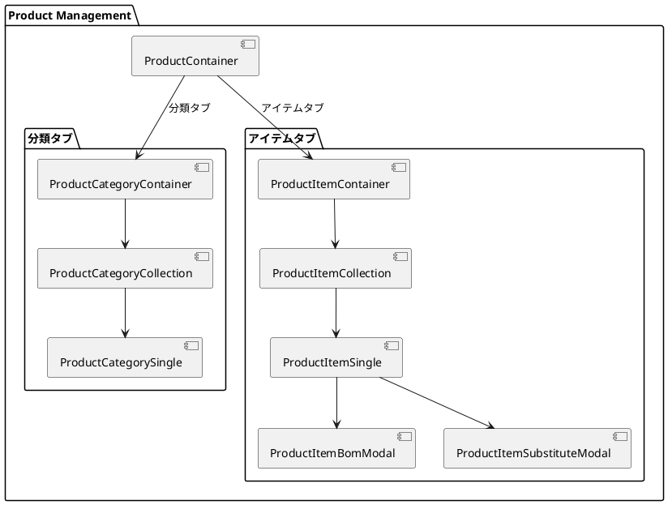
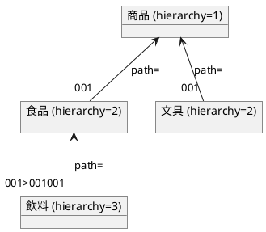
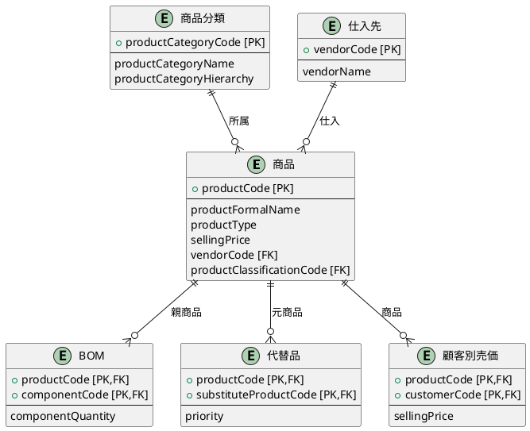
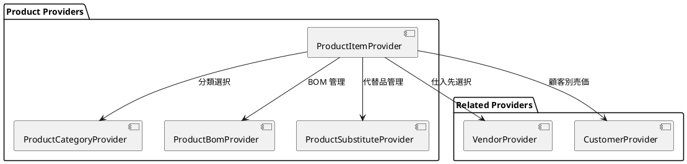

# 第8章: 商品マスタ

本章では、商品マスタの実装について解説します。タブによる画面切り替え、商品分類と商品の関連、BOM（部品構成表）・代替品の管理パターンを説明します。

## 8.1 商品管理の構成

### タブによる画面構成

商品管理は「分類」と「アイテム」の2つのタブで構成されます。



### ProductContainer

タブで画面を切り替えるルートコンテナです。

```typescript
import React from "react";
import {useTab} from "../../application/hooks.ts";
import {SiteLayout} from "../../../views/SiteLayout.tsx";
import {ProductCategoryContainer} from "./category/ProductCategoryContainer.tsx";
import {ProductItemContainer} from "./item/ProductItemContainer.tsx";

export const ProductContainer: React.FC = () => {
    const {
        Tab,
        TabList,
        TabPanel,
        Tabs,
    } = useTab();

    return (
        <SiteLayout>
            <Tabs>
                <TabList>
                    <Tab>分類</Tab>
                    <Tab>アイテム</Tab>
                </TabList>
                <TabPanel>
                    <ProductCategoryContainer/>
                </TabPanel>
                <TabPanel>
                    <ProductItemContainer/>
                </TabPanel>
            </Tabs>
        </SiteLayout>
    );
}
```

## 8.2 商品分類管理

### 商品分類の型定義

```typescript
// models/master/product/productCategory.ts
import {PageNationType} from "../../../views/application/PageNation.tsx";
import {mapToProductResource, ProductType} from "./productItem.ts";

export type ProductCategoryType = {
    productCategoryCode: string;
    productCategoryName: string;
    productCategoryHierarchy: number;  // 階層レベル
    productCategoryPath: string;       // 階層パス
    lowestLevelDivision: number;       // 最下層区分
    products: ProductType[];           // 所属商品
    checked: boolean;
};

export type ProductCategoryFetchType = {
    list: ProductCategoryType[];
} & PageNationType;

export type ProductCategoryCriteriaType = {
    productCategoryCode?: string;
    productCategoryName?: string;
    productCategoryPath?: string;
}

export const mapToProductCategoryResource = (
    productCategory: ProductCategoryType
): ProductCategoryType => {
    return {
        ...productCategory,
        products: productCategory.products.map(
            product => mapToProductResource(product)
        ),
    };
}

export const mapToProductCategoryCriteriaResource = (
    criteria: ProductCategoryCriteriaType
): ProductCategoryCriteriaType => {
    const isEmpty = (value: unknown) =>
        value === "" || value === null || value === undefined;
    return {
        ...(isEmpty(criteria.productCategoryCode)
            ? {}
            : {productCategoryCode: criteria.productCategoryCode}),
        ...(isEmpty(criteria.productCategoryName)
            ? {}
            : {productCategoryName: criteria.productCategoryName}),
        ...(isEmpty(criteria.productCategoryPath)
            ? {}
            : {productCategoryPath: criteria.productCategoryPath})
    };
}
```

### 分類の階層構造

商品分類は階層構造を持ちます。



## 8.3 商品管理

### 商品の型定義

```typescript
// models/master/product/productItem.ts
import {PageNationType} from "../../../views/application/PageNation.tsx";
import {PriceType, QuantityType} from "../shared.ts";

// 代替品型
export type SubstituteProductType = {
    productCode: string;
    substituteProductCode: string;
    priority: number;
};

// BOM（部品構成）型
export type BomType = {
    productCode: string;
    componentCode: string;
    componentQuantity: QuantityType;
}

// 顧客別売価型
export type CustomerSpecificSellingPriceType = {
    productCode: string;
    customerCode: string;
    sellingPrice: PriceType;
};

// 商品型
export type ProductType = {
    productCode: string;
    productFormalName: string;
    productAbbreviation: string;
    productNameKana: string;
    productType: string;
    sellingPrice: number;
    purchasePrice?: number;
    costOfSales: number;
    taxType: string;
    productClassificationCode?: string;
    miscellaneousType?: string;
    stockManagementTargetType?: string;
    stockAllocationType?: string;
    vendorCode: string;
    vendorBranchNumber?: number;
    substituteProduct: SubstituteProductType[];
    boms: BomType[];
    customerSpecificSellingPrices: CustomerSpecificSellingPriceType[];
    checked: boolean;
    addFlag: boolean;
    deleteFlag: boolean;
};

// 商品種別
export enum ProductEnumType {
    商品 = "商品",
    製品 = "製品",
    部品 = "部品",
    包材 = "包材",
    その他 = "その他"
}

// 税区分
export enum TaxEnumType {
    外税 = "外税",
    内税 = "内税",
    非課税 = "非課税",
    その他 = "その他"
}

// 雑区分
export enum MiscellaneousEnumType {
    適用外 = "適用外",
    適用 = "適用"
}

// 在庫管理対象区分
export enum StockManagementTargetEnumType {
    対象外 = "対象外",
    対象 = "対象"
}

// 在庫引当区分
export enum StockAllocationEnumType {
    未引当 = "未引当",
    引当済 = "引当済"
}

export type ProductFetchType = {
    list: ProductType[];
} & PageNationType;

export type ProductCriteriaType = {
    productCode?: string;
    productFormalName?: string;
    productAbbreviation?: string;
    productNameKana?: string;
    productCategoryCode?: string;
    vendorCode?: string;
    productType?: string;
    taxType?: string;
    miscellaneousType?: string;
    stockManagementTargetType?: string;
    stockAllocationType?: string;
}
```

### 商品と関連エンティティの関係



## 8.4 BOM・代替品管理

### ProductItemBomModal

BOM（部品構成表）を管理するモーダルです。

```typescript
import React from "react";
import {useProductItemContext} from "../../../../providers/master/product/ProductItem.tsx";
import {useProductBomContext} from "../../../../providers/master/product/ProductBom.tsx";
import Modal from "react-modal";
import {ProductCollectionSelectView} from "../../../../views/master/product/item/ProductSelect.tsx";
import {ProductType} from "../../../../models/master/product";

export const ProductItemBomModal: React.FC = () => {
    const {
        setError,
        newProduct,
        setNewProduct,
    } = useProductItemContext();

    const {
        bomPageNation,
        bomModalIsOpen,
        setBomModalIsOpen,
        boms,
        fetchBoms,
        setBomEditId
    } = useProductBomContext();

    const handleCloseBomModal = () => {
        setError("");
        setBomModalIsOpen(false);
        setBomEditId(null);
    }

    const handleSelectBomModal = (bom: ProductType) => {
        // 既存の BOM から同一部品を除外
        const newProducts = newProduct.boms.filter(
            (e) => e.productCode !== bom.productCode
        );
        // 新しい BOM を追加
        newProducts.push({
            productCode: newProduct.productCode,
            componentCode: bom.productCode,
            componentQuantity: {
                amount: 1,
                unit: "個"
            }
        });
        setNewProduct({
            ...newProduct,
            boms: newProducts
        });
    }

    return (
        <Modal
            isOpen={bomModalIsOpen}
            onRequestClose={handleCloseBomModal}
            contentLabel="部品情報を入力"
            className="modal"
            overlayClassName="modal-overlay"
            bodyOpenClassName="modal-open"
        >
            <ProductCollectionSelectView
                products={boms}
                handleSelect={handleSelectBomModal}
                handleClose={handleCloseBomModal}
                pageNation={bomPageNation}
                fetchProducts={fetchBoms.load}
            />
        </Modal>
    )
}
```

### ProductItemSubstituteModal

代替品を管理するモーダルです。同様のパターンで実装されます。

```typescript
export const ProductItemSubstituteModal: React.FC = () => {
    const {
        setError,
        newProduct,
        setNewProduct,
    } = useProductItemContext();

    const {
        substitutePageNation,
        substituteModalIsOpen,
        setSubstituteModalIsOpen,
        substitutes,
        fetchSubstitutes,
        setSubstituteEditId
    } = useProductSubstituteContext();

    const handleSelectSubstituteModal = (substitute: ProductType) => {
        const newSubstitutes = newProduct.substituteProduct.filter(
            (e) => e.substituteProductCode !== substitute.productCode
        );
        // 優先度は既存の最大値 + 1
        const maxPriority = Math.max(
            ...newProduct.substituteProduct.map(s => s.priority),
            0
        );
        newSubstitutes.push({
            productCode: newProduct.productCode,
            substituteProductCode: substitute.productCode,
            priority: maxPriority + 1
        });
        setNewProduct({
            ...newProduct,
            substituteProduct: newSubstitutes
        });
    }

    // ... 以下同様のパターン
}
```

## 8.5 Provider 設計

### 商品管理の Provider 構成



### Provider のネスト構造

```typescript
// ProductItemContainer.tsx
return (
    <ProductItemProvider>
        <ProductCategoryProvider>
            <ProductBomProvider>
                <ProductSubstituteProvider>
                    <VendorProvider>
                        <CustomerProvider>
                            <Content/>
                        </CustomerProvider>
                    </VendorProvider>
                </ProductSubstituteProvider>
            </ProductBomProvider>
        </ProductCategoryProvider>
    </ProductItemProvider>
);
```

### 並行データ取得

```typescript
useEffect(() => {
    (async () => {
        try {
            await Promise.all([
                fetchProducts.load(),
                fetchCategories.load(),
                fetchVendors.load(),
                fetchCustomers.load()
            ]);
        } catch (error: any) {
            showErrorMessage(
                `商品情報の取得に失敗しました: ${error?.message}`,
                setError
            );
        }
    })();
}, []);
```

## 8.6 SelectModal パターン

### 分類選択モーダル

商品編集時に分類を選択するモーダルです。

```typescript
export const ProductCategorySelectModal: React.FC = () => {
    const {
        setError,
        newProduct,
        setNewProduct,
    } = useProductItemContext();

    const {
        modalIsOpen,
        setModalIsOpen,
        productCategories,
        pageNation,
        fetchProductCategories,
    } = useProductCategoryContext();

    const handleSelectCategory = (category: ProductCategoryType) => {
        setNewProduct({
            ...newProduct,
            productClassificationCode: category.productCategoryCode
        });
        setModalIsOpen(false);
    }

    return (
        <Modal
            isOpen={modalIsOpen}
            onRequestClose={() => setModalIsOpen(false)}
            contentLabel="分類を選択"
            className="modal"
            overlayClassName="modal-overlay"
        >
            <ProductCategoryCollectionSelectView
                categories={productCategories}
                handleSelect={handleSelectCategory}
                handleClose={() => setModalIsOpen(false)}
                pageNation={pageNation}
                fetchCategories={fetchProductCategories.load}
            />
        </Modal>
    );
}
```

### 仕入先選択モーダル

```typescript
export const VendorSelectModal: React.FC = () => {
    const {
        newProduct,
        setNewProduct,
    } = useProductItemContext();

    const {
        modalIsOpen,
        setModalIsOpen,
        vendors,
        pageNation,
        fetchVendors,
    } = useVendorContext();

    const handleSelectVendor = (vendor: VendorType) => {
        setNewProduct({
            ...newProduct,
            vendorCode: vendor.vendorCode
        });
        setModalIsOpen(false);
    }

    // ... モーダル実装
}
```

## 8.7 useTab フック

タブ切り替えのためのカスタムフックです。

```typescript
// components/application/hooks.ts
import {Tab, TabList, TabPanel, Tabs} from "react-tabs";

export const useTab = () => {
    return {
        Tab,
        TabList,
        TabPanel,
        Tabs,
    };
}
```

### 使用例

```typescript
const {Tab, TabList, TabPanel, Tabs} = useTab();

return (
    <Tabs>
        <TabList>
            <Tab>タブ1</Tab>
            <Tab>タブ2</Tab>
        </TabList>
        <TabPanel>
            <Component1/>
        </TabPanel>
        <TabPanel>
            <Component2/>
        </TabPanel>
    </Tabs>
);
```

## まとめ

本章では、商品マスタの実装について解説しました。

- **タブ構成**: 分類とアイテムの切り替え
- **階層構造**: 商品分類の階層管理
- **BOM 管理**: 部品構成表の管理パターン
- **代替品管理**: 代替品の優先度管理
- **複数 Provider 連携**: 関連エンティティとの連携

次章では、取引先管理の実装について詳しく解説します。
