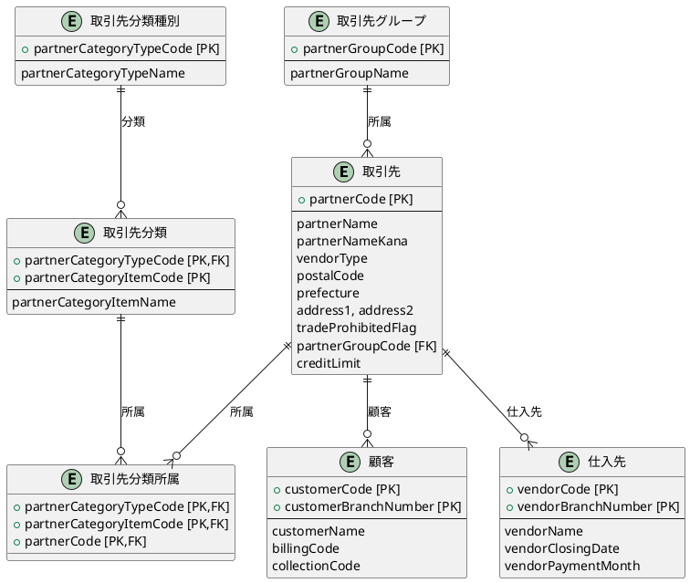
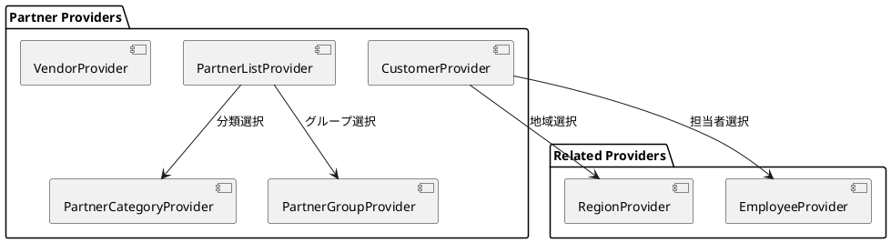

# 第9章: 取引先管理

本章では、取引先管理の実装について解説します。5つのタブによる画面構成、取引先分類・グループ・顧客・仕入先の関連、ネストしたタブによる複雑な編集画面パターンを説明します。

## 9.1 取引先管理の構成

### 5タブによる画面構成

取引先管理は「分類」「グループ」「一覧」「顧客」「仕入先」の5つのタブで構成されます。

```plantuml
@startuml
package "Partner Management" {
  [PartnerContainer] as container

  package "分類タブ" {
    [PartnerCategoryContainer] as catContainer
    [PartnerCategoryCollection] as catCollection
    [PartnerCategorySingle] as catSingle
  }

  package "グループタブ" {
    [PartnerGroupContainer] as groupContainer
    [PartnerGroupCollection] as groupCollection
    [PartnerGroupSingle] as groupSingle
  }

  package "一覧タブ" {
    [PartnerListContainer] as listContainer
    [PartnerListCollection] as listCollection
    [PartnerListSingle] as listSingle
  }

  package "顧客タブ" {
    [CustomerContainer] as custContainer
    [CustomerCollection] as custCollection
    [CustomerSingle] as custSingle
  }

  package "仕入先タブ" {
    [VendorContainer] as vendorContainer
    [VendorCollection] as vendorCollection
    [VendorSingle] as vendorSingle
  }
}

container --> catContainer : 分類
container --> groupContainer : グループ
container --> listContainer : 一覧
container --> custContainer : 顧客
container --> vendorContainer : 仕入先
@enduml
```



### PartnerContainer

タブで画面を切り替えるルートコンテナです。

```typescript
import React from "react";
import {useTab} from "../../application/hooks.ts";
import {SiteLayout} from "../../../views/SiteLayout.tsx";
import {PartnerCategoryContainer} from "./category/PartnerCategoryContainer.tsx";
import {PartnerGroupContainer} from "./group/PartnerGroupContainer.tsx";
import {PartnerListContainer} from "./list/PartnerListContainer.tsx";
import {CustomerContainer} from "./customer/CustomerContainer.tsx";
import {VendorContainer} from "./vendor/VendorContainer.tsx";

export const PartnerContainer: React.FC = () => {
    const {
        Tab,
        TabList,
        TabPanel,
        Tabs,
    } = useTab();

    return (
        <SiteLayout>
            <Tabs>
                <TabList>
                    <Tab>分類</Tab>
                    <Tab>グループ</Tab>
                    <Tab>一覧</Tab>
                    <Tab>顧客</Tab>
                    <Tab>仕入先</Tab>
                </TabList>
                <TabPanel>
                    <PartnerCategoryContainer/>
                </TabPanel>
                <TabPanel>
                    <PartnerGroupContainer/>
                </TabPanel>
                <TabPanel>
                    <PartnerListContainer/>
                </TabPanel>
                <TabPanel>
                    <CustomerContainer/>
                </TabPanel>
                <TabPanel>
                    <VendorContainer/>
                </TabPanel>
            </Tabs>
        </SiteLayout>
    );
}
```

## 9.2 取引先の型定義

### 基本型定義

```typescript
// models/master/partner/partner.ts
import {PageNationType} from "../../../views/application/PageNation.tsx";
import {CustomerType} from "./customer.ts";
import {VendorType} from "./vendor.ts";
import {PrefectureEnumType} from "../shared.ts";

export type PartnerType = {
    partnerCode: string;           // 取引先コード
    partnerName: string;           // 取引先名
    partnerNameKana: string;       // 取引先名カナ
    vendorType: VendorEnumType;    // 仕入先区分
    postalCode: string;            // 郵便番号
    prefecture: PrefectureEnumType; // 都道府県
    address1: string;              // 住所1
    address2: string;              // 住所2
    tradeProhibitedFlag: TradeProhibitedFlagEnumType; // 取引禁止フラグ
    miscellaneousType: MiscellaneousEnumType;         // 雑区分
    partnerGroupCode: string;      // 取引先グループコード
    creditLimit: number;           // 与信限度額
    temporaryCreditIncrease: number; // 与信一時増加枠
    customers: CustomerType[];     // 取引先顧客リスト
    vendors: VendorType[];         // 取引先仕入先リスト
    checked: boolean;
};

// 仕入先区分
export enum VendorEnumType {
    仕入先でない = "仕入先でない",
    仕入先 = "仕入先",
}

// 取引禁止フラグ
export enum TradeProhibitedFlagEnumType {
    OFF = "OFF",
    ON = "ON"
}

// 雑区分
export enum MiscellaneousEnumType {
    対象外 = "対象外",
    対象 = "対象"
}
```

### エンティティ関連図



## 9.3 取引先分類管理

### 分類の型定義

取引先分類は「種別」と「分類項目」の2階層構造です。

```typescript
// models/master/partner/partnerCategory.ts
export type PartnerCategoryType = {
    partnerCategoryTypeCode: string;  // 取引先分類種別コード
    partnerCategoryTypeName: string;  // 取引先分類種別名
    partnerCategoryItems: PartnerCategoryItemType[]; // 取引先分類
    checked: boolean;
};

export type PartnerCategoryItemType = {
    partnerCategoryTypeCode: string;  // 取引先分類種別コード
    partnerCategoryItemCode: string;  // 取引先分類コード
    partnerCategoryItemName: string;  // 取引先分類名
    partnerCategoryAffiliations: PartnerCategoryAffiliationType[];
};

export type PartnerCategoryAffiliationType = {
    partnerCategoryTypeCode: string;  // 取引先分類種別コード
    partnerCode: string;              // 取引先コード
    partnerCategoryItemCode: string;  // 取引先分類コード
};
```

### PartnerCategoryProvider

分類種別と分類項目の両方を管理するための Context 型です。

```typescript
type PartnerCategoryContextType = {
    // 基本状態
    loading: boolean;
    setLoading: Dispatch<SetStateAction<boolean>>;
    message: string | null;
    setMessage: Dispatch<SetStateAction<string | null>>;
    error: string | null;
    setError: Dispatch<SetStateAction<string | null>>;

    // ページネーション・検索条件
    pageNation: PageNationType | null;
    setPageNation: Dispatch<SetStateAction<PageNationType | null>>;
    criteria: PartnerCategoryCriteriaType | null;
    setCriteria: Dispatch<SetStateAction<PartnerCategoryCriteriaType | null>>;

    // モーダル制御（種別）
    searchModalIsOpen: boolean;
    setSearchModalIsOpen: Dispatch<SetStateAction<boolean>>;
    modalIsOpen: boolean;
    setModalIsOpen: Dispatch<SetStateAction<boolean>>;
    isEditing: boolean;
    setIsEditing: Dispatch<SetStateAction<boolean>>;
    editId: string | null;
    setEditId: Dispatch<SetStateAction<string | null>>;

    // モーダル制御（分類項目）
    categoryItemModalIsOpen: boolean;
    setCategoryItemModalIsOpen: Dispatch<SetStateAction<boolean>>;
    setCategoryItemIsEditing: Dispatch<SetStateAction<boolean>>;
    setCategoryItemEditId: Dispatch<SetStateAction<string | null>>;

    // データ
    initialPartnerCategory: PartnerCategoryType;
    partnerCategories: PartnerCategoryType[];
    setPartnerCategories: Dispatch<SetStateAction<PartnerCategoryType[]>>;
    newPartnerCategory: PartnerCategoryType;
    setNewPartnerCategory: Dispatch<SetStateAction<PartnerCategoryType>>;
    newPartnerCategoryItem: PartnerCategoryItemType;
    setNewPartnerCategoryItem: Dispatch<SetStateAction<PartnerCategoryItemType>>;

    // 検索・サービス
    searchPartnerCategoryCriteria: PartnerCategoryCriteriaType;
    setSearchPartnerCategoryCriteria: Dispatch<SetStateAction<PartnerCategoryCriteriaType>>;
    fetchPartnerCategories: { load: (page?: number, criteria?: PartnerCategoryCriteriaType) => Promise<void> };
    partnerCategoryService: PartnerCategoryServiceType;
};
```

## 9.4 取引先グループ管理

### グループの型定義

グループはシンプルな構造です。

```typescript
// models/master/partner/partnerGroup.ts
export type PartnerGroupType = {
    partnerGroupCode: string;  // 取引先グループコード
    partnerGroupName: string;  // 取引先グループ名
    checked: boolean;
};

export type PartnerGroupCriteriaType = {
    partnerGroupCode?: string;
    partnerGroupName?: string;
};

export type PartnerGroupFetchType = {
    list: PartnerGroupType[];
} & PageNationType;
```

## 9.5 顧客管理

### 顧客の型定義

顧客は請求・回収情報、出荷先情報を持つ複雑なエンティティです。

```typescript
// models/master/partner/customer.ts
import {
    ClosingDateEnumType,
    PaymentDayEnumType,
    PaymentMethodEnumType,
    PaymentMonthEnumType,
} from "../shared.ts";

// 顧客区分
export enum CustomerEnumType {
    顧客でない = "顧客でない",
    顧客 = "顧客",
}

// 請求区分
export enum CustomerBillingCategoryEnumType {
    都度請求 = "都度請求",
    締請求 = "締請求",
}

// 出荷先型
export type ShippingType = {
    customerCode: string;        // 顧客コード
    customerBranchNumber: number; // 顧客枝番
    destinationNumber: number;   // 出荷先番号
    destinationName: string;     // 出荷先名
    regionCode: string;          // 地域コード
    postalCode: string;          // 郵便番号
    prefecture: string;          // 都道府県
    address1: string;            // 住所1
    address2: string;            // 住所2
};

// 顧客型
export type CustomerType = {
    customerCode: string;         // 顧客コード
    customerBranchNumber: number; // 顧客枝番号
    customerType: CustomerEnumType; // 顧客区分
    billingCode: string;          // 請求先コード
    billingBranchNumber: number;  // 請求枝番号
    collectionCode: string;       // 回収先コード
    collectionBranchNumber: number; // 回収枝番号
    customerName: string;         // 顧客名
    customerNameKana: string;     // 顧客名カナ
    companyRepresentativeCode: string; // 自社担当者コード
    customerRepresentativeName: string; // 顧客担当者名
    customerDepartmentName: string;     // 顧客部門名
    customerPostalCode: string;   // 顧客郵便番号
    customerPrefecture: string;   // 顧客都道府県
    customerAddress1: string;     // 顧客住所1
    customerAddress2: string;     // 顧客住所2
    customerPhoneNumber: string;  // 顧客電話番号
    customerFaxNumber: string;    // 顧客FAX番号
    customerEmailAddress: string; // 顧客メールアドレス
    customerBillingType: CustomerBillingCategoryEnumType; // 顧客請求区分
    // 締請求情報1
    customerClosingDay1: ClosingDateEnumType;
    customerPaymentMonth1: PaymentMonthEnumType;
    customerPaymentDay1: PaymentDayEnumType;
    customerPaymentMethod1: PaymentMethodEnumType;
    // 締請求情報2
    customerClosingDay2: ClosingDateEnumType;
    customerPaymentMonth2: PaymentMonthEnumType;
    customerPaymentDay2: PaymentDayEnumType;
    customerPaymentMethod2: PaymentMethodEnumType;
    shippings: ShippingType[];    // 出荷先リスト
    checked: boolean;
};
```

### 共有型定義（締請求関連）

```typescript
// models/master/shared.ts

// 締日型
export enum ClosingDateEnumType {
    十日 = "十日",
    二十日 = "二十日",
    末日 = "末日",
}

// 支払月型
export enum PaymentMonthEnumType {
    当月 = "当月",
    翌月 = "翌月",
    翌々月 = "翌々月",
}

// 支払日型
export enum PaymentDayEnumType {
    十日 = "十日",
    二十日 = "二十日",
    末日 = "末日",
}

// 支払方法型
export enum PaymentMethodEnumType {
    振込 = "振込",
    手形 = "手形",
}
```

### CustomerContainer

顧客コンテナは地域マスタとの連携が必要です。

```typescript
import React, {useEffect} from 'react';
import {showErrorMessage} from "../../../application/utils.ts";
import LoadingIndicator from "../../../../views/application/LoadingIndicatior.tsx";
import {CustomerProvider, useCustomerContext} from "../../../../providers/master/partner/Customer.tsx";
import {RegionProvider, useRegionContext} from "../../../../providers/master/code/Region.tsx";
import {CustomerCollection} from "./CustomerCollection.tsx";

export const CustomerContainer: React.FC = () => {
    const Content: React.FC = () => {
        const {
            loading,
            setError,
            fetchCustomers,
        } = useCustomerContext();

        const {
            fetchRegions,
        } = useRegionContext();

        useEffect(() => {
            (async () => {
                try {
                    // 顧客と地域の並行取得
                    await Promise.all([
                        fetchCustomers.load(),
                        fetchRegions.load()
                    ]);
                } catch (error: any) {
                    showErrorMessage(
                        `顧客情報の取得に失敗しました: ${error?.message}`,
                        setError
                    );
                }
            })();
        }, []);

        return (
            <>
                {loading ? (
                    <LoadingIndicator />
                ) : (
                    <CustomerCollection/>
                )}
            </>
        );
    };

    return (
        <CustomerProvider>
            <RegionProvider>
                <Content />
            </RegionProvider>
        </CustomerProvider>
    );
};
```

### CustomerSingle（ネストタブパターン）

顧客編集画面は「基本情報」「請求情報」「出荷先情報」の3タブで構成されます。

```typescript
import React from "react";
import {useCustomerContext} from "../../../../providers/master/partner/Customer.tsx";
import {useRegionContext} from "../../../../providers/master/code/Region.tsx";
import {showErrorMessage} from "../../../application/utils.ts";
import {CustomerSingleView} from "../../../../views/master/partner/customer/CustomerSingle.tsx";
import {CustomerInvoiceSingleView} from "../../../../views/master/partner/customer/CustomerInvoiceSingle.tsx";
import {Tab, TabList, TabPanel, Tabs} from "react-tabs";
import {CustomerShippingCollectionAddListView} from "../../../../views/master/partner/customer/CustomerCollection.tsx";
import {ShippingType} from "../../../../models/master/partner";
import {PrefectureEnumType} from "../../../../models";
import {RegionSelectModal} from "./RegionSelectModal.tsx";

export const CustomerSingle: React.FC = () => {
    const {
        message,
        setMessage,
        error,
        setError,
        setModalIsOpen,
        isEditing,
        editId,
        setEditId,
        initialCustomer,
        newCustomer,
        setNewCustomer,
        setNewShipping,
        fetchCustomers,
        customerService
    } = useCustomerContext();

    const {
        setModalIsOpen: setRegionModalIsOpen,
        setIsEditing: setRegionIsEditing,
    } = useRegionContext();

    const handleCloseModal = () => {
        setError("");
        setModalIsOpen(false);
        setEditId(null);
    };

    const handleCreateOrUpdateCustomer = async () => {
        if (!newCustomer.customerCode.trim() || !newCustomer.customerName.trim()) {
            setError("顧客コードと名称は必須項目です。");
            return;
        }
        try {
            if (isEditing && editId) {
                await customerService.update(newCustomer);
            } else {
                await customerService.create(newCustomer);
            }
            setNewCustomer({ ...initialCustomer });
            await fetchCustomers.load();
            setMessage(isEditing ? "顧客を更新しました。" : "顧客を作成しました。");
            handleCloseModal();
        } catch (error: any) {
            showErrorMessage(
                `顧客の作成または更新に失敗しました: ${error?.message}`,
                setError
            );
        }
    };

    // 地域選択モーダルを開く
    const handleOpenRegionModal = () => {
        setMessage("");
        setError("");
        setRegionIsEditing(true);
        setRegionModalIsOpen(true);
    };

    // 出荷先を追加
    const handleAddShipping = () => {
        setMessage("");
        setError("");
        const maxDestinationNumber = Math.max(
            ...newCustomer.shippings.map((shipping) => shipping.destinationNumber)
        );
        const initialDestinationNumber =
            maxDestinationNumber === -Infinity ? 1 : maxDestinationNumber + 1;

        const shipping: ShippingType = {
            customerCode: newCustomer.customerCode,
            customerBranchNumber: newCustomer.customerBranchNumber,
            destinationNumber: initialDestinationNumber,
            destinationName: "出荷先名",
            regionCode: "R001",
            postalCode: "1234567",
            prefecture: PrefectureEnumType.東京都,
            address1: "住所1",
            address2: "住所2",
        };

        setNewCustomer({
            ...newCustomer,
            shippings: [...newCustomer.shippings, shipping]
        });
    };

    // 出荷先を削除
    const handleDeleteShipping = (shippingAddress: ShippingType) => {
        setNewCustomer({
            ...newCustomer,
            shippings: newCustomer.shippings.filter(
                (item) => item.destinationNumber !== shippingAddress.destinationNumber
            )
        });
    };

    return (
        <>
            <RegionSelectModal/>
            <Tabs>
                <TabList>
                    <Tab>基本情報</Tab>
                    <Tab>請求情報</Tab>
                    <Tab>出荷先情報</Tab>
                </TabList>
                <TabPanel>
                    <CustomerSingleView
                        error={error}
                        message={message}
                        isEditing={isEditing}
                        headerItems={{ handleCreateOrUpdateCustomer, handleCloseModal }}
                        formItems={{ newCustomer, setNewCustomer }}
                    />
                </TabPanel>
                <TabPanel>
                    <CustomerInvoiceSingleView
                        error={error}
                        message={message}
                        isEditing={isEditing}
                        headerItems={{ handleCreateOrUpdateCustomer, handleCloseModal }}
                        formItems={{ newCustomer, setNewCustomer }}
                    />
                </TabPanel>
                <TabPanel>
                    <CustomerShippingCollectionAddListView
                        setNewShipping={setNewShipping}
                        shippings={newCustomer.shippings}
                        handleAddShipping={handleAddShipping}
                        handleDeleteShipping={handleDeleteShipping}
                        handleAddRegion={handleOpenRegionModal}
                    />
                </TabPanel>
            </Tabs>
        </>
    );
};
```

### 出荷先番号の自動採番

出荷先を追加する際、既存の最大番号 + 1 を自動採番します。

```typescript
const handleAddShipping = () => {
    // 既存の最大番号を取得
    const maxDestinationNumber = Math.max(
        ...newCustomer.shippings.map((shipping) => shipping.destinationNumber)
    );
    // 空の場合は 1、それ以外は最大値 + 1
    const initialDestinationNumber =
        maxDestinationNumber === -Infinity ? 1 : maxDestinationNumber + 1;

    const shipping: ShippingType = {
        customerCode: newCustomer.customerCode,
        customerBranchNumber: newCustomer.customerBranchNumber,
        destinationNumber: initialDestinationNumber,
        // ... その他のフィールド
    };

    setNewCustomer({
        ...newCustomer,
        shippings: [...newCustomer.shippings, shipping]
    });
};
```

## 9.6 仕入先管理

### 仕入先の型定義

```typescript
// models/master/partner/vendor.ts
import {
    ClosingDateEnumType,
    PaymentDayEnumType,
    PaymentMethodEnumType,
    PaymentMonthEnumType,
} from "../shared.ts";

export type VendorType = {
    vendorCode: string;            // 仕入先コード
    vendorBranchNumber: number;    // 仕入先枝番号
    vendorName: string;            // 仕入先名
    vendorNameKana: string;        // 仕入先名カナ
    vendorContactName: string;     // 仕入先担当者名
    vendorDepartmentName: string;  // 仕入先部門名
    vendorPostalCode: string;      // 郵便番号
    vendorPrefecture: string;      // 都道府県
    vendorAddress1: string;        // 住所1
    vendorAddress2: string;        // 住所2
    vendorPhoneNumber: string;     // 仕入先電話番号
    vendorFaxNumber: string;       // 仕入先FAX番号
    vendorEmailAddress: string;    // 仕入先メールアドレス
    vendorClosingDate: ClosingDateEnumType;   // 締日
    vendorPaymentMonth: PaymentMonthEnumType; // 支払月
    vendorPaymentDate: PaymentDayEnumType;    // 支払日
    vendorPaymentMethod: PaymentMethodEnumType; // 支払方法
    checked: boolean;
};

export type VendorFetchType = {
    list: VendorType[];
} & PageNationType;

export type VendorCriteriaType = {
    vendorCode?: string;
    vendorName?: string;
    vendorContactName?: string;
    vendorDepartmentName?: string;
    postalCode?: string;
    prefecture?: string;
    address1?: string;
    address2?: string;
    vendorPhoneNumber?: string;
    vendorFaxNumber?: string;
    vendorEmailAddress?: string;
};
```

## 9.7 顧客カスタムフック

### useCustomer

顧客の初期値とステート管理を提供するフックです。

```typescript
// components/master/partner/hooks/customer.ts
import {useState} from "react";
import {
    CustomerBillingCategoryEnumType,
    CustomerCriteriaType,
    CustomerEnumType,
    CustomerType,
    ShippingType,
} from "../../../../models/master/partner";
import {useFetchEntities} from "../../../application/hooks.ts";
import {
    ClosingDateEnumType,
    PaymentDayEnumType,
    PaymentMethodEnumType,
    PaymentMonthEnumType,
    PrefectureEnumType
} from "../../../../models";

export const useCustomer = () => {
    const initialCustomer: CustomerType = {
        customerCode: "",
        customerBranchNumber: 0,
        customerType: CustomerEnumType.顧客でない,
        billingCode: "",
        billingBranchNumber: 0,
        collectionCode: "",
        collectionBranchNumber: 0,
        customerName: "",
        customerNameKana: "",
        companyRepresentativeCode: "",
        customerRepresentativeName: "",
        customerDepartmentName: "",
        customerPostalCode: "",
        customerPrefecture: PrefectureEnumType.東京都,
        customerAddress1: "",
        customerAddress2: "",
        customerPhoneNumber: "",
        customerFaxNumber: "",
        customerEmailAddress: "",
        customerBillingType: CustomerBillingCategoryEnumType.都度請求,
        customerClosingDay1: ClosingDateEnumType.末日,
        customerPaymentMonth1: PaymentMonthEnumType.当月,
        customerPaymentDay1: PaymentDayEnumType.末日,
        customerPaymentMethod1: PaymentMethodEnumType.振込,
        customerClosingDay2: ClosingDateEnumType.末日,
        customerPaymentMonth2: PaymentMonthEnumType.当月,
        customerPaymentDay2: PaymentDayEnumType.末日,
        customerPaymentMethod2: PaymentMethodEnumType.振込,
        shippings: [],
        checked: false
    };

    const initialShipping: ShippingType = {
        customerCode: "",
        customerBranchNumber: 0,
        destinationNumber: 0,
        destinationName: "",
        regionCode: "",
        postalCode: "",
        prefecture: PrefectureEnumType.東京都,
        address1: "",
        address2: ""
    };

    const [customers, setCustomers] = useState<CustomerType[]>([]);
    const [newCustomer, setNewCustomer] = useState<CustomerType>(initialCustomer);
    const [searchCustomerCriteria, setSearchCustomerCriteria] = useState<CustomerCriteriaType>({});
    const customerService = CustomerService();
    const [newShipping, setNewShipping] = useState<ShippingType>(initialShipping);

    return {
        initialCustomer,
        customers,
        newCustomer,
        setNewCustomer,
        searchCustomerCriteria,
        setSearchCustomerCriteria,
        setCustomers,
        customerService,
        newShipping,
        setNewShipping
    };
};
```

## 9.8 顧客サービス

### 複合キーを持つエンティティの API

顧客は `customerCode` と `customerBranchNumber` の複合キーを持ちます。

```typescript
// services/master/customer.ts
import Config from "../config.ts";
import Utils from "../utils.ts";
import {
    CustomerType,
    CustomerFetchType,
    CustomerCriteriaType,
    mapToCustomerCriteriaType,
} from "../../models/master/partner";

export interface CustomerServiceType {
    select: (page?: number, pageSize?: number) => Promise<CustomerFetchType>;
    find: (customerCode: string, branchNumber: number) => Promise<CustomerType>;
    create: (customer: CustomerType) => Promise<void>;
    update: (customer: CustomerType) => Promise<void>;
    destroy: (customerCode: string, branchNumber: number) => Promise<void>;
    search: (criteria: CustomerCriteriaType, page?: number, pageSize?: number) => Promise<CustomerFetchType>;
}

export const CustomerService = (): CustomerServiceType => {
    const config = Config();
    const apiUtils = Utils.apiUtils;
    const endPoint = `${config.apiUrl}/customers`;

    const select = async (page?: number, pageSize?: number): Promise<CustomerFetchType> => {
        const url = Utils.buildUrlWithPaging(endPoint, page, pageSize);
        return await apiUtils.fetchGet(url);
    };

    // 複合キーによる検索
    const find = async (customerCode: string, branchNumber: number): Promise<CustomerType> => {
        const url = `${endPoint}/${customerCode}/${branchNumber}`;
        return await apiUtils.fetchGet(url);
    };

    const create = async (customer: CustomerType): Promise<void> => {
        await apiUtils.fetchPost(endPoint, customer);
    };

    const update = async (customer: CustomerType): Promise<void> => {
        const url = `${endPoint}/${customer.customerCode}`;
        await apiUtils.fetchPut(url, customer);
    };

    // 複合キーによる削除
    const destroy = async (customerCode: string, branchNumber: number): Promise<void> => {
        const url = `${endPoint}/${customerCode}/${branchNumber}`;
        await apiUtils.fetchDelete(url);
    };

    const search = async (
        criteria: CustomerCriteriaType,
        page?: number,
        pageSize?: number
    ): Promise<CustomerFetchType> => {
        const url = Utils.buildUrlWithPaging(`${endPoint}/search`, page, pageSize);
        const criteriaResource = mapToCustomerCriteriaType(criteria);
        return await apiUtils.fetchPost(url, criteriaResource);
    };

    return {
        select,
        find,
        create,
        update,
        destroy,
        search,
    };
};
```

## 9.9 Provider 設計

### 取引先管理の Provider 構成



### CustomerProvider のネスト構造

```typescript
// CustomerContainer.tsx
return (
    <CustomerProvider>
        <RegionProvider>
            <Content />
        </RegionProvider>
    </CustomerProvider>
);
```

## まとめ

本章では、取引先管理の実装について解説しました。

- **5タブ構成**: 分類・グループ・一覧・顧客・仕入先の切り替え
- **階層構造**: 取引先分類の種別と項目の2階層管理
- **ネストタブ**: 顧客編集画面の3タブ（基本・請求・出荷先）
- **複合キー**: 顧客・仕入先の枝番による複数レコード管理
- **出荷先管理**: 自動採番と動的追加・削除
- **共有型定義**: 締日・支払月・支払日・支払方法の Enum

次章では、コードマスタの実装について詳しく解説します。
