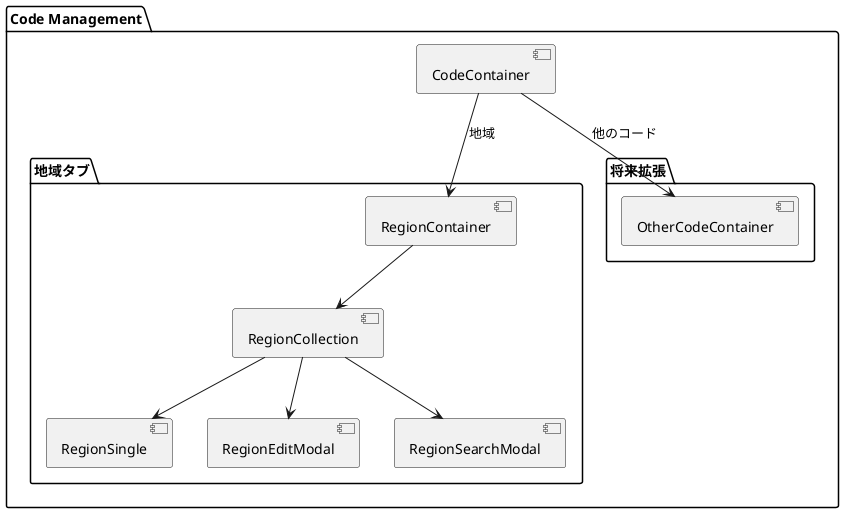

# 第10章: コードマスタ

本章では、コードマスタの実装について解説します。シンプルなマスタデータの管理パターン、一括削除機能、バリデーションのベストプラクティスを説明します。

## 10.1 コードマスタの構成

### タブによる画面構成

コードマスタは拡張可能なタブ構造で設計されています。現在は「地域」のみですが、将来的に他のコードを追加できます。



### CodeContainer

```typescript
import React from "react";
import {useTab} from "../../application/hooks.ts";
import {SiteLayout} from "../../../views/SiteLayout.tsx";
import {RegionContainer} from "./region/RegionContainer.tsx";

export const CodeContainer: React.FC = () => {
    const {
        Tab,
        TabList,
        TabPanel,
        Tabs,
    } = useTab();

    return (
        <SiteLayout>
            <Tabs>
                <TabList>
                    <Tab>地域</Tab>
                </TabList>
                <TabPanel>
                    <RegionContainer/>
                </TabPanel>
            </Tabs>
        </SiteLayout>
    );
}
```

## 10.2 地域マスタの型定義

### シンプルなエンティティ型

地域マスタはコードと名称のみを持つシンプルな構造です。

```typescript
// models/master/code/region.ts
import {PageNationType} from "../../../views/application/PageNation.tsx";

export type RegionType = {
    regionCode: string;  // 地域コード
    regionName: string;  // 地域名
    checked: boolean;    // 一括操作用チェック状態
}

export type RegionFetchType = {
    list: RegionType[];
} & PageNationType;

export type RegionCriteriaType = {
    regionCode?: string;
    regionName?: string;
}
```

### マッピング関数

```typescript
export const mapToRegionResource = (region: RegionType): RegionType => {
    return {
        ...region
    }
}

export const mapToRegionCriteria = (criteria: RegionCriteriaType): RegionCriteriaType => {
    const isEmpty = (value: unknown) =>
        value === "" || value === null || value === undefined;
    return {
        ...(!isEmpty(criteria.regionCode) && {regionCode: criteria.regionCode}),
        ...(!isEmpty(criteria.regionName) && {regionName: criteria.regionName}),
    }
}
```

## 10.3 RegionContainer

### シンプルなコンテナパターン

```typescript
import React, {useEffect} from "react";
import LoadingIndicator from "../../../../views/application/LoadingIndicatior.tsx";
import {RegionProvider, useRegionContext} from "../../../../providers/master/code/Region.tsx";
import {RegionCollection} from "./RegionCollection.tsx";

export const RegionContainer: React.FC = () => {
    const Content: React.FC = () => {
        const {
            loading,
            fetchRegions,
        } = useRegionContext();

        useEffect(() => {
            fetchRegions.load().then(() => {});
        }, []);

        return (
            <>
                {loading ? (
                    <LoadingIndicator />
                ) : (
                    <RegionCollection/>
                )}
            </>
        );
    };

    return (
        <RegionProvider>
            <Content />
        </RegionProvider>
    );
};
```

## 10.4 RegionCollection

### 一覧画面の実装

```typescript
import React from "react";
import {useRegionContext} from "../../../../providers/master/code/Region.tsx";
import {RegionType} from "../../../../models/master/code";
import {showErrorMessage} from "../../../application/utils.ts";
import {RegionCollectionView} from "../../../../views/master/code/region/RegionCollection.tsx";
import {RegionSearchModal} from "./RegionSearchModal.tsx";
import {RegionEditModal} from "./RegionEditModal.tsx";

export const RegionCollection: React.FC = () => {
    const {
        message,
        setMessage,
        error,
        setError,
        pageNation,
        criteria,
        setSearchModalIsOpen,
        setModalIsOpen,
        setIsEditing,
        setEditId,
        initialRegion,
        regions,
        setRegions,
        setNewRegion,
        searchRegionCriteria,
        setSearchRegionCriteria,
        fetchRegions,
        regionService,
    } = useRegionContext();

    // 編集モーダルを開く
    const handleOpenModal = (region?: RegionType) => {
        setMessage("");
        setError("");
        if (region) {
            setNewRegion(region);
            setEditId(region.regionCode);
            setIsEditing(true);
        } else {
            setNewRegion(initialRegion);
            setIsEditing(false);
        }
        setModalIsOpen(true);
    };

    // 検索モーダルを開く
    const handleOpenSearchModal = () => {
        setSearchModalIsOpen(true);
    };

    // 単一削除
    const handleDeleteRegion = async (regionCode: string) => {
        try {
            if (!window.confirm(`地域コード:${regionCode} を削除しますか？`))
                return;
            await regionService.destroy(regionCode);
            await fetchRegions.load();
            setMessage("地域を削除しました。");
        } catch (error: unknown) {
            showErrorMessage(error, setError, "地域の削除に失敗しました");
        }
    };

    // チェック状態の切り替え
    const handleCheckRegion = (region: RegionType) => {
        const newRegions = regions.map((r) => {
            if (r.regionCode === region.regionCode) {
                return { ...r, checked: !r.checked };
            }
            return r;
        });
        setRegions(newRegions);
    };

    // 全選択/解除
    const handleCheckAllRegion = () => {
        const newRegions = regions.map((r) => ({
            ...r,
            checked: !regions.every((r) => r.checked),
        }));
        setRegions(newRegions);
    };

    // 一括削除
    const handleDeleteCheckedCollection = async () => {
        const checkedRegions = regions.filter((r) => r.checked);
        if (!checkedRegions.length) {
            setError("削除する地域を選択してください。");
            return;
        }
        try {
            if (!window.confirm("選択した地域を削除しますか？")) return;
            await Promise.all(
                checkedRegions.map((r) =>
                    regionService.destroy(r.regionCode)
                )
            );
            await fetchRegions.load();
            setMessage("選択した地域を削除しました。");
        } catch (error: unknown) {
            showErrorMessage(error, setError, "選択した地域の削除に失敗しました");
        }
    };

    return (
        <>
            <RegionSearchModal/>
            <RegionEditModal/>
            <RegionCollectionView
                error={error}
                message={message}
                searchItems={{
                    searchRegionCriteria,
                    setSearchRegionCriteria,
                    handleOpenSearchModal
                }}
                headerItems={{
                    handleOpenModal,
                    handleCheckToggleCollection: handleCheckAllRegion,
                    handleDeleteCheckedCollection,
                }}
                collectionItems={{
                    regions,
                    handleOpenModal,
                    handleDeleteRegion,
                    handleCheckRegion,
                }}
                pageNationItems={{
                    pageNation,
                    fetchRegions: fetchRegions.load,
                    criteria,
                }}
            />
        </>
    );
}
```

### 一括削除パターン

一括削除は以下の手順で実装します。

```typescript
const handleDeleteCheckedCollection = async () => {
    // 1. チェックされた項目を抽出
    const checkedRegions = regions.filter((r) => r.checked);

    // 2. 選択なしの場合はエラー表示
    if (!checkedRegions.length) {
        setError("削除する地域を選択してください。");
        return;
    }

    // 3. 確認ダイアログ
    if (!window.confirm("選択した地域を削除しますか？")) return;

    try {
        // 4. 並行削除（Promise.all）
        await Promise.all(
            checkedRegions.map((r) =>
                regionService.destroy(r.regionCode)
            )
        );

        // 5. 一覧を再取得
        await fetchRegions.load();
        setMessage("選択した地域を削除しました。");
    } catch (error: unknown) {
        showErrorMessage(error, setError, "選択した地域の削除に失敗しました");
    }
};
```

### チェック状態管理

```typescript
// 個別チェック
const handleCheckRegion = (region: RegionType) => {
    const newRegions = regions.map((r) => {
        if (r.regionCode === region.regionCode) {
            return { ...r, checked: !r.checked };
        }
        return r;
    });
    setRegions(newRegions);
};

// 全選択トグル
const handleCheckAllRegion = () => {
    const allChecked = regions.every((r) => r.checked);
    const newRegions = regions.map((r) => ({
        ...r,
        checked: !allChecked, // 全て選択済みなら解除、そうでなければ全選択
    }));
    setRegions(newRegions);
};
```

## 10.5 RegionSingle

### 編集画面の実装

```typescript
import React from "react";
import {useRegionContext} from "../../../../providers/master/code/Region.tsx";
import {showErrorMessage} from "../../../application/utils.ts";
import {RegionSingleView} from "../../../../views/master/code/region/RegionSingle.tsx";

export const RegionSingle: React.FC = () => {
    const {
        message,
        setMessage,
        error,
        setError,
        setModalIsOpen,
        isEditing,
        editId,
        setEditId,
        initialRegion,
        newRegion,
        setNewRegion,
        fetchRegions,
        regionService,
    } = useRegionContext();

    const handleCloseModal = () => {
        setError("");
        setModalIsOpen(false);
        setEditId(null);
    };

    const handleCreateOrUpdateRegion = async () => {
        // バリデーション
        const validateRegion = (): boolean => {
            if (
                !newRegion.regionCode.trim() ||
                !newRegion.regionName.trim()
            ) {
                setError("地域コード、地域名は必須項目です。");
                return false;
            }
            return true;
        };

        if (!validateRegion()) {
            return;
        }

        try {
            if (isEditing && editId) {
                await regionService.update(newRegion);
            } else {
                await regionService.create(newRegion);
            }
            setNewRegion(initialRegion);
            await fetchRegions.load();
            setMessage(isEditing ? "地域を更新しました。" : "地域を作成しました。");
            handleCloseModal();
        } catch (error: unknown) {
            showErrorMessage(error, setError, "地域の作成に失敗しました");
        }
    };

    return (
        <RegionSingleView
            error={error}
            message={message}
            isEditing={isEditing}
            headerItems={{ handleCreateOrUpdateRegion, handleCloseModal }}
            formItems={{ newRegion, setNewRegion }}
        />
    );
}
```

### バリデーションパターン

```typescript
const validateRegion = (): boolean => {
    // 必須項目チェック
    if (
        !newRegion.regionCode.trim() ||
        !newRegion.regionName.trim()
    ) {
        setError("地域コード、地域名は必須項目です。");
        return false;
    }
    return true;
};

// 使用時
if (!validateRegion()) {
    return; // バリデーション失敗時は早期リターン
}
```

## 10.6 useRegion フック

### シンプルなカスタムフック

```typescript
// components/master/code/hooks/Region.ts
import {useState} from "react";
import {RegionService, RegionServiceType} from "../../../../services/master/region.ts";
import {RegionType, RegionCriteriaType} from "../../../../models/master/code";
import {useFetchEntities} from "../../../application/hooks.ts";
import {PageNationType} from "../../../../views/application/PageNation.tsx";

export const useRegion = () => {
    const initialRegion: RegionType = {
        regionCode: "",
        regionName: "",
        checked: false
    };

    const [regions, setRegions] = useState<RegionType[]>([]);
    const [newRegion, setNewRegion] = useState<RegionType>(initialRegion);
    const [searchRegionCriteria, setSearchRegionCriteria] = useState<RegionCriteriaType>({});

    const regionService = RegionService();

    return {
        initialRegion,
        regions,
        newRegion,
        setNewRegion,
        searchRegionCriteria,
        setSearchRegionCriteria,
        setRegions,
        regionService,
    };
};
```

### useFetchRegions

汎用の `useFetchEntities` を使用してデータ取得機能を実装します。

```typescript
export const useFetchRegions = (
    setLoading: (loading: boolean) => void,
    setList: (list: RegionType[]) => void,
    setPageNation: (pageNation: PageNationType) => void,
    setError: (error: string) => void,
    showErrorMessage: (message: string, callback: (error: string) => void) => void,
    service: RegionServiceType
) => useFetchEntities<RegionType, RegionServiceType, RegionCriteriaType>(
    setLoading,
    setList,
    setPageNation,
    setError,
    showErrorMessage,
    service,
    "地域情報の取得に失敗しました:"
);
```

## 10.7 RegionProvider

### Provider の実装

```typescript
import React, {
    createContext,
    useContext,
    ReactNode,
    useState,
    useMemo,
    Dispatch,
    SetStateAction,
} from "react";
import {PageNationType, usePageNation} from "../../../views/application/PageNation.tsx";
import {useModal} from "../../../components/application/hooks.ts";
import {showErrorMessage} from "../../../components/application/utils.ts";
import {useMessage} from "../../../components/application/Message.tsx";
import {RegionServiceType} from "../../../services/master/region.ts";
import {RegionCriteriaType, RegionType} from "../../../models/master/code";
import {useFetchRegions, useRegion} from "../../../components/master/code/hooks";

// Context 型定義
type RegionContextType = {
    loading: boolean;
    setLoading: Dispatch<SetStateAction<boolean>>;
    message: string | null;
    setMessage: Dispatch<SetStateAction<string | null>>;
    error: string | null;
    setError: Dispatch<SetStateAction<string | null>>;
    pageNation: PageNationType | null;
    setPageNation: Dispatch<SetStateAction<PageNationType | null>>;
    criteria: RegionCriteriaType | null;
    setCriteria: Dispatch<SetStateAction<RegionCriteriaType | null>>;
    searchModalIsOpen: boolean;
    setSearchModalIsOpen: Dispatch<SetStateAction<boolean>>;
    modalIsOpen: boolean;
    setModalIsOpen: Dispatch<SetStateAction<boolean>>;
    isEditing: boolean;
    setIsEditing: Dispatch<SetStateAction<boolean>>;
    editId: string | null;
    setEditId: Dispatch<SetStateAction<string | null>>;
    initialRegion: RegionType;
    regions: RegionType[];
    setRegions: Dispatch<SetStateAction<RegionType[]>>;
    newRegion: RegionType;
    setNewRegion: Dispatch<SetStateAction<RegionType>>;
    searchRegionCriteria: RegionCriteriaType;
    setSearchRegionCriteria: Dispatch<SetStateAction<RegionCriteriaType>>;
    fetchRegions: { load: (page?: number, criteria?: RegionCriteriaType) => Promise<void> };
    regionService: RegionServiceType;
};

const RegionContext = createContext<RegionContextType | undefined>(undefined);

export const useRegionContext = () => {
    const context = useContext(RegionContext);
    if (!context) {
        throw new Error("useRegionContext must be used within a RegionProvider");
    }
    return context;
};

type Props = {
    children: ReactNode;
};

export const RegionProvider: React.FC<Props> = ({children}) => {
    const [loading, setLoading] = useState<boolean>(false);
    const {message, setMessage, error, setError} = useMessage();
    const {pageNation, setPageNation, criteria, setCriteria} = usePageNation<RegionCriteriaType>();
    const {modalIsOpen, setModalIsOpen, isEditing, setIsEditing, editId, setEditId} = useModal();
    const {
        initialRegion,
        regions,
        setRegions,
        newRegion,
        setNewRegion,
        searchRegionCriteria,
        setSearchRegionCriteria,
        regionService,
    } = useRegion();

    const fetchRegions = useFetchRegions(
        setLoading,
        setRegions,
        setPageNation,
        setError,
        showErrorMessage,
        regionService
    );

    const {modalIsOpen: searchModalIsOpen, setModalIsOpen: setSearchModalIsOpen} = useModal();

    const defaultCriteria: RegionCriteriaType = {};

    const value = useMemo(
        () => ({
            loading,
            setLoading,
            message,
            setMessage,
            error,
            setError,
            pageNation,
            setPageNation,
            criteria: criteria ?? defaultCriteria,
            setCriteria,
            searchModalIsOpen,
            setSearchModalIsOpen,
            modalIsOpen,
            setModalIsOpen,
            isEditing,
            setIsEditing,
            editId,
            setEditId,
            initialRegion,
            regions,
            setRegions,
            newRegion,
            setNewRegion,
            searchRegionCriteria,
            setSearchRegionCriteria,
            fetchRegions,
            regionService,
        }),
        [
            loading, message, error, pageNation, criteria,
            searchModalIsOpen, modalIsOpen, isEditing, editId,
            initialRegion, regions, newRegion, searchRegionCriteria,
            fetchRegions, regionService
        ]
    );

    return (
        <RegionContext.Provider value={value}>
            {children}
        </RegionContext.Provider>
    );
};
```

## 10.8 RegionService

### API サービスの実装

```typescript
// services/master/region.ts
import Config from "../config.ts";
import Utils from "../utils.ts";
import {
    RegionType,
    RegionFetchType,
    RegionCriteriaType,
    mapToRegionResource,
    mapToRegionCriteria,
} from "../../models/master/code";

export interface RegionServiceType {
    select: (page?: number, pageSize?: number) => Promise<RegionFetchType>;
    find: (regionCode: string) => Promise<RegionType>;
    create: (region: RegionType) => Promise<void>;
    update: (region: RegionType) => Promise<void>;
    destroy: (regionCode: string) => Promise<void>;
    search: (criteria: RegionCriteriaType, page?: number, pageSize?: number) => Promise<RegionFetchType>;
}

export const RegionService = (): RegionServiceType => {
    const config = Config();
    const apiUtils = Utils.apiUtils;
    const endPoint = `${config.apiUrl}/regions`;

    const select = async (page?: number, pageSize?: number): Promise<RegionFetchType> => {
        const url = Utils.buildUrlWithPaging(endPoint, page, pageSize);
        return await apiUtils.fetchGet(url);
    };

    const find = async (regionCode: string): Promise<RegionType> => {
        const url = `${endPoint}/${regionCode}`;
        return await apiUtils.fetchGet(url);
    };

    const create = async (region: RegionType): Promise<void> => {
        await apiUtils.fetchPost(endPoint, mapToRegionResource(region));
    };

    const update = async (region: RegionType): Promise<void> => {
        const url = `${endPoint}/${region.regionCode}`;
        await apiUtils.fetchPut(url, mapToRegionResource(region));
    };

    const destroy = async (regionCode: string): Promise<void> => {
        const url = `${endPoint}/${regionCode}`;
        await apiUtils.fetchDelete(url);
    };

    const search = async (
        criteria: RegionCriteriaType,
        page?: number,
        pageSize?: number
    ): Promise<RegionFetchType> => {
        const url = Utils.buildUrlWithPaging(`${endPoint}/search`, page, pageSize);
        return await apiUtils.fetchPost(url, mapToRegionCriteria(criteria));
    };

    return {
        select,
        find,
        create,
        update,
        destroy,
        search,
    };
};
```

## 10.9 コードマスタの拡張パターン

### 新しいコードを追加する手順

1. **モデルを定義**

```typescript
// models/master/code/newCode.ts
export type NewCodeType = {
    code: string;
    name: string;
    checked: boolean;
}
```

2. **フックを作成**

```typescript
// components/master/code/hooks/newCode.ts
export const useNewCode = () => {
    const initialNewCode: NewCodeType = {
        code: "",
        name: "",
        checked: false
    };
    // ... 実装
};
```

3. **Provider を作成**

```typescript
// providers/master/code/NewCode.tsx
export const NewCodeProvider: React.FC<Props> = ({children}) => {
    // ... 実装
};
```

4. **Container/Collection/Single を作成**

5. **CodeContainer にタブを追加**

```typescript
export const CodeContainer: React.FC = () => {
    return (
        <SiteLayout>
            <Tabs>
                <TabList>
                    <Tab>地域</Tab>
                    <Tab>新しいコード</Tab>  {/* 追加 */}
                </TabList>
                <TabPanel>
                    <RegionContainer/>
                </TabPanel>
                <TabPanel>
                    <NewCodeContainer/>  {/* 追加 */}
                </TabPanel>
            </Tabs>
        </SiteLayout>
    );
}
```

## 10.10 他のマスタからの参照

### 地域コードの利用例

顧客の出荷先で地域を参照する際のパターンです。

```typescript
// CustomerContainer.tsx
return (
    <CustomerProvider>
        <RegionProvider>  {/* 地域選択のためにネスト */}
            <Content />
        </RegionProvider>
    </CustomerProvider>
);
```

```typescript
// RegionSelectModal.tsx
const handleSelectRegion = (region: RegionType) => {
    setNewShipping({
        ...newShipping,
        regionCode: region.regionCode
    });
    setRegionModalIsOpen(false);
};
```

## まとめ

本章では、コードマスタの実装について解説しました。

- **シンプルな構造**: コードと名称のみを持つ基本パターン
- **一括削除**: チェック状態管理と Promise.all による並行削除
- **バリデーション**: 必須項目チェックと早期リターン
- **拡張性**: 新しいコードを追加するための設計パターン
- **他マスタ連携**: Provider のネストによる参照実装

コードマスタは最もシンプルなパターンですが、他のマスタ実装の基礎となる重要な構造を持っています。

次章では、販売管理機能の実装について詳しく解説します。
