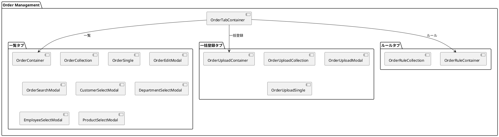
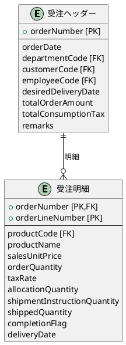
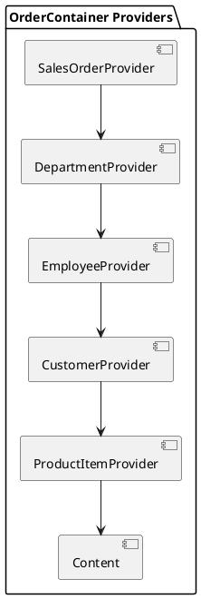
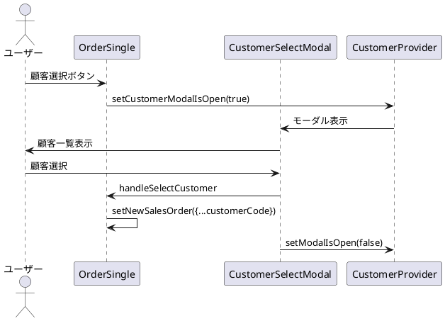

# 第11章: 受注管理

本章では、受注管理の実装について解説します。伝票ヘッダーと明細行の管理、マスタ選択モーダル、CSV一括登録、ビジネスルールチェックのパターンを説明します。

## 11.1 受注管理の構成

### タブによる画面構成

受注管理は「一覧」「一括登録」「ルール」の3つのタブで構成されます。



### OrderTabContainer

```typescript
import {useTab} from "../../application/hooks";
import {SiteLayout} from "../../../views/SiteLayout";
import {OrderContainer} from "./list/OrderContainer.tsx";
import {OrderUploadContainer} from "./upload/OrderUploadContainer.tsx";
import {OrderRuleContainer} from "./rule/OrderRuleContainer.tsx";

export const OrderTabContainer: React.FC = () => {
    const {
        Tab,
        TabList,
        TabPanel,
        Tabs,
    } = useTab();

    return (
        <SiteLayout>
            <Tabs>
                <TabList>
                    <Tab>一覧</Tab>
                    <Tab>一括登録</Tab>
                    <Tab>ルール</Tab>
                </TabList>
                <TabPanel>
                    <OrderContainer/>
                </TabPanel>
                <TabPanel>
                    <OrderUploadContainer/>
                </TabPanel>
                <TabPanel>
                    <OrderRuleContainer/>
                </TabPanel>
            </Tabs>
        </SiteLayout>
    );
}
```

## 11.2 受注の型定義

### 伝票ヘッダーと明細行

受注は「ヘッダー」と「明細行（ライン）」で構成される伝票型データです。

```typescript
// models/sales/order.ts
import { PageNationType } from "../../views/application/PageNation.tsx";
import { toISOStringLocal } from "../../components/application/utils.ts";

// 税率区分
export enum TaxRateEnumType {
    標準税率 = "標準税率",
    軽減税率 = "軽減税率",
    非課税 = "非課税"
}

export const TaxRateValues = {
    [TaxRateEnumType.標準税率]: 0.10,
    [TaxRateEnumType.軽減税率]: 0.08
};

// 完了フラグ
export enum CompletionFlagEnumType {
    未完了 = "未完了",
    完了 = "完了"
}

// 受注明細行型
export type SalesOrderLineType = {
    orderNumber: string;             // 受注番号
    orderLineNumber: number;         // 受注明細番号
    productCode: string;             // 商品コード
    productName: string;             // 商品名
    salesUnitPrice: number;          // 販売単価
    orderQuantity: number;           // 受注数量
    taxRate: TaxRateEnumType;        // 税率区分
    allocationQuantity: number;      // 引当数量
    shipmentInstructionQuantity: number; // 出荷指示数量
    shippedQuantity: number;         // 出荷済数量
    completionFlag: CompletionFlagEnumType; // 完了フラグ
    discountAmount: number;          // 値引額
    deliveryDate: string;            // 納期
    shippingDate?: string;           // 出荷日
}

// 受注ヘッダー型
export type SalesOrderType = {
    orderNumber: string;             // 受注番号
    orderDate: string;               // 受注日
    departmentCode: string;          // 部門コード
    departmentStartDate: string;     // 部門開始日
    customerCode: string;            // 顧客コード
    customerBranchNumber: number;    // 顧客枝番
    employeeCode: string;            // 担当者コード
    desiredDeliveryDate: string;     // 希望納期
    customerOrderNumber: string;     // 客先注文番号
    warehouseCode: string;           // 倉庫コード
    totalOrderAmount: number;        // 受注金額合計
    totalConsumptionTax: number;     // 消費税合計
    remarks: string;                 // 備考
    salesOrderLines: SalesOrderLineType[]; // 受注明細行
    checked?: boolean;               // 一括操作用
}
```

### 伝票構造図



### 日付変換ユーティリティ

API 送信時に日付をローカル ISO 形式に変換します。

```typescript
export const mapToSalesOrderResource = (salesOrder: SalesOrderType): SalesOrderType => {
    return {
        orderNumber: salesOrder.orderNumber,
        orderDate: toISOStringLocal(new Date(salesOrder.orderDate)),
        departmentCode: salesOrder.departmentCode,
        departmentStartDate: toISOStringLocal(new Date(salesOrder.departmentStartDate)),
        customerCode: salesOrder.customerCode,
        customerBranchNumber: salesOrder.customerBranchNumber,
        employeeCode: salesOrder.employeeCode,
        desiredDeliveryDate: toISOStringLocal(new Date(salesOrder.desiredDeliveryDate)),
        customerOrderNumber: salesOrder.customerOrderNumber,
        warehouseCode: salesOrder.warehouseCode,
        totalOrderAmount: salesOrder.totalOrderAmount,
        totalConsumptionTax: salesOrder.totalConsumptionTax,
        remarks: salesOrder.remarks,
        salesOrderLines: salesOrder.salesOrderLines
    };
};
```

## 11.3 OrderContainer

### 複数マスタとの連携

受注管理は部門・社員・顧客・商品の4つのマスタと連携します。

```typescript
import React, { useEffect } from "react";
import { showErrorMessage } from "../../../application/utils.ts";
import LoadingIndicator from "../../../../views/application/LoadingIndicatior.tsx";
import { SalesOrderProvider, useSalesOrderContext } from "../../../../providers/sales/Order.tsx";
import { OrderCollection } from "./OrderCollection.tsx";
import { DepartmentProvider, useDepartmentContext } from "../../../../providers/master/Department.tsx";
import { EmployeeProvider, useEmployeeContext } from "../../../../providers/master/Employee.tsx";
import { CustomerProvider, useCustomerContext } from "../../../../providers/master/partner/Customer.tsx";
import { ProductItemProvider, useProductItemContext } from "../../../../providers/master/product/ProductItem.tsx";

export const OrderContainer: React.FC = () => {
    const Content: React.FC = () => {
        const { loading, setError, fetchSalesOrders } = useSalesOrderContext();
        const { fetchDepartments } = useDepartmentContext();
        const { fetchEmployees } = useEmployeeContext();
        const { fetchCustomers } = useCustomerContext();
        const { fetchProducts } = useProductItemContext();

        useEffect(() => {
            (async () => {
                try {
                    // 受注データとマスタデータを並行取得
                    await Promise.all([
                        fetchSalesOrders.load(),
                        fetchDepartments.load(),
                        fetchEmployees.load(),
                        fetchCustomers.load(),
                        fetchProducts.load(),
                    ]);
                } catch (error: any) {
                    showErrorMessage(
                        `受注情報の取得に失敗しました: ${error?.message}`,
                        setError
                    );
                }
            })();
        }, []);

        return (
            <>
                {loading ? <LoadingIndicator/> : <OrderCollection/>}
            </>
        );
    };

    return (
        <SalesOrderProvider>
            <DepartmentProvider>
                <EmployeeProvider>
                    <CustomerProvider>
                        <ProductItemProvider>
                            <Content />
                        </ProductItemProvider>
                    </CustomerProvider>
                </EmployeeProvider>
            </DepartmentProvider>
        </SalesOrderProvider>
    );
};
```

### Provider のネスト構造



## 11.4 OrderSingle

### マスタ選択モーダルとの連携

受注編集画面では、各フィールドに対応するマスタ選択モーダルを開けます。

```typescript
import React from "react";
import { useSalesOrderContext } from "../../../../providers/sales/Order.tsx";
import { SalesOrderSingleView } from "../../../../views/sales/order/list/OrderSingle.tsx";
import { showErrorMessage } from "../../../application/utils.ts";
import { useDepartmentContext } from "../../../../providers/master/Department.tsx";
import { useEmployeeContext } from "../../../../providers/master/Employee.tsx";
import { useCustomerContext } from "../../../../providers/master/partner/Customer.tsx";
import { useProductItemContext } from "../../../../providers/master/product/ProductItem.tsx";

export const OrderSingle: React.FC = () => {
    const {
        message,
        setMessage,
        error,
        setError,
        setModalIsOpen,
        isEditing,
        setEditId,
        newSalesOrder,
        setNewSalesOrder,
        fetchSalesOrders,
        salesOrderService,
        setSelectedLineIndex,
    } = useSalesOrderContext();

    // 各マスタの選択モーダル制御を取得
    const { setModalIsOpen: setDepartmentModalIsOpen } = useDepartmentContext();
    const { setModalIsOpen: setEmployeeModalIsOpen } = useEmployeeContext();
    const { setModalIsOpen: setCustomerModalIsOpen } = useCustomerContext();
    const { setModalIsOpen: setProductModalIsOpen } = useProductItemContext();

    const handleCloseModal = () => {
        setModalIsOpen(false);
        setEditId(null);
    };

    const handleCreateOrUpdateSalesOrder = async () => {
        try {
            if (isEditing) {
                await salesOrderService.update(newSalesOrder);
                setMessage("受注を更新しました。");
            } else {
                await salesOrderService.create(newSalesOrder);
                setMessage("受注を作成しました。");
            }
            await fetchSalesOrders.load();
            handleCloseModal();
        } catch (error: any) {
            showErrorMessage(
                `受注の更新に失敗しました: ${error?.message}`,
                setError
            );
        }
    };

    return (
        <SalesOrderSingleView
            error={error}
            message={message}
            isEditing={isEditing}
            newSalesOrder={newSalesOrder}
            setNewSalesOrder={setNewSalesOrder}
            setSelectedLineIndex={setSelectedLineIndex}
            handleCreateOrUpdateSalesOrder={handleCreateOrUpdateSalesOrder}
            handleCloseModal={handleCloseModal}
            handleDepartmentSelect={() => setDepartmentModalIsOpen(true)}
            handleEmployeeSelect={() => setEmployeeModalIsOpen(true)}
            handleCustomerSelect={() => setCustomerModalIsOpen(true)}
            handleProductSelect={() => setProductModalIsOpen(true)}
        />
    );
};
```

### マスタ選択のフロー



## 11.5 SalesOrderProvider

### 伝票管理用の状態

```typescript
type SalesOrderContextType = {
    // 基本状態
    loading: boolean;
    setLoading: Dispatch<SetStateAction<boolean>>;
    message: string | null;
    setMessage: Dispatch<SetStateAction<string | null>>;
    error: string | null;
    setError: Dispatch<SetStateAction<string | null>>;

    // ページネーション・検索条件
    pageNation: PageNationType | null;
    setPageNation: Dispatch<SetStateAction<PageNationType | null>>;
    criteria: SalesOrderCriteriaType | null;
    setCriteria: Dispatch<SetStateAction<SalesOrderCriteriaType | null>>;

    // モーダル制御
    searchModalIsOpen: boolean;
    setSearchModalIsOpen: Dispatch<SetStateAction<boolean>>;
    modalIsOpen: boolean;
    setModalIsOpen: Dispatch<SetStateAction<boolean>>;
    uploadModalIsOpen: boolean;
    setUploadModalIsOpen: Dispatch<SetStateAction<boolean>>;
    isEditing: boolean;
    setIsEditing: Dispatch<SetStateAction<boolean>>;
    editId: string | null;
    setEditId: Dispatch<SetStateAction<string | null>>;

    // アップロード結果
    uploadResults: UploadResultType[];
    setUploadResults: Dispatch<SetStateAction<UploadResultType[]>>;
    uploadSalesOrders: (file: File) => Promise<void>;

    // データ
    initialSalesOrder: SalesOrderType;
    salesOrders: SalesOrderType[];
    setSalesOrders: Dispatch<SetStateAction<SalesOrderType[]>>;
    newSalesOrder: SalesOrderType;
    setNewSalesOrder: Dispatch<SetStateAction<SalesOrderType>>;
    searchSalesOrderCriteria: SalesOrderCriteriaType;
    setSearchSalesOrderCriteria: Dispatch<SetStateAction<SalesOrderCriteriaType>>;

    // 明細行選択
    selectedLineIndex: number | null;
    setSelectedLineIndex: Dispatch<SetStateAction<number | null>>;

    // データ取得・サービス
    fetchSalesOrders: { load: (page?: number, criteria?: SalesOrderCriteriaType) => Promise<void> };
    salesOrderService: SalesOrderServiceType;
};
```

### useSalesOrder フック

```typescript
const useSalesOrder = () => {
    const initialSalesOrder: SalesOrderType = {
        orderNumber: '',
        orderDate: '',
        departmentCode: '',
        departmentStartDate: '',
        customerCode: '',
        customerBranchNumber: 0,
        employeeCode: '',
        desiredDeliveryDate: '',
        customerOrderNumber: '',
        warehouseCode: '',
        totalOrderAmount: 0,
        totalConsumptionTax: 0,
        remarks: '',
        salesOrderLines: [],
        checked: false
    };

    const [salesOrders, setSalesOrders] = useState<SalesOrderType[]>([]);
    const [newSalesOrder, setNewSalesOrder] = useState<SalesOrderType>(initialSalesOrder);
    const [searchSalesOrderCriteria, setSearchSalesOrderCriteria] = useState<SalesOrderCriteriaType>({});
    const [selectedLineIndex, setSelectedLineIndex] = useState<number | null>(null);
    const salesOrderService = SalesOrderService();

    return {
        initialSalesOrder,
        salesOrders,
        setSalesOrders,
        newSalesOrder,
        setNewSalesOrder,
        searchSalesOrderCriteria,
        setSearchSalesOrderCriteria,
        selectedLineIndex,
        setSelectedLineIndex,
        salesOrderService
    };
};
```

## 11.6 一括登録機能

### OrderUploadContainer

```typescript
import React, { useEffect } from "react";
import { showErrorMessage } from "../../../application/utils.ts";
import LoadingIndicator from "../../../../views/application/LoadingIndicatior.tsx";
import { SalesOrderProvider, useSalesOrderContext } from "../../../../providers/sales/Order.tsx";
import { OrderUploadCollection } from "./OrderUploadCollection.tsx";

export const OrderUploadContainer: React.FC = () => {
    const Content: React.FC = () => {
        const { loading, setError, fetchSalesOrders } = useSalesOrderContext();

        useEffect(() => {
            (async () => {
                try {
                    await fetchSalesOrders.load();
                } catch (error: any) {
                    showErrorMessage(
                        `受注情報の取得に失敗しました: ${error?.message}`,
                        setError
                    );
                }
            })();
        }, []);

        return (
            <>
                {loading ? <LoadingIndicator/> : <OrderUploadCollection/>}
            </>
        );
    };

    return (
        <SalesOrderProvider>
            <Content />
        </SalesOrderProvider>
    );
};
```

### OrderUploadCollection

```typescript
import React from "react";
import { OrderUploadModal } from "./OrderUploadModal.tsx";
import { useSalesOrderContext } from "../../../../providers/sales/Order.tsx";
import { SalesOrderUploadCollectionView } from "../../../../views/sales/order/upload/OrderUploadCollection.tsx";

export const OrderUploadCollection: React.FC = () => {
    const { uploadResults, setUploadResults, setUploadModalIsOpen } = useSalesOrderContext();

    const handleOpenUploadModal = () => {
        setUploadModalIsOpen(true);
    };

    const handleDeleteUploadResult = (index: number) => {
        setUploadResults(prev => prev.filter((_, i) => i !== index));
    };

    return (
        <>
            <SalesOrderUploadCollectionView
                uploadHeaderItems={{ handleOpenUploadModal }}
                uploadResults={uploadResults}
                handleDeleteUploadResult={handleDeleteUploadResult}
            />
            <OrderUploadModal/>
        </>
    );
};
```

### OrderUploadSingle（ファイル選択・アップロード）

```typescript
import React, { useState } from "react";
import { useSalesOrderContext } from "../../../../providers/sales/Order.tsx";
import { SalesOrderUploadSingleView } from "../../../../views/sales/order/upload/OrderUploadSingle.tsx";

export const OrderUploadSingle: React.FC = () => {
    const {
        message,
        setMessage,
        error,
        setError,
        setUploadModalIsOpen,
        uploadSalesOrders,
    } = useSalesOrderContext();
    const [selectedFile, setSelectedFile] = useState<File | null>(null);

    const handleFileSelect = (event: React.ChangeEvent<HTMLInputElement>) => {
        if (event.target.files && event.target.files[0]) {
            setSelectedFile(event.target.files[0]);
        }
    };

    const handleUpload = async () => {
        setError("");
        setMessage("");
        if (!selectedFile) {
            setError("ファイルを選択してください");
            return;
        }
        try {
            await uploadSalesOrders(selectedFile);
            setUploadModalIsOpen(false);
            setSelectedFile(null);
        } catch (error) {
            const errorMessage = error instanceof Error
                ? error.message
                : "アップロード中にエラーが発生しました";
            setError(errorMessage);
            throw error;
        }
    };

    const handleCloseModal = () => {
        setError("");
        setMessage("");
        setUploadModalIsOpen(false);
        setSelectedFile(null);
    };

    return (
        <SalesOrderUploadSingleView
            error={error}
            message={message}
            onFileSelect={handleFileSelect}
            onUpload={handleUpload}
            onClose={handleCloseModal}
            isUploadDisabled={!selectedFile}
        />
    );
};
```

### アップロード処理（Provider内）

```typescript
const uploadSalesOrders = async (file: File) => {
    setLoading(true);
    try {
        const results = await salesOrderService.upload(file);
        setUploadResults(results);
        await fetchSalesOrders.load();
        const successMessage = results.length > 1
            ? `${results.length}件のアップロードが完了しました`
            : "アップロードが完了しました";
        setMessage(successMessage);
    } catch (error) {
        const errorMessage = error instanceof Error
            ? error.message
            : '不明なエラーが発生しました';
        showErrorMessage(
            `アップロードに失敗しました: ${errorMessage}`,
            setError
        );
        throw error;
    } finally {
        setLoading(false);
    }
};
```

## 11.7 ルールチェック機能

### OrderRuleContainer

```typescript
import { useEffect } from "react";
import { showErrorMessage } from "../../../application/utils";
import LoadingIndicator from "../../../../views/application/LoadingIndicatior";
import { SalesOrderProvider, useSalesOrderContext } from "../../../../providers/sales/Order.tsx";
import { OrderRuleCollection } from "./OrderRuleCollection.tsx";

export const OrderRuleContainer: React.FC = () => {
    const Content: React.FC = () => {
        const { loading, setError, fetchSalesOrders } = useSalesOrderContext();

        useEffect(() => {
            (async () => {
                try {
                    await fetchSalesOrders.load();
                } catch (error) {
                    const errorMessage = error instanceof Error
                        ? error.message
                        : '不明なエラーが発生しました';
                    showErrorMessage(
                        `受注情報の取得に失敗しました: ${errorMessage}`,
                        setError
                    );
                }
            })();
        }, []);

        return (
            <>
                {loading ? <LoadingIndicator/> : <OrderRuleCollection/>}
            </>
        );
    };

    return (
        <SalesOrderProvider>
            <Content />
        </SalesOrderProvider>
    );
};
```

### OrderRuleCollection（ルールチェック実行）

```typescript
import { useState } from "react";
import { RuleCheckResultType } from "../../../../services/sales/order.ts";
import { useSalesOrderContext } from "../../../../providers/sales/Order.tsx";
import { SalesOrderRuleCollectionView } from "../../../../views/sales/order/rule/OrderRuleCollection.tsx";

export const OrderRuleCollection: React.FC = () => {
    const [ruleResults, setRuleResults] = useState<RuleCheckResultType[]>([]);
    const { salesOrderService } = useSalesOrderContext();

    const handleExecuteRuleCheck = async () => {
        try {
            const results = await salesOrderService.check();
            setRuleResults(prevResults => [...prevResults, ...results]);
        } catch (error) {
            const errorMessage = error instanceof Error
                ? error.message
                : '不明なエラーが発生しました';
            console.error('Rule check failed:', errorMessage);
        }
    };

    const handleDeleteRuleResult = (index: number) => {
        setRuleResults(prevResults => prevResults.filter((_, i) => i !== index));
    };

    return (
        <SalesOrderRuleCollectionView
            ruleHeaderItems={{ handleExecuteRuleCheck }}
            ruleResults={ruleResults}
            handleDeleteRuleResult={handleDeleteRuleResult}
        />
    );
};
```

## 11.8 受注サービス

### API インターフェース

```typescript
// services/sales/order.ts
export interface UploadResultType {
    message: string;
    details: Array<{ [key: string]: string }>;
}

export interface RuleCheckResultType {
    message: string;
    details: Array<{ [key: string]: string }>;
}

export interface SalesOrderServiceType {
    select: (page?: number, pageSize?: number) => Promise<SalesOrderFetchType>;
    find: (orderNumber: string) => Promise<SalesOrderType>;
    create: (salesOrder: SalesOrderType) => Promise<void>;
    update: (salesOrder: SalesOrderType) => Promise<void>;
    destroy: (orderNumber: string) => Promise<void>;
    search: (criteria: SalesOrderCriteriaType, page?: number, pageSize?: number) => Promise<SalesOrderFetchType>;
    upload: (file: File) => Promise<UploadResultType[]>;
    check: () => Promise<RuleCheckResultType[]>;
}
```

### サービス実装

```typescript
export const SalesOrderService = () => {
    const config = Config();
    const apiUtils = Utils.apiUtils;
    const endPoint = `${config.apiUrl}/orders`;

    const select = async (page?: number, pageSize?: number): Promise<SalesOrderFetchType> => {
        const url = Utils.buildUrlWithPaging(endPoint, page, pageSize);
        return await apiUtils.fetchGet<SalesOrderFetchType>(url);
    };

    const find = async (orderNumber: string): Promise<SalesOrderType> => {
        const url = `${endPoint}/${orderNumber}`;
        return await apiUtils.fetchGet<SalesOrderType>(url);
    };

    const create = async (salesOrder: SalesOrderType): Promise<void> => {
        await apiUtils.fetchPost<void>(endPoint, mapToSalesOrderResource(salesOrder));
    };

    const update = async (salesOrder: SalesOrderType): Promise<void> => {
        const url = `${endPoint}/${salesOrder.orderNumber}`;
        await apiUtils.fetchPut<void>(url, mapToSalesOrderResource(salesOrder));
    };

    const destroy = async (orderNumber: string): Promise<void> => {
        const url = `${endPoint}/${orderNumber}`;
        await apiUtils.fetchDelete<void>(url);
    };

    const search = async (
        criteria: SalesOrderCriteriaType,
        page?: number,
        pageSize?: number
    ): Promise<SalesOrderFetchType> => {
        const url = Utils.buildUrlWithPaging(`${endPoint}/search`, page, pageSize);
        return await apiUtils.fetchPost<SalesOrderFetchType>(
            url,
            mapToSalesOrderCriteriaResource(criteria)
        );
    };

    // ファイルアップロード
    const upload = async (file: File): Promise<UploadResultType[]> => {
        const formData = new FormData();
        formData.append('file', file);
        const url = `${endPoint}/upload`;
        const response = await apiUtils.fetchPostFormData<UploadResultType>(url, formData);
        return Array.isArray(response) ? response : [response];
    };

    // ルールチェック
    const check = async (): Promise<RuleCheckResultType[]> => {
        const url = `${endPoint}/check`;
        const response = await apiUtils.fetchPost<RuleCheckResultType>(url, {});
        return Array.isArray(response) ? response : [response];
    };

    return {
        select, find, create, update, destroy, search, upload, check
    };
}
```

### FormData によるファイルアップロード

```typescript
const upload = async (file: File): Promise<UploadResultType[]> => {
    const formData = new FormData();
    formData.append('file', file);  // 'file' はバックエンドのパラメータ名
    const url = `${endPoint}/upload`;
    const response = await apiUtils.fetchPostFormData<UploadResultType>(url, formData);
    return Array.isArray(response) ? response : [response];
};
```

## 11.9 税率計算ユーティリティ

### 税率取得関数

```typescript
export const getTaxRate = (line: SalesOrderLineType | SalesLineType) => {
    return line.taxRate === TaxRateEnumType.標準税率
        ? TaxRateValues[TaxRateEnumType.標準税率]      // 0.10
        : line.taxRate === TaxRateEnumType.軽減税率
            ? TaxRateValues[TaxRateEnumType.軽減税率] // 0.08
            : 0;                                       // 非課税
}
```

### 金額計算の例

```typescript
// 明細行の金額計算
const calculateLineAmount = (line: SalesOrderLineType) => {
    const subtotal = line.salesUnitPrice * line.orderQuantity - line.discountAmount;
    const taxRate = getTaxRate(line);
    const tax = Math.floor(subtotal * taxRate);
    return { subtotal, tax, total: subtotal + tax };
};

// 合計金額計算
const calculateTotals = (lines: SalesOrderLineType[]) => {
    return lines.reduce((acc, line) => {
        const { subtotal, tax } = calculateLineAmount(line);
        return {
            totalAmount: acc.totalAmount + subtotal,
            totalTax: acc.totalTax + tax
        };
    }, { totalAmount: 0, totalTax: 0 });
};
```

## まとめ

本章では、受注管理の実装について解説しました。

- **伝票構造**: ヘッダーと明細行（ライン）の親子関係
- **マスタ連携**: 5つの Provider をネストした複雑な依存関係
- **マスタ選択**: 各フィールドに対応する SelectModal パターン
- **一括登録**: FormData によるファイルアップロード
- **ルールチェック**: ビジネスルール検証とエラー表示
- **税率計算**: 標準税率・軽減税率・非課税の3区分

次章では、出荷・売上管理の実装について詳しく解説します。
