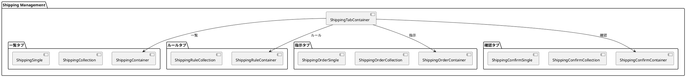
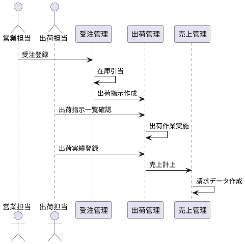
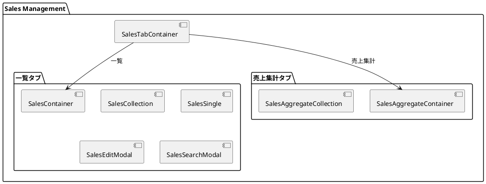
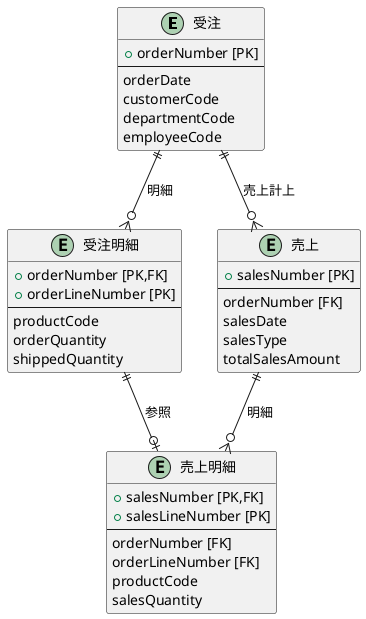

# 第12章: 出荷・売上管理

本章では、出荷管理と売上管理の実装について解説します。受注から出荷への流れ、出荷指示・出荷確認のパターン、売上計上と集計表示を説明します。

## 12.1 出荷管理の構成

### 4タブによる画面構成

出荷管理は「一覧」「ルール」「指示」「確認」の4つのタブで構成されます。



### ShippingTabContainer

```typescript
import {useTab} from "../../application/hooks";
import {SiteLayout} from "../../../views/SiteLayout";
import {ShippingContainer} from "./list/ShippingContainer";
import {ShippingRuleContainer} from "./rule/ShippingRuleContainer";
import {ShippingOrderContainer} from "./order/ShippingOrderContainer.tsx";
import {ShippingConfirmContainer} from "./confirm/ShippingConfirmContainer.tsx";

export const ShippingTabContainer: React.FC = () => {
    const {
        Tab,
        TabList,
        TabPanel,
        Tabs,
    } = useTab();

    return (
        <SiteLayout>
            <Tabs>
                <TabList>
                    <Tab>一覧</Tab>
                    <Tab>ルール</Tab>
                    <Tab>指示</Tab>
                    <Tab>確認</Tab>
                </TabList>
                <TabPanel>
                    <ShippingContainer/>
                </TabPanel>
                <TabPanel>
                    <ShippingRuleContainer/>
                </TabPanel>
                <TabPanel>
                    <ShippingOrderContainer/>
                </TabPanel>
                <TabPanel>
                    <ShippingConfirmContainer/>
                </TabPanel>
            </Tabs>
        </SiteLayout>
    );
}
```

## 12.2 出荷の型定義

### 出荷フラット構造

出荷データは受注ヘッダー・明細の情報を1つのレコードにフラット化した構造です。

```typescript
// models/sales/shipping.ts
import { PageNationType } from "../../views/application/PageNation";

export interface ShippingType {
    // 受注ヘッダー情報
    orderNumber: string;           // 受注番号
    orderDate: string;             // 受注日
    departmentCode: string;        // 部門コード
    departmentStartDate: string;   // 部門開始日
    customerCode: string;          // 顧客コード
    customerBranchNumber: number;  // 顧客枝番
    employeeCode: string;          // 担当者コード
    desiredDeliveryDate: string;   // 希望納期
    customerOrderNumber: string;   // 客先注文番号
    warehouseCode: string;         // 倉庫コード
    totalOrderAmount: number;      // 受注金額合計
    totalConsumptionTax: number;   // 消費税合計
    remarks: string;               // 備考

    // 受注明細情報
    orderLineNumber: number;       // 受注明細番号
    productCode: string;           // 商品コード
    productName: string;           // 商品名
    salesUnitPrice: number;        // 販売単価
    orderQuantity: number;         // 受注数量
    taxRate: number;               // 税率
    allocationQuantity: number;    // 引当数量
    shipmentInstructionQuantity: number; // 出荷指示数量
    shippedQuantity: number;       // 出荷済数量
    completionFlag: boolean;       // 完了フラグ
    discountAmount: number;        // 値引額
    deliveryDate: string;          // 納期
    shippingDate?: string;         // 出荷日

    // 計算項目
    salesAmount: number;           // 売上金額
    consumptionTaxAmount: number;  // 消費税額

    checked?: boolean;             // 一括操作用
}
```

### 出荷業務フロー



### 初期値定義

```typescript
export const initialShipping: ShippingType = {
    orderNumber: "",
    orderDate: "",
    departmentCode: "",
    departmentStartDate: "",
    customerCode: "",
    customerBranchNumber: 0,
    employeeCode: "",
    desiredDeliveryDate: "",
    customerOrderNumber: "",
    warehouseCode: "",
    totalOrderAmount: 0,
    totalConsumptionTax: 0,
    remarks: "",
    orderLineNumber: 0,
    productCode: "",
    productName: "",
    salesUnitPrice: 0,
    orderQuantity: 0,
    taxRate: 0,
    allocationQuantity: 0,
    shipmentInstructionQuantity: 0,
    shippedQuantity: 0,
    completionFlag: false,
    discountAmount: 0,
    deliveryDate: "",
    salesAmount: 0,
    consumptionTaxAmount: 0,
    checked: false
};

export const initialShippingCriteria: ShippingCriteriaType = {
    orderNumber: "",
    orderDate: "",
    departmentCode: "",
    customerCode: "",
    productCode: "",
    productName: "",
    completionFlag: undefined
};
```

## 12.3 ShippingContainer

### 出荷一覧の Provider 構成

```typescript
import React, { useEffect } from "react";
import { showErrorMessage } from "../../../application/utils.ts";
import LoadingIndicator from "../../../../views/application/LoadingIndicatior.tsx";
import { ShippingProvider, useShippingContext } from "../../../../providers/sales/Shipping.tsx";
import { ShippingCollection } from "./ShippingCollection.tsx";
import { DepartmentProvider, useDepartmentContext } from "../../../../providers/master/Department.tsx";
import { EmployeeProvider, useEmployeeContext } from "../../../../providers/master/Employee.tsx";
import { CustomerProvider, useCustomerContext } from "../../../../providers/master/partner/Customer.tsx";
import { ProductItemProvider, useProductItemContext } from "../../../../providers/master/product/ProductItem.tsx";

export const ShippingContainer: React.FC = () => {
    const Content: React.FC = () => {
        const { loading, setError, fetchShippings } = useShippingContext();
        const { fetchDepartments } = useDepartmentContext();
        const { fetchEmployees } = useEmployeeContext();
        const { fetchCustomers } = useCustomerContext();
        const { fetchProducts } = useProductItemContext();

        useEffect(() => {
            (async () => {
                try {
                    await Promise.all([
                        fetchShippings.load(),
                        fetchDepartments.load(),
                        fetchEmployees.load(),
                        fetchCustomers.load(),
                        fetchProducts.load(),
                    ]);
                } catch (error: unknown) {
                    const errorMessage = error instanceof Error
                        ? error.message
                        : '不明なエラーが発生しました';
                    showErrorMessage(
                        `出荷情報の取得に失敗しました: ${errorMessage}`,
                        setError
                    );
                }
            })();
        }, []);

        return (
            <>
                {loading ? <LoadingIndicator/> : <ShippingCollection/>}
            </>
        );
    };

    return (
        <ShippingProvider>
            <DepartmentProvider>
                <EmployeeProvider>
                    <CustomerProvider>
                        <ProductItemProvider>
                            <Content />
                        </ProductItemProvider>
                    </CustomerProvider>
                </EmployeeProvider>
            </DepartmentProvider>
        </ShippingProvider>
    );
};
```

## 12.4 出荷指示（ShippingOrder）

### ShippingOrderContainer

出荷指示では、検索条件を指定してデータを取得します。

```typescript
import React, { useEffect } from "react";
import { showErrorMessage } from "../../../application/utils.ts";
import LoadingIndicator from "../../../../views/application/LoadingIndicatior.tsx";
import { ShippingProvider, useShippingContext } from "../../../../providers/sales/Shipping.tsx";
import { DepartmentProvider, useDepartmentContext } from "../../../../providers/master/Department.tsx";
import { EmployeeProvider, useEmployeeContext } from "../../../../providers/master/Employee.tsx";
import { CustomerProvider, useCustomerContext } from "../../../../providers/master/partner/Customer.tsx";
import { ProductItemProvider, useProductItemContext } from "../../../../providers/master/product/ProductItem.tsx";
import { ShippingOrderCollection } from "./ShippingOrderCollection.tsx";

export const ShippingOrderContainer: React.FC = () => {
    const Content: React.FC = () => {
        const {
            loading,
            setError,
            fetchShippings,
            searchShippingCriteria  // 検索条件を使用
        } = useShippingContext();

        const { fetchDepartments } = useDepartmentContext();
        const { fetchEmployees } = useEmployeeContext();
        const { fetchCustomers } = useCustomerContext();
        const { fetchProducts } = useProductItemContext();

        useEffect(() => {
            (async () => {
                try {
                    await Promise.all([
                        // 検索条件付きでデータ取得
                        fetchShippings.load(1, searchShippingCriteria),
                        fetchDepartments.load(),
                        fetchEmployees.load(),
                        fetchCustomers.load(),
                        fetchProducts.load(),
                    ]);
                } catch (error: unknown) {
                    const errorMessage = error instanceof Error
                        ? error.message
                        : '不明なエラーが発生しました';
                    showErrorMessage(
                        `出荷情報の取得に失敗しました: ${errorMessage}`,
                        setError
                    );
                }
            })();
        }, []);

        return (
            <>
                {loading ? <LoadingIndicator/> : <ShippingOrderCollection/>}
            </>
        );
    };

    return (
        <ShippingProvider>
            <DepartmentProvider>
                <EmployeeProvider>
                    <CustomerProvider>
                        <ProductItemProvider>
                            <Content />
                        </ProductItemProvider>
                    </CustomerProvider>
                </EmployeeProvider>
            </DepartmentProvider>
        </ShippingProvider>
    );
};
```

## 12.5 ShippingProvider

### 出荷専用のモーダル状態

```typescript
type ShippingContextType = {
    // 基本状態
    loading: boolean;
    setLoading: Dispatch<SetStateAction<boolean>>;
    message: string | null;
    setMessage: Dispatch<SetStateAction<string | null>>;
    error: string | null;
    setError: Dispatch<SetStateAction<string | null>>;

    // ページネーション・検索条件
    pageNation: PageNationType | null;
    setPageNation: Dispatch<SetStateAction<PageNationType | null>>;
    criteria: ShippingCriteriaType | null;
    setCriteria: Dispatch<SetStateAction<ShippingCriteriaType | null>>;

    // 標準モーダル制御
    searchModalIsOpen: boolean;
    setSearchModalIsOpen: Dispatch<SetStateAction<boolean>>;
    modalIsOpen: boolean;
    setModalIsOpen: Dispatch<SetStateAction<boolean>>;
    isEditing: boolean;
    setIsEditing: Dispatch<SetStateAction<boolean>>;
    editId: string | null;
    setEditId: Dispatch<SetStateAction<string | null>>;

    // 出荷専用モーダル
    ruleCheckModalIsOpen: boolean;
    setRuleCheckModalIsOpen: Dispatch<SetStateAction<boolean>>;
    orderShippingModalIsOpen: boolean;
    setOrderShippingModalIsOpen: Dispatch<SetStateAction<boolean>>;

    // データ
    initialShipping: ShippingType;
    shippings: ShippingType[];
    setShippings: Dispatch<SetStateAction<ShippingType[]>>;
    newShipping: ShippingType;
    setNewShipping: Dispatch<SetStateAction<ShippingType>>;
    searchShippingCriteria: ShippingCriteriaType;
    setSearchShippingCriteria: Dispatch<SetStateAction<ShippingCriteriaType>>;

    // データ取得・サービス
    fetchShippings: { load: (page?: number, criteria?: ShippingCriteriaType) => Promise<void> };
    shippingService: ShippingServiceType;
};
```

### useShipping フック

```typescript
const useShipping = () => {
    const [shippings, setShippings] = useState<ShippingType[]>([]);
    const [newShipping, setNewShipping] = useState<ShippingType>(initialShipping);
    const [searchShippingCriteria, setSearchShippingCriteria] =
        useState<ShippingCriteriaType>(initialShippingCriteria);
    const shippingService = ShippingService();

    return {
        shippings,
        setShippings,
        newShipping,
        setNewShipping,
        searchShippingCriteria,
        setSearchShippingCriteria,
        shippingService
    };
};
```

### Provider 実装

```typescript
export const ShippingProvider: React.FC<Props> = ({ children }) => {
    const [loading, setLoading] = useState<boolean>(false);
    const { message, setMessage, error, setError } = useMessage();
    const { pageNation, setPageNation, criteria, setCriteria } =
        usePageNation<ShippingCriteriaType | null>();
    const { modalIsOpen: searchModalIsOpen, setModalIsOpen: setSearchModalIsOpen } = useModal();
    const { modalIsOpen, setModalIsOpen, isEditing, setIsEditing, editId, setEditId } = useModal();

    // 出荷専用モーダル
    const { modalIsOpen: ruleCheckModalIsOpen, setModalIsOpen: setRuleCheckModalIsOpen } = useModal();
    const { modalIsOpen: orderShippingModalIsOpen, setModalIsOpen: setOrderShippingModalIsOpen } = useModal();

    const {
        shippings,
        setShippings,
        newShipping,
        setNewShipping,
        searchShippingCriteria,
        setSearchShippingCriteria,
        shippingService
    } = useShipping();

    const fetchShippings = useFetchShippings(
        setLoading,
        setShippings,
        setPageNation,
        setError,
        showErrorMessage,
        shippingService
    );

    const value = useMemo(() => ({
        loading, setLoading,
        message, setMessage,
        error, setError,
        pageNation, setPageNation,
        criteria: criteria ?? {},
        setCriteria,
        searchModalIsOpen, setSearchModalIsOpen,
        modalIsOpen, setModalIsOpen,
        isEditing, setIsEditing,
        editId, setEditId,
        initialShipping,
        shippings, setShippings,
        newShipping, setNewShipping,
        searchShippingCriteria, setSearchShippingCriteria,
        fetchShippings,
        shippingService,
        ruleCheckModalIsOpen, setRuleCheckModalIsOpen,
        orderShippingModalIsOpen, setOrderShippingModalIsOpen
    }), [/* 依存配列 */]);

    return (
        <ShippingContext.Provider value={value}>
            {children}
        </ShippingContext.Provider>
    );
};
```

## 12.6 売上管理の構成

### 2タブによる画面構成

売上管理は「一覧」「売上集計」の2つのタブで構成されます。



### SalesTabContainer

```typescript
import {useTab} from "../../application/hooks";
import {SiteLayout} from "../../../views/SiteLayout";
import {SalesContainer} from "./list/SalesContainer";
import {SalesAggregateContainer} from "./aggregate/SalesAggregateContainer.tsx";

export const SalesTabContainer: React.FC = () => {
    const {
        Tab,
        TabList,
        TabPanel,
        Tabs,
    } = useTab();

    return (
        <SiteLayout>
            <Tabs>
                <TabList>
                    <Tab>一覧</Tab>
                    <Tab>売上集計</Tab>
                </TabList>
                <TabPanel>
                    <SalesContainer/>
                </TabPanel>
                <TabPanel>
                    <SalesAggregateContainer/>
                </TabPanel>
            </Tabs>
        </SiteLayout>
    );
}
```

## 12.7 売上の型定義

### 売上ヘッダーと明細

```typescript
// models/sales/sales.ts
import { PageNationType } from "../../views/application/PageNation";
import { TaxRateEnumType } from "./order.ts";
import { toISOStringLocal } from "../../components/application/utils.ts";

// 売上種別
export enum SalesTypeEnumType {
    現金 = "現金",
    掛 = "掛",
    その他 = "その他"
}

export const SalesTypeValues = {
    [SalesTypeEnumType.現金]: 0,
    [SalesTypeEnumType.掛]: 1,
    [SalesTypeEnumType.その他]: 2
};

// 売上明細型
export interface SalesLineType {
    salesNumber: string;           // 売上番号
    salesLineNumber: number;       // 売上明細番号
    orderNumber: string;           // 受注番号
    orderLineNumber: number;       // 受注明細番号
    productCode: string;           // 商品コード
    productName: string;           // 商品名
    salesUnitPrice: number;        // 販売単価
    salesQuantity: number;         // 売上数量
    shippedQuantity: number;       // 出荷済数量
    discountAmount: number;        // 値引額
    billingDate: string;           // 請求日
    billingNumber: string;         // 請求番号
    billingDelayCategory: number;  // 請求遅延区分
    autoJournalDate: string;       // 自動仕訳日
    taxRate: TaxRateEnumType;      // 税率区分
    checked?: boolean;
}

// 売上ヘッダー型
export interface SalesType {
    salesNumber: string;           // 売上番号
    orderNumber: string;           // 受注番号
    salesDate: string;             // 売上日
    salesType: SalesTypeEnumType;  // 売上種別
    departmentCode: string;        // 部門コード
    departmentStartDate: string;   // 部門開始日
    partnerCode: string;           // 取引先コード
    customerCode: string;          // 顧客コード
    customerBranchNumber: number;  // 顧客枝番
    employeeCode: string;          // 担当者コード
    totalSalesAmount: number;      // 売上金額合計
    totalConsumptionTax: number;   // 消費税合計
    remarks: string;               // 備考
    voucherNumber: number;         // 伝票番号
    originalVoucherNumber: string; // 元伝票番号
    salesLines: SalesLineType[];   // 売上明細
    checked?: boolean;
}
```

### 売上と受注の関連



### 売上データ変換

```typescript
export const mapToSalesResource = (sales: SalesType) => {
    return {
        salesNumber: sales.salesNumber,
        orderNumber: sales.orderNumber,
        salesDate: toISOStringLocal(new Date(sales.salesDate)),
        salesType: sales.salesType ? SalesTypeValues[sales.salesType] : null,
        departmentCode: sales.departmentCode,
        departmentStartDate: toISOStringLocal(new Date(sales.departmentStartDate)),
        partnerCode: sales.partnerCode,
        customerCode: sales.customerCode,
        customerBranchNumber: sales.customerBranchNumber,
        employeeCode: sales.employeeCode,
        totalSalesAmount: sales.totalSalesAmount,
        totalConsumptionTax: sales.totalConsumptionTax,
        remarks: sales.remarks,
        voucherNumber: sales.voucherNumber,
        originalVoucherNumber: sales.originalVoucherNumber,
        salesLines: sales.salesLines.map(line => ({
            salesNumber: line.salesNumber,
            salesLineNumber: line.salesLineNumber,
            orderNumber: line.orderNumber,
            orderLineNumber: line.orderLineNumber,
            productCode: line.productCode,
            productName: line.productName,
            salesUnitPrice: line.salesUnitPrice,
            salesQuantity: line.salesQuantity,
            shippedQuantity: line.shippedQuantity,
            discountAmount: line.discountAmount,
            billingDate: line.billingDate
                ? toISOStringLocal(new Date(line.billingDate))
                : null,
            billingNumber: line.billingNumber,
            billingDelayCategory: line.billingDelayCategory,
            autoJournalDate: line.autoJournalDate
                ? toISOStringLocal(new Date(line.autoJournalDate))
                : null,
            taxRate: line.taxRate,
        }))
    };
};
```

## 12.8 売上集計

### SalesAggregateContainer

```typescript
import { useEffect } from "react";
import { showErrorMessage } from "../../../application/utils";
import LoadingIndicator from "../../../../views/application/LoadingIndicatior";
import { SalesProvider, useSalesContext } from "../../../../providers/sales/Sales";
import { SalesAggregateCollection } from "./SalesAggregateCollection";

export const SalesAggregateContainer: React.FC = () => {
    const Content: React.FC = () => {
        const {
            loading,
            setError,
            fetchSales,
        } = useSalesContext();

        useEffect(() => {
            (async () => {
                try {
                    await fetchSales.load();
                } catch (error) {
                    const errorMessage = error instanceof Error
                        ? error.message
                        : '不明なエラーが発生しました';
                    showErrorMessage(
                        `売上情報の取得に失敗しました: ${errorMessage}`,
                        setError
                    );
                }
            })();
        }, []);

        return (
            <>
                {loading ? <LoadingIndicator/> : <SalesAggregateCollection/>}
            </>
        );
    };

    return (
        <SalesProvider>
            <Content />
        </SalesProvider>
    );
};
```

### 集計表示パターン

```typescript
// 売上集計の例
const calculateSalesAggregate = (sales: SalesType[]) => {
    // 部門別集計
    const byDepartment = sales.reduce((acc, s) => {
        const key = s.departmentCode;
        if (!acc[key]) {
            acc[key] = { totalAmount: 0, totalTax: 0, count: 0 };
        }
        acc[key].totalAmount += s.totalSalesAmount;
        acc[key].totalTax += s.totalConsumptionTax;
        acc[key].count += 1;
        return acc;
    }, {} as Record<string, { totalAmount: number; totalTax: number; count: number }>);

    // 顧客別集計
    const byCustomer = sales.reduce((acc, s) => {
        const key = `${s.customerCode}-${s.customerBranchNumber}`;
        if (!acc[key]) {
            acc[key] = { totalAmount: 0, totalTax: 0, count: 0 };
        }
        acc[key].totalAmount += s.totalSalesAmount;
        acc[key].totalTax += s.totalConsumptionTax;
        acc[key].count += 1;
        return acc;
    }, {} as Record<string, { totalAmount: number; totalTax: number; count: number }>);

    return { byDepartment, byCustomer };
};
```

## 12.9 初期値とページネーション

### 売上の初期値

```typescript
export const initialSales: SalesType = {
    salesNumber: "",
    orderNumber: "",
    salesDate: new Date().toISOString().split('T')[0],  // 当日
    salesType: SalesTypeEnumType.現金,
    departmentCode: "",
    departmentStartDate: "",
    partnerCode: "",
    customerCode: "",
    customerBranchNumber: 0,
    employeeCode: "",
    totalSalesAmount: 0,
    totalConsumptionTax: 0,
    remarks: "",
    voucherNumber: 0,
    originalVoucherNumber: "",
    salesLines: [],
    checked: false
};

export const initialSalesLine: SalesLineType = {
    salesNumber: "",
    salesLineNumber: 0,
    orderNumber: "",
    orderLineNumber: 0,
    productCode: "",
    productName: "",
    salesUnitPrice: 0,
    salesQuantity: 0,
    shippedQuantity: 0,
    discountAmount: 0,
    billingDate: "",
    billingNumber: "",
    billingDelayCategory: 0,
    autoJournalDate: "",
    taxRate: TaxRateEnumType.標準税率,
    checked: false
};
```

### ページネーション初期値

```typescript
export const initialSalesPageNation: PageNationType = {
    pageNum: 1,
    pageSize: 10,
    size: 0,
    startRow: 0,
    endRow: 0,
    total: 0,
    pages: 0,
    list: [],
    prePage: 0,
    nextPage: 0,
    isFirstPage: true,
    isLastPage: true,
    hasPreviousPage: false,
    hasNextPage: false,
    navigatePages: 8,
    navigatepageNums: [1],
    navigateFirstPage: 1,
    navigateLastPage: 1
};
```

## まとめ

本章では、出荷・売上管理の実装について解説しました。

- **出荷4タブ構成**: 一覧・ルール・指示・確認の業務フロー
- **フラット構造**: 受注ヘッダー・明細を1レコードに展開
- **出荷指示**: 検索条件付きデータ取得パターン
- **売上2タブ構成**: 一覧・集計の表示
- **売上種別**: 現金・掛・その他の区分管理
- **集計機能**: 部門別・顧客別の売上集計

次章では、請求・回収管理の実装について詳しく解説します。
