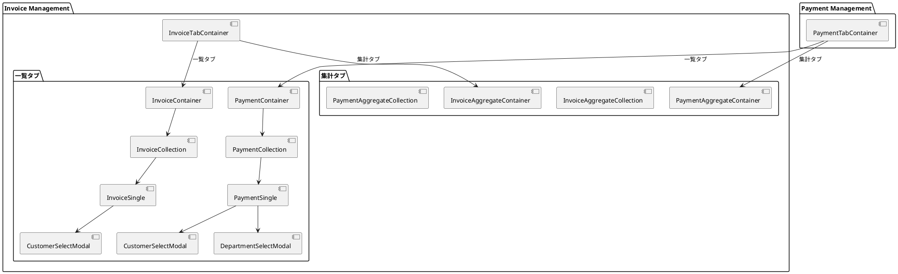
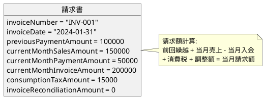
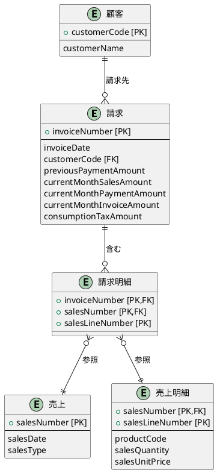
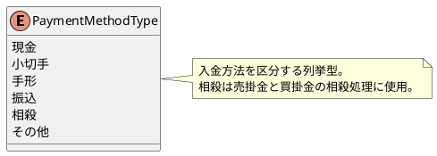
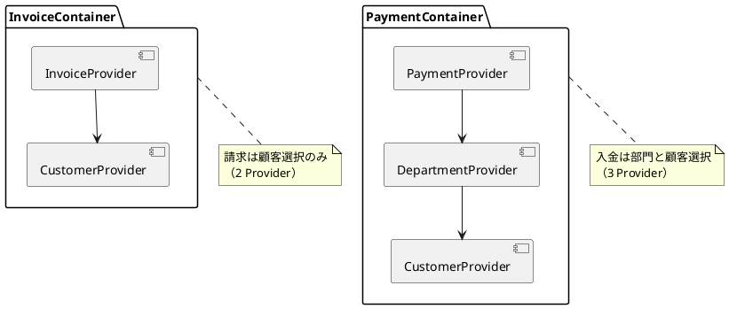
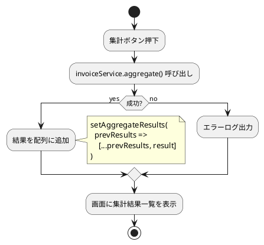
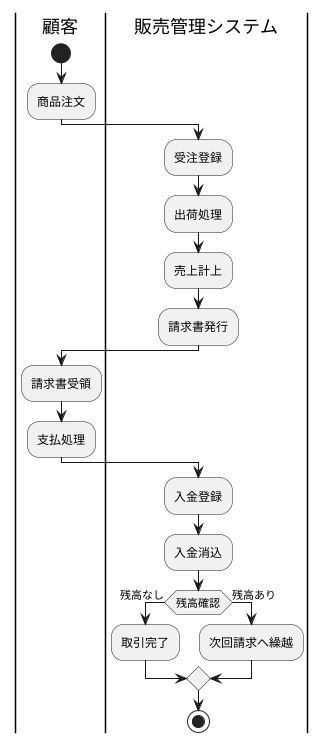
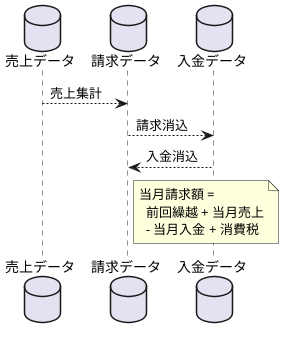

# 第13章: 請求・回収管理

本章では、請求管理と入金管理の実装について解説します。請求・入金データの型定義、ヘッダー・明細構造の管理、集計機能の実装パターンを説明します。

## 13.1 請求・入金管理の構成

### コンポーネント構成

請求管理と入金管理は同様の構成で、それぞれ2つのタブで構成されます。



## 13.2 請求管理

### 請求の型定義

```typescript
// models/sales/invoice.ts
import {PageNationType} from "../../views/application/PageNation";
import {toISOStringLocal} from "../../components/application/utils.ts";

// 請求明細情報
export interface InvoiceLineType {
    invoiceNumber: string;
    salesNumber: string;
    salesLineNumber: number;
    checked?: boolean;
}

// 請求情報
export interface InvoiceType {
    invoiceNumber: string;
    invoiceDate: string;
    partnerCode: string;
    customerCode: string;
    customerBranchNumber: number;
    previousPaymentAmount: number;        // 前回入金額
    currentMonthSalesAmount: number;      // 当月売上額
    currentMonthPaymentAmount: number;    // 当月入金額
    currentMonthInvoiceAmount: number;    // 当月請求額
    consumptionTaxAmount: number;         // 消費税額
    invoiceReconciliationAmount: number;  // 請求調整額
    invoiceLines: InvoiceLineType[];      // 請求明細
    checked?: boolean;
}
```

### 請求金額の構成

請求書は複数の金額項目で構成されます。



### InvoiceTabContainer

請求管理のルートコンテナです。

```typescript
// components/sales/invoice/InvoiceTabContainer.tsx
import {useTab} from "../../application/hooks";
import {SiteLayout} from "../../../views/SiteLayout";
import {InvoiceContainer} from "./list/InvoiceContainer.tsx";
import {InvoiceAggregateContainer} from "./aggregate/InvoiceAggregateContainer.tsx";

export const InvoiceTabContainer: React.FC = () => {
    const {
        Tab,
        TabList,
        TabPanel,
        Tabs,
    } = useTab();

    return (
        <SiteLayout>
            <Tabs>
                <TabList>
                    <Tab>一覧</Tab>
                    <Tab>集計</Tab>
                </TabList>
                <TabPanel>
                    <InvoiceContainer/>
                </TabPanel>
                <TabPanel>
                    <InvoiceAggregateContainer/>
                </TabPanel>
            </Tabs>
        </SiteLayout>
    );
}
```

### InvoiceContainer

請求一覧の Provider 構成です。

```typescript
// components/sales/invoice/list/InvoiceContainer.tsx
import React, { useEffect } from "react";
import { showErrorMessage } from "../../../application/utils.ts";
import LoadingIndicator from "../../../../views/application/LoadingIndicatior.tsx";
import { InvoiceProvider, useInvoiceContext } from "../../../../providers/sales/Invoice.tsx";
import { InvoiceCollection } from "./InvoiceCollection.tsx";
import { CustomerProvider, useCustomerContext } from "../../../../providers/master/partner/Customer.tsx";

export const InvoiceContainer: React.FC = () => {
    const Content: React.FC = () => {
        const {
            loading,
            setError,
            fetchInvoices,
        } = useInvoiceContext();

        const {
            fetchCustomers,
        } = useCustomerContext();

        useEffect(() => {
            (async () => {
                try {
                    await Promise.all([
                        await fetchInvoices.load(),
                        fetchCustomers.load(),
                    ]);
                } catch (error: unknown) {
                    const errorMessage = error instanceof Error
                        ? error.message
                        : '不明なエラーが発生しました';
                    showErrorMessage(
                        `請求情報の取得に失敗しました: ${errorMessage}`,
                        setError
                    );
                }
            })();
        }, []);

        return (
            <>
                {loading ? (
                    <LoadingIndicator/>
                ) : (
                    <InvoiceCollection/>
                )}
            </>
        );
    };

    return (
        <InvoiceProvider>
            <CustomerProvider>
                <Content />
            </CustomerProvider>
        </InvoiceProvider>
    );
};
```

### InvoiceSingle

請求編集画面のコンポーネントです。

```typescript
// components/sales/invoice/list/InvoiceSingle.tsx
export const InvoiceSingle: React.FC = () => {
    const {
        message,
        setMessage,
        error,
        setError,
        setModalIsOpen,
        isEditing,
        setEditId,
        newInvoice,
        setNewInvoice,
        fetchInvoices,
        invoiceService,
        setSelectedLineIndex,
        selectedLineIndex
    } = useInvoiceContext();

    const {
        setModalIsOpen: setCustomerModalIsOpen,
    } = useCustomerContext();

    const handleCloseModal = () => {
        setModalIsOpen(false);
        setEditId(null);
    };

    const handleCreateOrUpdateInvoice = async () => {
        const validate = () => {
            if (!newInvoice.invoiceNumber) {
                setError("請求番号を入力してください。");
                return false;
            }
            if (!newInvoice.customerCode) {
                setError("顧客を選択してください。");
                return false;
            }
            if (!newInvoice.invoiceLines.map(line => line.salesNumber)
                    .every(code => code)) {
                setError("売上番号を入力してください。");
                return false;
            }
            return true;
        }

        if (!validate()) {
            return;
        }

        try {
            if (isEditing) {
                await invoiceService.update(newInvoice);
                setMessage("請求を更新しました。");
            } else {
                await invoiceService.create(newInvoice);
                setMessage("請求を作成しました。");
            }
            await fetchInvoices.load();
            handleCloseModal();
        } catch (error: unknown) {
            const errorMessage = error instanceof Error
                ? error.message
                : '不明なエラーが発生しました';
            showErrorMessage(
                `請求の${isEditing ? '更新' : '登録'}に失敗しました: ${errorMessage}`,
                setError
            );
        }
    };

    return (
        <InvoiceSingleView
            error={error}
            message={message}
            isEditing={isEditing}
            newInvoice={newInvoice}
            setNewInvoice={setNewInvoice}
            setSelectedLineIndex={setSelectedLineIndex}
            handleCreateOrUpdateInvoice={handleCreateOrUpdateInvoice}
            handleCloseModal={handleCloseModal}
            handleCustomerSelect={() => setCustomerModalIsOpen(true)}
            selectedLineIndex={selectedLineIndex}
        />
    );
};
```

### 請求と売上の関連

請求明細は売上データを参照します。



## 13.3 入金管理

### 入金の型定義

```typescript
// models/sales/payment.ts
import { PageNationType } from "../../views/application/PageNation";
import {toISOStringLocal} from "../../components/application/utils.ts";

// 支払方法区分
export enum PaymentMethodType {
    現金 = "現金",
    小切手 = "小切手",
    手形 = "手形",
    振込 = "振込",
    相殺 = "相殺",
    その他 = "その他"
}

// 入金情報
export interface PaymentType {
    paymentNumber: string;
    paymentDate: string;
    departmentCode: string;
    departmentStartDate: string;
    customerCode: string;
    customerBranchNumber: number;
    paymentMethodType: string;     // 支払方法
    paymentAccountCode: string;    // 入金勘定コード
    paymentAmount: number;         // 入金額
    offsetAmount: number;          // 相殺額
    customerName?: string;
    paymentAccountName?: string;
    checked?: boolean;
}
```

### 支払方法の種類



### PaymentTabContainer

入金管理のルートコンテナです。

```typescript
// components/sales/payment/PaymentTabContainer.tsx
import {useTab} from "../../application/hooks";
import {SiteLayout} from "../../../views/SiteLayout";
import {PaymentContainer} from "./list/PaymentContainer.tsx";
import {PaymentAggregateContainer} from "./aggregate/PaymentAggregateContainer.tsx";

export const PaymentTabContainer: React.FC = () => {
    const {
        Tab,
        TabList,
        TabPanel,
        Tabs,
    } = useTab();

    return (
        <SiteLayout>
            <Tabs>
                <TabList>
                    <Tab>一覧</Tab>
                    <Tab>集計</Tab>
                </TabList>
                <TabPanel>
                    <PaymentContainer/>
                </TabPanel>
                <TabPanel>
                    <PaymentAggregateContainer/>
                </TabPanel>
            </Tabs>
        </SiteLayout>
    );
}
```

### PaymentContainer

入金一覧は3つの Provider をネストします。

```typescript
// components/sales/payment/list/PaymentContainer.tsx
export const PaymentContainer: React.FC = () => {
    const Content: React.FC = () => {
        const {
            loading,
            setError,
            fetchPayments,
        } = usePaymentContext();

        const {
            fetchDepartments,
        } = useDepartmentContext();

        const {
            fetchCustomers,
        } = useCustomerContext();

        useEffect(() => {
            (async () => {
                try {
                    await Promise.all([
                        await fetchPayments.load(),
                        fetchDepartments.load(),
                        fetchCustomers.load(),
                    ]);
                } catch (error: unknown) {
                    const errorMessage = error instanceof Error
                        ? error.message
                        : '不明なエラーが発生しました';
                    showErrorMessage(
                        `入金情報の取得に失敗しました: ${errorMessage}`,
                        setError
                    );
                }
            })();
        }, []);

        return (
            <>
                {loading ? (
                    <LoadingIndicator/>
                ) : (
                    <PaymentCollection/>
                )}
            </>
        );
    };

    return (
        <PaymentProvider>
            <DepartmentProvider>
                <CustomerProvider>
                    <Content />
                </CustomerProvider>
            </DepartmentProvider>
        </PaymentProvider>
    );
};
```

### Provider 構成の比較

請求と入金で Provider の構成が異なります。



### PaymentSingle

入金編集画面のコンポーネントです。

```typescript
// components/sales/payment/list/PaymentSingle.tsx
export const PaymentSingle: React.FC = () => {
    const {
        message,
        setMessage,
        error,
        setError,
        setModalIsOpen,
        isEditing,
        setEditId,
        newPayment,
        setNewPayment,
        fetchPayments,
        paymentService,
    } = usePaymentContext();

    const {
        setModalIsOpen: setDepartmentModalIsOpen,
    } = useDepartmentContext();

    const {
        setModalIsOpen: setCustomerModalIsOpen,
    } = useCustomerContext();

    const handleCloseModal = () => {
        setModalIsOpen(false);
        setEditId(null);
    };

    const handleCreateOrUpdatePayment = async () => {
        const validate = () => {
            if (!newPayment.paymentNumber) {
                setError("入金番号を入力してください")
                return false;
            }
            if (!newPayment.departmentCode) {
                setError("部門コードを入力してください")
                return false;
            }
            if (!newPayment.customerCode) {
                setError("顧客コードを入力してください")
                return false;
            }
            if(!newPayment.paymentMethodType) {
                setError("支払方法区分を選択してください")
                return false;
            }
            return true;
        }

        if (!validate()) {
            return;
        }

        try {
            if (isEditing) {
                await paymentService.update(newPayment);
                setMessage("入金を更新しました。");
            } else {
                await paymentService.create(newPayment);
                setMessage("入金を作成しました。");
            }
            await fetchPayments.load();
            handleCloseModal();
        } catch (error: any) {
            showErrorMessage(
                `入金の更新に失敗しました: ${error?.message}`,
                setError
            );
        }
    };

    return (
        <PaymentSingleView
            error={error}
            message={message}
            isEditing={isEditing}
            newPayment={newPayment}
            setNewPayment={setNewPayment}
            handleCreateOrUpdatePayment={handleCreateOrUpdatePayment}
            handleCloseModal={handleCloseModal}
            handleDepartmentSelect={() => setDepartmentModalIsOpen(true)}
            handleCustomerSelect={() => setCustomerModalIsOpen(true)}
        />
    );
};
```

## 13.4 集計機能

### 集計レスポンスの型定義

請求と入金の集計結果は同じ構造です。

```typescript
// services/sales/invoice.ts
export interface InvoiceAggregateResponse {
    message: string;
    details: string[];
}

// services/sales/payment.ts
export interface PaymentAggregateResponse {
    message: string;
    details: string[];
}
```

### InvoiceAggregateCollection

請求集計コンポーネントです。

```typescript
// components/sales/invoice/aggregate/InvoiceAggregateCollection.tsx
import {useState} from "react";
import {InvoiceAggregateResponse} from "../../../../services/sales/invoice";
import {useInvoiceContext} from "../../../../providers/sales/Invoice";
import {InvoiceAggregateCollectionView} from "../../../../views/sales/invoice/aggregate/InvoiceAggregateCollection";

export const InvoiceAggregateCollection: React.FC = () => {
    const [aggregateResults, setAggregateResults] =
        useState<InvoiceAggregateResponse[]>([]);
    const {invoiceService} = useInvoiceContext();

    const handleExecuteAggregate = async () => {
        try {
            const result = await invoiceService.aggregate();
            setAggregateResults(prevResults => [...prevResults, result]);
        } catch (error) {
            const errorMessage = error instanceof Error
                ? error.message
                : '不明なエラーが発生しました';
            console.error('Aggregate failed:', errorMessage);
        }
    };

    const handleDeleteAggregateResult = (index: number) => {
        setAggregateResults(prevResults =>
            prevResults.filter((_, i) => i !== index)
        );
    };

    return (
        <InvoiceAggregateCollectionView
            aggregateHeaderItems={{handleExecuteAggregate}}
            aggregateResults={aggregateResults}
            handleDeleteAggregateResult={handleDeleteAggregateResult}
        />
    );
};
```

### 集計結果の蓄積パターン

集計実行ごとに結果を配列に追加し、履歴として表示します。



### PaymentAggregateCollection

入金集計も同様のパターンで実装します。

```typescript
// components/sales/payment/aggregate/PaymentAggregateCollection.tsx
export const PaymentAggregateCollection: React.FC = () => {
    const [aggregateResults, setAggregateResults] =
        useState<PaymentAggregateResponse[]>([]);
    const {paymentService} = usePaymentContext();

    const handleExecuteAggregate = async () => {
        try {
            const result = await paymentService.aggregate();
            setAggregateResults(prevResults => [...prevResults, result]);
        } catch (error) {
            const errorMessage = error instanceof Error
                ? error.message
                : '不明なエラーが発生しました';
            console.error('Aggregate failed:', errorMessage);
        }
    };

    const handleDeleteAggregateResult = (index: number) => {
        setAggregateResults(prevResults =>
            prevResults.filter((_, i) => i !== index)
        );
    };

    return (
        <PaymentAggregateCollectionView
            aggregateHeaderItems={{handleExecuteAggregate}}
            aggregateResults={aggregateResults}
            handleDeleteAggregateResult={handleDeleteAggregateResult}
        />
    );
};
```

## 13.5 サービス層

### InvoiceService

請求 API サービスです。

```typescript
// services/sales/invoice.ts
export interface InvoiceServiceType {
    select: (page?: number, pageSize?: number) => Promise<InvoicePageInfoType>;
    find: (invoiceNumber: string) => Promise<InvoiceType>;
    create: (invoice: InvoiceType) => Promise<void>;
    update: (invoice: InvoiceType) => Promise<void>;
    destroy: (invoiceNumber: string) => Promise<void>;
    search: (criteria: InvoiceCriteriaType, page?: number, pageSize?: number)
        => Promise<InvoicePageInfoType>;
    aggregate: () => Promise<InvoiceAggregateResponse>;
}

export const InvoiceService = () => {
    const config = Config();
    const apiUtils = Utils.apiUtils;
    const endPoint = `${config.apiUrl}/invoices`;

    const select = async (page?: number, pageSize?: number)
        : Promise<InvoicePageInfoType> => {
        const url = Utils.buildUrlWithPaging(endPoint, page, pageSize);
        return await apiUtils.fetchGet<InvoicePageInfoType>(url);
    };

    const find = async (invoiceNumber: string): Promise<InvoiceType> => {
        const url = `${endPoint}/${invoiceNumber}`;
        return await apiUtils.fetchGet<InvoiceType>(url);
    };

    const create = async (invoice: InvoiceType): Promise<void> => {
        await apiUtils.fetchPost<void>(
            endPoint,
            mapToInvoiceResource(invoice)
        );
    };

    const update = async (invoice: InvoiceType): Promise<void> => {
        const url = `${endPoint}/${invoice.invoiceNumber}`;
        await apiUtils.fetchPut<void>(url, mapToInvoiceResource(invoice));
    };

    const search = async (
        criteria: InvoiceCriteriaType,
        page?: number,
        pageSize?: number
    ): Promise<InvoicePageInfoType> => {
        const url = Utils.buildUrlWithPaging(
            `${endPoint}/search`,
            page,
            pageSize
        );
        return await apiUtils.fetchPost<InvoicePageInfoType>(
            url,
            mapToInvoiceCriteriaResource(criteria)
        );
    };

    const destroy = async (invoiceNumber: string): Promise<void> => {
        const url = `${endPoint}/${invoiceNumber}`;
        await apiUtils.fetchDelete<void>(url);
    };

    const aggregate = async (): Promise<InvoiceAggregateResponse> => {
        const url = `${endPoint}/aggregate`;
        return await apiUtils.fetchPost<InvoiceAggregateResponse>(url, {});
    };

    return {
        select, find, create, update, destroy, search, aggregate
    };
}
```

### PaymentService

入金 API サービスです。

```typescript
// services/sales/payment.ts
export interface PaymentServiceType {
    select: (page?: number, pageSize?: number) => Promise<PaymentPageInfoType>;
    find: (paymentNumber: string) => Promise<PaymentType>;
    create: (payment: PaymentType) => Promise<void>;
    update: (payment: PaymentType) => Promise<void>;
    search: (criteria: PaymentCriteriaType, page?: number, pageSize?: number)
        => Promise<PaymentPageInfoType>;
    destroy: (paymentNumber: string) => Promise<void>;
    aggregate: () => Promise<PaymentAggregateResponse>;
}

export const PaymentService = () => {
    const config = Config();
    const apiUtils = Utils.apiUtils;
    const endPoint = `${config.apiUrl}/payments`;

    const select = async (page?: number, pageSize?: number)
        : Promise<PaymentPageInfoType> => {
        const url = Utils.buildUrlWithPaging(endPoint, page, pageSize);
        return await apiUtils.fetchGet<PaymentPageInfoType>(url);
    };

    const find = async (paymentNumber: string): Promise<PaymentType> => {
        const url = `${endPoint}/${paymentNumber}`;
        return await apiUtils.fetchGet<PaymentType>(url);
    };

    const create = async (payment: PaymentType): Promise<void> => {
        await apiUtils.fetchPost<void>(
            endPoint,
            mapToPaymentResource(payment)
        );
    };

    const update = async (payment: PaymentType): Promise<void> => {
        const url = `${endPoint}/${payment.paymentNumber}`;
        await apiUtils.fetchPut<void>(url, mapToPaymentResource(payment));
    };

    const search = async (
        criteria: PaymentCriteriaType,
        page?: number,
        pageSize?: number
    ): Promise<PaymentPageInfoType> => {
        const url = Utils.buildUrlWithPaging(
            `${endPoint}/search`,
            page,
            pageSize
        );
        return await apiUtils.fetchPost<PaymentPageInfoType>(
            url,
            mapToPaymentCriteriaResource(criteria)
        );
    };

    const destroy = async (paymentNumber: string): Promise<void> => {
        const url = `${endPoint}/${paymentNumber}`;
        await apiUtils.fetchDelete<void>(url);
    };

    const aggregate = async (): Promise<PaymentAggregateResponse> => {
        const url = `${endPoint}/aggregate`;
        return await apiUtils.fetchPost<PaymentAggregateResponse>(url, {});
    };

    return {
        select, find, create, update, search, destroy, aggregate
    };
}
```

## 13.6 Provider 設計

### InvoiceProvider

```typescript
// providers/sales/Invoice.tsx
type InvoiceContextType = {
    loading: boolean;
    setLoading: Dispatch<SetStateAction<boolean>>;
    message: string | null;
    setMessage: Dispatch<SetStateAction<string | null>>;
    error: string | null;
    setError: Dispatch<SetStateAction<string | null>>;
    pageNation: PageNationType | null;
    setPageNation: Dispatch<SetStateAction<PageNationType | null>>;
    criteria: InvoiceCriteriaType | null;
    setCriteria: Dispatch<SetStateAction<InvoiceCriteriaType | null>>;
    searchModalIsOpen: boolean;
    setSearchModalIsOpen: Dispatch<SetStateAction<boolean>>;
    modalIsOpen: boolean;
    setModalIsOpen: Dispatch<SetStateAction<boolean>>;
    isEditing: boolean;
    setIsEditing: Dispatch<SetStateAction<boolean>>;
    editId: string | null;
    setEditId: Dispatch<SetStateAction<string | null>>;
    initialInvoice: InvoiceType;
    invoices: InvoiceType[];
    setInvoices: Dispatch<SetStateAction<InvoiceType[]>>;
    newInvoice: InvoiceType;
    setNewInvoice: Dispatch<SetStateAction<InvoiceType>>;
    searchInvoiceCriteria: InvoiceCriteriaType;
    setSearchInvoiceCriteria: Dispatch<SetStateAction<InvoiceCriteriaType>>;
    selectedLineIndex: number | null;
    setSelectedLineIndex: Dispatch<SetStateAction<number | null>>;
    fetchInvoices: {
        load: (page?: number, criteria?: InvoiceCriteriaType) => Promise<void>
    };
    invoiceService: InvoiceServiceType;
};
```

### 請求明細の選択管理

請求明細の編集時に選択中の明細インデックスを管理します。

```typescript
// useInvoices カスタムフック
const useInvoices = () => {
    const [invoices, setInvoices] = useState<InvoiceType[]>([]);
    const [newInvoice, setNewInvoice] = useState<InvoiceType>(initialInvoice);
    const [searchInvoiceCriteria, setSearchInvoiceCriteria] =
        useState<InvoiceCriteriaType>(initialInvoiceCriteria);
    const [selectedLineIndex, setSelectedLineIndex] =
        useState<number | null>(null);
    const invoiceService = InvoiceService();

    return {
        invoices,
        setInvoices,
        newInvoice,
        setNewInvoice,
        searchInvoiceCriteria,
        setSearchInvoiceCriteria,
        selectedLineIndex,
        setSelectedLineIndex,
        invoiceService
    };
};
```

### PaymentProvider

```typescript
// providers/sales/Payment.tsx
type PaymentContextType = {
    loading: boolean;
    setLoading: Dispatch<SetStateAction<boolean>>;
    message: string | null;
    setMessage: Dispatch<SetStateAction<string | null>>;
    error: string | null;
    setError: Dispatch<SetStateAction<string | null>>;
    pageNation: PageNationType | null;
    setPageNation: Dispatch<SetStateAction<PageNationType | null>>;
    criteria: PaymentCriteriaType | null;
    setCriteria: Dispatch<SetStateAction<PaymentCriteriaType | null>>;
    searchModalIsOpen: boolean;
    setSearchModalIsOpen: Dispatch<SetStateAction<boolean>>;
    modalIsOpen: boolean;
    setModalIsOpen: Dispatch<SetStateAction<boolean>>;
    isEditing: boolean;
    setIsEditing: Dispatch<SetStateAction<boolean>>;
    editId: string | null;
    setEditId: Dispatch<SetStateAction<string | null>>;
    initialPayment: PaymentType;
    payments: PaymentType[];
    setPayments: Dispatch<SetStateAction<PaymentType[]>>;
    newPayment: PaymentType;
    setNewPayment: Dispatch<SetStateAction<PaymentType>>;
    searchPaymentCriteria: PaymentCriteriaType;
    setSearchPaymentCriteria: Dispatch<SetStateAction<PaymentCriteriaType>>;
    fetchPayments: {
        load: (page?: number, criteria?: PaymentCriteriaType) => Promise<void>
    };
    paymentService: PaymentServiceType;
};
```

## 13.7 リソース変換

### 請求リソース変換

```typescript
// models/sales/invoice.ts
export const mapToInvoiceResource = (invoice: InvoiceType) => {
    return {
        invoiceNumber: invoice.invoiceNumber,
        invoiceDate: invoice.invoiceDate
            ? toISOStringLocal(new Date(invoice.invoiceDate))
            : null,
        partnerCode: invoice.partnerCode,
        customerCode: invoice.customerCode,
        customerBranchNumber: invoice.customerBranchNumber,
        previousPaymentAmount: invoice.previousPaymentAmount,
        currentMonthSalesAmount: invoice.currentMonthSalesAmount,
        currentMonthPaymentAmount: invoice.currentMonthPaymentAmount,
        currentMonthInvoiceAmount: invoice.currentMonthInvoiceAmount,
        consumptionTaxAmount: invoice.consumptionTaxAmount,
        invoiceReconciliationAmount: invoice.invoiceReconciliationAmount,
        invoiceLines: invoice.invoiceLines.map(line => ({
            invoiceNumber: line.invoiceNumber,
            salesNumber: line.salesNumber,
            salesLineNumber: line.salesLineNumber,
        }))
    };
};
```

### 入金リソース変換

```typescript
// models/sales/payment.ts
export const mapToPaymentResource = (payment: PaymentType) => {
    return {
        paymentNumber: payment.paymentNumber,
        paymentDate: toISOStringLocal(new Date(payment.paymentDate)),
        departmentCode: payment.departmentCode,
        departmentStartDate: toISOStringLocal(
            new Date(payment.departmentStartDate)
        ),
        customerCode: payment.customerCode,
        customerBranchNumber: payment.customerBranchNumber,
        paymentMethodType: payment.paymentMethodType,
        paymentAccountCode: payment.paymentAccountCode,
        paymentAmount: payment.paymentAmount,
        offsetAmount: payment.offsetAmount
    };
};
```

## 13.8 請求・入金フロー

### 業務フロー



### データフロー



## まとめ

本章では、請求管理と入金管理の実装について解説しました。

- **請求管理**: ヘッダー・明細構造による請求書管理
- **入金管理**: 複数の支払方法に対応した入金処理
- **集計機能**: 結果蓄積パターンによる集計履歴管理
- **Provider 構成**: 請求（2 Provider）と入金（3 Provider）の違い
- **サービス層**: 標準 CRUD + aggregate メソッド

次章では、購買管理機能の実装について詳しく解説します。
