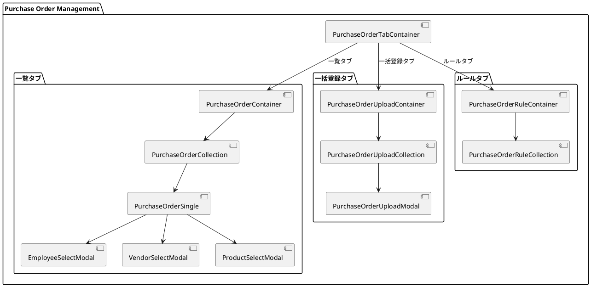
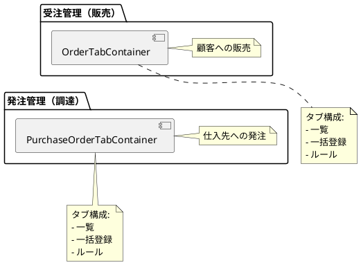
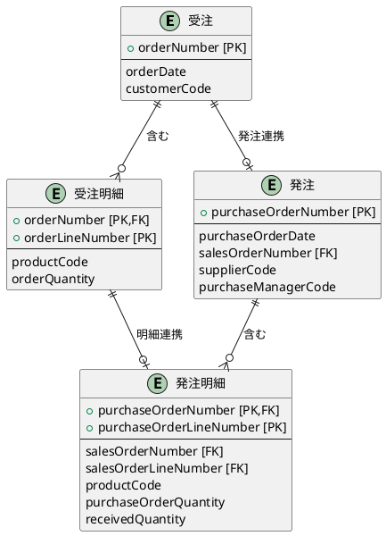
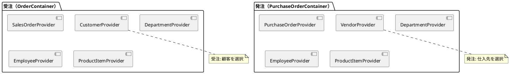
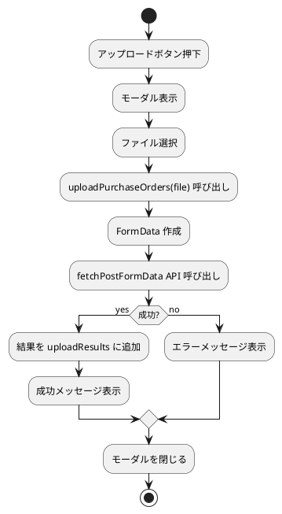
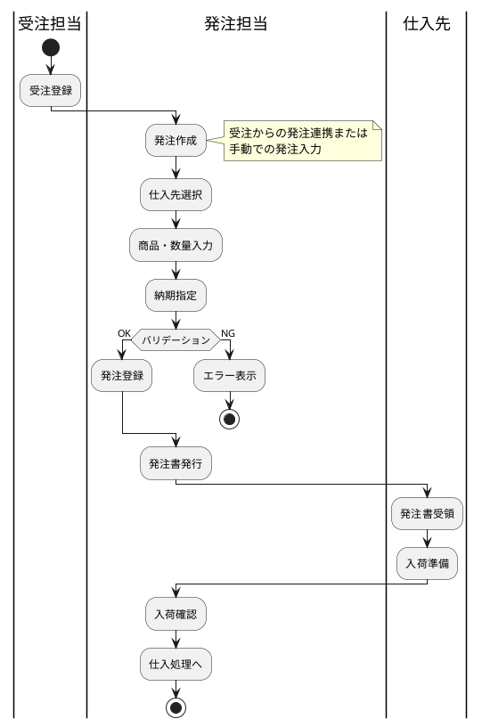

# 第14章: 発注管理

本章では、発注管理の実装について解説します。発注伝票のヘッダー・明細構造、受注との関連、一括登録とルールチェック機能の実装パターンを説明します。

## 14.1 発注管理の構成

### コンポーネント構成

発注管理は受注管理と同様に3つのタブで構成されます。



### 受注管理との構造比較



## 14.2 発注の型定義

### 発注ヘッダー・明細

```typescript
// models/procurement/purchaseOrder.ts
import { PageNationType } from "../../views/application/PageNation.tsx";
import { toISOStringLocal } from "../../components/application/utils.ts";

// 完了フラグ
export enum CompletionFlagEnumType {
    未完了 = "未完了",
    完了 = "完了"
}

// 発注明細型
export type PurchaseOrderLineType = {
    purchaseOrderNumber: string;
    purchaseOrderLineNumber: number;
    purchaseOrderLineDisplayNumber: number;
    salesOrderNumber?: string;          // 関連受注番号
    salesOrderLineNumber?: number;      // 関連受注明細番号
    productCode: string;
    productName?: string;
    purchaseUnitPrice: number;          // 仕入単価
    purchaseOrderQuantity: number;      // 発注数量
    receivedQuantity: number;           // 入荷数量
    completionFlag: CompletionFlagEnumType;
    checked?: boolean;
};

// 発注ヘッダー型
export type PurchaseOrderType = {
    purchaseOrderNumber: string;
    purchaseOrderDate: string;
    salesOrderNumber?: string;          // 関連受注番号
    supplierCode: string;               // 仕入先コード
    supplierName?: string;
    supplierBranchNumber: number;
    purchaseManagerCode: string;        // 発注担当者
    purchaseManagerName?: string;
    designatedDeliveryDate: string;     // 指定納期
    warehouseCode?: string;             // 入荷倉庫
    totalPurchaseAmount: number;        // 発注合計金額
    totalConsumptionTax: number;        // 消費税合計
    remarks?: string;
    purchaseOrderLines: PurchaseOrderLineType[];
    checked?: boolean;
};
```

### 受注との関連

発注は受注からの発注連携をサポートします。



### 検索条件

```typescript
export type PurchaseOrderCriteriaType = {
    purchaseOrderNumber?: string;
    purchaseOrderDate?: string;
    salesOrderNumber?: string;
    supplierCode?: string;
    supplierName?: string;
    purchaseManagerCode?: string;
    designatedDeliveryDate?: string;
    warehouseCode?: string;
    completionFlag?: boolean;
};

export type PurchaseOrderSearchCriteriaType = {
    purchaseOrderNumber?: string;
    purchaseOrderDate?: string;
    salesOrderNumber?: string;
    supplierCode?: string;
    supplierName?: string;
    purchaseManagerCode?: string;
    designatedDeliveryDate?: string;
    warehouseCode?: string;
    completionFlag?: string;  // 文字列として受け取り変換
};
```

## 14.3 PurchaseOrderTabContainer

発注管理のルートコンテナです。

```typescript
// components/procurement/order/PurchaseOrderTabContainer.tsx
import React from "react";
import { PurchaseOrderContainer } from "./list/PurchaseOrderContainer.tsx";
import { PurchaseOrderUploadContainer } from "./upload/PurchaseOrderUploadContainer.tsx";
import { PurchaseOrderRuleContainer } from "./rule/PurchaseOrderRuleContainer.tsx";
import {useTab} from "../../application/hooks.ts";
import {SiteLayout} from "../../../views/SiteLayout.tsx";

export const PurchaseOrderTabContainer: React.FC = () => {
    const {
        Tab,
        TabList,
        TabPanel,
        Tabs,
    } = useTab();

    return (
        <SiteLayout>
            <Tabs>
                <TabList>
                    <Tab>一覧</Tab>
                    <Tab>一括登録</Tab>
                    <Tab>ルール</Tab>
                </TabList>
                <TabPanel>
                    <PurchaseOrderContainer />
                </TabPanel>
                <TabPanel>
                    <PurchaseOrderUploadContainer />
                </TabPanel>
                <TabPanel>
                    <PurchaseOrderRuleContainer />
                </TabPanel>
            </Tabs>
        </SiteLayout>
    );
};
```

## 14.4 発注一覧

### PurchaseOrderContainer

5つの Provider をネストして発注一覧を管理します。

```typescript
// components/procurement/order/list/PurchaseOrderContainer.tsx
import React, { useEffect } from "react";
import { showErrorMessage } from "../../../application/utils.ts";
import LoadingIndicator from "../../../../views/application/LoadingIndicatior.tsx";
import { PurchaseOrderProvider, usePurchaseOrderContext }
    from "../../../../providers/procurement/PurchaseOrder.tsx";
import { PurchaseOrderCollection } from "./PurchaseOrderCollection.tsx";
import { DepartmentProvider, useDepartmentContext }
    from "../../../../providers/master/Department.tsx";
import { EmployeeProvider, useEmployeeContext }
    from "../../../../providers/master/Employee.tsx";
import { VendorProvider, useVendorContext }
    from "../../../../providers/master/partner/Vendor.tsx";
import { ProductItemProvider, useProductItemContext }
    from "../../../../providers/master/product/ProductItem.tsx";

export const PurchaseOrderContainer: React.FC = () => {
    const Content: React.FC = () => {
        const {
            loading,
            setError,
            fetchPurchaseOrders,
        } = usePurchaseOrderContext();

        const { fetchDepartments } = useDepartmentContext();
        const { fetchEmployees } = useEmployeeContext();
        const { fetchVendors } = useVendorContext();
        const { fetchProducts } = useProductItemContext();

        useEffect(() => {
            (async () => {
                try {
                    await Promise.all([
                        await fetchPurchaseOrders.load(),
                        fetchDepartments.load(),
                        fetchEmployees.load(),
                        fetchVendors.load(),
                        fetchProducts.load(),
                    ]);
                } catch (error: any) {
                    showErrorMessage(
                        `発注情報の取得に失敗しました: ${error?.message}`,
                        setError
                    );
                }
            })();
        }, []);

        return (
            <>
                {loading ? (
                    <LoadingIndicator/>
                ) : (
                    <PurchaseOrderCollection/>
                )}
            </>
        );
    };

    return (
        <PurchaseOrderProvider>
            <DepartmentProvider>
                <EmployeeProvider>
                    <VendorProvider>
                        <ProductItemProvider>
                            <Content />
                        </ProductItemProvider>
                    </VendorProvider>
                </EmployeeProvider>
            </DepartmentProvider>
        </PurchaseOrderProvider>
    );
};
```

### Provider 構成の比較

受注と発注で Provider の構成が異なります。



### PurchaseOrderSingle

発注編集画面です。3つのマスタ選択モーダルを使用します。

```typescript
// components/procurement/order/list/PurchaseOrderSingle.tsx
export const PurchaseOrderSingle: React.FC = () => {
    const {
        message,
        setMessage,
        error,
        setError,
        setModalIsOpen,
        isEditing,
        setEditId,
        newPurchaseOrder,
        setNewPurchaseOrder,
        fetchPurchaseOrders,
        purchaseOrderService,
        setSelectedLineIndex,
    } = usePurchaseOrderContext();

    const {
        setModalIsOpen: setEmployeeModalIsOpen,
    } = useEmployeeContext();

    const {
        setModalIsOpen: setVendorModalIsOpen,
    } = useVendorContext();

    const {
        setModalIsOpen: setProductModalIsOpen,
    } = useProductItemContext();

    const handleCloseModal = () => {
        setModalIsOpen(false);
        setEditId(null);
    };

    const handleCreateOrUpdatePurchaseOrder = async () => {
        try {
            if (isEditing) {
                await purchaseOrderService.update(newPurchaseOrder);
                setMessage("発注を更新しました。");
            } else {
                await purchaseOrderService.create(newPurchaseOrder);
                setMessage("発注を作成しました。");
            }
            await fetchPurchaseOrders.load();
            handleCloseModal();
        } catch (error: any) {
            showErrorMessage(
                `発注の更新に失敗しました: ${error?.message}`,
                setError
            );
        }
    };

    return (
        <PurchaseOrderSingleView
            error={error}
            message={message}
            isEditing={isEditing}
            newPurchaseOrder={newPurchaseOrder}
            setNewPurchaseOrder={setNewPurchaseOrder}
            setSelectedLineIndex={setSelectedLineIndex}
            handleCreateOrUpdatePurchaseOrder={handleCreateOrUpdatePurchaseOrder}
            handleCloseModal={handleCloseModal}
            handleEmployeeSelect={() => setEmployeeModalIsOpen(true)}
            handleVendorSelect={() => setVendorModalIsOpen(true)}
            handleProductSelect={() => setProductModalIsOpen(true)}
        />
    );
};
```

## 14.5 一括登録機能

### PurchaseOrderUploadContainer

一括登録タブのコンテナです。

```typescript
// components/procurement/order/upload/PurchaseOrderUploadContainer.tsx
export const PurchaseOrderUploadContainer: React.FC = () => {
    const Content: React.FC = () => {
        const {
            loading,
            setError,
            fetchPurchaseOrders,
        } = usePurchaseOrderContext();

        useEffect(() => {
            (async () => {
                try {
                    await Promise.all([
                        fetchPurchaseOrders.load(),
                    ]);
                } catch (error: any) {
                    showErrorMessage(
                        `発注情報の取得に失敗しました: ${error?.message}`,
                        setError
                    );
                }
            })();
        }, []);

        return (
            <>
                {loading ? (
                    <LoadingIndicator/>
                ) : (
                    <PurchaseOrderUploadCollection/>
                )}
            </>
        );
    };

    return (
        <PurchaseOrderProvider>
            <Content />
        </PurchaseOrderProvider>
    );
};
```

### PurchaseOrderUploadCollection

アップロード結果を管理するコンポーネントです。

```typescript
// components/procurement/order/upload/PurchaseOrderUploadCollection.tsx
export const PurchaseOrderUploadCollection: React.FC = () => {
    const {
        uploadResults,
        setUploadResults,
        setUploadModalIsOpen
    } = usePurchaseOrderContext();

    const handleOpenUploadModal = () => {
        setUploadModalIsOpen(true);
    };

    const handleDeleteUploadResult = (index: number) => {
        setUploadResults((prev: any[]) =>
            prev.filter((_: any, i: number) => i !== index)
        );
    };

    return (
        <>
            <PurchaseOrderUploadCollectionView
                uploadHeaderItems={{ handleOpenUploadModal }}
                uploadResults={uploadResults}
                handleDeleteUploadResult={handleDeleteUploadResult}
            />
            <PurchaseOrderUploadModal/>
        </>
    );
};
```

### アップロードフロー



## 14.6 ルールチェック機能

### PurchaseOrderRuleContainer

ルールタブのコンテナです。

```typescript
// components/procurement/order/rule/PurchaseOrderRuleContainer.tsx
export const PurchaseOrderRuleContainer: React.FC = () => {
    const Content: React.FC = () => {
        const {
            loading,
            setError,
            fetchPurchaseOrders,
        } = usePurchaseOrderContext();

        useEffect(() => {
            (async () => {
                try {
                    await Promise.all([
                        fetchPurchaseOrders.load(),
                    ]);
                } catch (error) {
                    const errorMessage = error instanceof Error
                        ? error.message
                        : '不明なエラーが発生しました';
                    showErrorMessage(
                        `発注情報の取得に失敗しました: ${errorMessage}`,
                        setError
                    );
                }
            })();
        }, []);

        return (
            <>
                {loading ? (
                    <LoadingIndicator/>
                ) : (
                    <PurchaseOrderRuleCollection/>
                )}
            </>
        );
    };

    return (
        <PurchaseOrderProvider>
            <Content />
        </PurchaseOrderProvider>
    );
};
```

### PurchaseOrderRuleCollection

ルールチェック結果を管理するコンポーネントです。

```typescript
// components/procurement/order/rule/PurchaseOrderRuleCollection.tsx
import { useState } from "react";
import { RuleCheckResultType }
    from "../../../../services/procurement/purchaseOrder.ts";
import { usePurchaseOrderContext }
    from "../../../../providers/procurement/PurchaseOrder.tsx";
import { PurchaseOrderRuleCollectionView }
    from "../../../../views/procurement/order/rule/PurchaseOrderRuleCollection.tsx";

export const PurchaseOrderRuleCollection: React.FC = () => {
    const [ruleResults, setRuleResults] = useState<RuleCheckResultType[]>([]);
    const { purchaseOrderService } = usePurchaseOrderContext();

    const handleExecuteRuleCheck = async () => {
        try {
            const results = await purchaseOrderService.check();
            setRuleResults(prevResults => [...prevResults, ...results]);
        } catch (error) {
            const errorMessage = error instanceof Error
                ? error.message
                : '不明なエラーが発生しました';
            console.error('Rule check failed:', errorMessage);
        }
    };

    const handleDeleteRuleResult = (index: number) => {
        setRuleResults(prevResults =>
            prevResults.filter((_, i) => i !== index)
        );
    };

    return (
        <PurchaseOrderRuleCollectionView
            ruleHeaderItems={{ handleExecuteRuleCheck }}
            ruleResults={ruleResults}
            handleDeleteRuleResult={handleDeleteRuleResult}
        />
    );
};
```

## 14.7 サービス層

### PurchaseOrderService

発注 API サービスです。

```typescript
// services/procurement/purchaseOrder.ts
export interface UploadResultType {
    message: string;
    details: Array<{ [key: string]: string }>;
}

export interface RuleCheckResultType {
    message: string;
    details: Array<{ [key: string]: string }>;
}

export interface PurchaseOrderServiceType {
    select: (page?: number, pageSize?: number)
        => Promise<PurchaseOrderFetchType>;
    find: (purchaseOrderNumber: string)
        => Promise<PurchaseOrderType>;
    create: (purchaseOrder: PurchaseOrderType)
        => Promise<void>;
    update: (purchaseOrder: PurchaseOrderType)
        => Promise<void>;
    destroy: (purchaseOrderNumber: string)
        => Promise<void>;
    search: (criteria: PurchaseOrderCriteriaType, page?: number, pageSize?: number)
        => Promise<PurchaseOrderFetchType>;
    upload: (file: File)
        => Promise<UploadResultType[]>;
    check: ()
        => Promise<RuleCheckResultType[]>;
}

export const PurchaseOrderService = () => {
    const config = Config();
    const apiUtils = Utils.apiUtils;
    const endPoint = `${config.apiUrl}/purchase-orders`;

    const select = async (page?: number, pageSize?: number)
        : Promise<PurchaseOrderFetchType> => {
        const url = Utils.buildUrlWithPaging(endPoint, page, pageSize);
        return await apiUtils.fetchGet<PurchaseOrderFetchType>(url);
    };

    const find = async (purchaseOrderNumber: string)
        : Promise<PurchaseOrderType> => {
        const url = `${endPoint}/${purchaseOrderNumber}`;
        return await apiUtils.fetchGet<PurchaseOrderType>(url);
    };

    const create = async (purchaseOrder: PurchaseOrderType): Promise<void> => {
        await apiUtils.fetchPost<void>(
            endPoint,
            mapToPurchaseOrderResource(purchaseOrder)
        );
    };

    const update = async (purchaseOrder: PurchaseOrderType): Promise<void> => {
        const url = `${endPoint}/${purchaseOrder.purchaseOrderNumber}`;
        await apiUtils.fetchPut<void>(
            url,
            mapToPurchaseOrderResource(purchaseOrder)
        );
    };

    const search = async (
        criteria: PurchaseOrderCriteriaType,
        page?: number,
        pageSize?: number
    ): Promise<PurchaseOrderFetchType> => {
        const url = Utils.buildUrlWithPaging(
            `${endPoint}/search`,
            page,
            pageSize
        );
        return await apiUtils.fetchPost<PurchaseOrderFetchType>(
            url,
            mapToPurchaseOrderCriteriaResource(criteria)
        );
    };

    const destroy = async (purchaseOrderNumber: string): Promise<void> => {
        const url = `${endPoint}/${purchaseOrderNumber}`;
        await apiUtils.fetchDelete<void>(url);
    };

    const upload = async (file: File): Promise<UploadResultType[]> => {
        const formData = new FormData();
        formData.append('file', file);
        const url = `${endPoint}/upload`;
        const response = await apiUtils.fetchPostFormData<UploadResultType>(
            url,
            formData
        );
        return Array.isArray(response) ? response : [response];
    };

    const check = async (): Promise<RuleCheckResultType[]> => {
        const url = `${endPoint}/check`;
        const response = await apiUtils.fetchPost<RuleCheckResultType>(url, {});
        return Array.isArray(response) ? response : [response];
    };

    return {
        select, find, create, update, destroy, search, upload, check
    };
};
```

## 14.8 Provider 設計

### PurchaseOrderProvider

```typescript
// providers/procurement/PurchaseOrder.tsx
type PurchaseOrderContextType = {
    loading: boolean;
    setLoading: Dispatch<SetStateAction<boolean>>;
    message: string | null;
    setMessage: Dispatch<SetStateAction<string | null>>;
    error: string | null;
    setError: Dispatch<SetStateAction<string | null>>;
    pageNation: PurchaseOrderFetchType;
    criteria: PurchaseOrderCriteriaType;
    setCriteria: Dispatch<SetStateAction<PurchaseOrderCriteriaType>>;
    setPageNation: Dispatch<SetStateAction<PurchaseOrderFetchType>>;
    modalIsOpen: boolean;
    setModalIsOpen: Dispatch<SetStateAction<boolean>>;
    searchModalIsOpen: boolean;
    setSearchModalIsOpen: Dispatch<SetStateAction<boolean>>;
    isEditing: boolean;
    setIsEditing: Dispatch<SetStateAction<boolean>>;
    editId: string | null;
    setEditId: Dispatch<SetStateAction<string | null>>;
    initialPurchaseOrder: PurchaseOrderType;
    newPurchaseOrder: PurchaseOrderType;
    setNewPurchaseOrder: Dispatch<SetStateAction<PurchaseOrderType>>;
    selectedLineIndex: number | null;
    setSelectedLineIndex: Dispatch<SetStateAction<number | null>>;
    purchaseOrders: PurchaseOrderType[];
    setPurchaseOrders: Dispatch<SetStateAction<PurchaseOrderType[]>>;
    searchPurchaseOrderCriteria: PurchaseOrderSearchCriteriaType;
    setSearchPurchaseOrderCriteria: Dispatch<SetStateAction<PurchaseOrderSearchCriteriaType>>;
    searchCriteria: PurchaseOrderSearchCriteriaType;
    setSearchCriteria: Dispatch<SetStateAction<PurchaseOrderSearchCriteriaType>>;
    fetchPurchaseOrders: { load: (pageNumber?: number) => Promise<void> };
    purchaseOrderService: ReturnType<typeof PurchaseOrderService>;
    uploadModalIsOpen: boolean;
    setUploadModalIsOpen: Dispatch<SetStateAction<boolean>>;
    uploadResults: UploadResultType[];
    setUploadResults: Dispatch<SetStateAction<UploadResultType[]>>;
    uploadPurchaseOrders: (file: File) => Promise<void>;
    ruleCheckResults: RuleCheckResultType[];
    setRuleCheckResults: Dispatch<SetStateAction<RuleCheckResultType[]>>;
};
```

### 初期値の定義

```typescript
const initialPurchaseOrderLine: PurchaseOrderLineType = {
    purchaseOrderNumber: "",
    purchaseOrderLineNumber: 1,
    purchaseOrderLineDisplayNumber: 1,
    productCode: "",
    productName: "",
    purchaseUnitPrice: 0,
    purchaseOrderQuantity: 0,
    receivedQuantity: 0,
    completionFlag: CompletionFlagEnumType.未完了
};

const initialPurchaseOrder: PurchaseOrderType = {
    purchaseOrderNumber: "",
    purchaseOrderDate: new Date().toISOString().split('T')[0],
    supplierCode: "",
    supplierBranchNumber: 1,
    purchaseManagerCode: "",
    designatedDeliveryDate: new Date().toISOString().split('T')[0],
    totalPurchaseAmount: 0,
    totalConsumptionTax: 0,
    purchaseOrderLines: []
};
```

### アップロード処理

```typescript
const uploadPurchaseOrders = async (file: File) => {
    try {
        setLoading(true);
        const results = await purchaseOrderService.upload(file);
        setUploadResults(prev => [...prev, ...results]);
        setMessage("発注データのアップロードが完了しました。");
    } catch (error: any) {
        setError(
            `発注データのアップロードに失敗しました: ${error?.message}`
        );
        throw error;
    } finally {
        setLoading(false);
    }
};
```

### 検索条件の変換

```typescript
useEffect(() => {
    const mappedCriteria: PurchaseOrderCriteriaType = {
        ...searchPurchaseOrderCriteria,
        completionFlag: searchPurchaseOrderCriteria.completionFlag === "true"
    };
    setCriteria(mappedCriteria);
}, [searchPurchaseOrderCriteria]);
```

## 14.9 リソース変換

### 発注リソース変換

```typescript
// models/procurement/purchaseOrder.ts
export const mapToPurchaseOrderResource = (
    purchaseOrder: PurchaseOrderType
): PurchaseOrderType => {
    return {
        purchaseOrderNumber: purchaseOrder.purchaseOrderNumber,
        purchaseOrderDate: toISOStringLocal(
            new Date(purchaseOrder.purchaseOrderDate)
        ),
        salesOrderNumber: purchaseOrder.salesOrderNumber,
        supplierCode: purchaseOrder.supplierCode,
        supplierName: purchaseOrder.supplierName,
        supplierBranchNumber: purchaseOrder.supplierBranchNumber,
        purchaseManagerCode: purchaseOrder.purchaseManagerCode,
        purchaseManagerName: purchaseOrder.purchaseManagerName,
        designatedDeliveryDate: toISOStringLocal(
            new Date(purchaseOrder.designatedDeliveryDate)
        ),
        warehouseCode: purchaseOrder.warehouseCode,
        totalPurchaseAmount: purchaseOrder.totalPurchaseAmount,
        totalConsumptionTax: purchaseOrder.totalConsumptionTax,
        remarks: purchaseOrder.remarks,
        purchaseOrderLines: purchaseOrder.purchaseOrderLines
    };
};
```

### 検索条件変換

```typescript
export const mapToPurchaseOrderSearchResource = (
    criteria: PurchaseOrderSearchCriteriaType
) => {
    const isEmpty = (value: unknown) =>
        value === "" || value === null || value === undefined;
    return {
        ...(isEmpty(criteria.purchaseOrderNumber)
            ? {} : { purchaseOrderNumber: criteria.purchaseOrderNumber }),
        ...(isEmpty(criteria.purchaseOrderDate)
            ? {} : { purchaseOrderDate: toISOStringLocal(
                new Date(criteria.purchaseOrderDate)
            )}),
        ...(isEmpty(criteria.salesOrderNumber)
            ? {} : { salesOrderNumber: criteria.salesOrderNumber }),
        ...(isEmpty(criteria.supplierCode)
            ? {} : { supplierCode: criteria.supplierCode }),
        ...(isEmpty(criteria.supplierName)
            ? {} : { supplierName: criteria.supplierName }),
        ...(isEmpty(criteria.purchaseManagerCode)
            ? {} : { purchaseManagerCode: criteria.purchaseManagerCode }),
        ...(isEmpty(criteria.designatedDeliveryDate)
            ? {} : { designatedDeliveryDate: toISOStringLocal(
                new Date(criteria.designatedDeliveryDate)
            )}),
        ...(isEmpty(criteria.warehouseCode)
            ? {} : { warehouseCode: criteria.warehouseCode }),
        ...(isEmpty(criteria.completionFlag)
            ? {} : { completionFlag: criteria.completionFlag === "true" })
    };
};
```

## 14.10 発注業務フロー



## まとめ

本章では、発注管理の実装について解説しました。

- **3タブ構成**: 一覧・一括登録・ルール
- **ヘッダー・明細構造**: 発注と発注明細の型定義
- **受注連携**: salesOrderNumber による受注との関連
- **5 Provider 構成**: Department, Employee, Vendor, ProductItem との連携
- **一括登録**: FormData による CSV アップロード
- **ルールチェック**: ビジネスルール検証 API

次章では、仕入・支払管理の実装について詳しく解説します。
