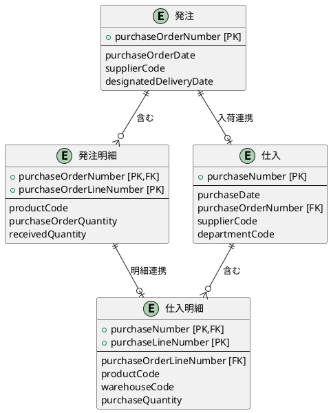
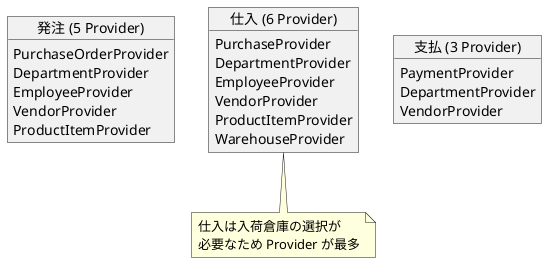
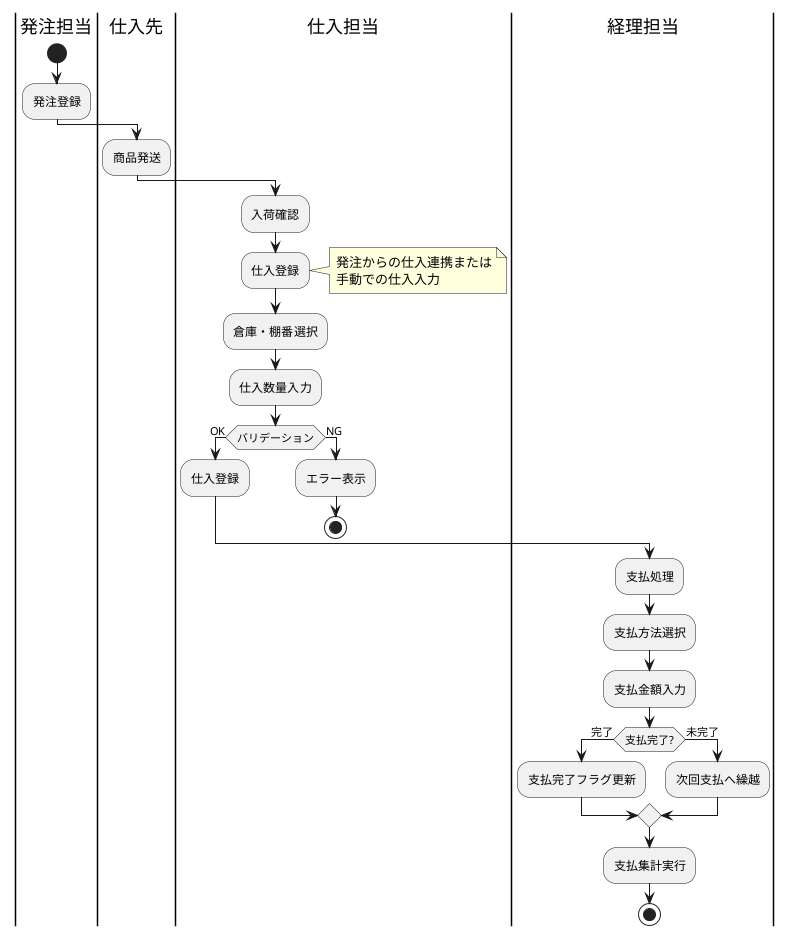
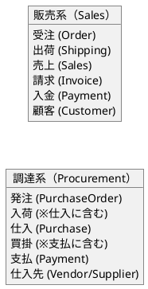

# 第15章: 仕入・支払管理

本章では、仕入管理と支払管理の実装について解説します。仕入データの型定義、発注との関連、支払方法の変換処理、集計機能の実装パターンを説明します。

## 15.1 仕入・支払管理の構成

### コンポーネント構成

仕入管理は2タブ、支払管理も2タブで構成されます。

```plantuml
@startuml
package "Purchase Management" {
  [PurchaseTabContainer] as purchaseTab

  package "一覧タブ" {
    [PurchaseContainer] as purchaseContainer
    [PurchaseCollection] as purchaseCollection
    [PurchaseSingle] as purchaseSingle
    [DepartmentSelectModal] as purchaseDeptModal
    [EmployeeSelectModal] as purchaseEmpModal
    [VendorSelectModal] as purchaseVendorModal
    [ProductSelectModal] as purchaseProductModal
    [WarehouseSelectModal] as warehouseModal
  }

  package "ルールタブ" {
    [PurchaseRuleContainer] as purchaseRuleContainer
    [PurchaseRuleCollection] as purchaseRuleCollection
  }
}

package "Payment Management" {
  [PaymentTabContainer] as paymentTab

  package "一覧タブ" {
    [PaymentContainer] as paymentContainer
    [PaymentCollection] as paymentCollection
    [PaymentSingle] as paymentSingle
    [DepartmentSelectModal] as paymentDeptModal
    [VendorSelectModal] as paymentVendorModal
  }

  package "集計タブ" {
    [PurchasePaymentAggregateContainer] as aggContainer
    [PurchasePaymentAggregateCollection] as aggCollection
  }
}

purchaseTab --> purchaseContainer : 一覧タブ
purchaseTab --> purchaseRuleContainer : ルールタブ
purchaseContainer --> purchaseCollection --> purchaseSingle

paymentTab --> paymentContainer : 一覧タブ
paymentTab --> aggContainer : 集計タブ
paymentContainer --> paymentCollection --> paymentSingle
aggContainer --> aggCollection
@enduml
```

## 15.2 仕入管理

### 仕入の型定義

```typescript
// models/procurement/purchase.ts
import { PageNationType } from "../../views/application/PageNation.tsx";
import { toISOStringLocal } from "../../components/application/utils.ts";

// 仕入明細型
export type PurchaseLineType = {
    purchaseNumber: string;
    purchaseLineNumber: number;
    purchaseLineDisplayNumber: number;
    purchaseOrderLineNumber: number;    // 発注明細番号への参照
    productCode: string;
    warehouseCode: string;              // 入荷倉庫
    productName?: string;
    purchaseUnitPrice: number;
    purchaseQuantity: number;
    checked?: boolean;
};

// 仕入ヘッダー型
export type PurchaseType = {
    purchaseNumber: string;
    purchaseDate: string;
    supplierCode: string;               // 仕入先
    supplierBranchNumber: number;
    purchaseManagerCode: string;        // 仕入担当者
    startDate: string;
    purchaseOrderNumber?: string;       // 発注番号への参照
    departmentCode: string;             // 部門
    totalPurchaseAmount: number;
    totalConsumptionTax: number;
    remarks?: string;
    purchaseLines: PurchaseLineType[];
    checked?: boolean;
};
```

### 発注との関連

仕入は発注からの入荷処理として機能します。



### PurchaseTabContainer

仕入管理のルートコンテナです。

```typescript
// components/procurement/purchase/PurchaseTabContainer.tsx
import React from "react";
import { PurchaseContainer } from "./list/PurchaseContainer.tsx";
import { PurchaseRuleContainer } from "./rule/PurchaseRuleContainer.tsx";
import {useTab} from "../../application/hooks.ts";
import {SiteLayout} from "../../../views/SiteLayout.tsx";

export const PurchaseTabContainer: React.FC = () => {
    const {
        Tab,
        TabList,
        TabPanel,
        Tabs,
    } = useTab();

    return (
        <SiteLayout>
            <Tabs>
                <TabList>
                    <Tab>一覧</Tab>
                    <Tab>ルール</Tab>
                </TabList>
                <TabPanel>
                    <PurchaseContainer />
                </TabPanel>
                <TabPanel>
                    <PurchaseRuleContainer />
                </TabPanel>
            </Tabs>
        </SiteLayout>
    );
};
```

### PurchaseContainer

仕入一覧は6つの Provider をネストします。これは本システムで最も多い Provider 数です。

```typescript
// components/procurement/purchase/list/PurchaseContainer.tsx
export const PurchaseContainer: React.FC = () => {
    const Content: React.FC = () => {
        const { loading, setError, fetchPurchases } = usePurchaseContext();
        const { fetchDepartments } = useDepartmentContext();
        const { fetchEmployees } = useEmployeeContext();
        const { fetchVendors } = useVendorContext();
        const { fetchProducts } = useProductItemContext();
        const { fetchWarehouses } = useWarehouseContext();

        useEffect(() => {
            (async () => {
                try {
                    await Promise.all([
                        await fetchPurchases.load(),
                        fetchDepartments.load(),
                        fetchEmployees.load(),
                        fetchVendors.load(),
                        fetchProducts.load(),
                        fetchWarehouses.load(),
                    ]);
                } catch (error: any) {
                    showErrorMessage(
                        `仕入情報の取得に失敗しました: ${error?.message}`,
                        setError
                    );
                }
            })();
        }, []);

        return (
            <>
                {loading ? (
                    <LoadingIndicator/>
                ) : (
                    <PurchaseCollection/>
                )}
            </>
        );
    };

    return (
        <PurchaseProvider>
            <DepartmentProvider>
                <EmployeeProvider>
                    <VendorProvider>
                        <ProductItemProvider>
                            <WarehouseProvider>
                                <Content />
                            </WarehouseProvider>
                        </ProductItemProvider>
                    </VendorProvider>
                </EmployeeProvider>
            </DepartmentProvider>
        </PurchaseProvider>
    );
};
```

### Provider 数の比較



### PurchaseSingle

仕入編集画面です。5つのマスタ選択モーダルを使用します。

```typescript
// components/procurement/purchase/list/PurchaseSingle.tsx
export const PurchaseSingle: React.FC = () => {
    const {
        message, setMessage, error, setError,
        setModalIsOpen, isEditing, setEditId,
        newPurchase, setNewPurchase,
        fetchPurchases, purchaseService, setSelectedLineIndex,
    } = usePurchaseContext();

    const { setModalIsOpen: setEmployeeModalIsOpen } = useEmployeeContext();
    const { setModalIsOpen: setVendorModalIsOpen } = useVendorContext();
    const { setModalIsOpen: setProductModalIsOpen } = useProductItemContext();
    const { setModalIsOpen: setDepartmentModalIsOpen } = useDepartmentContext();
    const { setModalIsOpen: setWarehouseModalIsOpen } = useWarehouseContext();

    const handleCloseModal = () => {
        setModalIsOpen(false);
        setEditId(null);
    };

    const handleCreateOrUpdatePurchase = async () => {
        try {
            if (isEditing) {
                await purchaseService.update(newPurchase);
                setMessage("仕入を更新しました。");
            } else {
                await purchaseService.create(newPurchase);
                setMessage("仕入を作成しました。");
            }
            await fetchPurchases.load();
            handleCloseModal();
        } catch (error: any) {
            showErrorMessage(
                `仕入の更新に失敗しました: ${error?.message}`,
                setError
            );
        }
    };

    return (
        <PurchaseSingleView
            error={error}
            message={message}
            isEditing={isEditing}
            newPurchase={newPurchase}
            setNewPurchase={setNewPurchase}
            setSelectedLineIndex={setSelectedLineIndex}
            handleCreateOrUpdatePurchase={handleCreateOrUpdatePurchase}
            handleCloseModal={handleCloseModal}
            handleEmployeeSelect={() => setEmployeeModalIsOpen(true)}
            handleVendorSelect={() => setVendorModalIsOpen(true)}
            handleProductSelect={() => setProductModalIsOpen(true)}
            handleDepartmentSelect={() => setDepartmentModalIsOpen(true)}
            handleWarehouseSelect={() => setWarehouseModalIsOpen(true)}
        />
    );
};
```

### PurchaseRuleCollection

仕入ルールチェックコンポーネントです。

```typescript
// components/procurement/purchase/rule/PurchaseRuleCollection.tsx
export const PurchaseRuleCollection: React.FC = () => {
    const {
        ruleCheckResults,
        setRuleCheckResults,
        purchaseService,
    } = usePurchaseContext();

    const handleExecuteRuleCheck = async () => {
        try {
            const result = await purchaseService.check();
            setRuleCheckResults(prevResults => [...prevResults, ...result]);
        } catch (error) {
            const errorMessage = error instanceof Error
                ? error.message
                : '不明なエラーが発生しました';
            console.error('Rule check failed:', errorMessage);
        }
    };

    const handleDeleteRuleCheckResult = (index: number) => {
        setRuleCheckResults(prevResults =>
            prevResults.filter((_, i) => i !== index)
        );
    };

    return (
        <PurchaseRuleCollectionView
            ruleCheckHeaderItems={{handleExecuteRuleCheck}}
            ruleCheckResults={ruleCheckResults}
            handleDeleteRuleCheckResult={handleDeleteRuleCheckResult}
        />
    );
};
```

## 15.3 支払管理

### 支払の型定義

```typescript
// models/procurement/payment.ts
import { PageNationType } from "../../views/application/PageNation.tsx";
import { toISOStringLocal } from "../../components/application/utils.ts";

// 支払方法区分
export enum PaymentMethodType {
    現金 = "現金",
    小切手 = "小切手",
    手形 = "手形",
    振込 = "振込",
    相殺 = "相殺",
    その他 = "その他"
}

// 支払型
export type PaymentType = {
    paymentNumber: string;
    paymentDate: number | string;       // YYYYMMDD 形式
    departmentCode: string;
    departmentStartDate: string;
    supplierCode: string;               // 支払先（仕入先）
    supplierBranchNumber: number;
    paymentMethodType: string;          // 支払方法
    paymentAmount: number;              // 支払金額
    totalConsumptionTax: number;
    paymentCompletedFlag: boolean;      // 支払完了フラグ
    supplierName?: string;
    checked?: boolean;
};
```

### 支払方法の変換処理

バックエンドでは数値コード、フロントエンドでは文字列で管理します。

```typescript
// 支払方法区分をコードから文字列に変換
export const convertCodeToPaymentMethodType = (
    code: number | string
): string => {
    const codeMap: { [key: number]: string } = {
        1: "現金",
        2: "小切手",
        3: "手形",
        4: "振込",
        5: "相殺",
        9: "その他"
    };
    const numCode = typeof code === 'string' ? parseInt(code, 10) : code;
    return codeMap[numCode] || "振込"; // デフォルトは振込
};

// 支払方法区分を文字列からコードに変換
const convertPaymentMethodTypeToCode = (
    paymentMethodType: string
): number => {
    const paymentMethodMap: { [key: string]: number } = {
        "現金": 1,
        "小切手": 2,
        "手形": 3,
        "振込": 4,
        "相殺": 5,
        "その他": 9
    };
    return paymentMethodMap[paymentMethodType] || 4; // デフォルトは振込
};
```

### 日付形式の変換

支払日は YYYYMMDD 形式の整数で管理します。

```typescript
// YYYY-MM-DD形式の日付をYYYYMMDD形式の整数に変換
const convertDateToInteger = (dateStr: number | string): number => {
    if (typeof dateStr === 'number') return dateStr;
    const cleanDate = dateStr.replace(/-/g, '');
    return parseInt(cleanDate, 10);
};
```

### PaymentTabContainer

支払管理のルートコンテナです。

```typescript
// components/procurement/payment/PaymentTabContainer.tsx
import {useTab} from "../../application/hooks";
import {SiteLayout} from "../../../views/SiteLayout";
import {PaymentContainer} from "./list/PaymentContainer.tsx";
import {PurchasePaymentAggregateContainer}
    from "./aggregate/PurchasePaymentAggregateContainer.tsx";

export const PaymentTabContainer: React.FC = () => {
    const {
        Tab,
        TabList,
        TabPanel,
        Tabs,
    } = useTab();

    return (
        <SiteLayout>
            <Tabs>
                <TabList>
                    <Tab>一覧</Tab>
                    <Tab>集計</Tab>
                </TabList>
                <TabPanel>
                    <PaymentContainer/>
                </TabPanel>
                <TabPanel>
                    <PurchasePaymentAggregateContainer/>
                </TabPanel>
            </Tabs>
        </SiteLayout>
    );
}
```

### PaymentContainer

支払一覧は3つの Provider をネストします。

```typescript
// components/procurement/payment/list/PaymentContainer.tsx
export const PaymentContainer: React.FC = () => {
    const Content: React.FC = () => {
        const { loading, setError, fetchPayments } = usePaymentContext();
        const { fetchDepartments } = useDepartmentContext();
        const { fetchVendors } = useVendorContext();

        useEffect(() => {
            (async () => {
                try {
                    await Promise.all([
                        fetchPayments.load(),
                        fetchDepartments.load(),
                        fetchVendors.load(),
                    ]);
                } catch (error: any) {
                    showErrorMessage(
                        `支払情報の取得に失敗しました: ${error?.message}`,
                        setError
                    );
                }
            })();
        }, []);

        return (
            <>
                {loading ? (
                    <LoadingIndicator/>
                ) : (
                    <PaymentCollection/>
                )}
            </>
        );
    };

    return (
        <PaymentProvider>
            <DepartmentProvider>
                <VendorProvider>
                    <Content />
                </VendorProvider>
            </DepartmentProvider>
        </PaymentProvider>
    );
};
```

### PaymentSingle

支払編集画面です。

```typescript
// components/procurement/payment/list/PaymentSingle.tsx
export const PaymentSingle: React.FC = () => {
    const {
        message, setMessage, error, setError,
        setModalIsOpen, isEditing, setEditId,
        newPayment, setNewPayment,
        fetchPayments, paymentService,
    } = usePaymentContext();

    const { setModalIsOpen: setDepartmentModalIsOpen } = useDepartmentContext();
    const { setModalIsOpen: setVendorModalIsOpen } = useVendorContext();

    const handleCloseModal = () => {
        setModalIsOpen(false);
        setEditId(null);
    };

    const handleCreateOrUpdatePayment = async () => {
        try {
            if (isEditing) {
                await paymentService.update(newPayment);
                setMessage("支払を更新しました。");
            } else {
                await paymentService.create(newPayment);
                setMessage("支払を作成しました。");
            }
            await fetchPayments.load();
            handleCloseModal();
        } catch (error: any) {
            showErrorMessage(
                `支払の更新に失敗しました: ${error?.message}`,
                setError
            );
        }
    };

    return (
        <PaymentSingleView
            error={error}
            message={message}
            isEditing={isEditing}
            newPayment={newPayment}
            setNewPayment={setNewPayment}
            handleCreateOrUpdatePayment={handleCreateOrUpdatePayment}
            handleCloseModal={handleCloseModal}
            handleDepartmentSelect={() => setDepartmentModalIsOpen(true)}
            handleVendorSelect={() => setVendorModalIsOpen(true)}
        />
    );
};
```

## 15.4 支払集計機能

### PurchasePaymentAggregateContainer

支払集計タブのコンテナです。

```typescript
// components/procurement/payment/aggregate/PurchasePaymentAggregateContainer.tsx
export const PurchasePaymentAggregateContainer: React.FC = () => {
    const Content: React.FC = () => {
        const { loading, setError, fetchPayments } = usePaymentContext();

        useEffect(() => {
            (async () => {
                try {
                    await Promise.all([
                        fetchPayments.load(),
                    ]);
                } catch (error) {
                    const errorMessage = error instanceof Error
                        ? error.message
                        : '不明なエラーが発生しました';
                    showErrorMessage(
                        `支払情報の取得に失敗しました: ${errorMessage}`,
                        setError
                    );
                }
            })();
        }, []);

        return (
            <>
                {loading ? (
                    <LoadingIndicator/>
                ) : (
                    <PurchasePaymentAggregateCollection/>
                )}
            </>
        );
    };

    return (
        <PaymentProvider>
            <Content />
        </PaymentProvider>
    );
};
```

### PurchasePaymentAggregateCollection

支払集計コンポーネントです。

```typescript
// components/procurement/payment/aggregate/PurchasePaymentAggregateCollection.tsx
import {useState} from "react";
import {PaymentAggregateResponse}
    from "../../../../services/procurement/payment";
import {usePaymentContext}
    from "../../../../providers/procurement/Payment";
import {PurchasePaymentAggregateCollectionView}
    from "../../../../views/procurement/payment/aggregate/PurchasePaymentAggregateCollection";

export const PurchasePaymentAggregateCollection: React.FC = () => {
    const [aggregateResults, setAggregateResults] =
        useState<PaymentAggregateResponse[]>([]);
    const {paymentService} = usePaymentContext();

    const handleExecuteAggregate = async () => {
        try {
            const result = await paymentService.aggregate();
            setAggregateResults(prevResults => [...prevResults, result]);
        } catch (error) {
            const errorMessage = error instanceof Error
                ? error.message
                : '不明なエラーが発生しました';
            console.error('Aggregate failed:', errorMessage);
        }
    };

    const handleDeleteAggregateResult = (index: number) => {
        setAggregateResults(prevResults =>
            prevResults.filter((_, i) => i !== index)
        );
    };

    return (
        <PurchasePaymentAggregateCollectionView
            aggregateHeaderItems={{handleExecuteAggregate}}
            aggregateResults={aggregateResults}
            handleDeleteAggregateResult={handleDeleteAggregateResult}
        />
    );
};
```

## 15.5 サービス層

### PurchaseService

仕入 API サービスです。

```typescript
// services/procurement/purchase.ts
export interface RuleCheckResultType {
    message: string;
    details: Array<{ [key: string]: string }>;
}

export interface PurchaseServiceType {
    select: (page?: number, pageSize?: number)
        => Promise<PurchaseFetchType>;
    find: (purchaseNumber: string)
        => Promise<PurchaseType>;
    create: (purchase: PurchaseType)
        => Promise<void>;
    update: (purchase: PurchaseType)
        => Promise<void>;
    destroy: (purchaseNumber: string)
        => Promise<void>;
    search: (criteria: PurchaseCriteriaType, page?: number, pageSize?: number)
        => Promise<PurchaseFetchType>;
    check: ()
        => Promise<RuleCheckResultType[]>;
}

export const PurchaseService = () => {
    const config = Config();
    const apiUtils = Utils.apiUtils;
    const endPoint = `${config.apiUrl}/purchases`;

    const select = async (page?: number, pageSize?: number)
        : Promise<PurchaseFetchType> => {
        const url = Utils.buildUrlWithPaging(endPoint, page, pageSize);
        return await apiUtils.fetchGet<PurchaseFetchType>(url);
    };

    const find = async (purchaseNumber: string): Promise<PurchaseType> => {
        const url = `${endPoint}/${purchaseNumber}`;
        return await apiUtils.fetchGet<PurchaseType>(url);
    };

    const create = async (purchase: PurchaseType): Promise<void> => {
        await apiUtils.fetchPost<void>(
            endPoint,
            mapToPurchaseResource(purchase)
        );
    };

    const update = async (purchase: PurchaseType): Promise<void> => {
        const url = `${endPoint}/${purchase.purchaseNumber}`;
        await apiUtils.fetchPut<void>(url, mapToPurchaseResource(purchase));
    };

    const search = async (
        criteria: PurchaseCriteriaType,
        page?: number,
        pageSize?: number
    ): Promise<PurchaseFetchType> => {
        const url = Utils.buildUrlWithPaging(
            `${endPoint}/search`,
            page,
            pageSize
        );
        return await apiUtils.fetchPost<PurchaseFetchType>(
            url,
            mapToPurchaseCriteriaResource(criteria)
        );
    };

    const destroy = async (purchaseNumber: string): Promise<void> => {
        const url = `${endPoint}/${purchaseNumber}`;
        await apiUtils.fetchDelete<void>(url);
    };

    const check = async (): Promise<RuleCheckResultType[]> => {
        const url = `${endPoint}/check`;
        const response = await apiUtils.fetchPost<RuleCheckResultType>(url, {});
        return Array.isArray(response) ? response : [response];
    };

    return {
        select, find, create, update, destroy, search, check
    };
};
```

### PaymentService (調達)

支払 API サービスです。エンドポイントは `/purchase-payments` です。

```typescript
// services/procurement/payment.ts
export interface PaymentAggregateResponse {
    message: string;
    details: string[];
}

export interface PaymentServiceType {
    select: (page?: number, pageSize?: number)
        => Promise<PaymentFetchType>;
    find: (paymentNumber: string)
        => Promise<PaymentType>;
    create: (payment: PaymentType)
        => Promise<void>;
    update: (payment: PaymentType)
        => Promise<void>;
    destroy: (paymentNumber: string)
        => Promise<void>;
    search: (criteria: PaymentCriteriaType, page?: number, pageSize?: number)
        => Promise<PaymentFetchType>;
    aggregate: ()
        => Promise<PaymentAggregateResponse>;
}

export const PaymentService = () => {
    const config = Config();
    const apiUtils = Utils.apiUtils;
    const endPoint = `${config.apiUrl}/purchase-payments`;

    const select = async (page?: number, pageSize?: number)
        : Promise<PaymentFetchType> => {
        const url = Utils.buildUrlWithPaging(endPoint, page, pageSize);
        return await apiUtils.fetchGet<PaymentFetchType>(url);
    };

    const find = async (paymentNumber: string): Promise<PaymentType> => {
        const url = `${endPoint}/${paymentNumber}`;
        return await apiUtils.fetchGet<PaymentType>(url);
    };

    const create = async (payment: PaymentType): Promise<void> => {
        await apiUtils.fetchPost<void>(
            endPoint,
            mapToPaymentResource(payment)
        );
    };

    const update = async (payment: PaymentType): Promise<void> => {
        const url = `${endPoint}/${payment.paymentNumber}`;
        await apiUtils.fetchPut<void>(url, mapToPaymentResource(payment));
    };

    const search = async (
        criteria: PaymentCriteriaType,
        page?: number,
        pageSize?: number
    ): Promise<PaymentFetchType> => {
        const url = Utils.buildUrlWithPaging(
            `${endPoint}/search`,
            page,
            pageSize
        );
        return await apiUtils.fetchPost<PaymentFetchType>(
            url,
            mapToPaymentCriteriaResource(criteria)
        );
    };

    const destroy = async (paymentNumber: string): Promise<void> => {
        const url = `${endPoint}/${paymentNumber}`;
        await apiUtils.fetchDelete<void>(url);
    };

    const aggregate = async (): Promise<PaymentAggregateResponse> => {
        const url = `${endPoint}/aggregate`;
        return await apiUtils.fetchPost<PaymentAggregateResponse>(url, {});
    };

    return {
        select, find, create, update, destroy, search, aggregate
    };
};
```

## 15.6 リソース変換

### 仕入リソース変換

```typescript
// models/procurement/purchase.ts
export const mapToPurchaseResource = (purchase: PurchaseType) => {
    return {
        purchaseNumber: purchase.purchaseNumber,
        purchaseDate: purchase.purchaseDate
            ? toISOStringLocal(new Date(purchase.purchaseDate))
            : null,
        supplierCode: purchase.supplierCode,
        supplierBranchNumber: purchase.supplierBranchNumber,
        purchaseManagerCode: purchase.purchaseManagerCode,
        startDate: purchase.startDate
            ? toISOStringLocal(new Date(purchase.startDate))
            : null,
        purchaseOrderNumber: purchase.purchaseOrderNumber,
        departmentCode: purchase.departmentCode,
        totalPurchaseAmount: purchase.totalPurchaseAmount,
        totalConsumptionTax: purchase.totalConsumptionTax,
        remarks: purchase.remarks,
        purchaseLines: purchase.purchaseLines.map(line => ({
            purchaseNumber: line.purchaseNumber,
            purchaseLineNumber: line.purchaseLineNumber,
            purchaseLineDisplayNumber: line.purchaseLineDisplayNumber,
            purchaseOrderLineNumber: line.purchaseOrderLineNumber,
            productCode: line.productCode,
            warehouseCode: line.warehouseCode,
            productName: line.productName,
            purchaseUnitPrice: line.purchaseUnitPrice,
            purchaseQuantity: line.purchaseQuantity
        }))
    };
};
```

### 支払リソース変換

支払方法と日付の型変換が必要です。

```typescript
// models/procurement/payment.ts
export const mapToPaymentResource = (payment: PaymentType) => {
    return {
        paymentNumber: payment.paymentNumber,
        paymentDate: payment.paymentDate
            ? convertDateToInteger(payment.paymentDate)
            : null,
        departmentCode: payment.departmentCode,
        departmentStartDate: payment.departmentStartDate
            ? toISOStringLocal(new Date(payment.departmentStartDate))
            : null,
        supplierCode: payment.supplierCode,
        supplierBranchNumber: payment.supplierBranchNumber,
        paymentMethodType: convertPaymentMethodTypeToCode(
            payment.paymentMethodType
        ),
        paymentAmount: payment.paymentAmount,
        totalConsumptionTax: payment.totalConsumptionTax,
        paymentCompletedFlag: payment.paymentCompletedFlag
    };
};
```

## 15.7 調達業務フロー



## 15.8 販売系と調達系の比較

### 用語の対応



### API エンドポイントの比較

| 販売系 | 調達系 |
|--------|--------|
| /api/orders | /api/purchase-orders |
| /api/shippings | - |
| /api/sales | /api/purchases |
| /api/invoices | - |
| /api/payments | /api/purchase-payments |

## まとめ

本章では、仕入管理と支払管理の実装について解説しました。

- **仕入管理**: 2タブ構成（一覧・ルール）、6 Provider によるマスタ連携
- **支払管理**: 2タブ構成（一覧・集計）、支払方法の変換処理
- **発注連携**: purchaseOrderNumber による発注との関連
- **型変換**: 支払方法コード、日付形式の変換関数
- **集計機能**: 結果蓄積パターンによる集計履歴管理

次章では、在庫管理の実装について詳しく解説します。
