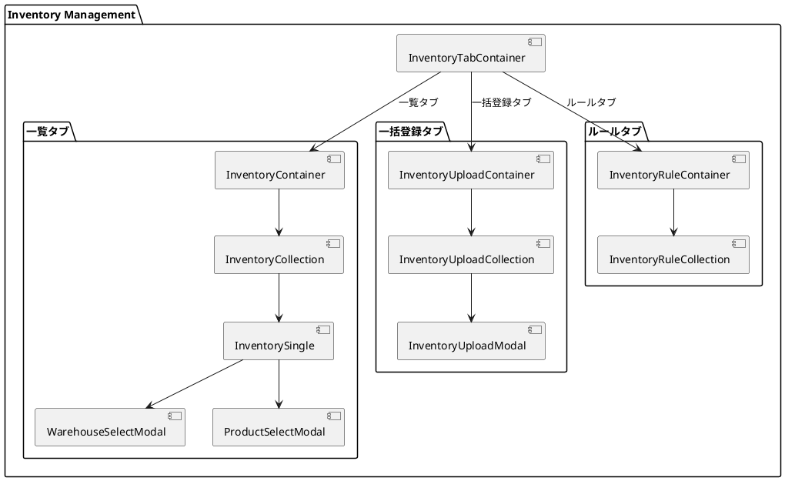
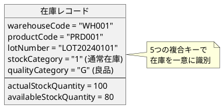
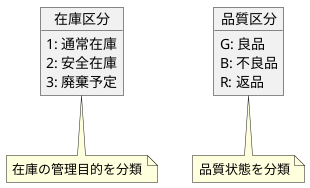
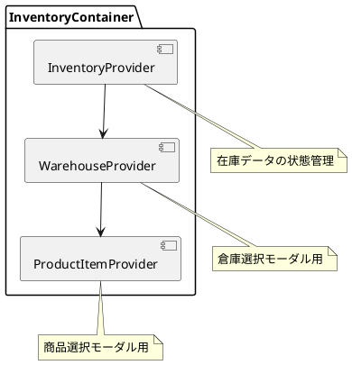
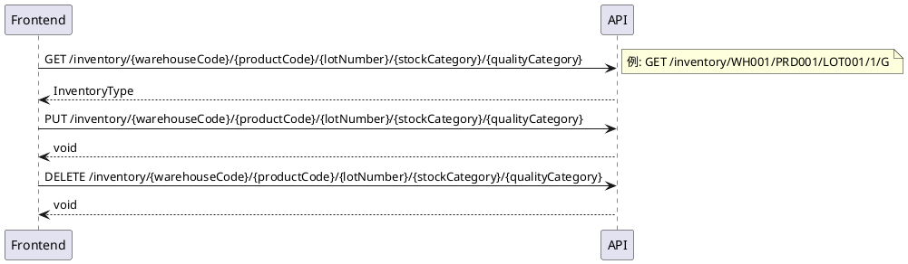
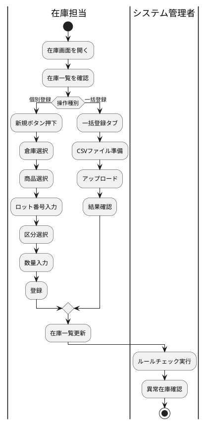

# 第16章: 在庫管理

本章では、在庫管理の実装について解説します。在庫データの型定義、複合キーによるデータ管理、一括登録とルールチェック機能の実装パターンを説明します。

## 16.1 在庫管理の構成

### コンポーネント構成

在庫管理は3つのタブで構成されます。



## 16.2 在庫の型定義

### 在庫データ型

在庫は複合キー（倉庫コード、商品コード、ロット番号、在庫区分、品質区分）で一意に識別されます。

```typescript
// models/inventory/inventory.ts
import { PageNationType } from "../../views/application/PageNation.tsx";
import { toISOStringLocal } from "../../components/application/utils.ts";

// 在庫区分
export enum StockCategoryEnumType {
    通常在庫 = "1",
    安全在庫 = "2",
    廃棄予定 = "3"
}

// 品質区分
export enum QualityCategoryEnumType {
    良品 = "G",
    不良品 = "B",
    返品 = "R"
}

// 在庫型
export type InventoryType = {
    warehouseCode: string;          // 倉庫コード [複合キー]
    productCode: string;            // 商品コード [複合キー]
    lotNumber: string;              // ロット番号 [複合キー]
    stockCategory: string;          // 在庫区分 [複合キー]
    qualityCategory: string;        // 品質区分 [複合キー]
    actualStockQuantity: number;    // 実在庫数量
    availableStockQuantity: number; // 有効在庫数量
    lastShipmentDate?: string;      // 最終出荷日
    productName?: string;
    warehouseName?: string;
    checked?: boolean;
};
```

### 複合キーの構成



### 在庫区分と品質区分



### 検索条件

```typescript
export type InventoryCriteriaType = {
    warehouseCode?: string;
    productCode?: string;
    lotNumber?: string;
    stockCategory?: string;
    qualityCategory?: string;
    productName?: string;
    warehouseName?: string;
    hasStock?: boolean;      // 在庫あり
    isAvailable?: boolean;   // 有効在庫あり
};

export type InventorySearchCriteriaType = {
    warehouseCode?: string;
    productCode?: string;
    lotNumber?: string;
    stockCategory?: string;
    qualityCategory?: string;
    productName?: string;
    warehouseName?: string;
    hasStock?: string;       // フォームでは文字列
    isAvailable?: string;    // フォームでは文字列
};
```

## 16.3 InventoryTabContainer

在庫管理のルートコンテナです。

```typescript
// components/inventory/InventoryTabContainer.tsx
import React, { useEffect, useState } from "react";
import { useLocation, useNavigate } from "react-router-dom";
import { InventoryContainer } from "./list/InventoryContainer.tsx";
import { InventoryUploadContainer } from "./upload/InventoryUploadContainer.tsx";
import { InventoryRuleContainer } from "./rule/InventoryRuleContainer.tsx";
import {useTab} from "../application/hooks.ts";
import {SiteLayout} from "../../views/SiteLayout.tsx";

export const InventoryTabContainer: React.FC = () => {
    const location = useLocation();
    const navigate = useNavigate();
    const [tabIndex, setTabIndex] = useState(0);

    const {
        Tab,
        TabList,
        TabPanel,
        Tabs,
    } = useTab();

    return (
        <SiteLayout>
            <Tabs>
                <TabList>
                    <Tab>一覧</Tab>
                    <Tab>一括登録</Tab>
                    <Tab>ルール</Tab>
                </TabList>
                <TabPanel>
                    <InventoryContainer />
                </TabPanel>
                <TabPanel>
                    <InventoryUploadContainer />
                </TabPanel>
                <TabPanel>
                    <InventoryRuleContainer />
                </TabPanel>
            </Tabs>
        </SiteLayout>
    );
};
```

## 16.4 在庫一覧

### InventoryContainer

在庫一覧は3つの Provider をネストします。

```typescript
// components/inventory/list/InventoryContainer.tsx
import React, {useEffect} from "react";
import {showErrorMessage} from "../../application/utils.ts";
import LoadingIndicator from "../../../views/application/LoadingIndicatior.tsx";
import { InventoryProvider, useInventoryContext }
    from "../../../providers/inventory/Inventory.tsx";
import { WarehouseProvider, useWarehouseContext }
    from "../../../providers/master/Warehouse.tsx";
import { ProductItemProvider, useProductItemContext }
    from "../../../providers/master/product/ProductItem.tsx";
import { InventoryCollection } from "./InventoryCollection.tsx";

export const InventoryContainer: React.FC = () => {
    const Content: React.FC = () => {
        const {
            loading,
            setError,
            fetchInventories,
        } = useInventoryContext();

        const { fetchWarehouses } = useWarehouseContext();
        const { fetchProducts } = useProductItemContext();

        useEffect(() => {
            (async () => {
                try {
                    await Promise.all([
                        fetchInventories.load(),
                        fetchWarehouses.load(),
                        fetchProducts.load(),
                    ]);
                } catch (error: any) {
                    showErrorMessage(
                        `在庫情報の取得に失敗しました: ${error?.message}`,
                        setError
                    );
                }
            })();
        }, []);

        return (
            <>
                {loading ? (
                    <LoadingIndicator/>
                ) : (
                    <InventoryCollection/>
                )}
            </>
        );
    };

    return (
        <InventoryProvider>
            <WarehouseProvider>
                <ProductItemProvider>
                    <Content />
                </ProductItemProvider>
            </WarehouseProvider>
        </InventoryProvider>
    );
};
```

### Provider 構成



### InventorySingle

在庫編集画面です。

```typescript
// components/inventory/list/InventorySingle.tsx
export const InventorySingle: React.FC = () => {
    const {
        message,
        setMessage,
        error,
        setError,
        isEditing,
        newInventory,
        setNewInventory,
        inventoryService,
        fetchInventories,
        setModalIsOpen,
    } = useInventoryContext();

    const {
        setModalIsOpen: setWarehouseModalIsOpen,
    } = useWarehouseContext();

    const {
        setModalIsOpen: setProductModalIsOpen,
    } = useProductItemContext();

    const handleCloseModal = () => {
        setModalIsOpen(false);
    };

    const handleWarehouseSelect = () => {
        setWarehouseModalIsOpen(true);
    };

    const handleProductSelect = () => {
        setProductModalIsOpen(true);
    };

    const handleSaveInventory = async () => {
        try {
            if (isEditing) {
                await inventoryService.update(newInventory);
                setMessage("在庫データを更新しました。");
            } else {
                await inventoryService.create(newInventory);
                setMessage("在庫データを登録しました。");
            }
            await fetchInventories.load();
            setModalIsOpen(false);
        } catch (error: any) {
            showErrorMessage(
                `在庫データの${isEditing ? '更新' : '登録'}に失敗しました: ${error?.message}`,
                setError
            );
        }
    };

    return (
        <InventoryEditModalView
            isOpen={true}
            onClose={handleCloseModal}
            isEditing={isEditing}
            inventory={newInventory}
            setInventory={setNewInventory}
            onSave={handleSaveInventory}
            error={error}
            message={message}
            handleWarehouseSelect={handleWarehouseSelect}
            handleProductSelect={handleProductSelect}
        />
    );
};
```

## 16.5 一括登録機能

### InventoryUploadContainer

一括登録タブのコンテナです。

```typescript
// components/inventory/upload/InventoryUploadContainer.tsx
export const InventoryUploadContainer: React.FC = () => {
    const Content: React.FC = () => {
        const { loading } = useInventoryContext();

        return (
            <>
                {loading ? (
                    <LoadingIndicator/>
                ) : (
                    <InventoryUploadCollection/>
                )}
            </>
        );
    };

    return (
        <InventoryProvider>
            <Content />
        </InventoryProvider>
    );
};
```

### InventoryUploadCollection

アップロード結果を管理するコンポーネントです。

```typescript
// components/inventory/upload/InventoryUploadCollection.tsx
export const InventoryUploadCollection: React.FC = () => {
    const {
        uploadResults,
        setUploadResults,
        setUploadModalIsOpen
    } = useInventoryContext();

    const handleOpenUploadModal = () => {
        setUploadModalIsOpen(true);
    };

    const handleDeleteUploadResult = (index: number) => {
        setUploadResults((prev: any[]) =>
            prev.filter((_: any, i: number) => i !== index)
        );
    };

    return (
        <>
            <InventoryUploadCollectionView
                uploadHeaderItems={{ handleOpenUploadModal }}
                uploadResults={uploadResults}
                handleDeleteUploadResult={handleDeleteUploadResult}
            />
            <InventoryUploadModal/>
        </>
    );
};
```

## 16.6 ルールチェック機能

### InventoryRuleContainer

ルールタブのコンテナです。

```typescript
// components/inventory/rule/InventoryRuleContainer.tsx
export const InventoryRuleContainer: React.FC = () => {
    const Content: React.FC = () => {
        const { loading } = useInventoryContext();

        return (
            <>
                {loading ? (
                    <LoadingIndicator/>
                ) : (
                    <InventoryRuleCollection/>
                )}
            </>
        );
    };

    return (
        <InventoryProvider>
            <Content />
        </InventoryProvider>
    );
};
```

### InventoryRuleCollection

ルールチェック結果を管理するコンポーネントです。

```typescript
// components/inventory/rule/InventoryRuleCollection.tsx
import React, { useState } from "react";
import { RuleCheckResultType }
    from "../../../services/inventory/inventory.ts";
import { useInventoryContext }
    from "../../../providers/inventory/Inventory.tsx";
import { InventoryRuleCollectionView }
    from "../../../views/inventory/rule/InventoryRuleCollection.tsx";

export const InventoryRuleCollection: React.FC = () => {
    const [ruleResults, setRuleResults] = useState<RuleCheckResultType[]>([]);
    const { inventoryService } = useInventoryContext();

    const handleExecuteRuleCheck = async () => {
        try {
            const results = await inventoryService.check();
            setRuleResults(prevResults => [...prevResults, ...results]);
        } catch (error) {
            const errorMessage = error instanceof Error
                ? error.message
                : '不明なエラーが発生しました';
            console.error('Rule check failed:', errorMessage);
        }
    };

    const handleDeleteRuleResult = (index: number) => {
        setRuleResults(prevResults =>
            prevResults.filter((_, i) => i !== index)
        );
    };

    return (
        <InventoryRuleCollectionView
            ruleHeaderItems={{ handleExecuteRuleCheck }}
            ruleResults={ruleResults}
            handleDeleteRuleResult={handleDeleteRuleResult}
        />
    );
};
```

## 16.7 サービス層

### InventoryService

在庫 API サービスです。複合キーに対応した特殊な URL 構造を持ちます。

```typescript
// services/inventory/inventory.ts
export interface UploadResultType {
    message: string;
    details: Array<{ [key: string]: string }>;
}

export interface RuleCheckResultType {
    message: string;
    details: Array<{ [key: string]: string }>;
}

export interface InventoryServiceType {
    select: (page?: number, pageSize?: number)
        => Promise<InventoryFetchType>;
    find: (
        warehouseCode: string,
        productCode: string,
        lotNumber: string,
        stockCategory: string,
        qualityCategory: string
    ) => Promise<InventoryType>;
    create: (inventory: InventoryType) => Promise<void>;
    update: (inventory: InventoryType) => Promise<void>;
    destroy: (
        warehouseCode: string,
        productCode: string,
        lotNumber: string,
        stockCategory: string,
        qualityCategory: string
    ) => Promise<void>;
    search: (
        criteria: InventoryCriteriaType,
        page?: number,
        pageSize?: number
    ) => Promise<InventoryFetchType>;
    upload: (file: File) => Promise<UploadResultType[]>;
    check: () => Promise<RuleCheckResultType[]>;
}

export const InventoryService = () => {
    const config = Config();
    const apiUtils = Utils.apiUtils;
    const endPoint = `${config.apiUrl}/inventory`;

    const select = async (page?: number, pageSize?: number)
        : Promise<InventoryFetchType> => {
        const url = Utils.buildUrlWithPaging(endPoint, page, pageSize);
        return await apiUtils.fetchGet<InventoryFetchType>(url);
    };

    // 複合キーによる取得
    const find = async (
        warehouseCode: string,
        productCode: string,
        lotNumber: string,
        stockCategory: string,
        qualityCategory: string
    ): Promise<InventoryType> => {
        const url = `${endPoint}/${warehouseCode}/${productCode}/${lotNumber}/${stockCategory}/${qualityCategory}`;
        return await apiUtils.fetchGet<InventoryType>(url);
    };

    const create = async (inventory: InventoryType): Promise<void> => {
        await apiUtils.fetchPost<void>(
            endPoint,
            mapToInventoryResource(inventory)
        );
    };

    // 複合キーによる更新
    const update = async (inventory: InventoryType): Promise<void> => {
        const url = `${endPoint}/${inventory.warehouseCode}/${inventory.productCode}/${inventory.lotNumber}/${inventory.stockCategory}/${inventory.qualityCategory}`;
        await apiUtils.fetchPut<void>(url, mapToInventoryResource(inventory));
    };

    const search = async (
        criteria: InventoryCriteriaType,
        page?: number,
        pageSize?: number
    ): Promise<InventoryFetchType> => {
        const url = Utils.buildUrlWithPaging(
            `${endPoint}/search`,
            page,
            pageSize
        );
        return await apiUtils.fetchPost<InventoryFetchType>(
            url,
            mapToInventoryCriteriaResource(criteria)
        );
    };

    // 複合キーによる削除
    const destroy = async (
        warehouseCode: string,
        productCode: string,
        lotNumber: string,
        stockCategory: string,
        qualityCategory: string
    ): Promise<void> => {
        const url = `${endPoint}/${warehouseCode}/${productCode}/${lotNumber}/${stockCategory}/${qualityCategory}`;
        await apiUtils.fetchDelete<void>(url);
    };

    const upload = async (file: File): Promise<UploadResultType[]> => {
        const formData = new FormData();
        formData.append('file', file);
        const url = `${endPoint}/upload`;
        const response = await apiUtils.fetchPostFormData<UploadResultType>(
            url,
            formData
        );
        return Array.isArray(response) ? response : [response];
    };

    const check = async (): Promise<RuleCheckResultType[]> => {
        const url = `${endPoint}/check`;
        const response = await apiUtils.fetchPost<RuleCheckResultType>(url, {});
        return Array.isArray(response) ? response : [response];
    };

    return {
        select, find, create, update, destroy, search, upload, check
    };
};
```

### 複合キー URL の構造



## 16.8 Provider 設計

### InventoryProvider

```typescript
// providers/inventory/Inventory.tsx
type InventoryContextType = {
    loading: boolean;
    setLoading: Dispatch<SetStateAction<boolean>>;
    message: string | null;
    setMessage: Dispatch<SetStateAction<string | null>>;
    error: string | null;
    setError: Dispatch<SetStateAction<string | null>>;
    pageNation: PageNationType | null;
    setPageNation: Dispatch<SetStateAction<PageNationType | null>>;
    criteria: InventoryCriteriaType | null;
    setCriteria: Dispatch<SetStateAction<InventoryCriteriaType | null>>;
    searchModalIsOpen: boolean;
    setSearchModalIsOpen: Dispatch<SetStateAction<boolean>>;
    modalIsOpen: boolean;
    setModalIsOpen: Dispatch<SetStateAction<boolean>>;
    isEditing: boolean;
    setIsEditing: Dispatch<SetStateAction<boolean>>;
    editId: string | null;
    setEditId: Dispatch<SetStateAction<string | null>>;
    initialInventory: InventoryType;
    inventories: InventoryType[];
    setInventories: Dispatch<SetStateAction<InventoryType[]>>;
    newInventory: InventoryType;
    setNewInventory: Dispatch<SetStateAction<InventoryType>>;
    searchInventoryCriteria: InventorySearchCriteriaType;
    setSearchInventoryCriteria: Dispatch<SetStateAction<InventorySearchCriteriaType>>;
    fetchInventories: {
        load: (page?: number, criteria?: InventoryCriteriaType) => Promise<void>
    };
    inventoryService: InventoryServiceType;
    uploadModalIsOpen: boolean;
    setUploadModalIsOpen: Dispatch<SetStateAction<boolean>>;
    uploadResults: UploadResultType[];
    setUploadResults: Dispatch<SetStateAction<UploadResultType[]>>;
    uploadInventories: (file: File) => Promise<void>;
};
```

### カスタムフックの活用

在庫管理では、状態管理ロジックをカスタムフックに分離しています。

```typescript
// Provider 内部での使用
const {
    initialInventory,
    inventories,
    setInventories,
    newInventory,
    setNewInventory,
    searchInventoryCriteria,
    setSearchInventoryCriteria,
    inventoryService
} = useInventory();

const fetchInventories = useFetchInventories(
    setLoading,
    setInventories,
    setPageNation,
    setError,
    showErrorMessage,
    inventoryService
);
```

### 検索条件の変換

```typescript
// 検索条件の変換用useEffect
useEffect(() => {
    const mappedCriteria: InventoryCriteriaType = {
        ...searchInventoryCriteria,
        hasStock: searchInventoryCriteria.hasStock === "true",
        isAvailable: searchInventoryCriteria.isAvailable === "true"
    };
    setCriteria(mappedCriteria);
}, [searchInventoryCriteria, setCriteria]);
```

### アップロード処理

```typescript
const uploadInventories = async (file: File) => {
    try {
        setLoading(true);
        const results = await inventoryService.upload(file);
        setUploadResults(prev => [...prev, ...results]);
        setMessage("在庫データのアップロードが完了しました。");
    } catch (error: any) {
        setError(
            `在庫データのアップロードに失敗しました: ${error?.message}`
        );
        throw error;
    } finally {
        setLoading(false);
    }
};
```

## 16.9 在庫管理フロー



## 16.10 他システムとの比較

### タブ構成の比較

| 機能 | タブ1 | タブ2 | タブ3 |
|------|-------|-------|-------|
| 受注管理 | 一覧 | 一括登録 | ルール |
| 発注管理 | 一覧 | 一括登録 | ルール |
| 在庫管理 | 一覧 | 一括登録 | ルール |
| 出荷管理 | 一覧 | ルール | 指示/確認 |
| 売上管理 | 一覧 | 集計 | - |

### Provider 数の比較

| 機能 | Provider 数 | 用途 |
|------|------------|------|
| 受注管理 | 5 | Department, Employee, Customer, Product |
| 発注管理 | 5 | Department, Employee, Vendor, Product |
| 仕入管理 | 6 | + Warehouse |
| 在庫管理 | 3 | Warehouse, Product |
| 支払管理 | 3 | Department, Vendor |

## まとめ

本章では、在庫管理の実装について解説しました。

- **3タブ構成**: 一覧・一括登録・ルール
- **複合キー**: 5つの項目による一意識別
- **在庫区分/品質区分**: 列挙型による分類
- **3 Provider 構成**: Inventory, Warehouse, ProductItem
- **一括登録**: FormData による CSV アップロード
- **ルールチェック**: 異常在庫の検出

次章では、倉庫・棚番マスタの実装について詳しく解説します。
