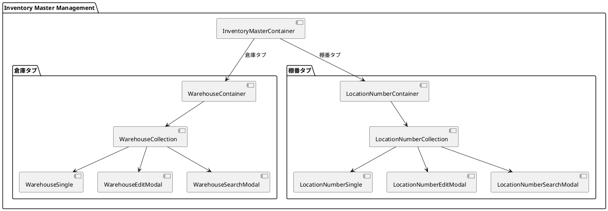
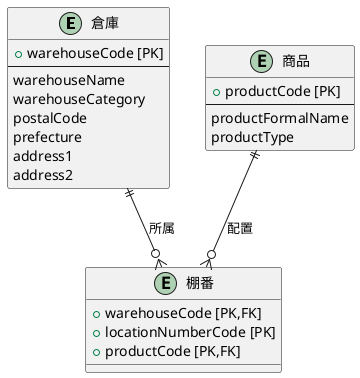
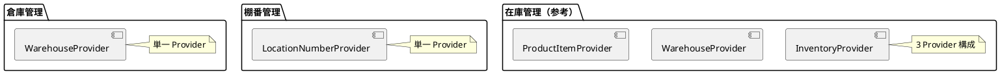
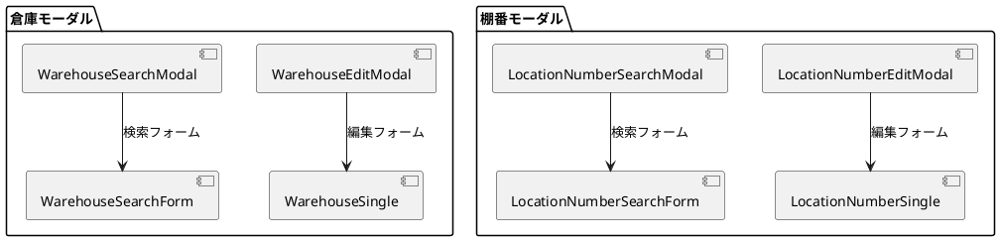
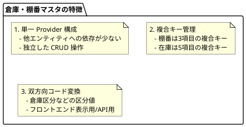

# 第17章: 倉庫・棚番マスタ

本章では、倉庫・棚番マスタの実装について解説します。在庫管理の基盤となるマスタデータの管理パターン、倉庫区分の双方向変換、複合キーによる棚番管理を説明します。

## 17.1 倉庫・棚番管理の構成

### タブによる画面構成

倉庫・棚番管理は「倉庫」と「棚番」の2つのタブで構成されます。



### InventoryMasterContainer

タブで画面を切り替えるルートコンテナです。

```typescript
import React from "react";
import {useTab} from "../../application/hooks.ts";
import {SiteLayout} from "../../../views/SiteLayout.tsx";
import {WarehouseContainer} from "./warehouse/WarehouseContainer.tsx";
import {LocationNumberContainer} from "./locationnumber/LocationNumberContainer.tsx";

export const InventoryMasterContainer: React.FC = () => {
    const {
        Tab,
        TabList,
        TabPanel,
        Tabs,
    } = useTab();

    return (
        <SiteLayout>
            <Tabs>
                <TabList>
                    <Tab>倉庫</Tab>
                    <Tab>棚番</Tab>
                </TabList>
                <TabPanel>
                    <WarehouseContainer/>
                </TabPanel>
                <TabPanel>
                    <LocationNumberContainer/>
                </TabPanel>
            </Tabs>
        </SiteLayout>
    );
}
```

## 17.2 倉庫マスタ

### 倉庫の型定義

```typescript
// models/master/warehouse.ts
import {PageNationType} from "../../views/application/PageNation.tsx";

export type WarehouseType = {
    warehouseCode: string;
    warehouseName: string;
    warehouseCategory?: string;    // 倉庫区分
    postalCode?: string;           // 郵便番号
    prefecture?: string;           // 都道府県
    address1?: string;             // 住所1
    address2?: string;             // 住所2
    checked?: boolean;
}

export type WarehouseFetchType = {
    list: WarehouseType[];
} & PageNationType;

export type WarehouseCriteriaType = {
    warehouseCode?: string;
    warehouseName?: string;
}
```

### 倉庫区分の双方向変換

倉庫区分はフロントエンドでは日本語表示、バックエンドではコードで管理します。

```typescript
// 表示用の倉庫区分をAPI用のコードに変換
const convertWarehouseCategoryToCode = (displayValue?: string): string | undefined => {
    if (!displayValue) return undefined;

    const categoryMap: { [key: string]: string } = {
        "通常倉庫": "N",
        "得意先": "C",
        "仕入先": "S",
        "部門倉庫": "D",
        "製品倉庫": "P",
        "原材料倉庫": "M"
    };

    return categoryMap[displayValue];
};

// API用のコードを表示用の倉庫区分に変換
const convertCodeToWarehouseCategory = (code?: string): string | undefined => {
    if (!code) return undefined;

    const codeMap: { [key: string]: string } = {
        "N": "通常倉庫",
        "C": "得意先",
        "S": "仕入先",
        "D": "部門倉庫",
        "P": "製品倉庫",
        "M": "原材料倉庫"
    };

    return codeMap[code];
};
```

### リソースマッピング関数

送受信時に倉庫区分を変換します。

```typescript
// APIへの送信時
export const mapToWarehouseResource = (warehouse: WarehouseType): WarehouseType => {
    return {
        ...warehouse,
        warehouseCategory: convertWarehouseCategoryToCode(warehouse.warehouseCategory)
    };
};

// APIからの受信時
export const mapFromWarehouseResource = (warehouse: WarehouseType): WarehouseType => {
    return {
        ...warehouse,
        warehouseCategory: convertCodeToWarehouseCategory(warehouse.warehouseCategory)
    };
};
```

### WarehouseContainer

単一 Provider のシンプルな構成です。

```typescript
import React, {useEffect} from "react";
import {showErrorMessage} from "../../../application/utils.ts";
import LoadingIndicator from "../../../../views/application/LoadingIndicatior.tsx";
import {WarehouseProvider, useWarehouseContext} from "../../../../providers/master/Warehouse.tsx";
import {WarehouseCollection} from "./WarehouseCollection.tsx";

export const WarehouseContainer: React.FC = () => {
    const Content: React.FC = () => {
        const {
            loading,
            setError,
            fetchWarehouses,
        } = useWarehouseContext();

        useEffect(() => {
            (async () => {
                try {
                    await fetchWarehouses.load();
                } catch (error: any) {
                    showErrorMessage(`倉庫情報の取得に失敗しました: ${error?.message}`, setError);
                }
            })();
        }, []);

        return (
            <>
                {loading ? (
                    <LoadingIndicator/>
                ) : (
                    <WarehouseCollection/>
                )}
            </>
        );
    };

    return (
        <WarehouseProvider>
            <Content/>
        </WarehouseProvider>
    );
};
```

### WarehouseCollection

一覧表示と CRUD 操作を管理します。

```typescript
export const WarehouseCollection: React.FC = () => {
    const {
        message,
        setMessage,
        error,
        setError,
        pageNation,
        criteria,
        setModalIsOpen,
        setIsEditing,
        setEditId,
        initialWarehouse,
        warehouses,
        setWarehouses,
        setNewWarehouse,
        searchWarehouseCriteria,
        setSearchWarehouseCriteria,
        fetchWarehouses,
        warehouseService,
        setSearchModalIsOpen,
    } = useWarehouseContext();

    const handleOpenModal = (warehouse?: WarehouseType) => {
        setMessage("");
        setError("");
        if (warehouse) {
            setNewWarehouse(warehouse);
            setEditId(warehouse.warehouseCode);
            setIsEditing(true);
        } else {
            setNewWarehouse(initialWarehouse);
            setIsEditing(false);
        }
        setModalIsOpen(true);
    };

    const handleDeleteWarehouse = async (warehouseCode: string) => {
        try {
            if (!window.confirm(`倉庫コード:${warehouseCode} を削除しますか？`)) return;
            await warehouseService.destroy(warehouseCode);
            await fetchWarehouses.load();
            setMessage("倉庫を削除しました。");
        } catch (error: any) {
            showErrorMessage(`倉庫の削除に失敗しました: ${error?.message}`, setError);
        }
    };

    // ... チェックボックス操作、一括削除
};
```

### WarehouseSingle

倉庫の登録・編集フォームです。

```typescript
export const WarehouseSingle: React.FC = () => {
    const {
        error,
        setError,
        message,
        setMessage,
        isEditing,
        newWarehouse,
        setNewWarehouse,
        initialWarehouse,
        fetchWarehouses,
        warehouseService,
        setModalIsOpen,
        editId,
        setEditId
    } = useWarehouseContext();

    const handleCreateOrUpdateWarehouse = async () => {
        const validateWarehouse = (): boolean => {
            if (!newWarehouse.warehouseCode.trim() || !newWarehouse.warehouseName.trim()) {
                setError("倉庫コード、倉庫名は必須項目です。");
                return false;
            }
            return true;
        };

        if (!validateWarehouse()) {
            return;
        }

        try {
            if (isEditing && editId) {
                await warehouseService.update(newWarehouse);
            } else {
                await warehouseService.create(newWarehouse);
            }
            setNewWarehouse(initialWarehouse);
            await fetchWarehouses.load();
            setMessage(isEditing ? "倉庫を更新しました。" : "倉庫を作成しました。");
            handleCloseModal();
        } catch (error: unknown) {
            showErrorMessage(error, setError, "倉庫の作成に失敗しました");
        }
    }

    // ...
};
```

## 17.3 棚番マスタ

### 棚番の型定義

棚番は倉庫コード、棚番コード、商品コードの3つの複合キーを持ちます。

```typescript
// models/master/locationnumber.ts
import {PageNationType} from "../../views/application/PageNation.tsx";

export type LocationNumberType = {
    warehouseCode: string;      // 複合キー1
    locationNumberCode: string; // 複合キー2
    productCode: string;        // 複合キー3
    checked?: boolean;
}

export type LocationNumberFetchType = {
    list: LocationNumberType[];
} & PageNationType;

export type LocationNumberCriteriaType = {
    warehouseCode?: string;
    locationNumberCode?: string;
    productCode?: string;
}
```

### 棚番とエンティティの関係



### LocationNumberContainer

棚番タブのコンテナです。

```typescript
import React, {useEffect} from "react";
import {showErrorMessage} from "../../../application/utils.ts";
import LoadingIndicator from "../../../../views/application/LoadingIndicatior.tsx";
import {LocationNumberProvider, useLocationNumberContext} from "../../../../providers/master/LocationNumber.tsx";
import {LocationNumberCollection} from "./LocationNumberCollection.tsx";

export const LocationNumberContainer: React.FC = () => {
    const Content: React.FC = () => {
        const {
            loading,
            setError,
            fetchLocationNumbers,
        } = useLocationNumberContext();

        useEffect(() => {
            (async () => {
                try {
                    await fetchLocationNumbers.load();
                } catch (error: any) {
                    showErrorMessage(`棚番情報の取得に失敗しました: ${error?.message}`, setError);
                }
            })();
        }, []);

        return (
            <>
                {loading ? (
                    <LoadingIndicator/>
                ) : (
                    <LocationNumberCollection/>
                )}
            </>
        );
    };

    return (
        <LocationNumberProvider>
            <Content/>
        </LocationNumberProvider>
    );
};
```

### LocationNumberCollection

複合キーによる一意識別が特徴です。

```typescript
export const LocationNumberCollection: React.FC = () => {
    const {
        message,
        setMessage,
        error,
        setError,
        pageNation,
        criteria,
        setModalIsOpen,
        setIsEditing,
        setEditId,
        initialLocationNumber,
        locationNumbers,
        setLocationNumbers,
        setNewLocationNumber,
        fetchLocationNumbers,
        locationNumberService,
    } = useLocationNumberContext();

    // 編集時は複合キーを連結して識別
    const handleOpenModal = (locationNumber?: LocationNumberType) => {
        setMessage("");
        setError("");
        if (locationNumber) {
            setNewLocationNumber(locationNumber);
            // 複合キーを連結
            setEditId(`${locationNumber.warehouseCode}-${locationNumber.locationNumberCode}-${locationNumber.productCode}`);
            setIsEditing(true);
        } else {
            setNewLocationNumber(initialLocationNumber);
            setIsEditing(false);
        }
        setModalIsOpen(true);
    };

    // 削除時は3つのキーすべてを渡す
    const handleDeleteLocationNumber = async (
        warehouseCode: string,
        locationNumberCode: string,
        productCode: string
    ) => {
        try {
            if (!window.confirm(`棚番:${warehouseCode}-${locationNumberCode}-${productCode} を削除しますか？`)) return;
            await locationNumberService.remove(warehouseCode, locationNumberCode, productCode);
            await fetchLocationNumbers.load(pageNation?.pageNum, criteria || undefined);
            setMessage("棚番を削除しました。");
        } catch (error: any) {
            showErrorMessage(`棚番の削除に失敗しました: ${error?.message}`, setError);
        }
    };

    // チェックボックスも複合キーで照合
    const handleCheckLocationNumber = (locationNumber: LocationNumberType) => {
        const newLocationNumbers = locationNumbers.map((ln: LocationNumberType) => {
            if (ln.warehouseCode === locationNumber.warehouseCode &&
                ln.locationNumberCode === locationNumber.locationNumberCode &&
                ln.productCode === locationNumber.productCode) {
                return {
                    ...ln,
                    checked: !ln.checked
                };
            }
            return ln;
        });
        setLocationNumbers(newLocationNumbers);
    }

    // ...
};
```

### LocationNumberSingle

棚番の登録・編集フォームです。

```typescript
export const LocationNumberSingle: React.FC = () => {
    const {
        error,
        setError,
        message,
        setMessage,
        isEditing,
        newLocationNumber,
        setNewLocationNumber,
        initialLocationNumber,
        fetchLocationNumbers,
        locationNumberService,
        setModalIsOpen,
        editId,
        setEditId
    } = useLocationNumberContext();

    const handleCreateOrUpdateLocationNumber = async () => {
        const validateLocationNumber = (): boolean => {
            // 3つの必須項目をバリデーション
            if (!newLocationNumber.warehouseCode.trim() ||
                !newLocationNumber.locationNumberCode.trim() ||
                !newLocationNumber.productCode.trim()) {
                setError("倉庫コード、棚番コード、商品コードは必須項目です。");
                return false;
            }
            return true;
        };

        if (!validateLocationNumber()) {
            return;
        }

        try {
            if (isEditing && editId) {
                await locationNumberService.update(newLocationNumber);
            } else {
                await locationNumberService.save(newLocationNumber);
            }
            setNewLocationNumber(initialLocationNumber);
            await fetchLocationNumbers.load(1);
            setMessage(isEditing ? "棚番を更新しました。" : "棚番を作成しました。");
            handleCloseModal();
        } catch (error: unknown) {
            showErrorMessage(error, setError, "棚番の作成に失敗しました");
        }
    }

    // ...
};
```

## 17.4 Provider 設計

### 倉庫 Provider

```typescript
// providers/master/Warehouse.tsx
type WarehouseContextType = {
    loading: boolean;
    setLoading: Dispatch<SetStateAction<boolean>>;
    message: string | null;
    setMessage: Dispatch<SetStateAction<string | null>>;
    error: string | null;
    setError: Dispatch<SetStateAction<string | null>>;
    pageNation: PageNationType | null;
    setPageNation: Dispatch<SetStateAction<PageNationType | null>>;
    criteria: WarehouseCriteriaType | null;
    setCriteria: Dispatch<SetStateAction<WarehouseCriteriaType | null>>;
    searchModalIsOpen: boolean;
    setSearchModalIsOpen: Dispatch<SetStateAction<boolean>>;
    modalIsOpen: boolean;
    setModalIsOpen: Dispatch<SetStateAction<boolean>>;
    isEditing: boolean;
    setIsEditing: Dispatch<SetStateAction<boolean>>;
    editId: string | null;
    setEditId: Dispatch<SetStateAction<string | null>>;
    initialWarehouse: WarehouseType;
    warehouses: WarehouseType[];
    setWarehouses: Dispatch<SetStateAction<WarehouseType[]>>;
    newWarehouse: WarehouseType;
    setNewWarehouse: Dispatch<SetStateAction<WarehouseType>>;
    searchWarehouseCriteria: WarehouseCriteriaType;
    setSearchWarehouseCriteria: Dispatch<SetStateAction<WarehouseCriteriaType>>;
    fetchWarehouses: { load: (page?: number, criteria?: WarehouseCriteriaType) => Promise<void> };
    warehouseService: WarehouseServiceType;
};

export const WarehouseProvider: React.FC<Props> = ({ children }) => {
    const [loading, setLoading] = useState<boolean>(false);
    const { message, setMessage, error, setError } = useMessage();
    const { pageNation, setPageNation, criteria, setCriteria } = usePageNation<WarehouseCriteriaType | null>();
    const { modalIsOpen: searchModalIsOpen, setModalIsOpen: setSearchModalIsOpen } = useModal();

    const { modalIsOpen, setModalIsOpen, isEditing, setIsEditing, editId, setEditId } = useModal();
    const {
        initialWarehouse,
        warehouses,
        setWarehouses,
        newWarehouse,
        setNewWarehouse,
        searchWarehouseCriteria,
        setSearchWarehouseCriteria,
        warehouseService
    } = useWarehouse();

    const fetchWarehouses = useFetchWarehouses(
        setLoading,
        setWarehouses,
        setPageNation,
        setError,
        showErrorMessage,
        warehouseService
    );

    // ...
};
```

### 棚番 Provider

```typescript
// providers/master/LocationNumber.tsx
type LocationNumberContextType = {
    loading: boolean;
    setLoading: Dispatch<SetStateAction<boolean>>;
    message: string | null;
    setMessage: Dispatch<SetStateAction<string | null>>;
    error: string | null;
    setError: Dispatch<SetStateAction<string | null>>;
    pageNation: PageNationType | null;
    setPageNation: Dispatch<SetStateAction<PageNationType | null>>;
    criteria: LocationNumberCriteriaType | null;
    setCriteria: Dispatch<SetStateAction<LocationNumberCriteriaType | null>>;
    searchModalIsOpen: boolean;
    setSearchModalIsOpen: Dispatch<SetStateAction<boolean>>;
    modalIsOpen: boolean;
    setModalIsOpen: Dispatch<SetStateAction<boolean>>;
    isEditing: boolean;
    setIsEditing: Dispatch<SetStateAction<boolean>>;
    editId: string | null;
    setEditId: Dispatch<SetStateAction<string | null>>;
    initialLocationNumber: LocationNumberType;
    locationNumbers: LocationNumberType[];
    setLocationNumbers: Dispatch<SetStateAction<LocationNumberType[]>>;
    newLocationNumber: LocationNumberType;
    setNewLocationNumber: Dispatch<SetStateAction<LocationNumberType>>;
    searchLocationNumberCriteria: LocationNumberCriteriaType;
    setSearchLocationNumberCriteria: Dispatch<SetStateAction<LocationNumberCriteriaType>>;
    fetchLocationNumbers: { load: (page?: number, criteria?: LocationNumberCriteriaType) => Promise<void> };
    locationNumberService: LocationNumberServiceType;
};
```

### Provider 構成の比較



## 17.5 サービス層

### 倉庫サービス

```typescript
// services/master/warehouse.ts
export interface WarehouseServiceType {
    select: (page?: number, pageSize?: number) => Promise<WarehouseFetchType>;
    find: (warehouseCode: string) => Promise<WarehouseType>;
    create: (warehouse: WarehouseType) => Promise<void>;
    update: (warehouse: WarehouseType) => Promise<void>;
    destroy: (warehouseCode: string) => Promise<void>;
    search: (criteria: WarehouseCriteriaType, page?: number, pageSize?: number) => Promise<WarehouseFetchType>;
}

export const WarehouseService = () => {
    const config = Config();
    const apiUtils = Utils.apiUtils;
    const endPoint = `${config.apiUrl}/warehouses`;

    const select = async (page?: number, pageSize?: number): Promise<WarehouseFetchType> => {
        const url = Utils.buildUrlWithPaging(endPoint, page, pageSize);
        const response = await apiUtils.fetchGet<WarehouseFetchType>(url);

        // レスポンスの warehouseCategory を UI 表示用に変換
        const convertedList = response.list.map(warehouse => mapFromWarehouseResource(warehouse));

        return {
            ...response,
            list: convertedList
        };
    };

    const create = async (warehouse: WarehouseType): Promise<void> => {
        // リクエスト時にコード変換
        await apiUtils.fetchPost<void>(endPoint, mapToWarehouseResource(warehouse));
    };

    const update = async (warehouse: WarehouseType): Promise<void> => {
        const url = `${endPoint}/${warehouse.warehouseCode}`;
        // リクエスト時にコード変換
        await apiUtils.fetchPut<void>(url, mapToWarehouseResource(warehouse));
    };

    // ...
};
```

### 棚番サービス

棚番は複合キーを URL パスに含めます。

```typescript
// services/master/locationnumber.ts
export interface LocationNumberServiceType {
    select: (page?: number, pageSize?: number) => Promise<LocationNumberFetchType>;
    find: (warehouseCode: string, locationNumberCode: string, productCode: string) => Promise<LocationNumberType>;
    save: (locationNumber: LocationNumberType) => Promise<void>;
    update: (locationNumber: LocationNumberType) => Promise<void>;
    remove: (warehouseCode: string, locationNumberCode: string, productCode: string) => Promise<void>;
    search: (criteria: LocationNumberCriteriaType, page?: number, pageSize?: number) => Promise<LocationNumberFetchType>;
    findByWarehouseCode: (warehouseCode: string) => Promise<LocationNumberType[]>;
    findByLocationNumberCode: (locationNumberCode: string) => Promise<LocationNumberType[]>;
}

export const LocationNumberService = () => {
    const config = Config();
    const apiUtils = Utils.apiUtils;
    const endPoint = `${config.apiUrl}/locationnumbers`;

    // 3つのキーを URL パスに含める
    const find = async (
        warehouseCode: string,
        locationNumberCode: string,
        productCode: string
    ): Promise<LocationNumberType> => {
        const url = `${endPoint}/${warehouseCode}/${locationNumberCode}/${productCode}`;
        return await apiUtils.fetchGet<LocationNumberType>(url);
    };

    const update = async (locationNumber: LocationNumberType): Promise<void> => {
        const resource = mapToLocationNumberResource(locationNumber);
        const url = `${endPoint}/${locationNumber.warehouseCode}/${locationNumber.locationNumberCode}/${locationNumber.productCode}`;
        await apiUtils.fetchPut(url, resource);
    };

    const remove = async (
        warehouseCode: string,
        locationNumberCode: string,
        productCode: string
    ): Promise<void> => {
        const url = `${endPoint}/${warehouseCode}/${locationNumberCode}/${productCode}`;
        await apiUtils.fetchDelete(url);
    };

    // 倉庫コードでフィルタリング
    const findByWarehouseCode = async (warehouseCode: string): Promise<LocationNumberType[]> => {
        const url = `${endPoint}/by-warehouse/${warehouseCode}`;
        return await apiUtils.fetchGet<LocationNumberType[]>(url);
    };

    // 棚番コードでフィルタリング
    const findByLocationNumberCode = async (locationNumberCode: string): Promise<LocationNumberType[]> => {
        const url = `${endPoint}/by-location/${locationNumberCode}`;
        return await apiUtils.fetchGet<LocationNumberType[]>(url);
    };

    // ...
};
```

### 複合キー URL パターンの比較

| エンティティ | キー数 | URL パターン |
|------------|-------|-------------|
| 倉庫 | 1 | `/warehouses/{warehouseCode}` |
| 棚番 | 3 | `/locationnumbers/{warehouseCode}/{locationNumberCode}/{productCode}` |
| 在庫 | 5 | `/inventories/{warehouseCode}/{productCode}/{lotNumber}/{stockCategory}/{qualityCategory}` |

## 17.6 モーダルコンポーネント

### 編集モーダル

共通パターンで実装します。

```typescript
// WarehouseEditModal.tsx
export const WarehouseEditModal: React.FC = () => {
    const {
        modalIsOpen,
        setModalIsOpen,
        setEditId,
        setError
    } = useWarehouseContext();

    const handleCloseModal = () => {
        setError("");
        setModalIsOpen(false);
        setEditId(null);
    };

    return (
        <Modal
            isOpen={modalIsOpen}
            onRequestClose={handleCloseModal}
            contentLabel="倉庫情報を入力"
            className="modal"
            overlayClassName="modal-overlay"
            bodyOpenClassName="modal-open"
        >
            <WarehouseSingle/>
        </Modal>
    )
}

// LocationNumberEditModal.tsx
export const LocationNumberEditModal: React.FC = () => {
    const {
        modalIsOpen,
        setModalIsOpen,
        setEditId,
        setError
    } = useLocationNumberContext();

    const handleCloseModal = () => {
        setError("");
        setModalIsOpen(false);
        setEditId(null);
    };

    return (
        <Modal
            isOpen={modalIsOpen}
            onRequestClose={handleCloseModal}
            contentLabel="棚番情報を入力"
            className="modal"
            overlayClassName="modal-overlay"
            bodyOpenClassName="modal-open"
        >
            <LocationNumberSingle/>
        </Modal>
    )
}
```

### モーダル構成



## 17.7 設計パターンの特徴

### マスタデータの設計方針



### 複合キー識別の実装パターン

```typescript
// 単一キー（倉庫）
const handleOpenModal = (warehouse?: WarehouseType) => {
    if (warehouse) {
        setEditId(warehouse.warehouseCode);  // 単一キー
    }
};

// 複合キー（棚番）
const handleOpenModal = (locationNumber?: LocationNumberType) => {
    if (locationNumber) {
        // 複合キーを連結
        setEditId(`${locationNumber.warehouseCode}-${locationNumber.locationNumberCode}-${locationNumber.productCode}`);
    }
};
```

### チェックボックス操作の比較

```typescript
// 単一キー照合
const handleCheckWarehouse = (warehouse: WarehouseType) => {
    const newWarehouses = warehouses.map((w: WarehouseType) => {
        if (w.warehouseCode === warehouse.warehouseCode) {
            return { ...w, checked: !w.checked };
        }
        return w;
    });
};

// 複合キー照合
const handleCheckLocationNumber = (locationNumber: LocationNumberType) => {
    const newLocationNumbers = locationNumbers.map((ln: LocationNumberType) => {
        // 3つのキーすべてで照合
        if (ln.warehouseCode === locationNumber.warehouseCode &&
            ln.locationNumberCode === locationNumber.locationNumberCode &&
            ln.productCode === locationNumber.productCode) {
            return { ...ln, checked: !ln.checked };
        }
        return ln;
    });
};
```

## まとめ

本章では、倉庫・棚番マスタの実装について解説しました。

- **タブ構成**: 倉庫と棚番の2タブ構成
- **倉庫マスタ**: 倉庫区分の双方向コード変換
- **棚番マスタ**: 3項目複合キーによる一意識別
- **Provider 設計**: マスタは単一 Provider のシンプル構成
- **サービス層**: 複合キーの URL パス埋め込みパターン
- **モーダル**: 編集・検索の共通パターン

次章では、CSV ファイルによる在庫一括登録機能について詳しく解説します。
