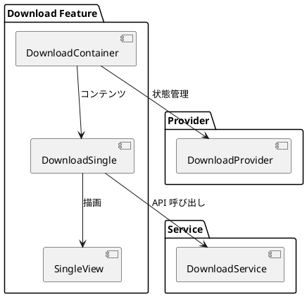
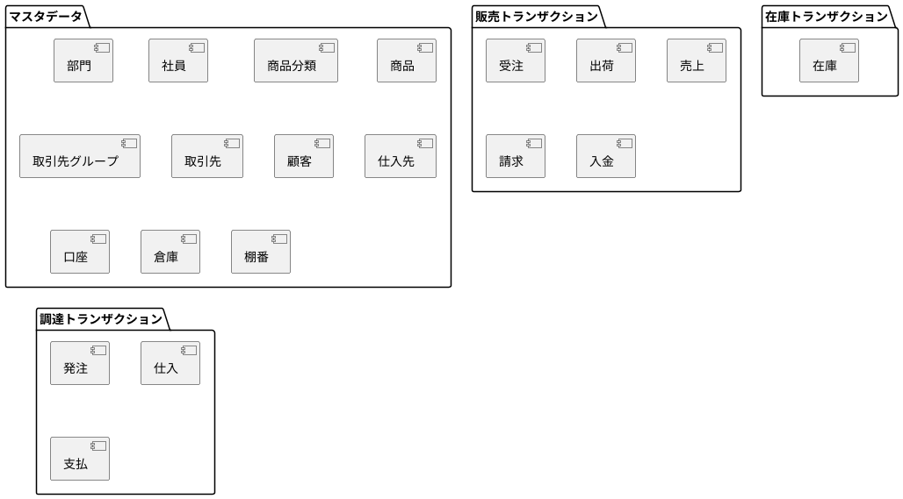
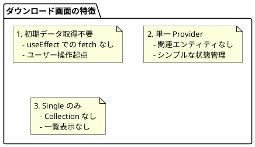
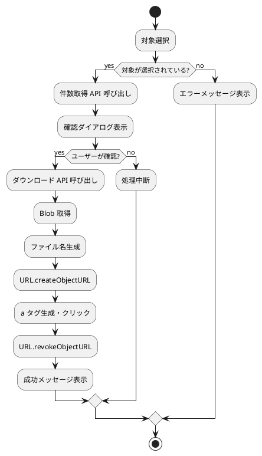
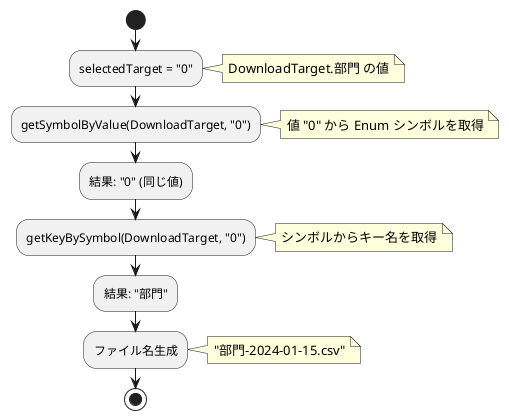

# 第18章: ダウンロード機能

本章では、システム機能の一つであるダウンロード機能の実装について解説します。マスタデータやトランザクションデータを CSV 形式でエクスポートする機能を通じて、Blob 処理やファイルダウンロードの実装パターンを説明します。

## 18.1 ダウンロード機能の概要

### 機能構成

ダウンロード機能は、シンプルな単一画面構成です。



### ダウンロード対象

システム内の主要なマスタデータとトランザクションデータをダウンロードできます。

```typescript
// models/system/download.ts
export enum DownloadTarget {
    部門 = "0",
    社員 = "1",
    商品分類 = "2",
    商品 = "3",
    取引先グループ = "4",
    取引先  = "5",
    顧客 = "6",
    仕入先 = "7",
    受注 = "8",
    出荷 = "9",
    売上 = "10",
    請求 = "11",
    入金 = "12",
    口座 = "13",
    発注 = "14",
    仕入 = "15",
    支払 = "16",
    在庫 = "17",
    倉庫 = "18",
    棚番 = "19"
}
```

### ダウンロード対象の分類



## 18.2 型定義

### ダウンロード条件型

```typescript
// models/system/download.ts
export type DownloadConditionType = {
    target: DownloadTarget;
};

export const mapToDownloadResource = (condition: DownloadConditionType) => {
    const isEmpty = (value: unknown) => value === "" || value === null || value === undefined;

    type Resource = {
        target: string;
    };

    if (isEmpty(condition.target)) {
        throw new Error("Target is required.");
    }

    const resource: Resource = {
        target: condition.target,
    };

    return resource;
};
```

### Enum ユーティリティ

ダウンロードファイル名生成のために、Enum の値とキー名を相互変換するユーティリティを使用します。

```typescript
// models/utils.ts
// ジェネリクスを使用した汎用的な値からシンボルを取得する関数
export const getSymbolByValue = <T extends Record<string, string | number>>(
    obj: T,
    value: T[keyof T]
): T[keyof T] | undefined => {
    const entries = Object.entries(obj) as [keyof T, T[keyof T]][];
    for (const [key, val] of entries) {
        if (val === value) {
            return obj[key];
        }
    }
    return undefined;
};

// ジェネリクスを使用した汎用的なシンボルからキー名を取得する関数
export const getKeyBySymbol = <T extends Record<string, string | number>>(
    obj: T,
    symbol: T[keyof T]
): keyof T | undefined => {
    const entries = Object.entries(obj) as [keyof T, T[keyof T]][];
    for (const [key, val] of entries) {
        if (val === symbol) {
            return key;
        }
    }
    return undefined;
};
```

## 18.3 DownloadContainer

### コンテナコンポーネント

シンプルな Provider ラッピング構成です。

```typescript
import React from "react";
import {SiteLayout} from "../../../views/SiteLayout.tsx";
import LoadingIndicator from "../../../views/application/LoadingIndicatior.tsx";
import {DownloadProvider, useDownloadContext} from "../../../providers/system/Download.tsx";
import {DownloadSingle} from "./DownloadSingle.tsx";

export const DownloadContainer: React.FC = () => {
    const Content: React.FC = () => {
        const {
            loading,
        } = useDownloadContext();

        return (
            <>
                {loading ? (
                    <LoadingIndicator />
                ) : (
                    <DownloadSingle/>
                )}
            </>
        );
    };

    return (
        <SiteLayout>
            <DownloadProvider>
                <Content />
            </DownloadProvider>
        </SiteLayout>
    );
};
```

### 構成の特徴



## 18.4 DownloadSingle

### ダウンロード処理の実装

```typescript
import React from "react";
import {useDownloadContext} from "../../../providers/system/Download.tsx";
import {getKeyBySymbol, getSymbolByValue} from "../../../models/utils.ts";
import {DownloadTarget} from "../../../models/system/download.ts";
import {showErrorMessage} from "../../application/utils.ts";
import {SingleView} from "../../../views/system/download/DownloadSingle.tsx";

export const DownloadSingle: React.FC = () => {
    const {
        setLoading,
        message,
        setMessage,
        error,
        setError,
        selectedTarget,
        setSelectedTarget,
        downloadService,
    } = useDownloadContext();

    const handleDownload = async () => {
        // 1. バリデーション
        if (!selectedTarget) {
            setError("ダウンロード対象を選択してください。");
            return;
        }
        setLoading(true);
        setMessage("");
        setError("");

        try {
            // 2. 件数取得と確認
            const condition = { target: selectedTarget };
            const downloadCount = await downloadService.count(condition);
            const isProceed = confirm(`${downloadCount}件ダウンロードします。よろしいですか？`);
            if (!isProceed) return;

            // 3. Blob 取得
            const blob = await downloadService.download(condition);

            // 4. ファイル名生成
            const currentDate = new Date().toISOString().split("T")[0];
            const symbol = getSymbolByValue(DownloadTarget, selectedTarget);
            const symbolName = getKeyBySymbol(DownloadTarget, symbol?.toString() as DownloadTarget) ?? "unknown";
            const downloadFileName = `${symbolName}-${currentDate}.csv`;

            // 5. ダウンロード実行
            const url = window.URL.createObjectURL(blob);
            const a = document.createElement("a");
            a.href = url;
            a.download = downloadFileName;
            a.click();
            window.URL.revokeObjectURL(url);

            setMessage(`${symbolName} データをダウンロードしました。`);
        } catch (error: any) {
            showErrorMessage(
                `ダウンロードに失敗しました: ${error?.message}`,
                setError
            );
        } finally {
            setLoading(false);
        }
    };

    return (
        <SingleView
            error={error}
            message={message}
            formItems={{
                selectedTarget,
                setSelectedTarget,
            }}
            headerActions={{
                handleDownload,
            }}
        />
    );
}
```

### ダウンロード処理フロー



### Blob ダウンロードの実装パターン

```typescript
// ブラウザでのファイルダウンロード
const downloadFile = (blob: Blob, fileName: string) => {
    // Blob から Object URL を生成
    const url = window.URL.createObjectURL(blob);

    // ダウンロード用のリンク要素を作成
    const a = document.createElement("a");
    a.href = url;
    a.download = fileName;  // ダウンロード時のファイル名

    // プログラムでクリックしてダウンロード開始
    a.click();

    // メモリ解放のため URL を revoke
    window.URL.revokeObjectURL(url);
};
```

## 18.5 View コンポーネント

### SingleView

```typescript
// views/system/download/DownloadSingle.tsx
import {DownloadTarget} from "../../../models/system/download.ts";
import React from "react";
import {Message} from "../../../components/application/Message.tsx";
import {getKeyBySymbol} from "../../../models/utils.ts";

interface FormProps {
    selectedTarget: DownloadTarget | null;
    setSelectedTarget: React.Dispatch<React.SetStateAction<DownloadTarget | null>>;
}

const Form: React.FC<FormProps> = ({selectedTarget, setSelectedTarget}) => {
    return (
        <div className="single-view-content-item-form">
            <label htmlFor="downloadTarget" className="form-label">
                ダウンロード対象
            </label>
            <select
                id="downloadTarget"
                value={selectedTarget ?? ""}
                onChange={(e) => setSelectedTarget(e.target.value as DownloadTarget)}
                className="dropdown"
            >
                <option value="" disabled>
                    対象を選択してください
                </option>
                <option value={DownloadTarget.部門}>{getKeyBySymbol(DownloadTarget, DownloadTarget.部門)}</option>
                <option value={DownloadTarget.社員}>{getKeyBySymbol(DownloadTarget, DownloadTarget.社員)}</option>
                {/* ... 他のオプション */}
            </select>
        </div>
    );
};

interface SingleViewProps {
    error: string | null;
    message: string | null;
    formItems: {
        selectedTarget: DownloadTarget | null;
        setSelectedTarget: React.Dispatch<React.SetStateAction<DownloadTarget | null>>;
    };
    headerActions: {
        handleDownload: () => Promise<void>;
    };
}

export const SingleView: React.FC<SingleViewProps> = ({
    error,
    message,
    formItems,
    headerActions,
}) => {
    const { selectedTarget, setSelectedTarget } = formItems;
    const { handleDownload } = headerActions;

    return (
        <div className="single-view-object-container">
            <Message error={error} message={message}/>
            <div className="single-view-header">
                <div>
                    <div className="single-view-header-item">
                        <h1 className="single-view-title">{"ダウンロード"}</h1>
                    </div>
                    <div className="single-view-header-item">
                        <div className="button-container">
                            <button className="action-button" onClick={handleDownload} id="download">
                                {"実行"}
                            </button>
                        </div>
                    </div>
                </div>
            </div>
            <div className="single-view-container">
                <div className="single-view-content">
                    <div className="single-view-content-item">
                        <Form
                            selectedTarget={selectedTarget}
                            setSelectedTarget={setSelectedTarget}
                        />
                    </div>
                </div>
            </div>
        </div>
    );
};
```

### Enum からオプションリスト生成

```typescript
// getKeyBySymbol を使用して日本語ラベルを表示
<option value={DownloadTarget.部門}>
    {getKeyBySymbol(DownloadTarget, DownloadTarget.部門)}  {/* "部門" */}
</option>
<option value={DownloadTarget.社員}>
    {getKeyBySymbol(DownloadTarget, DownloadTarget.社員)}  {/* "社員" */}
</option>
```

## 18.6 Provider 設計

### DownloadProvider

```typescript
// providers/system/Download.tsx
import React, { createContext, useContext, ReactNode, useState, useMemo, Dispatch, SetStateAction } from "react";
import { useMessage } from "../../components/application/Message.tsx";
import {DownloadTarget} from "../../models/system/download.ts";
import {DownloadService} from "../../services/system/download.ts";

type DownloadContextType = {
    loading: boolean;
    setLoading: Dispatch<SetStateAction<boolean>>;
    message: string | null;
    setMessage: Dispatch<SetStateAction<string | null>>;
    error: string | null;
    setError: Dispatch<SetStateAction<string | null>>;
    selectedTarget: DownloadTarget | null;
    setSelectedTarget: Dispatch<SetStateAction<DownloadTarget | null>>;
    downloadService: ReturnType<typeof DownloadService>;
};

const DownloadContext = createContext<DownloadContextType | undefined>(undefined);

export const useDownloadContext = () => {
    const context = useContext(DownloadContext);
    if (!context) {
        throw new Error("useDownloadContext must be used within a DownloadProvider");
    }
    return context;
};

export const DownloadProvider: React.FC<Props> = ({ children }) => {
    const [loading, setLoading] = useState<boolean>(false);
    const { message, setMessage, error, setError } = useMessage();
    const [selectedTarget, setSelectedTarget] = useState<DownloadTarget | null>(null);
    const downloadService = DownloadService();

    const value = useMemo(
        () => ({
            loading,
            setLoading,
            message,
            setMessage,
            error,
            setError,
            selectedTarget,
            setSelectedTarget,
            downloadService,
        }),
        [loading, message, setMessage, error, setError, selectedTarget, downloadService]
    );

    return <DownloadContext.Provider value={value}>{children}</DownloadContext.Provider>;
};
```

### Provider の特徴

| 項目 | ダウンロード Provider | 一般的な Provider |
|-----|---------------------|------------------|
| 初期データ | なし | あり（fetch） |
| 一覧データ | なし | あり（list） |
| CRUD 操作 | なし | あり |
| ページネーション | なし | あり |
| 検索条件 | なし | あり |

## 18.7 サービス層

### DownloadService

```typescript
// services/system/download.ts
import Config from "../config.ts";
import Utils from "../utils.ts";
import {DownloadConditionType, mapToDownloadResource} from "../../models/system/download.ts";

export interface DownloadServiceType {
    download: (condition: DownloadConditionType) => Promise<Blob>;
    count: (condition: DownloadConditionType) => Promise<number>;
}

export const DownloadService = (): DownloadServiceType => {
    const config = Config();
    const apiUtils = Utils.apiUtils;
    const endPoint = `${config.apiUrl}/downloads`;

    const download = (condition: DownloadConditionType): Promise<Blob> => {
        const url = `${endPoint}/download`;
        const resource = mapToDownloadResource(condition);
        return apiUtils.fetchPostDownload(url, resource);
    };

    const count = (condition: DownloadConditionType): Promise<number> => {
        const url = `${endPoint}/count`;
        const resource = mapToDownloadResource(condition);
        return apiUtils.fetchPost(url, resource);
    };

    return {
        download,
        count,
    };
};
```

### API ユーティリティ

```typescript
// services/utils.ts
const fetchPostDownload = async (url: string, body: unknown): Promise<Blob> => {
    const config = Config();
    try {
        const res = await fetch(url, {
            method: "POST",
            headers: {
                "Content-Type": "application/json",
                "Authorization": config.authHeader
            },
            body: JSON.stringify(body)
        });
        if (!res.ok) {
            return res.blob().then(e => {
                throw e;
            });
        }
        // JSON ではなく Blob として返す
        return await res.blob();
    } catch (err) {
        console.log(err);
        throw err;
    }
};
```

### API メソッドの比較

| メソッド | 用途 | 戻り値 |
|---------|------|-------|
| fetchGet | 一覧・詳細取得 | `Promise<T>` (JSON) |
| fetchPost | 登録・検索 | `Promise<T>` (JSON) |
| fetchPut | 更新 | `Promise<T>` (JSON) |
| fetchDelete | 削除 | `Promise<T>` (JSON) |
| fetchGetDownload | GET ダウンロード | `Promise<Blob>` |
| fetchPostDownload | POST ダウンロード | `Promise<Blob>` |
| fetchPostFormData | ファイルアップロード | `Promise<T>` (JSON) |

## 18.8 ファイル名生成パターン

### 日付付きファイル名

```typescript
// ファイル名: {対象名}-{日付}.csv
// 例: 部門-2024-01-15.csv

const generateFileName = (target: DownloadTarget): string => {
    // 現在日付を YYYY-MM-DD 形式で取得
    const currentDate = new Date().toISOString().split("T")[0];

    // Enum 値から日本語キー名を取得
    const symbol = getSymbolByValue(DownloadTarget, target);
    const symbolName = getKeyBySymbol(DownloadTarget, symbol?.toString() as DownloadTarget) ?? "unknown";

    return `${symbolName}-${currentDate}.csv`;
};
```

### Enum 値変換の流れ



## まとめ

本章では、ダウンロード機能の実装について解説しました。

- **シンプルな構成**: Container → Single の2層構成
- **Blob 処理**: `fetchPostDownload` による Blob 取得
- **ファイルダウンロード**: `URL.createObjectURL` パターン
- **Enum ユーティリティ**: 値とキー名の相互変換
- **件数確認**: ダウンロード前の件数確認 UX

次章では、監査機能の実装について詳しく解説します。
