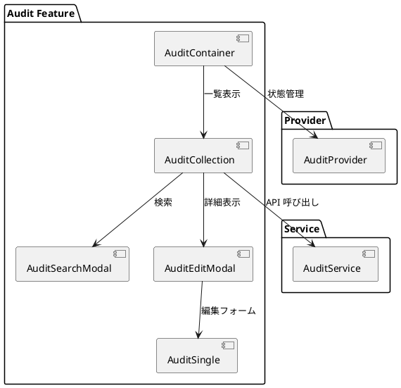
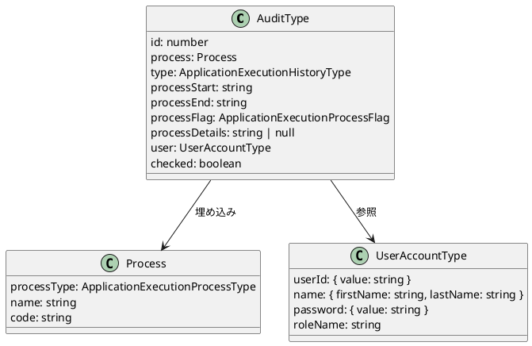
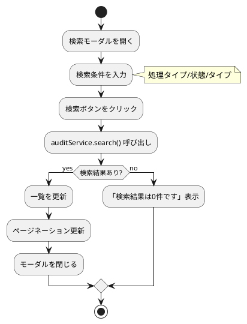

# 第19章: 監査機能

本章では、システム機能の一つである監査機能の実装について解説します。アプリケーション実行履歴の管理を通じて、システム運用に必要な監査証跡の記録・参照パターンを説明します。

## 19.1 監査機能の概要

### 機能構成

監査機能は、標準的な Collection/Single パターンで構成されます。



### 監査対象の処理タイプ

システム内の主要な操作を監査対象として記録します。

```typescript
// models/system/audit.ts
export enum ApplicationExecutionProcessType {
    ユーザー登録 = "ユーザー登録",
    ユーザー更新 = "ユーザー更新",
    ユーザー削除 = "ユーザー削除",
    部門登録 = "部門登録",
    部門更新 = "部門更新",
    部門削除 = "部門削除",
    社員登録 = "社員登録",
    社員更新 = "社員更新",
    社員削除 = "社員削除",
    商品分類登録 = "商品分類登録",
    商品分類更新 = "商品分類更新",
    商品分類削除 = "商品分類削除",
    商品登録 = "商品登録",
    商品更新 = "商品更新",
    商品削除 = "商品削除",
    取引先グループ登録 = "取引先グループ登録",
    取引先グループ更新 = "取引先グループ更新",
    取引先グループ削除 = "取引先グループ削除",
    取引先分類種別登録 = "取引先分類登録",
    取引先分類種別更新 = "取引先分類更新",
    取引先分類種別削除 = "取引先分類削除",
    地域登録 = "地域登録",
    地域更新 = "地域更新",
    地域削除 = "地域削除",
    取引先登録 = "取引先登録",
    取引先更新 = "取引先更新",
    取引先削除 = "取引先削除",
    顧客登録 = "顧客登録",
    顧客更新 = "顧客更新",
    顧客削除 = "顧客削除",
    仕入先登録 = "仕入先登録",
    仕入先更新 = "仕入先更新",
    仕入先削除 = "仕入先削除",
    データダウンロード = "データダウンロード",
    その他 = "その他",
}
```

### 実行履歴のステータス

```typescript
// 実行タイプ
export enum ApplicationExecutionHistoryType {
    同期 = "同期",
    非同期 = "非同期",
}

// 実行状態
export enum ApplicationExecutionProcessFlag {
    実行中 = "実行中",
    実行済 = "実行済",
    エラー = "エラー",
    未実行 = "未実行",
}
```

## 19.2 型定義

### 監査レコード型

```typescript
// models/system/audit.ts
import {PageNationType} from "../../views/application/PageNation.tsx";
import {UserAccountType} from "./user.ts";

type Process = {
    processType: ApplicationExecutionProcessType;
    name: string;
    code: string;
};

export type AuditType = {
    id: number;
    process: Process;                              // プロセス情報
    type: ApplicationExecutionHistoryType;         // 同期/非同期
    processStart: string;                          // 開始日時 (ISO 8601)
    processEnd: string;                            // 終了日時 (ISO 8601)
    processFlag: ApplicationExecutionProcessFlag;  // 実行状態
    processDetails: string | null;                 // 詳細情報
    user: UserAccountType;                         // 実行ユーザー
    checked: boolean;                              // 選択状態
};

export type AuditFetchType = {
    list: AuditType[];
} & PageNationType;
```

### 検索条件型

```typescript
export type AuditCriteriaType = {
    processType?: ApplicationExecutionProcessType;
    processFlag?: ApplicationExecutionProcessFlag;
    type?: ApplicationExecutionHistoryType;
}

export const mapToCriteriaResource = (criteria: AuditCriteriaType) => {
    const isEmpty = (value: unknown) => value === "" || value === null || value === undefined;
    type Resource = {
        process?: {
            processType?: string;
        };
        processFlag?: string;
        type?: string;
    };
    const resource: Resource = {
        ...(isEmpty(criteria.processFlag) ? {} : { processFlag: criteria.processFlag }),
        process: {
            ...(isEmpty(criteria.processType) ? {} : { processType: criteria.processType }),
        },
        ...(isEmpty(criteria.type) ? {} : { type: criteria.type }),
    };

    return resource;
};
```

### 監査データ構造



## 19.3 AuditContainer

### コンテナコンポーネント

初期ロード時に実行履歴を取得します。

```typescript
import React, {useEffect} from "react";
import {SiteLayout} from "../../../views/SiteLayout.tsx";
import LoadingIndicator from "../../../views/application/LoadingIndicatior.tsx";
import {AuditProvider, useAuditContext} from "../../../providers/system/Audit.tsx";
import {AuditCollection} from "./AuditCollection.tsx";

export const AuditContainer: React.FC = () => {
    const Content: React.FC = () => {
        const {
            loading,
            fetchAudits,
        } = useAuditContext();

        useEffect(() => {
            fetchAudits.load().then(() => {
            });
        }, []);

        return (
            <>
                {loading ? (
                    <LoadingIndicator/>
                ) : (
                    <AuditCollection/>
                )}
            </>
        );
    };

    return (
        <SiteLayout>
            <AuditProvider>
                <Content/>
            </AuditProvider>
        </SiteLayout>
    );
};
```

## 19.4 AuditCollection

### 一覧表示と操作

```typescript
import React from "react";
import {useAuditContext} from "../../../providers/system/Audit.tsx";
import {AuditType} from "../../../models/system/audit.ts";
import {showErrorMessage} from "../../application/utils.ts";
import {AuditCollectionView} from "../../../views/system/audit/AuditCollection.tsx";
import {AuditSearchModal} from "./AuditSearchModal.tsx";
import {AuditEditModal} from "./AuditEditModal.tsx";

export const AuditCollection: React.FC = () => {
    const {
        message,
        setMessage,
        error,
        setError,
        pageNation,
        criteria,
        setSearchModalIsOpen,
        setModalIsOpen,
        setIsEditing,
        initialAudit,
        audits,
        setAudits,
        setNewAudit,
        searchAuditCriteria,
        setSearchAuditCriteria,
        fetchAudits,
        auditService,
    } = useAuditContext();

    // 詳細モーダルを開く
    const handleOpenModal = (audit?: AuditType) => {
        setMessage("");
        setError("");
        if (audit) {
            setNewAudit(audit);
            setIsEditing(true);
        } else {
            setNewAudit(initialAudit);
            setIsEditing(false);
        }
        setModalIsOpen(true);
    };

    // 削除処理
    const handleDeleteAudit = async (auditId: number) => {
        try {
            if (!window.confirm(`実行履歴ID:${auditId} を削除しますか？`)) return;
            await auditService.destroy(auditId);
            await fetchAudits.load(pageNation?.pageNum, searchAuditCriteria);
            setMessage("アプリケーション実行履歴情報を削除しました。");
        } catch (error: any) {
            showErrorMessage(`アプリケーション実行履歴情報の削除に失敗しました: ${error?.message}`, setError);
        }
    };

    // チェックボックス操作
    const handleCheckAudit = (audit: AuditType) => {
        const newAudit = audits.map((d) => {
            if (d.id === audit.id) {
                return { ...d, checked: !d.checked };
            }
            return d;
        });
        setAudits(newAudit);
    }

    // 一括削除
    const handleDeleteCheckedCollection = async () => {
        const checkedAudits = audits.filter((d) => d.checked);
        if (!checkedAudits.length) {
            setError("削除する履歴を選択してください。");
            return;
        }

        try {
            if (!window.confirm("選択した履歴を削除しますか？")) return;
            await Promise.all(checkedAudits.map((d) => auditService.destroy(d.id)));
            await fetchAudits.load(pageNation?.pageNum, searchAuditCriteria);
            setMessage("選択した履歴を削除しました。");
        } catch (error: any) {
            showErrorMessage(`選択した履歴の削除に失敗しました: ${error?.message}`, setError);
        }
    }

    return (
        <>
            <AuditSearchModal/>
            <AuditEditModal/>
            <AuditCollectionView
                error={error}
                message={message}
                searchItems={{
                    searchAuditCriteria,
                    setSearchAuditCriteria,
                    handleOpenSearchModal: () => setSearchModalIsOpen(true),
                }}
                menuButtonItems={{
                    handleReloadCollection: fetchAudits.load,
                    handleCheckToggleCollection: handleCheckAllAudit,
                    handleDeleteCheckedCollection,
                }}
                collectionItems={{
                    handleOpenModal,
                    audits,
                    handleDeleteAudit,
                    handleCheckAudit,
                }}
                pageNationItems={{
                    pageNation,
                    criteria,
                    fetchAudits: fetchAudits.load
                }}
            />
        </>
    );
}
```

### 監査一覧の特徴

| 項目 | 監査機能 | 一般的なマスタ |
|-----|---------|-------------|
| 新規登録 | なし（システム自動生成） | あり |
| 編集 | 参照のみ | あり |
| 削除 | あり | あり |
| 検索 | あり（3条件） | あり |
| 一括削除 | あり | あり |
| 再読込 | あり | なし（通常） |

## 19.5 検索機能

### AuditSearchModal

3つの条件で検索できます。

```typescript
import React from "react";
import {useAuditContext} from "../../../providers/system/Audit.tsx";
import Modal from "react-modal";
import {AuditSearchSingleView} from "../../../views/system/audit/AuditSearch.tsx";
import {showErrorMessage} from "../../application/utils.ts";

export const AuditSearchModal: React.FC = () => {
    const {
        setLoading,
        setMessage,
        setError,
        setPageNation,
        setCriteria,
        searchModalIsOpen,
        setSearchModalIsOpen,
        setAudits,
        searchAuditCriteria,
        setSearchAuditCriteria,
        auditService,
    } = useAuditContext();

    const handleCloseSearchModal = () => {
        setSearchModalIsOpen(false);
    }

    return (
        <Modal
            isOpen={searchModalIsOpen}
            onRequestClose={handleCloseSearchModal}
            contentLabel="検索情報を入力"
            className="modal"
            overlayClassName="modal-overlay"
            bodyOpenClassName="modal-open"
        >
            <AuditSearchSingleView
                criteria={searchAuditCriteria}
                setCondition={setSearchAuditCriteria}
                handleSelect={async () => {
                    if (!searchAuditCriteria) {
                        return;
                    }
                    setLoading(true);
                    try {
                        const fetchedAudit = await auditService.search(searchAuditCriteria);
                        setAudits(fetchedAudit ? fetchedAudit.list : []);
                        if (fetchedAudit.list.length === 0) {
                            showErrorMessage(`検索結果は0件です`, setError);
                        } else {
                            setCriteria(searchAuditCriteria);
                            setPageNation(fetchedAudit);
                            setMessage("");
                            setError("");
                        }
                    } catch (error: any) {
                        showErrorMessage(`実行履歴情報の検索に失敗しました: ${error?.message}`, setError);
                    } finally {
                        setLoading(false);
                    }
                }}
                handleClose={handleCloseSearchModal}
            />
        </Modal>
    )
}
```

### 検索条件 View

Enum を使用したドロップダウン選択です。

```typescript
// views/system/audit/AuditSearch.tsx
import React from "react";
import {
    ApplicationExecutionHistoryType,
    ApplicationExecutionProcessFlag,
    ApplicationExecutionProcessType,
    AuditCriteriaType
} from "../../../models/system/audit.ts";
import {FormSelect} from "../../Common.tsx";

const Form = ({criteria, setCondition, handleClick, handleClose}: FormProps) => {
    return (
        <div className="single-view-content-item-form">
            {/* 処理タイプ */}
            <FormSelect
                id={"search-process-type"}
                label={"処理"}
                value={criteria.processType}
                options={ApplicationExecutionProcessType}
                onChange={(e) => setCondition({...criteria, processType: e})}
            />
            {/* 実行状態 */}
            <FormSelect
                id={"search-process-flag"}
                label={"状態"}
                value={criteria.processFlag}
                options={ApplicationExecutionProcessFlag}
                onChange={(e) => setCondition({...criteria, processFlag: e})}
            />
            {/* 実行タイプ */}
            <FormSelect
                id={"search-type"}
                label={"タイプ"}
                value={criteria.type}
                options={ApplicationExecutionHistoryType}
                onChange={(e) => setCondition({...criteria, type: e})}
            />
            <div className="button-container">
                <button className="action-button" onClick={handleClick}>検索</button>
                <button className="action-button" onClick={handleClose}>キャンセル</button>
            </div>
        </div>
    )
};
```

### 検索フロー



## 19.6 Provider 設計

### AuditProvider

```typescript
// providers/system/Audit.tsx
type AuditContextType = {
    loading: boolean;
    setLoading: Dispatch<SetStateAction<boolean>>;
    message: string | null;
    setMessage: Dispatch<SetStateAction<string | null>>;
    error: string | null;
    setError: Dispatch<SetStateAction<string | null>>;
    pageNation: PageNationType | null;
    setPageNation: Dispatch<SetStateAction<PageNationType | null>>;
    criteria: AuditCriteriaType | null;
    setCriteria: Dispatch<SetStateAction<AuditCriteriaType | null>>;
    searchModalIsOpen: boolean;
    setSearchModalIsOpen: Dispatch<SetStateAction<boolean>>;
    modalIsOpen: boolean;
    setModalIsOpen: Dispatch<SetStateAction<boolean>>;
    isEditing: boolean;
    setIsEditing: Dispatch<SetStateAction<boolean>>;
    editId: string | null;
    setEditId: Dispatch<SetStateAction<string | null>>;
    initialAudit: AuditType;
    audits: AuditType[];
    setAudits: Dispatch<SetStateAction<AuditType[]>>;
    newAudit: AuditType;
    setNewAudit: Dispatch<SetStateAction<AuditType>>;
    searchAuditCriteria: AuditCriteriaType;
    setSearchAuditCriteria: Dispatch<SetStateAction<AuditCriteriaType>>;
    fetchAudits: { load: (page?: number, criteria?: AuditCriteriaType) => Promise<void> };
    auditService: AuditServiceType;
};

export const AuditProvider: React.FC<Props> = ({ children }) => {
    const [loading, setLoading] = useState<boolean>(false);
    const { message, setMessage, error, setError } = useMessage();
    const { pageNation, setPageNation, criteria, setCriteria } = usePageNation<AuditCriteriaType>();
    const { modalIsOpen, setModalIsOpen, isEditing, setIsEditing, editId, setEditId } = useModal();
    const {
        initialAudit,
        audits,
        setAudits,
        newAudit,
        setNewAudit,
        searchAuditCriteria,
        setSearchAuditCriteria,
        auditService
    } = useAudit();
    const fetchAudits = useFetchAudits(
        setLoading,
        setAudits,
        setPageNation,
        setError,
        showErrorMessage,
        auditService
    );
    const { modalIsOpen: searchModalIsOpen, setModalIsOpen: setSearchModalIsOpen } = useModal();

    // ...
};
```

## 19.7 カスタムフック

### useAudit

監査データの状態管理フックです。

```typescript
// components/system/audit/hooks/audit.ts
import {
    ApplicationExecutionHistoryType,
    ApplicationExecutionProcessFlag,
    ApplicationExecutionProcessType,
    AuditCriteriaType,
    AuditType
} from "../../../../models/system/audit.ts";
import {useState} from "react";
import {AuditService, AuditServiceType} from "../../../../services/system/audit.ts";

export const useAudit = () => {
    // 初期値
    const initialAudit = {
        id: 0,
        process: {
            processType: ApplicationExecutionProcessType.その他,
            name: "",
            code: ""
        },
        type: ApplicationExecutionHistoryType.同期,
        processStart: new Date().toISOString(),
        processEnd: new Date().toISOString(),
        processFlag: ApplicationExecutionProcessFlag.未実行,
        processDetails: null,
        user: {
            userId: { value: "" },
            name: { firstName: "", lastName: "" },
            password: { value: "" },
            roleName: ""
        },
        checked: false
    };

    const initialSearchAuditCriteria = {}

    const [audits, setAudits] = useState<AuditType[]>([]);
    const [newAudit, setNewAudit] = useState<AuditType>(initialAudit);
    const [searchAuditCriteria, setSearchAuditCriteria] = useState<AuditCriteriaType>(initialSearchAuditCriteria);
    const auditService = AuditService();

    return {
        initialAudit,
        initialSearchAuditCriteria,
        audits,
        setAudits,
        newAudit,
        setNewAudit,
        searchAuditCriteria,
        setSearchAuditCriteria,
        auditService
    };
};
```

### useFetchAudits

データ取得フックです。検索条件の有無で API を切り替えます。

```typescript
export const useFetchAudits = (
    setLoading: (loading: boolean) => void,
    setList: (list: AuditType[]) => void,
    setPageNation: (pageNation: PageNationType) => void,
    setError: (error: string) => void,
    showErrorMessage: (message: string, callback: (error: string) => void) => void,
    service: AuditServiceType
) => {
    const load = async (page: number = 1, criteria?: AuditCriteriaType): Promise<void> => {
        const ERROR_MESSAGE = "アプリケーション実行履歴情報の取得に失敗しました:";
        setLoading(true);

        try {
            // 検索条件の有無で API を切り替え
            const fetchAudits = async (criteria?: AuditCriteriaType, page: number = 1) => {
                return criteria ? service.search(criteria, page) : service.select(page);
            };

            const result = await fetchAudits(criteria, page);

            setList(result.list);
            setPageNation(result);
            setError("");
        } catch (error: unknown) {
            const errorMessage = error instanceof Error ? error.message : '不明なエラーが発生しました';
            showErrorMessage(`${ERROR_MESSAGE} ${errorMessage}`, setError);
        } finally {
            setLoading(false);
        }
    };

    return { load };
};
```

## 19.8 サービス層

### AuditService

監査機能は読み取りと削除のみをサポートします。

```typescript
// services/system/audit.ts
import Config from "../config.ts";
import Utils from "../utils.ts";
import {AuditFetchType, AuditType, mapToCriteriaResource, AuditCriteriaType} from "../../models/system/audit.ts";

export interface AuditServiceType {
    select: (page?: number, pageSize?: number) => Promise<AuditFetchType>;
    find: (id: number) => Promise<AuditType>;
    destroy: (id: number) => Promise<void>;
    search: (criteria: AuditCriteriaType, page?: number, pageSize?: number) => Promise<AuditFetchType>;
}

export const AuditService = (): AuditServiceType => {
    const config = Config();
    const apiUtils = Utils.apiUtils;
    const endPoint = `${config.apiUrl}/audits`;

    const select = (page?: number, pageSize?: number): Promise<AuditFetchType> => {
        const url = Utils.buildUrlWithPaging(endPoint, page, pageSize);
        return apiUtils.fetchGet(url);
    };

    const find = (id: number): Promise<AuditType> => {
        return apiUtils.fetchGet(`${endPoint}/${id}`);
    };

    const destroy = (id: number): Promise<void> => {
        return apiUtils.fetchDelete(`${endPoint}/${id}`);
    };

    const search = (criteria: AuditCriteriaType, page?: number, pageSize?: number): Promise<AuditFetchType> => {
        const url = Utils.buildUrlWithPaging(`${endPoint}/search`, page, pageSize);
        return apiUtils.fetchPost(url, mapToCriteriaResource(criteria));
    };

    return {
        select,
        find,
        destroy,
        search,
    };
};
```

### API メソッドの比較

| メソッド | 監査機能 | 一般的なマスタ |
|---------|--------|-------------|
| select | あり | あり |
| find | あり | あり |
| create | なし | あり |
| update | なし | あり |
| destroy | あり | あり |
| search | あり | あり |

## 19.9 View コンポーネント

### AuditCollectionView

一覧表示の View です。

```typescript
// views/system/audit/AuditCollection.tsx
interface AuditListItemProps {
    audit: AuditType;
    handleOpenModal: (audit?: AuditType) => void;
    handleDeleteAudit: (auditId: number) => void;
    onCheck: (audit: AuditType) => void;
}

const AuditListItem: React.FC<AuditListItemProps> = ({
    audit,
    handleOpenModal,
    handleDeleteAudit,
    onCheck
}) => {
    return (
        <li className="collection-object-item" key={audit.id}>
            <div className="collection-object-item-content">
                <input
                    type="checkbox"
                    checked={audit.checked}
                    onChange={() => onCheck(audit)}
                />
            </div>
            <div className="collection-object-item-content">
                <div className="collection-object-item-content-details">プロセス開始</div>
                <div className="collection-object-item-content-name">
                    {convertToDateTimeInputFormat(audit.processStart)}
                </div>
            </div>
            <div className="collection-object-item-content">
                <div className="collection-object-item-content-details">プロセス終了</div>
                <div className="collection-object-item-content-name">
                    {convertToDateTimeInputFormat(audit.processEnd)}
                </div>
            </div>
            <div className="collection-object-item-content">
                <div className="collection-object-item-content-details">プロセス名</div>
                <div className="collection-object-item-content-name">{audit.process.name}</div>
            </div>
            <div className="collection-object-item-content">
                <div className="collection-object-item-content-details">状態</div>
                <div className="collection-object-item-content-name">{audit.processFlag}</div>
            </div>
            <div className="collection-object-item-content">
                <div className="collection-object-item-content-details">タイプ</div>
                <div className="collection-object-item-content-name">{audit.type}</div>
            </div>
            <div className="collection-object-item-actions">
                <button onClick={() => handleOpenModal(audit)}>編集</button>
                <button onClick={() => handleDeleteAudit(audit.id)}>削除</button>
            </div>
        </li>
    );
};
```

### 一覧表示項目

| 項目 | 説明 |
|-----|------|
| プロセス開始 | 処理開始日時 |
| プロセス終了 | 処理終了日時 |
| プロセス名 | 実行された処理の名前 |
| 状態 | 実行中/実行済/エラー/未実行 |
| タイプ | 同期/非同期 |

## まとめ

本章では、監査機能の実装について解説しました。

- **監査対象**: マスタ操作、トランザクション操作、ダウンロード
- **処理タイプ**: 39種類の操作を Enum で定義
- **実行状態**: 実行中/実行済/エラー/未実行の4状態
- **検索機能**: 処理タイプ/状態/タイプの3条件
- **CRUD 制限**: 新規登録・更新なし（システム自動生成）
- **カスタムフック**: useAudit、useFetchAudits による状態管理

次章では、単体テストの実装について詳しく解説します。
